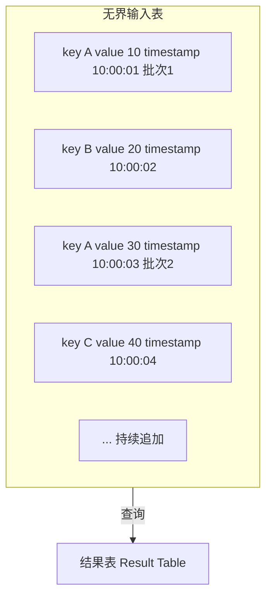
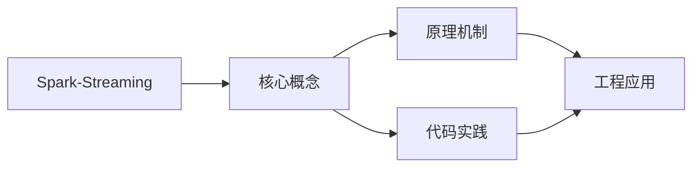
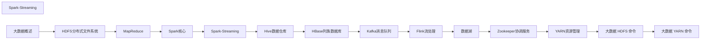

## 1. 学习目标（Bloom 分类）

本节按照布鲁姆教育目标分类学组织学习路径。本文主题为《Spark-Streaming》，属于 大数据 模块，读者可以根据自身阶段选择阅读深度。

记忆层面：能够准确复述本文的核心概念、术语与基本语法或操作步骤，并能够在提问或检索时快速定位对应知识点。能够说出 大数据 的核心概念、常用命令与流程。

理解层面：能够用自己的语言解释核心原理与工作机制，说明概念之间的因果关系，而不是机械记忆结论。能够解释 大数据 的工作原理与设计动机。

应用层面：能够在真实项目或练习场景中运用本文知识解决具体问题，写出正确且可维护的实现。能够独立完成 大数据 的标准操作。

分析层面：能够拆解复杂问题，比较本文主题与相邻概念的异同，识别边界条件与例外情况。能够分析 大数据 使用中的异常与边界。

评价层面：能够根据约束条件（性能、可读性、安全、成本）评价不同方案的优劣，做出有依据的技术决策。能够评价 大数据 相关工具与方案。

创造层面：能够把本文知识与其他模块知识组合，设计出新的解决方案或可复用的工程模式。能够把 大数据 融入团队工作流。

通过本节学习，读者应当能够把《Spark-Streaming》纳入自己的知识网络，并与 大数据 模块的其他主题（分布式存储、批处理、流处理、数据仓库）建立关联。

## 2. 历史动机与发展脉络

《Spark-Streaming》是 大数据 领域的重要主题。要真正理解它，需要先了解它解决的问题与演进过程。

大数据指规模超出单机处理能力的数据工程问题：2004 年 Google MapReduce 论文开启分布式计算时代，Hadoop 生态（2006）开源落地。
现代技术版图：存储（HDFS/对象存储/数据湖）、批处理（Spark）、流处理（Flink/Kafka）、数仓（Hive/Doris/ClickHouse）、调度（Airflow）。
湖仓一体（Lakehouse）融合数据湖灵活与数仓治理；云原生数据栈（Snowflake/Databricks）成为主流形态。

回到本文主题：Spark-Streaming 的提出与成熟，正是上述技术背景下的必然产物。早期实现往往以简单可用为目标，随着工程规模扩大，社区逐渐沉淀出标准做法与最佳实践；理解这一脉络，可以帮助读者判断“为什么文档中的推荐写法是现在这个样子”，也能在遇到历史遗留代码时准确识别其设计年代与取舍。


## 3. 形式化定义与核心概念精讲

本节把《Spark-Streaming》涉及的核心概念以“定义 + 讲解”的形式展开。读者应把定义当作工具，把讲解当作理解路径；两者结合才能形成可迁移的知识。

分布式存储：数据分片（shard）与副本（replica），一致性（CAP 权衡）；HDFS 块存储与对象存储。
批处理模型：MapReduce 分而治之；Spark 基于内存 DAG 优化；数据本地性减少传输。
流处理：事件时间与水位线（watermark）、窗口（滚动/滑动/会话）、精确一次语义（exactly-once）。

### 3.1 原文章节逐一精讲

原文档把主题拆分为 23 个小节，下面按顺序给出每一节的导读讲解，随后保留原文细节供精读。

#### 原文精读（完整保留）

# 大数据 Spark Streaming

> **符号约定**：`< >` 必填参数 | `[ ]` 可选参数

---

#### 1. Spark Streaming概述

Spark Streaming 是 Spark 生态中的**微批处理**流计算组件，将实时数据流按时间间隔切分为一系列**离散化流（DStream）**，每批数据作为 RDD 处理。

##### 1.1 微批处理模型

```mermaid
flowchart TD
    S[实时数据流] --> B[t1批次 [0-1s] → RDD1]
    S --> B2[t2批次 [1-2s] → RDD2]
    S --> B3[t3批次 [2-3s] → RDD3]
    S --> B4[t4批次 [3-4s] → RDD4]
```

- **批处理间隔（Batch Interval）**：数据切分的时间窗口（如1秒、5秒）
- **延迟**：秒级（取决于批处理间隔）
- **吞吐量**：高（利用 Spark 批处理引擎）

##### 1.2 DStream抽象

DStream（Discretized Stream）是 Spark Streaming 的核心抽象，表示**连续的数据流**：

```
DStream = RDD序列
DStream[t] = 时间区间 [t, t+interval) 内的数据对应的RDD
```

DStream 操作会转化为底层 RDD 操作：

```
DStream.map(f) → 每个RDD.map(f)
DStream.filter(f) → 每个RDD.filter(f)
DStream.reduceByKey(f) → 每个RDD.reduceByKey(f)
```

#### 2. DStream操作

##### 2.1 转换操作

| 算子          | 说明        | 示例                                   |
| :------------ | :---------- | :------------------------------------- |
| `map`         | 逐元素转换  | `ds.map(x => x * 2)`                   |
| `flatMap`     | 展平转换    | `ds.flatMap(x => x.split(" "))`        |
| `filter`      | 过滤        | `ds.filter(x => x > 0)`                |
| `reduceByKey` | 按Key聚合   | `ds.reduceByKey(_ + _)`                |
| `join`        | 流关联      | `ds1.join(ds2)`                        |
| `transform`   | 任意RDD操作 | `ds.transform(rdd => rdd.sortByKey())` |

##### 2.2 窗口操作

窗口操作基于**滑动窗口**对多个批次的数据进行聚合：

$$\text{Window}(t) = \bigcup_{i=t-\text{windowLength}+1}^{t} \text{DStream}[i]$$

| 参数          | 说明                             |
| :------------ | :------------------------------- |
| windowLength  | 窗口长度（必须为批间隔的整数倍） |
| slideInterval | 滑动间隔（默认等于批间隔）       |

```python
# 每5秒统计最近30秒的词频
wordCounts = words.reduceByKeyAndWindow(
    lambda a, b: a + b,        # reduce函数
    lambda a, b: a - b,        # inverseReduce函数（优化）
    windowDuration=30,         # 窗口长度
    slideDuration=5            # 滑动间隔
)
```

**窗口操作类型**：

| 算子                    | 说明                |
| :---------------------- | :------------------ |
| `window`                | 返回窗口内的DStream |
| `countByWindow`         | 窗口内元素计数      |
| `reduceByWindow`        | 窗口内聚合          |
| `reduceByKeyAndWindow`  | 窗口内按Key聚合     |
| `countByValueAndWindow` | 窗口内按值计数      |

##### 2.3 输出操作

```python
# 打印前10个元素
dstream.pprint()

# 保存到文件
dstream.saveAsTextFiles("prefix", "suffix")

# ForeachRDD：最灵活的输出方式
dstream.foreachRDD(lambda rdd: rdd.foreach(process))
```

#### 3. Structured Streaming

Structured Streaming 是 Spark 2.x 引入的**高级流处理API**，基于 DataFrame/SQL，提供更简洁的编程模型和更强的优化能力。

##### 3.1 核心模型

**连续处理模型**：将流数据视为一个**无界表**，新数据不断追加到表末尾：



##### 3.2 编程示例

```python
# 从Kafka读取
df = spark.readStream \
    .format("kafka") \
    .option("kafka.bootstrap.servers", "localhost:9092") \
    .option("subscribe", "topic1") \
    .load()

# 处理
wordCounts = df.select(
    explode(split(df.value, " ")).alias("word")
).groupBy("word").count()

# 输出
query = wordCounts.writeStream \
    .outputMode("complete") \
    .format("console") \
    .trigger(processingTime="10 seconds") \
    .start()
```

##### 3.3 输出模式

| 模式         | 说明           | 适用场景                 |
| :----------- | :------------- | :----------------------- |
| **Append**   | 只输出新增行   | 无聚合查询、事件时间窗口 |
| **Complete** | 输出整个结果表 | 聚合查询                 |
| **Update**   | 只输出变更行   | 聚合查询、需要增量更新   |

##### 3.4 事件时间与水印

**事件时间（Event Time）**：数据实际产生的时间，而非处理时间。

**水印（Watermark）**：处理迟到数据的机制，设定最大允许延迟：

$$\text{Watermark} = \max(\text{eventTime}) - \text{delayThreshold}$$

```python
df.withWatermark("timestamp", "10 minutes") \
    .groupBy(window("timestamp", "5 minutes", "1 minute")) \
    .count()
```

- 水印之前的数据：正常处理
- 水印之后但未超时的数据：可能更新结果
- 超过水印+延迟的数据：丢弃

#### 4. 容错与Exactly-Once语义

##### 4.1 Checkpoint机制

```python
# 启用Checkpoint
ssc.checkpoint("hdfs://checkpoint-dir")

# Structured Streaming Checkpoint
query = df.writeStream \
    .option("checkpointLocation", "hdfs://checkpoint-dir") \
    .start()
```

Checkpoint 存储：

- 元数据：DStream DAG、配置、操作
- 数据：已处理的 Offset 范围

##### 4.2 语义保证

| 语义          | 说明         | 实现方式          |
| :------------ | :----------- | :---------------- |
| At Most Once  | 最多处理一次 | 不做重试          |
| At Least Once | 至少处理一次 | 重试 + Checkpoint |
| Exactly Once  | 精确一次     | 幂等写入 + 事务   |

**Structured Streaming Exactly-Once**：

- Source 支持 Offset 管理（如 Kafka Commit）
- Sink 支持事务写入
- Checkpoint 记录处理进度

#### 5. 性能调优

##### 5.1 关键参数

| 参数                                            | 说明           | 建议           |
| :---------------------------------------------- | :------------- | :------------- |
| `spark.streaming.batchInterval`                 | 批处理间隔     | 1~5秒          |
| `spark.streaming.backpressure.enabled`          | 背压机制       | true           |
| `spark.streaming.kafka.maxRatePerPartition`     | 每分区最大速率 | 根据吞吐量调整 |
| `spark.streaming.blockInterval`                 | Block间隔      | 200ms          |
| `spark.streaming.receiver.writeAheadLog.enable` | 预写日志       | 生产环境true   |

##### 5.2 调优策略

1. **合理设置批间隔**：确保处理时间 < 批间隔
2. **启用背压**：动态调整数据摄入速率
3. **Kafka Direct Approach**：避免 Receiver 模式的单点瓶颈
4. **序列化优化**：使用 Kryo 序列化
5. **并行度调整**：Receiver 数量 = Kafka 分区数
#### 创建 StreamingContext

**换行写法：初始化 StreamingContext**
`from pyspark.streaming import StreamingContext`
`ssc = StreamingContext(sc, <批次间隔>)`

```python
# 创建 StreamingContext（批次间隔 1 秒）
from pyspark.streaming import StreamingContext

ssc = StreamingContext(sc, batchDuration=1)
```

---

**基本写法：设置检查点**
`ssc.checkpoint(<路径>)`

```python
# 设置检查点目录（用于状态恢复）
ssc.checkpoint("hdfs://namenode:8020/checkpoint")
```

---

#### 数据源

**基本写法：Socket 数据源**
`ssc.socketTextStream(<主机>, <端口>)`

```python
# 从 Socket 接收文本数据
lines = ssc.socketTextStream("localhost", 9999)
```

---

**基本写法：文件流**
`ssc.textFileStream(<目录>)`

```python
# 监控目录中的新文件
lines = ssc.textFileStream("hdfs://namenode:8020/streaming/")
```

---

**换行写法：Kafka 数据源**
`from pyspark.streaming.kafka import KafkaUtils`
`stream = KafkaUtils.createDirectStream(ssc, [<主题>], <kafka参数>)`

```python
# 从 Kafka 接收数据
from pyspark.streaming.kafka import KafkaUtils

kafkaParams = {"metadata.broker.list": "localhost:9092"}
topics = ["my_topic"]
stream = KafkaUtils.createDirectStream(ssc, topics, kafkaParams)
```

---

**换行写法：自定义接收器**
`ssc.receiverStream(<自定义接收器>)`

```python
# 自定义接收器（需继承 Receiver）
from pyspark.streaming.receiver import Receiver

class MyReceiver(Receiver):
    def onStart(self):
        # 启动接收数据的线程
        pass

    def onStop(self):
        # 停止接收
        pass

stream = ssc.receiverStream(MyReceiver())
```

---

#### DStream 操作

**基本写法：map 转换**
`<dstream>.map(<函数>)`

```python
# 对每个元素应用函数
words = lines.map(lambda line: line.split(" "))
```

---

**基本写法：flatMap 转换**
`<dstream>.flatMap(<函数>)`

```python
# 展平结果
words = lines.flatMap(lambda line: line.split(" "))
```

---

**基本写法：filter 过滤**
`<dstream>.filter(<函数>)`

```python
# 过滤
long_words = words.filter(lambda word: len(word) > 3)
```

---

**基本写法：count 计数**
`<dstream>.count()`

```python
# 每批次元素计数
counts = words.count()
```

---

**基本写法：reduce 聚合**
`<dstream>.reduce(<函数>)`

```python
# 每批次聚合
total = numbers.reduce(lambda a, b: a + b)
```

---

**基本写法：countByValue**
`<dstream>.countByValue()`

```python
# 统计每个值的出现次数
word_counts = words.countByValue()
```

---

#### 窗口操作

**基本写法：窗口聚合**
`<dstream>.reduceByWindow(<函数>, <窗口时长>, <滑动间隔>)`

```python
# 窗口聚合（窗口 10 秒，滑动 5 秒）
windowed = numbers.reduceByWindow(
    lambda a, b: a + b,
    windowDuration=10,
    slideDuration=5
)
```

---

**基本写法：窗口计数**
`<dstream>.countByWindow(<窗口时长>, <滑动间隔>)`

```python
# 窗口内计数
windowed_count = words.countByWindow(
    windowDuration=10,
    slideDuration=5
)
```

---

**基本写法：按值窗口计数**
`<dstream>.countByValueAndWindow(<窗口时长>, <滑动间隔>)`

```python
# 窗口内按值计数
windowed_word_count = words.countByValueAndWindow(
    windowDuration=10,
    slideDuration=5
)
```

---

**基本写法：窗口内分组聚合**
`<dstream>.reduceByKeyAndWindow(<函数>, <窗口时长>, <滑动间隔>)`

```python
# 窗口内按键聚合
windowed_counts = pairs.reduceByKeyAndWindow(
    lambda a, b: a + b,
    windowDuration=10,
    slideDuration=5
)
```

---

**基本写法：带反向函数的窗口**
`<dstream>.reduceByKeyAndWindow(<函数>, <反向函数>, <窗口时长>, <滑动间隔>)`

```python
# 高效窗口聚合（增量计算）
windowed_counts = pairs.reduceByKeyAndWindow(
    lambda a, b: a + b,        # 加入新数据
    lambda a, b: a - b,        # 移除旧数据
    windowDuration=10,
    slideDuration=5
)
```

---

#### 状态操作

**基本写法：更新状态**
`<dstream>.updateStateByKey(<更新函数>)`

```python
# 更新状态（需要设置 checkpoint）
def updateFunc(new_values, last_state):
    total = last_state or 0
    for value in new_values:
        total += value
    return total

state_counts = pairs.updateStateByKey(updateFunc)
```

---

**基本写法：mapWithState**
`<dstream>.mapWithState(<状态规范>)`

```python
# 高效状态更新
from pyspark.streaming import State, StateSpec

def mappingFunction(key, value, state):
    total = state.get() or 0
    total += value
    state.update(total)
    return (key, total)

spec = StateSpec.function(mappingFunction)
state_stream = pairs.mapWithState(spec)
```

---

#### 输出操作

**基本写法：打印**
`<dstream>.pprint([<行数>])`

```python
# 打印前 10 条
result.pprint()
# 打印前 20 条
result.pprint(20)
```

---

**基本写法：保存为文本文件**
`<dstream>.saveAsTextFiles(<前缀>, [<后缀>])`

```python
# 保存到文件（每批次一个目录）
result.saveAsTextFiles("output/streaming", "txt")
```

---

**换行写法：foreachRDD 输出**
`<dstream>.foreachRDD(<函数>)`

```python
# 对每个 RDD 执行自定义操作
def process(rdd):
    if not rdd.isEmpty():
        df = spark.createDataFrame(rdd)
        df.write.mode("append").parquet("output/")

result.foreachRDD(process)
```

---

**换行写法：foreachRDD 写入数据库**
`<dstream>.foreachRDD(<函数>)`

```python
# 将结果写入 MySQL
def save_to_mysql(rdd):
    if not rdd.isEmpty():
        pdf = rdd.toDF().toPandas()
        pdf.to_sql("results", engine, if_exists="append", index=False)

result.foreachRDD(save_to_mysql)
```

---

#### DStream 转换

**基本写法：转换为 RDD 操作**
`<dstream>.transform(<函数>)`

```python
# 在 DStream 上应用 RDD 操作
sorted_stream = dstream.transform(lambda rdd: rdd.sortBy(lambda x: x[1], False))
```

---

**基本写法：连接静态数据**
`<dstream>.transformWith(<函数>, <静态RDD>)`

```python
# 将流数据与静态 RDD 连接
static_data = sc.parallelize([("apple", "水果"), ("banana", "水果")])
enriched = dstream.transformWith(
    lambda rdd, static: rdd.join(static),
    static_data
)
```

---

#### 启动与停止

**基本写法：启动流处理**
`ssc.start()`

```python
# 启动流处理
ssc.start()
```

---

**基本写法：等待终止**
`ssc.awaitTermination()`

```python
# 等待作业终止
ssc.awaitTermination()
```

---

**基本写法：等待终止或超时**
`ssc.awaitTerminationOrTimeout(<超时秒数>)`

```python
# 等待 60 秒或终止
ssc.awaitTerminationOrTimeout(60)
```

---

**基本写法：停止流处理**
`ssc.stop([stopSparkContext], [stopGraceFully])`

```python
# 优雅停止
ssc.stop(stopSparkContext=True, stopGracefully=True)
```

---

#### Structured Streaming

**换行写法：创建流式 DataFrame**
`stream = spark.readStream.format(<格式>).load(<路径>)`

```python
# 使用 Structured Streaming
stream = spark.readStream \
    .format("kafka") \
    .option("kafka.bootstrap.servers", "localhost:9092") \
    .option("subscribe", "my_topic") \
    .load()
```

---

**基本写法：Socket 数据源**
`spark.readStream.format("socket").option("host", ...).option("port", ...).load()`

```python
# Socket 数据源
lines = spark.readStream \
    .format("socket") \
    .option("host", "localhost") \
    .option("port", 9999) \
    .load()
```

---

**基本写法：文件数据源**
`spark.readStream.format("<格式>").load(<路径>)`

```python
# 监控 CSV 文件目录
stream = spark.readStream \
    .format("csv") \
    .option("header", True) \
    .schema(schema) \
    .load("data/")
```

---

**基本写法：流式聚合**
`<stream>.groupBy(<列>).agg(<聚合函数>)`

```python
# 流式聚合
from pyspark.sql import functions as F

word_counts = lines.groupBy("word").agg(F.count("*").alias("count"))
```

---

**换行写法：输出查询**
`query = <stream>.writeStream.format(<格式>).outputMode(<模式>).start()`

```python
# 启动输出查询
query = word_counts.writeStream \
    .format("console") \
    .outputMode("complete") \
    .start()

query.awaitTermination()
```

---

**基本写法：输出模式**
`.outputMode(<模式>)`

```python
# 输出模式
# append: 仅输出新行（默认）
# complete: 输出所有结果
# update: 仅输出变化的行
query = stream.writeStream.outputMode("update").format("console").start()
```

---

**基本写法：触发器**
`.trigger(processingTime=<间隔>)`

```python
# 设置触发器
from pyspark.sql.streaming import Trigger

query = stream.writeStream \
    .trigger(processingTime="10 seconds") \
    .format("console") \
    .start()
```

---

**基本写法：检查点**
`.option("checkpointLocation", <路径>)`

```python
# 设置检查点
query = stream.writeStream \
    .option("checkpointLocation", "checkpoint/") \
    .format("parquet") \
    .start("output/")
```

---

**基本写法：水印**
`<stream>.withWatermark(<时间列>, <延迟阈值>)`

```python
# 设置水印（处理迟到数据）
from pyspark.sql import functions as F

result = stream \
    .withWatermark("timestamp", "10 minutes") \
    .groupBy(F.window("timestamp", "5 minutes"), "word") \
    .count()
```
#### 数据库操作

**基本写法：创建数据库**
`CREATE DATABASE [IF NOT EXISTS] <数据库名>`

```sql
-- 创建数据库
CREATE DATABASE IF NOT EXISTS my_db;
```

---

**基本写法：指定位置**
`CREATE DATABASE <数据库名> LOCATION <路径>`

```sql
-- 指定数据库存储位置
CREATE DATABASE my_db LOCATION '/user/hadoop/my_db';
```

---

**基本写法：查看数据库**
`SHOW DATABASES`

```sql
-- 查看所有数据库
SHOW DATABASES;
```

---

**基本写法：使用数据库**
`USE <数据库名>`

```sql
-- 切换数据库
USE my_db;
```

---

**基本写法：删除数据库**
`DROP DATABASE [IF EXISTS] <数据库名> [CASCADE]`

```sql
-- 删除空数据库
DROP DATABASE IF EXISTS my_db;
-- 级联删除（含表）
DROP DATABASE IF EXISTS my_db CASCADE;
```

---

#### 表操作

**基本写法：创建表**
`CREATE TABLE <表名> (<列名> <类型>, ...)`

```sql
-- 创建表
CREATE TABLE employees (
    id INT,
    name STRING,
    age INT,
    salary DOUBLE
);
```

---

**基本写法：使用 Parquet 格式**
`CREATE TABLE <表名> (<列定义>) USING PARQUET`

```sql
-- 创建 Parquet 格式表
CREATE TABLE employees (
    id INT,
    name STRING,
    salary DOUBLE
) USING PARQUET;
```

---

**基本写法：使用 ORC 格式**
`CREATE TABLE <表名> (<列定义>) USING ORC`

```sql
-- 创建 ORC 格式表
CREATE TABLE employees (
    id INT,
    name STRING
) USING ORC;
```

---

**基本写法：分区表**
`CREATE TABLE <表名> (<列定义>) PARTITIONED BY (<分区列>)`

```sql
-- 创建分区表
CREATE TABLE sales (
    id INT,
    amount DOUBLE
) PARTITIONED BY (year INT, month INT);
```

---

**基本写法：分桶表**
`CREATE TABLE <表名> (<列定义>) CLUSTERED BY (<列>) INTO <n> BUCKETS`

```sql
-- 创建分桶表
CREATE TABLE users (
    id INT,
    name STRING
) CLUSTERED BY (id) INTO 4 BUCKETS;
```

---

**基本写法：外部表**
`CREATE EXTERNAL TABLE <表名> (<列定义>) LOCATION <路径>`

```sql
-- 创建外部表
CREATE EXTERNAL TABLE logs (
    id INT,
    message STRING
) LOCATION '/user/hadoop/logs';
```

---

**基本写法：查看表**
`SHOW TABLES [IN <数据库>]`

```sql
-- 查看当前数据库的表
SHOW TABLES;
-- 查看指定数据库的表
SHOW TABLES IN my_db;
```

---

**基本写法：查看表结构**
`DESCRIBE <表名>`

```sql
-- 查看表结构
DESCRIBE employees;
-- 查看详细信息
DESCRIBE FORMATTED employees;
```

---

**基本写法：删除表**
`DROP TABLE [IF EXISTS] <表名>`

```sql
-- 删除表
DROP TABLE IF EXISTS employees;
```

---

**基本写法：重命名表**
`ALTER TABLE <旧表名> RENAME TO <新表名>`

```sql
-- 重命名表
ALTER TABLE employees RENAME TO staff;
```

---

#### 数据查询

**基本写法：基本查询**
`SELECT <列1>, <列2> FROM <表名>`

```sql
-- 查询所有列
SELECT * FROM employees;
-- 查询指定列
SELECT name, salary FROM employees;
```

---

**基本写法：条件查询**
`SELECT * FROM <表名> WHERE <条件>`

```sql
-- 条件查询
SELECT * FROM employees WHERE age > 30;
SELECT * FROM employees WHERE city = '北京' AND salary > 10000;
```

---

**基本写法：排序**
`SELECT * FROM <表名> ORDER BY <列> [DESC]`

```sql
-- 排序
SELECT * FROM employees ORDER BY salary DESC;
-- 多列排序
SELECT * FROM employees ORDER BY city, salary DESC;
```

---

**基本写法：限制结果**
`SELECT * FROM <表名> LIMIT <n>`

```sql
-- 限制返回行数
SELECT * FROM employees LIMIT 10;
```

---

**基本写法：去重**
`SELECT DISTINCT <列> FROM <表名>`

```sql
-- 去重查询
SELECT DISTINCT city FROM employees;
```

---

**基本写法：分组聚合**
`SELECT <列>, <聚合函数>(<列>) FROM <表名> GROUP BY <列>`

```sql
-- 分组聚合
SELECT city, AVG(salary) as avg_salary, COUNT(*) as cnt
FROM employees
GROUP BY city;
```

---

**基本写法：Having 过滤**
`SELECT <列>, <聚合函数>(<列>) FROM <表名> GROUP BY <列> HAVING <条件>`

```sql
-- 分组后过滤
SELECT city, AVG(salary) as avg_salary
FROM employees
GROUP BY city
HAVING AVG(salary) > 10000;
```

---

#### Join 查询

**基本写法：内连接**
`SELECT * FROM <表1> INNER JOIN <表2> ON <条件>`

```sql
-- 内连接
SELECT e.name, d.dept_name
FROM employees e
INNER JOIN departments d ON e.dept_id = d.id;
```

---

**基本写法：左连接**
`SELECT * FROM <表1> LEFT JOIN <表2> ON <条件>`

```sql
-- 左外连接
SELECT e.name, d.dept_name
FROM employees e
LEFT JOIN departments d ON e.dept_id = d.id;
```

---

**基本写法：右连接**
`SELECT * FROM <表1> RIGHT JOIN <表2> ON <条件>`

```sql
-- 右外连接
SELECT e.name, d.dept_name
FROM employees e
RIGHT JOIN departments d ON e.dept_id = d.id;
```

---

**基本写法：全连接**
`SELECT * FROM <表1> FULL OUTER JOIN <表2> ON <条件>`

```sql
-- 全外连接
SELECT e.name, d.dept_name
FROM employees e
FULL OUTER JOIN departments d ON e.dept_id = d.id;
```

---

#### 子查询

**基本写法：WHERE 子查询**
`SELECT * FROM <表名> WHERE <列> IN (SELECT ...)`

```sql
-- 子查询
SELECT * FROM employees
WHERE dept_id IN (SELECT id FROM departments WHERE name = '技术部');
```

---

**基本写法：EXISTS 子查询**
`SELECT * FROM <表1> WHERE EXISTS (SELECT ... WHERE ...)`

```sql
-- EXISTS 子查询
SELECT * FROM employees e
WHERE EXISTS (SELECT 1 FROM departments d WHERE d.id = e.dept_id AND d.name = '技术部');
```

---

**基本写法：CTE 公共表表达式**
`WITH <表名> AS (SELECT ...) SELECT * FROM <表名>`

```sql
-- CTE 公共表表达式
WITH dept_avg AS (
    SELECT dept_id, AVG(salary) as avg_sal
    FROM employees
    GROUP BY dept_id
)
SELECT e.name, e.salary, d.avg_sal
FROM employees e
JOIN dept_avg d ON e.dept_id = d.dept_id
WHERE e.salary > d.avg_sal;
```

---

#### 窗口函数

**基本写法：行号**
`ROW_NUMBER() OVER (PARTITION BY <列> ORDER BY <列>)`

```sql
-- 按部门分组按薪资降序编号
SELECT name, dept_id, salary,
    ROW_NUMBER() OVER (PARTITION BY dept_id ORDER BY salary DESC) as rank
FROM employees;
```

---

**基本写法：排名**
`RANK() OVER (PARTITION BY <列> ORDER BY <列>)`

```sql
-- 排名（有并列，有间隔）
SELECT name, salary,
    RANK() OVER (ORDER BY salary DESC) as rank
FROM employees;
```

---

**基本写法：密集排名**
`DENSE_RANK() OVER (PARTITION BY <列> ORDER BY <列>)`

```sql
-- 密集排名（有并列，无间隔）
SELECT name, salary,
    DENSE_RANK() OVER (ORDER BY salary DESC) as dense_rank
FROM employees;
```

---

**基本写法：累积求和**
`SUM(<列>) OVER (PARTITION BY <列> ORDER BY <列>)`

```sql
-- 累积求和
SELECT name, dept_id, salary,
    SUM(salary) OVER (PARTITION BY dept_id ORDER BY salary) as cumsum
FROM employees;
```

---

**基本写法：偏移函数**
`LAG(<列>, <偏移>) OVER (ORDER BY <列>)`

```sql
-- 获取前一行的值
SELECT name, salary,
    LAG(salary, 1) OVER (ORDER BY salary) as prev_salary
FROM employees;
```

---

#### 数据插入

**基本写法：插入数据**
`INSERT INTO <表名> VALUES (<值1>, <值2>, ...)`

```sql
-- 插入单行
INSERT INTO employees VALUES (1, 'Alice', 30, 15000.0);
-- 插入多行
INSERT INTO employees VALUES
    (2, 'Bob', 25, 12000.0),
    (3, 'Charlie', 35, 20000.0);
```

---

**基本写法：从查询插入**
`INSERT INTO <表名> SELECT ...`

```sql
-- 从查询结果插入
INSERT INTO high_salary
SELECT * FROM employees WHERE salary > 15000;
```

---

**基本写法：覆盖插入**
`INSERT OVERWRITE TABLE <表名> SELECT ...`

```sql
-- 覆盖表数据
INSERT OVERWRITE TABLE employees
SELECT * FROM temp_employees;
```

---

**基本写法：插入分区**
`INSERT INTO <表名> PARTITION (<分区列>=<值>) SELECT ...`

```sql
-- 插入指定分区
INSERT INTO sales PARTITION (year=2024, month=1)
SELECT id, amount FROM temp_sales;
```

---

#### 视图

**基本写法：创建视图**
`CREATE VIEW <视图名> AS SELECT ...`

```sql
-- 创建视图
CREATE VIEW high_salary_employees AS
SELECT * FROM employees WHERE salary > 15000;
```

---

**基本写法：创建临时视图**
`CREATE TEMP VIEW <视图名> AS SELECT ...`

```sql
-- 创建临时视图（会话级别）
CREATE TEMP VIEW dept_stats AS
SELECT dept_id, AVG(salary) as avg_sal FROM employees GROUP BY dept_id;
```

---

**基本写法：删除视图**
`DROP VIEW [IF EXISTS] <视图名>`

```sql
-- 删除视图
DROP VIEW IF EXISTS high_salary_employees;
```

---

#### 函数使用

**基本写法：字符串函数**
`SELECT <函数>(<列>) FROM <表名>`

```sql
-- 字符串函数
SELECT UPPER(name), LENGTH(name), SUBSTRING(name, 1, 3) FROM employees;
SELECT CONCAT(name, '-', city) as info FROM employees;
```

---

**基本写法：日期函数**
`SELECT <日期函数>(<列>) FROM <表名>`

```sql
-- 日期函数
SELECT CURRENT_DATE(), CURRENT_TIMESTAMP();
SELECT YEAR(hire_date), MONTH(hire_date), DAY(hire_date) FROM employees;
SELECT DATEDIFF(CURRENT_DATE(), hire_date) as days FROM employees;
```

---

**基本写法：数学函数**
`SELECT <数学函数>(<列>) FROM <表名>`

```sql
-- 数学函数
SELECT ROUND(salary, 2), ABS(salary - avg_sal), SQRT(salary) FROM employees;
```

---

**基本写法：条件函数**
`SELECT CASE WHEN <条件> THEN <值> ELSE <值> END FROM <表名>`

```sql
-- 条件表达式
SELECT name, salary,
    CASE
        WHEN salary > 20000 THEN '高薪'
        WHEN salary > 10000 THEN '中薪'
        ELSE '低薪'
    END as level
FROM employees;
```


### 3.2 概念关系图

下面用 Mermaid 图表达本文核心概念之间的关系，帮助读者建立整体图景：



图中展示的是本文知识的结构化关系：核心概念是入口，原理机制解释“为什么”，代码实践演示“怎么做”，工程应用回答“何时用”。读者学习时可以把每个小节的内容挂接到对应节点上。

## 4. 理论推导与原理解析

本节深入《Spark-Streaming》背后的原理。理论部分不求面面俱到，而是聚焦“能解释现象、能指导实践”的关键推导。

分布式存储：数据分片（shard）与副本（replica），一致性（CAP 权衡）；HDFS 块存储与对象存储。
批处理模型：MapReduce 分而治之；Spark 基于内存 DAG 优化；数据本地性减少传输。
流处理：事件时间与水位线（watermark）、窗口（滚动/滑动/会话）、精确一次语义（exactly-once）。
数据仓库：维度建模（星型/雪花）、ETL/ELT、分层（ODS/DWD/DWS/ADS）。

需要强调的是，理论推导与工程实践之间存在翻译层：理论给出的是理想化模型与边界条件，工程代码则必须处理真实环境中的例外。读者在学习时应先掌握理论的“标准情形”，再通过陷阱章节了解“非标准情形”。

## 5. 代码示例与逐行讲解

本节把原文中的代码示例系统整理，并为每个示例补充用途说明与讲解。读者不应只浏览代码，而应逐段对照讲解理解设计意图。

### 5.1 示例：1.1 微批处理模型

该示例来自原文《1.1 微批处理模型》小节，用于演示Spark-Streaming相关操作。阅读时请先看代码结构，再看其后的讲解。

```mermaid
flowchart TD
    S[实时数据流] --> B[t1批次 [0-1s] → RDD1]
    S --> B2[t2批次 [1-2s] → RDD2]
    S --> B3[t3批次 [2-3s] → RDD3]
    S --> B4[t4批次 [3-4s] → RDD4]
```

讲解：这段代码演示了本节核心知识点。代码中的关键操作可以归纳为三步：准备（定义或初始化）、执行（核心逻辑）、收尾（释放资源或返回结果）。实际项目中，这三步往往被封装为函数或类，以提升复用性与可测试性。

关键点分析：

该示例共 5 行有效代码，结构以数据或配置为主。阅读时应关注：数据字段的含义、配置项的作用，以及它们与运行行为的对应关系。

进阶思考路径：先尝试修改参数观察行为变化，再把示例中的模式迁移到自己的项目中；每次修改都记录预期与实测差异，这是把示例转化为能力的最快方式。

### 5.2 示例：1.2 DStream抽象

该示例来自原文《1.2 DStream抽象》小节，用于演示Spark-Streaming相关操作。阅读时请先看代码结构，再看其后的讲解。

```text
DStream = RDD序列
DStream[t] = 时间区间 [t, t+interval) 内的数据对应的RDD
```

讲解：这段代码演示了本节核心知识点。代码中的关键操作可以归纳为三步：准备（定义或初始化）、执行（核心逻辑）、收尾（释放资源或返回结果）。实际项目中，这三步往往被封装为函数或类，以提升复用性与可测试性。

关键点分析：

该示例共 2 行有效代码，结构以数据或配置为主。阅读时应关注：数据字段的含义、配置项的作用，以及它们与运行行为的对应关系。

进阶思考路径：先尝试修改参数观察行为变化，再把示例中的模式迁移到自己的项目中；每次修改都记录预期与实测差异，这是把示例转化为能力的最快方式。

### 5.3 示例：1.2 DStream抽象

该示例来自原文《1.2 DStream抽象》小节，用于演示Spark-Streaming相关操作。阅读时请先看代码结构，再看其后的讲解。

```text
DStream.map(f) → 每个RDD.map(f)
DStream.filter(f) → 每个RDD.filter(f)
DStream.reduceByKey(f) → 每个RDD.reduceByKey(f)
```

讲解：这段代码演示了本节核心知识点。代码中的关键操作可以归纳为三步：准备（定义或初始化）、执行（核心逻辑）、收尾（释放资源或返回结果）。实际项目中，这三步往往被封装为函数或类，以提升复用性与可测试性。

关键点分析：

该示例共 3 行有效代码，结构以数据或配置为主。阅读时应关注：数据字段的含义、配置项的作用，以及它们与运行行为的对应关系。

进阶思考路径：先尝试修改参数观察行为变化，再把示例中的模式迁移到自己的项目中；每次修改都记录预期与实测差异，这是把示例转化为能力的最快方式。

### 5.4 示例：2.2 窗口操作

该示例来自原文《2.2 窗口操作》小节，用于演示Spark-Streaming相关操作。阅读时请先看代码结构，再看其后的讲解。

```python
# 每5秒统计最近30秒的词频
wordCounts = words.reduceByKeyAndWindow(
    lambda a, b: a + b,        # reduce函数
    lambda a, b: a - b,        # inverseReduce函数（优化）
    windowDuration=30,         # 窗口长度
    slideDuration=5            # 滑动间隔
)
```

讲解：这段代码演示了本节核心知识点。代码中的关键操作可以归纳为三步：准备（定义或初始化）、执行（核心逻辑）、收尾（释放资源或返回结果）。实际项目中，这三步往往被封装为函数或类，以提升复用性与可测试性。

关键点分析：

该示例共 7 行有效代码，结构以数据或配置为主。阅读时应关注：数据字段的含义、配置项的作用，以及它们与运行行为的对应关系。

进阶思考路径：先尝试修改参数观察行为变化，再把示例中的模式迁移到自己的项目中；每次修改都记录预期与实测差异，这是把示例转化为能力的最快方式。

### 5.5 示例：2.3 输出操作

该示例来自原文《2.3 输出操作》小节，用于演示Spark-Streaming相关操作。阅读时请先看代码结构，再看其后的讲解。

```python
# 打印前10个元素
dstream.pprint()

# 保存到文件
dstream.saveAsTextFiles("prefix", "suffix")

# ForeachRDD：最灵活的输出方式
dstream.foreachRDD(lambda rdd: rdd.foreach(process))
```

讲解：这段代码演示了本节核心知识点。代码中的关键操作可以归纳为三步：准备（定义或初始化）、执行（核心逻辑）、收尾（释放资源或返回结果）。实际项目中，这三步往往被封装为函数或类，以提升复用性与可测试性。

关键点分析：

该示例共 6 行有效代码，结构以数据或配置为主。阅读时应关注：数据字段的含义、配置项的作用，以及它们与运行行为的对应关系。

进阶思考路径：先尝试修改参数观察行为变化，再把示例中的模式迁移到自己的项目中；每次修改都记录预期与实测差异，这是把示例转化为能力的最快方式。

### 5.6 示例：3.1 核心模型

该示例来自原文《3.1 核心模型》小节，用于演示Spark-Streaming相关操作。阅读时请先看代码结构，再看其后的讲解。


讲解：这段代码演示了本节核心知识点。代码中的关键操作可以归纳为三步：准备（定义或初始化）、执行（核心逻辑）、收尾（释放资源或返回结果）。实际项目中，这三步往往被封装为函数或类，以提升复用性与可测试性。

关键点分析：

该示例共 9 行有效代码，结构以数据或配置为主。阅读时应关注：数据字段的含义、配置项的作用，以及它们与运行行为的对应关系。

进阶思考路径：先尝试修改参数观察行为变化，再把示例中的模式迁移到自己的项目中；每次修改都记录预期与实测差异，这是把示例转化为能力的最快方式。

### 5.7 示例：3.2 编程示例

该示例来自原文《3.2 编程示例》小节，用于演示Spark-Streaming相关操作。阅读时请先看代码结构，再看其后的讲解。

```python
# 从Kafka读取
df = spark.readStream \
    .format("kafka") \
    .option("kafka.bootstrap.servers", "localhost:9092") \
    .option("subscribe", "topic1") \
    .load()

# 处理
wordCounts = df.select(
    explode(split(df.value, " ")).alias("word")
).groupBy("word").count()

# 输出
query = wordCounts.writeStream \
    .outputMode("complete") \
    .format("console") \
    .trigger(processingTime="10 seconds") \
    .start()
```

讲解：这段代码演示了本节核心知识点。代码中的关键操作可以归纳为三步：准备（定义或初始化）、执行（核心逻辑）、收尾（释放资源或返回结果）。实际项目中，这三步往往被封装为函数或类，以提升复用性与可测试性。

关键点分析：

该示例共 16 行有效代码，结构以数据或配置为主。阅读时应关注：数据字段的含义、配置项的作用，以及它们与运行行为的对应关系。

进阶思考路径：先尝试修改参数观察行为变化，再把示例中的模式迁移到自己的项目中；每次修改都记录预期与实测差异，这是把示例转化为能力的最快方式。

### 5.8 示例：3.4 事件时间与水印

该示例来自原文《3.4 事件时间与水印》小节，用于演示Spark-Streaming相关操作。阅读时请先看代码结构，再看其后的讲解。

```python
df.withWatermark("timestamp", "10 minutes") \
    .groupBy(window("timestamp", "5 minutes", "1 minute")) \
    .count()
```

讲解：这段代码演示了本节核心知识点。代码中的关键操作可以归纳为三步：准备（定义或初始化）、执行（核心逻辑）、收尾（释放资源或返回结果）。实际项目中，这三步往往被封装为函数或类，以提升复用性与可测试性。

关键点分析：

该示例共 3 行有效代码，结构以数据或配置为主。阅读时应关注：数据字段的含义、配置项的作用，以及它们与运行行为的对应关系。

进阶思考路径：先尝试修改参数观察行为变化，再把示例中的模式迁移到自己的项目中；每次修改都记录预期与实测差异，这是把示例转化为能力的最快方式。

### 5.9 示例：4.1 Checkpoint机制

该示例来自原文《4.1 Checkpoint机制》小节，用于演示Spark-Streaming相关操作。阅读时请先看代码结构，再看其后的讲解。

```python
# 启用Checkpoint
ssc.checkpoint("hdfs://checkpoint-dir")

# Structured Streaming Checkpoint
query = df.writeStream \
    .option("checkpointLocation", "hdfs://checkpoint-dir") \
    .start()
```

讲解：这段代码演示了本节核心知识点。代码中的关键操作可以归纳为三步：准备（定义或初始化）、执行（核心逻辑）、收尾（释放资源或返回结果）。实际项目中，这三步往往被封装为函数或类，以提升复用性与可测试性。

关键点分析：

该示例共 6 行有效代码，结构以数据或配置为主。阅读时应关注：数据字段的含义、配置项的作用，以及它们与运行行为的对应关系。

进阶思考路径：先尝试修改参数观察行为变化，再把示例中的模式迁移到自己的项目中；每次修改都记录预期与实测差异，这是把示例转化为能力的最快方式。

### 5.10 示例：创建 StreamingContext

该示例来自原文《创建 StreamingContext》小节，用于演示Spark-Streaming相关操作。阅读时请先看代码结构，再看其后的讲解。

```python
# 创建 StreamingContext（批次间隔 1 秒）
from pyspark.streaming import StreamingContext

ssc = StreamingContext(sc, batchDuration=1)
```

讲解：这段代码演示了本节核心知识点。代码中的关键操作可以归纳为三步：准备（定义或初始化）、执行（核心逻辑）、收尾（释放资源或返回结果）。实际项目中，这三步往往被封装为函数或类，以提升复用性与可测试性。

关键点分析：

该示例共 3 行有效代码，包含 2 类关键结构（import、from）。其中：

- 入口与初始化部分负责建立上下文，对应实际项目中的启动或装配逻辑；
- 核心逻辑部分体现本文主题的主要操作，是阅读时最需要对照讲解理解的部分；
- 输出或返回部分把结果交给调用方，注意其类型与边界条件。

进阶思考路径：先尝试修改参数观察行为变化，再把示例中的模式迁移到自己的项目中；每次修改都记录预期与实测差异，这是把示例转化为能力的最快方式。

### 5.11 示例：创建 StreamingContext

该示例来自原文《创建 StreamingContext》小节，用于演示Spark-Streaming相关操作。阅读时请先看代码结构，再看其后的讲解。

```python
# 设置检查点目录（用于状态恢复）
ssc.checkpoint("hdfs://namenode:8020/checkpoint")
```

讲解：这段代码演示了本节核心知识点。代码中的关键操作可以归纳为三步：准备（定义或初始化）、执行（核心逻辑）、收尾（释放资源或返回结果）。实际项目中，这三步往往被封装为函数或类，以提升复用性与可测试性。

关键点分析：

该示例共 2 行有效代码，结构以数据或配置为主。阅读时应关注：数据字段的含义、配置项的作用，以及它们与运行行为的对应关系。

进阶思考路径：先尝试修改参数观察行为变化，再把示例中的模式迁移到自己的项目中；每次修改都记录预期与实测差异，这是把示例转化为能力的最快方式。

### 5.12 示例：数据源

该示例来自原文《数据源》小节，用于演示Spark-Streaming相关操作。阅读时请先看代码结构，再看其后的讲解。

```python
# 从 Socket 接收文本数据
lines = ssc.socketTextStream("localhost", 9999)
```

讲解：这段代码演示了本节核心知识点。代码中的关键操作可以归纳为三步：准备（定义或初始化）、执行（核心逻辑）、收尾（释放资源或返回结果）。实际项目中，这三步往往被封装为函数或类，以提升复用性与可测试性。

关键点分析：

该示例共 2 行有效代码，结构以数据或配置为主。阅读时应关注：数据字段的含义、配置项的作用，以及它们与运行行为的对应关系。

进阶思考路径：先尝试修改参数观察行为变化，再把示例中的模式迁移到自己的项目中；每次修改都记录预期与实测差异，这是把示例转化为能力的最快方式。

### 5.13 示例：数据源

该示例来自原文《数据源》小节，用于演示Spark-Streaming相关操作。阅读时请先看代码结构，再看其后的讲解。

```python
# 监控目录中的新文件
lines = ssc.textFileStream("hdfs://namenode:8020/streaming/")
```

讲解：这段代码演示了本节核心知识点。代码中的关键操作可以归纳为三步：准备（定义或初始化）、执行（核心逻辑）、收尾（释放资源或返回结果）。实际项目中，这三步往往被封装为函数或类，以提升复用性与可测试性。

关键点分析：

该示例共 2 行有效代码，结构以数据或配置为主。阅读时应关注：数据字段的含义、配置项的作用，以及它们与运行行为的对应关系。

进阶思考路径：先尝试修改参数观察行为变化，再把示例中的模式迁移到自己的项目中；每次修改都记录预期与实测差异，这是把示例转化为能力的最快方式。

### 5.14 示例：数据源

该示例来自原文《数据源》小节，用于演示Spark-Streaming相关操作。阅读时请先看代码结构，再看其后的讲解。

```python
# 从 Kafka 接收数据
from pyspark.streaming.kafka import KafkaUtils

kafkaParams = {"metadata.broker.list": "localhost:9092"}
topics = ["my_topic"]
stream = KafkaUtils.createDirectStream(ssc, topics, kafkaParams)
```

讲解：这段代码演示了本节核心知识点。代码中的关键操作可以归纳为三步：准备（定义或初始化）、执行（核心逻辑）、收尾（释放资源或返回结果）。实际项目中，这三步往往被封装为函数或类，以提升复用性与可测试性。

关键点分析：

该示例共 5 行有效代码，包含 2 类关键结构（import、from）。其中：

- 入口与初始化部分负责建立上下文，对应实际项目中的启动或装配逻辑；
- 核心逻辑部分体现本文主题的主要操作，是阅读时最需要对照讲解理解的部分；
- 输出或返回部分把结果交给调用方，注意其类型与边界条件。

进阶思考路径：先尝试修改参数观察行为变化，再把示例中的模式迁移到自己的项目中；每次修改都记录预期与实测差异，这是把示例转化为能力的最快方式。

### 5.15 示例：数据源

该示例来自原文《数据源》小节，用于演示Spark-Streaming相关操作。阅读时请先看代码结构，再看其后的讲解。

```python
# 自定义接收器（需继承 Receiver）
from pyspark.streaming.receiver import Receiver

class MyReceiver(Receiver):
    def onStart(self):
        # 启动接收数据的线程
        pass

    def onStop(self):
        # 停止接收
        pass

stream = ssc.receiverStream(MyReceiver())
```

讲解：这段代码演示了本节核心知识点。代码中的关键操作可以归纳为三步：准备（定义或初始化）、执行（核心逻辑）、收尾（释放资源或返回结果）。实际项目中，这三步往往被封装为函数或类，以提升复用性与可测试性。

关键点分析：

该示例共 10 行有效代码，包含 4 类关键结构（class、def、import、from）。其中：

- 入口与初始化部分负责建立上下文，对应实际项目中的启动或装配逻辑；
- 核心逻辑部分体现本文主题的主要操作，是阅读时最需要对照讲解理解的部分；
- 输出或返回部分把结果交给调用方，注意其类型与边界条件。

进阶思考路径：先尝试修改参数观察行为变化，再把示例中的模式迁移到自己的项目中；每次修改都记录预期与实测差异，这是把示例转化为能力的最快方式。

### 5.16 示例：DStream 操作

该示例来自原文《DStream 操作》小节，用于演示Spark-Streaming相关操作。阅读时请先看代码结构，再看其后的讲解。

```python
# 对每个元素应用函数
words = lines.map(lambda line: line.split(" "))
```

讲解：这段代码演示了本节核心知识点。代码中的关键操作可以归纳为三步：准备（定义或初始化）、执行（核心逻辑）、收尾（释放资源或返回结果）。实际项目中，这三步往往被封装为函数或类，以提升复用性与可测试性。

关键点分析：

该示例共 2 行有效代码，结构以数据或配置为主。阅读时应关注：数据字段的含义、配置项的作用，以及它们与运行行为的对应关系。

进阶思考路径：先尝试修改参数观察行为变化，再把示例中的模式迁移到自己的项目中；每次修改都记录预期与实测差异，这是把示例转化为能力的最快方式。

### 5.17 示例：DStream 操作

该示例来自原文《DStream 操作》小节，用于演示Spark-Streaming相关操作。阅读时请先看代码结构，再看其后的讲解。

```python
# 展平结果
words = lines.flatMap(lambda line: line.split(" "))
```

讲解：这段代码演示了本节核心知识点。代码中的关键操作可以归纳为三步：准备（定义或初始化）、执行（核心逻辑）、收尾（释放资源或返回结果）。实际项目中，这三步往往被封装为函数或类，以提升复用性与可测试性。

关键点分析：

该示例共 2 行有效代码，结构以数据或配置为主。阅读时应关注：数据字段的含义、配置项的作用，以及它们与运行行为的对应关系。

进阶思考路径：先尝试修改参数观察行为变化，再把示例中的模式迁移到自己的项目中；每次修改都记录预期与实测差异，这是把示例转化为能力的最快方式。

### 5.18 示例：DStream 操作

该示例来自原文《DStream 操作》小节，用于演示Spark-Streaming相关操作。阅读时请先看代码结构，再看其后的讲解。

```python
# 过滤
long_words = words.filter(lambda word: len(word) > 3)
```

讲解：这段代码演示了本节核心知识点。代码中的关键操作可以归纳为三步：准备（定义或初始化）、执行（核心逻辑）、收尾（释放资源或返回结果）。实际项目中，这三步往往被封装为函数或类，以提升复用性与可测试性。

关键点分析：

该示例共 2 行有效代码，结构以数据或配置为主。阅读时应关注：数据字段的含义、配置项的作用，以及它们与运行行为的对应关系。

进阶思考路径：先尝试修改参数观察行为变化，再把示例中的模式迁移到自己的项目中；每次修改都记录预期与实测差异，这是把示例转化为能力的最快方式。

### 5.19 示例：DStream 操作

该示例来自原文《DStream 操作》小节，用于演示Spark-Streaming相关操作。阅读时请先看代码结构，再看其后的讲解。

```python
# 每批次元素计数
counts = words.count()
```

讲解：这段代码演示了本节核心知识点。代码中的关键操作可以归纳为三步：准备（定义或初始化）、执行（核心逻辑）、收尾（释放资源或返回结果）。实际项目中，这三步往往被封装为函数或类，以提升复用性与可测试性。

关键点分析：

该示例共 2 行有效代码，结构以数据或配置为主。阅读时应关注：数据字段的含义、配置项的作用，以及它们与运行行为的对应关系。

进阶思考路径：先尝试修改参数观察行为变化，再把示例中的模式迁移到自己的项目中；每次修改都记录预期与实测差异，这是把示例转化为能力的最快方式。

### 5.20 示例：DStream 操作

该示例来自原文《DStream 操作》小节，用于演示Spark-Streaming相关操作。阅读时请先看代码结构，再看其后的讲解。

```python
# 每批次聚合
total = numbers.reduce(lambda a, b: a + b)
```

讲解：这段代码演示了本节核心知识点。代码中的关键操作可以归纳为三步：准备（定义或初始化）、执行（核心逻辑）、收尾（释放资源或返回结果）。实际项目中，这三步往往被封装为函数或类，以提升复用性与可测试性。

关键点分析：

该示例共 2 行有效代码，结构以数据或配置为主。阅读时应关注：数据字段的含义、配置项的作用，以及它们与运行行为的对应关系。

进阶思考路径：先尝试修改参数观察行为变化，再把示例中的模式迁移到自己的项目中；每次修改都记录预期与实测差异，这是把示例转化为能力的最快方式。

### 5.21 示例：DStream 操作

该示例来自原文《DStream 操作》小节，用于演示Spark-Streaming相关操作。阅读时请先看代码结构，再看其后的讲解。

```python
# 统计每个值的出现次数
word_counts = words.countByValue()
```

讲解：这段代码演示了本节核心知识点。代码中的关键操作可以归纳为三步：准备（定义或初始化）、执行（核心逻辑）、收尾（释放资源或返回结果）。实际项目中，这三步往往被封装为函数或类，以提升复用性与可测试性。

关键点分析：

该示例共 2 行有效代码，结构以数据或配置为主。阅读时应关注：数据字段的含义、配置项的作用，以及它们与运行行为的对应关系。

进阶思考路径：先尝试修改参数观察行为变化，再把示例中的模式迁移到自己的项目中；每次修改都记录预期与实测差异，这是把示例转化为能力的最快方式。

### 5.22 示例：窗口操作

该示例来自原文《窗口操作》小节，用于演示Spark-Streaming相关操作。阅读时请先看代码结构，再看其后的讲解。

```python
# 窗口聚合（窗口 10 秒，滑动 5 秒）
windowed = numbers.reduceByWindow(
    lambda a, b: a + b,
    windowDuration=10,
    slideDuration=5
)
```

讲解：这段代码演示了本节核心知识点。代码中的关键操作可以归纳为三步：准备（定义或初始化）、执行（核心逻辑）、收尾（释放资源或返回结果）。实际项目中，这三步往往被封装为函数或类，以提升复用性与可测试性。

关键点分析：

该示例共 6 行有效代码，结构以数据或配置为主。阅读时应关注：数据字段的含义、配置项的作用，以及它们与运行行为的对应关系。

进阶思考路径：先尝试修改参数观察行为变化，再把示例中的模式迁移到自己的项目中；每次修改都记录预期与实测差异，这是把示例转化为能力的最快方式。

### 5.23 示例：窗口操作

该示例来自原文《窗口操作》小节，用于演示Spark-Streaming相关操作。阅读时请先看代码结构，再看其后的讲解。

```python
# 窗口内计数
windowed_count = words.countByWindow(
    windowDuration=10,
    slideDuration=5
)
```

讲解：这段代码演示了本节核心知识点。代码中的关键操作可以归纳为三步：准备（定义或初始化）、执行（核心逻辑）、收尾（释放资源或返回结果）。实际项目中，这三步往往被封装为函数或类，以提升复用性与可测试性。

关键点分析：

该示例共 5 行有效代码，结构以数据或配置为主。阅读时应关注：数据字段的含义、配置项的作用，以及它们与运行行为的对应关系。

进阶思考路径：先尝试修改参数观察行为变化，再把示例中的模式迁移到自己的项目中；每次修改都记录预期与实测差异，这是把示例转化为能力的最快方式。

### 5.24 示例：窗口操作

该示例来自原文《窗口操作》小节，用于演示Spark-Streaming相关操作。阅读时请先看代码结构，再看其后的讲解。

```python
# 窗口内按值计数
windowed_word_count = words.countByValueAndWindow(
    windowDuration=10,
    slideDuration=5
)
```

讲解：这段代码演示了本节核心知识点。代码中的关键操作可以归纳为三步：准备（定义或初始化）、执行（核心逻辑）、收尾（释放资源或返回结果）。实际项目中，这三步往往被封装为函数或类，以提升复用性与可测试性。

关键点分析：

该示例共 5 行有效代码，结构以数据或配置为主。阅读时应关注：数据字段的含义、配置项的作用，以及它们与运行行为的对应关系。

进阶思考路径：先尝试修改参数观察行为变化，再把示例中的模式迁移到自己的项目中；每次修改都记录预期与实测差异，这是把示例转化为能力的最快方式。

### 5.25 示例：窗口操作

该示例来自原文《窗口操作》小节，用于演示Spark-Streaming相关操作。阅读时请先看代码结构，再看其后的讲解。

```python
# 窗口内按键聚合
windowed_counts = pairs.reduceByKeyAndWindow(
    lambda a, b: a + b,
    windowDuration=10,
    slideDuration=5
)
```

讲解：这段代码演示了本节核心知识点。代码中的关键操作可以归纳为三步：准备（定义或初始化）、执行（核心逻辑）、收尾（释放资源或返回结果）。实际项目中，这三步往往被封装为函数或类，以提升复用性与可测试性。

关键点分析：

该示例共 6 行有效代码，结构以数据或配置为主。阅读时应关注：数据字段的含义、配置项的作用，以及它们与运行行为的对应关系。

进阶思考路径：先尝试修改参数观察行为变化，再把示例中的模式迁移到自己的项目中；每次修改都记录预期与实测差异，这是把示例转化为能力的最快方式。

### 5.26 示例：窗口操作

该示例来自原文《窗口操作》小节，用于演示Spark-Streaming相关操作。阅读时请先看代码结构，再看其后的讲解。

```python
# 高效窗口聚合（增量计算）
windowed_counts = pairs.reduceByKeyAndWindow(
    lambda a, b: a + b,        # 加入新数据
    lambda a, b: a - b,        # 移除旧数据
    windowDuration=10,
    slideDuration=5
)
```

讲解：这段代码演示了本节核心知识点。代码中的关键操作可以归纳为三步：准备（定义或初始化）、执行（核心逻辑）、收尾（释放资源或返回结果）。实际项目中，这三步往往被封装为函数或类，以提升复用性与可测试性。

关键点分析：

该示例共 7 行有效代码，结构以数据或配置为主。阅读时应关注：数据字段的含义、配置项的作用，以及它们与运行行为的对应关系。

进阶思考路径：先尝试修改参数观察行为变化，再把示例中的模式迁移到自己的项目中；每次修改都记录预期与实测差异，这是把示例转化为能力的最快方式。

### 5.27 示例：状态操作

该示例来自原文《状态操作》小节，用于演示Spark-Streaming相关操作。阅读时请先看代码结构，再看其后的讲解。

```python
# 更新状态（需要设置 checkpoint）
def updateFunc(new_values, last_state):
    total = last_state or 0
    for value in new_values:
        total += value
    return total

state_counts = pairs.updateStateByKey(updateFunc)
```

讲解：这段代码演示了本节核心知识点。代码中的关键操作可以归纳为三步：准备（定义或初始化）、执行（核心逻辑）、收尾（释放资源或返回结果）。实际项目中，这三步往往被封装为函数或类，以提升复用性与可测试性。

关键点分析：

该示例共 7 行有效代码，包含 3 类关键结构（def、for、return）。其中：

- 入口与初始化部分负责建立上下文，对应实际项目中的启动或装配逻辑；
- 核心逻辑部分体现本文主题的主要操作，是阅读时最需要对照讲解理解的部分；
- 输出或返回部分把结果交给调用方，注意其类型与边界条件。

进阶思考路径：先尝试修改参数观察行为变化，再把示例中的模式迁移到自己的项目中；每次修改都记录预期与实测差异，这是把示例转化为能力的最快方式。

### 5.28 示例：状态操作

该示例来自原文《状态操作》小节，用于演示Spark-Streaming相关操作。阅读时请先看代码结构，再看其后的讲解。

```python
# 高效状态更新
from pyspark.streaming import State, StateSpec

def mappingFunction(key, value, state):
    total = state.get() or 0
    total += value
    state.update(total)
    return (key, total)

spec = StateSpec.function(mappingFunction)
state_stream = pairs.mapWithState(spec)
```

讲解：这段代码演示了本节核心知识点。代码中的关键操作可以归纳为三步：准备（定义或初始化）、执行（核心逻辑）、收尾（释放资源或返回结果）。实际项目中，这三步往往被封装为函数或类，以提升复用性与可测试性。

关键点分析：

该示例共 9 行有效代码，包含 5 类关键结构（def、function、import、from、return）。其中：

- 入口与初始化部分负责建立上下文，对应实际项目中的启动或装配逻辑；
- 核心逻辑部分体现本文主题的主要操作，是阅读时最需要对照讲解理解的部分；
- 输出或返回部分把结果交给调用方，注意其类型与边界条件。

进阶思考路径：先尝试修改参数观察行为变化，再把示例中的模式迁移到自己的项目中；每次修改都记录预期与实测差异，这是把示例转化为能力的最快方式。

### 5.29 示例：输出操作

该示例来自原文《输出操作》小节，用于演示Spark-Streaming相关操作。阅读时请先看代码结构，再看其后的讲解。

```python
# 打印前 10 条
result.pprint()
# 打印前 20 条
result.pprint(20)
```

讲解：这段代码演示了本节核心知识点。代码中的关键操作可以归纳为三步：准备（定义或初始化）、执行（核心逻辑）、收尾（释放资源或返回结果）。实际项目中，这三步往往被封装为函数或类，以提升复用性与可测试性。

关键点分析：

该示例共 4 行有效代码，结构以数据或配置为主。阅读时应关注：数据字段的含义、配置项的作用，以及它们与运行行为的对应关系。

进阶思考路径：先尝试修改参数观察行为变化，再把示例中的模式迁移到自己的项目中；每次修改都记录预期与实测差异，这是把示例转化为能力的最快方式。

### 5.30 示例：输出操作

该示例来自原文《输出操作》小节，用于演示Spark-Streaming相关操作。阅读时请先看代码结构，再看其后的讲解。

```python
# 保存到文件（每批次一个目录）
result.saveAsTextFiles("output/streaming", "txt")
```

讲解：这段代码演示了本节核心知识点。代码中的关键操作可以归纳为三步：准备（定义或初始化）、执行（核心逻辑）、收尾（释放资源或返回结果）。实际项目中，这三步往往被封装为函数或类，以提升复用性与可测试性。

关键点分析：

该示例共 2 行有效代码，结构以数据或配置为主。阅读时应关注：数据字段的含义、配置项的作用，以及它们与运行行为的对应关系。

进阶思考路径：先尝试修改参数观察行为变化，再把示例中的模式迁移到自己的项目中；每次修改都记录预期与实测差异，这是把示例转化为能力的最快方式。

### 5.31 示例：输出操作

该示例来自原文《输出操作》小节，用于演示Spark-Streaming相关操作。阅读时请先看代码结构，再看其后的讲解。

```python
# 对每个 RDD 执行自定义操作
def process(rdd):
    if not rdd.isEmpty():
        df = spark.createDataFrame(rdd)
        df.write.mode("append").parquet("output/")

result.foreachRDD(process)
```

讲解：这段代码演示了本节核心知识点。代码中的关键操作可以归纳为三步：准备（定义或初始化）、执行（核心逻辑）、收尾（释放资源或返回结果）。实际项目中，这三步往往被封装为函数或类，以提升复用性与可测试性。

关键点分析：

该示例共 6 行有效代码，包含 2 类关键结构（def、if）。其中：

- 入口与初始化部分负责建立上下文，对应实际项目中的启动或装配逻辑；
- 核心逻辑部分体现本文主题的主要操作，是阅读时最需要对照讲解理解的部分；
- 输出或返回部分把结果交给调用方，注意其类型与边界条件。

进阶思考路径：先尝试修改参数观察行为变化，再把示例中的模式迁移到自己的项目中；每次修改都记录预期与实测差异，这是把示例转化为能力的最快方式。

### 5.32 示例：输出操作

该示例来自原文《输出操作》小节，用于演示Spark-Streaming相关操作。阅读时请先看代码结构，再看其后的讲解。

```python
# 将结果写入 MySQL
def save_to_mysql(rdd):
    if not rdd.isEmpty():
        pdf = rdd.toDF().toPandas()
        pdf.to_sql("results", engine, if_exists="append", index=False)

result.foreachRDD(save_to_mysql)
```

讲解：这段代码演示了本节核心知识点。代码中的关键操作可以归纳为三步：准备（定义或初始化）、执行（核心逻辑）、收尾（释放资源或返回结果）。实际项目中，这三步往往被封装为函数或类，以提升复用性与可测试性。

关键点分析：

该示例共 6 行有效代码，包含 2 类关键结构（def、if）。其中：

- 入口与初始化部分负责建立上下文，对应实际项目中的启动或装配逻辑；
- 核心逻辑部分体现本文主题的主要操作，是阅读时最需要对照讲解理解的部分；
- 输出或返回部分把结果交给调用方，注意其类型与边界条件。

进阶思考路径：先尝试修改参数观察行为变化，再把示例中的模式迁移到自己的项目中；每次修改都记录预期与实测差异，这是把示例转化为能力的最快方式。

### 5.33 示例：DStream 转换

该示例来自原文《DStream 转换》小节，用于演示Spark-Streaming相关操作。阅读时请先看代码结构，再看其后的讲解。

```python
# 在 DStream 上应用 RDD 操作
sorted_stream = dstream.transform(lambda rdd: rdd.sortBy(lambda x: x[1], False))
```

讲解：这段代码演示了本节核心知识点。代码中的关键操作可以归纳为三步：准备（定义或初始化）、执行（核心逻辑）、收尾（释放资源或返回结果）。实际项目中，这三步往往被封装为函数或类，以提升复用性与可测试性。

关键点分析：

该示例共 2 行有效代码，结构以数据或配置为主。阅读时应关注：数据字段的含义、配置项的作用，以及它们与运行行为的对应关系。

进阶思考路径：先尝试修改参数观察行为变化，再把示例中的模式迁移到自己的项目中；每次修改都记录预期与实测差异，这是把示例转化为能力的最快方式。

### 5.34 示例：DStream 转换

该示例来自原文《DStream 转换》小节，用于演示Spark-Streaming相关操作。阅读时请先看代码结构，再看其后的讲解。

```python
# 将流数据与静态 RDD 连接
static_data = sc.parallelize([("apple", "水果"), ("banana", "水果")])
enriched = dstream.transformWith(
    lambda rdd, static: rdd.join(static),
    static_data
)
```

讲解：这段代码演示了本节核心知识点。代码中的关键操作可以归纳为三步：准备（定义或初始化）、执行（核心逻辑）、收尾（释放资源或返回结果）。实际项目中，这三步往往被封装为函数或类，以提升复用性与可测试性。

关键点分析：

该示例共 6 行有效代码，结构以数据或配置为主。阅读时应关注：数据字段的含义、配置项的作用，以及它们与运行行为的对应关系。

进阶思考路径：先尝试修改参数观察行为变化，再把示例中的模式迁移到自己的项目中；每次修改都记录预期与实测差异，这是把示例转化为能力的最快方式。

### 5.35 示例：启动与停止

该示例来自原文《启动与停止》小节，用于演示Spark-Streaming相关操作。阅读时请先看代码结构，再看其后的讲解。

```python
# 启动流处理
ssc.start()
```

讲解：这段代码演示了本节核心知识点。代码中的关键操作可以归纳为三步：准备（定义或初始化）、执行（核心逻辑）、收尾（释放资源或返回结果）。实际项目中，这三步往往被封装为函数或类，以提升复用性与可测试性。

关键点分析：

该示例共 2 行有效代码，结构以数据或配置为主。阅读时应关注：数据字段的含义、配置项的作用，以及它们与运行行为的对应关系。

进阶思考路径：先尝试修改参数观察行为变化，再把示例中的模式迁移到自己的项目中；每次修改都记录预期与实测差异，这是把示例转化为能力的最快方式。

### 5.36 示例：启动与停止

该示例来自原文《启动与停止》小节，用于演示Spark-Streaming相关操作。阅读时请先看代码结构，再看其后的讲解。

```python
# 等待作业终止
ssc.awaitTermination()
```

讲解：这段代码演示了本节核心知识点。代码中的关键操作可以归纳为三步：准备（定义或初始化）、执行（核心逻辑）、收尾（释放资源或返回结果）。实际项目中，这三步往往被封装为函数或类，以提升复用性与可测试性。

关键点分析：

该示例共 2 行有效代码，结构以数据或配置为主。阅读时应关注：数据字段的含义、配置项的作用，以及它们与运行行为的对应关系。

进阶思考路径：先尝试修改参数观察行为变化，再把示例中的模式迁移到自己的项目中；每次修改都记录预期与实测差异，这是把示例转化为能力的最快方式。

### 5.37 示例：启动与停止

该示例来自原文《启动与停止》小节，用于演示Spark-Streaming相关操作。阅读时请先看代码结构，再看其后的讲解。

```python
# 等待 60 秒或终止
ssc.awaitTerminationOrTimeout(60)
```

讲解：这段代码演示了本节核心知识点。代码中的关键操作可以归纳为三步：准备（定义或初始化）、执行（核心逻辑）、收尾（释放资源或返回结果）。实际项目中，这三步往往被封装为函数或类，以提升复用性与可测试性。

关键点分析：

该示例共 2 行有效代码，结构以数据或配置为主。阅读时应关注：数据字段的含义、配置项的作用，以及它们与运行行为的对应关系。

进阶思考路径：先尝试修改参数观察行为变化，再把示例中的模式迁移到自己的项目中；每次修改都记录预期与实测差异，这是把示例转化为能力的最快方式。

### 5.38 示例：启动与停止

该示例来自原文《启动与停止》小节，用于演示Spark-Streaming相关操作。阅读时请先看代码结构，再看其后的讲解。

```python
# 优雅停止
ssc.stop(stopSparkContext=True, stopGracefully=True)
```

讲解：这段代码演示了本节核心知识点。代码中的关键操作可以归纳为三步：准备（定义或初始化）、执行（核心逻辑）、收尾（释放资源或返回结果）。实际项目中，这三步往往被封装为函数或类，以提升复用性与可测试性。

关键点分析：

该示例共 2 行有效代码，结构以数据或配置为主。阅读时应关注：数据字段的含义、配置项的作用，以及它们与运行行为的对应关系。

进阶思考路径：先尝试修改参数观察行为变化，再把示例中的模式迁移到自己的项目中；每次修改都记录预期与实测差异，这是把示例转化为能力的最快方式。

### 5.39 示例：Structured Streaming

该示例来自原文《Structured Streaming》小节，用于演示Spark-Streaming相关操作。阅读时请先看代码结构，再看其后的讲解。

```python
# 使用 Structured Streaming
stream = spark.readStream \
    .format("kafka") \
    .option("kafka.bootstrap.servers", "localhost:9092") \
    .option("subscribe", "my_topic") \
    .load()
```

讲解：这段代码演示了本节核心知识点。代码中的关键操作可以归纳为三步：准备（定义或初始化）、执行（核心逻辑）、收尾（释放资源或返回结果）。实际项目中，这三步往往被封装为函数或类，以提升复用性与可测试性。

关键点分析：

该示例共 6 行有效代码，结构以数据或配置为主。阅读时应关注：数据字段的含义、配置项的作用，以及它们与运行行为的对应关系。

进阶思考路径：先尝试修改参数观察行为变化，再把示例中的模式迁移到自己的项目中；每次修改都记录预期与实测差异，这是把示例转化为能力的最快方式。

### 5.40 示例：Structured Streaming

该示例来自原文《Structured Streaming》小节，用于演示Spark-Streaming相关操作。阅读时请先看代码结构，再看其后的讲解。

```python
# Socket 数据源
lines = spark.readStream \
    .format("socket") \
    .option("host", "localhost") \
    .option("port", 9999) \
    .load()
```

讲解：这段代码演示了本节核心知识点。代码中的关键操作可以归纳为三步：准备（定义或初始化）、执行（核心逻辑）、收尾（释放资源或返回结果）。实际项目中，这三步往往被封装为函数或类，以提升复用性与可测试性。

关键点分析：

该示例共 6 行有效代码，结构以数据或配置为主。阅读时应关注：数据字段的含义、配置项的作用，以及它们与运行行为的对应关系。

进阶思考路径：先尝试修改参数观察行为变化，再把示例中的模式迁移到自己的项目中；每次修改都记录预期与实测差异，这是把示例转化为能力的最快方式。

### 5.41 示例：Structured Streaming

该示例来自原文《Structured Streaming》小节，用于演示Spark-Streaming相关操作。阅读时请先看代码结构，再看其后的讲解。

```python
# 监控 CSV 文件目录
stream = spark.readStream \
    .format("csv") \
    .option("header", True) \
    .schema(schema) \
    .load("data/")
```

讲解：这段代码演示了本节核心知识点。代码中的关键操作可以归纳为三步：准备（定义或初始化）、执行（核心逻辑）、收尾（释放资源或返回结果）。实际项目中，这三步往往被封装为函数或类，以提升复用性与可测试性。

关键点分析：

该示例共 6 行有效代码，结构以数据或配置为主。阅读时应关注：数据字段的含义、配置项的作用，以及它们与运行行为的对应关系。

进阶思考路径：先尝试修改参数观察行为变化，再把示例中的模式迁移到自己的项目中；每次修改都记录预期与实测差异，这是把示例转化为能力的最快方式。

### 5.42 示例：Structured Streaming

该示例来自原文《Structured Streaming》小节，用于演示Spark-Streaming相关操作。阅读时请先看代码结构，再看其后的讲解。

```python
# 流式聚合
from pyspark.sql import functions as F

word_counts = lines.groupBy("word").agg(F.count("*").alias("count"))
```

讲解：这段代码演示了本节核心知识点。代码中的关键操作可以归纳为三步：准备（定义或初始化）、执行（核心逻辑）、收尾（释放资源或返回结果）。实际项目中，这三步往往被封装为函数或类，以提升复用性与可测试性。

关键点分析：

该示例共 3 行有效代码，包含 3 类关键结构（function、import、from）。其中：

- 入口与初始化部分负责建立上下文，对应实际项目中的启动或装配逻辑；
- 核心逻辑部分体现本文主题的主要操作，是阅读时最需要对照讲解理解的部分；
- 输出或返回部分把结果交给调用方，注意其类型与边界条件。

进阶思考路径：先尝试修改参数观察行为变化，再把示例中的模式迁移到自己的项目中；每次修改都记录预期与实测差异，这是把示例转化为能力的最快方式。

### 5.43 示例：Structured Streaming

该示例来自原文《Structured Streaming》小节，用于演示Spark-Streaming相关操作。阅读时请先看代码结构，再看其后的讲解。

```python
# 启动输出查询
query = word_counts.writeStream \
    .format("console") \
    .outputMode("complete") \
    .start()

query.awaitTermination()
```

讲解：这段代码演示了本节核心知识点。代码中的关键操作可以归纳为三步：准备（定义或初始化）、执行（核心逻辑）、收尾（释放资源或返回结果）。实际项目中，这三步往往被封装为函数或类，以提升复用性与可测试性。

关键点分析：

该示例共 6 行有效代码，结构以数据或配置为主。阅读时应关注：数据字段的含义、配置项的作用，以及它们与运行行为的对应关系。

进阶思考路径：先尝试修改参数观察行为变化，再把示例中的模式迁移到自己的项目中；每次修改都记录预期与实测差异，这是把示例转化为能力的最快方式。

### 5.44 示例：Structured Streaming

该示例来自原文《Structured Streaming》小节，用于演示Spark-Streaming相关操作。阅读时请先看代码结构，再看其后的讲解。

```python
# 输出模式
# append: 仅输出新行（默认）
# complete: 输出所有结果
# update: 仅输出变化的行
query = stream.writeStream.outputMode("update").format("console").start()
```

讲解：这段代码演示了本节核心知识点。代码中的关键操作可以归纳为三步：准备（定义或初始化）、执行（核心逻辑）、收尾（释放资源或返回结果）。实际项目中，这三步往往被封装为函数或类，以提升复用性与可测试性。

关键点分析：

该示例共 5 行有效代码，结构以数据或配置为主。阅读时应关注：数据字段的含义、配置项的作用，以及它们与运行行为的对应关系。

进阶思考路径：先尝试修改参数观察行为变化，再把示例中的模式迁移到自己的项目中；每次修改都记录预期与实测差异，这是把示例转化为能力的最快方式。

### 5.45 示例：Structured Streaming

该示例来自原文《Structured Streaming》小节，用于演示Spark-Streaming相关操作。阅读时请先看代码结构，再看其后的讲解。

```python
# 设置触发器
from pyspark.sql.streaming import Trigger

query = stream.writeStream \
    .trigger(processingTime="10 seconds") \
    .format("console") \
    .start()
```

讲解：这段代码演示了本节核心知识点。代码中的关键操作可以归纳为三步：准备（定义或初始化）、执行（核心逻辑）、收尾（释放资源或返回结果）。实际项目中，这三步往往被封装为函数或类，以提升复用性与可测试性。

关键点分析：

该示例共 6 行有效代码，包含 2 类关键结构（import、from）。其中：

- 入口与初始化部分负责建立上下文，对应实际项目中的启动或装配逻辑；
- 核心逻辑部分体现本文主题的主要操作，是阅读时最需要对照讲解理解的部分；
- 输出或返回部分把结果交给调用方，注意其类型与边界条件。

进阶思考路径：先尝试修改参数观察行为变化，再把示例中的模式迁移到自己的项目中；每次修改都记录预期与实测差异，这是把示例转化为能力的最快方式。

### 5.46 示例：Structured Streaming

该示例来自原文《Structured Streaming》小节，用于演示Spark-Streaming相关操作。阅读时请先看代码结构，再看其后的讲解。

```python
# 设置检查点
query = stream.writeStream \
    .option("checkpointLocation", "checkpoint/") \
    .format("parquet") \
    .start("output/")
```

讲解：这段代码演示了本节核心知识点。代码中的关键操作可以归纳为三步：准备（定义或初始化）、执行（核心逻辑）、收尾（释放资源或返回结果）。实际项目中，这三步往往被封装为函数或类，以提升复用性与可测试性。

关键点分析：

该示例共 5 行有效代码，结构以数据或配置为主。阅读时应关注：数据字段的含义、配置项的作用，以及它们与运行行为的对应关系。

进阶思考路径：先尝试修改参数观察行为变化，再把示例中的模式迁移到自己的项目中；每次修改都记录预期与实测差异，这是把示例转化为能力的最快方式。

### 5.47 示例：Structured Streaming

该示例来自原文《Structured Streaming》小节，用于演示Spark-Streaming相关操作。阅读时请先看代码结构，再看其后的讲解。

```python
# 设置水印（处理迟到数据）
from pyspark.sql import functions as F

result = stream \
    .withWatermark("timestamp", "10 minutes") \
    .groupBy(F.window("timestamp", "5 minutes"), "word") \
    .count()
```

讲解：这段代码演示了本节核心知识点。代码中的关键操作可以归纳为三步：准备（定义或初始化）、执行（核心逻辑）、收尾（释放资源或返回结果）。实际项目中，这三步往往被封装为函数或类，以提升复用性与可测试性。

关键点分析：

该示例共 6 行有效代码，包含 3 类关键结构（function、import、from）。其中：

- 入口与初始化部分负责建立上下文，对应实际项目中的启动或装配逻辑；
- 核心逻辑部分体现本文主题的主要操作，是阅读时最需要对照讲解理解的部分；
- 输出或返回部分把结果交给调用方，注意其类型与边界条件。

进阶思考路径：先尝试修改参数观察行为变化，再把示例中的模式迁移到自己的项目中；每次修改都记录预期与实测差异，这是把示例转化为能力的最快方式。

### 5.48 示例：数据库操作

该示例来自原文《数据库操作》小节，用于演示Spark-Streaming相关操作。阅读时请先看代码结构，再看其后的讲解。

```sql
-- 创建数据库
CREATE DATABASE IF NOT EXISTS my_db;
```

讲解：这段代码演示了本节核心知识点。代码中的关键操作可以归纳为三步：准备（定义或初始化）、执行（核心逻辑）、收尾（释放资源或返回结果）。实际项目中，这三步往往被封装为函数或类，以提升复用性与可测试性。

关键点分析：

该示例共 2 行有效代码，包含 1 类关键结构（CREATE）。其中：

- 入口与初始化部分负责建立上下文，对应实际项目中的启动或装配逻辑；
- 核心逻辑部分体现本文主题的主要操作，是阅读时最需要对照讲解理解的部分；
- 输出或返回部分把结果交给调用方，注意其类型与边界条件。

进阶思考路径：先尝试修改参数观察行为变化，再把示例中的模式迁移到自己的项目中；每次修改都记录预期与实测差异，这是把示例转化为能力的最快方式。

### 5.49 示例：数据库操作

该示例来自原文《数据库操作》小节，用于演示Spark-Streaming相关操作。阅读时请先看代码结构，再看其后的讲解。

```sql
-- 指定数据库存储位置
CREATE DATABASE my_db LOCATION '/user/hadoop/my_db';
```

讲解：这段代码演示了本节核心知识点。代码中的关键操作可以归纳为三步：准备（定义或初始化）、执行（核心逻辑）、收尾（释放资源或返回结果）。实际项目中，这三步往往被封装为函数或类，以提升复用性与可测试性。

关键点分析：

该示例共 2 行有效代码，包含 1 类关键结构（CREATE）。其中：

- 入口与初始化部分负责建立上下文，对应实际项目中的启动或装配逻辑；
- 核心逻辑部分体现本文主题的主要操作，是阅读时最需要对照讲解理解的部分；
- 输出或返回部分把结果交给调用方，注意其类型与边界条件。

进阶思考路径：先尝试修改参数观察行为变化，再把示例中的模式迁移到自己的项目中；每次修改都记录预期与实测差异，这是把示例转化为能力的最快方式。

### 5.50 示例：数据库操作

该示例来自原文《数据库操作》小节，用于演示Spark-Streaming相关操作。阅读时请先看代码结构，再看其后的讲解。

```sql
-- 查看所有数据库
SHOW DATABASES;
```

讲解：这段代码演示了本节核心知识点。代码中的关键操作可以归纳为三步：准备（定义或初始化）、执行（核心逻辑）、收尾（释放资源或返回结果）。实际项目中，这三步往往被封装为函数或类，以提升复用性与可测试性。

关键点分析：

该示例共 2 行有效代码，结构以数据或配置为主。阅读时应关注：数据字段的含义、配置项的作用，以及它们与运行行为的对应关系。

进阶思考路径：先尝试修改参数观察行为变化，再把示例中的模式迁移到自己的项目中；每次修改都记录预期与实测差异，这是把示例转化为能力的最快方式。

### 5.51 示例：数据库操作

该示例来自原文《数据库操作》小节，用于演示Spark-Streaming相关操作。阅读时请先看代码结构，再看其后的讲解。

```sql
-- 切换数据库
USE my_db;
```

讲解：这段代码演示了本节核心知识点。代码中的关键操作可以归纳为三步：准备（定义或初始化）、执行（核心逻辑）、收尾（释放资源或返回结果）。实际项目中，这三步往往被封装为函数或类，以提升复用性与可测试性。

关键点分析：

该示例共 2 行有效代码，结构以数据或配置为主。阅读时应关注：数据字段的含义、配置项的作用，以及它们与运行行为的对应关系。

进阶思考路径：先尝试修改参数观察行为变化，再把示例中的模式迁移到自己的项目中；每次修改都记录预期与实测差异，这是把示例转化为能力的最快方式。

### 5.52 示例：数据库操作

该示例来自原文《数据库操作》小节，用于演示Spark-Streaming相关操作。阅读时请先看代码结构，再看其后的讲解。

```sql
-- 删除空数据库
DROP DATABASE IF EXISTS my_db;
-- 级联删除（含表）
DROP DATABASE IF EXISTS my_db CASCADE;
```

讲解：这段代码演示了本节核心知识点。代码中的关键操作可以归纳为三步：准备（定义或初始化）、执行（核心逻辑）、收尾（释放资源或返回结果）。实际项目中，这三步往往被封装为函数或类，以提升复用性与可测试性。

关键点分析：

该示例共 4 行有效代码，结构以数据或配置为主。阅读时应关注：数据字段的含义、配置项的作用，以及它们与运行行为的对应关系。

进阶思考路径：先尝试修改参数观察行为变化，再把示例中的模式迁移到自己的项目中；每次修改都记录预期与实测差异，这是把示例转化为能力的最快方式。

### 5.53 示例：表操作

该示例来自原文《表操作》小节，用于演示Spark-Streaming相关操作。阅读时请先看代码结构，再看其后的讲解。

```sql
-- 创建表
CREATE TABLE employees (
    id INT,
    name STRING,
    age INT,
    salary DOUBLE
);
```

讲解：这段代码演示了本节核心知识点。代码中的关键操作可以归纳为三步：准备（定义或初始化）、执行（核心逻辑）、收尾（释放资源或返回结果）。实际项目中，这三步往往被封装为函数或类，以提升复用性与可测试性。

关键点分析：

该示例共 7 行有效代码，包含 1 类关键结构（CREATE）。其中：

- 入口与初始化部分负责建立上下文，对应实际项目中的启动或装配逻辑；
- 核心逻辑部分体现本文主题的主要操作，是阅读时最需要对照讲解理解的部分；
- 输出或返回部分把结果交给调用方，注意其类型与边界条件。

进阶思考路径：先尝试修改参数观察行为变化，再把示例中的模式迁移到自己的项目中；每次修改都记录预期与实测差异，这是把示例转化为能力的最快方式。

### 5.54 示例：表操作

该示例来自原文《表操作》小节，用于演示Spark-Streaming相关操作。阅读时请先看代码结构，再看其后的讲解。

```sql
-- 创建 Parquet 格式表
CREATE TABLE employees (
    id INT,
    name STRING,
    salary DOUBLE
) USING PARQUET;
```

讲解：这段代码演示了本节核心知识点。代码中的关键操作可以归纳为三步：准备（定义或初始化）、执行（核心逻辑）、收尾（释放资源或返回结果）。实际项目中，这三步往往被封装为函数或类，以提升复用性与可测试性。

关键点分析：

该示例共 6 行有效代码，包含 1 类关键结构（CREATE）。其中：

- 入口与初始化部分负责建立上下文，对应实际项目中的启动或装配逻辑；
- 核心逻辑部分体现本文主题的主要操作，是阅读时最需要对照讲解理解的部分；
- 输出或返回部分把结果交给调用方，注意其类型与边界条件。

进阶思考路径：先尝试修改参数观察行为变化，再把示例中的模式迁移到自己的项目中；每次修改都记录预期与实测差异，这是把示例转化为能力的最快方式。

### 5.55 示例：表操作

该示例来自原文《表操作》小节，用于演示Spark-Streaming相关操作。阅读时请先看代码结构，再看其后的讲解。

```sql
-- 创建 ORC 格式表
CREATE TABLE employees (
    id INT,
    name STRING
) USING ORC;
```

讲解：这段代码演示了本节核心知识点。代码中的关键操作可以归纳为三步：准备（定义或初始化）、执行（核心逻辑）、收尾（释放资源或返回结果）。实际项目中，这三步往往被封装为函数或类，以提升复用性与可测试性。

关键点分析：

该示例共 5 行有效代码，包含 1 类关键结构（CREATE）。其中：

- 入口与初始化部分负责建立上下文，对应实际项目中的启动或装配逻辑；
- 核心逻辑部分体现本文主题的主要操作，是阅读时最需要对照讲解理解的部分；
- 输出或返回部分把结果交给调用方，注意其类型与边界条件。

进阶思考路径：先尝试修改参数观察行为变化，再把示例中的模式迁移到自己的项目中；每次修改都记录预期与实测差异，这是把示例转化为能力的最快方式。

### 5.56 示例：表操作

该示例来自原文《表操作》小节，用于演示Spark-Streaming相关操作。阅读时请先看代码结构，再看其后的讲解。

```sql
-- 创建分区表
CREATE TABLE sales (
    id INT,
    amount DOUBLE
) PARTITIONED BY (year INT, month INT);
```

讲解：这段代码演示了本节核心知识点。代码中的关键操作可以归纳为三步：准备（定义或初始化）、执行（核心逻辑）、收尾（释放资源或返回结果）。实际项目中，这三步往往被封装为函数或类，以提升复用性与可测试性。

关键点分析：

该示例共 5 行有效代码，包含 1 类关键结构（CREATE）。其中：

- 入口与初始化部分负责建立上下文，对应实际项目中的启动或装配逻辑；
- 核心逻辑部分体现本文主题的主要操作，是阅读时最需要对照讲解理解的部分；
- 输出或返回部分把结果交给调用方，注意其类型与边界条件。

进阶思考路径：先尝试修改参数观察行为变化，再把示例中的模式迁移到自己的项目中；每次修改都记录预期与实测差异，这是把示例转化为能力的最快方式。

### 5.57 示例：表操作

该示例来自原文《表操作》小节，用于演示Spark-Streaming相关操作。阅读时请先看代码结构，再看其后的讲解。

```sql
-- 创建分桶表
CREATE TABLE users (
    id INT,
    name STRING
) CLUSTERED BY (id) INTO 4 BUCKETS;
```

讲解：这段代码演示了本节核心知识点。代码中的关键操作可以归纳为三步：准备（定义或初始化）、执行（核心逻辑）、收尾（释放资源或返回结果）。实际项目中，这三步往往被封装为函数或类，以提升复用性与可测试性。

关键点分析：

该示例共 5 行有效代码，包含 1 类关键结构（CREATE）。其中：

- 入口与初始化部分负责建立上下文，对应实际项目中的启动或装配逻辑；
- 核心逻辑部分体现本文主题的主要操作，是阅读时最需要对照讲解理解的部分；
- 输出或返回部分把结果交给调用方，注意其类型与边界条件。

进阶思考路径：先尝试修改参数观察行为变化，再把示例中的模式迁移到自己的项目中；每次修改都记录预期与实测差异，这是把示例转化为能力的最快方式。

### 5.58 示例：表操作

该示例来自原文《表操作》小节，用于演示Spark-Streaming相关操作。阅读时请先看代码结构，再看其后的讲解。

```sql
-- 创建外部表
CREATE EXTERNAL TABLE logs (
    id INT,
    message STRING
) LOCATION '/user/hadoop/logs';
```

讲解：这段代码演示了本节核心知识点。代码中的关键操作可以归纳为三步：准备（定义或初始化）、执行（核心逻辑）、收尾（释放资源或返回结果）。实际项目中，这三步往往被封装为函数或类，以提升复用性与可测试性。

关键点分析：

该示例共 5 行有效代码，包含 1 类关键结构（CREATE）。其中：

- 入口与初始化部分负责建立上下文，对应实际项目中的启动或装配逻辑；
- 核心逻辑部分体现本文主题的主要操作，是阅读时最需要对照讲解理解的部分；
- 输出或返回部分把结果交给调用方，注意其类型与边界条件。

进阶思考路径：先尝试修改参数观察行为变化，再把示例中的模式迁移到自己的项目中；每次修改都记录预期与实测差异，这是把示例转化为能力的最快方式。

### 5.59 示例：表操作

该示例来自原文《表操作》小节，用于演示Spark-Streaming相关操作。阅读时请先看代码结构，再看其后的讲解。

```sql
-- 查看当前数据库的表
SHOW TABLES;
-- 查看指定数据库的表
SHOW TABLES IN my_db;
```

讲解：这段代码演示了本节核心知识点。代码中的关键操作可以归纳为三步：准备（定义或初始化）、执行（核心逻辑）、收尾（释放资源或返回结果）。实际项目中，这三步往往被封装为函数或类，以提升复用性与可测试性。

关键点分析：

该示例共 4 行有效代码，结构以数据或配置为主。阅读时应关注：数据字段的含义、配置项的作用，以及它们与运行行为的对应关系。

进阶思考路径：先尝试修改参数观察行为变化，再把示例中的模式迁移到自己的项目中；每次修改都记录预期与实测差异，这是把示例转化为能力的最快方式。

### 5.60 示例：表操作

该示例来自原文《表操作》小节，用于演示Spark-Streaming相关操作。阅读时请先看代码结构，再看其后的讲解。

```sql
-- 查看表结构
DESCRIBE employees;
-- 查看详细信息
DESCRIBE FORMATTED employees;
```

讲解：这段代码演示了本节核心知识点。代码中的关键操作可以归纳为三步：准备（定义或初始化）、执行（核心逻辑）、收尾（释放资源或返回结果）。实际项目中，这三步往往被封装为函数或类，以提升复用性与可测试性。

关键点分析：

该示例共 4 行有效代码，结构以数据或配置为主。阅读时应关注：数据字段的含义、配置项的作用，以及它们与运行行为的对应关系。

进阶思考路径：先尝试修改参数观察行为变化，再把示例中的模式迁移到自己的项目中；每次修改都记录预期与实测差异，这是把示例转化为能力的最快方式。

### 5.61 示例：表操作

该示例来自原文《表操作》小节，用于演示Spark-Streaming相关操作。阅读时请先看代码结构，再看其后的讲解。

```sql
-- 删除表
DROP TABLE IF EXISTS employees;
```

讲解：这段代码演示了本节核心知识点。代码中的关键操作可以归纳为三步：准备（定义或初始化）、执行（核心逻辑）、收尾（释放资源或返回结果）。实际项目中，这三步往往被封装为函数或类，以提升复用性与可测试性。

关键点分析：

该示例共 2 行有效代码，结构以数据或配置为主。阅读时应关注：数据字段的含义、配置项的作用，以及它们与运行行为的对应关系。

进阶思考路径：先尝试修改参数观察行为变化，再把示例中的模式迁移到自己的项目中；每次修改都记录预期与实测差异，这是把示例转化为能力的最快方式。

### 5.62 示例：表操作

该示例来自原文《表操作》小节，用于演示Spark-Streaming相关操作。阅读时请先看代码结构，再看其后的讲解。

```sql
-- 重命名表
ALTER TABLE employees RENAME TO staff;
```

讲解：这段代码演示了本节核心知识点。代码中的关键操作可以归纳为三步：准备（定义或初始化）、执行（核心逻辑）、收尾（释放资源或返回结果）。实际项目中，这三步往往被封装为函数或类，以提升复用性与可测试性。

关键点分析：

该示例共 2 行有效代码，包含 1 类关键结构（ALTER）。其中：

- 入口与初始化部分负责建立上下文，对应实际项目中的启动或装配逻辑；
- 核心逻辑部分体现本文主题的主要操作，是阅读时最需要对照讲解理解的部分；
- 输出或返回部分把结果交给调用方，注意其类型与边界条件。

进阶思考路径：先尝试修改参数观察行为变化，再把示例中的模式迁移到自己的项目中；每次修改都记录预期与实测差异，这是把示例转化为能力的最快方式。

### 5.63 示例：数据查询

该示例来自原文《数据查询》小节，用于演示Spark-Streaming相关操作。阅读时请先看代码结构，再看其后的讲解。

```sql
-- 查询所有列
SELECT * FROM employees;
-- 查询指定列
SELECT name, salary FROM employees;
```

讲解：这段代码演示了本节核心知识点。代码中的关键操作可以归纳为三步：准备（定义或初始化）、执行（核心逻辑）、收尾（释放资源或返回结果）。实际项目中，这三步往往被封装为函数或类，以提升复用性与可测试性。

关键点分析：

该示例共 4 行有效代码，包含 2 类关键结构（SELECT、FROM）。其中：

- 入口与初始化部分负责建立上下文，对应实际项目中的启动或装配逻辑；
- 核心逻辑部分体现本文主题的主要操作，是阅读时最需要对照讲解理解的部分；
- 输出或返回部分把结果交给调用方，注意其类型与边界条件。

进阶思考路径：先尝试修改参数观察行为变化，再把示例中的模式迁移到自己的项目中；每次修改都记录预期与实测差异，这是把示例转化为能力的最快方式。

### 5.64 示例：数据查询

该示例来自原文《数据查询》小节，用于演示Spark-Streaming相关操作。阅读时请先看代码结构，再看其后的讲解。

```sql
-- 条件查询
SELECT * FROM employees WHERE age > 30;
SELECT * FROM employees WHERE city = '北京' AND salary > 10000;
```

讲解：这段代码演示了本节核心知识点。代码中的关键操作可以归纳为三步：准备（定义或初始化）、执行（核心逻辑）、收尾（释放资源或返回结果）。实际项目中，这三步往往被封装为函数或类，以提升复用性与可测试性。

关键点分析：

该示例共 3 行有效代码，包含 2 类关键结构（SELECT、FROM）。其中：

- 入口与初始化部分负责建立上下文，对应实际项目中的启动或装配逻辑；
- 核心逻辑部分体现本文主题的主要操作，是阅读时最需要对照讲解理解的部分；
- 输出或返回部分把结果交给调用方，注意其类型与边界条件。

进阶思考路径：先尝试修改参数观察行为变化，再把示例中的模式迁移到自己的项目中；每次修改都记录预期与实测差异，这是把示例转化为能力的最快方式。

### 5.65 示例：数据查询

该示例来自原文《数据查询》小节，用于演示Spark-Streaming相关操作。阅读时请先看代码结构，再看其后的讲解。

```sql
-- 排序
SELECT * FROM employees ORDER BY salary DESC;
-- 多列排序
SELECT * FROM employees ORDER BY city, salary DESC;
```

讲解：这段代码演示了本节核心知识点。代码中的关键操作可以归纳为三步：准备（定义或初始化）、执行（核心逻辑）、收尾（释放资源或返回结果）。实际项目中，这三步往往被封装为函数或类，以提升复用性与可测试性。

关键点分析：

该示例共 4 行有效代码，包含 2 类关键结构（SELECT、FROM）。其中：

- 入口与初始化部分负责建立上下文，对应实际项目中的启动或装配逻辑；
- 核心逻辑部分体现本文主题的主要操作，是阅读时最需要对照讲解理解的部分；
- 输出或返回部分把结果交给调用方，注意其类型与边界条件。

进阶思考路径：先尝试修改参数观察行为变化，再把示例中的模式迁移到自己的项目中；每次修改都记录预期与实测差异，这是把示例转化为能力的最快方式。

### 5.66 示例：数据查询

该示例来自原文《数据查询》小节，用于演示Spark-Streaming相关操作。阅读时请先看代码结构，再看其后的讲解。

```sql
-- 限制返回行数
SELECT * FROM employees LIMIT 10;
```

讲解：这段代码演示了本节核心知识点。代码中的关键操作可以归纳为三步：准备（定义或初始化）、执行（核心逻辑）、收尾（释放资源或返回结果）。实际项目中，这三步往往被封装为函数或类，以提升复用性与可测试性。

关键点分析：

该示例共 2 行有效代码，包含 2 类关键结构（SELECT、FROM）。其中：

- 入口与初始化部分负责建立上下文，对应实际项目中的启动或装配逻辑；
- 核心逻辑部分体现本文主题的主要操作，是阅读时最需要对照讲解理解的部分；
- 输出或返回部分把结果交给调用方，注意其类型与边界条件。

进阶思考路径：先尝试修改参数观察行为变化，再把示例中的模式迁移到自己的项目中；每次修改都记录预期与实测差异，这是把示例转化为能力的最快方式。

### 5.67 示例：数据查询

该示例来自原文《数据查询》小节，用于演示Spark-Streaming相关操作。阅读时请先看代码结构，再看其后的讲解。

```sql
-- 去重查询
SELECT DISTINCT city FROM employees;
```

讲解：这段代码演示了本节核心知识点。代码中的关键操作可以归纳为三步：准备（定义或初始化）、执行（核心逻辑）、收尾（释放资源或返回结果）。实际项目中，这三步往往被封装为函数或类，以提升复用性与可测试性。

关键点分析：

该示例共 2 行有效代码，包含 2 类关键结构（SELECT、FROM）。其中：

- 入口与初始化部分负责建立上下文，对应实际项目中的启动或装配逻辑；
- 核心逻辑部分体现本文主题的主要操作，是阅读时最需要对照讲解理解的部分；
- 输出或返回部分把结果交给调用方，注意其类型与边界条件。

进阶思考路径：先尝试修改参数观察行为变化，再把示例中的模式迁移到自己的项目中；每次修改都记录预期与实测差异，这是把示例转化为能力的最快方式。

### 5.68 示例：数据查询

该示例来自原文《数据查询》小节，用于演示Spark-Streaming相关操作。阅读时请先看代码结构，再看其后的讲解。

```sql
-- 分组聚合
SELECT city, AVG(salary) as avg_salary, COUNT(*) as cnt
FROM employees
GROUP BY city;
```

讲解：这段代码演示了本节核心知识点。代码中的关键操作可以归纳为三步：准备（定义或初始化）、执行（核心逻辑）、收尾（释放资源或返回结果）。实际项目中，这三步往往被封装为函数或类，以提升复用性与可测试性。

关键点分析：

该示例共 4 行有效代码，包含 2 类关键结构（SELECT、FROM）。其中：

- 入口与初始化部分负责建立上下文，对应实际项目中的启动或装配逻辑；
- 核心逻辑部分体现本文主题的主要操作，是阅读时最需要对照讲解理解的部分；
- 输出或返回部分把结果交给调用方，注意其类型与边界条件。

进阶思考路径：先尝试修改参数观察行为变化，再把示例中的模式迁移到自己的项目中；每次修改都记录预期与实测差异，这是把示例转化为能力的最快方式。

### 5.69 示例：数据查询

该示例来自原文《数据查询》小节，用于演示Spark-Streaming相关操作。阅读时请先看代码结构，再看其后的讲解。

```sql
-- 分组后过滤
SELECT city, AVG(salary) as avg_salary
FROM employees
GROUP BY city
HAVING AVG(salary) > 10000;
```

讲解：这段代码演示了本节核心知识点。代码中的关键操作可以归纳为三步：准备（定义或初始化）、执行（核心逻辑）、收尾（释放资源或返回结果）。实际项目中，这三步往往被封装为函数或类，以提升复用性与可测试性。

关键点分析：

该示例共 5 行有效代码，包含 2 类关键结构（SELECT、FROM）。其中：

- 入口与初始化部分负责建立上下文，对应实际项目中的启动或装配逻辑；
- 核心逻辑部分体现本文主题的主要操作，是阅读时最需要对照讲解理解的部分；
- 输出或返回部分把结果交给调用方，注意其类型与边界条件。

进阶思考路径：先尝试修改参数观察行为变化，再把示例中的模式迁移到自己的项目中；每次修改都记录预期与实测差异，这是把示例转化为能力的最快方式。

### 5.70 示例：Join 查询

该示例来自原文《Join 查询》小节，用于演示Spark-Streaming相关操作。阅读时请先看代码结构，再看其后的讲解。

```sql
-- 内连接
SELECT e.name, d.dept_name
FROM employees e
INNER JOIN departments d ON e.dept_id = d.id;
```

讲解：这段代码演示了本节核心知识点。代码中的关键操作可以归纳为三步：准备（定义或初始化）、执行（核心逻辑）、收尾（释放资源或返回结果）。实际项目中，这三步往往被封装为函数或类，以提升复用性与可测试性。

关键点分析：

该示例共 4 行有效代码，包含 2 类关键结构（SELECT、FROM）。其中：

- 入口与初始化部分负责建立上下文，对应实际项目中的启动或装配逻辑；
- 核心逻辑部分体现本文主题的主要操作，是阅读时最需要对照讲解理解的部分；
- 输出或返回部分把结果交给调用方，注意其类型与边界条件。

进阶思考路径：先尝试修改参数观察行为变化，再把示例中的模式迁移到自己的项目中；每次修改都记录预期与实测差异，这是把示例转化为能力的最快方式。

### 5.71 示例：Join 查询

该示例来自原文《Join 查询》小节，用于演示Spark-Streaming相关操作。阅读时请先看代码结构，再看其后的讲解。

```sql
-- 左外连接
SELECT e.name, d.dept_name
FROM employees e
LEFT JOIN departments d ON e.dept_id = d.id;
```

讲解：这段代码演示了本节核心知识点。代码中的关键操作可以归纳为三步：准备（定义或初始化）、执行（核心逻辑）、收尾（释放资源或返回结果）。实际项目中，这三步往往被封装为函数或类，以提升复用性与可测试性。

关键点分析：

该示例共 4 行有效代码，包含 2 类关键结构（SELECT、FROM）。其中：

- 入口与初始化部分负责建立上下文，对应实际项目中的启动或装配逻辑；
- 核心逻辑部分体现本文主题的主要操作，是阅读时最需要对照讲解理解的部分；
- 输出或返回部分把结果交给调用方，注意其类型与边界条件。

进阶思考路径：先尝试修改参数观察行为变化，再把示例中的模式迁移到自己的项目中；每次修改都记录预期与实测差异，这是把示例转化为能力的最快方式。

### 5.72 示例：Join 查询

该示例来自原文《Join 查询》小节，用于演示Spark-Streaming相关操作。阅读时请先看代码结构，再看其后的讲解。

```sql
-- 右外连接
SELECT e.name, d.dept_name
FROM employees e
RIGHT JOIN departments d ON e.dept_id = d.id;
```

讲解：这段代码演示了本节核心知识点。代码中的关键操作可以归纳为三步：准备（定义或初始化）、执行（核心逻辑）、收尾（释放资源或返回结果）。实际项目中，这三步往往被封装为函数或类，以提升复用性与可测试性。

关键点分析：

该示例共 4 行有效代码，包含 2 类关键结构（SELECT、FROM）。其中：

- 入口与初始化部分负责建立上下文，对应实际项目中的启动或装配逻辑；
- 核心逻辑部分体现本文主题的主要操作，是阅读时最需要对照讲解理解的部分；
- 输出或返回部分把结果交给调用方，注意其类型与边界条件。

进阶思考路径：先尝试修改参数观察行为变化，再把示例中的模式迁移到自己的项目中；每次修改都记录预期与实测差异，这是把示例转化为能力的最快方式。

### 5.73 示例：Join 查询

该示例来自原文《Join 查询》小节，用于演示Spark-Streaming相关操作。阅读时请先看代码结构，再看其后的讲解。

```sql
-- 全外连接
SELECT e.name, d.dept_name
FROM employees e
FULL OUTER JOIN departments d ON e.dept_id = d.id;
```

讲解：这段代码演示了本节核心知识点。代码中的关键操作可以归纳为三步：准备（定义或初始化）、执行（核心逻辑）、收尾（释放资源或返回结果）。实际项目中，这三步往往被封装为函数或类，以提升复用性与可测试性。

关键点分析：

该示例共 4 行有效代码，包含 2 类关键结构（SELECT、FROM）。其中：

- 入口与初始化部分负责建立上下文，对应实际项目中的启动或装配逻辑；
- 核心逻辑部分体现本文主题的主要操作，是阅读时最需要对照讲解理解的部分；
- 输出或返回部分把结果交给调用方，注意其类型与边界条件。

进阶思考路径：先尝试修改参数观察行为变化，再把示例中的模式迁移到自己的项目中；每次修改都记录预期与实测差异，这是把示例转化为能力的最快方式。

### 5.74 示例：子查询

该示例来自原文《子查询》小节，用于演示Spark-Streaming相关操作。阅读时请先看代码结构，再看其后的讲解。

```sql
-- 子查询
SELECT * FROM employees
WHERE dept_id IN (SELECT id FROM departments WHERE name = '技术部');
```

讲解：这段代码演示了本节核心知识点。代码中的关键操作可以归纳为三步：准备（定义或初始化）、执行（核心逻辑）、收尾（释放资源或返回结果）。实际项目中，这三步往往被封装为函数或类，以提升复用性与可测试性。

关键点分析：

该示例共 3 行有效代码，包含 2 类关键结构（SELECT、FROM）。其中：

- 入口与初始化部分负责建立上下文，对应实际项目中的启动或装配逻辑；
- 核心逻辑部分体现本文主题的主要操作，是阅读时最需要对照讲解理解的部分；
- 输出或返回部分把结果交给调用方，注意其类型与边界条件。

进阶思考路径：先尝试修改参数观察行为变化，再把示例中的模式迁移到自己的项目中；每次修改都记录预期与实测差异，这是把示例转化为能力的最快方式。

### 5.75 示例：子查询

该示例来自原文《子查询》小节，用于演示Spark-Streaming相关操作。阅读时请先看代码结构，再看其后的讲解。

```sql
-- EXISTS 子查询
SELECT * FROM employees e
WHERE EXISTS (SELECT 1 FROM departments d WHERE d.id = e.dept_id AND d.name = '技术部');
```

讲解：这段代码演示了本节核心知识点。代码中的关键操作可以归纳为三步：准备（定义或初始化）、执行（核心逻辑）、收尾（释放资源或返回结果）。实际项目中，这三步往往被封装为函数或类，以提升复用性与可测试性。

关键点分析：

该示例共 3 行有效代码，包含 2 类关键结构（SELECT、FROM）。其中：

- 入口与初始化部分负责建立上下文，对应实际项目中的启动或装配逻辑；
- 核心逻辑部分体现本文主题的主要操作，是阅读时最需要对照讲解理解的部分；
- 输出或返回部分把结果交给调用方，注意其类型与边界条件。

进阶思考路径：先尝试修改参数观察行为变化，再把示例中的模式迁移到自己的项目中；每次修改都记录预期与实测差异，这是把示例转化为能力的最快方式。

### 5.76 示例：子查询

该示例来自原文《子查询》小节，用于演示Spark-Streaming相关操作。阅读时请先看代码结构，再看其后的讲解。

```sql
-- CTE 公共表表达式
WITH dept_avg AS (
    SELECT dept_id, AVG(salary) as avg_sal
    FROM employees
    GROUP BY dept_id
)
SELECT e.name, e.salary, d.avg_sal
FROM employees e
JOIN dept_avg d ON e.dept_id = d.dept_id
WHERE e.salary > d.avg_sal;
```

讲解：这段代码演示了本节核心知识点。代码中的关键操作可以归纳为三步：准备（定义或初始化）、执行（核心逻辑）、收尾（释放资源或返回结果）。实际项目中，这三步往往被封装为函数或类，以提升复用性与可测试性。

关键点分析：

该示例共 10 行有效代码，包含 2 类关键结构（SELECT、FROM）。其中：

- 入口与初始化部分负责建立上下文，对应实际项目中的启动或装配逻辑；
- 核心逻辑部分体现本文主题的主要操作，是阅读时最需要对照讲解理解的部分；
- 输出或返回部分把结果交给调用方，注意其类型与边界条件。

进阶思考路径：先尝试修改参数观察行为变化，再把示例中的模式迁移到自己的项目中；每次修改都记录预期与实测差异，这是把示例转化为能力的最快方式。

### 5.77 示例：窗口函数

该示例来自原文《窗口函数》小节，用于演示Spark-Streaming相关操作。阅读时请先看代码结构，再看其后的讲解。

```sql
-- 按部门分组按薪资降序编号
SELECT name, dept_id, salary,
    ROW_NUMBER() OVER (PARTITION BY dept_id ORDER BY salary DESC) as rank
FROM employees;
```

讲解：这段代码演示了本节核心知识点。代码中的关键操作可以归纳为三步：准备（定义或初始化）、执行（核心逻辑）、收尾（释放资源或返回结果）。实际项目中，这三步往往被封装为函数或类，以提升复用性与可测试性。

关键点分析：

该示例共 4 行有效代码，包含 2 类关键结构（SELECT、FROM）。其中：

- 入口与初始化部分负责建立上下文，对应实际项目中的启动或装配逻辑；
- 核心逻辑部分体现本文主题的主要操作，是阅读时最需要对照讲解理解的部分；
- 输出或返回部分把结果交给调用方，注意其类型与边界条件。

进阶思考路径：先尝试修改参数观察行为变化，再把示例中的模式迁移到自己的项目中；每次修改都记录预期与实测差异，这是把示例转化为能力的最快方式。

### 5.78 示例：窗口函数

该示例来自原文《窗口函数》小节，用于演示Spark-Streaming相关操作。阅读时请先看代码结构，再看其后的讲解。

```sql
-- 排名（有并列，有间隔）
SELECT name, salary,
    RANK() OVER (ORDER BY salary DESC) as rank
FROM employees;
```

讲解：这段代码演示了本节核心知识点。代码中的关键操作可以归纳为三步：准备（定义或初始化）、执行（核心逻辑）、收尾（释放资源或返回结果）。实际项目中，这三步往往被封装为函数或类，以提升复用性与可测试性。

关键点分析：

该示例共 4 行有效代码，包含 2 类关键结构（SELECT、FROM）。其中：

- 入口与初始化部分负责建立上下文，对应实际项目中的启动或装配逻辑；
- 核心逻辑部分体现本文主题的主要操作，是阅读时最需要对照讲解理解的部分；
- 输出或返回部分把结果交给调用方，注意其类型与边界条件。

进阶思考路径：先尝试修改参数观察行为变化，再把示例中的模式迁移到自己的项目中；每次修改都记录预期与实测差异，这是把示例转化为能力的最快方式。

### 5.79 示例：窗口函数

该示例来自原文《窗口函数》小节，用于演示Spark-Streaming相关操作。阅读时请先看代码结构，再看其后的讲解。

```sql
-- 密集排名（有并列，无间隔）
SELECT name, salary,
    DENSE_RANK() OVER (ORDER BY salary DESC) as dense_rank
FROM employees;
```

讲解：这段代码演示了本节核心知识点。代码中的关键操作可以归纳为三步：准备（定义或初始化）、执行（核心逻辑）、收尾（释放资源或返回结果）。实际项目中，这三步往往被封装为函数或类，以提升复用性与可测试性。

关键点分析：

该示例共 4 行有效代码，包含 2 类关键结构（SELECT、FROM）。其中：

- 入口与初始化部分负责建立上下文，对应实际项目中的启动或装配逻辑；
- 核心逻辑部分体现本文主题的主要操作，是阅读时最需要对照讲解理解的部分；
- 输出或返回部分把结果交给调用方，注意其类型与边界条件。

进阶思考路径：先尝试修改参数观察行为变化，再把示例中的模式迁移到自己的项目中；每次修改都记录预期与实测差异，这是把示例转化为能力的最快方式。

### 5.80 示例：窗口函数

该示例来自原文《窗口函数》小节，用于演示Spark-Streaming相关操作。阅读时请先看代码结构，再看其后的讲解。

```sql
-- 累积求和
SELECT name, dept_id, salary,
    SUM(salary) OVER (PARTITION BY dept_id ORDER BY salary) as cumsum
FROM employees;
```

讲解：这段代码演示了本节核心知识点。代码中的关键操作可以归纳为三步：准备（定义或初始化）、执行（核心逻辑）、收尾（释放资源或返回结果）。实际项目中，这三步往往被封装为函数或类，以提升复用性与可测试性。

关键点分析：

该示例共 4 行有效代码，包含 2 类关键结构（SELECT、FROM）。其中：

- 入口与初始化部分负责建立上下文，对应实际项目中的启动或装配逻辑；
- 核心逻辑部分体现本文主题的主要操作，是阅读时最需要对照讲解理解的部分；
- 输出或返回部分把结果交给调用方，注意其类型与边界条件。

进阶思考路径：先尝试修改参数观察行为变化，再把示例中的模式迁移到自己的项目中；每次修改都记录预期与实测差异，这是把示例转化为能力的最快方式。

### 5.81 示例：窗口函数

该示例来自原文《窗口函数》小节，用于演示Spark-Streaming相关操作。阅读时请先看代码结构，再看其后的讲解。

```sql
-- 获取前一行的值
SELECT name, salary,
    LAG(salary, 1) OVER (ORDER BY salary) as prev_salary
FROM employees;
```

讲解：这段代码演示了本节核心知识点。代码中的关键操作可以归纳为三步：准备（定义或初始化）、执行（核心逻辑）、收尾（释放资源或返回结果）。实际项目中，这三步往往被封装为函数或类，以提升复用性与可测试性。

关键点分析：

该示例共 4 行有效代码，包含 2 类关键结构（SELECT、FROM）。其中：

- 入口与初始化部分负责建立上下文，对应实际项目中的启动或装配逻辑；
- 核心逻辑部分体现本文主题的主要操作，是阅读时最需要对照讲解理解的部分；
- 输出或返回部分把结果交给调用方，注意其类型与边界条件。

进阶思考路径：先尝试修改参数观察行为变化，再把示例中的模式迁移到自己的项目中；每次修改都记录预期与实测差异，这是把示例转化为能力的最快方式。

### 5.82 示例：数据插入

该示例来自原文《数据插入》小节，用于演示Spark-Streaming相关操作。阅读时请先看代码结构，再看其后的讲解。

```sql
-- 插入单行
INSERT INTO employees VALUES (1, 'Alice', 30, 15000.0);
-- 插入多行
INSERT INTO employees VALUES
    (2, 'Bob', 25, 12000.0),
    (3, 'Charlie', 35, 20000.0);
```

讲解：这段代码演示了本节核心知识点。代码中的关键操作可以归纳为三步：准备（定义或初始化）、执行（核心逻辑）、收尾（释放资源或返回结果）。实际项目中，这三步往往被封装为函数或类，以提升复用性与可测试性。

关键点分析：

该示例共 6 行有效代码，包含 1 类关键结构（INSERT）。其中：

- 入口与初始化部分负责建立上下文，对应实际项目中的启动或装配逻辑；
- 核心逻辑部分体现本文主题的主要操作，是阅读时最需要对照讲解理解的部分；
- 输出或返回部分把结果交给调用方，注意其类型与边界条件。

进阶思考路径：先尝试修改参数观察行为变化，再把示例中的模式迁移到自己的项目中；每次修改都记录预期与实测差异，这是把示例转化为能力的最快方式。

### 5.83 示例：数据插入

该示例来自原文《数据插入》小节，用于演示Spark-Streaming相关操作。阅读时请先看代码结构，再看其后的讲解。

```sql
-- 从查询结果插入
INSERT INTO high_salary
SELECT * FROM employees WHERE salary > 15000;
```

讲解：这段代码演示了本节核心知识点。代码中的关键操作可以归纳为三步：准备（定义或初始化）、执行（核心逻辑）、收尾（释放资源或返回结果）。实际项目中，这三步往往被封装为函数或类，以提升复用性与可测试性。

关键点分析：

该示例共 3 行有效代码，包含 3 类关键结构（SELECT、INSERT、FROM）。其中：

- 入口与初始化部分负责建立上下文，对应实际项目中的启动或装配逻辑；
- 核心逻辑部分体现本文主题的主要操作，是阅读时最需要对照讲解理解的部分；
- 输出或返回部分把结果交给调用方，注意其类型与边界条件。

进阶思考路径：先尝试修改参数观察行为变化，再把示例中的模式迁移到自己的项目中；每次修改都记录预期与实测差异，这是把示例转化为能力的最快方式。

### 5.84 示例：数据插入

该示例来自原文《数据插入》小节，用于演示Spark-Streaming相关操作。阅读时请先看代码结构，再看其后的讲解。

```sql
-- 覆盖表数据
INSERT OVERWRITE TABLE employees
SELECT * FROM temp_employees;
```

讲解：这段代码演示了本节核心知识点。代码中的关键操作可以归纳为三步：准备（定义或初始化）、执行（核心逻辑）、收尾（释放资源或返回结果）。实际项目中，这三步往往被封装为函数或类，以提升复用性与可测试性。

关键点分析：

该示例共 3 行有效代码，包含 3 类关键结构（SELECT、INSERT、FROM）。其中：

- 入口与初始化部分负责建立上下文，对应实际项目中的启动或装配逻辑；
- 核心逻辑部分体现本文主题的主要操作，是阅读时最需要对照讲解理解的部分；
- 输出或返回部分把结果交给调用方，注意其类型与边界条件。

进阶思考路径：先尝试修改参数观察行为变化，再把示例中的模式迁移到自己的项目中；每次修改都记录预期与实测差异，这是把示例转化为能力的最快方式。

### 5.85 示例：数据插入

该示例来自原文《数据插入》小节，用于演示Spark-Streaming相关操作。阅读时请先看代码结构，再看其后的讲解。

```sql
-- 插入指定分区
INSERT INTO sales PARTITION (year=2024, month=1)
SELECT id, amount FROM temp_sales;
```

讲解：这段代码演示了本节核心知识点。代码中的关键操作可以归纳为三步：准备（定义或初始化）、执行（核心逻辑）、收尾（释放资源或返回结果）。实际项目中，这三步往往被封装为函数或类，以提升复用性与可测试性。

关键点分析：

该示例共 3 行有效代码，包含 3 类关键结构（SELECT、INSERT、FROM）。其中：

- 入口与初始化部分负责建立上下文，对应实际项目中的启动或装配逻辑；
- 核心逻辑部分体现本文主题的主要操作，是阅读时最需要对照讲解理解的部分；
- 输出或返回部分把结果交给调用方，注意其类型与边界条件。

进阶思考路径：先尝试修改参数观察行为变化，再把示例中的模式迁移到自己的项目中；每次修改都记录预期与实测差异，这是把示例转化为能力的最快方式。

### 5.86 示例：视图

该示例来自原文《视图》小节，用于演示Spark-Streaming相关操作。阅读时请先看代码结构，再看其后的讲解。

```sql
-- 创建视图
CREATE VIEW high_salary_employees AS
SELECT * FROM employees WHERE salary > 15000;
```

讲解：这段代码演示了本节核心知识点。代码中的关键操作可以归纳为三步：准备（定义或初始化）、执行（核心逻辑）、收尾（释放资源或返回结果）。实际项目中，这三步往往被封装为函数或类，以提升复用性与可测试性。

关键点分析：

该示例共 3 行有效代码，包含 3 类关键结构（SELECT、CREATE、FROM）。其中：

- 入口与初始化部分负责建立上下文，对应实际项目中的启动或装配逻辑；
- 核心逻辑部分体现本文主题的主要操作，是阅读时最需要对照讲解理解的部分；
- 输出或返回部分把结果交给调用方，注意其类型与边界条件。

进阶思考路径：先尝试修改参数观察行为变化，再把示例中的模式迁移到自己的项目中；每次修改都记录预期与实测差异，这是把示例转化为能力的最快方式。

### 5.87 示例：视图

该示例来自原文《视图》小节，用于演示Spark-Streaming相关操作。阅读时请先看代码结构，再看其后的讲解。

```sql
-- 创建临时视图（会话级别）
CREATE TEMP VIEW dept_stats AS
SELECT dept_id, AVG(salary) as avg_sal FROM employees GROUP BY dept_id;
```

讲解：这段代码演示了本节核心知识点。代码中的关键操作可以归纳为三步：准备（定义或初始化）、执行（核心逻辑）、收尾（释放资源或返回结果）。实际项目中，这三步往往被封装为函数或类，以提升复用性与可测试性。

关键点分析：

该示例共 3 行有效代码，包含 3 类关键结构（SELECT、CREATE、FROM）。其中：

- 入口与初始化部分负责建立上下文，对应实际项目中的启动或装配逻辑；
- 核心逻辑部分体现本文主题的主要操作，是阅读时最需要对照讲解理解的部分；
- 输出或返回部分把结果交给调用方，注意其类型与边界条件。

进阶思考路径：先尝试修改参数观察行为变化，再把示例中的模式迁移到自己的项目中；每次修改都记录预期与实测差异，这是把示例转化为能力的最快方式。

### 5.88 示例：视图

该示例来自原文《视图》小节，用于演示Spark-Streaming相关操作。阅读时请先看代码结构，再看其后的讲解。

```sql
-- 删除视图
DROP VIEW IF EXISTS high_salary_employees;
```

讲解：这段代码演示了本节核心知识点。代码中的关键操作可以归纳为三步：准备（定义或初始化）、执行（核心逻辑）、收尾（释放资源或返回结果）。实际项目中，这三步往往被封装为函数或类，以提升复用性与可测试性。

关键点分析：

该示例共 2 行有效代码，结构以数据或配置为主。阅读时应关注：数据字段的含义、配置项的作用，以及它们与运行行为的对应关系。

进阶思考路径：先尝试修改参数观察行为变化，再把示例中的模式迁移到自己的项目中；每次修改都记录预期与实测差异，这是把示例转化为能力的最快方式。

### 5.89 示例：函数使用

该示例来自原文《函数使用》小节，用于演示Spark-Streaming相关操作。阅读时请先看代码结构，再看其后的讲解。

```sql
-- 字符串函数
SELECT UPPER(name), LENGTH(name), SUBSTRING(name, 1, 3) FROM employees;
SELECT CONCAT(name, '-', city) as info FROM employees;
```

讲解：这段代码演示了本节核心知识点。代码中的关键操作可以归纳为三步：准备（定义或初始化）、执行（核心逻辑）、收尾（释放资源或返回结果）。实际项目中，这三步往往被封装为函数或类，以提升复用性与可测试性。

关键点分析：

该示例共 3 行有效代码，包含 2 类关键结构（SELECT、FROM）。其中：

- 入口与初始化部分负责建立上下文，对应实际项目中的启动或装配逻辑；
- 核心逻辑部分体现本文主题的主要操作，是阅读时最需要对照讲解理解的部分；
- 输出或返回部分把结果交给调用方，注意其类型与边界条件。

进阶思考路径：先尝试修改参数观察行为变化，再把示例中的模式迁移到自己的项目中；每次修改都记录预期与实测差异，这是把示例转化为能力的最快方式。

### 5.90 示例：函数使用

该示例来自原文《函数使用》小节，用于演示Spark-Streaming相关操作。阅读时请先看代码结构，再看其后的讲解。

```sql
-- 日期函数
SELECT CURRENT_DATE(), CURRENT_TIMESTAMP();
SELECT YEAR(hire_date), MONTH(hire_date), DAY(hire_date) FROM employees;
SELECT DATEDIFF(CURRENT_DATE(), hire_date) as days FROM employees;
```

讲解：这段代码演示了本节核心知识点。代码中的关键操作可以归纳为三步：准备（定义或初始化）、执行（核心逻辑）、收尾（释放资源或返回结果）。实际项目中，这三步往往被封装为函数或类，以提升复用性与可测试性。

关键点分析：

该示例共 4 行有效代码，包含 2 类关键结构（SELECT、FROM）。其中：

- 入口与初始化部分负责建立上下文，对应实际项目中的启动或装配逻辑；
- 核心逻辑部分体现本文主题的主要操作，是阅读时最需要对照讲解理解的部分；
- 输出或返回部分把结果交给调用方，注意其类型与边界条件。

进阶思考路径：先尝试修改参数观察行为变化，再把示例中的模式迁移到自己的项目中；每次修改都记录预期与实测差异，这是把示例转化为能力的最快方式。

### 5.91 示例：函数使用

该示例来自原文《函数使用》小节，用于演示Spark-Streaming相关操作。阅读时请先看代码结构，再看其后的讲解。

```sql
-- 数学函数
SELECT ROUND(salary, 2), ABS(salary - avg_sal), SQRT(salary) FROM employees;
```

讲解：这段代码演示了本节核心知识点。代码中的关键操作可以归纳为三步：准备（定义或初始化）、执行（核心逻辑）、收尾（释放资源或返回结果）。实际项目中，这三步往往被封装为函数或类，以提升复用性与可测试性。

关键点分析：

该示例共 2 行有效代码，包含 2 类关键结构（SELECT、FROM）。其中：

- 入口与初始化部分负责建立上下文，对应实际项目中的启动或装配逻辑；
- 核心逻辑部分体现本文主题的主要操作，是阅读时最需要对照讲解理解的部分；
- 输出或返回部分把结果交给调用方，注意其类型与边界条件。

进阶思考路径：先尝试修改参数观察行为变化，再把示例中的模式迁移到自己的项目中；每次修改都记录预期与实测差异，这是把示例转化为能力的最快方式。

### 5.92 示例：函数使用

该示例来自原文《函数使用》小节，用于演示Spark-Streaming相关操作。阅读时请先看代码结构，再看其后的讲解。

```sql
-- 条件表达式
SELECT name, salary,
    CASE
        WHEN salary > 20000 THEN '高薪'
        WHEN salary > 10000 THEN '中薪'
        ELSE '低薪'
    END as level
FROM employees;
```

讲解：这段代码演示了本节核心知识点。代码中的关键操作可以归纳为三步：准备（定义或初始化）、执行（核心逻辑）、收尾（释放资源或返回结果）。实际项目中，这三步往往被封装为函数或类，以提升复用性与可测试性。

关键点分析：

该示例共 8 行有效代码，包含 2 类关键结构（SELECT、FROM）。其中：

- 入口与初始化部分负责建立上下文，对应实际项目中的启动或装配逻辑；
- 核心逻辑部分体现本文主题的主要操作，是阅读时最需要对照讲解理解的部分；
- 输出或返回部分把结果交给调用方，注意其类型与边界条件。

进阶思考路径：先尝试修改参数观察行为变化，再把示例中的模式迁移到自己的项目中；每次修改都记录预期与实测差异，这是把示例转化为能力的最快方式。


综合以上示例，可以总结出本主题的代码实践要点：第一，先定义清晰的输入输出契约；第二，核心逻辑保持单一职责；第三，错误处理与边界条件不可省略；第四，命名与注释表达意图而非复述代码。

## 6. 对比分析

对比是理解《Spark-Streaming》定位的最快路径。下面从多个维度与相邻方案进行对比。

批处理与流处理：批处理吞吐高延迟大；流处理低延迟持续；Lambda/Kappa 架构取舍。
数据湖与数仓：湖存原始数据灵活，仓治理查询快；湖仓一体融合。
Spark 与 Flink：Spark 批处理生态成熟；Flink 流处理原生。

对比的目的不是分出绝对优劣，而是建立选择依据：不同约束条件下，最优解不同。读者应把每个对比维度转化为决策检查清单。

## 7. 常见陷阱与最佳实践

本节整理该主题的高频错误与推荐做法。每个陷阱先描述现象，再解释原因，最后给出最佳实践。

### 7.1 小文件问题

大量小文件拖垮 NameNode/查询。合并与分区裁剪。

深入讲解：该问题之所以被归类为“常见陷阱”，是因为它在初学者的代码中反复出现，而且往往不在第一时间暴露——错误通常隐藏在特定数据或特定时序下。

从成因上看，小文件问题 一般源于对 大数据 某个机制的理解偏差：要么误用了默认行为，要么忽略了边界条件，要么把其他语言的思维惯性带了过来。

从影响上看，小文件问题 轻则产生错误结果，重则导致资源泄漏、数据损坏或安全事故；这也是为什么工程评审中会把它列为检查项。

从修复策略上看，处理小文件问题的正确顺序是：先复现（构造最小用例），再定位（确认机制层面的根因），最后修复并补充回归测试。跳过复现直接改代码，往往治标不治本。

### 7.2 数据倾斜

热点 key 使单任务拖后腿。加盐/分桶/广播。

深入讲解：该问题之所以被归类为“常见陷阱”，是因为它在初学者的代码中反复出现，而且往往不在第一时间暴露——错误通常隐藏在特定数据或特定时序下。

从成因上看，数据倾斜 一般源于对 大数据 某个机制的理解偏差：要么误用了默认行为，要么忽略了边界条件，要么把其他语言的思维惯性带了过来。

从影响上看，数据倾斜 轻则产生错误结果，重则导致资源泄漏、数据损坏或安全事故；这也是为什么工程评审中会把它列为检查项。

从修复策略上看，处理数据倾斜的正确顺序是：先复现（构造最小用例），再定位（确认机制层面的根因），最后修复并补充回归测试。跳过复现直接改代码，往往治标不治本。

### 7.3 迟到数据

乱序处理错误。水位线 + 侧输出。

深入讲解：该问题之所以被归类为“常见陷阱”，是因为它在初学者的代码中反复出现，而且往往不在第一时间暴露——错误通常隐藏在特定数据或特定时序下。

从成因上看，迟到数据 一般源于对 大数据 某个机制的理解偏差：要么误用了默认行为，要么忽略了边界条件，要么把其他语言的思维惯性带了过来。

从影响上看，迟到数据 轻则产生错误结果，重则导致资源泄漏、数据损坏或安全事故；这也是为什么工程评审中会把它列为检查项。

从修复策略上看，处理迟到数据的正确顺序是：先复现（构造最小用例），再定位（确认机制层面的根因），最后修复并补充回归测试。跳过复现直接改代码，往往治标不治本。

### 7.4 ETL 重复

任务重复执行数据翻倍。幂等写入。

深入讲解：该问题之所以被归类为“常见陷阱”，是因为它在初学者的代码中反复出现，而且往往不在第一时间暴露——错误通常隐藏在特定数据或特定时序下。

从成因上看，ETL 重复 一般源于对 大数据 某个机制的理解偏差：要么误用了默认行为，要么忽略了边界条件，要么把其他语言的思维惯性带了过来。

从影响上看，ETL 重复 轻则产生错误结果，重则导致资源泄漏、数据损坏或安全事故；这也是为什么工程评审中会把它列为检查项。

从修复策略上看，处理ETL 重复的正确顺序是：先复现（构造最小用例），再定位（确认机制层面的根因），最后修复并补充回归测试。跳过复现直接改代码，往往治标不治本。

### 7.5 口径不统一

指标对不上。指标字典与血缘。

深入讲解：该问题之所以被归类为“常见陷阱”，是因为它在初学者的代码中反复出现，而且往往不在第一时间暴露——错误通常隐藏在特定数据或特定时序下。

从成因上看，口径不统一 一般源于对 大数据 某个机制的理解偏差：要么误用了默认行为，要么忽略了边界条件，要么把其他语言的思维惯性带了过来。

从影响上看，口径不统一 轻则产生错误结果，重则导致资源泄漏、数据损坏或安全事故；这也是为什么工程评审中会把它列为检查项。

从修复策略上看，处理口径不统一的正确顺序是：先复现（构造最小用例），再定位（确认机制层面的根因），最后修复并补充回归测试。跳过复现直接改代码，往往治标不治本。

### 7.6 资源抢占

任务互相影响。队列与配额。

深入讲解：该问题之所以被归类为“常见陷阱”，是因为它在初学者的代码中反复出现，而且往往不在第一时间暴露——错误通常隐藏在特定数据或特定时序下。

从成因上看，资源抢占 一般源于对 大数据 某个机制的理解偏差：要么误用了默认行为，要么忽略了边界条件，要么把其他语言的思维惯性带了过来。

从影响上看，资源抢占 轻则产生错误结果，重则导致资源泄漏、数据损坏或安全事故；这也是为什么工程评审中会把它列为检查项。

从修复策略上看，处理资源抢占的正确顺序是：先复现（构造最小用例），再定位（确认机制层面的根因），最后修复并补充回归测试。跳过复现直接改代码，往往治标不治本。

### 7.7 误删数据

数据灾难。分层存储 + 生命周期策略。

深入讲解：该问题之所以被归类为“常见陷阱”，是因为它在初学者的代码中反复出现，而且往往不在第一时间暴露——错误通常隐藏在特定数据或特定时序下。

从成因上看，误删数据 一般源于对 大数据 某个机制的理解偏差：要么误用了默认行为，要么忽略了边界条件，要么把其他语言的思维惯性带了过来。

从影响上看，误删数据 轻则产生错误结果，重则导致资源泄漏、数据损坏或安全事故；这也是为什么工程评审中会把它列为检查项。

从修复策略上看，处理误删数据的正确顺序是：先复现（构造最小用例），再定位（确认机制层面的根因），最后修复并补充回归测试。跳过复现直接改代码，往往治标不治本。

### 7.8 只建不管

表爆炸。元数据治理与清理策略。

深入讲解：该问题之所以被归类为“常见陷阱”，是因为它在初学者的代码中反复出现，而且往往不在第一时间暴露——错误通常隐藏在特定数据或特定时序下。

从成因上看，只建不管 一般源于对 大数据 某个机制的理解偏差：要么误用了默认行为，要么忽略了边界条件，要么把其他语言的思维惯性带了过来。

从影响上看，只建不管 轻则产生错误结果，重则导致资源泄漏、数据损坏或安全事故；这也是为什么工程评审中会把它列为检查项。

从修复策略上看，处理只建不管的正确顺序是：先复现（构造最小用例），再定位（确认机制层面的根因），最后修复并补充回归测试。跳过复现直接改代码，往往治标不治本。

### 7.0 最佳实践总览

1. 数据分层与命名规范统一。
2. 任务幂等、可重放、可监控。
3. 批量与实时链路共用口径与血缘。
4. 成本治理：存储分级、计算配额、资源复用。

把这些最佳实践固化为团队规范与代码评审检查项，是避免同类问题反复出现的关键。

## 8. 工程实践

本节把《Spark-Streaming》放入真实工程场景，给出可复用的模式与组织方法。

数据平台：采集（Kafka）-> 存储（HDFS/对象）-> 计算（Spark/Flink）-> 服务（数仓/OLAP）-> 应用。
调度与血缘：Airflow/DolphinScheduler + DataHub。
质量：校验规则、告警、补偿任务。

### 8.1 工程实践的原则拆解

以上工程实践可以归纳为四条原则。第一，配置与代码分离：大数据 项目中环境差异应通过配置注入，而不是散落在代码分支中；这保证同一份代码可以在开发、测试、生产环境一致运行。

第二，接口稳定优先：对外接口（函数签名、协议、数据格式）一旦被消费方依赖，变更成本极高；设计时应预留扩展点并保持向后兼容。

第三，可观测性内置：日志、指标与追踪应该在功能开发时同步设计，而不是故障发生后补救；没有观测手段的模块等于黑盒。

第四，变更可回滚：任何发布都应有对应的回滚方案；数据库迁移、配置变更与代码发布一样需要版本管理与逆向路径。

### 8.2 实践落地的检查清单

- [ ] 数据平台：对照本节描述，检查当前项目是否已经落实；未落实的项列入技术债并排期处理。
- [ ] 调度与血缘：对照本节描述，检查当前项目是否已经落实；未落实的项列入技术债并排期处理。
- [ ] 质量：对照本节描述，检查当前项目是否已经落实；未落实的项列入技术债并排期处理。

工程实践的共性原则：配置与代码分离、接口稳定优先、可观测性内置、变更可回滚。这些原则适用于本主题的所有实现。

## 9. 案例研究

本节通过一个完整案例把《Spark-Streaming》的知识串起来。案例按“需求分析、方案设计、实现、验证”四步展开。

需求：搭建用户行为分析管道。
方案：Kafka 采集 -> Flink 实时聚合 -> ClickHouse 服务查询。
要点：水位线处理迟到、幂等写入、指标口径统一。
验证：端到端延迟、数据一致性核对、压测吞吐。

### 9.1 案例的扩展讨论

把案例中的方案放大到真实规模，需要额外考虑三个问题：

第一，规模：当数据量或并发量上升一个数量级时，原方案中的数据结构、缓存策略与任务调度是否仍然成立？通常需要引入分层与异步。

第二，团队：多人协作时，模块边界、接口契约与代码所有权必须明确；案例中的实现应拆分为可独立测试的单元，并配合文档说明设计意图。

第三，演进：上线后的需求变化不可避免；方案设计时应预留扩展点（配置化、插件化、事件化），并定期用真实指标验证假设。


案例研究的学习方法：先独立阅读需求，尝试在脑中形成方案，再对照实现与讲解，最后思考“如果约束变化（数据量、并发、团队规模），方案应如何调整”。

## 10. 知识要点总结与深入讲解

本节以讲解形式汇总全文要点，替代传统的习题与自测，读者不需要答题，只需跟随解释建立完整的认知框架。

关于《Spark-Streaming》的核心结论：

大数据的核心是“规模下的工程”：存储、计算、调度、治理。
口径与质量决定数据价值。
按业务规模选型，避免为大数据而大数据。

原文档各小节的要点回顾：

- 1. Spark Streaming概述：该小节围绕Spark-Streaming展开具体细节，阅读时应关注其与核心结论的对应关系；每个小节都是核心结论在某一个侧面的展开。
- 2. DStream操作：该小节围绕Spark-Streaming展开具体细节，阅读时应关注其与核心结论的对应关系；每个小节都是核心结论在某一个侧面的展开。
- 3. Structured Streaming：该小节围绕Spark-Streaming展开具体细节，阅读时应关注其与核心结论的对应关系；每个小节都是核心结论在某一个侧面的展开。
- 4. 容错与Exactly-Once语义：该小节围绕Spark-Streaming展开具体细节，阅读时应关注其与核心结论的对应关系；每个小节都是核心结论在某一个侧面的展开。
- 5. 性能调优：该小节围绕Spark-Streaming展开具体细节，阅读时应关注其与核心结论的对应关系；每个小节都是核心结论在某一个侧面的展开。
- 创建 StreamingContext：该小节围绕Spark-Streaming展开具体细节，阅读时应关注其与核心结论的对应关系；每个小节都是核心结论在某一个侧面的展开。
- 数据源：该小节围绕Spark-Streaming展开具体细节，阅读时应关注其与核心结论的对应关系；每个小节都是核心结论在某一个侧面的展开。
- DStream 操作：该小节围绕Spark-Streaming展开具体细节，阅读时应关注其与核心结论的对应关系；每个小节都是核心结论在某一个侧面的展开。
- 窗口操作：该小节围绕Spark-Streaming展开具体细节，阅读时应关注其与核心结论的对应关系；每个小节都是核心结论在某一个侧面的展开。
- 状态操作：该小节围绕Spark-Streaming展开具体细节，阅读时应关注其与核心结论的对应关系；每个小节都是核心结论在某一个侧面的展开。
- 输出操作：该小节围绕Spark-Streaming展开具体细节，阅读时应关注其与核心结论的对应关系；每个小节都是核心结论在某一个侧面的展开。
- DStream 转换：该小节围绕Spark-Streaming展开具体细节，阅读时应关注其与核心结论的对应关系；每个小节都是核心结论在某一个侧面的展开。
- 启动与停止：该小节围绕Spark-Streaming展开具体细节，阅读时应关注其与核心结论的对应关系；每个小节都是核心结论在某一个侧面的展开。
- Structured Streaming：该小节围绕Spark-Streaming展开具体细节，阅读时应关注其与核心结论的对应关系；每个小节都是核心结论在某一个侧面的展开。
- 数据库操作：该小节围绕Spark-Streaming展开具体细节，阅读时应关注其与核心结论的对应关系；每个小节都是核心结论在某一个侧面的展开。
- 表操作：该小节围绕Spark-Streaming展开具体细节，阅读时应关注其与核心结论的对应关系；每个小节都是核心结论在某一个侧面的展开。
- 数据查询：该小节围绕Spark-Streaming展开具体细节，阅读时应关注其与核心结论的对应关系；每个小节都是核心结论在某一个侧面的展开。
- Join 查询：该小节围绕Spark-Streaming展开具体细节，阅读时应关注其与核心结论的对应关系；每个小节都是核心结论在某一个侧面的展开。
- 子查询：该小节围绕Spark-Streaming展开具体细节，阅读时应关注其与核心结论的对应关系；每个小节都是核心结论在某一个侧面的展开。
- 窗口函数：该小节围绕Spark-Streaming展开具体细节，阅读时应关注其与核心结论的对应关系；每个小节都是核心结论在某一个侧面的展开。
- 数据插入：该小节围绕Spark-Streaming展开具体细节，阅读时应关注其与核心结论的对应关系；每个小节都是核心结论在某一个侧面的展开。
- 视图：该小节围绕Spark-Streaming展开具体细节，阅读时应关注其与核心结论的对应关系；每个小节都是核心结论在某一个侧面的展开。
- 函数使用：该小节围绕Spark-Streaming展开具体细节，阅读时应关注其与核心结论的对应关系；每个小节都是核心结论在某一个侧面的展开。

把以上要点与第 3-9 节的内容对照复习，即可完成对本文主题的闭环学习。

## 11. 参考文献


Apache Spark：https://spark.apache.org/docs/latest/
Apache Flink：https://flink.apache.org/
Apache Kafka：https://kafka.apache.org/documentation/
ClickHouse：https://clickhouse.com/docs
Airflow：https://airflow.apache.org/docs/

## 12. 延伸阅读


大数据生态概览，见 052-big-data 模块文档。
数据分析与统计，见 051-data-analysis/030-probability-statistics 模块。
分布式系统基础，见 034-cloud-computing 模块。
尚硅谷 Bilibili 空间（https://space.bilibili.com/302417610 ）提供大数据课程。

## 14. 模块知识图谱与学习路径

本文属于 大数据 模块。为了把《Spark-Streaming》放入完整的知识网络，下面列出本模块的全部主题并给出相互关联的导读。学习时建议按模块内顺序推进，并在每个文档中留意交叉引用。



上图为模块主题的推荐学习顺序示意图（仅展示前若干主题）。各主题之间存在三类关联：

第一，前置依赖关系：早期主题是后期主题的基础，例如环境与语法先行、进阶主题随后；

第二，横向并列关系：同一层级主题从不同角度覆盖模块能力，学习顺序可以按兴趣调整；

第三，工程组合关系：多个主题在真实项目中组合使用，例如配置、性能与安全主题往往出现在同一系统的不同层面。

### 14.1 模块主题速查表

| 文档 | 主题 | 与本文的关联 |
| --- | --- | --- |
| 大数据概述 | 001-DataOverview | 本文的前置基础 |
| HDFS分布式文件系统 | 002-HDFSDistributedFileSystem | 本文的并列主题 |
| MapReduce | 003-MapReduce | 本文的并列主题 |
| Spark核心 | 004-SparkCore | 本文的并列主题 |
| Spark-Streaming | 005-SparkStreaming | 本文自身 |
| Hive数据仓库 | 006-HiveDataWarehouse | 本文的并列主题 |
| HBase列族数据库 | 007-HBaseDatabase | 本文的并列主题 |
| Kafka消息队列 | 008-KafkaMessageQueue | 本文的并列主题 |
| Flink流处理 | 009-FlinkStreamHandling | 本文的并列主题 |
| 数据湖 | 010-DataLake | 本文的并列主题 |
| Zookeeper协调服务 | 011-Zookeeper | 本文的并列主题 |
| YARN资源管理 | 012-YARNManagement | 本文的并列主题 |
| 大数据 HDFS 命令 | 013-HDFSCommands | 本文的并列主题 |
| 大数据 YARN 命令 | 014-YARNCommands | 本文的并列主题 |
| 大数据 Spark RDD | 015-SparkRDD | 本文的并列主题 |
| 大数据 Spark DataFrame | 016-SparkDataFrame | 本文的并列主题 |
| 大数据 Hive DDL | 017-HiveDDL | 本文的并列主题 |
| 大数据 Hive DML | 018-HiveDML | 本文的并列主题 |
| 大数据 Hive 函数 | 019-HiveFunctions | 本文的并列主题 |
| 大数据 Kafka 命令 | 020-KafkaCommands | 本文的并列主题 |
| 大数据 HBase 命令 | 021-HBaseCommands | 本文的并列主题 |
| 大数据 Flink 流处理 | 022-FlinkBasics | 本文的并列主题 |
| 大数据 Spark 优化 | 023-SparkOptimization | 本文的性能延伸 |

速查表的作用是让读者快速判断：哪些文档应在阅读本文前掌握（前置基础），哪些文档应在阅读本文后继续（延伸主题）。本模块的交叉引用体系即以此表为基础。

## 15. 术语表

下表整理《Spark-Streaming》及 大数据 模块中出现的高频术语，给出简明释义。术语按字母序或逻辑序排列，供查阅。

| 术语 | 释义 |
| --- | --- |
| 分布式存储 | 数据分片（shard）与副本（replica），一致性（CAP 权衡）；HDFS 块存储与对象存储。 |
| 批处理模型 | MapReduce 分而治之；Spark 基于内存 DAG 优化；数据本地性减少传输。 |
| 流处理 | 事件时间与水位线（watermark）、窗口（滚动/滑动/会话）、精确一次语义（exactly-once）。 |
| 数据仓库 | 维度建模（星型/雪花）、ETL/ELT、分层（ODS/DWD/DWS/ADS）。 |
| 小文件问题（易错点） | 参见常见陷阱章节的详细讲解 |
| 数据倾斜（易错点） | 参见常见陷阱章节的详细讲解 |
| 迟到数据（易错点） | 参见常见陷阱章节的详细讲解 |
| ETL 重复（易错点） | 参见常见陷阱章节的详细讲解 |
| 口径不统一（易错点） | 参见常见陷阱章节的详细讲解 |
| 资源抢占（易错点） | 参见常见陷阱章节的详细讲解 |

术语表与正文配合使用：先通读正文，遇到模糊术语回查本表；长期使用后术语会自然进入工作记忆。
