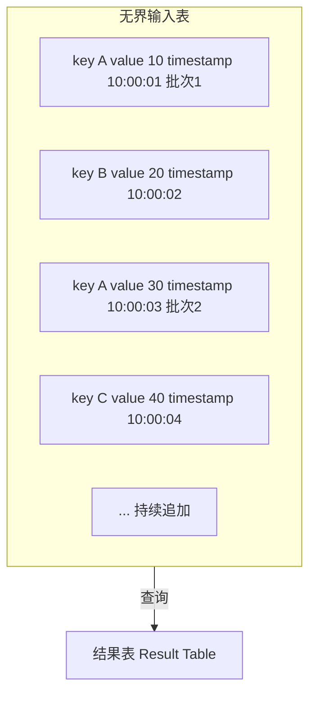

# 大数据 Spark Streaming

> **符号约定**：`< >` 必填参数 | `[ ]` 可选参数

---

## 1. Spark Streaming概述

Spark Streaming 是 Spark 生态中的**微批处理**流计算组件，将实时数据流按时间间隔切分为一系列**离散化流（DStream）**，每批数据作为 RDD 处理。

### 1.1 微批处理模型

```mermaid
flowchart TD
    S[实时数据流] --> B[t1批次 [0-1s] → RDD1]
    S --> B2[t2批次 [1-2s] → RDD2]
    S --> B3[t3批次 [2-3s] → RDD3]
    S --> B4[t4批次 [3-4s] → RDD4]
```

- **批处理间隔（Batch Interval）**：数据切分的时间窗口（如1秒、5秒）
- **延迟**：秒级（取决于批处理间隔）
- **吞吐量**：高（利用 Spark 批处理引擎）

### 1.2 DStream抽象

DStream（Discretized Stream）是 Spark Streaming 的核心抽象，表示**连续的数据流**：

```
DStream = RDD序列
DStream[t] = 时间区间 [t, t+interval) 内的数据对应的RDD
```

DStream 操作会转化为底层 RDD 操作：

```
DStream.map(f) → 每个RDD.map(f)
DStream.filter(f) → 每个RDD.filter(f)
DStream.reduceByKey(f) → 每个RDD.reduceByKey(f)
```

## 2. DStream操作

### 2.1 转换操作

| 算子          | 说明        | 示例                                   |
| :------------ | :---------- | :------------------------------------- |
| `map`         | 逐元素转换  | `ds.map(x => x * 2)`                   |
| `flatMap`     | 展平转换    | `ds.flatMap(x => x.split(" "))`        |
| `filter`      | 过滤        | `ds.filter(x => x > 0)`                |
| `reduceByKey` | 按Key聚合   | `ds.reduceByKey(_ + _)`                |
| `join`        | 流关联      | `ds1.join(ds2)`                        |
| `transform`   | 任意RDD操作 | `ds.transform(rdd => rdd.sortByKey())` |

### 2.2 窗口操作

窗口操作基于**滑动窗口**对多个批次的数据进行聚合：

$$\text{Window}(t) = \bigcup_{i=t-\text{windowLength}+1}^{t} \text{DStream}[i]$$

| 参数          | 说明                             |
| :------------ | :------------------------------- |
| windowLength  | 窗口长度（必须为批间隔的整数倍） |
| slideInterval | 滑动间隔（默认等于批间隔）       |

```python
# 每5秒统计最近30秒的词频
wordCounts = words.reduceByKeyAndWindow(
    lambda a, b: a + b,        # reduce函数
    lambda a, b: a - b,        # inverseReduce函数（优化）
    windowDuration=30,         # 窗口长度
    slideDuration=5            # 滑动间隔
)
```

**窗口操作类型**：

| 算子                    | 说明                |
| :---------------------- | :------------------ |
| `window`                | 返回窗口内的DStream |
| `countByWindow`         | 窗口内元素计数      |
| `reduceByWindow`        | 窗口内聚合          |
| `reduceByKeyAndWindow`  | 窗口内按Key聚合     |
| `countByValueAndWindow` | 窗口内按值计数      |

### 2.3 输出操作

```python
# 打印前10个元素
dstream.pprint()

# 保存到文件
dstream.saveAsTextFiles("prefix", "suffix")

# ForeachRDD：最灵活的输出方式
dstream.foreachRDD(lambda rdd: rdd.foreach(process))
```

## 3. Structured Streaming

Structured Streaming 是 Spark 2.x 引入的**高级流处理API**，基于 DataFrame/SQL，提供更简洁的编程模型和更强的优化能力。

### 3.1 核心模型

**连续处理模型**：将流数据视为一个**无界表**，新数据不断追加到表末尾：



### 3.2 编程示例

```python
# 从Kafka读取
df = spark.readStream \
    .format("kafka") \
    .option("kafka.bootstrap.servers", "localhost:9092") \
    .option("subscribe", "topic1") \
    .load()

# 处理
wordCounts = df.select(
    explode(split(df.value, " ")).alias("word")
).groupBy("word").count()

# 输出
query = wordCounts.writeStream \
    .outputMode("complete") \
    .format("console") \
    .trigger(processingTime="10 seconds") \
    .start()
```

### 3.3 输出模式

| 模式         | 说明           | 适用场景                 |
| :----------- | :------------- | :----------------------- |
| **Append**   | 只输出新增行   | 无聚合查询、事件时间窗口 |
| **Complete** | 输出整个结果表 | 聚合查询                 |
| **Update**   | 只输出变更行   | 聚合查询、需要增量更新   |

### 3.4 事件时间与水印

**事件时间（Event Time）**：数据实际产生的时间，而非处理时间。

**水印（Watermark）**：处理迟到数据的机制，设定最大允许延迟：

$$\text{Watermark} = \max(\text{eventTime}) - \text{delayThreshold}$$

```python
df.withWatermark("timestamp", "10 minutes") \
    .groupBy(window("timestamp", "5 minutes", "1 minute")) \
    .count()
```

- 水印之前的数据：正常处理
- 水印之后但未超时的数据：可能更新结果
- 超过水印+延迟的数据：丢弃

## 4. 容错与Exactly-Once语义

### 4.1 Checkpoint机制

```python
# 启用Checkpoint
ssc.checkpoint("hdfs://checkpoint-dir")

# Structured Streaming Checkpoint
query = df.writeStream \
    .option("checkpointLocation", "hdfs://checkpoint-dir") \
    .start()
```

Checkpoint 存储：

- 元数据：DStream DAG、配置、操作
- 数据：已处理的 Offset 范围

### 4.2 语义保证

| 语义          | 说明         | 实现方式          |
| :------------ | :----------- | :---------------- |
| At Most Once  | 最多处理一次 | 不做重试          |
| At Least Once | 至少处理一次 | 重试 + Checkpoint |
| Exactly Once  | 精确一次     | 幂等写入 + 事务   |

**Structured Streaming Exactly-Once**：

- Source 支持 Offset 管理（如 Kafka Commit）
- Sink 支持事务写入
- Checkpoint 记录处理进度

## 5. 性能调优

### 5.1 关键参数

| 参数                                            | 说明           | 建议           |
| :---------------------------------------------- | :------------- | :------------- |
| `spark.streaming.batchInterval`                 | 批处理间隔     | 1~5秒          |
| `spark.streaming.backpressure.enabled`          | 背压机制       | true           |
| `spark.streaming.kafka.maxRatePerPartition`     | 每分区最大速率 | 根据吞吐量调整 |
| `spark.streaming.blockInterval`                 | Block间隔      | 200ms          |
| `spark.streaming.receiver.writeAheadLog.enable` | 预写日志       | 生产环境true   |

### 5.2 调优策略

1. **合理设置批间隔**：确保处理时间 < 批间隔
2. **启用背压**：动态调整数据摄入速率
3. **Kafka Direct Approach**：避免 Receiver 模式的单点瓶颈
4. **序列化优化**：使用 Kryo 序列化
5. **并行度调整**：Receiver 数量 = Kafka 分区数
## 创建 StreamingContext

**换行写法：初始化 StreamingContext**
`from pyspark.streaming import StreamingContext`
`ssc = StreamingContext(sc, <批次间隔>)`

```python
# 创建 StreamingContext（批次间隔 1 秒）
from pyspark.streaming import StreamingContext

ssc = StreamingContext(sc, batchDuration=1)
```

---

**基本写法：设置检查点**
`ssc.checkpoint(<路径>)`

```python
# 设置检查点目录（用于状态恢复）
ssc.checkpoint("hdfs://namenode:8020/checkpoint")
```

---

## 数据源

**基本写法：Socket 数据源**
`ssc.socketTextStream(<主机>, <端口>)`

```python
# 从 Socket 接收文本数据
lines = ssc.socketTextStream("localhost", 9999)
```

---

**基本写法：文件流**
`ssc.textFileStream(<目录>)`

```python
# 监控目录中的新文件
lines = ssc.textFileStream("hdfs://namenode:8020/streaming/")
```

---

**换行写法：Kafka 数据源**
`from pyspark.streaming.kafka import KafkaUtils`
`stream = KafkaUtils.createDirectStream(ssc, [<主题>], <kafka参数>)`

```python
# 从 Kafka 接收数据
from pyspark.streaming.kafka import KafkaUtils

kafkaParams = {"metadata.broker.list": "localhost:9092"}
topics = ["my_topic"]
stream = KafkaUtils.createDirectStream(ssc, topics, kafkaParams)
```

---

**换行写法：自定义接收器**
`ssc.receiverStream(<自定义接收器>)`

```python
# 自定义接收器（需继承 Receiver）
from pyspark.streaming.receiver import Receiver

class MyReceiver(Receiver):
    def onStart(self):
        # 启动接收数据的线程
        pass

    def onStop(self):
        # 停止接收
        pass

stream = ssc.receiverStream(MyReceiver())
```

---

## DStream 操作

**基本写法：map 转换**
`<dstream>.map(<函数>)`

```python
# 对每个元素应用函数
words = lines.map(lambda line: line.split(" "))
```

---

**基本写法：flatMap 转换**
`<dstream>.flatMap(<函数>)`

```python
# 展平结果
words = lines.flatMap(lambda line: line.split(" "))
```

---

**基本写法：filter 过滤**
`<dstream>.filter(<函数>)`

```python
# 过滤
long_words = words.filter(lambda word: len(word) > 3)
```

---

**基本写法：count 计数**
`<dstream>.count()`

```python
# 每批次元素计数
counts = words.count()
```

---

**基本写法：reduce 聚合**
`<dstream>.reduce(<函数>)`

```python
# 每批次聚合
total = numbers.reduce(lambda a, b: a + b)
```

---

**基本写法：countByValue**
`<dstream>.countByValue()`

```python
# 统计每个值的出现次数
word_counts = words.countByValue()
```

---

## 窗口操作

**基本写法：窗口聚合**
`<dstream>.reduceByWindow(<函数>, <窗口时长>, <滑动间隔>)`

```python
# 窗口聚合（窗口 10 秒，滑动 5 秒）
windowed = numbers.reduceByWindow(
    lambda a, b: a + b,
    windowDuration=10,
    slideDuration=5
)
```

---

**基本写法：窗口计数**
`<dstream>.countByWindow(<窗口时长>, <滑动间隔>)`

```python
# 窗口内计数
windowed_count = words.countByWindow(
    windowDuration=10,
    slideDuration=5
)
```

---

**基本写法：按值窗口计数**
`<dstream>.countByValueAndWindow(<窗口时长>, <滑动间隔>)`

```python
# 窗口内按值计数
windowed_word_count = words.countByValueAndWindow(
    windowDuration=10,
    slideDuration=5
)
```

---

**基本写法：窗口内分组聚合**
`<dstream>.reduceByKeyAndWindow(<函数>, <窗口时长>, <滑动间隔>)`

```python
# 窗口内按键聚合
windowed_counts = pairs.reduceByKeyAndWindow(
    lambda a, b: a + b,
    windowDuration=10,
    slideDuration=5
)
```

---

**基本写法：带反向函数的窗口**
`<dstream>.reduceByKeyAndWindow(<函数>, <反向函数>, <窗口时长>, <滑动间隔>)`

```python
# 高效窗口聚合（增量计算）
windowed_counts = pairs.reduceByKeyAndWindow(
    lambda a, b: a + b,        # 加入新数据
    lambda a, b: a - b,        # 移除旧数据
    windowDuration=10,
    slideDuration=5
)
```

---

## 状态操作

**基本写法：更新状态**
`<dstream>.updateStateByKey(<更新函数>)`

```python
# 更新状态（需要设置 checkpoint）
def updateFunc(new_values, last_state):
    total = last_state or 0
    for value in new_values:
        total += value
    return total

state_counts = pairs.updateStateByKey(updateFunc)
```

---

**基本写法：mapWithState**
`<dstream>.mapWithState(<状态规范>)`

```python
# 高效状态更新
from pyspark.streaming import State, StateSpec

def mappingFunction(key, value, state):
    total = state.get() or 0
    total += value
    state.update(total)
    return (key, total)

spec = StateSpec.function(mappingFunction)
state_stream = pairs.mapWithState(spec)
```

---

## 输出操作

**基本写法：打印**
`<dstream>.pprint([<行数>])`

```python
# 打印前 10 条
result.pprint()
# 打印前 20 条
result.pprint(20)
```

---

**基本写法：保存为文本文件**
`<dstream>.saveAsTextFiles(<前缀>, [<后缀>])`

```python
# 保存到文件（每批次一个目录）
result.saveAsTextFiles("output/streaming", "txt")
```

---

**换行写法：foreachRDD 输出**
`<dstream>.foreachRDD(<函数>)`

```python
# 对每个 RDD 执行自定义操作
def process(rdd):
    if not rdd.isEmpty():
        df = spark.createDataFrame(rdd)
        df.write.mode("append").parquet("output/")

result.foreachRDD(process)
```

---

**换行写法：foreachRDD 写入数据库**
`<dstream>.foreachRDD(<函数>)`

```python
# 将结果写入 MySQL
def save_to_mysql(rdd):
    if not rdd.isEmpty():
        pdf = rdd.toDF().toPandas()
        pdf.to_sql("results", engine, if_exists="append", index=False)

result.foreachRDD(save_to_mysql)
```

---

## DStream 转换

**基本写法：转换为 RDD 操作**
`<dstream>.transform(<函数>)`

```python
# 在 DStream 上应用 RDD 操作
sorted_stream = dstream.transform(lambda rdd: rdd.sortBy(lambda x: x[1], False))
```

---

**基本写法：连接静态数据**
`<dstream>.transformWith(<函数>, <静态RDD>)`

```python
# 将流数据与静态 RDD 连接
static_data = sc.parallelize([("apple", "水果"), ("banana", "水果")])
enriched = dstream.transformWith(
    lambda rdd, static: rdd.join(static),
    static_data
)
```

---

## 启动与停止

**基本写法：启动流处理**
`ssc.start()`

```python
# 启动流处理
ssc.start()
```

---

**基本写法：等待终止**
`ssc.awaitTermination()`

```python
# 等待作业终止
ssc.awaitTermination()
```

---

**基本写法：等待终止或超时**
`ssc.awaitTerminationOrTimeout(<超时秒数>)`

```python
# 等待 60 秒或终止
ssc.awaitTerminationOrTimeout(60)
```

---

**基本写法：停止流处理**
`ssc.stop([stopSparkContext], [stopGraceFully])`

```python
# 优雅停止
ssc.stop(stopSparkContext=True, stopGracefully=True)
```

---

## Structured Streaming

**换行写法：创建流式 DataFrame**
`stream = spark.readStream.format(<格式>).load(<路径>)`

```python
# 使用 Structured Streaming
stream = spark.readStream \
    .format("kafka") \
    .option("kafka.bootstrap.servers", "localhost:9092") \
    .option("subscribe", "my_topic") \
    .load()
```

---

**基本写法：Socket 数据源**
`spark.readStream.format("socket").option("host", ...).option("port", ...).load()`

```python
# Socket 数据源
lines = spark.readStream \
    .format("socket") \
    .option("host", "localhost") \
    .option("port", 9999) \
    .load()
```

---

**基本写法：文件数据源**
`spark.readStream.format("<格式>").load(<路径>)`

```python
# 监控 CSV 文件目录
stream = spark.readStream \
    .format("csv") \
    .option("header", True) \
    .schema(schema) \
    .load("data/")
```

---

**基本写法：流式聚合**
`<stream>.groupBy(<列>).agg(<聚合函数>)`

```python
# 流式聚合
from pyspark.sql import functions as F

word_counts = lines.groupBy("word").agg(F.count("*").alias("count"))
```

---

**换行写法：输出查询**
`query = <stream>.writeStream.format(<格式>).outputMode(<模式>).start()`

```python
# 启动输出查询
query = word_counts.writeStream \
    .format("console") \
    .outputMode("complete") \
    .start()

query.awaitTermination()
```

---

**基本写法：输出模式**
`.outputMode(<模式>)`

```python
# 输出模式
# append: 仅输出新行（默认）
# complete: 输出所有结果
# update: 仅输出变化的行
query = stream.writeStream.outputMode("update").format("console").start()
```

---

**基本写法：触发器**
`.trigger(processingTime=<间隔>)`

```python
# 设置触发器
from pyspark.sql.streaming import Trigger

query = stream.writeStream \
    .trigger(processingTime="10 seconds") \
    .format("console") \
    .start()
```

---

**基本写法：检查点**
`.option("checkpointLocation", <路径>)`

```python
# 设置检查点
query = stream.writeStream \
    .option("checkpointLocation", "checkpoint/") \
    .format("parquet") \
    .start("output/")
```

---

**基本写法：水印**
`<stream>.withWatermark(<时间列>, <延迟阈值>)`

```python
# 设置水印（处理迟到数据）
from pyspark.sql import functions as F

result = stream \
    .withWatermark("timestamp", "10 minutes") \
    .groupBy(F.window("timestamp", "5 minutes"), "word") \
    .count()
```
## 数据库操作

**基本写法：创建数据库**
`CREATE DATABASE [IF NOT EXISTS] <数据库名>`

```sql
-- 创建数据库
CREATE DATABASE IF NOT EXISTS my_db;
```

---

**基本写法：指定位置**
`CREATE DATABASE <数据库名> LOCATION <路径>`

```sql
-- 指定数据库存储位置
CREATE DATABASE my_db LOCATION '/user/hadoop/my_db';
```

---

**基本写法：查看数据库**
`SHOW DATABASES`

```sql
-- 查看所有数据库
SHOW DATABASES;
```

---

**基本写法：使用数据库**
`USE <数据库名>`

```sql
-- 切换数据库
USE my_db;
```

---

**基本写法：删除数据库**
`DROP DATABASE [IF EXISTS] <数据库名> [CASCADE]`

```sql
-- 删除空数据库
DROP DATABASE IF EXISTS my_db;
-- 级联删除（含表）
DROP DATABASE IF EXISTS my_db CASCADE;
```

---

## 表操作

**基本写法：创建表**
`CREATE TABLE <表名> (<列名> <类型>, ...)`

```sql
-- 创建表
CREATE TABLE employees (
    id INT,
    name STRING,
    age INT,
    salary DOUBLE
);
```

---

**基本写法：使用 Parquet 格式**
`CREATE TABLE <表名> (<列定义>) USING PARQUET`

```sql
-- 创建 Parquet 格式表
CREATE TABLE employees (
    id INT,
    name STRING,
    salary DOUBLE
) USING PARQUET;
```

---

**基本写法：使用 ORC 格式**
`CREATE TABLE <表名> (<列定义>) USING ORC`

```sql
-- 创建 ORC 格式表
CREATE TABLE employees (
    id INT,
    name STRING
) USING ORC;
```

---

**基本写法：分区表**
`CREATE TABLE <表名> (<列定义>) PARTITIONED BY (<分区列>)`

```sql
-- 创建分区表
CREATE TABLE sales (
    id INT,
    amount DOUBLE
) PARTITIONED BY (year INT, month INT);
```

---

**基本写法：分桶表**
`CREATE TABLE <表名> (<列定义>) CLUSTERED BY (<列>) INTO <n> BUCKETS`

```sql
-- 创建分桶表
CREATE TABLE users (
    id INT,
    name STRING
) CLUSTERED BY (id) INTO 4 BUCKETS;
```

---

**基本写法：外部表**
`CREATE EXTERNAL TABLE <表名> (<列定义>) LOCATION <路径>`

```sql
-- 创建外部表
CREATE EXTERNAL TABLE logs (
    id INT,
    message STRING
) LOCATION '/user/hadoop/logs';
```

---

**基本写法：查看表**
`SHOW TABLES [IN <数据库>]`

```sql
-- 查看当前数据库的表
SHOW TABLES;
-- 查看指定数据库的表
SHOW TABLES IN my_db;
```

---

**基本写法：查看表结构**
`DESCRIBE <表名>`

```sql
-- 查看表结构
DESCRIBE employees;
-- 查看详细信息
DESCRIBE FORMATTED employees;
```

---

**基本写法：删除表**
`DROP TABLE [IF EXISTS] <表名>`

```sql
-- 删除表
DROP TABLE IF EXISTS employees;
```

---

**基本写法：重命名表**
`ALTER TABLE <旧表名> RENAME TO <新表名>`

```sql
-- 重命名表
ALTER TABLE employees RENAME TO staff;
```

---

## 数据查询

**基本写法：基本查询**
`SELECT <列1>, <列2> FROM <表名>`

```sql
-- 查询所有列
SELECT * FROM employees;
-- 查询指定列
SELECT name, salary FROM employees;
```

---

**基本写法：条件查询**
`SELECT * FROM <表名> WHERE <条件>`

```sql
-- 条件查询
SELECT * FROM employees WHERE age > 30;
SELECT * FROM employees WHERE city = '北京' AND salary > 10000;
```

---

**基本写法：排序**
`SELECT * FROM <表名> ORDER BY <列> [DESC]`

```sql
-- 排序
SELECT * FROM employees ORDER BY salary DESC;
-- 多列排序
SELECT * FROM employees ORDER BY city, salary DESC;
```

---

**基本写法：限制结果**
`SELECT * FROM <表名> LIMIT <n>`

```sql
-- 限制返回行数
SELECT * FROM employees LIMIT 10;
```

---

**基本写法：去重**
`SELECT DISTINCT <列> FROM <表名>`

```sql
-- 去重查询
SELECT DISTINCT city FROM employees;
```

---

**基本写法：分组聚合**
`SELECT <列>, <聚合函数>(<列>) FROM <表名> GROUP BY <列>`

```sql
-- 分组聚合
SELECT city, AVG(salary) as avg_salary, COUNT(*) as cnt
FROM employees
GROUP BY city;
```

---

**基本写法：Having 过滤**
`SELECT <列>, <聚合函数>(<列>) FROM <表名> GROUP BY <列> HAVING <条件>`

```sql
-- 分组后过滤
SELECT city, AVG(salary) as avg_salary
FROM employees
GROUP BY city
HAVING AVG(salary) > 10000;
```

---

## Join 查询

**基本写法：内连接**
`SELECT * FROM <表1> INNER JOIN <表2> ON <条件>`

```sql
-- 内连接
SELECT e.name, d.dept_name
FROM employees e
INNER JOIN departments d ON e.dept_id = d.id;
```

---

**基本写法：左连接**
`SELECT * FROM <表1> LEFT JOIN <表2> ON <条件>`

```sql
-- 左外连接
SELECT e.name, d.dept_name
FROM employees e
LEFT JOIN departments d ON e.dept_id = d.id;
```

---

**基本写法：右连接**
`SELECT * FROM <表1> RIGHT JOIN <表2> ON <条件>`

```sql
-- 右外连接
SELECT e.name, d.dept_name
FROM employees e
RIGHT JOIN departments d ON e.dept_id = d.id;
```

---

**基本写法：全连接**
`SELECT * FROM <表1> FULL OUTER JOIN <表2> ON <条件>`

```sql
-- 全外连接
SELECT e.name, d.dept_name
FROM employees e
FULL OUTER JOIN departments d ON e.dept_id = d.id;
```

---

## 子查询

**基本写法：WHERE 子查询**
`SELECT * FROM <表名> WHERE <列> IN (SELECT ...)`

```sql
-- 子查询
SELECT * FROM employees
WHERE dept_id IN (SELECT id FROM departments WHERE name = '技术部');
```

---

**基本写法：EXISTS 子查询**
`SELECT * FROM <表1> WHERE EXISTS (SELECT ... WHERE ...)`

```sql
-- EXISTS 子查询
SELECT * FROM employees e
WHERE EXISTS (SELECT 1 FROM departments d WHERE d.id = e.dept_id AND d.name = '技术部');
```

---

**基本写法：CTE 公共表表达式**
`WITH <表名> AS (SELECT ...) SELECT * FROM <表名>`

```sql
-- CTE 公共表表达式
WITH dept_avg AS (
    SELECT dept_id, AVG(salary) as avg_sal
    FROM employees
    GROUP BY dept_id
)
SELECT e.name, e.salary, d.avg_sal
FROM employees e
JOIN dept_avg d ON e.dept_id = d.dept_id
WHERE e.salary > d.avg_sal;
```

---

## 窗口函数

**基本写法：行号**
`ROW_NUMBER() OVER (PARTITION BY <列> ORDER BY <列>)`

```sql
-- 按部门分组按薪资降序编号
SELECT name, dept_id, salary,
    ROW_NUMBER() OVER (PARTITION BY dept_id ORDER BY salary DESC) as rank
FROM employees;
```

---

**基本写法：排名**
`RANK() OVER (PARTITION BY <列> ORDER BY <列>)`

```sql
-- 排名（有并列，有间隔）
SELECT name, salary,
    RANK() OVER (ORDER BY salary DESC) as rank
FROM employees;
```

---

**基本写法：密集排名**
`DENSE_RANK() OVER (PARTITION BY <列> ORDER BY <列>)`

```sql
-- 密集排名（有并列，无间隔）
SELECT name, salary,
    DENSE_RANK() OVER (ORDER BY salary DESC) as dense_rank
FROM employees;
```

---

**基本写法：累积求和**
`SUM(<列>) OVER (PARTITION BY <列> ORDER BY <列>)`

```sql
-- 累积求和
SELECT name, dept_id, salary,
    SUM(salary) OVER (PARTITION BY dept_id ORDER BY salary) as cumsum
FROM employees;
```

---

**基本写法：偏移函数**
`LAG(<列>, <偏移>) OVER (ORDER BY <列>)`

```sql
-- 获取前一行的值
SELECT name, salary,
    LAG(salary, 1) OVER (ORDER BY salary) as prev_salary
FROM employees;
```

---

## 数据插入

**基本写法：插入数据**
`INSERT INTO <表名> VALUES (<值1>, <值2>, ...)`

```sql
-- 插入单行
INSERT INTO employees VALUES (1, 'Alice', 30, 15000.0);
-- 插入多行
INSERT INTO employees VALUES
    (2, 'Bob', 25, 12000.0),
    (3, 'Charlie', 35, 20000.0);
```

---

**基本写法：从查询插入**
`INSERT INTO <表名> SELECT ...`

```sql
-- 从查询结果插入
INSERT INTO high_salary
SELECT * FROM employees WHERE salary > 15000;
```

---

**基本写法：覆盖插入**
`INSERT OVERWRITE TABLE <表名> SELECT ...`

```sql
-- 覆盖表数据
INSERT OVERWRITE TABLE employees
SELECT * FROM temp_employees;
```

---

**基本写法：插入分区**
`INSERT INTO <表名> PARTITION (<分区列>=<值>) SELECT ...`

```sql
-- 插入指定分区
INSERT INTO sales PARTITION (year=2024, month=1)
SELECT id, amount FROM temp_sales;
```

---

## 视图

**基本写法：创建视图**
`CREATE VIEW <视图名> AS SELECT ...`

```sql
-- 创建视图
CREATE VIEW high_salary_employees AS
SELECT * FROM employees WHERE salary > 15000;
```

---

**基本写法：创建临时视图**
`CREATE TEMP VIEW <视图名> AS SELECT ...`

```sql
-- 创建临时视图（会话级别）
CREATE TEMP VIEW dept_stats AS
SELECT dept_id, AVG(salary) as avg_sal FROM employees GROUP BY dept_id;
```

---

**基本写法：删除视图**
`DROP VIEW [IF EXISTS] <视图名>`

```sql
-- 删除视图
DROP VIEW IF EXISTS high_salary_employees;
```

---

## 函数使用

**基本写法：字符串函数**
`SELECT <函数>(<列>) FROM <表名>`

```sql
-- 字符串函数
SELECT UPPER(name), LENGTH(name), SUBSTRING(name, 1, 3) FROM employees;
SELECT CONCAT(name, '-', city) as info FROM employees;
```

---

**基本写法：日期函数**
`SELECT <日期函数>(<列>) FROM <表名>`

```sql
-- 日期函数
SELECT CURRENT_DATE(), CURRENT_TIMESTAMP();
SELECT YEAR(hire_date), MONTH(hire_date), DAY(hire_date) FROM employees;
SELECT DATEDIFF(CURRENT_DATE(), hire_date) as days FROM employees;
```

---

**基本写法：数学函数**
`SELECT <数学函数>(<列>) FROM <表名>`

```sql
-- 数学函数
SELECT ROUND(salary, 2), ABS(salary - avg_sal), SQRT(salary) FROM employees;
```

---

**基本写法：条件函数**
`SELECT CASE WHEN <条件> THEN <值> ELSE <值> END FROM <表名>`

```sql
-- 条件表达式
SELECT name, salary,
    CASE
        WHEN salary > 20000 THEN '高薪'
        WHEN salary > 10000 THEN '中薪'
        ELSE '低薪'
    END as level
FROM employees;
```

## 参考文献


Apache Spark：https://spark.apache.org/docs/latest/
Apache Flink：https://flink.apache.org/
Apache Kafka：https://kafka.apache.org/documentation/
ClickHouse：https://clickhouse.com/docs
Airflow：https://airflow.apache.org/docs/

## 延伸阅读


大数据生态概览，见 052-big-data 模块文档。
数据分析与统计，见 051-data-analysis/030-probability-statistics 模块。
分布式系统基础，见 034-cloud-computing 模块。
尚硅谷 Bilibili 空间（https://space.bilibili.com/302417610 ）提供大数据课程。

## 模块文档速查表

| 文档 | 主题 | 与本文的关联 |
| --- | --- | --- |
| 大数据概述 | 001-DataOverview | 本文的前置基础 |
| HDFS分布式文件系统 | 002-HDFSDistributedFileSystem | 本文的并列主题 |
| MapReduce | 003-MapReduce | 本文的并列主题 |
| Spark核心 | 004-SparkCore | 本文的并列主题 |
| Spark-Streaming | 005-SparkStreaming | 本文自身 |
| Hive数据仓库 | 006-HiveDataWarehouse | 本文的并列主题 |
| HBase列族数据库 | 007-HBaseDatabase | 本文的并列主题 |
| Kafka消息队列 | 008-KafkaMessageQueue | 本文的并列主题 |
| Flink流处理 | 009-FlinkStreamHandling | 本文的并列主题 |
| 数据湖 | 010-DataLake | 本文的并列主题 |
| Zookeeper协调服务 | 011-Zookeeper | 本文的并列主题 |
| YARN资源管理 | 012-YARNManagement | 本文的并列主题 |
| 大数据 HDFS 命令 | 013-HDFSCommands | 本文的并列主题 |
| 大数据 YARN 命令 | 014-YARNCommands | 本文的并列主题 |
| 大数据 Spark RDD | 015-SparkRDD | 本文的并列主题 |
| 大数据 Spark DataFrame | 016-SparkDataFrame | 本文的并列主题 |
| 大数据 Hive DDL | 017-HiveDDL | 本文的并列主题 |
| 大数据 Hive DML | 018-HiveDML | 本文的并列主题 |
| 大数据 Hive 函数 | 019-HiveFunctions | 本文的并列主题 |
| 大数据 Kafka 命令 | 020-KafkaCommands | 本文的并列主题 |
| 大数据 HBase 命令 | 021-HBaseCommands | 本文的并列主题 |
| 大数据 Flink 流处理 | 022-FlinkBasics | 本文的并列主题 |
| 大数据 Spark 优化 | 023-SparkOptimization | 本文的性能延伸 |
