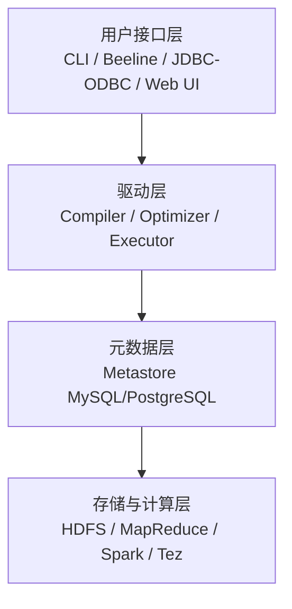
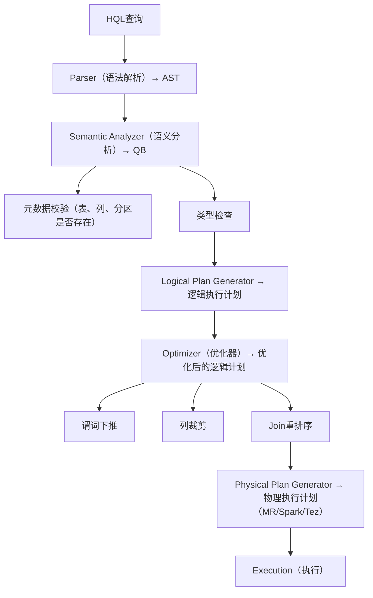
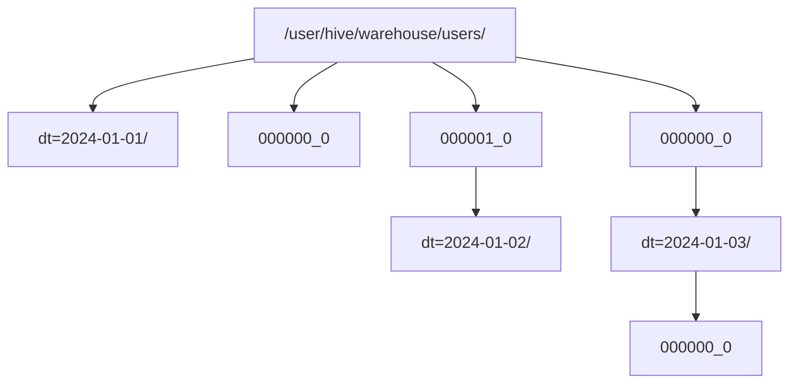

## 1. Hive架构与原理

Hive 是建立在 Hadoop 之上的**数据仓库工具**，提供类 SQL 查询语言（HQL），将 SQL 翻译为 MapReduce/Spark/Tez 任务执行。

### 1.1 架构组件



### 1.2 查询执行流程



### 1.3 Metastore

Metastore 存储 Hive 的**元数据**，是 Hive 的核心组件：

| 元数据类型 | 存储内容                         |
| :--------- | :------------------------------- |
| Database   | 数据库名、描述、位置             |
| Table      | 表名、列定义、分区信息、存储格式 |
| Partition  | 分区键值、分区目录位置           |
| SerDe      | 序列化/反序列化配置              |

**Metastore 部署模式**：

| 模式     | 说明                             | 适用场景   |
| :------- | :------------------------------- | :--------- |
| 内嵌模式 | Derby内嵌                        | 开发测试   |
| 本地模式 | 外置MySQL，Metastore与Hive同进程 | 单集群     |
| 远程模式 | 独立Metastore服务                | 多集群共享 |

## 2. HQL语法

### 2.1 DDL操作

```sql
-- 创建数据库
CREATE DATABASE IF NOT EXISTS analytics
COMMENT 'Analytics database'
LOCATION '/user/hive/warehouse/analytics.db';

-- 创建内部表
CREATE TABLE IF NOT EXISTS users (
    id BIGINT COMMENT '用户ID',
    name STRING COMMENT '用户名',
    age INT COMMENT '年龄',
    created_at TIMESTAMP COMMENT '创建时间'
)
COMMENT '用户表'
PARTITIONED BY (dt STRING COMMENT '日期分区')
CLUSTERED BY (id) INTO 32 BUCKETS
STORED AS ORC
TBLPROPERTIES ('orc.compress'='SNAPPY');

-- 创建外部表
CREATE EXTERNAL TABLE IF NOT EXISTS logs (
    line STRING
)
LOCATION '/data/logs/';

-- 分区操作
ALTER TABLE users ADD PARTITION (dt='2024-01-01');
ALTER TABLE users DROP PARTITION (dt='2023-01-01');
MSCK REPAIR TABLE users;  -- 恢复分区元数据
```

### 2.2 DML操作

```sql
-- 数据导入
LOAD DATA INPATH '/data/users.csv' INTO TABLE users PARTITION (dt='2024-01-01');

INSERT OVERWRITE TABLE users PARTITION (dt='2024-01-01')
SELECT id, name, age, created_at FROM staging_users;

-- 动态分区插入
SET hive.exec.dynamic.partition=true;
SET hive.exec.dynamic.partition.mode=nonstrict;

INSERT OVERWRITE TABLE users PARTITION (dt)
SELECT id, name, age, created_at, DATE(created_at) AS dt
FROM staging_users;

-- CTAS
CREATE TABLE users_orc AS
SELECT * FROM users WHERE dt = '2024-01-01';
```

### 2.3 查询语法

```sql
-- 基本查询
SELECT name, COUNT(*) AS cnt
FROM users
WHERE dt >= '2024-01-01'
GROUP BY name
HAVING cnt > 10
ORDER BY cnt DESC
LIMIT 100;

-- 窗口函数
SELECT
    name,
    age,
    ROW_NUMBER() OVER (PARTITION BY name ORDER BY age DESC) AS rn,
    SUM(age) OVER (PARTITION BY name ORDER BY age
                   ROWS BETWEEN UNBOUNDED PRECEDING AND CURRENT ROW) AS cum_age
FROM users
WHERE dt = '2024-01-01';

-- LATERAL VIEW（行转列）
SELECT name, tag
FROM users
LATERAL VIEW EXPLODE(SPLIT(interests, ',')) t AS tag;
```

## 3. 分区与桶

### 3.1 分区（Partition）

分区是 Hive 的**粗粒度数据组织**方式，对应 HDFS 上的**目录结构**：



**分区裁剪（Partition Pruning）**：

```sql
-- 只扫描 dt=2024-01-01 目录
SELECT * FROM users WHERE dt = '2024-01-01';

-- 扫描所有分区（避免！）
SELECT * FROM users WHERE age > 20;
```

**分区设计原则**：

- 分区字段选择**低基数**列（如日期、地区）
- 避免过多分区（每个分区对应HDFS目录，NameNode压力大）
- 多级分区不超过3层

### 3.2 桶（Bucket）

桶是比分区**更细粒度**的数据组织方式，对应 HDFS 上的**文件**：

$$\text{bucketNo} = \text{hash}(column) \bmod \text{numBuckets}$$

```sql
CREATE TABLE users_bucketed (
    id BIGINT,
    name STRING
)
CLUSTERED BY (id) INTO 32 BUCKETS
STORED AS ORC;
```

**桶的优势**：

- **Sampling**：快速采样 `TABLESAMPLE(BUCKET 1 OUT OF 32 ON id)`
- **Join优化**：桶Join（Bucket Map Join）避免Shuffle
- **数据倾斜**：均匀分布数据

## 4. UDF开发

### 4.1 UDF分类

| 类型 | 输入 | 输出 | 示例          |
| :--- | :--- | :--- | :------------ |
| UDF  | 单行 | 单行 | UPPER、SUBSTR |
| UDAF | 多行 | 单行 | SUM、COUNT    |
| UDTF | 单行 | 多行 | EXPLODE       |

### 4.2 自定义UDF

```java
public class MaskUDF extends UDF {
    public Text evaluate(Text input) {
        if (input == null) return null;
        String str = input.toString();
        if (str.length() <= 3) return new Text("***");
        return new Text(str.substring(0, 3) + "***");
    }
}
```

```sql
-- 注册UDF
ADD JAR /path/to/udf.jar;
CREATE TEMPORARY FUNCTION mask AS 'com.example.MaskUDF';

-- 使用UDF
SELECT mask(phone) FROM users;
```

### 4.3 自定义UDTF

```java
public class SplitUDTF extends GenericUDTF {
    @Override
    public StructObjectInspector initialize(ObjectInspector[] args) {
        ArrayList<String> fieldNames = new ArrayList<>();
        ArrayList<ObjectInspector> fieldOIs = new ArrayList<>();
        fieldNames.add("word");
        fieldOIs.add(PrimitiveObjectInspectorFactory.javaStringObjectInspector);
        return ObjectInspectorFactory.getStandardStructObjectInspector(
            fieldNames, fieldOIs);
    }

    @Override
    public void process(Object[] args) throws HiveException {
        String input = args[0].toString();
        String delimiter = args.length > 1 ? args[1].toString() : ",";
        for (String word : input.split(delimiter)) {
            forward(new Object[]{word.trim()});
        }
    }

    @Override
    public void close() throws HiveException {}
}
```

## 5. Hive性能优化

### 5.1 执行引擎选择

| 引擎      | 性能 | 适用场景                |
| :-------- | :--- | :---------------------- |
| MapReduce | 基准 | 兼容性最好              |
| Tez       | 2~3x | DAG优化，减少中间写磁盘 |
| Spark     | 3~5x | 内存计算，迭代场景      |

### 5.2 关键优化策略

| 策略       | 配置                                     | 效果                   |
| :--------- | :--------------------------------------- | :--------------------- |
| 向量化执行 | `hive.vectorized.execution.enabled=true` | 批量处理，减少函数调用 |
| CBO优化    | `hive.cbo.enable=true`                   | 基于代价的Join重排序   |
| MapJoin    | `hive.auto.convert.join=true`            | 小表广播，避免Shuffle  |
| SMB Join   | Sort Merge Bucket Join                   | 桶表Join优化           |
| 并行执行   | `hive.exec.parallel=true`                | 无依赖Stage并行执行    |
| 压缩       | 中间结果+最终结果压缩                    | 减少IO                 |
| 文件格式   | ORC/Parquet                              | 列存+压缩+谓词下推     |

## 参考文献

Apache Spark：https://spark.apache.org/docs/latest/
Apache Flink：https://flink.apache.org/
Apache Kafka：https://kafka.apache.org/documentation/
ClickHouse：https://clickhouse.com/docs
Airflow：https://airflow.apache.org/docs/

## 延伸阅读

大数据生态概览，见 052-big-data 模块文档。
数据分析与统计，见 051-data-analysis/030-probability-statistics 模块。
分布式系统基础，见 034-cloud-computing 模块。
尚硅谷 Bilibili 空间（https://space.bilibili.com/302417610 ）提供大数据课程。

## 深度专题扩展

以下专题从不同角度深入本文主题，供有进阶需求的读者研读。每个专题独立成节，内容相互补充。

### 13.1 流处理语义深入

At-most-once：可能丢；At-least-once：可能重；Exactly-once：端到端精确一次需事务/幂等。
状态后端：RocksDB 本地状态 + checkpoint 快照；重启恢复。
窗口：滚动（固定）、滑动（重叠）、会话（空闲间隔）；触发条件（水位线 + 允许迟到）。
实践：幂等写入 + 去重键（事件 ID）兜底。

### 13.2 数据仓库建模

维度建模：事实表（度量、外键）+ 维度表（描述）；星型模型查询友好。
分层：ODS 原样、DWD 明细清洗、DWS 汇总、ADS 应用。
缓慢变化维度（SCD）：覆盖（1）、新增行（2）、新增列（3）。
建模工具：dbt 实现 ELT 与测试；血缘可视化。

## 模块文档速查表

| 文档 | 主题 | 与本文的关联 |
| --- | --- | --- |
| 大数据概述 | 001-DataOverview | 本文的前置基础 |
| HDFS分布式文件系统 | 002-HDFSDistributedFileSystem | 本文的并列主题 |
| MapReduce | 003-MapReduce | 本文的并列主题 |
| Spark核心 | 004-SparkCore | 本文的并列主题 |
| Spark-Streaming | 005-SparkStreaming | 本文的并列主题 |
| Hive数据仓库 | 006-HiveDataWarehouse | 本文自身 |
| HBase列族数据库 | 007-HBaseDatabase | 本文的并列主题 |
| Kafka消息队列 | 008-KafkaMessageQueue | 本文的并列主题 |
| Flink流处理 | 009-FlinkStreamHandling | 本文的并列主题 |
| 数据湖 | 010-DataLake | 本文的并列主题 |
| Zookeeper协调服务 | 011-Zookeeper | 本文的并列主题 |
| YARN资源管理 | 012-YARNManagement | 本文的并列主题 |
| 大数据 HDFS 命令 | 013-HDFSCommands | 本文的并列主题 |
| 大数据 YARN 命令 | 014-YARNCommands | 本文的并列主题 |
| 大数据 Spark RDD | 015-SparkRDD | 本文的并列主题 |
| 大数据 Spark DataFrame | 016-SparkDataFrame | 本文的并列主题 |
| 大数据 Hive DDL | 017-HiveDDL | 本文的并列主题 |
| 大数据 Hive DML | 018-HiveDML | 本文的并列主题 |
| 大数据 Hive 函数 | 019-HiveFunctions | 本文的并列主题 |
| 大数据 Kafka 命令 | 020-KafkaCommands | 本文的并列主题 |
| 大数据 HBase 命令 | 021-HBaseCommands | 本文的并列主题 |
| 大数据 Flink 流处理 | 022-FlinkBasics | 本文的并列主题 |
| 大数据 Spark 优化 | 023-SparkOptimization | 本文的性能延伸 |
