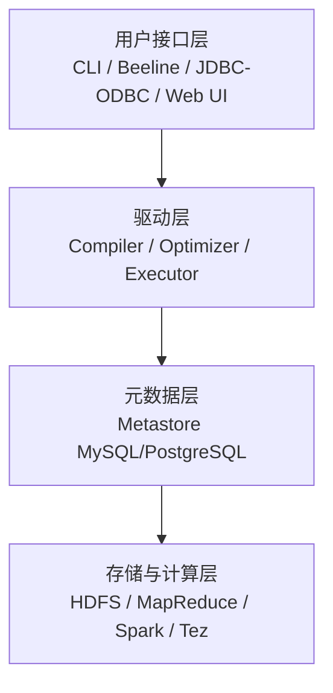
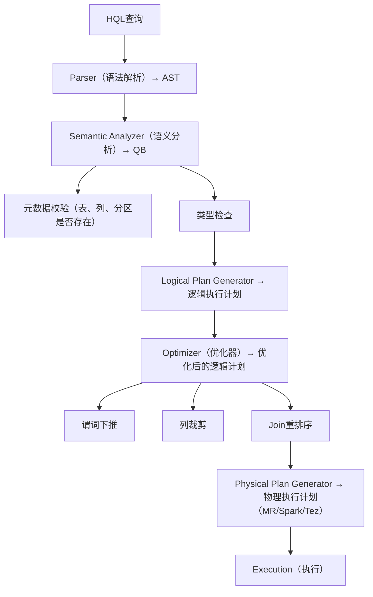
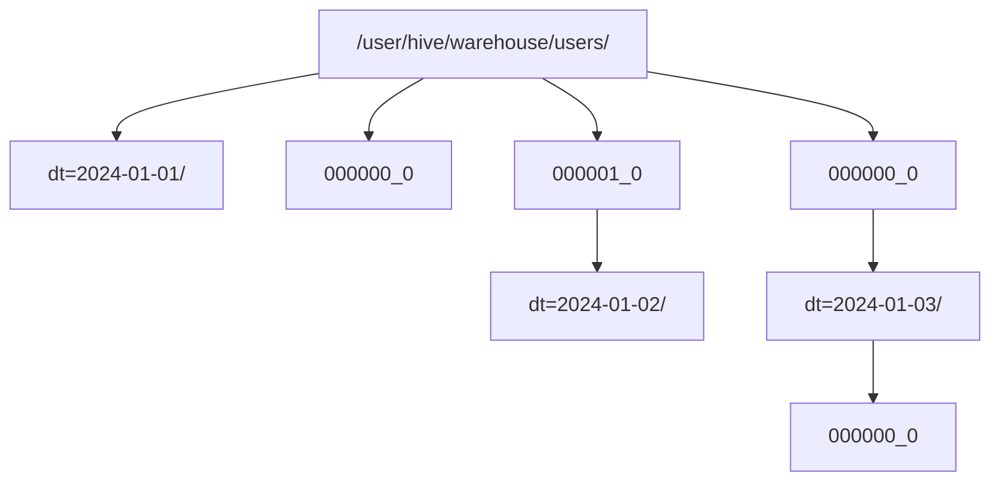
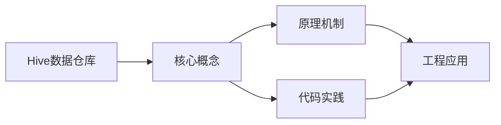
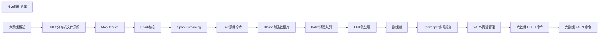

## 1. 学习目标（Bloom 分类）

本节按照布鲁姆教育目标分类学组织学习路径。本文主题为《Hive数据仓库》，属于 大数据 模块，读者可以根据自身阶段选择阅读深度。

记忆层面：能够准确复述本文的核心概念、术语与基本语法或操作步骤，并能够在提问或检索时快速定位对应知识点。能够说出 大数据 的核心概念、常用命令与流程。

理解层面：能够用自己的语言解释核心原理与工作机制，说明概念之间的因果关系，而不是机械记忆结论。能够解释 大数据 的工作原理与设计动机。

应用层面：能够在真实项目或练习场景中运用本文知识解决具体问题，写出正确且可维护的实现。能够独立完成 大数据 的标准操作。

分析层面：能够拆解复杂问题，比较本文主题与相邻概念的异同，识别边界条件与例外情况。能够分析 大数据 使用中的异常与边界。

评价层面：能够根据约束条件（性能、可读性、安全、成本）评价不同方案的优劣，做出有依据的技术决策。能够评价 大数据 相关工具与方案。

创造层面：能够把本文知识与其他模块知识组合，设计出新的解决方案或可复用的工程模式。能够把 大数据 融入团队工作流。

通过本节学习，读者应当能够把《Hive数据仓库》纳入自己的知识网络，并与 大数据 模块的其他主题（分布式存储、批处理、流处理、数据仓库）建立关联。

## 2. 历史动机与发展脉络

《Hive数据仓库》是 大数据 领域的重要主题。要真正理解它，需要先了解它解决的问题与演进过程。

大数据指规模超出单机处理能力的数据工程问题：2004 年 Google MapReduce 论文开启分布式计算时代，Hadoop 生态（2006）开源落地。
现代技术版图：存储（HDFS/对象存储/数据湖）、批处理（Spark）、流处理（Flink/Kafka）、数仓（Hive/Doris/ClickHouse）、调度（Airflow）。
湖仓一体（Lakehouse）融合数据湖灵活与数仓治理；云原生数据栈（Snowflake/Databricks）成为主流形态。

回到本文主题：Hive数据仓库 的提出与成熟，正是上述技术背景下的必然产物。早期实现往往以简单可用为目标，随着工程规模扩大，社区逐渐沉淀出标准做法与最佳实践；理解这一脉络，可以帮助读者判断“为什么文档中的推荐写法是现在这个样子”，也能在遇到历史遗留代码时准确识别其设计年代与取舍。


## 3. 形式化定义与核心概念精讲

本节把《Hive数据仓库》涉及的核心概念以“定义 + 讲解”的形式展开。读者应把定义当作工具，把讲解当作理解路径；两者结合才能形成可迁移的知识。

分布式存储：数据分片（shard）与副本（replica），一致性（CAP 权衡）；HDFS 块存储与对象存储。
批处理模型：MapReduce 分而治之；Spark 基于内存 DAG 优化；数据本地性减少传输。
流处理：事件时间与水位线（watermark）、窗口（滚动/滑动/会话）、精确一次语义（exactly-once）。

### 3.1 原文章节逐一精讲

原文档把主题拆分为 5 个小节，下面按顺序给出每一节的导读讲解，随后保留原文细节供精读。

#### 原文精读（完整保留）


#### 1. Hive架构与原理

Hive 是建立在 Hadoop 之上的**数据仓库工具**，提供类 SQL 查询语言（HQL），将 SQL 翻译为 MapReduce/Spark/Tez 任务执行。

##### 1.1 架构组件



##### 1.2 查询执行流程



##### 1.3 Metastore

Metastore 存储 Hive 的**元数据**，是 Hive 的核心组件：

| 元数据类型 | 存储内容                         |
| :--------- | :------------------------------- |
| Database   | 数据库名、描述、位置             |
| Table      | 表名、列定义、分区信息、存储格式 |
| Partition  | 分区键值、分区目录位置           |
| SerDe      | 序列化/反序列化配置              |

**Metastore 部署模式**：

| 模式     | 说明                             | 适用场景   |
| :------- | :------------------------------- | :--------- |
| 内嵌模式 | Derby内嵌                        | 开发测试   |
| 本地模式 | 外置MySQL，Metastore与Hive同进程 | 单集群     |
| 远程模式 | 独立Metastore服务                | 多集群共享 |

#### 2. HQL语法

##### 2.1 DDL操作

```sql
-- 创建数据库
CREATE DATABASE IF NOT EXISTS analytics
COMMENT 'Analytics database'
LOCATION '/user/hive/warehouse/analytics.db';

-- 创建内部表
CREATE TABLE IF NOT EXISTS users (
    id BIGINT COMMENT '用户ID',
    name STRING COMMENT '用户名',
    age INT COMMENT '年龄',
    created_at TIMESTAMP COMMENT '创建时间'
)
COMMENT '用户表'
PARTITIONED BY (dt STRING COMMENT '日期分区')
CLUSTERED BY (id) INTO 32 BUCKETS
STORED AS ORC
TBLPROPERTIES ('orc.compress'='SNAPPY');

-- 创建外部表
CREATE EXTERNAL TABLE IF NOT EXISTS logs (
    line STRING
)
LOCATION '/data/logs/';

-- 分区操作
ALTER TABLE users ADD PARTITION (dt='2024-01-01');
ALTER TABLE users DROP PARTITION (dt='2023-01-01');
MSCK REPAIR TABLE users;  -- 恢复分区元数据
```

##### 2.2 DML操作

```sql
-- 数据导入
LOAD DATA INPATH '/data/users.csv' INTO TABLE users PARTITION (dt='2024-01-01');

INSERT OVERWRITE TABLE users PARTITION (dt='2024-01-01')
SELECT id, name, age, created_at FROM staging_users;

-- 动态分区插入
SET hive.exec.dynamic.partition=true;
SET hive.exec.dynamic.partition.mode=nonstrict;

INSERT OVERWRITE TABLE users PARTITION (dt)
SELECT id, name, age, created_at, DATE(created_at) AS dt
FROM staging_users;

-- CTAS
CREATE TABLE users_orc AS
SELECT * FROM users WHERE dt = '2024-01-01';
```

##### 2.3 查询语法

```sql
-- 基本查询
SELECT name, COUNT(*) AS cnt
FROM users
WHERE dt >= '2024-01-01'
GROUP BY name
HAVING cnt > 10
ORDER BY cnt DESC
LIMIT 100;

-- 窗口函数
SELECT
    name,
    age,
    ROW_NUMBER() OVER (PARTITION BY name ORDER BY age DESC) AS rn,
    SUM(age) OVER (PARTITION BY name ORDER BY age
                   ROWS BETWEEN UNBOUNDED PRECEDING AND CURRENT ROW) AS cum_age
FROM users
WHERE dt = '2024-01-01';

-- LATERAL VIEW（行转列）
SELECT name, tag
FROM users
LATERAL VIEW EXPLODE(SPLIT(interests, ',')) t AS tag;
```

#### 3. 分区与桶

##### 3.1 分区（Partition）

分区是 Hive 的**粗粒度数据组织**方式，对应 HDFS 上的**目录结构**：



**分区裁剪（Partition Pruning）**：

```sql
-- 只扫描 dt=2024-01-01 目录
SELECT * FROM users WHERE dt = '2024-01-01';

-- 扫描所有分区（避免！）
SELECT * FROM users WHERE age > 20;
```

**分区设计原则**：

- 分区字段选择**低基数**列（如日期、地区）
- 避免过多分区（每个分区对应HDFS目录，NameNode压力大）
- 多级分区不超过3层

##### 3.2 桶（Bucket）

桶是比分区**更细粒度**的数据组织方式，对应 HDFS 上的**文件**：

$$\text{bucketNo} = \text{hash}(column) \bmod \text{numBuckets}$$

```sql
CREATE TABLE users_bucketed (
    id BIGINT,
    name STRING
)
CLUSTERED BY (id) INTO 32 BUCKETS
STORED AS ORC;
```

**桶的优势**：

- **Sampling**：快速采样 `TABLESAMPLE(BUCKET 1 OUT OF 32 ON id)`
- **Join优化**：桶Join（Bucket Map Join）避免Shuffle
- **数据倾斜**：均匀分布数据

#### 4. UDF开发

##### 4.1 UDF分类

| 类型 | 输入 | 输出 | 示例          |
| :--- | :--- | :--- | :------------ |
| UDF  | 单行 | 单行 | UPPER、SUBSTR |
| UDAF | 多行 | 单行 | SUM、COUNT    |
| UDTF | 单行 | 多行 | EXPLODE       |

##### 4.2 自定义UDF

```java
public class MaskUDF extends UDF {
    public Text evaluate(Text input) {
        if (input == null) return null;
        String str = input.toString();
        if (str.length() <= 3) return new Text("***");
        return new Text(str.substring(0, 3) + "***");
    }
}
```

```sql
-- 注册UDF
ADD JAR /path/to/udf.jar;
CREATE TEMPORARY FUNCTION mask AS 'com.example.MaskUDF';

-- 使用UDF
SELECT mask(phone) FROM users;
```

##### 4.3 自定义UDTF

```java
public class SplitUDTF extends GenericUDTF {
    @Override
    public StructObjectInspector initialize(ObjectInspector[] args) {
        ArrayList<String> fieldNames = new ArrayList<>();
        ArrayList<ObjectInspector> fieldOIs = new ArrayList<>();
        fieldNames.add("word");
        fieldOIs.add(PrimitiveObjectInspectorFactory.javaStringObjectInspector);
        return ObjectInspectorFactory.getStandardStructObjectInspector(
            fieldNames, fieldOIs);
    }

    @Override
    public void process(Object[] args) throws HiveException {
        String input = args[0].toString();
        String delimiter = args.length > 1 ? args[1].toString() : ",";
        for (String word : input.split(delimiter)) {
            forward(new Object[]{word.trim()});
        }
    }

    @Override
    public void close() throws HiveException {}
}
```

#### 5. Hive性能优化

##### 5.1 执行引擎选择

| 引擎      | 性能 | 适用场景                |
| :-------- | :--- | :---------------------- |
| MapReduce | 基准 | 兼容性最好              |
| Tez       | 2~3x | DAG优化，减少中间写磁盘 |
| Spark     | 3~5x | 内存计算，迭代场景      |

##### 5.2 关键优化策略

| 策略       | 配置                                     | 效果                   |
| :--------- | :--------------------------------------- | :--------------------- |
| 向量化执行 | `hive.vectorized.execution.enabled=true` | 批量处理，减少函数调用 |
| CBO优化    | `hive.cbo.enable=true`                   | 基于代价的Join重排序   |
| MapJoin    | `hive.auto.convert.join=true`            | 小表广播，避免Shuffle  |
| SMB Join   | Sort Merge Bucket Join                   | 桶表Join优化           |
| 并行执行   | `hive.exec.parallel=true`                | 无依赖Stage并行执行    |
| 压缩       | 中间结果+最终结果压缩                    | 减少IO                 |
| 文件格式   | ORC/Parquet                              | 列存+压缩+谓词下推     |


### 3.2 概念关系图

下面用 Mermaid 图表达本文核心概念之间的关系，帮助读者建立整体图景：



图中展示的是本文知识的结构化关系：核心概念是入口，原理机制解释“为什么”，代码实践演示“怎么做”，工程应用回答“何时用”。读者学习时可以把每个小节的内容挂接到对应节点上。

## 4. 理论推导与原理解析

本节深入《Hive数据仓库》背后的原理。理论部分不求面面俱到，而是聚焦“能解释现象、能指导实践”的关键推导。

分布式存储：数据分片（shard）与副本（replica），一致性（CAP 权衡）；HDFS 块存储与对象存储。
批处理模型：MapReduce 分而治之；Spark 基于内存 DAG 优化；数据本地性减少传输。
流处理：事件时间与水位线（watermark）、窗口（滚动/滑动/会话）、精确一次语义（exactly-once）。
数据仓库：维度建模（星型/雪花）、ETL/ELT、分层（ODS/DWD/DWS/ADS）。

需要强调的是，理论推导与工程实践之间存在翻译层：理论给出的是理想化模型与边界条件，工程代码则必须处理真实环境中的例外。读者在学习时应先掌握理论的“标准情形”，再通过陷阱章节了解“非标准情形”。

## 5. 代码示例与逐行讲解

本节把原文中的代码示例系统整理，并为每个示例补充用途说明与讲解。读者不应只浏览代码，而应逐段对照讲解理解设计意图。

### 5.1 示例：1.1 架构组件

该示例来自原文《1.1 架构组件》小节，用于演示Hive数据仓库相关操作。阅读时请先看代码结构，再看其后的讲解。


讲解：这段代码演示了本节核心知识点。代码中的关键操作可以归纳为三步：准备（定义或初始化）、执行（核心逻辑）、收尾（释放资源或返回结果）。实际项目中，这三步往往被封装为函数或类，以提升复用性与可测试性。

关键点分析：

该示例共 4 行有效代码，结构以数据或配置为主。阅读时应关注：数据字段的含义、配置项的作用，以及它们与运行行为的对应关系。

进阶思考路径：先尝试修改参数观察行为变化，再把示例中的模式迁移到自己的项目中；每次修改都记录预期与实测差异，这是把示例转化为能力的最快方式。

### 5.2 示例：1.2 查询执行流程

该示例来自原文《1.2 查询执行流程》小节，用于演示Hive数据仓库相关操作。阅读时请先看代码结构，再看其后的讲解。


讲解：这段代码演示了本节核心知识点。代码中的关键操作可以归纳为三步：准备（定义或初始化）、执行（核心逻辑）、收尾（释放资源或返回结果）。实际项目中，这三步往往被封装为函数或类，以提升复用性与可测试性。

关键点分析：

该示例共 24 行有效代码，结构以数据或配置为主。阅读时应关注：数据字段的含义、配置项的作用，以及它们与运行行为的对应关系。

进阶思考路径：先尝试修改参数观察行为变化，再把示例中的模式迁移到自己的项目中；每次修改都记录预期与实测差异，这是把示例转化为能力的最快方式。

### 5.3 示例：2.1 DDL操作

该示例来自原文《2.1 DDL操作》小节，用于演示Hive数据仓库相关操作。阅读时请先看代码结构，再看其后的讲解。

```sql
-- 创建数据库
CREATE DATABASE IF NOT EXISTS analytics
COMMENT 'Analytics database'
LOCATION '/user/hive/warehouse/analytics.db';

-- 创建内部表
CREATE TABLE IF NOT EXISTS users (
    id BIGINT COMMENT '用户ID',
    name STRING COMMENT '用户名',
    age INT COMMENT '年龄',
    created_at TIMESTAMP COMMENT '创建时间'
)
COMMENT '用户表'
PARTITIONED BY (dt STRING COMMENT '日期分区')
CLUSTERED BY (id) INTO 32 BUCKETS
STORED AS ORC
TBLPROPERTIES ('orc.compress'='SNAPPY');

-- 创建外部表
CREATE EXTERNAL TABLE IF NOT EXISTS logs (
    line STRING
)
LOCATION '/data/logs/';

-- 分区操作
ALTER TABLE users ADD PARTITION (dt='2024-01-01');
ALTER TABLE users DROP PARTITION (dt='2023-01-01');
MSCK REPAIR TABLE users;  -- 恢复分区元数据
```

讲解：这段代码演示了本节核心知识点。代码中的关键操作可以归纳为三步：准备（定义或初始化）、执行（核心逻辑）、收尾（释放资源或返回结果）。实际项目中，这三步往往被封装为函数或类，以提升复用性与可测试性。

关键点分析：

该示例共 25 行有效代码，包含 2 类关键结构（CREATE、ALTER）。其中：

- 入口与初始化部分负责建立上下文，对应实际项目中的启动或装配逻辑；
- 核心逻辑部分体现本文主题的主要操作，是阅读时最需要对照讲解理解的部分；
- 输出或返回部分把结果交给调用方，注意其类型与边界条件。

进阶思考路径：先尝试修改参数观察行为变化，再把示例中的模式迁移到自己的项目中；每次修改都记录预期与实测差异，这是把示例转化为能力的最快方式。

### 5.4 示例：2.2 DML操作

该示例来自原文《2.2 DML操作》小节，用于演示Hive数据仓库相关操作。阅读时请先看代码结构，再看其后的讲解。

```sql
-- 数据导入
LOAD DATA INPATH '/data/users.csv' INTO TABLE users PARTITION (dt='2024-01-01');

INSERT OVERWRITE TABLE users PARTITION (dt='2024-01-01')
SELECT id, name, age, created_at FROM staging_users;

-- 动态分区插入
SET hive.exec.dynamic.partition=true;
SET hive.exec.dynamic.partition.mode=nonstrict;

INSERT OVERWRITE TABLE users PARTITION (dt)
SELECT id, name, age, created_at, DATE(created_at) AS dt
FROM staging_users;

-- CTAS
CREATE TABLE users_orc AS
SELECT * FROM users WHERE dt = '2024-01-01';
```

讲解：这段代码演示了本节核心知识点。代码中的关键操作可以归纳为三步：准备（定义或初始化）、执行（核心逻辑）、收尾（释放资源或返回结果）。实际项目中，这三步往往被封装为函数或类，以提升复用性与可测试性。

关键点分析：

该示例共 13 行有效代码，包含 4 类关键结构（SELECT、INSERT、CREATE、FROM）。其中：

- 入口与初始化部分负责建立上下文，对应实际项目中的启动或装配逻辑；
- 核心逻辑部分体现本文主题的主要操作，是阅读时最需要对照讲解理解的部分；
- 输出或返回部分把结果交给调用方，注意其类型与边界条件。

进阶思考路径：先尝试修改参数观察行为变化，再把示例中的模式迁移到自己的项目中；每次修改都记录预期与实测差异，这是把示例转化为能力的最快方式。

### 5.5 示例：2.3 查询语法

该示例来自原文《2.3 查询语法》小节，用于演示Hive数据仓库相关操作。阅读时请先看代码结构，再看其后的讲解。

```sql
-- 基本查询
SELECT name, COUNT(*) AS cnt
FROM users
WHERE dt >= '2024-01-01'
GROUP BY name
HAVING cnt > 10
ORDER BY cnt DESC
LIMIT 100;

-- 窗口函数
SELECT
    name,
    age,
    ROW_NUMBER() OVER (PARTITION BY name ORDER BY age DESC) AS rn,
    SUM(age) OVER (PARTITION BY name ORDER BY age
                   ROWS BETWEEN UNBOUNDED PRECEDING AND CURRENT ROW) AS cum_age
FROM users
WHERE dt = '2024-01-01';

-- LATERAL VIEW（行转列）
SELECT name, tag
FROM users
LATERAL VIEW EXPLODE(SPLIT(interests, ',')) t AS tag;
```

讲解：这段代码演示了本节核心知识点。代码中的关键操作可以归纳为三步：准备（定义或初始化）、执行（核心逻辑）、收尾（释放资源或返回结果）。实际项目中，这三步往往被封装为函数或类，以提升复用性与可测试性。

关键点分析：

该示例共 21 行有效代码，包含 2 类关键结构（SELECT、FROM）。其中：

- 入口与初始化部分负责建立上下文，对应实际项目中的启动或装配逻辑；
- 核心逻辑部分体现本文主题的主要操作，是阅读时最需要对照讲解理解的部分；
- 输出或返回部分把结果交给调用方，注意其类型与边界条件。

进阶思考路径：先尝试修改参数观察行为变化，再把示例中的模式迁移到自己的项目中；每次修改都记录预期与实测差异，这是把示例转化为能力的最快方式。

### 5.6 示例：3.1 分区（Partition）

该示例来自原文《3.1 分区（Partition）》小节，用于演示Hive数据仓库相关操作。阅读时请先看代码结构，再看其后的讲解。


讲解：这段代码演示了本节核心知识点。代码中的关键操作可以归纳为三步：准备（定义或初始化）、执行（核心逻辑）、收尾（释放资源或返回结果）。实际项目中，这三步往往被封装为函数或类，以提升复用性与可测试性。

关键点分析：

该示例共 16 行有效代码，结构以数据或配置为主。阅读时应关注：数据字段的含义、配置项的作用，以及它们与运行行为的对应关系。

进阶思考路径：先尝试修改参数观察行为变化，再把示例中的模式迁移到自己的项目中；每次修改都记录预期与实测差异，这是把示例转化为能力的最快方式。

### 5.7 示例：3.1 分区（Partition）

该示例来自原文《3.1 分区（Partition）》小节，用于演示Hive数据仓库相关操作。阅读时请先看代码结构，再看其后的讲解。

```sql
-- 只扫描 dt=2024-01-01 目录
SELECT * FROM users WHERE dt = '2024-01-01';

-- 扫描所有分区（避免！）
SELECT * FROM users WHERE age > 20;
```

讲解：这段代码演示了本节核心知识点。代码中的关键操作可以归纳为三步：准备（定义或初始化）、执行（核心逻辑）、收尾（释放资源或返回结果）。实际项目中，这三步往往被封装为函数或类，以提升复用性与可测试性。

关键点分析：

该示例共 4 行有效代码，包含 2 类关键结构（SELECT、FROM）。其中：

- 入口与初始化部分负责建立上下文，对应实际项目中的启动或装配逻辑；
- 核心逻辑部分体现本文主题的主要操作，是阅读时最需要对照讲解理解的部分；
- 输出或返回部分把结果交给调用方，注意其类型与边界条件。

进阶思考路径：先尝试修改参数观察行为变化，再把示例中的模式迁移到自己的项目中；每次修改都记录预期与实测差异，这是把示例转化为能力的最快方式。

### 5.8 示例：3.2 桶（Bucket）

该示例来自原文《3.2 桶（Bucket）》小节，用于演示Hive数据仓库相关操作。阅读时请先看代码结构，再看其后的讲解。

```sql
CREATE TABLE users_bucketed (
    id BIGINT,
    name STRING
)
CLUSTERED BY (id) INTO 32 BUCKETS
STORED AS ORC;
```

讲解：这段代码演示了本节核心知识点。代码中的关键操作可以归纳为三步：准备（定义或初始化）、执行（核心逻辑）、收尾（释放资源或返回结果）。实际项目中，这三步往往被封装为函数或类，以提升复用性与可测试性。

关键点分析：

该示例共 6 行有效代码，包含 1 类关键结构（CREATE）。其中：

- 入口与初始化部分负责建立上下文，对应实际项目中的启动或装配逻辑；
- 核心逻辑部分体现本文主题的主要操作，是阅读时最需要对照讲解理解的部分；
- 输出或返回部分把结果交给调用方，注意其类型与边界条件。

进阶思考路径：先尝试修改参数观察行为变化，再把示例中的模式迁移到自己的项目中；每次修改都记录预期与实测差异，这是把示例转化为能力的最快方式。

### 5.9 示例：4.2 自定义UDF

该示例来自原文《4.2 自定义UDF》小节，用于演示Hive数据仓库相关操作。阅读时请先看代码结构，再看其后的讲解。

```java
public class MaskUDF extends UDF {
    public Text evaluate(Text input) {
        if (input == null) return null;
        String str = input.toString();
        if (str.length() <= 3) return new Text("***");
        return new Text(str.substring(0, 3) + "***");
    }
}
```

讲解：这段代码演示了本节核心知识点。代码中的关键操作可以归纳为三步：准备（定义或初始化）、执行（核心逻辑）、收尾（释放资源或返回结果）。实际项目中，这三步往往被封装为函数或类，以提升复用性与可测试性。

关键点分析：

该示例共 8 行有效代码，包含 3 类关键结构（class、if、return）。其中：

- 入口与初始化部分负责建立上下文，对应实际项目中的启动或装配逻辑；
- 核心逻辑部分体现本文主题的主要操作，是阅读时最需要对照讲解理解的部分；
- 输出或返回部分把结果交给调用方，注意其类型与边界条件。

进阶思考路径：先尝试修改参数观察行为变化，再把示例中的模式迁移到自己的项目中；每次修改都记录预期与实测差异，这是把示例转化为能力的最快方式。

### 5.10 示例：4.2 自定义UDF

该示例来自原文《4.2 自定义UDF》小节，用于演示Hive数据仓库相关操作。阅读时请先看代码结构，再看其后的讲解。

```sql
-- 注册UDF
ADD JAR /path/to/udf.jar;
CREATE TEMPORARY FUNCTION mask AS 'com.example.MaskUDF';

-- 使用UDF
SELECT mask(phone) FROM users;
```

讲解：这段代码演示了本节核心知识点。代码中的关键操作可以归纳为三步：准备（定义或初始化）、执行（核心逻辑）、收尾（释放资源或返回结果）。实际项目中，这三步往往被封装为函数或类，以提升复用性与可测试性。

关键点分析：

该示例共 5 行有效代码，包含 3 类关键结构（SELECT、CREATE、FROM）。其中：

- 入口与初始化部分负责建立上下文，对应实际项目中的启动或装配逻辑；
- 核心逻辑部分体现本文主题的主要操作，是阅读时最需要对照讲解理解的部分；
- 输出或返回部分把结果交给调用方，注意其类型与边界条件。

进阶思考路径：先尝试修改参数观察行为变化，再把示例中的模式迁移到自己的项目中；每次修改都记录预期与实测差异，这是把示例转化为能力的最快方式。

### 5.11 示例：4.3 自定义UDTF

该示例来自原文《4.3 自定义UDTF》小节，用于演示Hive数据仓库相关操作。阅读时请先看代码结构，再看其后的讲解。

```java
public class SplitUDTF extends GenericUDTF {
    @Override
    public StructObjectInspector initialize(ObjectInspector[] args) {
        ArrayList<String> fieldNames = new ArrayList<>();
        ArrayList<ObjectInspector> fieldOIs = new ArrayList<>();
        fieldNames.add("word");
        fieldOIs.add(PrimitiveObjectInspectorFactory.javaStringObjectInspector);
        return ObjectInspectorFactory.getStandardStructObjectInspector(
            fieldNames, fieldOIs);
    }

    @Override
    public void process(Object[] args) throws HiveException {
        String input = args[0].toString();
        String delimiter = args.length > 1 ? args[1].toString() : ",";
        for (String word : input.split(delimiter)) {
            forward(new Object[]{word.trim()});
        }
    }

    @Override
    public void close() throws HiveException {}
}
```

讲解：这段代码演示了本节核心知识点。代码中的关键操作可以归纳为三步：准备（定义或初始化）、执行（核心逻辑）、收尾（释放资源或返回结果）。实际项目中，这三步往往被封装为函数或类，以提升复用性与可测试性。

关键点分析：

该示例共 21 行有效代码，包含 3 类关键结构（class、for、return）。其中：

- 入口与初始化部分负责建立上下文，对应实际项目中的启动或装配逻辑；
- 核心逻辑部分体现本文主题的主要操作，是阅读时最需要对照讲解理解的部分；
- 输出或返回部分把结果交给调用方，注意其类型与边界条件。

进阶思考路径：先尝试修改参数观察行为变化，再把示例中的模式迁移到自己的项目中；每次修改都记录预期与实测差异，这是把示例转化为能力的最快方式。


综合以上示例，可以总结出本主题的代码实践要点：第一，先定义清晰的输入输出契约；第二，核心逻辑保持单一职责；第三，错误处理与边界条件不可省略；第四，命名与注释表达意图而非复述代码。

## 6. 对比分析

对比是理解《Hive数据仓库》定位的最快路径。下面从多个维度与相邻方案进行对比。

批处理与流处理：批处理吞吐高延迟大；流处理低延迟持续；Lambda/Kappa 架构取舍。
数据湖与数仓：湖存原始数据灵活，仓治理查询快；湖仓一体融合。
Spark 与 Flink：Spark 批处理生态成熟；Flink 流处理原生。

对比的目的不是分出绝对优劣，而是建立选择依据：不同约束条件下，最优解不同。读者应把每个对比维度转化为决策检查清单。

## 7. 常见陷阱与最佳实践

本节整理该主题的高频错误与推荐做法。每个陷阱先描述现象，再解释原因，最后给出最佳实践。

### 7.1 小文件问题

大量小文件拖垮 NameNode/查询。合并与分区裁剪。

深入讲解：该问题之所以被归类为“常见陷阱”，是因为它在初学者的代码中反复出现，而且往往不在第一时间暴露——错误通常隐藏在特定数据或特定时序下。

从成因上看，小文件问题 一般源于对 大数据 某个机制的理解偏差：要么误用了默认行为，要么忽略了边界条件，要么把其他语言的思维惯性带了过来。

从影响上看，小文件问题 轻则产生错误结果，重则导致资源泄漏、数据损坏或安全事故；这也是为什么工程评审中会把它列为检查项。

从修复策略上看，处理小文件问题的正确顺序是：先复现（构造最小用例），再定位（确认机制层面的根因），最后修复并补充回归测试。跳过复现直接改代码，往往治标不治本。

### 7.2 数据倾斜

热点 key 使单任务拖后腿。加盐/分桶/广播。

深入讲解：该问题之所以被归类为“常见陷阱”，是因为它在初学者的代码中反复出现，而且往往不在第一时间暴露——错误通常隐藏在特定数据或特定时序下。

从成因上看，数据倾斜 一般源于对 大数据 某个机制的理解偏差：要么误用了默认行为，要么忽略了边界条件，要么把其他语言的思维惯性带了过来。

从影响上看，数据倾斜 轻则产生错误结果，重则导致资源泄漏、数据损坏或安全事故；这也是为什么工程评审中会把它列为检查项。

从修复策略上看，处理数据倾斜的正确顺序是：先复现（构造最小用例），再定位（确认机制层面的根因），最后修复并补充回归测试。跳过复现直接改代码，往往治标不治本。

### 7.3 迟到数据

乱序处理错误。水位线 + 侧输出。

深入讲解：该问题之所以被归类为“常见陷阱”，是因为它在初学者的代码中反复出现，而且往往不在第一时间暴露——错误通常隐藏在特定数据或特定时序下。

从成因上看，迟到数据 一般源于对 大数据 某个机制的理解偏差：要么误用了默认行为，要么忽略了边界条件，要么把其他语言的思维惯性带了过来。

从影响上看，迟到数据 轻则产生错误结果，重则导致资源泄漏、数据损坏或安全事故；这也是为什么工程评审中会把它列为检查项。

从修复策略上看，处理迟到数据的正确顺序是：先复现（构造最小用例），再定位（确认机制层面的根因），最后修复并补充回归测试。跳过复现直接改代码，往往治标不治本。

### 7.4 ETL 重复

任务重复执行数据翻倍。幂等写入。

深入讲解：该问题之所以被归类为“常见陷阱”，是因为它在初学者的代码中反复出现，而且往往不在第一时间暴露——错误通常隐藏在特定数据或特定时序下。

从成因上看，ETL 重复 一般源于对 大数据 某个机制的理解偏差：要么误用了默认行为，要么忽略了边界条件，要么把其他语言的思维惯性带了过来。

从影响上看，ETL 重复 轻则产生错误结果，重则导致资源泄漏、数据损坏或安全事故；这也是为什么工程评审中会把它列为检查项。

从修复策略上看，处理ETL 重复的正确顺序是：先复现（构造最小用例），再定位（确认机制层面的根因），最后修复并补充回归测试。跳过复现直接改代码，往往治标不治本。

### 7.5 口径不统一

指标对不上。指标字典与血缘。

深入讲解：该问题之所以被归类为“常见陷阱”，是因为它在初学者的代码中反复出现，而且往往不在第一时间暴露——错误通常隐藏在特定数据或特定时序下。

从成因上看，口径不统一 一般源于对 大数据 某个机制的理解偏差：要么误用了默认行为，要么忽略了边界条件，要么把其他语言的思维惯性带了过来。

从影响上看，口径不统一 轻则产生错误结果，重则导致资源泄漏、数据损坏或安全事故；这也是为什么工程评审中会把它列为检查项。

从修复策略上看，处理口径不统一的正确顺序是：先复现（构造最小用例），再定位（确认机制层面的根因），最后修复并补充回归测试。跳过复现直接改代码，往往治标不治本。

### 7.6 资源抢占

任务互相影响。队列与配额。

深入讲解：该问题之所以被归类为“常见陷阱”，是因为它在初学者的代码中反复出现，而且往往不在第一时间暴露——错误通常隐藏在特定数据或特定时序下。

从成因上看，资源抢占 一般源于对 大数据 某个机制的理解偏差：要么误用了默认行为，要么忽略了边界条件，要么把其他语言的思维惯性带了过来。

从影响上看，资源抢占 轻则产生错误结果，重则导致资源泄漏、数据损坏或安全事故；这也是为什么工程评审中会把它列为检查项。

从修复策略上看，处理资源抢占的正确顺序是：先复现（构造最小用例），再定位（确认机制层面的根因），最后修复并补充回归测试。跳过复现直接改代码，往往治标不治本。

### 7.7 误删数据

数据灾难。分层存储 + 生命周期策略。

深入讲解：该问题之所以被归类为“常见陷阱”，是因为它在初学者的代码中反复出现，而且往往不在第一时间暴露——错误通常隐藏在特定数据或特定时序下。

从成因上看，误删数据 一般源于对 大数据 某个机制的理解偏差：要么误用了默认行为，要么忽略了边界条件，要么把其他语言的思维惯性带了过来。

从影响上看，误删数据 轻则产生错误结果，重则导致资源泄漏、数据损坏或安全事故；这也是为什么工程评审中会把它列为检查项。

从修复策略上看，处理误删数据的正确顺序是：先复现（构造最小用例），再定位（确认机制层面的根因），最后修复并补充回归测试。跳过复现直接改代码，往往治标不治本。

### 7.8 只建不管

表爆炸。元数据治理与清理策略。

深入讲解：该问题之所以被归类为“常见陷阱”，是因为它在初学者的代码中反复出现，而且往往不在第一时间暴露——错误通常隐藏在特定数据或特定时序下。

从成因上看，只建不管 一般源于对 大数据 某个机制的理解偏差：要么误用了默认行为，要么忽略了边界条件，要么把其他语言的思维惯性带了过来。

从影响上看，只建不管 轻则产生错误结果，重则导致资源泄漏、数据损坏或安全事故；这也是为什么工程评审中会把它列为检查项。

从修复策略上看，处理只建不管的正确顺序是：先复现（构造最小用例），再定位（确认机制层面的根因），最后修复并补充回归测试。跳过复现直接改代码，往往治标不治本。

### 7.0 最佳实践总览

1. 数据分层与命名规范统一。
2. 任务幂等、可重放、可监控。
3. 批量与实时链路共用口径与血缘。
4. 成本治理：存储分级、计算配额、资源复用。

把这些最佳实践固化为团队规范与代码评审检查项，是避免同类问题反复出现的关键。

## 8. 工程实践

本节把《Hive数据仓库》放入真实工程场景，给出可复用的模式与组织方法。

数据平台：采集（Kafka）-> 存储（HDFS/对象）-> 计算（Spark/Flink）-> 服务（数仓/OLAP）-> 应用。
调度与血缘：Airflow/DolphinScheduler + DataHub。
质量：校验规则、告警、补偿任务。

### 8.1 工程实践的原则拆解

以上工程实践可以归纳为四条原则。第一，配置与代码分离：大数据 项目中环境差异应通过配置注入，而不是散落在代码分支中；这保证同一份代码可以在开发、测试、生产环境一致运行。

第二，接口稳定优先：对外接口（函数签名、协议、数据格式）一旦被消费方依赖，变更成本极高；设计时应预留扩展点并保持向后兼容。

第三，可观测性内置：日志、指标与追踪应该在功能开发时同步设计，而不是故障发生后补救；没有观测手段的模块等于黑盒。

第四，变更可回滚：任何发布都应有对应的回滚方案；数据库迁移、配置变更与代码发布一样需要版本管理与逆向路径。

### 8.2 实践落地的检查清单

- [ ] 数据平台：对照本节描述，检查当前项目是否已经落实；未落实的项列入技术债并排期处理。
- [ ] 调度与血缘：对照本节描述，检查当前项目是否已经落实；未落实的项列入技术债并排期处理。
- [ ] 质量：对照本节描述，检查当前项目是否已经落实；未落实的项列入技术债并排期处理。

工程实践的共性原则：配置与代码分离、接口稳定优先、可观测性内置、变更可回滚。这些原则适用于本主题的所有实现。

## 9. 案例研究

本节通过一个完整案例把《Hive数据仓库》的知识串起来。案例按“需求分析、方案设计、实现、验证”四步展开。

需求：搭建用户行为分析管道。
方案：Kafka 采集 -> Flink 实时聚合 -> ClickHouse 服务查询。
要点：水位线处理迟到、幂等写入、指标口径统一。
验证：端到端延迟、数据一致性核对、压测吞吐。

### 9.1 案例的扩展讨论

把案例中的方案放大到真实规模，需要额外考虑三个问题：

第一，规模：当数据量或并发量上升一个数量级时，原方案中的数据结构、缓存策略与任务调度是否仍然成立？通常需要引入分层与异步。

第二，团队：多人协作时，模块边界、接口契约与代码所有权必须明确；案例中的实现应拆分为可独立测试的单元，并配合文档说明设计意图。

第三，演进：上线后的需求变化不可避免；方案设计时应预留扩展点（配置化、插件化、事件化），并定期用真实指标验证假设。


案例研究的学习方法：先独立阅读需求，尝试在脑中形成方案，再对照实现与讲解，最后思考“如果约束变化（数据量、并发、团队规模），方案应如何调整”。

## 10. 知识要点总结与深入讲解

本节以讲解形式汇总全文要点，替代传统的习题与自测，读者不需要答题，只需跟随解释建立完整的认知框架。

关于《Hive数据仓库》的核心结论：

大数据的核心是“规模下的工程”：存储、计算、调度、治理。
口径与质量决定数据价值。
按业务规模选型，避免为大数据而大数据。

原文档各小节的要点回顾：

- 1. Hive架构与原理：该小节围绕Hive数据仓库展开具体细节，阅读时应关注其与核心结论的对应关系；每个小节都是核心结论在某一个侧面的展开。
- 2. HQL语法：该小节围绕Hive数据仓库展开具体细节，阅读时应关注其与核心结论的对应关系；每个小节都是核心结论在某一个侧面的展开。
- 3. 分区与桶：该小节围绕Hive数据仓库展开具体细节，阅读时应关注其与核心结论的对应关系；每个小节都是核心结论在某一个侧面的展开。
- 4. UDF开发：该小节围绕Hive数据仓库展开具体细节，阅读时应关注其与核心结论的对应关系；每个小节都是核心结论在某一个侧面的展开。
- 5. Hive性能优化：该小节围绕Hive数据仓库展开具体细节，阅读时应关注其与核心结论的对应关系；每个小节都是核心结论在某一个侧面的展开。

把以上要点与第 3-9 节的内容对照复习，即可完成对本文主题的闭环学习。

## 11. 参考文献


Apache Spark：https://spark.apache.org/docs/latest/
Apache Flink：https://flink.apache.org/
Apache Kafka：https://kafka.apache.org/documentation/
ClickHouse：https://clickhouse.com/docs
Airflow：https://airflow.apache.org/docs/

## 12. 延伸阅读


大数据生态概览，见 052-big-data 模块文档。
数据分析与统计，见 051-data-analysis/030-probability-statistics 模块。
分布式系统基础，见 034-cloud-computing 模块。
尚硅谷 Bilibili 空间（https://space.bilibili.com/302417610 ）提供大数据课程。

## 14. 模块知识图谱与学习路径

本文属于 大数据 模块。为了把《Hive数据仓库》放入完整的知识网络，下面列出本模块的全部主题并给出相互关联的导读。学习时建议按模块内顺序推进，并在每个文档中留意交叉引用。



上图为模块主题的推荐学习顺序示意图（仅展示前若干主题）。各主题之间存在三类关联：

第一，前置依赖关系：早期主题是后期主题的基础，例如环境与语法先行、进阶主题随后；

第二，横向并列关系：同一层级主题从不同角度覆盖模块能力，学习顺序可以按兴趣调整；

第三，工程组合关系：多个主题在真实项目中组合使用，例如配置、性能与安全主题往往出现在同一系统的不同层面。

### 14.1 模块主题速查表

| 文档 | 主题 | 与本文的关联 |
| --- | --- | --- |
| 大数据概述 | 001-DataOverview | 本文的前置基础 |
| HDFS分布式文件系统 | 002-HDFSDistributedFileSystem | 本文的并列主题 |
| MapReduce | 003-MapReduce | 本文的并列主题 |
| Spark核心 | 004-SparkCore | 本文的并列主题 |
| Spark-Streaming | 005-SparkStreaming | 本文的并列主题 |
| Hive数据仓库 | 006-HiveDataWarehouse | 本文自身 |
| HBase列族数据库 | 007-HBaseDatabase | 本文的并列主题 |
| Kafka消息队列 | 008-KafkaMessageQueue | 本文的并列主题 |
| Flink流处理 | 009-FlinkStreamHandling | 本文的并列主题 |
| 数据湖 | 010-DataLake | 本文的并列主题 |
| Zookeeper协调服务 | 011-Zookeeper | 本文的并列主题 |
| YARN资源管理 | 012-YARNManagement | 本文的并列主题 |
| 大数据 HDFS 命令 | 013-HDFSCommands | 本文的并列主题 |
| 大数据 YARN 命令 | 014-YARNCommands | 本文的并列主题 |
| 大数据 Spark RDD | 015-SparkRDD | 本文的并列主题 |
| 大数据 Spark DataFrame | 016-SparkDataFrame | 本文的并列主题 |
| 大数据 Hive DDL | 017-HiveDDL | 本文的并列主题 |
| 大数据 Hive DML | 018-HiveDML | 本文的并列主题 |
| 大数据 Hive 函数 | 019-HiveFunctions | 本文的并列主题 |
| 大数据 Kafka 命令 | 020-KafkaCommands | 本文的并列主题 |
| 大数据 HBase 命令 | 021-HBaseCommands | 本文的并列主题 |
| 大数据 Flink 流处理 | 022-FlinkBasics | 本文的并列主题 |
| 大数据 Spark 优化 | 023-SparkOptimization | 本文的性能延伸 |

速查表的作用是让读者快速判断：哪些文档应在阅读本文前掌握（前置基础），哪些文档应在阅读本文后继续（延伸主题）。本模块的交叉引用体系即以此表为基础。

## 15. 术语表

下表整理《Hive数据仓库》及 大数据 模块中出现的高频术语，给出简明释义。术语按字母序或逻辑序排列，供查阅。

| 术语 | 释义 |
| --- | --- |
| 分布式存储 | 数据分片（shard）与副本（replica），一致性（CAP 权衡）；HDFS 块存储与对象存储。 |
| 批处理模型 | MapReduce 分而治之；Spark 基于内存 DAG 优化；数据本地性减少传输。 |
| 流处理 | 事件时间与水位线（watermark）、窗口（滚动/滑动/会话）、精确一次语义（exactly-once）。 |
| 数据仓库 | 维度建模（星型/雪花）、ETL/ELT、分层（ODS/DWD/DWS/ADS）。 |
| 小文件问题（易错点） | 参见常见陷阱章节的详细讲解 |
| 数据倾斜（易错点） | 参见常见陷阱章节的详细讲解 |
| 迟到数据（易错点） | 参见常见陷阱章节的详细讲解 |
| ETL 重复（易错点） | 参见常见陷阱章节的详细讲解 |
| 口径不统一（易错点） | 参见常见陷阱章节的详细讲解 |
| 资源抢占（易错点） | 参见常见陷阱章节的详细讲解 |

术语表与正文配合使用：先通读正文，遇到模糊术语回查本表；长期使用后术语会自然进入工作记忆。

## 13. 深度专题扩展

以下专题从不同角度深入本文主题，供有进阶需求的读者研读。每个专题独立成节，内容相互补充。

### 13.1 流处理语义深入

At-most-once：可能丢；At-least-once：可能重；Exactly-once：端到端精确一次需事务/幂等。
状态后端：RocksDB 本地状态 + checkpoint 快照；重启恢复。
窗口：滚动（固定）、滑动（重叠）、会话（空闲间隔）；触发条件（水位线 + 允许迟到）。
实践：幂等写入 + 去重键（事件 ID）兜底。

### 13.2 数据仓库建模

维度建模：事实表（度量、外键）+ 维度表（描述）；星型模型查询友好。
分层：ODS 原样、DWD 明细清洗、DWS 汇总、ADS 应用。
缓慢变化维度（SCD）：覆盖（1）、新增行（2）、新增列（3）。
建模工具：dbt 实现 ELT 与测试；血缘可视化。

## 16. 核心概念串讲（复习视角）

本节以“把知识讲给他人听”的方式，把《Hive数据仓库》的核心概念重新串讲一遍。与前文按章节展开不同，这里的叙述更接近课堂总结：先说整体，再逐个展开，最后收束。

《Hive数据仓库》属于 大数据 模块。要理解它，先要理解它在模块中的位置：它解决的是该领域的一个具体问题，并依赖模块内若干前置概念；反过来，它又为后续进阶主题提供基础。

第一个概念是分布式存储。数据分片（shard）与副本（replica），一致性（CAP 权衡）；HDFS 块存储与对象存储。

在实际使用中，分布式存储需要与相邻概念区分：它们的区别不在于名称，而在于适用条件与行为边界；这正是前文对比分析章节的意义。

第一个概念是批处理模型。MapReduce 分而治之；Spark 基于内存 DAG 优化；数据本地性减少传输。

在实际使用中，批处理模型需要与相邻概念区分：它们的区别不在于名称，而在于适用条件与行为边界；这正是前文对比分析章节的意义。

第一个概念是流处理。事件时间与水位线（watermark）、窗口（滚动/滑动/会话）、精确一次语义（exactly-once）。

在实际使用中，流处理需要与相邻概念区分：它们的区别不在于名称，而在于适用条件与行为边界；这正是前文对比分析章节的意义。

接下来是分布式存储。数据分片（shard）与副本（replica），一致性（CAP 权衡）；HDFS 块存储与对象存储。

理解该原理的关键不是记住结论，而是记住“它从什么假设出发、推出了什么、假设不成立时会怎样”。带着这个框架复习，原理之间就会连成网络。

接下来是批处理模型。MapReduce 分而治之；Spark 基于内存 DAG 优化；数据本地性减少传输。

理解该原理的关键不是记住结论，而是记住“它从什么假设出发、推出了什么、假设不成立时会怎样”。带着这个框架复习，原理之间就会连成网络。

接下来是流处理。事件时间与水位线（watermark）、窗口（滚动/滑动/会话）、精确一次语义（exactly-once）。

理解该原理的关键不是记住结论，而是记住“它从什么假设出发、推出了什么、假设不成立时会怎样”。带着这个框架复习，原理之间就会连成网络。

接下来是数据仓库。维度建模（星型/雪花）、ETL/ELT、分层（ODS/DWD/DWS/ADS）。

理解该原理的关键不是记住结论，而是记住“它从什么假设出发、推出了什么、假设不成立时会怎样”。带着这个框架复习，原理之间就会连成网络。

串讲收束：把概念与原理放回本文主题，可以得出一个总纲——定义描述是什么，原理解释为什么，实践回答怎么做。三者构成完整的学习闭环；后续遇到相关问题，都可以按这个总纲检索知识。
