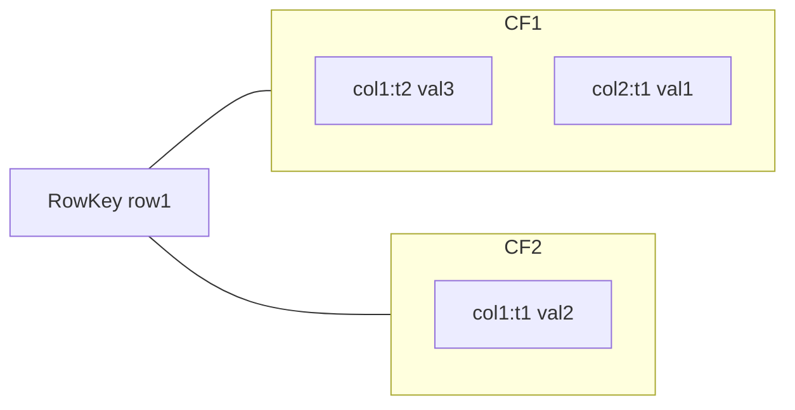
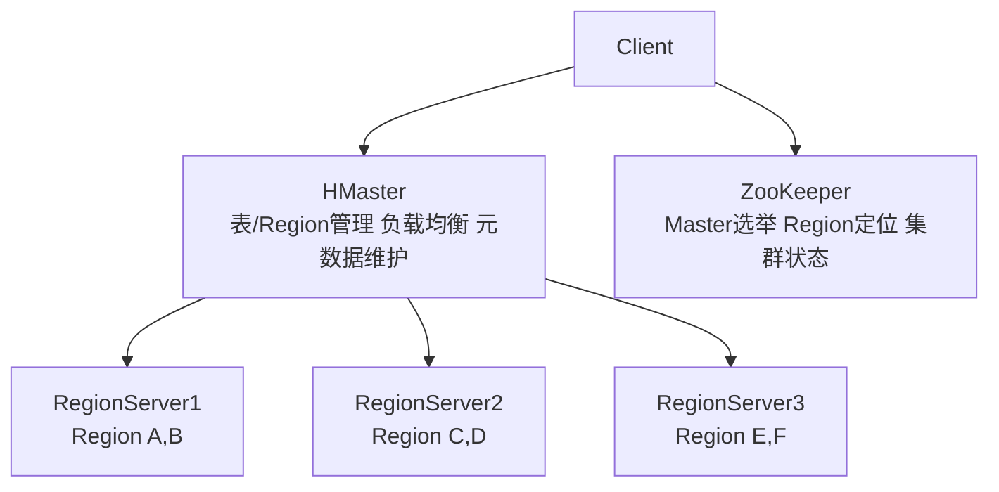
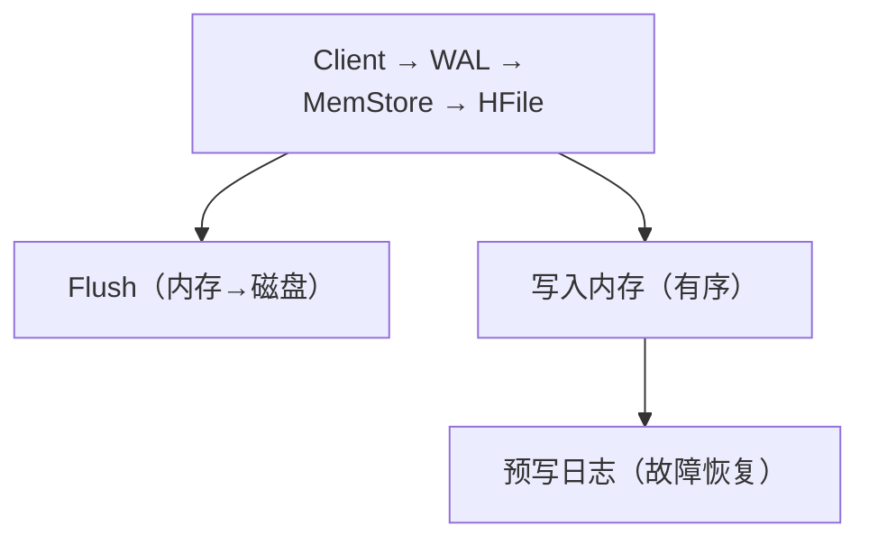
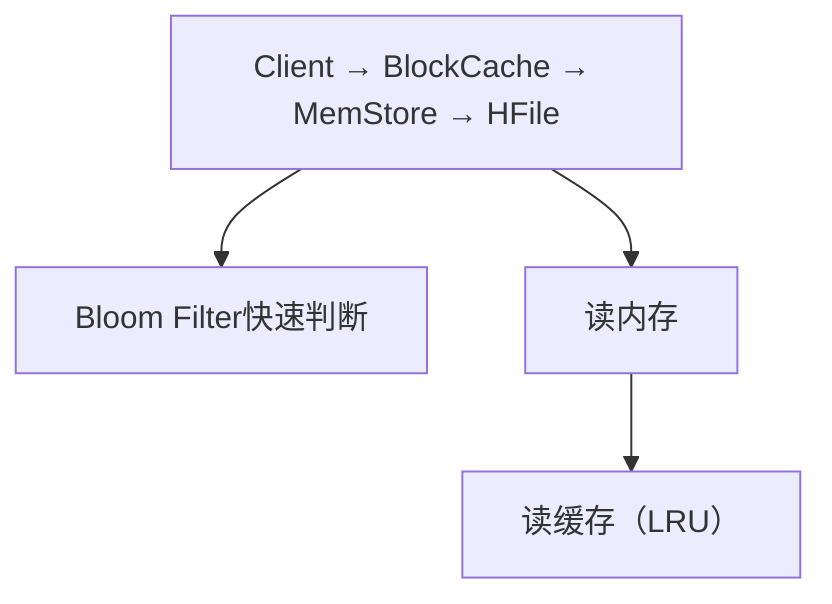

## 1. HBase架构设计

HBase 是基于 HDFS 的**分布式列族数据库**，提供海量数据的**随机读写**能力。

### 1.1 核心概念

| 概念             | 说明                           | 类比RDBMS |
| :--------------- | :----------------------------- | :-------- |
| RowKey           | 行唯一标识                     | 主键      |
| Column Family    | 列族，列的分组                 | 列组      |
| Column Qualifier | 列族内的列                     | 列名      |
| Cell             | RowKey+CF+CQ+Timestamp → Value | 单元格    |
| Region           | 表的水平分片                   | 分区      |
| Store            | Region中一个列族的存储         | —         |
| HFile            | Store的实际数据文件            | 数据文件  |
| MemStore         | 内存写入缓冲                   | —         |

**数据模型**：



### 1.2 系统架构



### 1.3 Region管理

Region 是 HBase **分布式和负载均衡的最小单元**：

- 每个表初始为一个 Region，随数据增长**自动分裂**
- Region 分裂阈值：`hbase.hregion.max.filesize`（默认10GB）
- 分裂过程：**先下线再分裂再上线**

$$\text{Region数量} \approx \frac{\text{表数据量}}{\text{Region大小}}$$

Region 定位流程：

```
Client → ZooKeeper → hbase:meta表 → RegionServer → Region
```

## 2. RowKey设计

RowKey 设计是 HBase 性能的**决定性因素**，直接影响数据分布和查询效率。

### 2.1 设计原则

| 原则     | 说明           | 原因                    |
| :------- | :------------- | :---------------------- |
| 唯一性   | RowKey全局唯一 | 主键约束                |
| 长度适中 | 10~100字节     | 过长影响存储和索引效率  |
| 散列分布 | 避免热点       | 均匀分布到所有Region    |
| 有序性   | 支持范围扫描   | HBase按RowKey字典序存储 |

### 2.2 热点问题与解决方案

**问题**：顺序写入导致所有请求集中在一个Region

```
RowKey: user1 → Region A  ← 所有写入
RowKey: user2 → Region A  ← 所有写入
RowKey: user3 → Region A  ← 所有写入
```

**解决方案**：

1. **加盐（Salting）**：在RowKey前添加随机前缀

```
原始: user1, user2, user3
加盐: a-user1, b-user2, c-user3  → 分散到不同Region
```

2. **哈希（Hashing）**：对RowKey取哈希

$$\text{RowKey} = \text{MD5}(\text{userId})[:8] + \text{userId}$$

3. **反转（Reversing）**：反转RowKey字符串

```
原始: 20240101-user1 → 集中写入
反转: 1resu-10104202 → 分散写入
```

### 2.3 常见设计模式

| 模式       | RowKey格式                                    | 适用场景         |
| :--------- | :-------------------------------------------- | :--------------- |
| 时间序列   | `userId_reverse + Long.MAX_VALUE - timestamp` | 按用户查最新数据 |
| 查询优先   | `查询维度 + 时间戳`                           | 按维度范围查询   |
| 散列前缀   | `hash(prefix) % N + 原始Key`                  | 写入均衡         |
| 复合RowKey | `regionId + '#' + userId + '#' + timestamp`   | 多维度查询       |

## 3. 读写流程

### 3.1 写入流程



**详细步骤**：

1. 客户端定位目标 RegionServer
2. 写入 **WAL（Write-Ahead Log）**：确保数据不丢失
3. 写入 **MemStore**：内存中的有序数据结构
4. 返回客户端写入成功
5. MemStore 达到阈值（128MB）时 **Flush** 为 HFile
6. HFile 增多时触发 **Minor Compaction**（合并小文件）
7. 定期触发 **Major Compaction**（合并所有HFile，清理删除标记）

### 3.2 读取流程



**读取优化**：

1. **BlockCache**：LRU缓存，缓存热点数据块（默认64KB）
2. **Bloom Filter**：快速判断RowKey/Column是否在HFile中
3. **TimeRange**：利用时间戳过滤HFile

### 3.3 LSM-Tree模型

HBase 基于 **LSM-Tree（Log-Structured Merge-Tree）**：

```
写入: MemStore(C0) → Flush → HFile(C1) → Compaction → HFile(C2)
                    内存       磁盘Level1           磁盘Level2
```

- 写入性能：$O(1)$（只写内存）
- 读取性能：$O(\text{Level数})$（需合并多层数据）
- 空间放大：通过Compaction回收

## 4. HBase性能优化

### 4.1 关键配置

| 参数                                      | 默认值 | 说明                         |
| :---------------------------------------- | :----- | :--------------------------- |
| `hbase.hregion.max.filesize`              | 10GB   | Region最大大小               |
| `hbase.regionserver.global.memstore.size` | 0.4    | MemStore占堆内存比例         |
| `hfile.block.cache.size`                  | 0.4    | BlockCache占堆内存比例       |
| `hbase.hstore.compactionThreshold`        | 3      | 触发Minor Compaction的文件数 |
| `hbase.hregion.memstore.flush.size`       | 128MB  | MemStore Flush阈值           |

### 4.2 优化策略

1. **预分区**：建表时指定Region分裂点，避免初始热点
2. **Bloom Filter**：ROW或ROWCOL级别，减少无效磁盘读取
3. **列族数量**：不超过3个，每个列族独立Store和Flush
4. **Compaction策略**：FIFO / Exploring / Stripe / Date Tiered
5. **Region大小**：根据读写模式调整，过大导致Compaction压力大
6. **GC优化**：使用G1GC，减少GC停顿

## 参考文献

Apache Spark：https://spark.apache.org/docs/latest/
Apache Flink：https://flink.apache.org/
Apache Kafka：https://kafka.apache.org/documentation/
ClickHouse：https://clickhouse.com/docs
Airflow：https://airflow.apache.org/docs/

## 延伸阅读

大数据生态概览，见 052-big-data 模块文档。
数据分析与统计，见 051-data-analysis/030-probability-statistics 模块。
分布式系统基础，见 034-cloud-computing 模块。
尚硅谷 Bilibili 空间（https://space.bilibili.com/302417610 ）提供大数据课程。

## 深度专题扩展

以下专题从不同角度深入本文主题，供有进阶需求的读者研读。每个专题独立成节，内容相互补充。

### 13.1 流处理语义深入

At-most-once：可能丢；At-least-once：可能重；Exactly-once：端到端精确一次需事务/幂等。
状态后端：RocksDB 本地状态 + checkpoint 快照；重启恢复。
窗口：滚动（固定）、滑动（重叠）、会话（空闲间隔）；触发条件（水位线 + 允许迟到）。
实践：幂等写入 + 去重键（事件 ID）兜底。

### 13.2 数据仓库建模

维度建模：事实表（度量、外键）+ 维度表（描述）；星型模型查询友好。
分层：ODS 原样、DWD 明细清洗、DWS 汇总、ADS 应用。
缓慢变化维度（SCD）：覆盖（1）、新增行（2）、新增列（3）。
建模工具：dbt 实现 ELT 与测试；血缘可视化。

## 模块文档速查表

| 文档 | 主题 | 与本文的关联 |
| --- | --- | --- |
| 大数据概述 | 001-DataOverview | 本文的前置基础 |
| HDFS分布式文件系统 | 002-HDFSDistributedFileSystem | 本文的并列主题 |
| MapReduce | 003-MapReduce | 本文的并列主题 |
| Spark核心 | 004-SparkCore | 本文的并列主题 |
| Spark-Streaming | 005-SparkStreaming | 本文的并列主题 |
| Hive数据仓库 | 006-HiveDataWarehouse | 本文的并列主题 |
| HBase列族数据库 | 007-HBaseDatabase | 本文自身 |
| Kafka消息队列 | 008-KafkaMessageQueue | 本文的并列主题 |
| Flink流处理 | 009-FlinkStreamHandling | 本文的并列主题 |
| 数据湖 | 010-DataLake | 本文的并列主题 |
| Zookeeper协调服务 | 011-Zookeeper | 本文的并列主题 |
| YARN资源管理 | 012-YARNManagement | 本文的并列主题 |
| 大数据 HDFS 命令 | 013-HDFSCommands | 本文的并列主题 |
| 大数据 YARN 命令 | 014-YARNCommands | 本文的并列主题 |
| 大数据 Spark RDD | 015-SparkRDD | 本文的并列主题 |
| 大数据 Spark DataFrame | 016-SparkDataFrame | 本文的并列主题 |
| 大数据 Hive DDL | 017-HiveDDL | 本文的并列主题 |
| 大数据 Hive DML | 018-HiveDML | 本文的并列主题 |
| 大数据 Hive 函数 | 019-HiveFunctions | 本文的并列主题 |
| 大数据 Kafka 命令 | 020-KafkaCommands | 本文的并列主题 |
| 大数据 HBase 命令 | 021-HBaseCommands | 本文的并列主题 |
| 大数据 Flink 流处理 | 022-FlinkBasics | 本文的并列主题 |
| 大数据 Spark 优化 | 023-SparkOptimization | 本文的性能延伸 |
