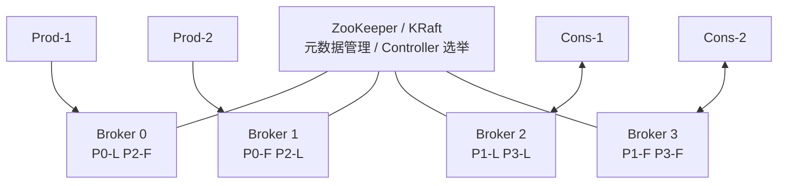
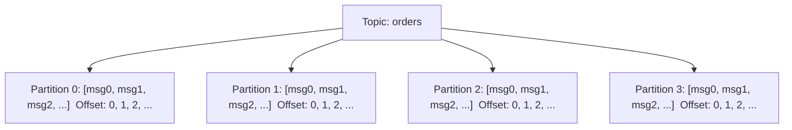
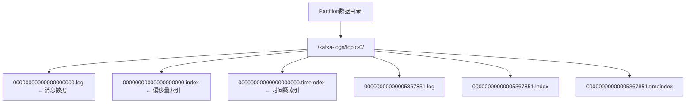

## 1. Kafka架构设计

Kafka 是一个**分布式、高吞吐、持久化**的消息队列系统，广泛应用于实时数据管道和流处理场景。

### 1.1 核心架构



### 1.2 核心概念

| 概念               | 说明                                     |
| :----------------- | :--------------------------------------- |
| **Broker**         | Kafka服务节点，负责消息存储和转发        |
| **Topic**          | 消息的逻辑分类                           |
| **Partition**      | Topic的物理分片，有序、不可变日志        |
| **Offset**         | 消息在Partition中的唯一位置标识          |
| **Replica**        | Partition的副本，分为Leader和Follower    |
| **Consumer Group** | 消费者组，组内消费者共同消费Topic        |
| **ISR**            | In-Sync Replicas，与Leader同步的副本集合 |

### 1.3 Topic与Partition



- 每个Partition是一个**有序、不可变、追加写**的日志
- Partition数量决定**最大并行度**
- 消息在Partition内有序，跨Partition无序

## 2. Producer生产者

### 2.1 发送模式

```java
// 同步发送
RecordMetadata metadata = producer.send(record).get();

// 异步发送
producer.send(record, (metadata, exception) -> {
    if (exception != null) {
        // 处理发送失败
    }
});

// 发送并忘记
producer.send(record);
```

### 2.2 分区策略

| 策略     | 说明                        | 适用场景              |
| :------- | :-------------------------- | :-------------------- |
| 指定分区 | `record.partition()`        | 精确控制              |
| Key哈希  | `hash(key) % numPartitions` | 保证相同Key到同一分区 |
| 轮询     | Round Robin                 | 均匀分布              |
| 自定义   | 实现 `Partitioner` 接口     | 业务定制              |

$$\text{partition} = \text{hash}(\text{key}) \bmod N$$

### 2.3 ACK确认机制

| acks值 | 说明        | 可靠性 | 延迟 |
| :----- | :---------- | :----- | :--- |
| 0      | 不等待确认  | 最低   | 最低 |
| 1      | Leader确认  | 中等   | 中等 |
| all    | 所有ISR确认 | 最高   | 最高 |

### 2.4 幂等生产者

```java
props.put("enable.idempotence", "true");
// 自动设置:
// acks = all
// retries = Integer.MAX_VALUE
// max.in.flight.requests.per.connection <= 5
```

幂等性保证：**单Partition内**消息不重复（通过Producer ID + Sequence Number去重）。

## 3. Consumer消费者

### 3.1 消费者组

```
Topic: orders (4 Partitions)

Consumer Group A:
  Consumer-1 ← Partition 0, Partition 1
  Consumer-2 ← Partition 2, Partition 3

Consumer Group B:
  Consumer-3 ← Partition 0, Partition 2
  Consumer-4 ← Partition 1
  Consumer-5 ← Partition 3
```

**核心规则**：

- 同一Consumer Group内，一个Partition只能被一个Consumer消费
- 不同Consumer Group之间互不影响
- Consumer数量 > Partition数量时，多余Consumer空闲

### 3.2 Offset管理

| 策略         | 说明                                | 适用场景     |
| :----------- | :---------------------------------- | :----------- |
| 自动提交     | `enable.auto.commit=true`，定期提交 | 允许少量重复 |
| 手动同步提交 | `commitSync()`                      | 确保提交成功 |
| 手动异步提交 | `commitAsync()`                     | 高吞吐       |
| 组合提交     | 异步+同步                           | 生产推荐     |

```java
// 组合提交模式
try {
    while (true) {
        ConsumerRecords<String, String> records = consumer.poll(Duration.ofMillis(100));
        for (ConsumerRecord<String, String> record : records) {
            process(record);
        }
        consumer.commitAsync(); // 异步提交
    }
} finally {
    consumer.commitSync(); // 关闭前同步确保
    consumer.close();
}
```

### 3.3 Rebalance机制

**触发条件**：Consumer加入/离开Group、订阅Topic变化、Partition变化

**Rebalance流程（Consumer Protocol）**：

```
1. FindCoordinator → 找到Group Coordinator
2. JoinGroup → Consumer请求加入Group
3. SyncGroup → Leader分配Partition方案，广播给所有成员
4. Heartbeat → 维持组成员关系
```

**分区分配策略**：

| 策略              | 算法                    | 特点               |
| :---------------- | :---------------------- | :----------------- |
| Range             | 按Partition编号范围分配 | 可能不均匀         |
| RoundRobin        | 轮询分配                | 均匀               |
| Sticky            | 尽量保持原有分配        | 最小化迁移         |
| CooperativeSticky | 增量式Rebalance         | 避免Stop-The-World |

## 4. Kafka存储与复制

### 4.1 日志存储



- **Segment**：每个Partition分为多个Segment（默认1GB）
- **稀疏索引**：每4KB消息建立一条索引，平衡索引大小和查询效率
- **零拷贝**：使用 `sendfile()` 系统调用，数据直接从磁盘到网卡

### 4.2 副本与ISR

```
Partition 0:
  Leader: Broker-1 (ISR)
  Follower: Broker-2 (ISR)
  Follower: Broker-3 (不在ISR，落后太多)
```

**ISR机制**：

- ISR = 与Leader保持同步的副本集合
- Follower落后超过 `replica.lag.time.max.ms`（默认30秒）则移出ISR
- 当Leader宕机，从ISR中选举新Leader
- `min.insync.replicas`：最小ISR数量，与 `acks=all` 配合使用

**数据一致性保证**：

$$\text{可靠写入} \iff \text{acks=all} \land |\text{ISR}| \geq \text{min.insync.replicas}$$

## 5. Exactly-Once语义

### 5.1 三种语义

| 语义          | 说明     | 实现难度 |
| :------------ | :------- | :------- |
| At Most Once  | 可能丢失 | 简单     |
| At Least Once | 可能重复 | 中等     |
| Exactly Once  | 精确一次 | 复杂     |

### 5.2 Kafka事务

```java
// 生产者事务
producer.initTransactions();
try {
    producer.beginTransaction();
    producer.send(record1);
    producer.send(record2);
    producer.commitTransaction();
} catch (Exception e) {
    producer.abortTransaction();
}

// 消费-处理-生产 事务（Consume-Transform-Produce）
producer.sendOffsetsToTransaction(
    offsets, consumerGroupId);
```

### 5.3 Kafka Streams Exactly-Once

```java
props.put("processing.guarantee", "exactly_once_v2");
```

通过 **Changelog Topic** + **Transaction** 实现端到端Exactly-Once。

## 6. 性能调优

### 6.1 Producer调优

| 参数               | 建议       | 说明             |
| :----------------- | :--------- | :--------------- |
| `batch.size`       | 16KB~64KB  | 批量发送大小     |
| `linger.ms`        | 5~10ms     | 等待批量填充时间 |
| `buffer.memory`    | 32MB+      | 发送缓冲区       |
| `compression.type` | lz4/snappy | 压缩算法         |

### 6.2 Consumer调优

| 参数                | 建议  | 说明               |
| :------------------ | :---- | :----------------- |
| `fetch.min.bytes`   | 1MB   | 最小拉取字节数     |
| `fetch.max.wait.ms` | 500ms | 最大等待时间       |
| `max.poll.records`  | 500   | 单次拉取最大记录数 |

### 6.3 Broker调优

| 参数                  | 建议      | 说明         |
| :-------------------- | :-------- | :----------- |
| `num.io.threads`      | CPU核数   | IO线程数     |
| `num.network.threads` | CPU核数+1 | 网络线程数   |
| `log.segment.bytes`   | 1GB       | Segment大小  |
| `log.retention.hours` | 168(7天)  | 日志保留时间 |

## 参考文献

Apache Spark：https://spark.apache.org/docs/latest/
Apache Flink：https://flink.apache.org/
Apache Kafka：https://kafka.apache.org/documentation/
ClickHouse：https://clickhouse.com/docs
Airflow：https://airflow.apache.org/docs/

## 延伸阅读

大数据生态概览，见 052-big-data 模块文档。
数据分析与统计，见 051-data-analysis/030-probability-statistics 模块。
分布式系统基础，见 034-cloud-computing 模块。
尚硅谷 Bilibili 空间（https://space.bilibili.com/302417610 ）提供大数据课程。

## 深度专题扩展

以下专题从不同角度深入本文主题，供有进阶需求的读者研读。每个专题独立成节，内容相互补充。

### 13.1 流处理语义深入

At-most-once：可能丢；At-least-once：可能重；Exactly-once：端到端精确一次需事务/幂等。
状态后端：RocksDB 本地状态 + checkpoint 快照；重启恢复。
窗口：滚动（固定）、滑动（重叠）、会话（空闲间隔）；触发条件（水位线 + 允许迟到）。
实践：幂等写入 + 去重键（事件 ID）兜底。

### 13.2 数据仓库建模

维度建模：事实表（度量、外键）+ 维度表（描述）；星型模型查询友好。
分层：ODS 原样、DWD 明细清洗、DWS 汇总、ADS 应用。
缓慢变化维度（SCD）：覆盖（1）、新增行（2）、新增列（3）。
建模工具：dbt 实现 ELT 与测试；血缘可视化。

## 模块文档速查表

| 文档 | 主题 | 与本文的关联 |
| --- | --- | --- |
| 大数据概述 | 001-DataOverview | 本文的前置基础 |
| HDFS分布式文件系统 | 002-HDFSDistributedFileSystem | 本文的并列主题 |
| MapReduce | 003-MapReduce | 本文的并列主题 |
| Spark核心 | 004-SparkCore | 本文的并列主题 |
| Spark-Streaming | 005-SparkStreaming | 本文的并列主题 |
| Hive数据仓库 | 006-HiveDataWarehouse | 本文的并列主题 |
| HBase列族数据库 | 007-HBaseDatabase | 本文的并列主题 |
| Kafka消息队列 | 008-KafkaMessageQueue | 本文自身 |
| Flink流处理 | 009-FlinkStreamHandling | 本文的并列主题 |
| 数据湖 | 010-DataLake | 本文的并列主题 |
| Zookeeper协调服务 | 011-Zookeeper | 本文的并列主题 |
| YARN资源管理 | 012-YARNManagement | 本文的并列主题 |
| 大数据 HDFS 命令 | 013-HDFSCommands | 本文的并列主题 |
| 大数据 YARN 命令 | 014-YARNCommands | 本文的并列主题 |
| 大数据 Spark RDD | 015-SparkRDD | 本文的并列主题 |
| 大数据 Spark DataFrame | 016-SparkDataFrame | 本文的并列主题 |
| 大数据 Hive DDL | 017-HiveDDL | 本文的并列主题 |
| 大数据 Hive DML | 018-HiveDML | 本文的并列主题 |
| 大数据 Hive 函数 | 019-HiveFunctions | 本文的并列主题 |
| 大数据 Kafka 命令 | 020-KafkaCommands | 本文的并列主题 |
| 大数据 HBase 命令 | 021-HBaseCommands | 本文的并列主题 |
| 大数据 Flink 流处理 | 022-FlinkBasics | 本文的并列主题 |
| 大数据 Spark 优化 | 023-SparkOptimization | 本文的性能延伸 |
