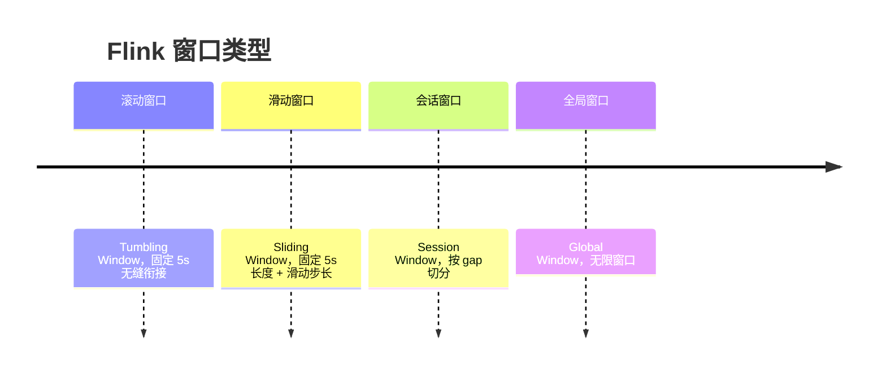
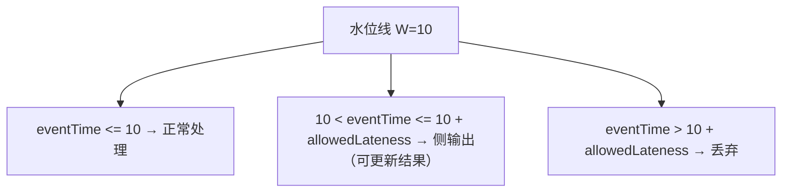
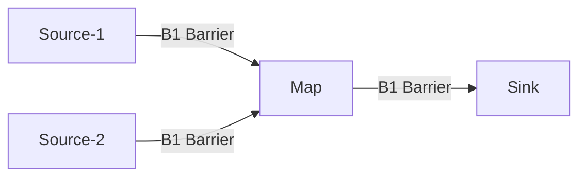

## 1. Flink架构与核心概念

Apache Flink 是一个**有状态的流处理框架**，原生支持流处理，批处理被视为流处理的特例。

### 1.1 核心特性

| 特性         | 说明                       |
| :----------- | :------------------------- |
| 真正的流处理 | 逐条处理，非微批           |
| 有状态计算   | 内置状态管理，支持增量计算 |
| Exactly-Once | 端到端精确一次语义         |
| 事件时间     | 基于数据产生时间处理       |
| 流批一体     | DataStream API统一流批     |

### 1.2 运行架构

```mermaid
flowchart TD
    subgraph JM[JobManager]
        D[Dispatcher] RM[ResourceManager]
        JMA[JobMaster 每个Job一个<br/>ExecutionGraph / CheckpointCoordinator]
    end
    TM1[TaskManager<br/>Slot 0 1<br/>Task A B]
    TM2[TaskManager<br/>Slot 0 1<br/>Task C D]
    TM3[TaskManager<br/>Slot 0 1<br/>Task E F]
    JM --> TM1
    JM --> TM2
    JM --> TM3
```

### 1.3 作业执行层次

$$\text{StreamGraph} \rightarrow \text{JobGraph} \rightarrow \text{ExecutionGraph} \rightarrow \text{Physical Execution}$$

| 层次           | 说明                                     |
| :------------- | :--------------------------------------- |
| StreamGraph    | 用户API生成的逻辑图                      |
| JobGraph       | 优化后提交给JobManager的图（算子链合并） |
| ExecutionGraph | 并行化后的执行图                         |
| Physical       | 实际运行在TaskManager上的任务            |

## 2. 窗口机制

窗口是流处理中**将无限流切割为有限流**的核心机制。

### 2.1 窗口类型



### 2.2 窗口API

```java
// 滚动窗口
dataStream.keyBy(t -> t.key)
    .window(TumblingEventTimeWindows.of(Time.seconds(5)));

// 滑动窗口
dataStream.keyBy(t -> t.key)
    .window(SlidingEventTimeWindows.of(Time.seconds(5), Time.seconds(1)));

// 会话窗口
dataStream.keyBy(t -> t.key)
    .window(EventTimeSessionWindows.withGap(Time.minutes(10)));

// 计数窗口
dataStream.keyBy(t -> t.key)
    .countWindow(100);  // 每100条触发
```

### 2.3 窗口触发器

| 触发器                     | 说明                         |
| :------------------------- | :--------------------------- |
| EventTimeTrigger           | 水位线超过窗口结束时间触发   |
| ProcessingTimeTrigger      | 处理时间超过窗口结束时间触发 |
| ContinuousEventTimeTrigger | 持续事件时间触发             |
| CountTrigger               | 元素计数触发                 |
| PurgingTrigger             | 触发后清除窗口状态           |

## 3. 水位线（Watermark）

水位线是 Flink 处理**事件时间**和**迟到数据**的核心机制。

### 3.1 水位线定义

水位线是一个**时间戳**，表示**到此时间点之前的所有数据应该已经到达**：

$$W(t) = \max(\text{eventTime}) - \text{allowedLateness}$$

```mermaid
flowchart LR
    E1[e1 3] E2[e2 5] E3[e3 4] E4[e4 8] E5[e5 7] E6[e6 10]
    T[时间轴 3 4 5 6 7 8 9 10]
    W[水位线 W=3 W=4 W=5 W=7 W=8 W=10]
    E1 --> T
    E2 --> T
    E3 --> T
    E4 --> T
    E5 --> T
    E6 --> T
    T --> W
```

### 3.2 水位线生成策略

```java
// 有序流（单调递增）
WatermarkStrategy.forMonotonousTimestamps()

// 乱序流（允许延迟）
WatermarkStrategy.forBoundedOutOfOrderness(Duration.ofSeconds(5))

// 自定义
WatermarkStrategy.forGenerator(ctx -> new PunctuatedWatermarkGenerator())
```

**有序流水位线**：

$$W_n = \max(\text{eventTime}_n)$$

**乱序流水位线**：

$$W_n = \max(\text{eventTime}_n) - \Delta$$

其中 $\Delta$ 为最大允许乱序时间。

### 3.3 迟到数据处理



```java
OutputTag<Event> lateEvents = new OutputTag<Event>("late-events"){};

dataStream.keyBy(t -> t.key)
    .window(TumblingEventTimeWindows.of(Time.seconds(5)))
    .allowedLateness(Time.minutes(1))
    .sideOutputLateData(lateEvents)
    .process(new MyProcessFunction());

// 获取迟到数据
DataStream<Event> lateStream = result.getSideOutput(lateEvents);
```

## 4. 状态管理

### 4.1 状态类型

| 类型           | 说明             | 示例           |
| :------------- | :--------------- | :------------- |
| Keyed State    | 绑定到Key的状态  | 每个用户的计数 |
| Operator State | 绑定到算子的状态 | Kafka Offset   |

**Keyed State 分类**：

| State            | 说明               | 用途   |
| :--------------- | :----------------- | :----- |
| ValueState       | 单值状态           | 计数器 |
| ListState        | 列表状态           | 缓冲区 |
| MapState         | 映射状态           | 去重   |
| ReducingState    | 聚合状态           | 累加   |
| AggregatingState | 聚合状态（IN≠OUT） | 均值   |

### 4.2 状态后端

| 后端                        | 存储            | 适用场景           |
| :-------------------------- | :-------------- | :----------------- |
| HashMapStateBackend         | TaskManager内存 | 小状态、低延迟     |
| EmbeddedRocksDBStateBackend | 本地RocksDB     | 大状态、可溢写磁盘 |

```java
// 配置RocksDB状态后端
env.setStateBackend(new EmbeddedRocksDBStateBackend());
env.getCheckpointConfig().setCheckpointStorage("hdfs://checkpoints");
```

## 5. Checkpoint与容错

### 5.1 Checkpoint机制

Flink 基于 **Chandy-Lamport 算法**的分布式快照实现容错：



所有算子收到 Barrier 后保存状态快照

**流程**：

1. JobManager 向所有 Source 注入 **Checkpoint Barrier**
2. Barrier 随数据流向下流动
3. 算子收到 Barrier 后**对齐**（所有输入的Barrier到齐）
4. 对齐后**保存状态快照**到持久化存储
5. 向下游转发 Barrier
6. 所有算子完成，Checkpoint 完成

### 5.2 Checkpoint配置

```java
CheckpointConfig config = env.getCheckpointConfig();

// 开启Checkpoint，间隔1秒
env.enableCheckpointing(1000);

// 模式：精确一次 vs 至少一次
config.setCheckpointingMode(CheckpointingMode.EXACTLY_ONCE);

// 超时时间
config.setCheckpointTimeout(60000);

// 最小间隔（防止Checkpoint过于频繁）
config.setMinPauseBetweenCheckpoints(500);

// 并发Checkpoint数
config.setMaxConcurrentCheckpoints(1);

// 保留策略
config.setExternalizedCheckpointCleanup(
    ExternalizedCheckpointCleanup.RETAIN_ON_CANCELLATION);

// 允许的Checkpoint失败次数
config.setTolerableCheckpointFailureNumber(3);
```

### 5.3 Savepoint

Savepoint 是**手动触发的、可迁移的**Checkpoint：

```bash
# 触发Savepoint
flink savepoint <jobId> [targetDirectory]

# 从Savepoint恢复
flink run -s <savepointPath> -d <jarFile>

# 取消作业并触发Savepoint
flink cancel -s [targetDirectory] <jobId>
```

### 5.4 端到端Exactly-Once

实现端到端Exactly-Once需要**两阶段提交（2PC）**：

```
1. Checkpoint Barrier 到达 Sink
2. Sink 开启事务 → 写入外部系统
3. 所有算子完成状态快照
4. JobManager 确认 Checkpoint 完成
5. Sink 提交事务
```

**支持Exactly-Once的Sink**：Kafka、HDFS（通过两阶段提交）、数据库（通过XA事务）。

## 6. Flink SQL

```sql
-- 创建Kafka源表
CREATE TABLE orders (
    order_id BIGINT,
    user_id BIGINT,
    amount DECIMAL(10, 2),
    order_time TIMESTAMP(3),
    WATERMARK FOR order_time AS order_time - INTERVAL '5' SECOND
) WITH (
    'connector' = 'kafka',
    'topic' = 'orders',
    'properties.bootstrap.servers' = 'localhost:9092',
    'format' = 'json'
);

-- 窗口聚合查询
SELECT
    window_start,
    window_end,
    user_id,
    SUM(amount) AS total_amount,
    COUNT(*) AS order_count
FROM TABLE(
    HOP(TABLE orders, DESCRIPTOR(order_time), INTERVAL '1' HOUR, INTERVAL '24' HOUR)
)
GROUP BY window_start, window_end, user_id;
```

## 参考文献


Apache Spark：https://spark.apache.org/docs/latest/
Apache Flink：https://flink.apache.org/
Apache Kafka：https://kafka.apache.org/documentation/
ClickHouse：https://clickhouse.com/docs
Airflow：https://airflow.apache.org/docs/

## 延伸阅读


大数据生态概览，见 052-big-data 模块文档。
数据分析与统计，见 051-data-analysis/030-probability-statistics 模块。
分布式系统基础，见 034-cloud-computing 模块。
尚硅谷 Bilibili 空间（https://space.bilibili.com/302417610 ）提供大数据课程。

## 深度专题扩展


以下专题从不同角度深入本文主题，供有进阶需求的读者研读。每个专题独立成节，内容相互补充。

### 13.1 流处理语义深入

At-most-once：可能丢；At-least-once：可能重；Exactly-once：端到端精确一次需事务/幂等。
状态后端：RocksDB 本地状态 + checkpoint 快照；重启恢复。
窗口：滚动（固定）、滑动（重叠）、会话（空闲间隔）；触发条件（水位线 + 允许迟到）。
实践：幂等写入 + 去重键（事件 ID）兜底。

### 13.2 数据仓库建模

维度建模：事实表（度量、外键）+ 维度表（描述）；星型模型查询友好。
分层：ODS 原样、DWD 明细清洗、DWS 汇总、ADS 应用。
缓慢变化维度（SCD）：覆盖（1）、新增行（2）、新增列（3）。
建模工具：dbt 实现 ELT 与测试；血缘可视化。

## 模块文档速查表

| 文档 | 主题 | 与本文的关联 |
| --- | --- | --- |
| 大数据概述 | 001-DataOverview | 本文的前置基础 |
| HDFS分布式文件系统 | 002-HDFSDistributedFileSystem | 本文的并列主题 |
| MapReduce | 003-MapReduce | 本文的并列主题 |
| Spark核心 | 004-SparkCore | 本文的并列主题 |
| Spark-Streaming | 005-SparkStreaming | 本文的并列主题 |
| Hive数据仓库 | 006-HiveDataWarehouse | 本文的并列主题 |
| HBase列族数据库 | 007-HBaseDatabase | 本文的并列主题 |
| Kafka消息队列 | 008-KafkaMessageQueue | 本文的并列主题 |
| Flink流处理 | 009-FlinkStreamHandling | 本文自身 |
| 数据湖 | 010-DataLake | 本文的并列主题 |
| Zookeeper协调服务 | 011-Zookeeper | 本文的并列主题 |
| YARN资源管理 | 012-YARNManagement | 本文的并列主题 |
| 大数据 HDFS 命令 | 013-HDFSCommands | 本文的并列主题 |
| 大数据 YARN 命令 | 014-YARNCommands | 本文的并列主题 |
| 大数据 Spark RDD | 015-SparkRDD | 本文的并列主题 |
| 大数据 Spark DataFrame | 016-SparkDataFrame | 本文的并列主题 |
| 大数据 Hive DDL | 017-HiveDDL | 本文的并列主题 |
| 大数据 Hive DML | 018-HiveDML | 本文的并列主题 |
| 大数据 Hive 函数 | 019-HiveFunctions | 本文的并列主题 |
| 大数据 Kafka 命令 | 020-KafkaCommands | 本文的并列主题 |
| 大数据 HBase 命令 | 021-HBaseCommands | 本文的并列主题 |
| 大数据 Flink 流处理 | 022-FlinkBasics | 本文的并列主题 |
| 大数据 Spark 优化 | 023-SparkOptimization | 本文的性能延伸 |
