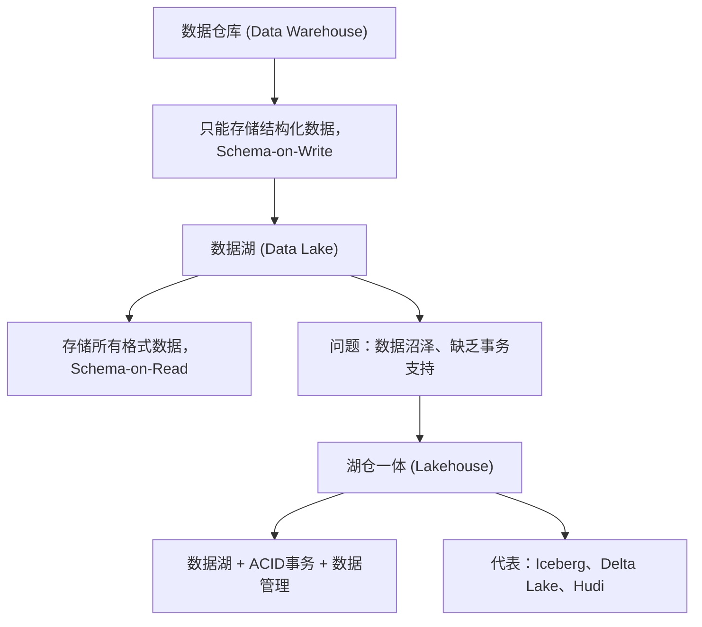
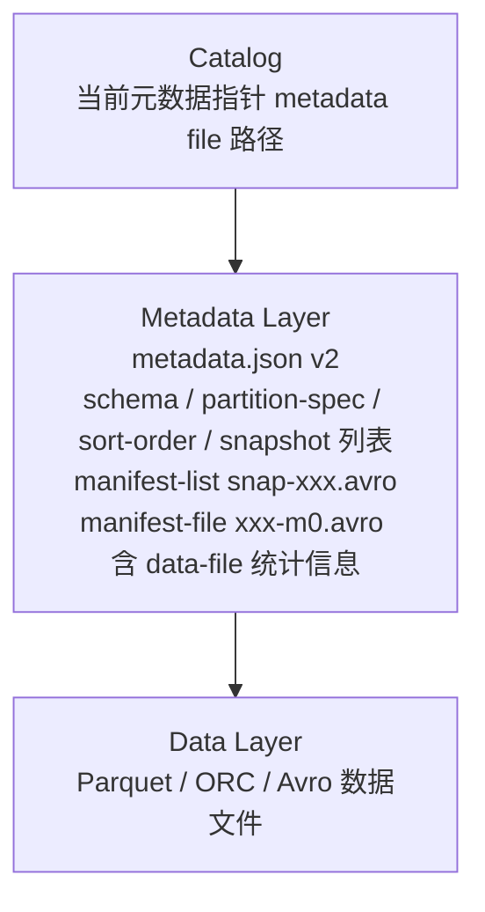
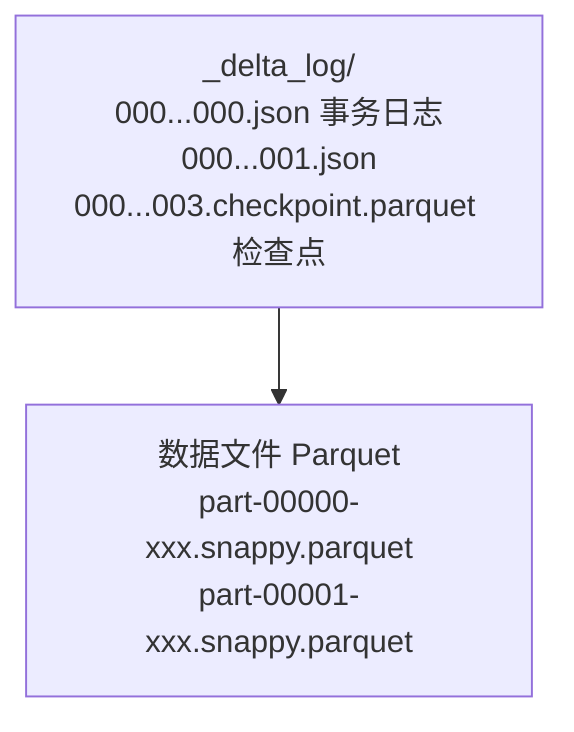

## 1. 数据湖概念与演进

数据湖是一个**集中式存储库**，以原始格式存储所有结构化和非结构化数据，支持批处理和流处理的统一访问。

### 1.1 数据架构演进



### 1.2 湖仓一体核心能力

| 能力       | 说明                     |
| :--------- | :----------------------- |
| ACID事务   | 支持并发读写、原子性提交 |
| Schema演进 | 增删列无需重写数据       |
| 时间旅行   | 查询历史版本数据         |
| 增量处理   | 支持增量读取和CDC        |
| Upsert支持 | 行级更新和删除           |
| 存储分层   | 冷热数据自动分层         |

## 2. Apache Iceberg

### 2.1 核心架构

Iceberg 采用**多层元数据**架构，解耦存储引擎和计算引擎：



### 2.2 核心特性

**快照隔离**：

每次写入创建一个新**快照（Snapshot）**，读操作始终看到一致的快照视图：

```
Snapshot 1 (v1): [data-file-1, data-file-2]
Snapshot 2 (v2): [data-file-1, data-file-2, data-file-3]  ← 追加
Snapshot 3 (v3): [data-file-2, data-file-3, data-file-4]  ← 删除file-1，追加file-4
```

**时间旅行**：

```sql
-- 查询特定快照
SELECT * FROM table FOR SYSTEM_VERSION_AS_OF 123456789;

-- 查询特定时间点
SELECT * FROM table FOR SYSTEM_TIME_AS OF '2024-01-01 00:00:00';
```

**Schema演进**：

```sql
-- 添加列
ALTER TABLE table ADD COLUMN new_col STRING;

-- 删除列
ALTER TABLE table DROP COLUMN old_col;

-- 重命名列
ALTER TABLE table RENAME COLUMN col1 TO col2;

-- 修改类型（安全 widening）
ALTER TABLE table ALTER COLUMN int_col TYPE BIGINT;
```

### 2.3 分区演进

Iceberg 支持**隐藏分区（Hidden Partitioning）**，查询无需知道分区列：

```sql
-- 创建表时定义分区转换
CREATE TABLE table (
    id BIGINT,
    event_time TIMESTAMP,
    data STRING
) PARTITIONED BY (bucket(16, id), days(event_time));

-- 查询自动分区裁剪
SELECT * FROM table WHERE event_time > '2024-01-01';
-- 自动裁剪到 days(event_time) 对应的分区
```

## 3. Delta Lake

### 4.1 核心架构

Delta Lake 由 Databricks 开发，深度集成 Spark 生态：



### 4.2 事务日志

每次写入生成一个**JSON日志文件**，记录操作：

```json
{
  "commitInfo": {
    "timestamp": 1704067200000,
    "operation": "WRITE",
    "operationParameters": {"mode": "Append"}
  }
}
{
  "add": {
    "path": "part-00000-xxx.parquet",
    "partitionValues": {"date": "2024-01-01"},
    "size": 1048576,
    "stats": "{\"numRecords\":1000,\"minValues\":{\"id\":1},\"maxValues\":{\"id\":1000}}"
  }
}
```

### 4.3 核心特性

```python
# ACID事务
df.write.format("delta").mode("append").save("/delta/table")

# 时间旅行
df = spark.read.format("delta") \
    .option("versionAsOf", 5) \
    .load("/delta/table")

# Upsert（Merge）
deltaTable.alias("t").merge(
    updates.alias("s"),
    "t.id = s.id"
).whenMatchedUpdateAll() \
 .whenNotMatchedInsertAll() \
 .execute()

# OPTIMIZE
deltaTable.optimize().executeCompaction()

# Z-Order优化
deltaTable.optimize().executeZOrderBy("date", "category")
```

## 4. Apache Hudi

### 4.1 核心架构

Hudi（Hadoop Upserts Deletes and Incrementals）专为**增量处理**设计：

| 表类型              | 说明                                   | 适用场景 |
| :------------------ | :------------------------------------- | :------- |
| COW (Copy On Write) | 写时复制，每次更新重写整个文件         | 读多写少 |
| MOR (Merge On Read) | 读时合并，更新写入日志文件，读取时合并 | 写多读少 |

```
COW表:
  Base File (Parquet) ← 每次更新重写

MOR表:
  Base File (Parquet) + Log File (Avro) ← 读取时合并
  Compaction: Log File → Base File
```

### 4.2 核心特性

```java
// 写入模式
WriteOperationType:
  ├── INSERT        // 插入
  ├── UPSERT       // 插入或更新
  ├── DELETE       // 删除
  ├── INSERT_OVERWRITE  // 覆盖写入
  └── BULK_INSERT  // 批量导入

// 增量查询
spark.read.format("hudi")
    .option("hoodie.datasource.query.type", "incremental")
    .option("hoodie.datasource.read.begin.instanttime", "20240101000000")
    .load("/hudi/table")

// 时间旅行
spark.read.format("hudi")
    .option("as.of.instant", "20240101120000")
    .load("/hudi/table")
```

### 4.3 Compaction策略

| 策略         | 说明                |
| :----------- | :------------------ |
| 基于提交次数 | 每N次提交触发       |
| 基于时间     | 每隔固定时间触发    |
| 基于文件大小 | Log文件超过阈值触发 |

## 5. 三大框架对比

| 维度       | Iceberg                     | Delta Lake          | Hudi          |
| :--------- | :-------------------------- | :------------------ | :------------ |
| 开源治理   | Apache                      | Linux Foundation    | Apache        |
| 计算引擎   | 多引擎（Spark/Flink/Trino） | Spark为主           | Spark/Flink   |
| 事务日志   | 多层元数据（manifest）      | 单层JSON日志        | Timeline      |
| Upsert     | 支持                        | 支持（Merge）       | 原生支持      |
| 增量读取   | 支持                        | 支持（Change Feed） | 原生支持      |
| Schema演进 | 优秀                        | 良好                | 良好          |
| 分区演进   | 支持（隐藏分区）            | 不支持              | 不支持        |
| 社区活跃度 | 高                          | 高                  | 中            |
| 适用场景   | 多引擎、大规模分析          | Spark生态、湖仓一体 | CDC、增量处理 |

## 参考文献

Apache Spark：https://spark.apache.org/docs/latest/
Apache Flink：https://flink.apache.org/
Apache Kafka：https://kafka.apache.org/documentation/
ClickHouse：https://clickhouse.com/docs
Airflow：https://airflow.apache.org/docs/

## 延伸阅读

大数据生态概览，见 052-big-data 模块文档。
数据分析与统计，见 051-data-analysis/030-probability-statistics 模块。
分布式系统基础，见 034-cloud-computing 模块。
尚硅谷 Bilibili 空间（https://space.bilibili.com/302417610 ）提供大数据课程。

## 深度专题扩展

以下专题从不同角度深入本文主题，供有进阶需求的读者研读。每个专题独立成节，内容相互补充。

### 13.1 流处理语义深入

At-most-once：可能丢；At-least-once：可能重；Exactly-once：端到端精确一次需事务/幂等。
状态后端：RocksDB 本地状态 + checkpoint 快照；重启恢复。
窗口：滚动（固定）、滑动（重叠）、会话（空闲间隔）；触发条件（水位线 + 允许迟到）。
实践：幂等写入 + 去重键（事件 ID）兜底。

### 13.2 数据仓库建模

维度建模：事实表（度量、外键）+ 维度表（描述）；星型模型查询友好。
分层：ODS 原样、DWD 明细清洗、DWS 汇总、ADS 应用。
缓慢变化维度（SCD）：覆盖（1）、新增行（2）、新增列（3）。
建模工具：dbt 实现 ELT 与测试；血缘可视化。

## 模块文档速查表

| 文档 | 主题 | 与本文的关联 |
| --- | --- | --- |
| 大数据概述 | 001-DataOverview | 本文的前置基础 |
| HDFS分布式文件系统 | 002-HDFSDistributedFileSystem | 本文的并列主题 |
| MapReduce | 003-MapReduce | 本文的并列主题 |
| Spark核心 | 004-SparkCore | 本文的并列主题 |
| Spark-Streaming | 005-SparkStreaming | 本文的并列主题 |
| Hive数据仓库 | 006-HiveDataWarehouse | 本文的并列主题 |
| HBase列族数据库 | 007-HBaseDatabase | 本文的并列主题 |
| Kafka消息队列 | 008-KafkaMessageQueue | 本文的并列主题 |
| Flink流处理 | 009-FlinkStreamHandling | 本文的并列主题 |
| 数据湖 | 010-DataLake | 本文自身 |
| Zookeeper协调服务 | 011-Zookeeper | 本文的并列主题 |
| YARN资源管理 | 012-YARNManagement | 本文的并列主题 |
| 大数据 HDFS 命令 | 013-HDFSCommands | 本文的并列主题 |
| 大数据 YARN 命令 | 014-YARNCommands | 本文的并列主题 |
| 大数据 Spark RDD | 015-SparkRDD | 本文的并列主题 |
| 大数据 Spark DataFrame | 016-SparkDataFrame | 本文的并列主题 |
| 大数据 Hive DDL | 017-HiveDDL | 本文的并列主题 |
| 大数据 Hive DML | 018-HiveDML | 本文的并列主题 |
| 大数据 Hive 函数 | 019-HiveFunctions | 本文的并列主题 |
| 大数据 Kafka 命令 | 020-KafkaCommands | 本文的并列主题 |
| 大数据 HBase 命令 | 021-HBaseCommands | 本文的并列主题 |
| 大数据 Flink 流处理 | 022-FlinkBasics | 本文的并列主题 |
| 大数据 Spark 优化 | 023-SparkOptimization | 本文的性能延伸 |
