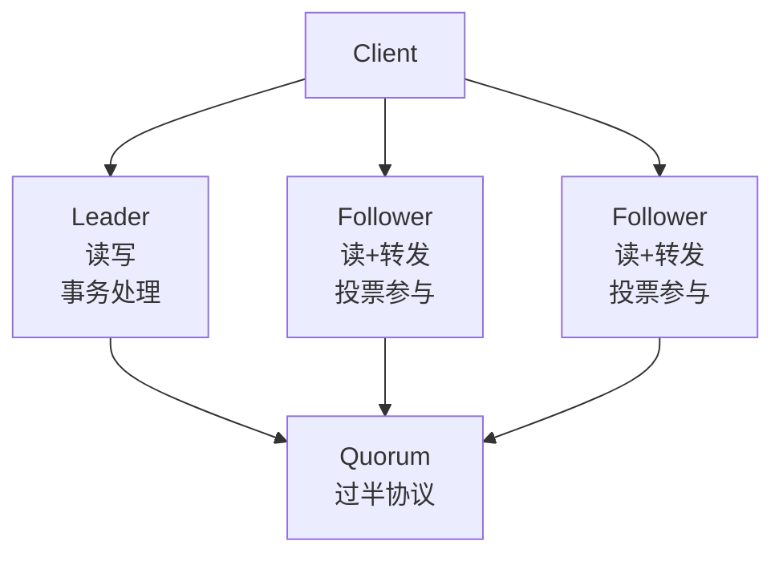
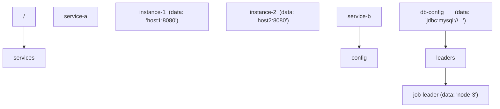
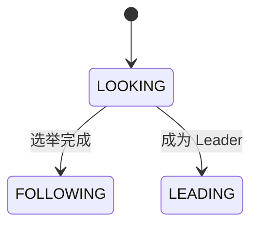
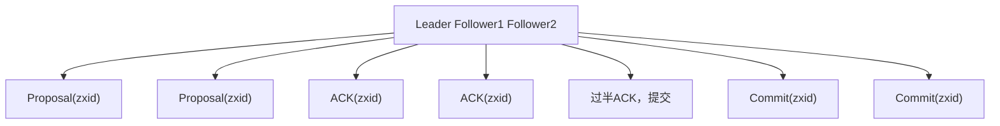
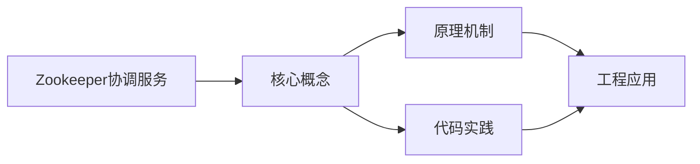

## 1. 学习目标（Bloom 分类）

本节按照布鲁姆教育目标分类学组织学习路径。本文主题为《Zookeeper协调服务》，属于 大数据 模块，读者可以根据自身阶段选择阅读深度。

记忆层面：能够准确复述本文的核心概念、术语与基本语法或操作步骤，并能够在提问或检索时快速定位对应知识点。能够说出 大数据 的核心概念、常用命令与流程。

理解层面：能够用自己的语言解释核心原理与工作机制，说明概念之间的因果关系，而不是机械记忆结论。能够解释 大数据 的工作原理与设计动机。

应用层面：能够在真实项目或练习场景中运用本文知识解决具体问题，写出正确且可维护的实现。能够独立完成 大数据 的标准操作。

分析层面：能够拆解复杂问题，比较本文主题与相邻概念的异同，识别边界条件与例外情况。能够分析 大数据 使用中的异常与边界。

评价层面：能够根据约束条件（性能、可读性、安全、成本）评价不同方案的优劣，做出有依据的技术决策。能够评价 大数据 相关工具与方案。

创造层面：能够把本文知识与其他模块知识组合，设计出新的解决方案或可复用的工程模式。能够把 大数据 融入团队工作流。

通过本节学习，读者应当能够把《Zookeeper协调服务》纳入自己的知识网络，并与 大数据 模块的其他主题（分布式存储、批处理、流处理、数据仓库）建立关联。

## 2. 历史动机与发展脉络

《Zookeeper协调服务》是 大数据 领域的重要主题。要真正理解它，需要先了解它解决的问题与演进过程。

大数据指规模超出单机处理能力的数据工程问题：2004 年 Google MapReduce 论文开启分布式计算时代，Hadoop 生态（2006）开源落地。
现代技术版图：存储（HDFS/对象存储/数据湖）、批处理（Spark）、流处理（Flink/Kafka）、数仓（Hive/Doris/ClickHouse）、调度（Airflow）。
湖仓一体（Lakehouse）融合数据湖灵活与数仓治理；云原生数据栈（Snowflake/Databricks）成为主流形态。

回到本文主题：Zookeeper协调服务 的提出与成熟，正是上述技术背景下的必然产物。早期实现往往以简单可用为目标，随着工程规模扩大，社区逐渐沉淀出标准做法与最佳实践；理解这一脉络，可以帮助读者判断“为什么文档中的推荐写法是现在这个样子”，也能在遇到历史遗留代码时准确识别其设计年代与取舍。


## 3. 形式化定义与核心概念精讲

本节把《Zookeeper协调服务》涉及的核心概念以“定义 + 讲解”的形式展开。读者应把定义当作工具，把讲解当作理解路径；两者结合才能形成可迁移的知识。

分布式存储：数据分片（shard）与副本（replica），一致性（CAP 权衡）；HDFS 块存储与对象存储。
批处理模型：MapReduce 分而治之；Spark 基于内存 DAG 优化；数据本地性减少传输。
流处理：事件时间与水位线（watermark）、窗口（滚动/滑动/会话）、精确一次语义（exactly-once）。

### 3.1 原文章节逐一精讲

原文档把主题拆分为 16 个小节，下面按顺序给出每一节的导读讲解，随后保留原文细节供精读。

#### 原文精读（完整保留）

# 大数据 ZooKeeper 命令

> **符号约定**：`< >` 必填参数 | `[ ]` 可选参数

---

#### 1. ZooKeeper架构

ZooKeeper 是一个**分布式协调服务**，为分布式应用提供一致性管理、配置维护、组服务和命名等功能。

##### 1.1 集群架构



##### 1.2 核心概念

| 概念        | 说明                                |
| :---------- | :---------------------------------- |
| **ZNode**   | 数据节点，类似文件系统中的文件/目录 |
| **zxid**    | 事务ID，全局单调递增，标识操作顺序  |
| **epoch**   | Leader周期号，每次选举递增          |
| **Quorum**  | 法定人数，集群半数以上节点          |
| **Session** | 客户端与服务器之间的会话            |

##### 1.3 数据模型

ZooKeeper 的数据模型是**树形命名空间**，每个节点（ZNode）可以存储数据（默认1MB上限）：



**ZNode类型**：

| 类型         | 说明                         | 创建方式             |
| :----------- | :--------------------------- | :------------------- |
| 持久节点     | 持久存储，客户端断开后不删除 | `create /path`       |
| 临时节点     | 客户端会话结束自动删除       | `create -e /path`    |
| 持久顺序节点 | 持久 + 自动递增序号后缀      | `create -s /path`    |
| 临时顺序节点 | 临时 + 自动递增序号后缀      | `create -s -e /path` |
| 容器节点     | 最后一个子节点删除后自动删除 | `create -c /path`    |
| TTL节点      | 超时未修改自动删除           | `create -t /path`    |

#### 2. ZAB协议

ZAB（ZooKeeper Atomic Broadcast）是 ZooKeeper 的**核心一致性协议**，保证所有事务按顺序广播到所有节点。

##### 2.1 协议状态



##### 2.2 消息广播（Broadcast）

Leader 将客户端请求转化为**事务提案（Proposal）**，通过两阶段提交广播：



**关键保证**：

- 所有事务按 **zxid 顺序**提交
- 过半节点ACK即可提交（不需要全部）
- Leader崩溃时，已完成的事务不会丢失

##### 2.3 崩溃恢复（Recovery）

当Leader崩溃或失去过半Follower时，进入崩溃恢复模式：

1. **选举阶段**：所有节点进入LOOKING状态，选举新Leader
2. **发现阶段**：新Leader与Follower同步事务日志
3. **同步阶段**：确保所有节点数据一致
4. **广播阶段**：新Leader开始处理客户端请求

**选举约束**：

- 新Leader必须拥有**最完整的**事务日志（最大zxid）
- 已提交的事务不能丢失
- 未提交的事务需要被丢弃

##### 2.4 zxid结构

$$\text{zxid} = \text{epoch} \ll 32 \mid \text{counter}$$

| 部分    | 位数   | 说明           |
| :------ | :----- | :------------- |
| epoch   | 高32位 | Leader周期号   |
| counter | 低32位 | 周期内事务计数 |

每次Leader选举，epoch递增，counter归零。

#### 3. Watcher机制

Watcher 是 ZooKeeper 的**事件通知机制**，客户端可以在ZNode上注册监听器，当ZNode发生变化时收到通知。

##### 3.1 事件类型

| 事件                | 触发条件    | 注册方法                   |
| :------------------ | :---------- | :------------------------- |
| NodeCreated         | ZNode被创建 | exists                     |
| NodeDeleted         | ZNode被删除 | exists/getData/getChildren |
| NodeDataChanged     | 数据变更    | exists/getData             |
| NodeChildrenChanged | 子节点变更  | getChildren                |

##### 3.2 Watcher特性

- **一次性触发**：Watcher触发后自动失效，需要重新注册
- **有序性**：事件按zxid顺序触发，客户端看到的事件顺序与服务器一致
- **轻量级**：通知只包含事件类型，不包含变更后的数据

```java
// 注册Watcher
zk.exists("/config", new Watcher() {
    @Override
    public void process(WatchedEvent event) {
        if (event.getType() == EventType.NodeDataChanged) {
            // 重新读取数据并重新注册Watcher
            byte[] data = zk.getData("/config", this, null);
        }
    }
});
```

#### 4. Leader选举

##### 4.1 选举算法（FastLeaderElection）

```
每个节点投票: (self_id, self_zxid)

Round 1:
  Node1 投票: (1, zxid_1) → 发送给所有节点
  Node2 投票: (2, zxid_2) → 发送给所有节点
  Node3 投票: (3, zxid_3) → 发送给所有节点

比较规则:
  1. 比较 epoch（大的优先）
  2. 比较 zxid（大的优先）
  3. 比较 myid（大的优先）

假设 zxid_3 > zxid_2 > zxid_1:
  Node1 收到 (2,zxid_2) → 更新投票为 (2,zxid_2)
  Node1 收到 (3,zxid_3) → 更新投票为 (3,zxid_3)
  Node2 收到 (3,zxid_3) → 更新投票为 (3,zxid_3)

  Node3 获得过半投票 → 成为Leader
```

##### 4.2 分布式锁实现

利用**临时顺序节点**实现公平锁：

```
1. 在 /locks 下创建临时顺序节点 → /locks/lock-0000000001
2. 获取 /locks 下所有子节点并排序
3. 如果自己是最小节点 → 获得锁
4. 如果不是 → Watch前一个节点的删除事件
5. 前一个节点删除 → 重新检查是否获得锁
6. 释放锁：删除自己的临时节点
```

```java
public class DistributedLock {
    private final ZooKeeper zk;
    private final String lockPath = "/locks";
    private String currentLock;

    public void lock() throws Exception {
        // 创建临时顺序节点
        currentLock = zk.create(lockPath + "/lock-",
            new byte[0], ZooDefs.Ids.OPEN_ACL_UNSAFE,
            CreateMode.EPHEMERAL_SEQUENTIAL);

        // 获取所有子节点
        List<String> children = zk.getChildren(lockPath, false);
        Collections.sort(children);

        // 检查是否是最小节点
        String currentNode = currentLock.substring(lockPath.length() + 1);
        int index = children.indexOf(currentNode);

        if (index == 0) {
            return; // 获得锁
        }

        // 等待前一个节点删除
        String prevNode = lockPath + "/" + children.get(index - 1);
        final CountDownLatch latch = new CountDownLatch(1);
        zk.exists(prevNode, event -> {
            if (event.getType() == EventType.NodeDeleted) {
                latch.countDown();
            }
        });
        latch.await();
    }

    public void unlock() throws Exception {
        zk.delete(currentLock, -1);
    }
}
```

#### 5. 典型应用场景

| 场景           | 实现方式           | 说明                               |
| :------------- | :----------------- | :--------------------------------- |
| 服务注册与发现 | 临时节点 + Watcher | 服务上线创建临时节点，下线自动删除 |
| 分布式锁       | 临时顺序节点       | 公平锁实现                         |
| 配置中心       | 持久节点 + Watcher | 配置变更通知                       |
| Leader选举     | 临时节点           | 主备切换                           |
| 命名服务       | 顺序节点           | 全局唯一ID生成                     |
| 集群管理       | 临时节点           | 成员管理与存活检测                 |
#### 连接 ZooKeeper

**基本写法：连接本地 ZooKeeper**
`zkCli.sh`

```bash
# 连接本地 ZooKeeper（默认端口 2181）
zkCli.sh
```

---

**基本写法：连接远程 ZooKeeper**
`zkCli.sh -server <主机>:<端口>`

```bash
# 连接远程 ZooKeeper
zkCli.sh -server namenode:2181
```

---

**基本写法：带超时连接**
`zkCli.sh -server <主机>:<端口> -timeout <毫秒>`

```bash
# 带 5 秒超时连接
zkCli.sh -server namenode:2181 -timeout 5000
```

---

#### 节点操作

**基本写法：创建持久节点**
`create <路径> <数据>`

```bash
# 创建持久节点
create /myapp "my application"
```

---

**基本写法：创建临时节点**
`create -e <路径> <数据>`

```bash
# 创建临时节点（会话断开自动删除）
create -e /myapp/temp "temporary data"
```

---

**基本写法：创建顺序节点**
`create -s <路径> <数据>`

```bash
# 创建顺序节点（自动追加递增序号）
create -s /myapp/node "sequential data"
```

---

**基本写法：创建临时顺序节点**
`create -e -s <路径> <数据>`

```bash
# 创建临时顺序节点
create -e -s /myapp/lock "lock data"
```

---

**基本写法：创建带 TTL 的节点**
`create -t <毫秒> <路径> <数据>`

```bash
# 创建带 TTL 的节点（3.5+ 版本）
create -t 60000 /myapp/ttl "ttl data"
```

---

**基本写法：创建容器节点**
`create -c <路径> <数据>`

```bash
# 创建容器节点（子节点为空时自动删除）
create -c /myapp/container "container"
```

---

#### 读取数据

**基本写法：列出子节点**
`ls <路径>`

```bash
# 列出根节点的子节点
ls /
# 列出指定节点的子节点
ls /myapp
```

---

**基本写法：递归列出**
`ls -R <路径>`

```bash
# 递归列出所有子节点
ls -R /myapp
```

---

**基本写法：获取节点数据**
`get <路径>`

```bash
# 获取节点数据和元信息
get /myapp
```

---

**基本写法：获取节点状态**
`stat <路径>`

```bash
# 获取节点状态信息
stat /myapp
```

---

**基本写法：仅获取数据**
`get -s <路径>`

```bash
# 获取数据和状态
get -s /myapp
```

---

#### 更新数据

**基本写法：设置节点数据**
`set <路径> <新数据>`

```bash
# 更新节点数据
set /myapp "updated data"
```

---

**基本写法：带版本设置**
`set <路径> <新数据> <版本号>`

```bash
# 乐观锁更新（版本号需匹配）
set /myapp "versioned data" 2
```

---

#### 删除节点

**基本写法：删除节点**
`delete <路径>`

```bash
# 删除节点（节点必须无子节点）
delete /myapp/temp
```

---

**基本写法：带版本删除**
`delete <路径> <版本号>`

```bash
# 带版本号删除
delete /myapp 3
```

---

**基本写法：递归删除**
`deleteall <路径>`

```bash
# 递归删除节点及其所有子节点
deleteall /myapp
```

---

#### 监视器

**基本写法：监视节点数据变化**
`get -w <路径>`

```bash
# 设置数据变化监视器
get -w /myapp
```

---

**基本写法：监视子节点变化**
`ls -w <路径>`

```bash
# 设置子节点变化监视器
ls -w /myapp
```

---

**基本写法：监视节点状态**
`stat -w <路径>`

```bash
# 设置节点存在性监视器
stat -w /myapp
```

---

**基本写法：查看监视器**
`printwatches`

```bash
# 查看当前设置的监视器
printwatches on
```

---

#### ACL 权限

**基本写法：查看 ACL**
`getAcl <路径>`

```bash
# 查看节点 ACL
getAcl /myapp
```

---

**基本写法：设置 ACL**
`setAcl <路径> <权限>`

```bash
# 设置 ACL（world 所有用户可读）
setAcl /myapp world:anyone:r
```

---

**基本写法：设置认证 ACL**
`setAcl <路径> auth:<用户>:<权限>`

```bash
# 设置认证用户权限
setAcl /myapp auth:user1:rw
```

---

**基本写法：设置 IP ACL**
`setAcl <路径> ip:<IP>:<权限>`

```bash
# 设置 IP 权限
setAcl /myapp ip:192.168.1.100:rw
```

---

**基本写法：添加认证**
`addauth <方案> <认证信息>`

```bash
# 添加 digest 认证
addauth digest username:password
```

---

#### 配额管理

**基本写法：设置节点配额**
`setquota -n <数量> <路径>`

```bash
# 设置子节点数量配额
setquota -n 100 /myapp
```

---

**基本写法：设置字节配额**
`setquota -b <字节> <路径>`

```bash
# 设置数据大小配额
setquota -b 1048576 /myapp
```

---

**基本写法：查看配额**
`listquota <路径>`

```bash
# 查看节点配额
listquota /myapp
```

---

**基本写法：删除配额**
`delquota [-n|-b] <路径>`

```bash
# 删除数量配额
delquota -n /myapp
# 删除字节配额
delquota -b /myapp
```

---

#### 集群管理

**基本写法：查看集群状态**
`zkServer.sh status`

```bash
# 查看 ZooKeeper 服务器状态
zkServer.sh status
```

---

**基本写法：启动服务器**
`zkServer.sh start`

```bash
# 启动 ZooKeeper 服务器
zkServer.sh start
```

---

**基本写法：停止服务器**
`zkServer.sh stop`

```bash
# 停止 ZooKeeper 服务器
zkServer.sh stop
```

---

**基本写法：重启服务器**
`zkServer.sh restart`

```bash
# 重启 ZooKeeper 服务器
zkServer.sh restart
```

---

**基本写法：前台启动**
`zkServer.sh start-foreground`

```bash
# 前台启动（查看日志）
zkServer.sh start-foreground
```

---

#### 四字命令

**基本写法：查看状态**
`echo stat | nc <主机> <端口>`

```bash
# 查看服务器状态
echo stat | nc localhost 2181
```

---

**基本写法：查看环境**
`echo envi | nc <主机> <端口>`

```bash
# 查看环境变量
echo envi | nc localhost 2181
```

---

**基本写法：查看监视**
`echo wchs | nc <主机> <端口>`

```bash
# 查看监视器详情
echo wchs | nc localhost 2181
```

---

**基本写法：查看监视详情**
`echo wchc | nc <主机> <端口>`

```bash
# 查看监视器按会话分组
echo wchc | nc localhost 2181
```

---

**基本写法：查看连接**
`echo cons | nc <主机> <端口>`

```bash
# 查看客户端连接
echo cons | nc localhost 2181
```

---

**基本写法：查看配置**
`echo conf | nc <主机> <端口>`

```bash
# 查看服务器配置
echo conf | nc localhost 2181
```

---

**基本写法：查看健康状态**
`echo ruok | nc <主机> <端口>`

```bash
# 查看服务器是否正常（返回 imok）
echo ruok | nc localhost 2181
```

---

**基本写法：查看路径**
`echo dump | nc <主机> <端口>`

```bash
# 查看会话和临时节点
echo dump | nc localhost 2181
```

---

**基本写法：查看统计**
`echo srvr | nc <主机> <端口>`

```bash
# 查看服务器统计信息
echo srvr | nc localhost 2181
```

---

#### 其他命令

**基本写法：同步节点**
`sync <路径>`

```bash
# 强制同步节点数据
sync /myapp
```

---

**基本写法：移除监视器**
`removewatches <路径>`

```bash
# 移除指定路径的监视器
removewatches /myapp
```

---

**基本写法：关闭连接**
`close`

```bash
# 关闭当前连接
close
```

---

**基本写法：退出**
`quit`

```bash
# 退出 ZooKeeper 客户端
quit
```

---

**基本写法：查看历史命令**
`history`

```bash
# 查看历史命令
history
```

---

**基本写法：重新执行命令**
`redo <编号>`

```bash
# 重新执行编号为 10 的命令
redo 10
```


### 3.2 概念关系图

下面用 Mermaid 图表达本文核心概念之间的关系，帮助读者建立整体图景：



图中展示的是本文知识的结构化关系：核心概念是入口，原理机制解释“为什么”，代码实践演示“怎么做”，工程应用回答“何时用”。读者学习时可以把每个小节的内容挂接到对应节点上。

## 4. 理论推导与原理解析

本节深入《Zookeeper协调服务》背后的原理。理论部分不求面面俱到，而是聚焦“能解释现象、能指导实践”的关键推导。

分布式存储：数据分片（shard）与副本（replica），一致性（CAP 权衡）；HDFS 块存储与对象存储。
批处理模型：MapReduce 分而治之；Spark 基于内存 DAG 优化；数据本地性减少传输。
流处理：事件时间与水位线（watermark）、窗口（滚动/滑动/会话）、精确一次语义（exactly-once）。
数据仓库：维度建模（星型/雪花）、ETL/ELT、分层（ODS/DWD/DWS/ADS）。

需要强调的是，理论推导与工程实践之间存在翻译层：理论给出的是理想化模型与边界条件，工程代码则必须处理真实环境中的例外。读者在学习时应先掌握理论的“标准情形”，再通过陷阱章节了解“非标准情形”。

## 5. 代码示例与逐行讲解

本节把原文中的代码示例系统整理，并为每个示例补充用途说明与讲解。读者不应只浏览代码，而应逐段对照讲解理解设计意图。

### 5.1 示例：1.1 集群架构

该示例来自原文《1.1 集群架构》小节，用于演示Zookeeper协调服务相关操作。阅读时请先看代码结构，再看其后的讲解。


讲解：这段代码演示了本节核心知识点。代码中的关键操作可以归纳为三步：准备（定义或初始化）、执行（核心逻辑）、收尾（释放资源或返回结果）。实际项目中，这三步往往被封装为函数或类，以提升复用性与可测试性。

关键点分析：

该示例共 12 行有效代码，结构以数据或配置为主。阅读时应关注：数据字段的含义、配置项的作用，以及它们与运行行为的对应关系。

进阶思考路径：先尝试修改参数观察行为变化，再把示例中的模式迁移到自己的项目中；每次修改都记录预期与实测差异，这是把示例转化为能力的最快方式。

### 5.2 示例：1.3 数据模型

该示例来自原文《1.3 数据模型》小节，用于演示Zookeeper协调服务相关操作。阅读时请先看代码结构，再看其后的讲解。


讲解：这段代码演示了本节核心知识点。代码中的关键操作可以归纳为三步：准备（定义或初始化）、执行（核心逻辑）、收尾（释放资源或返回结果）。实际项目中，这三步往往被封装为函数或类，以提升复用性与可测试性。

关键点分析：

该示例共 15 行有效代码，结构以数据或配置为主。阅读时应关注：数据字段的含义、配置项的作用，以及它们与运行行为的对应关系。

进阶思考路径：先尝试修改参数观察行为变化，再把示例中的模式迁移到自己的项目中；每次修改都记录预期与实测差异，这是把示例转化为能力的最快方式。

### 5.3 示例：2.1 协议状态

该示例来自原文《2.1 协议状态》小节，用于演示Zookeeper协调服务相关操作。阅读时请先看代码结构，再看其后的讲解。


讲解：这段代码演示了本节核心知识点。代码中的关键操作可以归纳为三步：准备（定义或初始化）、执行（核心逻辑）、收尾（释放资源或返回结果）。实际项目中，这三步往往被封装为函数或类，以提升复用性与可测试性。

关键点分析：

该示例共 4 行有效代码，结构以数据或配置为主。阅读时应关注：数据字段的含义、配置项的作用，以及它们与运行行为的对应关系。

进阶思考路径：先尝试修改参数观察行为变化，再把示例中的模式迁移到自己的项目中；每次修改都记录预期与实测差异，这是把示例转化为能力的最快方式。

### 5.4 示例：2.2 消息广播（Broadcast）

该示例来自原文《2.2 消息广播（Broadcast）》小节，用于演示Zookeeper协调服务相关操作。阅读时请先看代码结构，再看其后的讲解。


讲解：这段代码演示了本节核心知识点。代码中的关键操作可以归纳为三步：准备（定义或初始化）、执行（核心逻辑）、收尾（释放资源或返回结果）。实际项目中，这三步往往被封装为函数或类，以提升复用性与可测试性。

关键点分析：

该示例共 16 行有效代码，结构以数据或配置为主。阅读时应关注：数据字段的含义、配置项的作用，以及它们与运行行为的对应关系。

进阶思考路径：先尝试修改参数观察行为变化，再把示例中的模式迁移到自己的项目中；每次修改都记录预期与实测差异，这是把示例转化为能力的最快方式。

### 5.5 示例：3.2 Watcher特性

该示例来自原文《3.2 Watcher特性》小节，用于演示Zookeeper协调服务相关操作。阅读时请先看代码结构，再看其后的讲解。

```java
// 注册Watcher
zk.exists("/config", new Watcher() {
    @Override
    public void process(WatchedEvent event) {
        if (event.getType() == EventType.NodeDataChanged) {
            // 重新读取数据并重新注册Watcher
            byte[] data = zk.getData("/config", this, null);
        }
    }
});
```

讲解：这段代码演示了本节核心知识点。代码中的关键操作可以归纳为三步：准备（定义或初始化）、执行（核心逻辑）、收尾（释放资源或返回结果）。实际项目中，这三步往往被封装为函数或类，以提升复用性与可测试性。

关键点分析：

该示例共 10 行有效代码，包含 1 类关键结构（if）。其中：

- 入口与初始化部分负责建立上下文，对应实际项目中的启动或装配逻辑；
- 核心逻辑部分体现本文主题的主要操作，是阅读时最需要对照讲解理解的部分；
- 输出或返回部分把结果交给调用方，注意其类型与边界条件。

进阶思考路径：先尝试修改参数观察行为变化，再把示例中的模式迁移到自己的项目中；每次修改都记录预期与实测差异，这是把示例转化为能力的最快方式。

### 5.6 示例：4.1 选举算法（FastLeaderElection）

该示例来自原文《4.1 选举算法（FastLeaderElection）》小节，用于演示Zookeeper协调服务相关操作。阅读时请先看代码结构，再看其后的讲解。

```text
每个节点投票: (self_id, self_zxid)

Round 1:
  Node1 投票: (1, zxid_1) → 发送给所有节点
  Node2 投票: (2, zxid_2) → 发送给所有节点
  Node3 投票: (3, zxid_3) → 发送给所有节点

比较规则:
  1. 比较 epoch（大的优先）
  2. 比较 zxid（大的优先）
  3. 比较 myid（大的优先）

假设 zxid_3 > zxid_2 > zxid_1:
  Node1 收到 (2,zxid_2) → 更新投票为 (2,zxid_2)
  Node1 收到 (3,zxid_3) → 更新投票为 (3,zxid_3)
  Node2 收到 (3,zxid_3) → 更新投票为 (3,zxid_3)

  Node3 获得过半投票 → 成为Leader
```

讲解：这段代码演示了本节核心知识点。代码中的关键操作可以归纳为三步：准备（定义或初始化）、执行（核心逻辑）、收尾（释放资源或返回结果）。实际项目中，这三步往往被封装为函数或类，以提升复用性与可测试性。

关键点分析：

该示例共 14 行有效代码，结构以数据或配置为主。阅读时应关注：数据字段的含义、配置项的作用，以及它们与运行行为的对应关系。

进阶思考路径：先尝试修改参数观察行为变化，再把示例中的模式迁移到自己的项目中；每次修改都记录预期与实测差异，这是把示例转化为能力的最快方式。

### 5.7 示例：4.2 分布式锁实现

该示例来自原文《4.2 分布式锁实现》小节，用于演示Zookeeper协调服务相关操作。阅读时请先看代码结构，再看其后的讲解。

```text
1. 在 /locks 下创建临时顺序节点 → /locks/lock-0000000001
2. 获取 /locks 下所有子节点并排序
3. 如果自己是最小节点 → 获得锁
4. 如果不是 → Watch前一个节点的删除事件
5. 前一个节点删除 → 重新检查是否获得锁
6. 释放锁：删除自己的临时节点
```

讲解：这段代码演示了本节核心知识点。代码中的关键操作可以归纳为三步：准备（定义或初始化）、执行（核心逻辑）、收尾（释放资源或返回结果）。实际项目中，这三步往往被封装为函数或类，以提升复用性与可测试性。

关键点分析：

该示例共 6 行有效代码，结构以数据或配置为主。阅读时应关注：数据字段的含义、配置项的作用，以及它们与运行行为的对应关系。

进阶思考路径：先尝试修改参数观察行为变化，再把示例中的模式迁移到自己的项目中；每次修改都记录预期与实测差异，这是把示例转化为能力的最快方式。

### 5.8 示例：4.2 分布式锁实现

该示例来自原文《4.2 分布式锁实现》小节，用于演示Zookeeper协调服务相关操作。阅读时请先看代码结构，再看其后的讲解。

```java
public class DistributedLock {
    private final ZooKeeper zk;
    private final String lockPath = "/locks";
    private String currentLock;

    public void lock() throws Exception {
        // 创建临时顺序节点
        currentLock = zk.create(lockPath + "/lock-",
            new byte[0], ZooDefs.Ids.OPEN_ACL_UNSAFE,
            CreateMode.EPHEMERAL_SEQUENTIAL);

        // 获取所有子节点
        List<String> children = zk.getChildren(lockPath, false);
        Collections.sort(children);

        // 检查是否是最小节点
        String currentNode = currentLock.substring(lockPath.length() + 1);
        int index = children.indexOf(currentNode);

        if (index == 0) {
            return; // 获得锁
        }

        // 等待前一个节点删除
        String prevNode = lockPath + "/" + children.get(index - 1);
        final CountDownLatch latch = new CountDownLatch(1);
        zk.exists(prevNode, event -> {
            if (event.getType() == EventType.NodeDeleted) {
                latch.countDown();
            }
        });
        latch.await();
    }

    public void unlock() throws Exception {
        zk.delete(currentLock, -1);
    }
}
```

讲解：这段代码演示了本节核心知识点。代码中的关键操作可以归纳为三步：准备（定义或初始化）、执行（核心逻辑）、收尾（释放资源或返回结果）。实际项目中，这三步往往被封装为函数或类，以提升复用性与可测试性。

关键点分析：

该示例共 32 行有效代码，包含 3 类关键结构（class、if、return）。其中：

- 入口与初始化部分负责建立上下文，对应实际项目中的启动或装配逻辑；
- 核心逻辑部分体现本文主题的主要操作，是阅读时最需要对照讲解理解的部分；
- 输出或返回部分把结果交给调用方，注意其类型与边界条件。

进阶思考路径：先尝试修改参数观察行为变化，再把示例中的模式迁移到自己的项目中；每次修改都记录预期与实测差异，这是把示例转化为能力的最快方式。

### 5.9 示例：连接 ZooKeeper

该示例来自原文《连接 ZooKeeper》小节，用于演示Zookeeper协调服务相关操作。阅读时请先看代码结构，再看其后的讲解。

```bash
# 连接本地 ZooKeeper（默认端口 2181）
zkCli.sh
```

讲解：这段代码演示了本节核心知识点。代码中的关键操作可以归纳为三步：准备（定义或初始化）、执行（核心逻辑）、收尾（释放资源或返回结果）。实际项目中，这三步往往被封装为函数或类，以提升复用性与可测试性。

关键点分析：

该示例共 2 行有效代码，结构以数据或配置为主。阅读时应关注：数据字段的含义、配置项的作用，以及它们与运行行为的对应关系。

进阶思考路径：先尝试修改参数观察行为变化，再把示例中的模式迁移到自己的项目中；每次修改都记录预期与实测差异，这是把示例转化为能力的最快方式。

### 5.10 示例：连接 ZooKeeper

该示例来自原文《连接 ZooKeeper》小节，用于演示Zookeeper协调服务相关操作。阅读时请先看代码结构，再看其后的讲解。

```bash
# 连接远程 ZooKeeper
zkCli.sh -server namenode:2181
```

讲解：这段代码演示了本节核心知识点。代码中的关键操作可以归纳为三步：准备（定义或初始化）、执行（核心逻辑）、收尾（释放资源或返回结果）。实际项目中，这三步往往被封装为函数或类，以提升复用性与可测试性。

关键点分析：

该示例共 2 行有效代码，结构以数据或配置为主。阅读时应关注：数据字段的含义、配置项的作用，以及它们与运行行为的对应关系。

进阶思考路径：先尝试修改参数观察行为变化，再把示例中的模式迁移到自己的项目中；每次修改都记录预期与实测差异，这是把示例转化为能力的最快方式。

### 5.11 示例：连接 ZooKeeper

该示例来自原文《连接 ZooKeeper》小节，用于演示Zookeeper协调服务相关操作。阅读时请先看代码结构，再看其后的讲解。

```bash
# 带 5 秒超时连接
zkCli.sh -server namenode:2181 -timeout 5000
```

讲解：这段代码演示了本节核心知识点。代码中的关键操作可以归纳为三步：准备（定义或初始化）、执行（核心逻辑）、收尾（释放资源或返回结果）。实际项目中，这三步往往被封装为函数或类，以提升复用性与可测试性。

关键点分析：

该示例共 2 行有效代码，结构以数据或配置为主。阅读时应关注：数据字段的含义、配置项的作用，以及它们与运行行为的对应关系。

进阶思考路径：先尝试修改参数观察行为变化，再把示例中的模式迁移到自己的项目中；每次修改都记录预期与实测差异，这是把示例转化为能力的最快方式。

### 5.12 示例：节点操作

该示例来自原文《节点操作》小节，用于演示Zookeeper协调服务相关操作。阅读时请先看代码结构，再看其后的讲解。

```bash
# 创建持久节点
create /myapp "my application"
```

讲解：这段代码演示了本节核心知识点。代码中的关键操作可以归纳为三步：准备（定义或初始化）、执行（核心逻辑）、收尾（释放资源或返回结果）。实际项目中，这三步往往被封装为函数或类，以提升复用性与可测试性。

关键点分析：

该示例共 2 行有效代码，结构以数据或配置为主。阅读时应关注：数据字段的含义、配置项的作用，以及它们与运行行为的对应关系。

进阶思考路径：先尝试修改参数观察行为变化，再把示例中的模式迁移到自己的项目中；每次修改都记录预期与实测差异，这是把示例转化为能力的最快方式。

### 5.13 示例：节点操作

该示例来自原文《节点操作》小节，用于演示Zookeeper协调服务相关操作。阅读时请先看代码结构，再看其后的讲解。

```bash
# 创建临时节点（会话断开自动删除）
create -e /myapp/temp "temporary data"
```

讲解：这段代码演示了本节核心知识点。代码中的关键操作可以归纳为三步：准备（定义或初始化）、执行（核心逻辑）、收尾（释放资源或返回结果）。实际项目中，这三步往往被封装为函数或类，以提升复用性与可测试性。

关键点分析：

该示例共 2 行有效代码，结构以数据或配置为主。阅读时应关注：数据字段的含义、配置项的作用，以及它们与运行行为的对应关系。

进阶思考路径：先尝试修改参数观察行为变化，再把示例中的模式迁移到自己的项目中；每次修改都记录预期与实测差异，这是把示例转化为能力的最快方式。

### 5.14 示例：节点操作

该示例来自原文《节点操作》小节，用于演示Zookeeper协调服务相关操作。阅读时请先看代码结构，再看其后的讲解。

```bash
# 创建顺序节点（自动追加递增序号）
create -s /myapp/node "sequential data"
```

讲解：这段代码演示了本节核心知识点。代码中的关键操作可以归纳为三步：准备（定义或初始化）、执行（核心逻辑）、收尾（释放资源或返回结果）。实际项目中，这三步往往被封装为函数或类，以提升复用性与可测试性。

关键点分析：

该示例共 2 行有效代码，结构以数据或配置为主。阅读时应关注：数据字段的含义、配置项的作用，以及它们与运行行为的对应关系。

进阶思考路径：先尝试修改参数观察行为变化，再把示例中的模式迁移到自己的项目中；每次修改都记录预期与实测差异，这是把示例转化为能力的最快方式。

### 5.15 示例：节点操作

该示例来自原文《节点操作》小节，用于演示Zookeeper协调服务相关操作。阅读时请先看代码结构，再看其后的讲解。

```bash
# 创建临时顺序节点
create -e -s /myapp/lock "lock data"
```

讲解：这段代码演示了本节核心知识点。代码中的关键操作可以归纳为三步：准备（定义或初始化）、执行（核心逻辑）、收尾（释放资源或返回结果）。实际项目中，这三步往往被封装为函数或类，以提升复用性与可测试性。

关键点分析：

该示例共 2 行有效代码，结构以数据或配置为主。阅读时应关注：数据字段的含义、配置项的作用，以及它们与运行行为的对应关系。

进阶思考路径：先尝试修改参数观察行为变化，再把示例中的模式迁移到自己的项目中；每次修改都记录预期与实测差异，这是把示例转化为能力的最快方式。

### 5.16 示例：节点操作

该示例来自原文《节点操作》小节，用于演示Zookeeper协调服务相关操作。阅读时请先看代码结构，再看其后的讲解。

```bash
# 创建带 TTL 的节点（3.5+ 版本）
create -t 60000 /myapp/ttl "ttl data"
```

讲解：这段代码演示了本节核心知识点。代码中的关键操作可以归纳为三步：准备（定义或初始化）、执行（核心逻辑）、收尾（释放资源或返回结果）。实际项目中，这三步往往被封装为函数或类，以提升复用性与可测试性。

关键点分析：

该示例共 2 行有效代码，结构以数据或配置为主。阅读时应关注：数据字段的含义、配置项的作用，以及它们与运行行为的对应关系。

进阶思考路径：先尝试修改参数观察行为变化，再把示例中的模式迁移到自己的项目中；每次修改都记录预期与实测差异，这是把示例转化为能力的最快方式。

### 5.17 示例：节点操作

该示例来自原文《节点操作》小节，用于演示Zookeeper协调服务相关操作。阅读时请先看代码结构，再看其后的讲解。

```bash
# 创建容器节点（子节点为空时自动删除）
create -c /myapp/container "container"
```

讲解：这段代码演示了本节核心知识点。代码中的关键操作可以归纳为三步：准备（定义或初始化）、执行（核心逻辑）、收尾（释放资源或返回结果）。实际项目中，这三步往往被封装为函数或类，以提升复用性与可测试性。

关键点分析：

该示例共 2 行有效代码，结构以数据或配置为主。阅读时应关注：数据字段的含义、配置项的作用，以及它们与运行行为的对应关系。

进阶思考路径：先尝试修改参数观察行为变化，再把示例中的模式迁移到自己的项目中；每次修改都记录预期与实测差异，这是把示例转化为能力的最快方式。

### 5.18 示例：读取数据

该示例来自原文《读取数据》小节，用于演示Zookeeper协调服务相关操作。阅读时请先看代码结构，再看其后的讲解。

```bash
# 列出根节点的子节点
ls /
# 列出指定节点的子节点
ls /myapp
```

讲解：这段代码演示了本节核心知识点。代码中的关键操作可以归纳为三步：准备（定义或初始化）、执行（核心逻辑）、收尾（释放资源或返回结果）。实际项目中，这三步往往被封装为函数或类，以提升复用性与可测试性。

关键点分析：

该示例共 4 行有效代码，结构以数据或配置为主。阅读时应关注：数据字段的含义、配置项的作用，以及它们与运行行为的对应关系。

进阶思考路径：先尝试修改参数观察行为变化，再把示例中的模式迁移到自己的项目中；每次修改都记录预期与实测差异，这是把示例转化为能力的最快方式。

### 5.19 示例：读取数据

该示例来自原文《读取数据》小节，用于演示Zookeeper协调服务相关操作。阅读时请先看代码结构，再看其后的讲解。

```bash
# 递归列出所有子节点
ls -R /myapp
```

讲解：这段代码演示了本节核心知识点。代码中的关键操作可以归纳为三步：准备（定义或初始化）、执行（核心逻辑）、收尾（释放资源或返回结果）。实际项目中，这三步往往被封装为函数或类，以提升复用性与可测试性。

关键点分析：

该示例共 2 行有效代码，结构以数据或配置为主。阅读时应关注：数据字段的含义、配置项的作用，以及它们与运行行为的对应关系。

进阶思考路径：先尝试修改参数观察行为变化，再把示例中的模式迁移到自己的项目中；每次修改都记录预期与实测差异，这是把示例转化为能力的最快方式。

### 5.20 示例：读取数据

该示例来自原文《读取数据》小节，用于演示Zookeeper协调服务相关操作。阅读时请先看代码结构，再看其后的讲解。

```bash
# 获取节点数据和元信息
get /myapp
```

讲解：这段代码演示了本节核心知识点。代码中的关键操作可以归纳为三步：准备（定义或初始化）、执行（核心逻辑）、收尾（释放资源或返回结果）。实际项目中，这三步往往被封装为函数或类，以提升复用性与可测试性。

关键点分析：

该示例共 2 行有效代码，结构以数据或配置为主。阅读时应关注：数据字段的含义、配置项的作用，以及它们与运行行为的对应关系。

进阶思考路径：先尝试修改参数观察行为变化，再把示例中的模式迁移到自己的项目中；每次修改都记录预期与实测差异，这是把示例转化为能力的最快方式。

### 5.21 示例：读取数据

该示例来自原文《读取数据》小节，用于演示Zookeeper协调服务相关操作。阅读时请先看代码结构，再看其后的讲解。

```bash
# 获取节点状态信息
stat /myapp
```

讲解：这段代码演示了本节核心知识点。代码中的关键操作可以归纳为三步：准备（定义或初始化）、执行（核心逻辑）、收尾（释放资源或返回结果）。实际项目中，这三步往往被封装为函数或类，以提升复用性与可测试性。

关键点分析：

该示例共 2 行有效代码，结构以数据或配置为主。阅读时应关注：数据字段的含义、配置项的作用，以及它们与运行行为的对应关系。

进阶思考路径：先尝试修改参数观察行为变化，再把示例中的模式迁移到自己的项目中；每次修改都记录预期与实测差异，这是把示例转化为能力的最快方式。

### 5.22 示例：读取数据

该示例来自原文《读取数据》小节，用于演示Zookeeper协调服务相关操作。阅读时请先看代码结构，再看其后的讲解。

```bash
# 获取数据和状态
get -s /myapp
```

讲解：这段代码演示了本节核心知识点。代码中的关键操作可以归纳为三步：准备（定义或初始化）、执行（核心逻辑）、收尾（释放资源或返回结果）。实际项目中，这三步往往被封装为函数或类，以提升复用性与可测试性。

关键点分析：

该示例共 2 行有效代码，结构以数据或配置为主。阅读时应关注：数据字段的含义、配置项的作用，以及它们与运行行为的对应关系。

进阶思考路径：先尝试修改参数观察行为变化，再把示例中的模式迁移到自己的项目中；每次修改都记录预期与实测差异，这是把示例转化为能力的最快方式。

### 5.23 示例：更新数据

该示例来自原文《更新数据》小节，用于演示Zookeeper协调服务相关操作。阅读时请先看代码结构，再看其后的讲解。

```bash
# 更新节点数据
set /myapp "updated data"
```

讲解：这段代码演示了本节核心知识点。代码中的关键操作可以归纳为三步：准备（定义或初始化）、执行（核心逻辑）、收尾（释放资源或返回结果）。实际项目中，这三步往往被封装为函数或类，以提升复用性与可测试性。

关键点分析：

该示例共 2 行有效代码，结构以数据或配置为主。阅读时应关注：数据字段的含义、配置项的作用，以及它们与运行行为的对应关系。

进阶思考路径：先尝试修改参数观察行为变化，再把示例中的模式迁移到自己的项目中；每次修改都记录预期与实测差异，这是把示例转化为能力的最快方式。

### 5.24 示例：更新数据

该示例来自原文《更新数据》小节，用于演示Zookeeper协调服务相关操作。阅读时请先看代码结构，再看其后的讲解。

```bash
# 乐观锁更新（版本号需匹配）
set /myapp "versioned data" 2
```

讲解：这段代码演示了本节核心知识点。代码中的关键操作可以归纳为三步：准备（定义或初始化）、执行（核心逻辑）、收尾（释放资源或返回结果）。实际项目中，这三步往往被封装为函数或类，以提升复用性与可测试性。

关键点分析：

该示例共 2 行有效代码，结构以数据或配置为主。阅读时应关注：数据字段的含义、配置项的作用，以及它们与运行行为的对应关系。

进阶思考路径：先尝试修改参数观察行为变化，再把示例中的模式迁移到自己的项目中；每次修改都记录预期与实测差异，这是把示例转化为能力的最快方式。

### 5.25 示例：删除节点

该示例来自原文《删除节点》小节，用于演示Zookeeper协调服务相关操作。阅读时请先看代码结构，再看其后的讲解。

```bash
# 删除节点（节点必须无子节点）
delete /myapp/temp
```

讲解：这段代码演示了本节核心知识点。代码中的关键操作可以归纳为三步：准备（定义或初始化）、执行（核心逻辑）、收尾（释放资源或返回结果）。实际项目中，这三步往往被封装为函数或类，以提升复用性与可测试性。

关键点分析：

该示例共 2 行有效代码，结构以数据或配置为主。阅读时应关注：数据字段的含义、配置项的作用，以及它们与运行行为的对应关系。

进阶思考路径：先尝试修改参数观察行为变化，再把示例中的模式迁移到自己的项目中；每次修改都记录预期与实测差异，这是把示例转化为能力的最快方式。

### 5.26 示例：删除节点

该示例来自原文《删除节点》小节，用于演示Zookeeper协调服务相关操作。阅读时请先看代码结构，再看其后的讲解。

```bash
# 带版本号删除
delete /myapp 3
```

讲解：这段代码演示了本节核心知识点。代码中的关键操作可以归纳为三步：准备（定义或初始化）、执行（核心逻辑）、收尾（释放资源或返回结果）。实际项目中，这三步往往被封装为函数或类，以提升复用性与可测试性。

关键点分析：

该示例共 2 行有效代码，结构以数据或配置为主。阅读时应关注：数据字段的含义、配置项的作用，以及它们与运行行为的对应关系。

进阶思考路径：先尝试修改参数观察行为变化，再把示例中的模式迁移到自己的项目中；每次修改都记录预期与实测差异，这是把示例转化为能力的最快方式。

### 5.27 示例：删除节点

该示例来自原文《删除节点》小节，用于演示Zookeeper协调服务相关操作。阅读时请先看代码结构，再看其后的讲解。

```bash
# 递归删除节点及其所有子节点
deleteall /myapp
```

讲解：这段代码演示了本节核心知识点。代码中的关键操作可以归纳为三步：准备（定义或初始化）、执行（核心逻辑）、收尾（释放资源或返回结果）。实际项目中，这三步往往被封装为函数或类，以提升复用性与可测试性。

关键点分析：

该示例共 2 行有效代码，结构以数据或配置为主。阅读时应关注：数据字段的含义、配置项的作用，以及它们与运行行为的对应关系。

进阶思考路径：先尝试修改参数观察行为变化，再把示例中的模式迁移到自己的项目中；每次修改都记录预期与实测差异，这是把示例转化为能力的最快方式。

### 5.28 示例：监视器

该示例来自原文《监视器》小节，用于演示Zookeeper协调服务相关操作。阅读时请先看代码结构，再看其后的讲解。

```bash
# 设置数据变化监视器
get -w /myapp
```

讲解：这段代码演示了本节核心知识点。代码中的关键操作可以归纳为三步：准备（定义或初始化）、执行（核心逻辑）、收尾（释放资源或返回结果）。实际项目中，这三步往往被封装为函数或类，以提升复用性与可测试性。

关键点分析：

该示例共 2 行有效代码，结构以数据或配置为主。阅读时应关注：数据字段的含义、配置项的作用，以及它们与运行行为的对应关系。

进阶思考路径：先尝试修改参数观察行为变化，再把示例中的模式迁移到自己的项目中；每次修改都记录预期与实测差异，这是把示例转化为能力的最快方式。

### 5.29 示例：监视器

该示例来自原文《监视器》小节，用于演示Zookeeper协调服务相关操作。阅读时请先看代码结构，再看其后的讲解。

```bash
# 设置子节点变化监视器
ls -w /myapp
```

讲解：这段代码演示了本节核心知识点。代码中的关键操作可以归纳为三步：准备（定义或初始化）、执行（核心逻辑）、收尾（释放资源或返回结果）。实际项目中，这三步往往被封装为函数或类，以提升复用性与可测试性。

关键点分析：

该示例共 2 行有效代码，结构以数据或配置为主。阅读时应关注：数据字段的含义、配置项的作用，以及它们与运行行为的对应关系。

进阶思考路径：先尝试修改参数观察行为变化，再把示例中的模式迁移到自己的项目中；每次修改都记录预期与实测差异，这是把示例转化为能力的最快方式。

### 5.30 示例：监视器

该示例来自原文《监视器》小节，用于演示Zookeeper协调服务相关操作。阅读时请先看代码结构，再看其后的讲解。

```bash
# 设置节点存在性监视器
stat -w /myapp
```

讲解：这段代码演示了本节核心知识点。代码中的关键操作可以归纳为三步：准备（定义或初始化）、执行（核心逻辑）、收尾（释放资源或返回结果）。实际项目中，这三步往往被封装为函数或类，以提升复用性与可测试性。

关键点分析：

该示例共 2 行有效代码，结构以数据或配置为主。阅读时应关注：数据字段的含义、配置项的作用，以及它们与运行行为的对应关系。

进阶思考路径：先尝试修改参数观察行为变化，再把示例中的模式迁移到自己的项目中；每次修改都记录预期与实测差异，这是把示例转化为能力的最快方式。

### 5.31 示例：监视器

该示例来自原文《监视器》小节，用于演示Zookeeper协调服务相关操作。阅读时请先看代码结构，再看其后的讲解。

```bash
# 查看当前设置的监视器
printwatches on
```

讲解：这段代码演示了本节核心知识点。代码中的关键操作可以归纳为三步：准备（定义或初始化）、执行（核心逻辑）、收尾（释放资源或返回结果）。实际项目中，这三步往往被封装为函数或类，以提升复用性与可测试性。

关键点分析：

该示例共 2 行有效代码，结构以数据或配置为主。阅读时应关注：数据字段的含义、配置项的作用，以及它们与运行行为的对应关系。

进阶思考路径：先尝试修改参数观察行为变化，再把示例中的模式迁移到自己的项目中；每次修改都记录预期与实测差异，这是把示例转化为能力的最快方式。

### 5.32 示例：ACL 权限

该示例来自原文《ACL 权限》小节，用于演示Zookeeper协调服务相关操作。阅读时请先看代码结构，再看其后的讲解。

```bash
# 查看节点 ACL
getAcl /myapp
```

讲解：这段代码演示了本节核心知识点。代码中的关键操作可以归纳为三步：准备（定义或初始化）、执行（核心逻辑）、收尾（释放资源或返回结果）。实际项目中，这三步往往被封装为函数或类，以提升复用性与可测试性。

关键点分析：

该示例共 2 行有效代码，结构以数据或配置为主。阅读时应关注：数据字段的含义、配置项的作用，以及它们与运行行为的对应关系。

进阶思考路径：先尝试修改参数观察行为变化，再把示例中的模式迁移到自己的项目中；每次修改都记录预期与实测差异，这是把示例转化为能力的最快方式。

### 5.33 示例：ACL 权限

该示例来自原文《ACL 权限》小节，用于演示Zookeeper协调服务相关操作。阅读时请先看代码结构，再看其后的讲解。

```bash
# 设置 ACL（world 所有用户可读）
setAcl /myapp world:anyone:r
```

讲解：这段代码演示了本节核心知识点。代码中的关键操作可以归纳为三步：准备（定义或初始化）、执行（核心逻辑）、收尾（释放资源或返回结果）。实际项目中，这三步往往被封装为函数或类，以提升复用性与可测试性。

关键点分析：

该示例共 2 行有效代码，结构以数据或配置为主。阅读时应关注：数据字段的含义、配置项的作用，以及它们与运行行为的对应关系。

进阶思考路径：先尝试修改参数观察行为变化，再把示例中的模式迁移到自己的项目中；每次修改都记录预期与实测差异，这是把示例转化为能力的最快方式。

### 5.34 示例：ACL 权限

该示例来自原文《ACL 权限》小节，用于演示Zookeeper协调服务相关操作。阅读时请先看代码结构，再看其后的讲解。

```bash
# 设置认证用户权限
setAcl /myapp auth:user1:rw
```

讲解：这段代码演示了本节核心知识点。代码中的关键操作可以归纳为三步：准备（定义或初始化）、执行（核心逻辑）、收尾（释放资源或返回结果）。实际项目中，这三步往往被封装为函数或类，以提升复用性与可测试性。

关键点分析：

该示例共 2 行有效代码，结构以数据或配置为主。阅读时应关注：数据字段的含义、配置项的作用，以及它们与运行行为的对应关系。

进阶思考路径：先尝试修改参数观察行为变化，再把示例中的模式迁移到自己的项目中；每次修改都记录预期与实测差异，这是把示例转化为能力的最快方式。

### 5.35 示例：ACL 权限

该示例来自原文《ACL 权限》小节，用于演示Zookeeper协调服务相关操作。阅读时请先看代码结构，再看其后的讲解。

```bash
# 设置 IP 权限
setAcl /myapp ip:192.168.1.100:rw
```

讲解：这段代码演示了本节核心知识点。代码中的关键操作可以归纳为三步：准备（定义或初始化）、执行（核心逻辑）、收尾（释放资源或返回结果）。实际项目中，这三步往往被封装为函数或类，以提升复用性与可测试性。

关键点分析：

该示例共 2 行有效代码，结构以数据或配置为主。阅读时应关注：数据字段的含义、配置项的作用，以及它们与运行行为的对应关系。

进阶思考路径：先尝试修改参数观察行为变化，再把示例中的模式迁移到自己的项目中；每次修改都记录预期与实测差异，这是把示例转化为能力的最快方式。

### 5.36 示例：ACL 权限

该示例来自原文《ACL 权限》小节，用于演示Zookeeper协调服务相关操作。阅读时请先看代码结构，再看其后的讲解。

```bash
# 添加 digest 认证
addauth digest username:password
```

讲解：这段代码演示了本节核心知识点。代码中的关键操作可以归纳为三步：准备（定义或初始化）、执行（核心逻辑）、收尾（释放资源或返回结果）。实际项目中，这三步往往被封装为函数或类，以提升复用性与可测试性。

关键点分析：

该示例共 2 行有效代码，结构以数据或配置为主。阅读时应关注：数据字段的含义、配置项的作用，以及它们与运行行为的对应关系。

进阶思考路径：先尝试修改参数观察行为变化，再把示例中的模式迁移到自己的项目中；每次修改都记录预期与实测差异，这是把示例转化为能力的最快方式。

### 5.37 示例：配额管理

该示例来自原文《配额管理》小节，用于演示Zookeeper协调服务相关操作。阅读时请先看代码结构，再看其后的讲解。

```bash
# 设置子节点数量配额
setquota -n 100 /myapp
```

讲解：这段代码演示了本节核心知识点。代码中的关键操作可以归纳为三步：准备（定义或初始化）、执行（核心逻辑）、收尾（释放资源或返回结果）。实际项目中，这三步往往被封装为函数或类，以提升复用性与可测试性。

关键点分析：

该示例共 2 行有效代码，结构以数据或配置为主。阅读时应关注：数据字段的含义、配置项的作用，以及它们与运行行为的对应关系。

进阶思考路径：先尝试修改参数观察行为变化，再把示例中的模式迁移到自己的项目中；每次修改都记录预期与实测差异，这是把示例转化为能力的最快方式。

### 5.38 示例：配额管理

该示例来自原文《配额管理》小节，用于演示Zookeeper协调服务相关操作。阅读时请先看代码结构，再看其后的讲解。

```bash
# 设置数据大小配额
setquota -b 1048576 /myapp
```

讲解：这段代码演示了本节核心知识点。代码中的关键操作可以归纳为三步：准备（定义或初始化）、执行（核心逻辑）、收尾（释放资源或返回结果）。实际项目中，这三步往往被封装为函数或类，以提升复用性与可测试性。

关键点分析：

该示例共 2 行有效代码，结构以数据或配置为主。阅读时应关注：数据字段的含义、配置项的作用，以及它们与运行行为的对应关系。

进阶思考路径：先尝试修改参数观察行为变化，再把示例中的模式迁移到自己的项目中；每次修改都记录预期与实测差异，这是把示例转化为能力的最快方式。

### 5.39 示例：配额管理

该示例来自原文《配额管理》小节，用于演示Zookeeper协调服务相关操作。阅读时请先看代码结构，再看其后的讲解。

```bash
# 查看节点配额
listquota /myapp
```

讲解：这段代码演示了本节核心知识点。代码中的关键操作可以归纳为三步：准备（定义或初始化）、执行（核心逻辑）、收尾（释放资源或返回结果）。实际项目中，这三步往往被封装为函数或类，以提升复用性与可测试性。

关键点分析：

该示例共 2 行有效代码，结构以数据或配置为主。阅读时应关注：数据字段的含义、配置项的作用，以及它们与运行行为的对应关系。

进阶思考路径：先尝试修改参数观察行为变化，再把示例中的模式迁移到自己的项目中；每次修改都记录预期与实测差异，这是把示例转化为能力的最快方式。

### 5.40 示例：配额管理

该示例来自原文《配额管理》小节，用于演示Zookeeper协调服务相关操作。阅读时请先看代码结构，再看其后的讲解。

```bash
# 删除数量配额
delquota -n /myapp
# 删除字节配额
delquota -b /myapp
```

讲解：这段代码演示了本节核心知识点。代码中的关键操作可以归纳为三步：准备（定义或初始化）、执行（核心逻辑）、收尾（释放资源或返回结果）。实际项目中，这三步往往被封装为函数或类，以提升复用性与可测试性。

关键点分析：

该示例共 4 行有效代码，结构以数据或配置为主。阅读时应关注：数据字段的含义、配置项的作用，以及它们与运行行为的对应关系。

进阶思考路径：先尝试修改参数观察行为变化，再把示例中的模式迁移到自己的项目中；每次修改都记录预期与实测差异，这是把示例转化为能力的最快方式。

### 5.41 示例：集群管理

该示例来自原文《集群管理》小节，用于演示Zookeeper协调服务相关操作。阅读时请先看代码结构，再看其后的讲解。

```bash
# 查看 ZooKeeper 服务器状态
zkServer.sh status
```

讲解：这段代码演示了本节核心知识点。代码中的关键操作可以归纳为三步：准备（定义或初始化）、执行（核心逻辑）、收尾（释放资源或返回结果）。实际项目中，这三步往往被封装为函数或类，以提升复用性与可测试性。

关键点分析：

该示例共 2 行有效代码，结构以数据或配置为主。阅读时应关注：数据字段的含义、配置项的作用，以及它们与运行行为的对应关系。

进阶思考路径：先尝试修改参数观察行为变化，再把示例中的模式迁移到自己的项目中；每次修改都记录预期与实测差异，这是把示例转化为能力的最快方式。

### 5.42 示例：集群管理

该示例来自原文《集群管理》小节，用于演示Zookeeper协调服务相关操作。阅读时请先看代码结构，再看其后的讲解。

```bash
# 启动 ZooKeeper 服务器
zkServer.sh start
```

讲解：这段代码演示了本节核心知识点。代码中的关键操作可以归纳为三步：准备（定义或初始化）、执行（核心逻辑）、收尾（释放资源或返回结果）。实际项目中，这三步往往被封装为函数或类，以提升复用性与可测试性。

关键点分析：

该示例共 2 行有效代码，结构以数据或配置为主。阅读时应关注：数据字段的含义、配置项的作用，以及它们与运行行为的对应关系。

进阶思考路径：先尝试修改参数观察行为变化，再把示例中的模式迁移到自己的项目中；每次修改都记录预期与实测差异，这是把示例转化为能力的最快方式。

### 5.43 示例：集群管理

该示例来自原文《集群管理》小节，用于演示Zookeeper协调服务相关操作。阅读时请先看代码结构，再看其后的讲解。

```bash
# 停止 ZooKeeper 服务器
zkServer.sh stop
```

讲解：这段代码演示了本节核心知识点。代码中的关键操作可以归纳为三步：准备（定义或初始化）、执行（核心逻辑）、收尾（释放资源或返回结果）。实际项目中，这三步往往被封装为函数或类，以提升复用性与可测试性。

关键点分析：

该示例共 2 行有效代码，结构以数据或配置为主。阅读时应关注：数据字段的含义、配置项的作用，以及它们与运行行为的对应关系。

进阶思考路径：先尝试修改参数观察行为变化，再把示例中的模式迁移到自己的项目中；每次修改都记录预期与实测差异，这是把示例转化为能力的最快方式。

### 5.44 示例：集群管理

该示例来自原文《集群管理》小节，用于演示Zookeeper协调服务相关操作。阅读时请先看代码结构，再看其后的讲解。

```bash
# 重启 ZooKeeper 服务器
zkServer.sh restart
```

讲解：这段代码演示了本节核心知识点。代码中的关键操作可以归纳为三步：准备（定义或初始化）、执行（核心逻辑）、收尾（释放资源或返回结果）。实际项目中，这三步往往被封装为函数或类，以提升复用性与可测试性。

关键点分析：

该示例共 2 行有效代码，结构以数据或配置为主。阅读时应关注：数据字段的含义、配置项的作用，以及它们与运行行为的对应关系。

进阶思考路径：先尝试修改参数观察行为变化，再把示例中的模式迁移到自己的项目中；每次修改都记录预期与实测差异，这是把示例转化为能力的最快方式。

### 5.45 示例：集群管理

该示例来自原文《集群管理》小节，用于演示Zookeeper协调服务相关操作。阅读时请先看代码结构，再看其后的讲解。

```bash
# 前台启动（查看日志）
zkServer.sh start-foreground
```

讲解：这段代码演示了本节核心知识点。代码中的关键操作可以归纳为三步：准备（定义或初始化）、执行（核心逻辑）、收尾（释放资源或返回结果）。实际项目中，这三步往往被封装为函数或类，以提升复用性与可测试性。

关键点分析：

该示例共 2 行有效代码，结构以数据或配置为主。阅读时应关注：数据字段的含义、配置项的作用，以及它们与运行行为的对应关系。

进阶思考路径：先尝试修改参数观察行为变化，再把示例中的模式迁移到自己的项目中；每次修改都记录预期与实测差异，这是把示例转化为能力的最快方式。

### 5.46 示例：四字命令

该示例来自原文《四字命令》小节，用于演示Zookeeper协调服务相关操作。阅读时请先看代码结构，再看其后的讲解。

```bash
# 查看服务器状态
echo stat | nc localhost 2181
```

讲解：这段代码演示了本节核心知识点。代码中的关键操作可以归纳为三步：准备（定义或初始化）、执行（核心逻辑）、收尾（释放资源或返回结果）。实际项目中，这三步往往被封装为函数或类，以提升复用性与可测试性。

关键点分析：

该示例共 2 行有效代码，结构以数据或配置为主。阅读时应关注：数据字段的含义、配置项的作用，以及它们与运行行为的对应关系。

进阶思考路径：先尝试修改参数观察行为变化，再把示例中的模式迁移到自己的项目中；每次修改都记录预期与实测差异，这是把示例转化为能力的最快方式。

### 5.47 示例：四字命令

该示例来自原文《四字命令》小节，用于演示Zookeeper协调服务相关操作。阅读时请先看代码结构，再看其后的讲解。

```bash
# 查看环境变量
echo envi | nc localhost 2181
```

讲解：这段代码演示了本节核心知识点。代码中的关键操作可以归纳为三步：准备（定义或初始化）、执行（核心逻辑）、收尾（释放资源或返回结果）。实际项目中，这三步往往被封装为函数或类，以提升复用性与可测试性。

关键点分析：

该示例共 2 行有效代码，结构以数据或配置为主。阅读时应关注：数据字段的含义、配置项的作用，以及它们与运行行为的对应关系。

进阶思考路径：先尝试修改参数观察行为变化，再把示例中的模式迁移到自己的项目中；每次修改都记录预期与实测差异，这是把示例转化为能力的最快方式。

### 5.48 示例：四字命令

该示例来自原文《四字命令》小节，用于演示Zookeeper协调服务相关操作。阅读时请先看代码结构，再看其后的讲解。

```bash
# 查看监视器详情
echo wchs | nc localhost 2181
```

讲解：这段代码演示了本节核心知识点。代码中的关键操作可以归纳为三步：准备（定义或初始化）、执行（核心逻辑）、收尾（释放资源或返回结果）。实际项目中，这三步往往被封装为函数或类，以提升复用性与可测试性。

关键点分析：

该示例共 2 行有效代码，结构以数据或配置为主。阅读时应关注：数据字段的含义、配置项的作用，以及它们与运行行为的对应关系。

进阶思考路径：先尝试修改参数观察行为变化，再把示例中的模式迁移到自己的项目中；每次修改都记录预期与实测差异，这是把示例转化为能力的最快方式。

### 5.49 示例：四字命令

该示例来自原文《四字命令》小节，用于演示Zookeeper协调服务相关操作。阅读时请先看代码结构，再看其后的讲解。

```bash
# 查看监视器按会话分组
echo wchc | nc localhost 2181
```

讲解：这段代码演示了本节核心知识点。代码中的关键操作可以归纳为三步：准备（定义或初始化）、执行（核心逻辑）、收尾（释放资源或返回结果）。实际项目中，这三步往往被封装为函数或类，以提升复用性与可测试性。

关键点分析：

该示例共 2 行有效代码，结构以数据或配置为主。阅读时应关注：数据字段的含义、配置项的作用，以及它们与运行行为的对应关系。

进阶思考路径：先尝试修改参数观察行为变化，再把示例中的模式迁移到自己的项目中；每次修改都记录预期与实测差异，这是把示例转化为能力的最快方式。

### 5.50 示例：四字命令

该示例来自原文《四字命令》小节，用于演示Zookeeper协调服务相关操作。阅读时请先看代码结构，再看其后的讲解。

```bash
# 查看客户端连接
echo cons | nc localhost 2181
```

讲解：这段代码演示了本节核心知识点。代码中的关键操作可以归纳为三步：准备（定义或初始化）、执行（核心逻辑）、收尾（释放资源或返回结果）。实际项目中，这三步往往被封装为函数或类，以提升复用性与可测试性。

关键点分析：

该示例共 2 行有效代码，结构以数据或配置为主。阅读时应关注：数据字段的含义、配置项的作用，以及它们与运行行为的对应关系。

进阶思考路径：先尝试修改参数观察行为变化，再把示例中的模式迁移到自己的项目中；每次修改都记录预期与实测差异，这是把示例转化为能力的最快方式。

### 5.51 示例：四字命令

该示例来自原文《四字命令》小节，用于演示Zookeeper协调服务相关操作。阅读时请先看代码结构，再看其后的讲解。

```bash
# 查看服务器配置
echo conf | nc localhost 2181
```

讲解：这段代码演示了本节核心知识点。代码中的关键操作可以归纳为三步：准备（定义或初始化）、执行（核心逻辑）、收尾（释放资源或返回结果）。实际项目中，这三步往往被封装为函数或类，以提升复用性与可测试性。

关键点分析：

该示例共 2 行有效代码，结构以数据或配置为主。阅读时应关注：数据字段的含义、配置项的作用，以及它们与运行行为的对应关系。

进阶思考路径：先尝试修改参数观察行为变化，再把示例中的模式迁移到自己的项目中；每次修改都记录预期与实测差异，这是把示例转化为能力的最快方式。

### 5.52 示例：四字命令

该示例来自原文《四字命令》小节，用于演示Zookeeper协调服务相关操作。阅读时请先看代码结构，再看其后的讲解。

```bash
# 查看服务器是否正常（返回 imok）
echo ruok | nc localhost 2181
```

讲解：这段代码演示了本节核心知识点。代码中的关键操作可以归纳为三步：准备（定义或初始化）、执行（核心逻辑）、收尾（释放资源或返回结果）。实际项目中，这三步往往被封装为函数或类，以提升复用性与可测试性。

关键点分析：

该示例共 2 行有效代码，结构以数据或配置为主。阅读时应关注：数据字段的含义、配置项的作用，以及它们与运行行为的对应关系。

进阶思考路径：先尝试修改参数观察行为变化，再把示例中的模式迁移到自己的项目中；每次修改都记录预期与实测差异，这是把示例转化为能力的最快方式。

### 5.53 示例：四字命令

该示例来自原文《四字命令》小节，用于演示Zookeeper协调服务相关操作。阅读时请先看代码结构，再看其后的讲解。

```bash
# 查看会话和临时节点
echo dump | nc localhost 2181
```

讲解：这段代码演示了本节核心知识点。代码中的关键操作可以归纳为三步：准备（定义或初始化）、执行（核心逻辑）、收尾（释放资源或返回结果）。实际项目中，这三步往往被封装为函数或类，以提升复用性与可测试性。

关键点分析：

该示例共 2 行有效代码，结构以数据或配置为主。阅读时应关注：数据字段的含义、配置项的作用，以及它们与运行行为的对应关系。

进阶思考路径：先尝试修改参数观察行为变化，再把示例中的模式迁移到自己的项目中；每次修改都记录预期与实测差异，这是把示例转化为能力的最快方式。

### 5.54 示例：四字命令

该示例来自原文《四字命令》小节，用于演示Zookeeper协调服务相关操作。阅读时请先看代码结构，再看其后的讲解。

```bash
# 查看服务器统计信息
echo srvr | nc localhost 2181
```

讲解：这段代码演示了本节核心知识点。代码中的关键操作可以归纳为三步：准备（定义或初始化）、执行（核心逻辑）、收尾（释放资源或返回结果）。实际项目中，这三步往往被封装为函数或类，以提升复用性与可测试性。

关键点分析：

该示例共 2 行有效代码，结构以数据或配置为主。阅读时应关注：数据字段的含义、配置项的作用，以及它们与运行行为的对应关系。

进阶思考路径：先尝试修改参数观察行为变化，再把示例中的模式迁移到自己的项目中；每次修改都记录预期与实测差异，这是把示例转化为能力的最快方式。

### 5.55 示例：其他命令

该示例来自原文《其他命令》小节，用于演示Zookeeper协调服务相关操作。阅读时请先看代码结构，再看其后的讲解。

```bash
# 强制同步节点数据
sync /myapp
```

讲解：这段代码演示了本节核心知识点。代码中的关键操作可以归纳为三步：准备（定义或初始化）、执行（核心逻辑）、收尾（释放资源或返回结果）。实际项目中，这三步往往被封装为函数或类，以提升复用性与可测试性。

关键点分析：

该示例共 2 行有效代码，结构以数据或配置为主。阅读时应关注：数据字段的含义、配置项的作用，以及它们与运行行为的对应关系。

进阶思考路径：先尝试修改参数观察行为变化，再把示例中的模式迁移到自己的项目中；每次修改都记录预期与实测差异，这是把示例转化为能力的最快方式。

### 5.56 示例：其他命令

该示例来自原文《其他命令》小节，用于演示Zookeeper协调服务相关操作。阅读时请先看代码结构，再看其后的讲解。

```bash
# 移除指定路径的监视器
removewatches /myapp
```

讲解：这段代码演示了本节核心知识点。代码中的关键操作可以归纳为三步：准备（定义或初始化）、执行（核心逻辑）、收尾（释放资源或返回结果）。实际项目中，这三步往往被封装为函数或类，以提升复用性与可测试性。

关键点分析：

该示例共 2 行有效代码，结构以数据或配置为主。阅读时应关注：数据字段的含义、配置项的作用，以及它们与运行行为的对应关系。

进阶思考路径：先尝试修改参数观察行为变化，再把示例中的模式迁移到自己的项目中；每次修改都记录预期与实测差异，这是把示例转化为能力的最快方式。

### 5.57 示例：其他命令

该示例来自原文《其他命令》小节，用于演示Zookeeper协调服务相关操作。阅读时请先看代码结构，再看其后的讲解。

```bash
# 关闭当前连接
close
```

讲解：这段代码演示了本节核心知识点。代码中的关键操作可以归纳为三步：准备（定义或初始化）、执行（核心逻辑）、收尾（释放资源或返回结果）。实际项目中，这三步往往被封装为函数或类，以提升复用性与可测试性。

关键点分析：

该示例共 2 行有效代码，结构以数据或配置为主。阅读时应关注：数据字段的含义、配置项的作用，以及它们与运行行为的对应关系。

进阶思考路径：先尝试修改参数观察行为变化，再把示例中的模式迁移到自己的项目中；每次修改都记录预期与实测差异，这是把示例转化为能力的最快方式。

### 5.58 示例：其他命令

该示例来自原文《其他命令》小节，用于演示Zookeeper协调服务相关操作。阅读时请先看代码结构，再看其后的讲解。

```bash
# 退出 ZooKeeper 客户端
quit
```

讲解：这段代码演示了本节核心知识点。代码中的关键操作可以归纳为三步：准备（定义或初始化）、执行（核心逻辑）、收尾（释放资源或返回结果）。实际项目中，这三步往往被封装为函数或类，以提升复用性与可测试性。

关键点分析：

该示例共 2 行有效代码，结构以数据或配置为主。阅读时应关注：数据字段的含义、配置项的作用，以及它们与运行行为的对应关系。

进阶思考路径：先尝试修改参数观察行为变化，再把示例中的模式迁移到自己的项目中；每次修改都记录预期与实测差异，这是把示例转化为能力的最快方式。

### 5.59 示例：其他命令

该示例来自原文《其他命令》小节，用于演示Zookeeper协调服务相关操作。阅读时请先看代码结构，再看其后的讲解。

```bash
# 查看历史命令
history
```

讲解：这段代码演示了本节核心知识点。代码中的关键操作可以归纳为三步：准备（定义或初始化）、执行（核心逻辑）、收尾（释放资源或返回结果）。实际项目中，这三步往往被封装为函数或类，以提升复用性与可测试性。

关键点分析：

该示例共 2 行有效代码，结构以数据或配置为主。阅读时应关注：数据字段的含义、配置项的作用，以及它们与运行行为的对应关系。

进阶思考路径：先尝试修改参数观察行为变化，再把示例中的模式迁移到自己的项目中；每次修改都记录预期与实测差异，这是把示例转化为能力的最快方式。

### 5.60 示例：其他命令

该示例来自原文《其他命令》小节，用于演示Zookeeper协调服务相关操作。阅读时请先看代码结构，再看其后的讲解。

```bash
# 重新执行编号为 10 的命令
redo 10
```

讲解：这段代码演示了本节核心知识点。代码中的关键操作可以归纳为三步：准备（定义或初始化）、执行（核心逻辑）、收尾（释放资源或返回结果）。实际项目中，这三步往往被封装为函数或类，以提升复用性与可测试性。

关键点分析：

该示例共 2 行有效代码，结构以数据或配置为主。阅读时应关注：数据字段的含义、配置项的作用，以及它们与运行行为的对应关系。

进阶思考路径：先尝试修改参数观察行为变化，再把示例中的模式迁移到自己的项目中；每次修改都记录预期与实测差异，这是把示例转化为能力的最快方式。


综合以上示例，可以总结出本主题的代码实践要点：第一，先定义清晰的输入输出契约；第二，核心逻辑保持单一职责；第三，错误处理与边界条件不可省略；第四，命名与注释表达意图而非复述代码。

## 6. 对比分析

对比是理解《Zookeeper协调服务》定位的最快路径。下面从多个维度与相邻方案进行对比。

批处理与流处理：批处理吞吐高延迟大；流处理低延迟持续；Lambda/Kappa 架构取舍。
数据湖与数仓：湖存原始数据灵活，仓治理查询快；湖仓一体融合。
Spark 与 Flink：Spark 批处理生态成熟；Flink 流处理原生。

对比的目的不是分出绝对优劣，而是建立选择依据：不同约束条件下，最优解不同。读者应把每个对比维度转化为决策检查清单。

## 7. 常见陷阱与最佳实践

本节整理该主题的高频错误与推荐做法。每个陷阱先描述现象，再解释原因，最后给出最佳实践。

### 7.1 小文件问题

大量小文件拖垮 NameNode/查询。合并与分区裁剪。

深入讲解：该问题之所以被归类为“常见陷阱”，是因为它在初学者的代码中反复出现，而且往往不在第一时间暴露——错误通常隐藏在特定数据或特定时序下。

从成因上看，小文件问题 一般源于对 大数据 某个机制的理解偏差：要么误用了默认行为，要么忽略了边界条件，要么把其他语言的思维惯性带了过来。

从影响上看，小文件问题 轻则产生错误结果，重则导致资源泄漏、数据损坏或安全事故；这也是为什么工程评审中会把它列为检查项。

从修复策略上看，处理小文件问题的正确顺序是：先复现（构造最小用例），再定位（确认机制层面的根因），最后修复并补充回归测试。跳过复现直接改代码，往往治标不治本。

### 7.2 数据倾斜

热点 key 使单任务拖后腿。加盐/分桶/广播。

深入讲解：该问题之所以被归类为“常见陷阱”，是因为它在初学者的代码中反复出现，而且往往不在第一时间暴露——错误通常隐藏在特定数据或特定时序下。

从成因上看，数据倾斜 一般源于对 大数据 某个机制的理解偏差：要么误用了默认行为，要么忽略了边界条件，要么把其他语言的思维惯性带了过来。

从影响上看，数据倾斜 轻则产生错误结果，重则导致资源泄漏、数据损坏或安全事故；这也是为什么工程评审中会把它列为检查项。

从修复策略上看，处理数据倾斜的正确顺序是：先复现（构造最小用例），再定位（确认机制层面的根因），最后修复并补充回归测试。跳过复现直接改代码，往往治标不治本。

### 7.3 迟到数据

乱序处理错误。水位线 + 侧输出。

深入讲解：该问题之所以被归类为“常见陷阱”，是因为它在初学者的代码中反复出现，而且往往不在第一时间暴露——错误通常隐藏在特定数据或特定时序下。

从成因上看，迟到数据 一般源于对 大数据 某个机制的理解偏差：要么误用了默认行为，要么忽略了边界条件，要么把其他语言的思维惯性带了过来。

从影响上看，迟到数据 轻则产生错误结果，重则导致资源泄漏、数据损坏或安全事故；这也是为什么工程评审中会把它列为检查项。

从修复策略上看，处理迟到数据的正确顺序是：先复现（构造最小用例），再定位（确认机制层面的根因），最后修复并补充回归测试。跳过复现直接改代码，往往治标不治本。

### 7.4 ETL 重复

任务重复执行数据翻倍。幂等写入。

深入讲解：该问题之所以被归类为“常见陷阱”，是因为它在初学者的代码中反复出现，而且往往不在第一时间暴露——错误通常隐藏在特定数据或特定时序下。

从成因上看，ETL 重复 一般源于对 大数据 某个机制的理解偏差：要么误用了默认行为，要么忽略了边界条件，要么把其他语言的思维惯性带了过来。

从影响上看，ETL 重复 轻则产生错误结果，重则导致资源泄漏、数据损坏或安全事故；这也是为什么工程评审中会把它列为检查项。

从修复策略上看，处理ETL 重复的正确顺序是：先复现（构造最小用例），再定位（确认机制层面的根因），最后修复并补充回归测试。跳过复现直接改代码，往往治标不治本。

### 7.5 口径不统一

指标对不上。指标字典与血缘。

深入讲解：该问题之所以被归类为“常见陷阱”，是因为它在初学者的代码中反复出现，而且往往不在第一时间暴露——错误通常隐藏在特定数据或特定时序下。

从成因上看，口径不统一 一般源于对 大数据 某个机制的理解偏差：要么误用了默认行为，要么忽略了边界条件，要么把其他语言的思维惯性带了过来。

从影响上看，口径不统一 轻则产生错误结果，重则导致资源泄漏、数据损坏或安全事故；这也是为什么工程评审中会把它列为检查项。

从修复策略上看，处理口径不统一的正确顺序是：先复现（构造最小用例），再定位（确认机制层面的根因），最后修复并补充回归测试。跳过复现直接改代码，往往治标不治本。

### 7.6 资源抢占

任务互相影响。队列与配额。

深入讲解：该问题之所以被归类为“常见陷阱”，是因为它在初学者的代码中反复出现，而且往往不在第一时间暴露——错误通常隐藏在特定数据或特定时序下。

从成因上看，资源抢占 一般源于对 大数据 某个机制的理解偏差：要么误用了默认行为，要么忽略了边界条件，要么把其他语言的思维惯性带了过来。

从影响上看，资源抢占 轻则产生错误结果，重则导致资源泄漏、数据损坏或安全事故；这也是为什么工程评审中会把它列为检查项。

从修复策略上看，处理资源抢占的正确顺序是：先复现（构造最小用例），再定位（确认机制层面的根因），最后修复并补充回归测试。跳过复现直接改代码，往往治标不治本。

### 7.7 误删数据

数据灾难。分层存储 + 生命周期策略。

深入讲解：该问题之所以被归类为“常见陷阱”，是因为它在初学者的代码中反复出现，而且往往不在第一时间暴露——错误通常隐藏在特定数据或特定时序下。

从成因上看，误删数据 一般源于对 大数据 某个机制的理解偏差：要么误用了默认行为，要么忽略了边界条件，要么把其他语言的思维惯性带了过来。

从影响上看，误删数据 轻则产生错误结果，重则导致资源泄漏、数据损坏或安全事故；这也是为什么工程评审中会把它列为检查项。

从修复策略上看，处理误删数据的正确顺序是：先复现（构造最小用例），再定位（确认机制层面的根因），最后修复并补充回归测试。跳过复现直接改代码，往往治标不治本。

### 7.8 只建不管

表爆炸。元数据治理与清理策略。

深入讲解：该问题之所以被归类为“常见陷阱”，是因为它在初学者的代码中反复出现，而且往往不在第一时间暴露——错误通常隐藏在特定数据或特定时序下。

从成因上看，只建不管 一般源于对 大数据 某个机制的理解偏差：要么误用了默认行为，要么忽略了边界条件，要么把其他语言的思维惯性带了过来。

从影响上看，只建不管 轻则产生错误结果，重则导致资源泄漏、数据损坏或安全事故；这也是为什么工程评审中会把它列为检查项。

从修复策略上看，处理只建不管的正确顺序是：先复现（构造最小用例），再定位（确认机制层面的根因），最后修复并补充回归测试。跳过复现直接改代码，往往治标不治本。

### 7.0 最佳实践总览

1. 数据分层与命名规范统一。
2. 任务幂等、可重放、可监控。
3. 批量与实时链路共用口径与血缘。
4. 成本治理：存储分级、计算配额、资源复用。

把这些最佳实践固化为团队规范与代码评审检查项，是避免同类问题反复出现的关键。

## 8. 工程实践

本节把《Zookeeper协调服务》放入真实工程场景，给出可复用的模式与组织方法。

数据平台：采集（Kafka）-> 存储（HDFS/对象）-> 计算（Spark/Flink）-> 服务（数仓/OLAP）-> 应用。
调度与血缘：Airflow/DolphinScheduler + DataHub。
质量：校验规则、告警、补偿任务。

### 8.1 工程实践的原则拆解

以上工程实践可以归纳为四条原则。第一，配置与代码分离：大数据 项目中环境差异应通过配置注入，而不是散落在代码分支中；这保证同一份代码可以在开发、测试、生产环境一致运行。

第二，接口稳定优先：对外接口（函数签名、协议、数据格式）一旦被消费方依赖，变更成本极高；设计时应预留扩展点并保持向后兼容。

第三，可观测性内置：日志、指标与追踪应该在功能开发时同步设计，而不是故障发生后补救；没有观测手段的模块等于黑盒。

第四，变更可回滚：任何发布都应有对应的回滚方案；数据库迁移、配置变更与代码发布一样需要版本管理与逆向路径。

### 8.2 实践落地的检查清单

- [ ] 数据平台：对照本节描述，检查当前项目是否已经落实；未落实的项列入技术债并排期处理。
- [ ] 调度与血缘：对照本节描述，检查当前项目是否已经落实；未落实的项列入技术债并排期处理。
- [ ] 质量：对照本节描述，检查当前项目是否已经落实；未落实的项列入技术债并排期处理。

工程实践的共性原则：配置与代码分离、接口稳定优先、可观测性内置、变更可回滚。这些原则适用于本主题的所有实现。

## 9. 案例研究

本节通过一个完整案例把《Zookeeper协调服务》的知识串起来。案例按“需求分析、方案设计、实现、验证”四步展开。

需求：搭建用户行为分析管道。
方案：Kafka 采集 -> Flink 实时聚合 -> ClickHouse 服务查询。
要点：水位线处理迟到、幂等写入、指标口径统一。
验证：端到端延迟、数据一致性核对、压测吞吐。

### 9.1 案例的扩展讨论

把案例中的方案放大到真实规模，需要额外考虑三个问题：

第一，规模：当数据量或并发量上升一个数量级时，原方案中的数据结构、缓存策略与任务调度是否仍然成立？通常需要引入分层与异步。

第二，团队：多人协作时，模块边界、接口契约与代码所有权必须明确；案例中的实现应拆分为可独立测试的单元，并配合文档说明设计意图。

第三，演进：上线后的需求变化不可避免；方案设计时应预留扩展点（配置化、插件化、事件化），并定期用真实指标验证假设。


案例研究的学习方法：先独立阅读需求，尝试在脑中形成方案，再对照实现与讲解，最后思考“如果约束变化（数据量、并发、团队规模），方案应如何调整”。

## 10. 知识要点总结与深入讲解

本节以讲解形式汇总全文要点，替代传统的习题与自测，读者不需要答题，只需跟随解释建立完整的认知框架。

关于《Zookeeper协调服务》的核心结论：

大数据的核心是“规模下的工程”：存储、计算、调度、治理。
口径与质量决定数据价值。
按业务规模选型，避免为大数据而大数据。

原文档各小节的要点回顾：

- 1. ZooKeeper架构：该小节围绕Zookeeper协调服务展开具体细节，阅读时应关注其与核心结论的对应关系；每个小节都是核心结论在某一个侧面的展开。
- 2. ZAB协议：该小节围绕Zookeeper协调服务展开具体细节，阅读时应关注其与核心结论的对应关系；每个小节都是核心结论在某一个侧面的展开。
- 3. Watcher机制：该小节围绕Zookeeper协调服务展开具体细节，阅读时应关注其与核心结论的对应关系；每个小节都是核心结论在某一个侧面的展开。
- 4. Leader选举：该小节围绕Zookeeper协调服务展开具体细节，阅读时应关注其与核心结论的对应关系；每个小节都是核心结论在某一个侧面的展开。
- 5. 典型应用场景：该小节围绕Zookeeper协调服务展开具体细节，阅读时应关注其与核心结论的对应关系；每个小节都是核心结论在某一个侧面的展开。
- 连接 ZooKeeper：该小节围绕Zookeeper协调服务展开具体细节，阅读时应关注其与核心结论的对应关系；每个小节都是核心结论在某一个侧面的展开。
- 节点操作：该小节围绕Zookeeper协调服务展开具体细节，阅读时应关注其与核心结论的对应关系；每个小节都是核心结论在某一个侧面的展开。
- 读取数据：该小节围绕Zookeeper协调服务展开具体细节，阅读时应关注其与核心结论的对应关系；每个小节都是核心结论在某一个侧面的展开。
- 更新数据：该小节围绕Zookeeper协调服务展开具体细节，阅读时应关注其与核心结论的对应关系；每个小节都是核心结论在某一个侧面的展开。
- 删除节点：该小节围绕Zookeeper协调服务展开具体细节，阅读时应关注其与核心结论的对应关系；每个小节都是核心结论在某一个侧面的展开。
- 监视器：该小节围绕Zookeeper协调服务展开具体细节，阅读时应关注其与核心结论的对应关系；每个小节都是核心结论在某一个侧面的展开。
- ACL 权限：该小节围绕Zookeeper协调服务展开具体细节，阅读时应关注其与核心结论的对应关系；每个小节都是核心结论在某一个侧面的展开。
- 配额管理：该小节围绕Zookeeper协调服务展开具体细节，阅读时应关注其与核心结论的对应关系；每个小节都是核心结论在某一个侧面的展开。
- 集群管理：该小节围绕Zookeeper协调服务展开具体细节，阅读时应关注其与核心结论的对应关系；每个小节都是核心结论在某一个侧面的展开。
- 四字命令：该小节围绕Zookeeper协调服务展开具体细节，阅读时应关注其与核心结论的对应关系；每个小节都是核心结论在某一个侧面的展开。
- 其他命令：该小节围绕Zookeeper协调服务展开具体细节，阅读时应关注其与核心结论的对应关系；每个小节都是核心结论在某一个侧面的展开。

把以上要点与第 3-9 节的内容对照复习，即可完成对本文主题的闭环学习。

## 11. 参考文献


Apache Spark：https://spark.apache.org/docs/latest/
Apache Flink：https://flink.apache.org/
Apache Kafka：https://kafka.apache.org/documentation/
ClickHouse：https://clickhouse.com/docs
Airflow：https://airflow.apache.org/docs/

## 12. 延伸阅读


大数据生态概览，见 052-big-data 模块文档。
数据分析与统计，见 051-data-analysis/030-probability-statistics 模块。
分布式系统基础，见 034-cloud-computing 模块。
尚硅谷 Bilibili 空间（https://space.bilibili.com/302417610 ）提供大数据课程。

## 14. 模块知识图谱与学习路径

本文属于 大数据 模块。为了把《Zookeeper协调服务》放入完整的知识网络，下面列出本模块的全部主题并给出相互关联的导读。学习时建议按模块内顺序推进，并在每个文档中留意交叉引用。


上图为模块主题的推荐学习顺序示意图（仅展示前若干主题）。各主题之间存在三类关联：

第一，前置依赖关系：早期主题是后期主题的基础，例如环境与语法先行、进阶主题随后；

第二，横向并列关系：同一层级主题从不同角度覆盖模块能力，学习顺序可以按兴趣调整；

第三，工程组合关系：多个主题在真实项目中组合使用，例如配置、性能与安全主题往往出现在同一系统的不同层面。

### 14.1 模块主题速查表

| 文档 | 主题 | 与本文的关联 |
| --- | --- | --- |
| 大数据概述 | 001-DataOverview | 本文的前置基础 |
| HDFS分布式文件系统 | 002-HDFSDistributedFileSystem | 本文的并列主题 |
| MapReduce | 003-MapReduce | 本文的并列主题 |
| Spark核心 | 004-SparkCore | 本文的并列主题 |
| Spark-Streaming | 005-SparkStreaming | 本文的并列主题 |
| Hive数据仓库 | 006-HiveDataWarehouse | 本文的并列主题 |
| HBase列族数据库 | 007-HBaseDatabase | 本文的并列主题 |
| Kafka消息队列 | 008-KafkaMessageQueue | 本文的并列主题 |
| Flink流处理 | 009-FlinkStreamHandling | 本文的并列主题 |
| 数据湖 | 010-DataLake | 本文的并列主题 |
| Zookeeper协调服务 | 011-Zookeeper | 本文自身 |
| YARN资源管理 | 012-YARNManagement | 本文的并列主题 |
| 大数据 HDFS 命令 | 013-HDFSCommands | 本文的并列主题 |
| 大数据 YARN 命令 | 014-YARNCommands | 本文的并列主题 |
| 大数据 Spark RDD | 015-SparkRDD | 本文的并列主题 |
| 大数据 Spark DataFrame | 016-SparkDataFrame | 本文的并列主题 |
| 大数据 Hive DDL | 017-HiveDDL | 本文的并列主题 |
| 大数据 Hive DML | 018-HiveDML | 本文的并列主题 |
| 大数据 Hive 函数 | 019-HiveFunctions | 本文的并列主题 |
| 大数据 Kafka 命令 | 020-KafkaCommands | 本文的并列主题 |
| 大数据 HBase 命令 | 021-HBaseCommands | 本文的并列主题 |
| 大数据 Flink 流处理 | 022-FlinkBasics | 本文的并列主题 |
| 大数据 Spark 优化 | 023-SparkOptimization | 本文的性能延伸 |

速查表的作用是让读者快速判断：哪些文档应在阅读本文前掌握（前置基础），哪些文档应在阅读本文后继续（延伸主题）。本模块的交叉引用体系即以此表为基础。

## 15. 术语表

下表整理《Zookeeper协调服务》及 大数据 模块中出现的高频术语，给出简明释义。术语按字母序或逻辑序排列，供查阅。

| 术语 | 释义 |
| --- | --- |
| 分布式存储 | 数据分片（shard）与副本（replica），一致性（CAP 权衡）；HDFS 块存储与对象存储。 |
| 批处理模型 | MapReduce 分而治之；Spark 基于内存 DAG 优化；数据本地性减少传输。 |
| 流处理 | 事件时间与水位线（watermark）、窗口（滚动/滑动/会话）、精确一次语义（exactly-once）。 |
| 数据仓库 | 维度建模（星型/雪花）、ETL/ELT、分层（ODS/DWD/DWS/ADS）。 |
| 小文件问题（易错点） | 参见常见陷阱章节的详细讲解 |
| 数据倾斜（易错点） | 参见常见陷阱章节的详细讲解 |
| 迟到数据（易错点） | 参见常见陷阱章节的详细讲解 |
| ETL 重复（易错点） | 参见常见陷阱章节的详细讲解 |
| 口径不统一（易错点） | 参见常见陷阱章节的详细讲解 |
| 资源抢占（易错点） | 参见常见陷阱章节的详细讲解 |

术语表与正文配合使用：先通读正文，遇到模糊术语回查本表；长期使用后术语会自然进入工作记忆。
