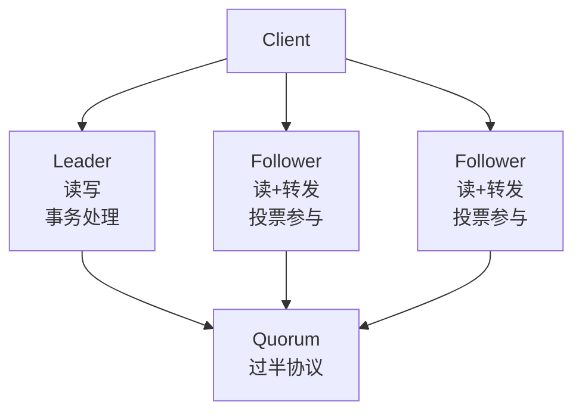
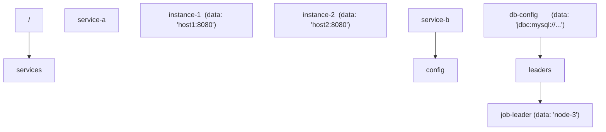
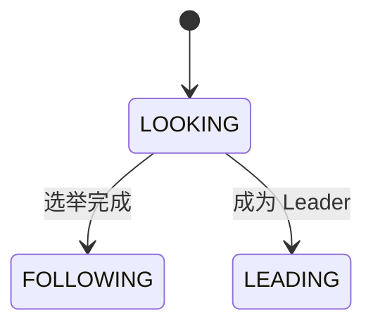
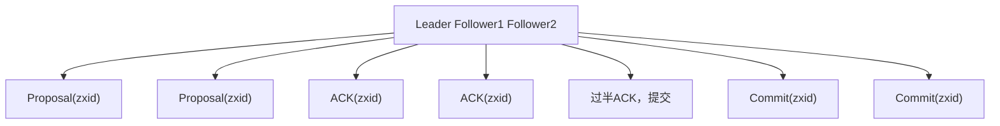

# 大数据 ZooKeeper 命令

> **符号约定**：`< >` 必填参数 | `[ ]` 可选参数

---

## 1. ZooKeeper架构

ZooKeeper 是一个**分布式协调服务**，为分布式应用提供一致性管理、配置维护、组服务和命名等功能。

### 1.1 集群架构



### 1.2 核心概念

| 概念        | 说明                                |
| :---------- | :---------------------------------- |
| **ZNode**   | 数据节点，类似文件系统中的文件/目录 |
| **zxid**    | 事务ID，全局单调递增，标识操作顺序  |
| **epoch**   | Leader周期号，每次选举递增          |
| **Quorum**  | 法定人数，集群半数以上节点          |
| **Session** | 客户端与服务器之间的会话            |

### 1.3 数据模型

ZooKeeper 的数据模型是**树形命名空间**，每个节点（ZNode）可以存储数据（默认1MB上限）：



**ZNode类型**：

| 类型         | 说明                         | 创建方式             |
| :----------- | :--------------------------- | :------------------- |
| 持久节点     | 持久存储，客户端断开后不删除 | `create /path`       |
| 临时节点     | 客户端会话结束自动删除       | `create -e /path`    |
| 持久顺序节点 | 持久 + 自动递增序号后缀      | `create -s /path`    |
| 临时顺序节点 | 临时 + 自动递增序号后缀      | `create -s -e /path` |
| 容器节点     | 最后一个子节点删除后自动删除 | `create -c /path`    |
| TTL节点      | 超时未修改自动删除           | `create -t /path`    |

## 2. ZAB协议

ZAB（ZooKeeper Atomic Broadcast）是 ZooKeeper 的**核心一致性协议**，保证所有事务按顺序广播到所有节点。

### 2.1 协议状态



### 2.2 消息广播（Broadcast）

Leader 将客户端请求转化为**事务提案（Proposal）**，通过两阶段提交广播：



**关键保证**：

- 所有事务按 **zxid 顺序**提交
- 过半节点ACK即可提交（不需要全部）
- Leader崩溃时，已完成的事务不会丢失

### 2.3 崩溃恢复（Recovery）

当Leader崩溃或失去过半Follower时，进入崩溃恢复模式：

1. **选举阶段**：所有节点进入LOOKING状态，选举新Leader
2. **发现阶段**：新Leader与Follower同步事务日志
3. **同步阶段**：确保所有节点数据一致
4. **广播阶段**：新Leader开始处理客户端请求

**选举约束**：

- 新Leader必须拥有**最完整的**事务日志（最大zxid）
- 已提交的事务不能丢失
- 未提交的事务需要被丢弃

### 2.4 zxid结构

$$\text{zxid} = \text{epoch} \ll 32 \mid \text{counter}$$

| 部分    | 位数   | 说明           |
| :------ | :----- | :------------- |
| epoch   | 高32位 | Leader周期号   |
| counter | 低32位 | 周期内事务计数 |

每次Leader选举，epoch递增，counter归零。

## 3. Watcher机制

Watcher 是 ZooKeeper 的**事件通知机制**，客户端可以在ZNode上注册监听器，当ZNode发生变化时收到通知。

### 3.1 事件类型

| 事件                | 触发条件    | 注册方法                   |
| :------------------ | :---------- | :------------------------- |
| NodeCreated         | ZNode被创建 | exists                     |
| NodeDeleted         | ZNode被删除 | exists/getData/getChildren |
| NodeDataChanged     | 数据变更    | exists/getData             |
| NodeChildrenChanged | 子节点变更  | getChildren                |

### 3.2 Watcher特性

- **一次性触发**：Watcher触发后自动失效，需要重新注册
- **有序性**：事件按zxid顺序触发，客户端看到的事件顺序与服务器一致
- **轻量级**：通知只包含事件类型，不包含变更后的数据

```java
// 注册Watcher
zk.exists("/config", new Watcher() {
    @Override
    public void process(WatchedEvent event) {
        if (event.getType() == EventType.NodeDataChanged) {
            // 重新读取数据并重新注册Watcher
            byte[] data = zk.getData("/config", this, null);
        }
    }
});
```

## 4. Leader选举

### 4.1 选举算法（FastLeaderElection）

```
每个节点投票: (self_id, self_zxid)

Round 1:
  Node1 投票: (1, zxid_1) → 发送给所有节点
  Node2 投票: (2, zxid_2) → 发送给所有节点
  Node3 投票: (3, zxid_3) → 发送给所有节点

比较规则:
  1. 比较 epoch（大的优先）
  2. 比较 zxid（大的优先）
  3. 比较 myid（大的优先）

假设 zxid_3 > zxid_2 > zxid_1:
  Node1 收到 (2,zxid_2) → 更新投票为 (2,zxid_2)
  Node1 收到 (3,zxid_3) → 更新投票为 (3,zxid_3)
  Node2 收到 (3,zxid_3) → 更新投票为 (3,zxid_3)

  Node3 获得过半投票 → 成为Leader
```

### 4.2 分布式锁实现

利用**临时顺序节点**实现公平锁：

```
1. 在 /locks 下创建临时顺序节点 → /locks/lock-0000000001
2. 获取 /locks 下所有子节点并排序
3. 如果自己是最小节点 → 获得锁
4. 如果不是 → Watch前一个节点的删除事件
5. 前一个节点删除 → 重新检查是否获得锁
6. 释放锁：删除自己的临时节点
```

```java
public class DistributedLock {
    private final ZooKeeper zk;
    private final String lockPath = "/locks";
    private String currentLock;

    public void lock() throws Exception {
        // 创建临时顺序节点
        currentLock = zk.create(lockPath + "/lock-",
            new byte[0], ZooDefs.Ids.OPEN_ACL_UNSAFE,
            CreateMode.EPHEMERAL_SEQUENTIAL);

        // 获取所有子节点
        List<String> children = zk.getChildren(lockPath, false);
        Collections.sort(children);

        // 检查是否是最小节点
        String currentNode = currentLock.substring(lockPath.length() + 1);
        int index = children.indexOf(currentNode);

        if (index == 0) {
            return; // 获得锁
        }

        // 等待前一个节点删除
        String prevNode = lockPath + "/" + children.get(index - 1);
        final CountDownLatch latch = new CountDownLatch(1);
        zk.exists(prevNode, event -> {
            if (event.getType() == EventType.NodeDeleted) {
                latch.countDown();
            }
        });
        latch.await();
    }

    public void unlock() throws Exception {
        zk.delete(currentLock, -1);
    }
}
```

## 5. 典型应用场景

| 场景           | 实现方式           | 说明                               |
| :------------- | :----------------- | :--------------------------------- |
| 服务注册与发现 | 临时节点 + Watcher | 服务上线创建临时节点，下线自动删除 |
| 分布式锁       | 临时顺序节点       | 公平锁实现                         |
| 配置中心       | 持久节点 + Watcher | 配置变更通知                       |
| Leader选举     | 临时节点           | 主备切换                           |
| 命名服务       | 顺序节点           | 全局唯一ID生成                     |
| 集群管理       | 临时节点           | 成员管理与存活检测                 |
## 连接 ZooKeeper

**基本写法：连接本地 ZooKeeper**
`zkCli.sh`

```bash
# 连接本地 ZooKeeper（默认端口 2181）
zkCli.sh
```

---

**基本写法：连接远程 ZooKeeper**
`zkCli.sh -server <主机>:<端口>`

```bash
# 连接远程 ZooKeeper
zkCli.sh -server namenode:2181
```

---

**基本写法：带超时连接**
`zkCli.sh -server <主机>:<端口> -timeout <毫秒>`

```bash
# 带 5 秒超时连接
zkCli.sh -server namenode:2181 -timeout 5000
```

---

## 节点操作

**基本写法：创建持久节点**
`create <路径> <数据>`

```bash
# 创建持久节点
create /myapp "my application"
```

---

**基本写法：创建临时节点**
`create -e <路径> <数据>`

```bash
# 创建临时节点（会话断开自动删除）
create -e /myapp/temp "temporary data"
```

---

**基本写法：创建顺序节点**
`create -s <路径> <数据>`

```bash
# 创建顺序节点（自动追加递增序号）
create -s /myapp/node "sequential data"
```

---

**基本写法：创建临时顺序节点**
`create -e -s <路径> <数据>`

```bash
# 创建临时顺序节点
create -e -s /myapp/lock "lock data"
```

---

**基本写法：创建带 TTL 的节点**
`create -t <毫秒> <路径> <数据>`

```bash
# 创建带 TTL 的节点（3.5+ 版本）
create -t 60000 /myapp/ttl "ttl data"
```

---

**基本写法：创建容器节点**
`create -c <路径> <数据>`

```bash
# 创建容器节点（子节点为空时自动删除）
create -c /myapp/container "container"
```

---

## 读取数据

**基本写法：列出子节点**
`ls <路径>`

```bash
# 列出根节点的子节点
ls /
# 列出指定节点的子节点
ls /myapp
```

---

**基本写法：递归列出**
`ls -R <路径>`

```bash
# 递归列出所有子节点
ls -R /myapp
```

---

**基本写法：获取节点数据**
`get <路径>`

```bash
# 获取节点数据和元信息
get /myapp
```

---

**基本写法：获取节点状态**
`stat <路径>`

```bash
# 获取节点状态信息
stat /myapp
```

---

**基本写法：仅获取数据**
`get -s <路径>`

```bash
# 获取数据和状态
get -s /myapp
```

---

## 更新数据

**基本写法：设置节点数据**
`set <路径> <新数据>`

```bash
# 更新节点数据
set /myapp "updated data"
```

---

**基本写法：带版本设置**
`set <路径> <新数据> <版本号>`

```bash
# 乐观锁更新（版本号需匹配）
set /myapp "versioned data" 2
```

---

## 删除节点

**基本写法：删除节点**
`delete <路径>`

```bash
# 删除节点（节点必须无子节点）
delete /myapp/temp
```

---

**基本写法：带版本删除**
`delete <路径> <版本号>`

```bash
# 带版本号删除
delete /myapp 3
```

---

**基本写法：递归删除**
`deleteall <路径>`

```bash
# 递归删除节点及其所有子节点
deleteall /myapp
```

---

## 监视器

**基本写法：监视节点数据变化**
`get -w <路径>`

```bash
# 设置数据变化监视器
get -w /myapp
```

---

**基本写法：监视子节点变化**
`ls -w <路径>`

```bash
# 设置子节点变化监视器
ls -w /myapp
```

---

**基本写法：监视节点状态**
`stat -w <路径>`

```bash
# 设置节点存在性监视器
stat -w /myapp
```

---

**基本写法：查看监视器**
`printwatches`

```bash
# 查看当前设置的监视器
printwatches on
```

---

## ACL 权限

**基本写法：查看 ACL**
`getAcl <路径>`

```bash
# 查看节点 ACL
getAcl /myapp
```

---

**基本写法：设置 ACL**
`setAcl <路径> <权限>`

```bash
# 设置 ACL（world 所有用户可读）
setAcl /myapp world:anyone:r
```

---

**基本写法：设置认证 ACL**
`setAcl <路径> auth:<用户>:<权限>`

```bash
# 设置认证用户权限
setAcl /myapp auth:user1:rw
```

---

**基本写法：设置 IP ACL**
`setAcl <路径> ip:<IP>:<权限>`

```bash
# 设置 IP 权限
setAcl /myapp ip:192.168.1.100:rw
```

---

**基本写法：添加认证**
`addauth <方案> <认证信息>`

```bash
# 添加 digest 认证
addauth digest username:password
```

---

## 配额管理

**基本写法：设置节点配额**
`setquota -n <数量> <路径>`

```bash
# 设置子节点数量配额
setquota -n 100 /myapp
```

---

**基本写法：设置字节配额**
`setquota -b <字节> <路径>`

```bash
# 设置数据大小配额
setquota -b 1048576 /myapp
```

---

**基本写法：查看配额**
`listquota <路径>`

```bash
# 查看节点配额
listquota /myapp
```

---

**基本写法：删除配额**
`delquota [-n|-b] <路径>`

```bash
# 删除数量配额
delquota -n /myapp
# 删除字节配额
delquota -b /myapp
```

---

## 集群管理

**基本写法：查看集群状态**
`zkServer.sh status`

```bash
# 查看 ZooKeeper 服务器状态
zkServer.sh status
```

---

**基本写法：启动服务器**
`zkServer.sh start`

```bash
# 启动 ZooKeeper 服务器
zkServer.sh start
```

---

**基本写法：停止服务器**
`zkServer.sh stop`

```bash
# 停止 ZooKeeper 服务器
zkServer.sh stop
```

---

**基本写法：重启服务器**
`zkServer.sh restart`

```bash
# 重启 ZooKeeper 服务器
zkServer.sh restart
```

---

**基本写法：前台启动**
`zkServer.sh start-foreground`

```bash
# 前台启动（查看日志）
zkServer.sh start-foreground
```

---

## 四字命令

**基本写法：查看状态**
`echo stat | nc <主机> <端口>`

```bash
# 查看服务器状态
echo stat | nc localhost 2181
```

---

**基本写法：查看环境**
`echo envi | nc <主机> <端口>`

```bash
# 查看环境变量
echo envi | nc localhost 2181
```

---

**基本写法：查看监视**
`echo wchs | nc <主机> <端口>`

```bash
# 查看监视器详情
echo wchs | nc localhost 2181
```

---

**基本写法：查看监视详情**
`echo wchc | nc <主机> <端口>`

```bash
# 查看监视器按会话分组
echo wchc | nc localhost 2181
```

---

**基本写法：查看连接**
`echo cons | nc <主机> <端口>`

```bash
# 查看客户端连接
echo cons | nc localhost 2181
```

---

**基本写法：查看配置**
`echo conf | nc <主机> <端口>`

```bash
# 查看服务器配置
echo conf | nc localhost 2181
```

---

**基本写法：查看健康状态**
`echo ruok | nc <主机> <端口>`

```bash
# 查看服务器是否正常（返回 imok）
echo ruok | nc localhost 2181
```

---

**基本写法：查看路径**
`echo dump | nc <主机> <端口>`

```bash
# 查看会话和临时节点
echo dump | nc localhost 2181
```

---

**基本写法：查看统计**
`echo srvr | nc <主机> <端口>`

```bash
# 查看服务器统计信息
echo srvr | nc localhost 2181
```

---

## 其他命令

**基本写法：同步节点**
`sync <路径>`

```bash
# 强制同步节点数据
sync /myapp
```

---

**基本写法：移除监视器**
`removewatches <路径>`

```bash
# 移除指定路径的监视器
removewatches /myapp
```

---

**基本写法：关闭连接**
`close`

```bash
# 关闭当前连接
close
```

---

**基本写法：退出**
`quit`

```bash
# 退出 ZooKeeper 客户端
quit
```

---

**基本写法：查看历史命令**
`history`

```bash
# 查看历史命令
history
```

---

**基本写法：重新执行命令**
`redo <编号>`

```bash
# 重新执行编号为 10 的命令
redo 10
```

## 参考文献


Apache Spark：https://spark.apache.org/docs/latest/
Apache Flink：https://flink.apache.org/
Apache Kafka：https://kafka.apache.org/documentation/
ClickHouse：https://clickhouse.com/docs
Airflow：https://airflow.apache.org/docs/

## 延伸阅读


大数据生态概览，见 052-big-data 模块文档。
数据分析与统计，见 051-data-analysis/030-probability-statistics 模块。
分布式系统基础，见 034-cloud-computing 模块。
尚硅谷 Bilibili 空间（https://space.bilibili.com/302417610 ）提供大数据课程。

## 模块文档速查表

| 文档 | 主题 | 与本文的关联 |
| --- | --- | --- |
| 大数据概述 | 001-DataOverview | 本文的前置基础 |
| HDFS分布式文件系统 | 002-HDFSDistributedFileSystem | 本文的并列主题 |
| MapReduce | 003-MapReduce | 本文的并列主题 |
| Spark核心 | 004-SparkCore | 本文的并列主题 |
| Spark-Streaming | 005-SparkStreaming | 本文的并列主题 |
| Hive数据仓库 | 006-HiveDataWarehouse | 本文的并列主题 |
| HBase列族数据库 | 007-HBaseDatabase | 本文的并列主题 |
| Kafka消息队列 | 008-KafkaMessageQueue | 本文的并列主题 |
| Flink流处理 | 009-FlinkStreamHandling | 本文的并列主题 |
| 数据湖 | 010-DataLake | 本文的并列主题 |
| Zookeeper协调服务 | 011-Zookeeper | 本文自身 |
| YARN资源管理 | 012-YARNManagement | 本文的并列主题 |
| 大数据 HDFS 命令 | 013-HDFSCommands | 本文的并列主题 |
| 大数据 YARN 命令 | 014-YARNCommands | 本文的并列主题 |
| 大数据 Spark RDD | 015-SparkRDD | 本文的并列主题 |
| 大数据 Spark DataFrame | 016-SparkDataFrame | 本文的并列主题 |
| 大数据 Hive DDL | 017-HiveDDL | 本文的并列主题 |
| 大数据 Hive DML | 018-HiveDML | 本文的并列主题 |
| 大数据 Hive 函数 | 019-HiveFunctions | 本文的并列主题 |
| 大数据 Kafka 命令 | 020-KafkaCommands | 本文的并列主题 |
| 大数据 HBase 命令 | 021-HBaseCommands | 本文的并列主题 |
| 大数据 Flink 流处理 | 022-FlinkBasics | 本文的并列主题 |
| 大数据 Spark 优化 | 023-SparkOptimization | 本文的性能延伸 |
