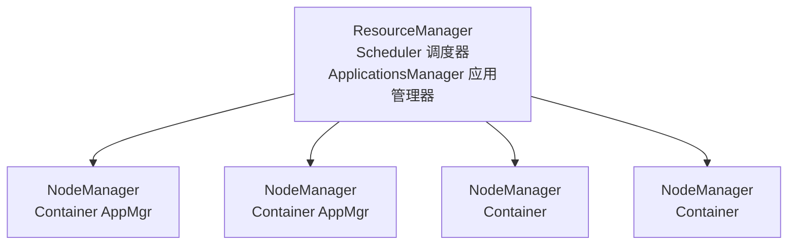
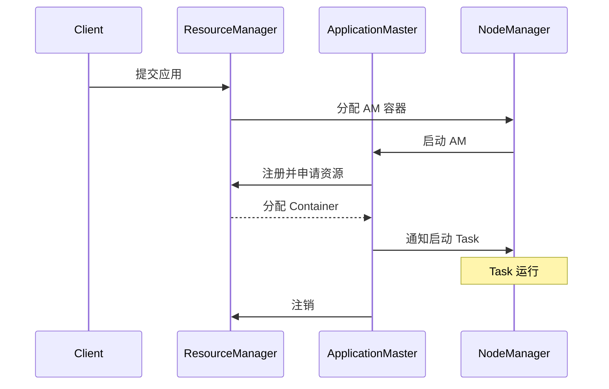
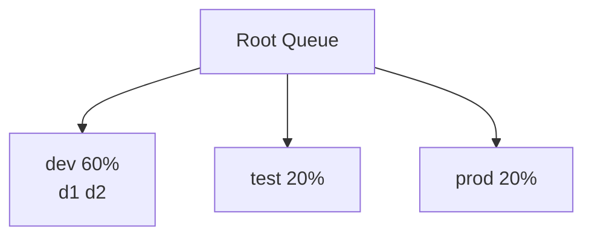
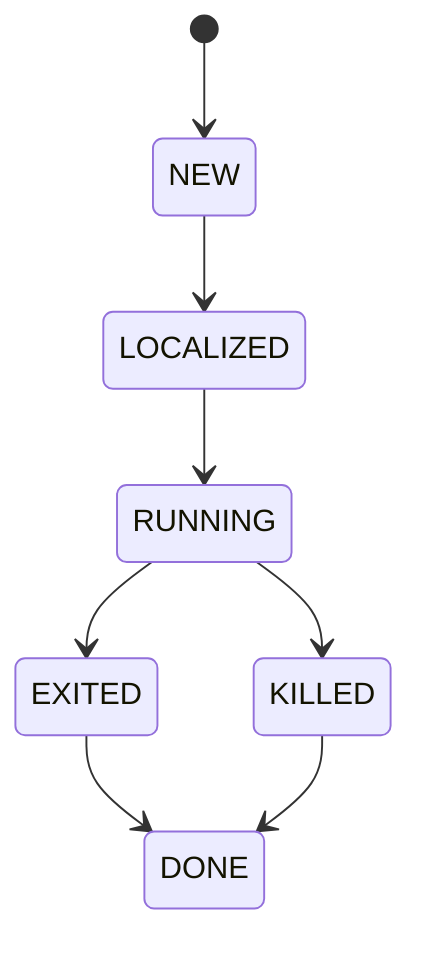
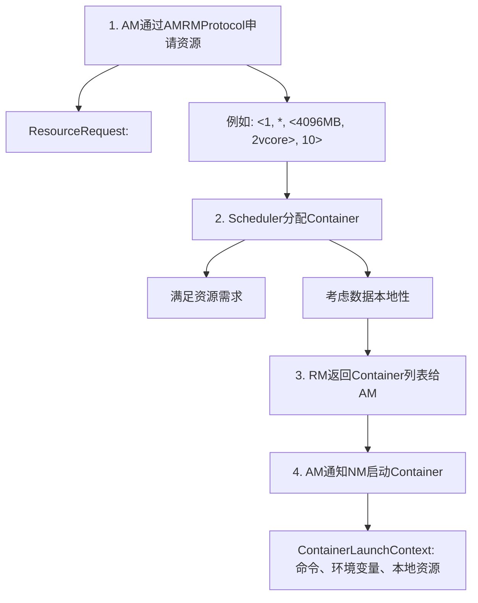
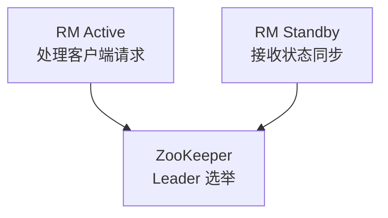

## 1. YARN架构设计

YARN（Yet Another Resource Negotiator）是 Hadoop 的**资源管理和任务调度框架**，将资源管理和作业调度解耦。

### 1.1 核心架构



### 1.2 核心组件

**ResourceManager（RM）**：

- 全局资源管理和调度
- **Scheduler**：纯调度，不负责应用监控
- **ApplicationsManager**：接收作业提交、启动AM

**NodeManager（NM）**：

- 单节点资源管理
- 向RM汇报节点资源（CPU、内存）和Container状态
- 启动/停止Container
- 监控Container资源使用

**ApplicationMaster（AM）**：

- 每个应用一个AM
- 向RM申请资源
- 与NM协作启动/监控Task
- 应用失败时负责重试

**Container**：

- YARN中资源分配的**基本单位**
- 封装CPU核数和内存大小
- 运行在NM上，由NM管理生命周期

### 1.3 作业执行流程



## 2. 调度器

### 2.1 FIFO调度器

```
队列: [Job1] → [Job2] → [Job3]
       先到先服务，简单但不公平
```

- 优点：实现简单
- 缺点：大作业阻塞小作业

### 2.2 Capacity调度器



- 每个队列保证**最低资源量**
- 队列空闲资源可被其他队列**临时借用**
- 支持**多级子队列**
- 支持**用户限制**（最大资源占比）

**关键配置**：

```xml
<configuration>
  <property>
    <name>yarn.scheduler.capacity.root.queues</name>
    <value>dev,test,prod</value>
  </property>
  <property>
    <name>yarn.scheduler.capacity.root.dev.capacity</name>
    <value>60</value>
  </property>
  <property>
    <name>yarn.scheduler.capacity.root.dev.maximum-capacity</name>
    <value>80</value>
  </property>
</configuration>
```

### 2.3 Fair调度器

```
时间T1: [Job1: 100%资源]
时间T2: [Job1: 50%, Job2: 50%]  ← Job2提交
时间T3: [Job1: 33%, Job2: 33%, Job3: 33%]  ← Job3提交
```

- 所有作业**公平共享**资源
- 短作业优先完成
- 支持**权重**配置
- 支持**最小资源保证**

### 2.4 调度器对比

| 维度       | FIFO     | Capacity       | Fair           |
| :--------- | :------- | :------------- | :------------- |
| 资源分配   | 先到先得 | 队列容量保证   | 公平共享       |
| 小作业     | 被阻塞   | 不被阻塞       | 快速完成       |
| 队列支持   | 无       | 多级队列       | 多级队列       |
| 资源利用率 | 低       | 中             | 高             |
| 配置复杂度 | 低       | 中             | 高             |
| 适用场景   | 测试     | 生产（多租户） | 生产（多用户） |

## 3. 资源模型与容器

### 3.1 资源维度

| 资源      | 说明       | 配置                                   |
| :-------- | :--------- | :------------------------------------- |
| Memory    | 内存（MB） | `yarn.nodemanager.resource.memory-mb`  |
| CPU VCore | 虚拟核     | `yarn.nodemanager.resource.cpu-vcores` |
| GPU       | GPU卡数    | `yarn.nodemanager.resource.gpus`       |

### 3.2 Container生命周期



| 状态      | 说明                    |
| :-------- | :---------------------- |
| NEW       | Container已分配，未启动 |
| LOCALIZED | 资源本地化完成          |
| RUNNING   | 正在运行                |
| EXITED    | 正常退出                |
| KILLED    | 被杀死                  |
| DONE      | 清理完成                |

### 3.3 资源申请与分配

AM 向 RM 申请资源的流程：



**数据本地性优先级**：

$$\text{Node Local} > \text{Rack Local} > \text{Off Switch}$$

## 4. YARN高可用

### 4.1 RM高可用



**故障转移方式**：

- **手动转移**：`yarn rmadmin -transitionToStandby`
- **自动转移**：基于ZooKeeper的自动选举

### 4.2 关键配置

| 参数                                    | 说明      | 建议值         |
| :-------------------------------------- | :-------- | :------------- |
| `yarn.resourcemanager.ha.enabled`       | 启用HA    | true           |
| `yarn.resourcemanager.ha.rm-ids`        | RM ID列表 | rm1,rm2        |
| `yarn.resourcemanager.recovery.enabled` | 状态恢复  | true           |
| `yarn.resourcemanager.store.class`      | 状态存储  | ZKRMStateStore |

## 5. YARN调优

### 5.1 内存配置

$$\text{Container内存} = \text{Map内存} \text{ 或 } \text{Reduce内存}$$

$$\text{NM总内存} \geq \sum(\text{Container内存})$$

| 参数                                   | 说明         | 建议          |
| :------------------------------------- | :----------- | :------------ |
| `yarn.nodemanager.resource.memory-mb`  | NM可用总内存 | 物理内存的75% |
| `yarn.scheduler.minimum-allocation-mb` | 最小分配     | 512MB         |
| `yarn.scheduler.maximum-allocation-mb` | 最大分配     | NM总内存      |
| `yarn.nodemanager.vmem-pmem-ratio`     | 虚拟内存比   | 2.1           |

### 5.2 常见问题与解决

| 问题            | 原因         | 解决                        |
| :-------------- | :----------- | :-------------------------- |
| Container被Kill | 内存超限     | 增大Container内存或优化程序 |
| AM启动失败      | 资源不足     | 检查队列容量和最大分配      |
| 作业长时间等待  | 调度器排队   | 调整队列权重或优先级        |
| NM不健康        | 磁盘空间不足 | 清理磁盘或调整健康检查阈值  |

## 参考文献


Apache Spark：https://spark.apache.org/docs/latest/
Apache Flink：https://flink.apache.org/
Apache Kafka：https://kafka.apache.org/documentation/
ClickHouse：https://clickhouse.com/docs
Airflow：https://airflow.apache.org/docs/

## 延伸阅读


大数据生态概览，见 052-big-data 模块文档。
数据分析与统计，见 051-data-analysis/030-probability-statistics 模块。
分布式系统基础，见 034-cloud-computing 模块。
尚硅谷 Bilibili 空间（https://space.bilibili.com/302417610 ）提供大数据课程。

## 深度专题扩展


以下专题从不同角度深入本文主题，供有进阶需求的读者研读。每个专题独立成节，内容相互补充。

### 13.1 流处理语义深入

At-most-once：可能丢；At-least-once：可能重；Exactly-once：端到端精确一次需事务/幂等。
状态后端：RocksDB 本地状态 + checkpoint 快照；重启恢复。
窗口：滚动（固定）、滑动（重叠）、会话（空闲间隔）；触发条件（水位线 + 允许迟到）。
实践：幂等写入 + 去重键（事件 ID）兜底。

### 13.2 数据仓库建模

维度建模：事实表（度量、外键）+ 维度表（描述）；星型模型查询友好。
分层：ODS 原样、DWD 明细清洗、DWS 汇总、ADS 应用。
缓慢变化维度（SCD）：覆盖（1）、新增行（2）、新增列（3）。
建模工具：dbt 实现 ELT 与测试；血缘可视化。

## 模块文档速查表

| 文档 | 主题 | 与本文的关联 |
| --- | --- | --- |
| 大数据概述 | 001-DataOverview | 本文的前置基础 |
| HDFS分布式文件系统 | 002-HDFSDistributedFileSystem | 本文的并列主题 |
| MapReduce | 003-MapReduce | 本文的并列主题 |
| Spark核心 | 004-SparkCore | 本文的并列主题 |
| Spark-Streaming | 005-SparkStreaming | 本文的并列主题 |
| Hive数据仓库 | 006-HiveDataWarehouse | 本文的并列主题 |
| HBase列族数据库 | 007-HBaseDatabase | 本文的并列主题 |
| Kafka消息队列 | 008-KafkaMessageQueue | 本文的并列主题 |
| Flink流处理 | 009-FlinkStreamHandling | 本文的并列主题 |
| 数据湖 | 010-DataLake | 本文的并列主题 |
| Zookeeper协调服务 | 011-Zookeeper | 本文的并列主题 |
| YARN资源管理 | 012-YARNManagement | 本文自身 |
| 大数据 HDFS 命令 | 013-HDFSCommands | 本文的并列主题 |
| 大数据 YARN 命令 | 014-YARNCommands | 本文的并列主题 |
| 大数据 Spark RDD | 015-SparkRDD | 本文的并列主题 |
| 大数据 Spark DataFrame | 016-SparkDataFrame | 本文的并列主题 |
| 大数据 Hive DDL | 017-HiveDDL | 本文的并列主题 |
| 大数据 Hive DML | 018-HiveDML | 本文的并列主题 |
| 大数据 Hive 函数 | 019-HiveFunctions | 本文的并列主题 |
| 大数据 Kafka 命令 | 020-KafkaCommands | 本文的并列主题 |
| 大数据 HBase 命令 | 021-HBaseCommands | 本文的并列主题 |
| 大数据 Flink 流处理 | 022-FlinkBasics | 本文的并列主题 |
| 大数据 Spark 优化 | 023-SparkOptimization | 本文的性能延伸 |
