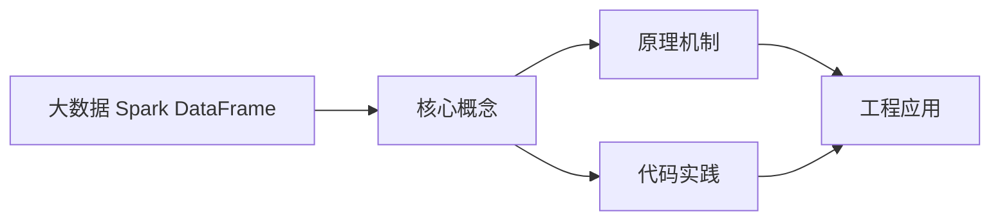
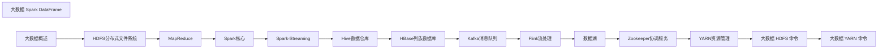

## 1. 学习目标（Bloom 分类）

本节按照布鲁姆教育目标分类学组织学习路径。本文主题为《大数据 Spark DataFrame》，属于 大数据 模块，读者可以根据自身阶段选择阅读深度。

记忆层面：能够准确复述本文的核心概念、术语与基本语法或操作步骤，并能够在提问或检索时快速定位对应知识点。能够说出 大数据 的核心概念、常用命令与流程。

理解层面：能够用自己的语言解释核心原理与工作机制，说明概念之间的因果关系，而不是机械记忆结论。能够解释 大数据 的工作原理与设计动机。

应用层面：能够在真实项目或练习场景中运用本文知识解决具体问题，写出正确且可维护的实现。能够独立完成 大数据 的标准操作。

分析层面：能够拆解复杂问题，比较本文主题与相邻概念的异同，识别边界条件与例外情况。能够分析 大数据 使用中的异常与边界。

评价层面：能够根据约束条件（性能、可读性、安全、成本）评价不同方案的优劣，做出有依据的技术决策。能够评价 大数据 相关工具与方案。

创造层面：能够把本文知识与其他模块知识组合，设计出新的解决方案或可复用的工程模式。能够把 大数据 融入团队工作流。

通过本节学习，读者应当能够把《大数据 Spark DataFrame》纳入自己的知识网络，并与 大数据 模块的其他主题（分布式存储、批处理、流处理、数据仓库）建立关联。

## 2. 历史动机与发展脉络

《大数据 Spark DataFrame》是 大数据 领域的重要主题。要真正理解它，需要先了解它解决的问题与演进过程。

大数据指规模超出单机处理能力的数据工程问题：2004 年 Google MapReduce 论文开启分布式计算时代，Hadoop 生态（2006）开源落地。
现代技术版图：存储（HDFS/对象存储/数据湖）、批处理（Spark）、流处理（Flink/Kafka）、数仓（Hive/Doris/ClickHouse）、调度（Airflow）。
湖仓一体（Lakehouse）融合数据湖灵活与数仓治理；云原生数据栈（Snowflake/Databricks）成为主流形态。

回到本文主题：大数据 Spark DataFrame 的提出与成熟，正是上述技术背景下的必然产物。早期实现往往以简单可用为目标，随着工程规模扩大，社区逐渐沉淀出标准做法与最佳实践；理解这一脉络，可以帮助读者判断“为什么文档中的推荐写法是现在这个样子”，也能在遇到历史遗留代码时准确识别其设计年代与取舍。


## 3. 形式化定义与核心概念精讲

本节把《大数据 Spark DataFrame》涉及的核心概念以“定义 + 讲解”的形式展开。读者应把定义当作工具，把讲解当作理解路径；两者结合才能形成可迁移的知识。

分布式存储：数据分片（shard）与副本（replica），一致性（CAP 权衡）；HDFS 块存储与对象存储。
批处理模型：MapReduce 分而治之；Spark 基于内存 DAG 优化；数据本地性减少传输。
流处理：事件时间与水位线（watermark）、窗口（滚动/滑动/会话）、精确一次语义（exactly-once）。

### 3.1 原文章节逐一精讲

原文档把主题拆分为 11 个小节，下面按顺序给出每一节的导读讲解，随后保留原文细节供精读。

#### 原文精读（完整保留）

# 大数据 Spark DataFrame

> **符号约定**：`< >` 必填参数 | `[ ]` 可选参数

---

#### 创建 SparkSession

**换行写法：初始化 SparkSession**
`from pyspark.sql import SparkSession`
`spark = SparkSession.builder.appName(<应用名>).getOrCreate()`

```python
# 初始化 SparkSession
from pyspark.sql import SparkSession

spark = SparkSession.builder \
    .appName("MyApp") \
    .master("local[*]") \
    .getOrCreate()
```

---

**基本写法：启用 Hive 支持**
`SparkSession.builder.enableHiveSupport().getOrCreate()`

```python
# 启用 Hive 支持
spark = SparkSession.builder \
    .appName("HiveApp") \
    .enableHiveSupport() \
    .getOrCreate()
```

---

**基本写法：获取 SparkContext**
`spark.sparkContext`

```python
# 从 SparkSession 获取 SparkContext
sc = spark.sparkContext
```

---

#### 创建 DataFrame

**基本写法：从 RDD 创建**
`spark.createDataFrame(<rdd>, [<schema>])`

```python
# 从 RDD 创建 DataFrame
rdd = sc.parallelize([("Alice", 30), ("Bob", 25)])
df = spark.createDataFrame(rdd, ["name", "age"])
```

---

**基本写法：从列表创建**
`spark.createDataFrame(<数据>, [<列名>])`

```python
# 从列表创建 DataFrame
data = [("Alice", 30), ("Bob", 25), ("Charlie", 35)]
df = spark.createDataFrame(data, ["name", "age"])
```

---

**基本写法：从字典列表创建**
`spark.createDataFrame(<字典列表>)`

```python
# 从字典列表创建 DataFrame
data = [{"name": "Alice", "age": 30}, {"name": "Bob", "age": 25}]
df = spark.createDataFrame(data)
```

---

**基本写法：从 Pandas DataFrame 创建**
`spark.createDataFrame(<pandas_df>)`

```python
# 从 Pandas DataFrame 创建 Spark DataFrame
import pandas as pd
pdf = pd.DataFrame({"name": ["Alice", "Bob"], "age": [30, 25]})
df = spark.createDataFrame(pdf)
```

---

**基本写法：读取 JSON 文件**
`spark.read.json(<路径>)`

```python
# 读取 JSON 文件
df = spark.read.json("hdfs://namenode:8020/data.json")
```

---

**基本写法：读取 CSV 文件**
`spark.read.csv(<路径>, header=<布尔值>, inferSchema=<布尔值>)`

```python
# 读取 CSV 文件
df = spark.read.csv("data.csv", header=True, inferSchema=True)
```

---

**基本写法：读取 Parquet 文件**
`spark.read.parquet(<路径>)`

```python
# 读取 Parquet 文件
df = spark.read.parquet("hdfs://namenode:8020/data.parquet")
```

---

**基本写法：读取 ORC 文件**
`spark.read.orc(<路径>)`

```python
# 读取 ORC 文件
df = spark.read.orc("hdfs://namenode:8020/data.orc")
```

---

**基本写法：读取 Hive 表**
`spark.read.table(<表名>)`

```python
# 读取 Hive 表
df = spark.read.table("my_database.my_table")
```

---

**基本写法：读取 JDBC 数据源**
`spark.read.jdbc(<url>, <表名>, properties=<属性>)`

```python
# 从 MySQL 读取数据
df = spark.read.jdbc(
    url="jdbc:mysql://localhost:3306/db",
    table="users",
    properties={"user": "root", "password": "123456"}
)
```

---

#### 查看数据

**基本写法：查看 Schema**
`<df>.printSchema()`

```python
# 打印 DataFrame 的 Schema
df.printSchema()
```

---

**基本写法：查看前几行**
`<df>.show([<行数>])`

```python
# 显示前 20 行
df.show()
# 显示前 5 行
df.show(5)
```

---

**基本写法：截断显示**
`<df>.show(truncate=False)`

```python
# 显示完整内容（不截断长字符串）
df.show(truncate=False)
```

---

**基本写法：查看列名**
`<df>.columns`

```python
# 获取所有列名
print(df.columns)
```

---

**基本写法：查看数据类型**
`<df>.dtypes`

```python
# 获取列名和类型
print(df.dtypes)
```

---

**基本写法：转换为 Pandas**
`<df>.toPandas()`

```python
# 转换为 Pandas DataFrame
pdf = df.toPandas()
```

---

#### 选择与过滤

**基本写法：选择列**
`<df>.select(<列1>, <列2>)`

```python
# 选择指定列
df.select("name", "age").show()
```

---

**基本写法：选择并重命名**
`<df>.select(<列>.alias(<新名>))`

```python
# 选择列并重命名
df.select(df["name"].alias("username")).show()
```

---

**基本写法：使用表达式**
`<df>.selectExpr(<表达式>)`

```python
# 使用 SQL 表达式
df.selectExpr("name", "age + 1 as next_age").show()
```

---

**基本写法：过滤数据**
`<df>.filter(<条件>)`

```python
# 过滤数据
df.filter(df["age"] > 25).show()
```

---

**基本写法：使用 SQL 字符串过滤**
`<df>.filter("<SQL条件>")`

```python
# 使用 SQL 字符串过滤
df.filter("age > 25").show()
```

---

**基本写法：多条件过滤**
`<df>.filter((<条件1>) & (<条件2>))`

```python
# 多条件过滤
df.filter((df["age"] > 25) & (df["city"] == "北京")).show()
```

---

**基本写法：去重**
`<df>.distinct()`

```python
# 整行去重
df.distinct().show()
```

---

**基本写法：按列去重**
`<df>.dropDuplicates([<列名>])`

```python
# 按指定列去重
df.dropDuplicates(["name"]).show()
```

---

#### 列操作

**基本写法：添加列**
`<df>.withColumn(<列名>, <表达式>)`

```python
# 添加新列
df = df.withColumn("age_plus_1", df["age"] + 1)
```

---

**基本写法：重命名列**
`<df>.withColumnRenamed(<旧名>, <新名>)`

```python
# 重命名列
df = df.withColumnRenamed("name", "username")
```

---

**基本写法：删除列**
`<df>.drop(<列名>)`

```python
# 删除列
df = df.drop("age_plus_1")
```

---

**基本写法：使用函数操作列**
`from pyspark.sql import functions as F`
`<df>.withColumn(<列名>, F.<函数>(<列>))`

```python
# 使用内置函数
from pyspark.sql import functions as F

df = df.withColumn("upper_name", F.upper(df["name"]))
df = df.withColumn("birth_year", F.year(F.current_date()) - df["age"])
```

---

#### 聚合操作

**基本写法：分组聚合**
`<df>.groupBy(<列>).agg(<聚合函数>)`

```python
# 分组聚合
from pyspark.sql import functions as F

df.groupBy("city").agg(
    F.avg("salary").alias("avg_salary"),
    F.count("*").alias("count")
).show()
```

---

**基本写法：单列聚合**
`<df>.groupBy(<列>).<聚合函数>(<值列>)`

```python
# 单列聚合
df.groupBy("city").avg("salary").show()
df.groupBy("city").count().show()
df.groupBy("city").max("salary").show()
```

---

**基本写法：多列分组**
`<df>.groupBy(<列1>, <列2>).agg(<聚合函数>)`

```python
# 多列分组
df.groupBy("city", "department").agg(
    F.sum("salary").alias("total_salary")
).show()
```

---

**基本写法：全表聚合**
`<df>.agg(<聚合函数>)`

```python
# 全表聚合
df.agg(
    F.avg("salary").alias("avg_salary"),
    F.max("age").alias("max_age")
).show()
```

---

**基本写法：pivot 透视**
`<df>.groupBy(<行列>).pivot(<列>).agg(<聚合函数>)`

```python
# 透视表
df.groupBy("city").pivot("year").sum("sales").show()
```

---

#### Join 操作

**基本写法：内连接**
`<df1>.join(<df2>, on=<连接列>, how="inner")`

```python
# 内连接
result = df1.join(df2, on="id", how="inner")
```

---

**基本写法：左连接**
`<df1>.join(<df2>, on=<连接列>, how="left")`

```python
# 左外连接
result = df1.join(df2, on="id", how="left")
```

---

**基本写法：右连接**
`<df1>.join(<df2>, on=<连接列>, how="right")`

```python
# 右外连接
result = df1.join(df2, on="id", how="right")
```

---

**基本写法：全外连接**
`<df1>.join(<df2>, on=<连接列>, how="outer")`

```python
# 全外连接
result = df1.join(df2, on="id", how="outer")
```

---

**基本写法：使用不同列名连接**
`<df1>.join(<df2>, <df1>[<列1>] == <df2>[<列2>])`

```python
# 不同列名连接
result = df1.join(df2, df1["user_id"] == df2["id"])
```

---

**基本写法：多列连接**
`<df1>.join(<df2>, on=[<列1>, <列2>])`

```python
# 多列连接
result = df1.join(df2, on=["city", "year"])
```

---

#### 排序

**基本写法：按列排序**
`<df>.orderBy(<列>)`

```python
# 升序排序
df.orderBy("age").show()
# 降序排序
df.orderBy(df["age"].desc()).show()
```

---

**基本写法：多列排序**
`<df>.orderBy(<列1>, <列2>)`

```python
# 多列排序
df.orderBy("city", df["age"].desc()).show()
```

---

**基本写法：使用 sort**
`<df>.sort(<列>)`

```python
# 使用 sort 方法
df.sort(df["salary"].desc()).show()
```

---

#### 窗口函数

**换行写法：定义窗口**
`from pyspark.sql.window import Window`
`window = Window.partitionBy(<分组列>).orderBy(<排序列>)`

```python
# 定义窗口
from pyspark.sql.window import Window

window = Window.partitionBy("city").orderBy(F.desc("salary"))
```

---

**基本写法：行号**
`F.row_number().over(<窗口>)`

```python
# 为每行编号
df = df.withColumn("rank", F.row_number().over(window))
```

---

**基本写法：排名**
`F.rank().over(<窗口>)`

```python
# 排名（有并列）
df = df.withColumn("rank", F.rank().over(window))
```

---

**基本写法：密集排名**
`F.dense_rank().over(<窗口>)`

```python
# 密集排名（无间隔）
df = df.withColumn("rank", F.dense_rank().over(window))
```

---

**基本写法：累积聚合**
`F.sum(<列>).over(<窗口>)`

```python
# 累积求和
df = df.withColumn("cumsum", F.sum("salary").over(window))
```

---

**基本写法：前 N 行**
`F.lead(<列>, <偏移>).over(<窗口>)`

```python
# 获取下一条记录
df = df.withColumn("next_salary", F.lead("salary", 1).over(window))
```

---

**基本写法：前一行**
`F.lag(<列>, <偏移>).over(<窗口>)`

```python
# 获取上一条记录
df = df.withColumn("prev_salary", F.lag("salary", 1).over(window))
```

---

#### 保存数据

**基本写法：保存为 Parquet**
`<df>.write.parquet(<路径>)`

```python
# 保存为 Parquet 文件
df.write.parquet("hdfs://namenode:8020/output/")
```

---

**基本写法：保存为 CSV**
`<df>.write.csv(<路径>, header=<布尔值>)`

```python
# 保存为 CSV 文件
df.write.csv("output/", header=True)
```

---

**基本写法：保存为 JSON**
`<df>.write.json(<路径>)`

```python
# 保存为 JSON 文件
df.write.json("output/")
```

---

**基本写法：覆盖写入**
`<df>.write.mode("overwrite").<格式>(<路径>)`

```python
# 覆盖写入
df.write.mode("overwrite").parquet("output/")
```

---

**基本写法：追加写入**
`<df>.write.mode("append").<格式>(<路径>)`

```python
# 追加写入
df.write.mode("append").parquet("output/")
```

---

**基本写法：保存为 Hive 表**
`<df>.write.saveAsTable(<表名>)`

```python
# 保存为 Hive 表
df.write.saveAsTable("my_database.my_table")
```

---

**基本写法：写入 JDBC**
`<df>.write.jdbc(<url>, <表名>, properties=<属性>)`

```python
# 写入 MySQL
df.write.jdbc(
    url="jdbc:mysql://localhost:3306/db",
    table="users",
    mode="overwrite",
    properties={"user": "root", "password": "123456"}
)
```

---

#### SQL 查询

**基本写法：注册临时视图**
`<df>.createOrReplaceTempView(<视图名>)`

```python
# 注册临时视图
df.createOrReplaceTempView("people")
```

---

**基本写法：执行 SQL 查询**
`spark.sql(<SQL语句>)`

```python
# 执行 SQL 查询
result = spark.sql("SELECT city, AVG(salary) FROM people GROUP BY city")
result.show()
```

---

**基本写法：注册全局视图**
`<df>.createGlobalTempView(<视图名>)`

```python
# 注册全局临时视图
df.createGlobalTempView("global_people")
result = spark.sql("SELECT * FROM global_temp.global_people")
```


### 3.2 概念关系图

下面用 Mermaid 图表达本文核心概念之间的关系，帮助读者建立整体图景：



图中展示的是本文知识的结构化关系：核心概念是入口，原理机制解释“为什么”，代码实践演示“怎么做”，工程应用回答“何时用”。读者学习时可以把每个小节的内容挂接到对应节点上。

## 4. 理论推导与原理解析

本节深入《大数据 Spark DataFrame》背后的原理。理论部分不求面面俱到，而是聚焦“能解释现象、能指导实践”的关键推导。

分布式存储：数据分片（shard）与副本（replica），一致性（CAP 权衡）；HDFS 块存储与对象存储。
批处理模型：MapReduce 分而治之；Spark 基于内存 DAG 优化；数据本地性减少传输。
流处理：事件时间与水位线（watermark）、窗口（滚动/滑动/会话）、精确一次语义（exactly-once）。
数据仓库：维度建模（星型/雪花）、ETL/ELT、分层（ODS/DWD/DWS/ADS）。

需要强调的是，理论推导与工程实践之间存在翻译层：理论给出的是理想化模型与边界条件，工程代码则必须处理真实环境中的例外。读者在学习时应先掌握理论的“标准情形”，再通过陷阱章节了解“非标准情形”。

## 5. 代码示例与逐行讲解

本节把原文中的代码示例系统整理，并为每个示例补充用途说明与讲解。读者不应只浏览代码，而应逐段对照讲解理解设计意图。

### 5.1 示例：创建 SparkSession

该示例来自原文《创建 SparkSession》小节，用于演示大数据 Spark DataFrame相关操作。阅读时请先看代码结构，再看其后的讲解。

```python
# 初始化 SparkSession
from pyspark.sql import SparkSession

spark = SparkSession.builder \
    .appName("MyApp") \
    .master("local[*]") \
    .getOrCreate()
```

讲解：这段代码演示了本节核心知识点。代码中的关键操作可以归纳为三步：准备（定义或初始化）、执行（核心逻辑）、收尾（释放资源或返回结果）。实际项目中，这三步往往被封装为函数或类，以提升复用性与可测试性。

关键点分析：

该示例共 6 行有效代码，包含 2 类关键结构（import、from）。其中：

- 入口与初始化部分负责建立上下文，对应实际项目中的启动或装配逻辑；
- 核心逻辑部分体现本文主题的主要操作，是阅读时最需要对照讲解理解的部分；
- 输出或返回部分把结果交给调用方，注意其类型与边界条件。

进阶思考路径：先尝试修改参数观察行为变化，再把示例中的模式迁移到自己的项目中；每次修改都记录预期与实测差异，这是把示例转化为能力的最快方式。

### 5.2 示例：创建 SparkSession

该示例来自原文《创建 SparkSession》小节，用于演示大数据 Spark DataFrame相关操作。阅读时请先看代码结构，再看其后的讲解。

```python
# 启用 Hive 支持
spark = SparkSession.builder \
    .appName("HiveApp") \
    .enableHiveSupport() \
    .getOrCreate()
```

讲解：这段代码演示了本节核心知识点。代码中的关键操作可以归纳为三步：准备（定义或初始化）、执行（核心逻辑）、收尾（释放资源或返回结果）。实际项目中，这三步往往被封装为函数或类，以提升复用性与可测试性。

关键点分析：

该示例共 5 行有效代码，结构以数据或配置为主。阅读时应关注：数据字段的含义、配置项的作用，以及它们与运行行为的对应关系。

进阶思考路径：先尝试修改参数观察行为变化，再把示例中的模式迁移到自己的项目中；每次修改都记录预期与实测差异，这是把示例转化为能力的最快方式。

### 5.3 示例：创建 SparkSession

该示例来自原文《创建 SparkSession》小节，用于演示大数据 Spark DataFrame相关操作。阅读时请先看代码结构，再看其后的讲解。

```python
# 从 SparkSession 获取 SparkContext
sc = spark.sparkContext
```

讲解：这段代码演示了本节核心知识点。代码中的关键操作可以归纳为三步：准备（定义或初始化）、执行（核心逻辑）、收尾（释放资源或返回结果）。实际项目中，这三步往往被封装为函数或类，以提升复用性与可测试性。

关键点分析：

该示例共 2 行有效代码，结构以数据或配置为主。阅读时应关注：数据字段的含义、配置项的作用，以及它们与运行行为的对应关系。

进阶思考路径：先尝试修改参数观察行为变化，再把示例中的模式迁移到自己的项目中；每次修改都记录预期与实测差异，这是把示例转化为能力的最快方式。

### 5.4 示例：创建 DataFrame

该示例来自原文《创建 DataFrame》小节，用于演示大数据 Spark DataFrame相关操作。阅读时请先看代码结构，再看其后的讲解。

```python
# 从 RDD 创建 DataFrame
rdd = sc.parallelize([("Alice", 30), ("Bob", 25)])
df = spark.createDataFrame(rdd, ["name", "age"])
```

讲解：这段代码演示了本节核心知识点。代码中的关键操作可以归纳为三步：准备（定义或初始化）、执行（核心逻辑）、收尾（释放资源或返回结果）。实际项目中，这三步往往被封装为函数或类，以提升复用性与可测试性。

关键点分析：

该示例共 3 行有效代码，结构以数据或配置为主。阅读时应关注：数据字段的含义、配置项的作用，以及它们与运行行为的对应关系。

进阶思考路径：先尝试修改参数观察行为变化，再把示例中的模式迁移到自己的项目中；每次修改都记录预期与实测差异，这是把示例转化为能力的最快方式。

### 5.5 示例：创建 DataFrame

该示例来自原文《创建 DataFrame》小节，用于演示大数据 Spark DataFrame相关操作。阅读时请先看代码结构，再看其后的讲解。

```python
# 从列表创建 DataFrame
data = [("Alice", 30), ("Bob", 25), ("Charlie", 35)]
df = spark.createDataFrame(data, ["name", "age"])
```

讲解：这段代码演示了本节核心知识点。代码中的关键操作可以归纳为三步：准备（定义或初始化）、执行（核心逻辑）、收尾（释放资源或返回结果）。实际项目中，这三步往往被封装为函数或类，以提升复用性与可测试性。

关键点分析：

该示例共 3 行有效代码，结构以数据或配置为主。阅读时应关注：数据字段的含义、配置项的作用，以及它们与运行行为的对应关系。

进阶思考路径：先尝试修改参数观察行为变化，再把示例中的模式迁移到自己的项目中；每次修改都记录预期与实测差异，这是把示例转化为能力的最快方式。

### 5.6 示例：创建 DataFrame

该示例来自原文《创建 DataFrame》小节，用于演示大数据 Spark DataFrame相关操作。阅读时请先看代码结构，再看其后的讲解。

```python
# 从字典列表创建 DataFrame
data = [{"name": "Alice", "age": 30}, {"name": "Bob", "age": 25}]
df = spark.createDataFrame(data)
```

讲解：这段代码演示了本节核心知识点。代码中的关键操作可以归纳为三步：准备（定义或初始化）、执行（核心逻辑）、收尾（释放资源或返回结果）。实际项目中，这三步往往被封装为函数或类，以提升复用性与可测试性。

关键点分析：

该示例共 3 行有效代码，结构以数据或配置为主。阅读时应关注：数据字段的含义、配置项的作用，以及它们与运行行为的对应关系。

进阶思考路径：先尝试修改参数观察行为变化，再把示例中的模式迁移到自己的项目中；每次修改都记录预期与实测差异，这是把示例转化为能力的最快方式。

### 5.7 示例：创建 DataFrame

该示例来自原文《创建 DataFrame》小节，用于演示大数据 Spark DataFrame相关操作。阅读时请先看代码结构，再看其后的讲解。

```python
# 从 Pandas DataFrame 创建 Spark DataFrame
import pandas as pd
pdf = pd.DataFrame({"name": ["Alice", "Bob"], "age": [30, 25]})
df = spark.createDataFrame(pdf)
```

讲解：这段代码演示了本节核心知识点。代码中的关键操作可以归纳为三步：准备（定义或初始化）、执行（核心逻辑）、收尾（释放资源或返回结果）。实际项目中，这三步往往被封装为函数或类，以提升复用性与可测试性。

关键点分析：

该示例共 4 行有效代码，包含 1 类关键结构（import）。其中：

- 入口与初始化部分负责建立上下文，对应实际项目中的启动或装配逻辑；
- 核心逻辑部分体现本文主题的主要操作，是阅读时最需要对照讲解理解的部分；
- 输出或返回部分把结果交给调用方，注意其类型与边界条件。

进阶思考路径：先尝试修改参数观察行为变化，再把示例中的模式迁移到自己的项目中；每次修改都记录预期与实测差异，这是把示例转化为能力的最快方式。

### 5.8 示例：创建 DataFrame

该示例来自原文《创建 DataFrame》小节，用于演示大数据 Spark DataFrame相关操作。阅读时请先看代码结构，再看其后的讲解。

```python
# 读取 JSON 文件
df = spark.read.json("hdfs://namenode:8020/data.json")
```

讲解：这段代码演示了本节核心知识点。代码中的关键操作可以归纳为三步：准备（定义或初始化）、执行（核心逻辑）、收尾（释放资源或返回结果）。实际项目中，这三步往往被封装为函数或类，以提升复用性与可测试性。

关键点分析：

该示例共 2 行有效代码，结构以数据或配置为主。阅读时应关注：数据字段的含义、配置项的作用，以及它们与运行行为的对应关系。

进阶思考路径：先尝试修改参数观察行为变化，再把示例中的模式迁移到自己的项目中；每次修改都记录预期与实测差异，这是把示例转化为能力的最快方式。

### 5.9 示例：创建 DataFrame

该示例来自原文《创建 DataFrame》小节，用于演示大数据 Spark DataFrame相关操作。阅读时请先看代码结构，再看其后的讲解。

```python
# 读取 CSV 文件
df = spark.read.csv("data.csv", header=True, inferSchema=True)
```

讲解：这段代码演示了本节核心知识点。代码中的关键操作可以归纳为三步：准备（定义或初始化）、执行（核心逻辑）、收尾（释放资源或返回结果）。实际项目中，这三步往往被封装为函数或类，以提升复用性与可测试性。

关键点分析：

该示例共 2 行有效代码，结构以数据或配置为主。阅读时应关注：数据字段的含义、配置项的作用，以及它们与运行行为的对应关系。

进阶思考路径：先尝试修改参数观察行为变化，再把示例中的模式迁移到自己的项目中；每次修改都记录预期与实测差异，这是把示例转化为能力的最快方式。

### 5.10 示例：创建 DataFrame

该示例来自原文《创建 DataFrame》小节，用于演示大数据 Spark DataFrame相关操作。阅读时请先看代码结构，再看其后的讲解。

```python
# 读取 Parquet 文件
df = spark.read.parquet("hdfs://namenode:8020/data.parquet")
```

讲解：这段代码演示了本节核心知识点。代码中的关键操作可以归纳为三步：准备（定义或初始化）、执行（核心逻辑）、收尾（释放资源或返回结果）。实际项目中，这三步往往被封装为函数或类，以提升复用性与可测试性。

关键点分析：

该示例共 2 行有效代码，结构以数据或配置为主。阅读时应关注：数据字段的含义、配置项的作用，以及它们与运行行为的对应关系。

进阶思考路径：先尝试修改参数观察行为变化，再把示例中的模式迁移到自己的项目中；每次修改都记录预期与实测差异，这是把示例转化为能力的最快方式。

### 5.11 示例：创建 DataFrame

该示例来自原文《创建 DataFrame》小节，用于演示大数据 Spark DataFrame相关操作。阅读时请先看代码结构，再看其后的讲解。

```python
# 读取 ORC 文件
df = spark.read.orc("hdfs://namenode:8020/data.orc")
```

讲解：这段代码演示了本节核心知识点。代码中的关键操作可以归纳为三步：准备（定义或初始化）、执行（核心逻辑）、收尾（释放资源或返回结果）。实际项目中，这三步往往被封装为函数或类，以提升复用性与可测试性。

关键点分析：

该示例共 2 行有效代码，结构以数据或配置为主。阅读时应关注：数据字段的含义、配置项的作用，以及它们与运行行为的对应关系。

进阶思考路径：先尝试修改参数观察行为变化，再把示例中的模式迁移到自己的项目中；每次修改都记录预期与实测差异，这是把示例转化为能力的最快方式。

### 5.12 示例：创建 DataFrame

该示例来自原文《创建 DataFrame》小节，用于演示大数据 Spark DataFrame相关操作。阅读时请先看代码结构，再看其后的讲解。

```python
# 读取 Hive 表
df = spark.read.table("my_database.my_table")
```

讲解：这段代码演示了本节核心知识点。代码中的关键操作可以归纳为三步：准备（定义或初始化）、执行（核心逻辑）、收尾（释放资源或返回结果）。实际项目中，这三步往往被封装为函数或类，以提升复用性与可测试性。

关键点分析：

该示例共 2 行有效代码，结构以数据或配置为主。阅读时应关注：数据字段的含义、配置项的作用，以及它们与运行行为的对应关系。

进阶思考路径：先尝试修改参数观察行为变化，再把示例中的模式迁移到自己的项目中；每次修改都记录预期与实测差异，这是把示例转化为能力的最快方式。

### 5.13 示例：创建 DataFrame

该示例来自原文《创建 DataFrame》小节，用于演示大数据 Spark DataFrame相关操作。阅读时请先看代码结构，再看其后的讲解。

```python
# 从 MySQL 读取数据
df = spark.read.jdbc(
    url="jdbc:mysql://localhost:3306/db",
    table="users",
    properties={"user": "root", "password": "123456"}
)
```

讲解：这段代码演示了本节核心知识点。代码中的关键操作可以归纳为三步：准备（定义或初始化）、执行（核心逻辑）、收尾（释放资源或返回结果）。实际项目中，这三步往往被封装为函数或类，以提升复用性与可测试性。

关键点分析：

该示例共 6 行有效代码，结构以数据或配置为主。阅读时应关注：数据字段的含义、配置项的作用，以及它们与运行行为的对应关系。

进阶思考路径：先尝试修改参数观察行为变化，再把示例中的模式迁移到自己的项目中；每次修改都记录预期与实测差异，这是把示例转化为能力的最快方式。

### 5.14 示例：查看数据

该示例来自原文《查看数据》小节，用于演示大数据 Spark DataFrame相关操作。阅读时请先看代码结构，再看其后的讲解。

```python
# 打印 DataFrame 的 Schema
df.printSchema()
```

讲解：这段代码演示了本节核心知识点。代码中的关键操作可以归纳为三步：准备（定义或初始化）、执行（核心逻辑）、收尾（释放资源或返回结果）。实际项目中，这三步往往被封装为函数或类，以提升复用性与可测试性。

关键点分析：

该示例共 2 行有效代码，结构以数据或配置为主。阅读时应关注：数据字段的含义、配置项的作用，以及它们与运行行为的对应关系。

进阶思考路径：先尝试修改参数观察行为变化，再把示例中的模式迁移到自己的项目中；每次修改都记录预期与实测差异，这是把示例转化为能力的最快方式。

### 5.15 示例：查看数据

该示例来自原文《查看数据》小节，用于演示大数据 Spark DataFrame相关操作。阅读时请先看代码结构，再看其后的讲解。

```python
# 显示前 20 行
df.show()
# 显示前 5 行
df.show(5)
```

讲解：这段代码演示了本节核心知识点。代码中的关键操作可以归纳为三步：准备（定义或初始化）、执行（核心逻辑）、收尾（释放资源或返回结果）。实际项目中，这三步往往被封装为函数或类，以提升复用性与可测试性。

关键点分析：

该示例共 4 行有效代码，结构以数据或配置为主。阅读时应关注：数据字段的含义、配置项的作用，以及它们与运行行为的对应关系。

进阶思考路径：先尝试修改参数观察行为变化，再把示例中的模式迁移到自己的项目中；每次修改都记录预期与实测差异，这是把示例转化为能力的最快方式。

### 5.16 示例：查看数据

该示例来自原文《查看数据》小节，用于演示大数据 Spark DataFrame相关操作。阅读时请先看代码结构，再看其后的讲解。

```python
# 显示完整内容（不截断长字符串）
df.show(truncate=False)
```

讲解：这段代码演示了本节核心知识点。代码中的关键操作可以归纳为三步：准备（定义或初始化）、执行（核心逻辑）、收尾（释放资源或返回结果）。实际项目中，这三步往往被封装为函数或类，以提升复用性与可测试性。

关键点分析：

该示例共 2 行有效代码，结构以数据或配置为主。阅读时应关注：数据字段的含义、配置项的作用，以及它们与运行行为的对应关系。

进阶思考路径：先尝试修改参数观察行为变化，再把示例中的模式迁移到自己的项目中；每次修改都记录预期与实测差异，这是把示例转化为能力的最快方式。

### 5.17 示例：查看数据

该示例来自原文《查看数据》小节，用于演示大数据 Spark DataFrame相关操作。阅读时请先看代码结构，再看其后的讲解。

```python
# 获取所有列名
print(df.columns)
```

讲解：这段代码演示了本节核心知识点。代码中的关键操作可以归纳为三步：准备（定义或初始化）、执行（核心逻辑）、收尾（释放资源或返回结果）。实际项目中，这三步往往被封装为函数或类，以提升复用性与可测试性。

关键点分析：

该示例共 2 行有效代码，结构以数据或配置为主。阅读时应关注：数据字段的含义、配置项的作用，以及它们与运行行为的对应关系。

进阶思考路径：先尝试修改参数观察行为变化，再把示例中的模式迁移到自己的项目中；每次修改都记录预期与实测差异，这是把示例转化为能力的最快方式。

### 5.18 示例：查看数据

该示例来自原文《查看数据》小节，用于演示大数据 Spark DataFrame相关操作。阅读时请先看代码结构，再看其后的讲解。

```python
# 获取列名和类型
print(df.dtypes)
```

讲解：这段代码演示了本节核心知识点。代码中的关键操作可以归纳为三步：准备（定义或初始化）、执行（核心逻辑）、收尾（释放资源或返回结果）。实际项目中，这三步往往被封装为函数或类，以提升复用性与可测试性。

关键点分析：

该示例共 2 行有效代码，结构以数据或配置为主。阅读时应关注：数据字段的含义、配置项的作用，以及它们与运行行为的对应关系。

进阶思考路径：先尝试修改参数观察行为变化，再把示例中的模式迁移到自己的项目中；每次修改都记录预期与实测差异，这是把示例转化为能力的最快方式。

### 5.19 示例：查看数据

该示例来自原文《查看数据》小节，用于演示大数据 Spark DataFrame相关操作。阅读时请先看代码结构，再看其后的讲解。

```python
# 转换为 Pandas DataFrame
pdf = df.toPandas()
```

讲解：这段代码演示了本节核心知识点。代码中的关键操作可以归纳为三步：准备（定义或初始化）、执行（核心逻辑）、收尾（释放资源或返回结果）。实际项目中，这三步往往被封装为函数或类，以提升复用性与可测试性。

关键点分析：

该示例共 2 行有效代码，结构以数据或配置为主。阅读时应关注：数据字段的含义、配置项的作用，以及它们与运行行为的对应关系。

进阶思考路径：先尝试修改参数观察行为变化，再把示例中的模式迁移到自己的项目中；每次修改都记录预期与实测差异，这是把示例转化为能力的最快方式。

### 5.20 示例：选择与过滤

该示例来自原文《选择与过滤》小节，用于演示大数据 Spark DataFrame相关操作。阅读时请先看代码结构，再看其后的讲解。

```python
# 选择指定列
df.select("name", "age").show()
```

讲解：这段代码演示了本节核心知识点。代码中的关键操作可以归纳为三步：准备（定义或初始化）、执行（核心逻辑）、收尾（释放资源或返回结果）。实际项目中，这三步往往被封装为函数或类，以提升复用性与可测试性。

关键点分析：

该示例共 2 行有效代码，结构以数据或配置为主。阅读时应关注：数据字段的含义、配置项的作用，以及它们与运行行为的对应关系。

进阶思考路径：先尝试修改参数观察行为变化，再把示例中的模式迁移到自己的项目中；每次修改都记录预期与实测差异，这是把示例转化为能力的最快方式。

### 5.21 示例：选择与过滤

该示例来自原文《选择与过滤》小节，用于演示大数据 Spark DataFrame相关操作。阅读时请先看代码结构，再看其后的讲解。

```python
# 选择列并重命名
df.select(df["name"].alias("username")).show()
```

讲解：这段代码演示了本节核心知识点。代码中的关键操作可以归纳为三步：准备（定义或初始化）、执行（核心逻辑）、收尾（释放资源或返回结果）。实际项目中，这三步往往被封装为函数或类，以提升复用性与可测试性。

关键点分析：

该示例共 2 行有效代码，结构以数据或配置为主。阅读时应关注：数据字段的含义、配置项的作用，以及它们与运行行为的对应关系。

进阶思考路径：先尝试修改参数观察行为变化，再把示例中的模式迁移到自己的项目中；每次修改都记录预期与实测差异，这是把示例转化为能力的最快方式。

### 5.22 示例：选择与过滤

该示例来自原文《选择与过滤》小节，用于演示大数据 Spark DataFrame相关操作。阅读时请先看代码结构，再看其后的讲解。

```python
# 使用 SQL 表达式
df.selectExpr("name", "age + 1 as next_age").show()
```

讲解：这段代码演示了本节核心知识点。代码中的关键操作可以归纳为三步：准备（定义或初始化）、执行（核心逻辑）、收尾（释放资源或返回结果）。实际项目中，这三步往往被封装为函数或类，以提升复用性与可测试性。

关键点分析：

该示例共 2 行有效代码，结构以数据或配置为主。阅读时应关注：数据字段的含义、配置项的作用，以及它们与运行行为的对应关系。

进阶思考路径：先尝试修改参数观察行为变化，再把示例中的模式迁移到自己的项目中；每次修改都记录预期与实测差异，这是把示例转化为能力的最快方式。

### 5.23 示例：选择与过滤

该示例来自原文《选择与过滤》小节，用于演示大数据 Spark DataFrame相关操作。阅读时请先看代码结构，再看其后的讲解。

```python
# 过滤数据
df.filter(df["age"] > 25).show()
```

讲解：这段代码演示了本节核心知识点。代码中的关键操作可以归纳为三步：准备（定义或初始化）、执行（核心逻辑）、收尾（释放资源或返回结果）。实际项目中，这三步往往被封装为函数或类，以提升复用性与可测试性。

关键点分析：

该示例共 2 行有效代码，结构以数据或配置为主。阅读时应关注：数据字段的含义、配置项的作用，以及它们与运行行为的对应关系。

进阶思考路径：先尝试修改参数观察行为变化，再把示例中的模式迁移到自己的项目中；每次修改都记录预期与实测差异，这是把示例转化为能力的最快方式。

### 5.24 示例：选择与过滤

该示例来自原文《选择与过滤》小节，用于演示大数据 Spark DataFrame相关操作。阅读时请先看代码结构，再看其后的讲解。

```python
# 使用 SQL 字符串过滤
df.filter("age > 25").show()
```

讲解：这段代码演示了本节核心知识点。代码中的关键操作可以归纳为三步：准备（定义或初始化）、执行（核心逻辑）、收尾（释放资源或返回结果）。实际项目中，这三步往往被封装为函数或类，以提升复用性与可测试性。

关键点分析：

该示例共 2 行有效代码，结构以数据或配置为主。阅读时应关注：数据字段的含义、配置项的作用，以及它们与运行行为的对应关系。

进阶思考路径：先尝试修改参数观察行为变化，再把示例中的模式迁移到自己的项目中；每次修改都记录预期与实测差异，这是把示例转化为能力的最快方式。

### 5.25 示例：选择与过滤

该示例来自原文《选择与过滤》小节，用于演示大数据 Spark DataFrame相关操作。阅读时请先看代码结构，再看其后的讲解。

```python
# 多条件过滤
df.filter((df["age"] > 25) & (df["city"] == "北京")).show()
```

讲解：这段代码演示了本节核心知识点。代码中的关键操作可以归纳为三步：准备（定义或初始化）、执行（核心逻辑）、收尾（释放资源或返回结果）。实际项目中，这三步往往被封装为函数或类，以提升复用性与可测试性。

关键点分析：

该示例共 2 行有效代码，结构以数据或配置为主。阅读时应关注：数据字段的含义、配置项的作用，以及它们与运行行为的对应关系。

进阶思考路径：先尝试修改参数观察行为变化，再把示例中的模式迁移到自己的项目中；每次修改都记录预期与实测差异，这是把示例转化为能力的最快方式。

### 5.26 示例：选择与过滤

该示例来自原文《选择与过滤》小节，用于演示大数据 Spark DataFrame相关操作。阅读时请先看代码结构，再看其后的讲解。

```python
# 整行去重
df.distinct().show()
```

讲解：这段代码演示了本节核心知识点。代码中的关键操作可以归纳为三步：准备（定义或初始化）、执行（核心逻辑）、收尾（释放资源或返回结果）。实际项目中，这三步往往被封装为函数或类，以提升复用性与可测试性。

关键点分析：

该示例共 2 行有效代码，结构以数据或配置为主。阅读时应关注：数据字段的含义、配置项的作用，以及它们与运行行为的对应关系。

进阶思考路径：先尝试修改参数观察行为变化，再把示例中的模式迁移到自己的项目中；每次修改都记录预期与实测差异，这是把示例转化为能力的最快方式。

### 5.27 示例：选择与过滤

该示例来自原文《选择与过滤》小节，用于演示大数据 Spark DataFrame相关操作。阅读时请先看代码结构，再看其后的讲解。

```python
# 按指定列去重
df.dropDuplicates(["name"]).show()
```

讲解：这段代码演示了本节核心知识点。代码中的关键操作可以归纳为三步：准备（定义或初始化）、执行（核心逻辑）、收尾（释放资源或返回结果）。实际项目中，这三步往往被封装为函数或类，以提升复用性与可测试性。

关键点分析：

该示例共 2 行有效代码，结构以数据或配置为主。阅读时应关注：数据字段的含义、配置项的作用，以及它们与运行行为的对应关系。

进阶思考路径：先尝试修改参数观察行为变化，再把示例中的模式迁移到自己的项目中；每次修改都记录预期与实测差异，这是把示例转化为能力的最快方式。

### 5.28 示例：列操作

该示例来自原文《列操作》小节，用于演示大数据 Spark DataFrame相关操作。阅读时请先看代码结构，再看其后的讲解。

```python
# 添加新列
df = df.withColumn("age_plus_1", df["age"] + 1)
```

讲解：这段代码演示了本节核心知识点。代码中的关键操作可以归纳为三步：准备（定义或初始化）、执行（核心逻辑）、收尾（释放资源或返回结果）。实际项目中，这三步往往被封装为函数或类，以提升复用性与可测试性。

关键点分析：

该示例共 2 行有效代码，结构以数据或配置为主。阅读时应关注：数据字段的含义、配置项的作用，以及它们与运行行为的对应关系。

进阶思考路径：先尝试修改参数观察行为变化，再把示例中的模式迁移到自己的项目中；每次修改都记录预期与实测差异，这是把示例转化为能力的最快方式。

### 5.29 示例：列操作

该示例来自原文《列操作》小节，用于演示大数据 Spark DataFrame相关操作。阅读时请先看代码结构，再看其后的讲解。

```python
# 重命名列
df = df.withColumnRenamed("name", "username")
```

讲解：这段代码演示了本节核心知识点。代码中的关键操作可以归纳为三步：准备（定义或初始化）、执行（核心逻辑）、收尾（释放资源或返回结果）。实际项目中，这三步往往被封装为函数或类，以提升复用性与可测试性。

关键点分析：

该示例共 2 行有效代码，结构以数据或配置为主。阅读时应关注：数据字段的含义、配置项的作用，以及它们与运行行为的对应关系。

进阶思考路径：先尝试修改参数观察行为变化，再把示例中的模式迁移到自己的项目中；每次修改都记录预期与实测差异，这是把示例转化为能力的最快方式。

### 5.30 示例：列操作

该示例来自原文《列操作》小节，用于演示大数据 Spark DataFrame相关操作。阅读时请先看代码结构，再看其后的讲解。

```python
# 删除列
df = df.drop("age_plus_1")
```

讲解：这段代码演示了本节核心知识点。代码中的关键操作可以归纳为三步：准备（定义或初始化）、执行（核心逻辑）、收尾（释放资源或返回结果）。实际项目中，这三步往往被封装为函数或类，以提升复用性与可测试性。

关键点分析：

该示例共 2 行有效代码，结构以数据或配置为主。阅读时应关注：数据字段的含义、配置项的作用，以及它们与运行行为的对应关系。

进阶思考路径：先尝试修改参数观察行为变化，再把示例中的模式迁移到自己的项目中；每次修改都记录预期与实测差异，这是把示例转化为能力的最快方式。

### 5.31 示例：列操作

该示例来自原文《列操作》小节，用于演示大数据 Spark DataFrame相关操作。阅读时请先看代码结构，再看其后的讲解。

```python
# 使用内置函数
from pyspark.sql import functions as F

df = df.withColumn("upper_name", F.upper(df["name"]))
df = df.withColumn("birth_year", F.year(F.current_date()) - df["age"])
```

讲解：这段代码演示了本节核心知识点。代码中的关键操作可以归纳为三步：准备（定义或初始化）、执行（核心逻辑）、收尾（释放资源或返回结果）。实际项目中，这三步往往被封装为函数或类，以提升复用性与可测试性。

关键点分析：

该示例共 4 行有效代码，包含 3 类关键结构（function、import、from）。其中：

- 入口与初始化部分负责建立上下文，对应实际项目中的启动或装配逻辑；
- 核心逻辑部分体现本文主题的主要操作，是阅读时最需要对照讲解理解的部分；
- 输出或返回部分把结果交给调用方，注意其类型与边界条件。

进阶思考路径：先尝试修改参数观察行为变化，再把示例中的模式迁移到自己的项目中；每次修改都记录预期与实测差异，这是把示例转化为能力的最快方式。

### 5.32 示例：聚合操作

该示例来自原文《聚合操作》小节，用于演示大数据 Spark DataFrame相关操作。阅读时请先看代码结构，再看其后的讲解。

```python
# 分组聚合
from pyspark.sql import functions as F

df.groupBy("city").agg(
    F.avg("salary").alias("avg_salary"),
    F.count("*").alias("count")
).show()
```

讲解：这段代码演示了本节核心知识点。代码中的关键操作可以归纳为三步：准备（定义或初始化）、执行（核心逻辑）、收尾（释放资源或返回结果）。实际项目中，这三步往往被封装为函数或类，以提升复用性与可测试性。

关键点分析：

该示例共 6 行有效代码，包含 3 类关键结构（function、import、from）。其中：

- 入口与初始化部分负责建立上下文，对应实际项目中的启动或装配逻辑；
- 核心逻辑部分体现本文主题的主要操作，是阅读时最需要对照讲解理解的部分；
- 输出或返回部分把结果交给调用方，注意其类型与边界条件。

进阶思考路径：先尝试修改参数观察行为变化，再把示例中的模式迁移到自己的项目中；每次修改都记录预期与实测差异，这是把示例转化为能力的最快方式。

### 5.33 示例：聚合操作

该示例来自原文《聚合操作》小节，用于演示大数据 Spark DataFrame相关操作。阅读时请先看代码结构，再看其后的讲解。

```python
# 单列聚合
df.groupBy("city").avg("salary").show()
df.groupBy("city").count().show()
df.groupBy("city").max("salary").show()
```

讲解：这段代码演示了本节核心知识点。代码中的关键操作可以归纳为三步：准备（定义或初始化）、执行（核心逻辑）、收尾（释放资源或返回结果）。实际项目中，这三步往往被封装为函数或类，以提升复用性与可测试性。

关键点分析：

该示例共 4 行有效代码，结构以数据或配置为主。阅读时应关注：数据字段的含义、配置项的作用，以及它们与运行行为的对应关系。

进阶思考路径：先尝试修改参数观察行为变化，再把示例中的模式迁移到自己的项目中；每次修改都记录预期与实测差异，这是把示例转化为能力的最快方式。

### 5.34 示例：聚合操作

该示例来自原文《聚合操作》小节，用于演示大数据 Spark DataFrame相关操作。阅读时请先看代码结构，再看其后的讲解。

```python
# 多列分组
df.groupBy("city", "department").agg(
    F.sum("salary").alias("total_salary")
).show()
```

讲解：这段代码演示了本节核心知识点。代码中的关键操作可以归纳为三步：准备（定义或初始化）、执行（核心逻辑）、收尾（释放资源或返回结果）。实际项目中，这三步往往被封装为函数或类，以提升复用性与可测试性。

关键点分析：

该示例共 4 行有效代码，结构以数据或配置为主。阅读时应关注：数据字段的含义、配置项的作用，以及它们与运行行为的对应关系。

进阶思考路径：先尝试修改参数观察行为变化，再把示例中的模式迁移到自己的项目中；每次修改都记录预期与实测差异，这是把示例转化为能力的最快方式。

### 5.35 示例：聚合操作

该示例来自原文《聚合操作》小节，用于演示大数据 Spark DataFrame相关操作。阅读时请先看代码结构，再看其后的讲解。

```python
# 全表聚合
df.agg(
    F.avg("salary").alias("avg_salary"),
    F.max("age").alias("max_age")
).show()
```

讲解：这段代码演示了本节核心知识点。代码中的关键操作可以归纳为三步：准备（定义或初始化）、执行（核心逻辑）、收尾（释放资源或返回结果）。实际项目中，这三步往往被封装为函数或类，以提升复用性与可测试性。

关键点分析：

该示例共 5 行有效代码，结构以数据或配置为主。阅读时应关注：数据字段的含义、配置项的作用，以及它们与运行行为的对应关系。

进阶思考路径：先尝试修改参数观察行为变化，再把示例中的模式迁移到自己的项目中；每次修改都记录预期与实测差异，这是把示例转化为能力的最快方式。

### 5.36 示例：聚合操作

该示例来自原文《聚合操作》小节，用于演示大数据 Spark DataFrame相关操作。阅读时请先看代码结构，再看其后的讲解。

```python
# 透视表
df.groupBy("city").pivot("year").sum("sales").show()
```

讲解：这段代码演示了本节核心知识点。代码中的关键操作可以归纳为三步：准备（定义或初始化）、执行（核心逻辑）、收尾（释放资源或返回结果）。实际项目中，这三步往往被封装为函数或类，以提升复用性与可测试性。

关键点分析：

该示例共 2 行有效代码，结构以数据或配置为主。阅读时应关注：数据字段的含义、配置项的作用，以及它们与运行行为的对应关系。

进阶思考路径：先尝试修改参数观察行为变化，再把示例中的模式迁移到自己的项目中；每次修改都记录预期与实测差异，这是把示例转化为能力的最快方式。

### 5.37 示例：Join 操作

该示例来自原文《Join 操作》小节，用于演示大数据 Spark DataFrame相关操作。阅读时请先看代码结构，再看其后的讲解。

```python
# 内连接
result = df1.join(df2, on="id", how="inner")
```

讲解：这段代码演示了本节核心知识点。代码中的关键操作可以归纳为三步：准备（定义或初始化）、执行（核心逻辑）、收尾（释放资源或返回结果）。实际项目中，这三步往往被封装为函数或类，以提升复用性与可测试性。

关键点分析：

该示例共 2 行有效代码，结构以数据或配置为主。阅读时应关注：数据字段的含义、配置项的作用，以及它们与运行行为的对应关系。

进阶思考路径：先尝试修改参数观察行为变化，再把示例中的模式迁移到自己的项目中；每次修改都记录预期与实测差异，这是把示例转化为能力的最快方式。

### 5.38 示例：Join 操作

该示例来自原文《Join 操作》小节，用于演示大数据 Spark DataFrame相关操作。阅读时请先看代码结构，再看其后的讲解。

```python
# 左外连接
result = df1.join(df2, on="id", how="left")
```

讲解：这段代码演示了本节核心知识点。代码中的关键操作可以归纳为三步：准备（定义或初始化）、执行（核心逻辑）、收尾（释放资源或返回结果）。实际项目中，这三步往往被封装为函数或类，以提升复用性与可测试性。

关键点分析：

该示例共 2 行有效代码，结构以数据或配置为主。阅读时应关注：数据字段的含义、配置项的作用，以及它们与运行行为的对应关系。

进阶思考路径：先尝试修改参数观察行为变化，再把示例中的模式迁移到自己的项目中；每次修改都记录预期与实测差异，这是把示例转化为能力的最快方式。

### 5.39 示例：Join 操作

该示例来自原文《Join 操作》小节，用于演示大数据 Spark DataFrame相关操作。阅读时请先看代码结构，再看其后的讲解。

```python
# 右外连接
result = df1.join(df2, on="id", how="right")
```

讲解：这段代码演示了本节核心知识点。代码中的关键操作可以归纳为三步：准备（定义或初始化）、执行（核心逻辑）、收尾（释放资源或返回结果）。实际项目中，这三步往往被封装为函数或类，以提升复用性与可测试性。

关键点分析：

该示例共 2 行有效代码，结构以数据或配置为主。阅读时应关注：数据字段的含义、配置项的作用，以及它们与运行行为的对应关系。

进阶思考路径：先尝试修改参数观察行为变化，再把示例中的模式迁移到自己的项目中；每次修改都记录预期与实测差异，这是把示例转化为能力的最快方式。

### 5.40 示例：Join 操作

该示例来自原文《Join 操作》小节，用于演示大数据 Spark DataFrame相关操作。阅读时请先看代码结构，再看其后的讲解。

```python
# 全外连接
result = df1.join(df2, on="id", how="outer")
```

讲解：这段代码演示了本节核心知识点。代码中的关键操作可以归纳为三步：准备（定义或初始化）、执行（核心逻辑）、收尾（释放资源或返回结果）。实际项目中，这三步往往被封装为函数或类，以提升复用性与可测试性。

关键点分析：

该示例共 2 行有效代码，结构以数据或配置为主。阅读时应关注：数据字段的含义、配置项的作用，以及它们与运行行为的对应关系。

进阶思考路径：先尝试修改参数观察行为变化，再把示例中的模式迁移到自己的项目中；每次修改都记录预期与实测差异，这是把示例转化为能力的最快方式。

### 5.41 示例：Join 操作

该示例来自原文《Join 操作》小节，用于演示大数据 Spark DataFrame相关操作。阅读时请先看代码结构，再看其后的讲解。

```python
# 不同列名连接
result = df1.join(df2, df1["user_id"] == df2["id"])
```

讲解：这段代码演示了本节核心知识点。代码中的关键操作可以归纳为三步：准备（定义或初始化）、执行（核心逻辑）、收尾（释放资源或返回结果）。实际项目中，这三步往往被封装为函数或类，以提升复用性与可测试性。

关键点分析：

该示例共 2 行有效代码，结构以数据或配置为主。阅读时应关注：数据字段的含义、配置项的作用，以及它们与运行行为的对应关系。

进阶思考路径：先尝试修改参数观察行为变化，再把示例中的模式迁移到自己的项目中；每次修改都记录预期与实测差异，这是把示例转化为能力的最快方式。

### 5.42 示例：Join 操作

该示例来自原文《Join 操作》小节，用于演示大数据 Spark DataFrame相关操作。阅读时请先看代码结构，再看其后的讲解。

```python
# 多列连接
result = df1.join(df2, on=["city", "year"])
```

讲解：这段代码演示了本节核心知识点。代码中的关键操作可以归纳为三步：准备（定义或初始化）、执行（核心逻辑）、收尾（释放资源或返回结果）。实际项目中，这三步往往被封装为函数或类，以提升复用性与可测试性。

关键点分析：

该示例共 2 行有效代码，结构以数据或配置为主。阅读时应关注：数据字段的含义、配置项的作用，以及它们与运行行为的对应关系。

进阶思考路径：先尝试修改参数观察行为变化，再把示例中的模式迁移到自己的项目中；每次修改都记录预期与实测差异，这是把示例转化为能力的最快方式。

### 5.43 示例：排序

该示例来自原文《排序》小节，用于演示大数据 Spark DataFrame相关操作。阅读时请先看代码结构，再看其后的讲解。

```python
# 升序排序
df.orderBy("age").show()
# 降序排序
df.orderBy(df["age"].desc()).show()
```

讲解：这段代码演示了本节核心知识点。代码中的关键操作可以归纳为三步：准备（定义或初始化）、执行（核心逻辑）、收尾（释放资源或返回结果）。实际项目中，这三步往往被封装为函数或类，以提升复用性与可测试性。

关键点分析：

该示例共 4 行有效代码，结构以数据或配置为主。阅读时应关注：数据字段的含义、配置项的作用，以及它们与运行行为的对应关系。

进阶思考路径：先尝试修改参数观察行为变化，再把示例中的模式迁移到自己的项目中；每次修改都记录预期与实测差异，这是把示例转化为能力的最快方式。

### 5.44 示例：排序

该示例来自原文《排序》小节，用于演示大数据 Spark DataFrame相关操作。阅读时请先看代码结构，再看其后的讲解。

```python
# 多列排序
df.orderBy("city", df["age"].desc()).show()
```

讲解：这段代码演示了本节核心知识点。代码中的关键操作可以归纳为三步：准备（定义或初始化）、执行（核心逻辑）、收尾（释放资源或返回结果）。实际项目中，这三步往往被封装为函数或类，以提升复用性与可测试性。

关键点分析：

该示例共 2 行有效代码，结构以数据或配置为主。阅读时应关注：数据字段的含义、配置项的作用，以及它们与运行行为的对应关系。

进阶思考路径：先尝试修改参数观察行为变化，再把示例中的模式迁移到自己的项目中；每次修改都记录预期与实测差异，这是把示例转化为能力的最快方式。

### 5.45 示例：排序

该示例来自原文《排序》小节，用于演示大数据 Spark DataFrame相关操作。阅读时请先看代码结构，再看其后的讲解。

```python
# 使用 sort 方法
df.sort(df["salary"].desc()).show()
```

讲解：这段代码演示了本节核心知识点。代码中的关键操作可以归纳为三步：准备（定义或初始化）、执行（核心逻辑）、收尾（释放资源或返回结果）。实际项目中，这三步往往被封装为函数或类，以提升复用性与可测试性。

关键点分析：

该示例共 2 行有效代码，结构以数据或配置为主。阅读时应关注：数据字段的含义、配置项的作用，以及它们与运行行为的对应关系。

进阶思考路径：先尝试修改参数观察行为变化，再把示例中的模式迁移到自己的项目中；每次修改都记录预期与实测差异，这是把示例转化为能力的最快方式。

### 5.46 示例：窗口函数

该示例来自原文《窗口函数》小节，用于演示大数据 Spark DataFrame相关操作。阅读时请先看代码结构，再看其后的讲解。

```python
# 定义窗口
from pyspark.sql.window import Window

window = Window.partitionBy("city").orderBy(F.desc("salary"))
```

讲解：这段代码演示了本节核心知识点。代码中的关键操作可以归纳为三步：准备（定义或初始化）、执行（核心逻辑）、收尾（释放资源或返回结果）。实际项目中，这三步往往被封装为函数或类，以提升复用性与可测试性。

关键点分析：

该示例共 3 行有效代码，包含 2 类关键结构（import、from）。其中：

- 入口与初始化部分负责建立上下文，对应实际项目中的启动或装配逻辑；
- 核心逻辑部分体现本文主题的主要操作，是阅读时最需要对照讲解理解的部分；
- 输出或返回部分把结果交给调用方，注意其类型与边界条件。

进阶思考路径：先尝试修改参数观察行为变化，再把示例中的模式迁移到自己的项目中；每次修改都记录预期与实测差异，这是把示例转化为能力的最快方式。

### 5.47 示例：窗口函数

该示例来自原文《窗口函数》小节，用于演示大数据 Spark DataFrame相关操作。阅读时请先看代码结构，再看其后的讲解。

```python
# 为每行编号
df = df.withColumn("rank", F.row_number().over(window))
```

讲解：这段代码演示了本节核心知识点。代码中的关键操作可以归纳为三步：准备（定义或初始化）、执行（核心逻辑）、收尾（释放资源或返回结果）。实际项目中，这三步往往被封装为函数或类，以提升复用性与可测试性。

关键点分析：

该示例共 2 行有效代码，结构以数据或配置为主。阅读时应关注：数据字段的含义、配置项的作用，以及它们与运行行为的对应关系。

进阶思考路径：先尝试修改参数观察行为变化，再把示例中的模式迁移到自己的项目中；每次修改都记录预期与实测差异，这是把示例转化为能力的最快方式。

### 5.48 示例：窗口函数

该示例来自原文《窗口函数》小节，用于演示大数据 Spark DataFrame相关操作。阅读时请先看代码结构，再看其后的讲解。

```python
# 排名（有并列）
df = df.withColumn("rank", F.rank().over(window))
```

讲解：这段代码演示了本节核心知识点。代码中的关键操作可以归纳为三步：准备（定义或初始化）、执行（核心逻辑）、收尾（释放资源或返回结果）。实际项目中，这三步往往被封装为函数或类，以提升复用性与可测试性。

关键点分析：

该示例共 2 行有效代码，结构以数据或配置为主。阅读时应关注：数据字段的含义、配置项的作用，以及它们与运行行为的对应关系。

进阶思考路径：先尝试修改参数观察行为变化，再把示例中的模式迁移到自己的项目中；每次修改都记录预期与实测差异，这是把示例转化为能力的最快方式。

### 5.49 示例：窗口函数

该示例来自原文《窗口函数》小节，用于演示大数据 Spark DataFrame相关操作。阅读时请先看代码结构，再看其后的讲解。

```python
# 密集排名（无间隔）
df = df.withColumn("rank", F.dense_rank().over(window))
```

讲解：这段代码演示了本节核心知识点。代码中的关键操作可以归纳为三步：准备（定义或初始化）、执行（核心逻辑）、收尾（释放资源或返回结果）。实际项目中，这三步往往被封装为函数或类，以提升复用性与可测试性。

关键点分析：

该示例共 2 行有效代码，结构以数据或配置为主。阅读时应关注：数据字段的含义、配置项的作用，以及它们与运行行为的对应关系。

进阶思考路径：先尝试修改参数观察行为变化，再把示例中的模式迁移到自己的项目中；每次修改都记录预期与实测差异，这是把示例转化为能力的最快方式。

### 5.50 示例：窗口函数

该示例来自原文《窗口函数》小节，用于演示大数据 Spark DataFrame相关操作。阅读时请先看代码结构，再看其后的讲解。

```python
# 累积求和
df = df.withColumn("cumsum", F.sum("salary").over(window))
```

讲解：这段代码演示了本节核心知识点。代码中的关键操作可以归纳为三步：准备（定义或初始化）、执行（核心逻辑）、收尾（释放资源或返回结果）。实际项目中，这三步往往被封装为函数或类，以提升复用性与可测试性。

关键点分析：

该示例共 2 行有效代码，结构以数据或配置为主。阅读时应关注：数据字段的含义、配置项的作用，以及它们与运行行为的对应关系。

进阶思考路径：先尝试修改参数观察行为变化，再把示例中的模式迁移到自己的项目中；每次修改都记录预期与实测差异，这是把示例转化为能力的最快方式。

### 5.51 示例：窗口函数

该示例来自原文《窗口函数》小节，用于演示大数据 Spark DataFrame相关操作。阅读时请先看代码结构，再看其后的讲解。

```python
# 获取下一条记录
df = df.withColumn("next_salary", F.lead("salary", 1).over(window))
```

讲解：这段代码演示了本节核心知识点。代码中的关键操作可以归纳为三步：准备（定义或初始化）、执行（核心逻辑）、收尾（释放资源或返回结果）。实际项目中，这三步往往被封装为函数或类，以提升复用性与可测试性。

关键点分析：

该示例共 2 行有效代码，结构以数据或配置为主。阅读时应关注：数据字段的含义、配置项的作用，以及它们与运行行为的对应关系。

进阶思考路径：先尝试修改参数观察行为变化，再把示例中的模式迁移到自己的项目中；每次修改都记录预期与实测差异，这是把示例转化为能力的最快方式。

### 5.52 示例：窗口函数

该示例来自原文《窗口函数》小节，用于演示大数据 Spark DataFrame相关操作。阅读时请先看代码结构，再看其后的讲解。

```python
# 获取上一条记录
df = df.withColumn("prev_salary", F.lag("salary", 1).over(window))
```

讲解：这段代码演示了本节核心知识点。代码中的关键操作可以归纳为三步：准备（定义或初始化）、执行（核心逻辑）、收尾（释放资源或返回结果）。实际项目中，这三步往往被封装为函数或类，以提升复用性与可测试性。

关键点分析：

该示例共 2 行有效代码，结构以数据或配置为主。阅读时应关注：数据字段的含义、配置项的作用，以及它们与运行行为的对应关系。

进阶思考路径：先尝试修改参数观察行为变化，再把示例中的模式迁移到自己的项目中；每次修改都记录预期与实测差异，这是把示例转化为能力的最快方式。

### 5.53 示例：保存数据

该示例来自原文《保存数据》小节，用于演示大数据 Spark DataFrame相关操作。阅读时请先看代码结构，再看其后的讲解。

```python
# 保存为 Parquet 文件
df.write.parquet("hdfs://namenode:8020/output/")
```

讲解：这段代码演示了本节核心知识点。代码中的关键操作可以归纳为三步：准备（定义或初始化）、执行（核心逻辑）、收尾（释放资源或返回结果）。实际项目中，这三步往往被封装为函数或类，以提升复用性与可测试性。

关键点分析：

该示例共 2 行有效代码，结构以数据或配置为主。阅读时应关注：数据字段的含义、配置项的作用，以及它们与运行行为的对应关系。

进阶思考路径：先尝试修改参数观察行为变化，再把示例中的模式迁移到自己的项目中；每次修改都记录预期与实测差异，这是把示例转化为能力的最快方式。

### 5.54 示例：保存数据

该示例来自原文《保存数据》小节，用于演示大数据 Spark DataFrame相关操作。阅读时请先看代码结构，再看其后的讲解。

```python
# 保存为 CSV 文件
df.write.csv("output/", header=True)
```

讲解：这段代码演示了本节核心知识点。代码中的关键操作可以归纳为三步：准备（定义或初始化）、执行（核心逻辑）、收尾（释放资源或返回结果）。实际项目中，这三步往往被封装为函数或类，以提升复用性与可测试性。

关键点分析：

该示例共 2 行有效代码，结构以数据或配置为主。阅读时应关注：数据字段的含义、配置项的作用，以及它们与运行行为的对应关系。

进阶思考路径：先尝试修改参数观察行为变化，再把示例中的模式迁移到自己的项目中；每次修改都记录预期与实测差异，这是把示例转化为能力的最快方式。

### 5.55 示例：保存数据

该示例来自原文《保存数据》小节，用于演示大数据 Spark DataFrame相关操作。阅读时请先看代码结构，再看其后的讲解。

```python
# 保存为 JSON 文件
df.write.json("output/")
```

讲解：这段代码演示了本节核心知识点。代码中的关键操作可以归纳为三步：准备（定义或初始化）、执行（核心逻辑）、收尾（释放资源或返回结果）。实际项目中，这三步往往被封装为函数或类，以提升复用性与可测试性。

关键点分析：

该示例共 2 行有效代码，结构以数据或配置为主。阅读时应关注：数据字段的含义、配置项的作用，以及它们与运行行为的对应关系。

进阶思考路径：先尝试修改参数观察行为变化，再把示例中的模式迁移到自己的项目中；每次修改都记录预期与实测差异，这是把示例转化为能力的最快方式。

### 5.56 示例：保存数据

该示例来自原文《保存数据》小节，用于演示大数据 Spark DataFrame相关操作。阅读时请先看代码结构，再看其后的讲解。

```python
# 覆盖写入
df.write.mode("overwrite").parquet("output/")
```

讲解：这段代码演示了本节核心知识点。代码中的关键操作可以归纳为三步：准备（定义或初始化）、执行（核心逻辑）、收尾（释放资源或返回结果）。实际项目中，这三步往往被封装为函数或类，以提升复用性与可测试性。

关键点分析：

该示例共 2 行有效代码，结构以数据或配置为主。阅读时应关注：数据字段的含义、配置项的作用，以及它们与运行行为的对应关系。

进阶思考路径：先尝试修改参数观察行为变化，再把示例中的模式迁移到自己的项目中；每次修改都记录预期与实测差异，这是把示例转化为能力的最快方式。

### 5.57 示例：保存数据

该示例来自原文《保存数据》小节，用于演示大数据 Spark DataFrame相关操作。阅读时请先看代码结构，再看其后的讲解。

```python
# 追加写入
df.write.mode("append").parquet("output/")
```

讲解：这段代码演示了本节核心知识点。代码中的关键操作可以归纳为三步：准备（定义或初始化）、执行（核心逻辑）、收尾（释放资源或返回结果）。实际项目中，这三步往往被封装为函数或类，以提升复用性与可测试性。

关键点分析：

该示例共 2 行有效代码，结构以数据或配置为主。阅读时应关注：数据字段的含义、配置项的作用，以及它们与运行行为的对应关系。

进阶思考路径：先尝试修改参数观察行为变化，再把示例中的模式迁移到自己的项目中；每次修改都记录预期与实测差异，这是把示例转化为能力的最快方式。

### 5.58 示例：保存数据

该示例来自原文《保存数据》小节，用于演示大数据 Spark DataFrame相关操作。阅读时请先看代码结构，再看其后的讲解。

```python
# 保存为 Hive 表
df.write.saveAsTable("my_database.my_table")
```

讲解：这段代码演示了本节核心知识点。代码中的关键操作可以归纳为三步：准备（定义或初始化）、执行（核心逻辑）、收尾（释放资源或返回结果）。实际项目中，这三步往往被封装为函数或类，以提升复用性与可测试性。

关键点分析：

该示例共 2 行有效代码，结构以数据或配置为主。阅读时应关注：数据字段的含义、配置项的作用，以及它们与运行行为的对应关系。

进阶思考路径：先尝试修改参数观察行为变化，再把示例中的模式迁移到自己的项目中；每次修改都记录预期与实测差异，这是把示例转化为能力的最快方式。

### 5.59 示例：保存数据

该示例来自原文《保存数据》小节，用于演示大数据 Spark DataFrame相关操作。阅读时请先看代码结构，再看其后的讲解。

```python
# 写入 MySQL
df.write.jdbc(
    url="jdbc:mysql://localhost:3306/db",
    table="users",
    mode="overwrite",
    properties={"user": "root", "password": "123456"}
)
```

讲解：这段代码演示了本节核心知识点。代码中的关键操作可以归纳为三步：准备（定义或初始化）、执行（核心逻辑）、收尾（释放资源或返回结果）。实际项目中，这三步往往被封装为函数或类，以提升复用性与可测试性。

关键点分析：

该示例共 7 行有效代码，结构以数据或配置为主。阅读时应关注：数据字段的含义、配置项的作用，以及它们与运行行为的对应关系。

进阶思考路径：先尝试修改参数观察行为变化，再把示例中的模式迁移到自己的项目中；每次修改都记录预期与实测差异，这是把示例转化为能力的最快方式。

### 5.60 示例：SQL 查询

该示例来自原文《SQL 查询》小节，用于演示大数据 Spark DataFrame相关操作。阅读时请先看代码结构，再看其后的讲解。

```python
# 注册临时视图
df.createOrReplaceTempView("people")
```

讲解：这段代码演示了本节核心知识点。代码中的关键操作可以归纳为三步：准备（定义或初始化）、执行（核心逻辑）、收尾（释放资源或返回结果）。实际项目中，这三步往往被封装为函数或类，以提升复用性与可测试性。

关键点分析：

该示例共 2 行有效代码，结构以数据或配置为主。阅读时应关注：数据字段的含义、配置项的作用，以及它们与运行行为的对应关系。

进阶思考路径：先尝试修改参数观察行为变化，再把示例中的模式迁移到自己的项目中；每次修改都记录预期与实测差异，这是把示例转化为能力的最快方式。

### 5.61 示例：SQL 查询

该示例来自原文《SQL 查询》小节，用于演示大数据 Spark DataFrame相关操作。阅读时请先看代码结构，再看其后的讲解。

```python
# 执行 SQL 查询
result = spark.sql("SELECT city, AVG(salary) FROM people GROUP BY city")
result.show()
```

讲解：这段代码演示了本节核心知识点。代码中的关键操作可以归纳为三步：准备（定义或初始化）、执行（核心逻辑）、收尾（释放资源或返回结果）。实际项目中，这三步往往被封装为函数或类，以提升复用性与可测试性。

关键点分析：

该示例共 3 行有效代码，包含 2 类关键结构（SELECT、FROM）。其中：

- 入口与初始化部分负责建立上下文，对应实际项目中的启动或装配逻辑；
- 核心逻辑部分体现本文主题的主要操作，是阅读时最需要对照讲解理解的部分；
- 输出或返回部分把结果交给调用方，注意其类型与边界条件。

进阶思考路径：先尝试修改参数观察行为变化，再把示例中的模式迁移到自己的项目中；每次修改都记录预期与实测差异，这是把示例转化为能力的最快方式。

### 5.62 示例：SQL 查询

该示例来自原文《SQL 查询》小节，用于演示大数据 Spark DataFrame相关操作。阅读时请先看代码结构，再看其后的讲解。

```python
# 注册全局临时视图
df.createGlobalTempView("global_people")
result = spark.sql("SELECT * FROM global_temp.global_people")
```

讲解：这段代码演示了本节核心知识点。代码中的关键操作可以归纳为三步：准备（定义或初始化）、执行（核心逻辑）、收尾（释放资源或返回结果）。实际项目中，这三步往往被封装为函数或类，以提升复用性与可测试性。

关键点分析：

该示例共 3 行有效代码，包含 2 类关键结构（SELECT、FROM）。其中：

- 入口与初始化部分负责建立上下文，对应实际项目中的启动或装配逻辑；
- 核心逻辑部分体现本文主题的主要操作，是阅读时最需要对照讲解理解的部分；
- 输出或返回部分把结果交给调用方，注意其类型与边界条件。

进阶思考路径：先尝试修改参数观察行为变化，再把示例中的模式迁移到自己的项目中；每次修改都记录预期与实测差异，这是把示例转化为能力的最快方式。


综合以上示例，可以总结出本主题的代码实践要点：第一，先定义清晰的输入输出契约；第二，核心逻辑保持单一职责；第三，错误处理与边界条件不可省略；第四，命名与注释表达意图而非复述代码。

## 6. 对比分析

对比是理解《大数据 Spark DataFrame》定位的最快路径。下面从多个维度与相邻方案进行对比。

批处理与流处理：批处理吞吐高延迟大；流处理低延迟持续；Lambda/Kappa 架构取舍。
数据湖与数仓：湖存原始数据灵活，仓治理查询快；湖仓一体融合。
Spark 与 Flink：Spark 批处理生态成熟；Flink 流处理原生。

对比的目的不是分出绝对优劣，而是建立选择依据：不同约束条件下，最优解不同。读者应把每个对比维度转化为决策检查清单。

## 7. 常见陷阱与最佳实践

本节整理该主题的高频错误与推荐做法。每个陷阱先描述现象，再解释原因，最后给出最佳实践。

### 7.1 小文件问题

大量小文件拖垮 NameNode/查询。合并与分区裁剪。

深入讲解：该问题之所以被归类为“常见陷阱”，是因为它在初学者的代码中反复出现，而且往往不在第一时间暴露——错误通常隐藏在特定数据或特定时序下。

从成因上看，小文件问题 一般源于对 大数据 某个机制的理解偏差：要么误用了默认行为，要么忽略了边界条件，要么把其他语言的思维惯性带了过来。

从影响上看，小文件问题 轻则产生错误结果，重则导致资源泄漏、数据损坏或安全事故；这也是为什么工程评审中会把它列为检查项。

从修复策略上看，处理小文件问题的正确顺序是：先复现（构造最小用例），再定位（确认机制层面的根因），最后修复并补充回归测试。跳过复现直接改代码，往往治标不治本。

### 7.2 数据倾斜

热点 key 使单任务拖后腿。加盐/分桶/广播。

深入讲解：该问题之所以被归类为“常见陷阱”，是因为它在初学者的代码中反复出现，而且往往不在第一时间暴露——错误通常隐藏在特定数据或特定时序下。

从成因上看，数据倾斜 一般源于对 大数据 某个机制的理解偏差：要么误用了默认行为，要么忽略了边界条件，要么把其他语言的思维惯性带了过来。

从影响上看，数据倾斜 轻则产生错误结果，重则导致资源泄漏、数据损坏或安全事故；这也是为什么工程评审中会把它列为检查项。

从修复策略上看，处理数据倾斜的正确顺序是：先复现（构造最小用例），再定位（确认机制层面的根因），最后修复并补充回归测试。跳过复现直接改代码，往往治标不治本。

### 7.3 迟到数据

乱序处理错误。水位线 + 侧输出。

深入讲解：该问题之所以被归类为“常见陷阱”，是因为它在初学者的代码中反复出现，而且往往不在第一时间暴露——错误通常隐藏在特定数据或特定时序下。

从成因上看，迟到数据 一般源于对 大数据 某个机制的理解偏差：要么误用了默认行为，要么忽略了边界条件，要么把其他语言的思维惯性带了过来。

从影响上看，迟到数据 轻则产生错误结果，重则导致资源泄漏、数据损坏或安全事故；这也是为什么工程评审中会把它列为检查项。

从修复策略上看，处理迟到数据的正确顺序是：先复现（构造最小用例），再定位（确认机制层面的根因），最后修复并补充回归测试。跳过复现直接改代码，往往治标不治本。

### 7.4 ETL 重复

任务重复执行数据翻倍。幂等写入。

深入讲解：该问题之所以被归类为“常见陷阱”，是因为它在初学者的代码中反复出现，而且往往不在第一时间暴露——错误通常隐藏在特定数据或特定时序下。

从成因上看，ETL 重复 一般源于对 大数据 某个机制的理解偏差：要么误用了默认行为，要么忽略了边界条件，要么把其他语言的思维惯性带了过来。

从影响上看，ETL 重复 轻则产生错误结果，重则导致资源泄漏、数据损坏或安全事故；这也是为什么工程评审中会把它列为检查项。

从修复策略上看，处理ETL 重复的正确顺序是：先复现（构造最小用例），再定位（确认机制层面的根因），最后修复并补充回归测试。跳过复现直接改代码，往往治标不治本。

### 7.5 口径不统一

指标对不上。指标字典与血缘。

深入讲解：该问题之所以被归类为“常见陷阱”，是因为它在初学者的代码中反复出现，而且往往不在第一时间暴露——错误通常隐藏在特定数据或特定时序下。

从成因上看，口径不统一 一般源于对 大数据 某个机制的理解偏差：要么误用了默认行为，要么忽略了边界条件，要么把其他语言的思维惯性带了过来。

从影响上看，口径不统一 轻则产生错误结果，重则导致资源泄漏、数据损坏或安全事故；这也是为什么工程评审中会把它列为检查项。

从修复策略上看，处理口径不统一的正确顺序是：先复现（构造最小用例），再定位（确认机制层面的根因），最后修复并补充回归测试。跳过复现直接改代码，往往治标不治本。

### 7.6 资源抢占

任务互相影响。队列与配额。

深入讲解：该问题之所以被归类为“常见陷阱”，是因为它在初学者的代码中反复出现，而且往往不在第一时间暴露——错误通常隐藏在特定数据或特定时序下。

从成因上看，资源抢占 一般源于对 大数据 某个机制的理解偏差：要么误用了默认行为，要么忽略了边界条件，要么把其他语言的思维惯性带了过来。

从影响上看，资源抢占 轻则产生错误结果，重则导致资源泄漏、数据损坏或安全事故；这也是为什么工程评审中会把它列为检查项。

从修复策略上看，处理资源抢占的正确顺序是：先复现（构造最小用例），再定位（确认机制层面的根因），最后修复并补充回归测试。跳过复现直接改代码，往往治标不治本。

### 7.7 误删数据

数据灾难。分层存储 + 生命周期策略。

深入讲解：该问题之所以被归类为“常见陷阱”，是因为它在初学者的代码中反复出现，而且往往不在第一时间暴露——错误通常隐藏在特定数据或特定时序下。

从成因上看，误删数据 一般源于对 大数据 某个机制的理解偏差：要么误用了默认行为，要么忽略了边界条件，要么把其他语言的思维惯性带了过来。

从影响上看，误删数据 轻则产生错误结果，重则导致资源泄漏、数据损坏或安全事故；这也是为什么工程评审中会把它列为检查项。

从修复策略上看，处理误删数据的正确顺序是：先复现（构造最小用例），再定位（确认机制层面的根因），最后修复并补充回归测试。跳过复现直接改代码，往往治标不治本。

### 7.8 只建不管

表爆炸。元数据治理与清理策略。

深入讲解：该问题之所以被归类为“常见陷阱”，是因为它在初学者的代码中反复出现，而且往往不在第一时间暴露——错误通常隐藏在特定数据或特定时序下。

从成因上看，只建不管 一般源于对 大数据 某个机制的理解偏差：要么误用了默认行为，要么忽略了边界条件，要么把其他语言的思维惯性带了过来。

从影响上看，只建不管 轻则产生错误结果，重则导致资源泄漏、数据损坏或安全事故；这也是为什么工程评审中会把它列为检查项。

从修复策略上看，处理只建不管的正确顺序是：先复现（构造最小用例），再定位（确认机制层面的根因），最后修复并补充回归测试。跳过复现直接改代码，往往治标不治本。

### 7.0 最佳实践总览

1. 数据分层与命名规范统一。
2. 任务幂等、可重放、可监控。
3. 批量与实时链路共用口径与血缘。
4. 成本治理：存储分级、计算配额、资源复用。

把这些最佳实践固化为团队规范与代码评审检查项，是避免同类问题反复出现的关键。

## 8. 工程实践

本节把《大数据 Spark DataFrame》放入真实工程场景，给出可复用的模式与组织方法。

数据平台：采集（Kafka）-> 存储（HDFS/对象）-> 计算（Spark/Flink）-> 服务（数仓/OLAP）-> 应用。
调度与血缘：Airflow/DolphinScheduler + DataHub。
质量：校验规则、告警、补偿任务。

### 8.1 工程实践的原则拆解

以上工程实践可以归纳为四条原则。第一，配置与代码分离：大数据 项目中环境差异应通过配置注入，而不是散落在代码分支中；这保证同一份代码可以在开发、测试、生产环境一致运行。

第二，接口稳定优先：对外接口（函数签名、协议、数据格式）一旦被消费方依赖，变更成本极高；设计时应预留扩展点并保持向后兼容。

第三，可观测性内置：日志、指标与追踪应该在功能开发时同步设计，而不是故障发生后补救；没有观测手段的模块等于黑盒。

第四，变更可回滚：任何发布都应有对应的回滚方案；数据库迁移、配置变更与代码发布一样需要版本管理与逆向路径。

### 8.2 实践落地的检查清单

- [ ] 数据平台：对照本节描述，检查当前项目是否已经落实；未落实的项列入技术债并排期处理。
- [ ] 调度与血缘：对照本节描述，检查当前项目是否已经落实；未落实的项列入技术债并排期处理。
- [ ] 质量：对照本节描述，检查当前项目是否已经落实；未落实的项列入技术债并排期处理。

工程实践的共性原则：配置与代码分离、接口稳定优先、可观测性内置、变更可回滚。这些原则适用于本主题的所有实现。

## 9. 案例研究

本节通过一个完整案例把《大数据 Spark DataFrame》的知识串起来。案例按“需求分析、方案设计、实现、验证”四步展开。

需求：搭建用户行为分析管道。
方案：Kafka 采集 -> Flink 实时聚合 -> ClickHouse 服务查询。
要点：水位线处理迟到、幂等写入、指标口径统一。
验证：端到端延迟、数据一致性核对、压测吞吐。

### 9.1 案例的扩展讨论

把案例中的方案放大到真实规模，需要额外考虑三个问题：

第一，规模：当数据量或并发量上升一个数量级时，原方案中的数据结构、缓存策略与任务调度是否仍然成立？通常需要引入分层与异步。

第二，团队：多人协作时，模块边界、接口契约与代码所有权必须明确；案例中的实现应拆分为可独立测试的单元，并配合文档说明设计意图。

第三，演进：上线后的需求变化不可避免；方案设计时应预留扩展点（配置化、插件化、事件化），并定期用真实指标验证假设。


案例研究的学习方法：先独立阅读需求，尝试在脑中形成方案，再对照实现与讲解，最后思考“如果约束变化（数据量、并发、团队规模），方案应如何调整”。

## 10. 知识要点总结与深入讲解

本节以讲解形式汇总全文要点，替代传统的习题与自测，读者不需要答题，只需跟随解释建立完整的认知框架。

关于《大数据 Spark DataFrame》的核心结论：

大数据的核心是“规模下的工程”：存储、计算、调度、治理。
口径与质量决定数据价值。
按业务规模选型，避免为大数据而大数据。

原文档各小节的要点回顾：

- 创建 SparkSession：该小节围绕大数据 Spark DataFrame展开具体细节，阅读时应关注其与核心结论的对应关系；每个小节都是核心结论在某一个侧面的展开。
- 创建 DataFrame：该小节围绕大数据 Spark DataFrame展开具体细节，阅读时应关注其与核心结论的对应关系；每个小节都是核心结论在某一个侧面的展开。
- 查看数据：该小节围绕大数据 Spark DataFrame展开具体细节，阅读时应关注其与核心结论的对应关系；每个小节都是核心结论在某一个侧面的展开。
- 选择与过滤：该小节围绕大数据 Spark DataFrame展开具体细节，阅读时应关注其与核心结论的对应关系；每个小节都是核心结论在某一个侧面的展开。
- 列操作：该小节围绕大数据 Spark DataFrame展开具体细节，阅读时应关注其与核心结论的对应关系；每个小节都是核心结论在某一个侧面的展开。
- 聚合操作：该小节围绕大数据 Spark DataFrame展开具体细节，阅读时应关注其与核心结论的对应关系；每个小节都是核心结论在某一个侧面的展开。
- Join 操作：该小节围绕大数据 Spark DataFrame展开具体细节，阅读时应关注其与核心结论的对应关系；每个小节都是核心结论在某一个侧面的展开。
- 排序：该小节围绕大数据 Spark DataFrame展开具体细节，阅读时应关注其与核心结论的对应关系；每个小节都是核心结论在某一个侧面的展开。
- 窗口函数：该小节围绕大数据 Spark DataFrame展开具体细节，阅读时应关注其与核心结论的对应关系；每个小节都是核心结论在某一个侧面的展开。
- 保存数据：该小节围绕大数据 Spark DataFrame展开具体细节，阅读时应关注其与核心结论的对应关系；每个小节都是核心结论在某一个侧面的展开。
- SQL 查询：该小节围绕大数据 Spark DataFrame展开具体细节，阅读时应关注其与核心结论的对应关系；每个小节都是核心结论在某一个侧面的展开。

把以上要点与第 3-9 节的内容对照复习，即可完成对本文主题的闭环学习。

## 11. 参考文献


Apache Spark：https://spark.apache.org/docs/latest/
Apache Flink：https://flink.apache.org/
Apache Kafka：https://kafka.apache.org/documentation/
ClickHouse：https://clickhouse.com/docs
Airflow：https://airflow.apache.org/docs/

## 12. 延伸阅读


大数据生态概览，见 052-big-data 模块文档。
数据分析与统计，见 051-data-analysis/030-probability-statistics 模块。
分布式系统基础，见 034-cloud-computing 模块。
尚硅谷 Bilibili 空间（https://space.bilibili.com/302417610 ）提供大数据课程。

## 14. 模块知识图谱与学习路径

本文属于 大数据 模块。为了把《大数据 Spark DataFrame》放入完整的知识网络，下面列出本模块的全部主题并给出相互关联的导读。学习时建议按模块内顺序推进，并在每个文档中留意交叉引用。



上图为模块主题的推荐学习顺序示意图（仅展示前若干主题）。各主题之间存在三类关联：

第一，前置依赖关系：早期主题是后期主题的基础，例如环境与语法先行、进阶主题随后；

第二，横向并列关系：同一层级主题从不同角度覆盖模块能力，学习顺序可以按兴趣调整；

第三，工程组合关系：多个主题在真实项目中组合使用，例如配置、性能与安全主题往往出现在同一系统的不同层面。

### 14.1 模块主题速查表

| 文档 | 主题 | 与本文的关联 |
| --- | --- | --- |
| 大数据概述 | 001-DataOverview | 本文的前置基础 |
| HDFS分布式文件系统 | 002-HDFSDistributedFileSystem | 本文的并列主题 |
| MapReduce | 003-MapReduce | 本文的并列主题 |
| Spark核心 | 004-SparkCore | 本文的并列主题 |
| Spark-Streaming | 005-SparkStreaming | 本文的并列主题 |
| Hive数据仓库 | 006-HiveDataWarehouse | 本文的并列主题 |
| HBase列族数据库 | 007-HBaseDatabase | 本文的并列主题 |
| Kafka消息队列 | 008-KafkaMessageQueue | 本文的并列主题 |
| Flink流处理 | 009-FlinkStreamHandling | 本文的并列主题 |
| 数据湖 | 010-DataLake | 本文的并列主题 |
| Zookeeper协调服务 | 011-Zookeeper | 本文的并列主题 |
| YARN资源管理 | 012-YARNManagement | 本文的并列主题 |
| 大数据 HDFS 命令 | 013-HDFSCommands | 本文的并列主题 |
| 大数据 YARN 命令 | 014-YARNCommands | 本文的并列主题 |
| 大数据 Spark RDD | 015-SparkRDD | 本文的并列主题 |
| 大数据 Spark DataFrame | 016-SparkDataFrame | 本文自身 |
| 大数据 Hive DDL | 017-HiveDDL | 本文的并列主题 |
| 大数据 Hive DML | 018-HiveDML | 本文的并列主题 |
| 大数据 Hive 函数 | 019-HiveFunctions | 本文的并列主题 |
| 大数据 Kafka 命令 | 020-KafkaCommands | 本文的并列主题 |
| 大数据 HBase 命令 | 021-HBaseCommands | 本文的并列主题 |
| 大数据 Flink 流处理 | 022-FlinkBasics | 本文的并列主题 |
| 大数据 Spark 优化 | 023-SparkOptimization | 本文的性能延伸 |

速查表的作用是让读者快速判断：哪些文档应在阅读本文前掌握（前置基础），哪些文档应在阅读本文后继续（延伸主题）。本模块的交叉引用体系即以此表为基础。

## 15. 术语表

下表整理《大数据 Spark DataFrame》及 大数据 模块中出现的高频术语，给出简明释义。术语按字母序或逻辑序排列，供查阅。

| 术语 | 释义 |
| --- | --- |
| 分布式存储 | 数据分片（shard）与副本（replica），一致性（CAP 权衡）；HDFS 块存储与对象存储。 |
| 批处理模型 | MapReduce 分而治之；Spark 基于内存 DAG 优化；数据本地性减少传输。 |
| 流处理 | 事件时间与水位线（watermark）、窗口（滚动/滑动/会话）、精确一次语义（exactly-once）。 |
| 数据仓库 | 维度建模（星型/雪花）、ETL/ELT、分层（ODS/DWD/DWS/ADS）。 |
| 小文件问题（易错点） | 参见常见陷阱章节的详细讲解 |
| 数据倾斜（易错点） | 参见常见陷阱章节的详细讲解 |
| 迟到数据（易错点） | 参见常见陷阱章节的详细讲解 |
| ETL 重复（易错点） | 参见常见陷阱章节的详细讲解 |
| 口径不统一（易错点） | 参见常见陷阱章节的详细讲解 |
| 资源抢占（易错点） | 参见常见陷阱章节的详细讲解 |

术语表与正文配合使用：先通读正文，遇到模糊术语回查本表；长期使用后术语会自然进入工作记忆。
