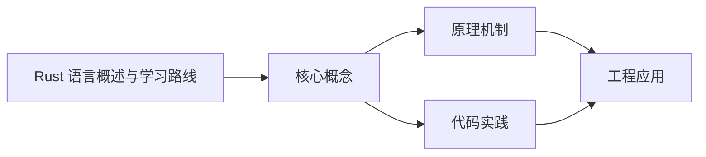
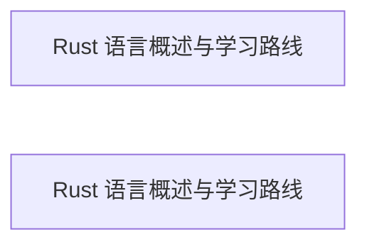

## 1. 学习目标（Bloom 分类）

本节按照布鲁姆教育目标分类学组织学习路径。本文主题为《Rust 语言概述与学习路线》，属于 Rust 模块，读者可以根据自身阶段选择阅读深度。

记忆层面：能够准确复述本文的核心概念、术语与基本语法或操作步骤，并能够在提问或检索时快速定位对应知识点。能够说出 Rust 的核心概念、工具与工作流。

理解层面：能够用自己的语言解释核心原理与工作机制，说明概念之间的因果关系，而不是机械记忆结论。能够解释 Rust 的关键机制与设计取舍。

应用层面：能够在真实项目或练习场景中运用本文知识解决具体问题，写出正确且可维护的实现。能够独立完成 Rust 的标准开发任务。

分析层面：能够拆解复杂问题，比较本文主题与相邻概念的异同，识别边界条件与例外情况。能够分析 Rust 在真实项目中的问题与边界。

评价层面：能够根据约束条件（性能、可读性、安全、成本）评价不同方案的优劣，做出有依据的技术决策。能够评价 Rust 相关技术选型。

创造层面：能够把本文知识与其他模块知识组合，设计出新的解决方案或可复用的工程模式。能够把 Rust 集成进完整项目体系。

通过本节学习，读者应当能够把《Rust 语言概述与学习路线》纳入自己的知识网络，并与 Rust 模块的其他主题（所有权、借用、生命周期、Cargo）建立关联。

## 2. 历史动机与发展脉络

《Rust 语言概述与学习路线》是 Rust 领域的重要主题。要真正理解它，需要先了解它解决的问题与演进过程。

Rust 由 Graydon Hoare 于 2006 年在 Mozilla 开始研发，2010 年公开，2015 年 1.0 发布；设计目标是在系统编程中同时获得内存安全与高性能。
2016-2024 年 Rust 连续在 Stack Overflow 开发者调查中被评为“最受喜爱的语言”；2021 年 Rust Foundation 成立，Linux 内核与 Windows 内核开始接纳 Rust 组件。
核心特性：所有权（ownership）、借用（borrowing）、生命周期（lifetime）、零成本抽象、Cargo 构建系统与 crates.io 生态；2024 年起 edition 2024 持续演进。

回到本文主题：Rust 语言概述与学习路线 的提出与成熟，正是上述技术背景下的必然产物。早期实现往往以简单可用为目标，随着工程规模扩大，社区逐渐沉淀出标准做法与最佳实践；理解这一脉络，可以帮助读者判断“为什么文档中的推荐写法是现在这个样子”，也能在遇到历史遗留代码时准确识别其设计年代与取舍。


## 3. 形式化定义与核心概念精讲

本节把《Rust 语言概述与学习路线》涉及的核心概念以“定义 + 讲解”的形式展开。读者应把定义当作工具，把讲解当作理解路径；两者结合才能形成可迁移的知识。

所有权：每个值有唯一所有者；所有者离开作用域值被释放；转移（move）与复制（copy）决定赋值行为。
借用与引用：&T 不可变借用、&mut T 可变借用；同一时刻要么多个不可变借用，要么一个可变借用——编译期消除数据竞争。
生命周期：引用必须标注有效范围（多数可推断），保证引用不悬垂。

### 3.1 原文章节逐一精讲

原文档把主题拆分为 10 个小节，下面按顺序给出每一节的导读讲解，随后保留原文细节供精读。

#### 原文精读（完整保留）


#### 1. Rust 是什么

Rust 是一门系统级编程语言，由 Mozilla 资助开发，2015 年发布 1.0 版本。它的设计目标是在不牺牲性能的前提下提供内存安全：所有内存错误（空指针、悬垂引用、数据竞争、缓冲区溢出）都在编译期被拒绝，而不是等到运行时崩溃或被攻击者利用。

Rust 的 slogan 是“性能、可靠、生产力”（Performance, Reliability, Productivity）。它没有垃圾回收器（GC），也没有运行时开销，却通过所有权（ownership）系统在编译期管理内存。这使它成为 C/C++ 的有力竞争者，并被 Linux 内核、Windows、Cloudflare、Discord 等大型项目采用。

#### 2. 为什么需要 Rust

##### 2.1 C/C++ 的安全困境

C 语言自 1972 年以来一直是系统编程的主力，但内存安全漏洞（缓冲区溢出、use-after-free）占所有安全漏洞的相当比例。微软与 Google 的统计均显示，其产品中约 70% 的安全漏洞与内存安全相关。C++ 提供了 RAII 与智能指针，但默认仍然不安全：裸指针、手动 delete、迭代器失效仍然可以轻易触发未定义行为。

##### 2.2 托管语言的性能天花板

Java、Go、Python 等语言通过 GC 或运行时获得安全性与开发效率，但代价是内存占用与延迟不可控。对操作系统、数据库引擎、游戏引擎、嵌入式设备而言，GC 停顿与运行时体积不可接受。

Rust 的定位是填补空白：拥有 C 级别的性能，同时拥有比 Java 更强的编译期安全保障。

#### 3. 核心概念速览

##### 3.1 所有权（Ownership）

每个值在任意时刻只有一个所有者（owner）。当所有者离开作用域，值被自动释放（drop）。这替代了 GC 与手动 free。

```rust
fn main() {
    let s = String::from("hello"); // s 拥有字符串
    let t = s;                     // 所有权转移（move）到 t
    // println!("{s}");            // 错误：s 已失效
    println!("{t}");               // t 可以正常使用
}
```

讲解：`let t = s` 不发生深拷贝，而是把所有权从 s 转移给 t；此后 s 不可再使用。编译器在编译期强制执行这一规则，杜绝 double-free 与 use-after-free。

##### 3.2 借用（Borrowing）

不转移所有权，而是临时借用：`&T` 不可变借用（可多个），`&mut T` 可变借用（唯一）。

```rust
fn len(s: &String) -> usize {
    s.len() // 只读借用，不获取所有权
}

fn main() {
    let s = String::from("hello");
    println!("{}", len(&s)); // 借用后 s 仍可用
}
```

讲解：借用规则在编译期检查：同一数据不能同时存在可变借用与不可变借用。这一规则让 Rust 在编译期就消除了数据竞争。

##### 3.3 生命周期（Lifetime）

引用必须在其指向的值存活期间有效。多数情况下编译器能自动推断；复杂场景需要标注。

```rust
fn longest<'a>(x: &'a str, y: &'a str) -> &'a str {
    if x.len() > y.len() { x } else { y }
}
```

讲解：`<'a>` 声明生命周期参数，表示返回值引用与两个参数具有相同的有效范围。这保证返回的引用不会悬垂。

##### 3.4 模式匹配与枚举

Rust 的 `enum` 是代数数据类型（ADT），配合 `match` 表达穷尽性检查：

```rust
enum Result<T, E> {
    Ok(T),
    Err(E),
}

fn parse(s: &str) -> Result<i32, String> {
    s.parse::<i32>().map_err(|_| format!("无法解析: {s}"))
}

fn main() {
    match parse("42") {
        Ok(v) => println!("解析成功: {v}"),
        Err(e) => println!("解析失败: {e}"),
    }
}
```

讲解：`Result` 是标准库的错误处理枚举；`match` 必须覆盖所有分支，因此不会漏掉错误路径。

#### 4. Cargo 与工具链

Cargo 是 Rust 的构建系统与包管理器，功能类似 npm/Maven 的组合：

```bash
cargo new my-project     # 创建新项目
cargo build              # 构建（debug）
cargo build --release    # 优化构建
cargo run                # 运行
cargo test               # 运行测试
cargo fmt                # 格式化
cargo clippy             # 静态检查
cargo doc                # 生成文档
```

依赖在 `Cargo.toml` 中声明，从 crates.io 下载；`Cargo.lock` 锁定版本保证可复现构建。

```toml
[package]
name = "my-project"
version = "0.1.0"
edition = "2024"

[dependencies]
serde = { version = "1", features = ["derive"] }
tokio = { version = "1", features = ["full"] }
```

讲解：edition 是 Rust 的兼容性里程碑（2015/2018/2021/2024），新项目应使用最新 edition。

#### 5. 标准库与常用生态

标准库（std）提供：集合（Vec、HashMap）、字符串（String、&str）、错误处理（Result、Option）、并发（线程、channel、原子）、I/O 与文件系统。

常用第三方生态：

| 领域 | crate | 说明 |
| --- | --- | --- |
| Web 后端 | axum / actix-web | 异步 HTTP 框架 |
| 异步运行时 | tokio | 事件驱动运行时 |
| 序列化 | serde | JSON/二进制序列化 |
| 命令行 | clap | 参数解析 |
| 日志 | tracing / log | 结构化日志与追踪 |
| 测试 | criterion | 基准测试 |
| 嵌入式 | embedded-hal | 硬件抽象 |
| WebAssembly | wasm-bindgen | JS 互操作 |

#### 6. Rust 与其他语言的对比

##### 6.1 Rust 与 C

Rust 提供与 C 相当的性能，但默认内存安全；C 语法简单、生态庞大，适合嵌入式与遗留系统。新系统项目应评估 Rust。

##### 6.2 Rust 与 C++

C++ 功能最全、生态最成熟，但安全依赖纪律；Rust 用类型系统强制安全，工具链（cargo/clippy）更现代。游戏引擎与既有 C++ 代码库通常继续用 C++，新模块可用 Rust（FFI）。

##### 6.3 Rust 与 Go

Go 语法简单、并发模型友好、编译快；Rust 控制精细、无 GC、性能上限更高。服务端选型：追求开发速度与生态用 Go，追求极致性能与资源控制用 Rust。

#### 7. 学习路线建议

第一阶段（2-4 周）：所有权、借用、生命周期、基本类型与模式匹配；每天用 cargo 写小练习。

第二阶段（4-8 周）：错误处理、泛型与 trait、集合与迭代器、测试；读《Rust 程序设计语言》（TRPL）。

第三阶段（2-3 月）：异步（tokio）、Web 服务（axum）、serde 序列化、与 C 互操作；完成一个实战项目。

持续：读标准库源码、参与开源、用 clippy 保持代码质量。

#### 8. 常见误区与注意事项

误区一：把 Rust 当成“更难写的 C”。Rust 的难度来自安全约束，但编译器错误信息非常友好，跟随提示修改即可。

误区二：到处用 `clone()` 逃避借用检查。clone 有性能成本；先理解借用与生命周期，再决定是否 clone。

误区三：滥用 `unwrap()`。生产代码应使用 `Result` 与 `?` 传播错误。

误区四：忽视异步生态的选型。tokio 是事实标准，团队应统一。

#### 9. 参考资源

Rust 官方文档：https://www.rust-lang.org/zh-CN/learn

《Rust 程序设计语言》中文版：https://kaisery.github.io/trpl-zh-cn/

Rust 标准库文档：https://doc.rust-lang.org/std/

crates.io：https://crates.io/

Rust 异步编程：https://rust-lang.github.io/async-book/

黑马程序员 Bilibili 空间：https://space.bilibili.com/37974444

尚硅谷 Bilibili 空间：https://space.bilibili.com/302417610

#### 10. 小结

Rust 是系统编程领域近十年最重要的语言创新：所有权系统把内存安全从“运行时检查”提升到“编译期保证”。学习 Rust 不仅获得一门语言，更能加深对内存、并发与编译原理的理解——这些知识对所有语言都有迁移价值。


### 3.2 概念关系图

下面用 Mermaid 图表达本文核心概念之间的关系，帮助读者建立整体图景：



图中展示的是本文知识的结构化关系：核心概念是入口，原理机制解释“为什么”，代码实践演示“怎么做”，工程应用回答“何时用”。读者学习时可以把每个小节的内容挂接到对应节点上。

## 4. 理论推导与原理解析

本节深入《Rust 语言概述与学习路线》背后的原理。理论部分不求面面俱到，而是聚焦“能解释现象、能指导实践”的关键推导。

所有权：每个值有唯一所有者；所有者离开作用域值被释放；转移（move）与复制（copy）决定赋值行为。
借用与引用：&T 不可变借用、&mut T 可变借用；同一时刻要么多个不可变借用，要么一个可变借用——编译期消除数据竞争。
生命周期：引用必须标注有效范围（多数可推断），保证引用不悬垂。
Cargo：包管理、构建、测试、文档一体化；crates.io 提供丰富生态。

需要强调的是，理论推导与工程实践之间存在翻译层：理论给出的是理想化模型与边界条件，工程代码则必须处理真实环境中的例外。读者在学习时应先掌握理论的“标准情形”，再通过陷阱章节了解“非标准情形”。

## 5. 代码示例与逐行讲解

本节把原文中的代码示例系统整理，并为每个示例补充用途说明与讲解。读者不应只浏览代码，而应逐段对照讲解理解设计意图。

### 5.1 示例：3.1 所有权（Ownership）

该示例来自原文《3.1 所有权（Ownership）》小节，用于演示Rust 语言概述与学习路线相关操作。阅读时请先看代码结构，再看其后的讲解。

```rust
fn main() {
    let s = String::from("hello"); // s 拥有字符串
    let t = s;                     // 所有权转移（move）到 t
    // println!("{s}");            // 错误：s 已失效
    println!("{t}");               // t 可以正常使用
}
```

讲解：这段代码演示了本节核心知识点。代码中的关键操作可以归纳为三步：准备（定义或初始化）、执行（核心逻辑）、收尾（释放资源或返回结果）。实际项目中，这三步往往被封装为函数或类，以提升复用性与可测试性。

关键点分析：

该示例共 6 行有效代码，结构以数据或配置为主。阅读时应关注：数据字段的含义、配置项的作用，以及它们与运行行为的对应关系。

进阶思考路径：先尝试修改参数观察行为变化，再把示例中的模式迁移到自己的项目中；每次修改都记录预期与实测差异，这是把示例转化为能力的最快方式。

### 5.2 示例：3.2 借用（Borrowing）

该示例来自原文《3.2 借用（Borrowing）》小节，用于演示Rust 语言概述与学习路线相关操作。阅读时请先看代码结构，再看其后的讲解。

```rust
fn len(s: &String) -> usize {
    s.len() // 只读借用，不获取所有权
}

fn main() {
    let s = String::from("hello");
    println!("{}", len(&s)); // 借用后 s 仍可用
}
```

讲解：这段代码演示了本节核心知识点。代码中的关键操作可以归纳为三步：准备（定义或初始化）、执行（核心逻辑）、收尾（释放资源或返回结果）。实际项目中，这三步往往被封装为函数或类，以提升复用性与可测试性。

关键点分析：

该示例共 7 行有效代码，结构以数据或配置为主。阅读时应关注：数据字段的含义、配置项的作用，以及它们与运行行为的对应关系。

进阶思考路径：先尝试修改参数观察行为变化，再把示例中的模式迁移到自己的项目中；每次修改都记录预期与实测差异，这是把示例转化为能力的最快方式。

### 5.3 示例：3.3 生命周期（Lifetime）

该示例来自原文《3.3 生命周期（Lifetime）》小节，用于演示Rust 语言概述与学习路线相关操作。阅读时请先看代码结构，再看其后的讲解。

```rust
fn longest<'a>(x: &'a str, y: &'a str) -> &'a str {
    if x.len() > y.len() { x } else { y }
}
```

讲解：这段代码演示了本节核心知识点。代码中的关键操作可以归纳为三步：准备（定义或初始化）、执行（核心逻辑）、收尾（释放资源或返回结果）。实际项目中，这三步往往被封装为函数或类，以提升复用性与可测试性。

关键点分析：

该示例共 3 行有效代码，包含 1 类关键结构（if）。其中：

- 入口与初始化部分负责建立上下文，对应实际项目中的启动或装配逻辑；
- 核心逻辑部分体现本文主题的主要操作，是阅读时最需要对照讲解理解的部分；
- 输出或返回部分把结果交给调用方，注意其类型与边界条件。

进阶思考路径：先尝试修改参数观察行为变化，再把示例中的模式迁移到自己的项目中；每次修改都记录预期与实测差异，这是把示例转化为能力的最快方式。

### 5.4 示例：3.4 模式匹配与枚举

该示例来自原文《3.4 模式匹配与枚举》小节，用于演示Rust 语言概述与学习路线相关操作。阅读时请先看代码结构，再看其后的讲解。

```rust
enum Result<T, E> {
    Ok(T),
    Err(E),
}

fn parse(s: &str) -> Result<i32, String> {
    s.parse::<i32>().map_err(|_| format!("无法解析: {s}"))
}

fn main() {
    match parse("42") {
        Ok(v) => println!("解析成功: {v}"),
        Err(e) => println!("解析失败: {e}"),
    }
}
```

讲解：这段代码演示了本节核心知识点。代码中的关键操作可以归纳为三步：准备（定义或初始化）、执行（核心逻辑）、收尾（释放资源或返回结果）。实际项目中，这三步往往被封装为函数或类，以提升复用性与可测试性。

关键点分析：

该示例共 13 行有效代码，结构以数据或配置为主。阅读时应关注：数据字段的含义、配置项的作用，以及它们与运行行为的对应关系。

进阶思考路径：先尝试修改参数观察行为变化，再把示例中的模式迁移到自己的项目中；每次修改都记录预期与实测差异，这是把示例转化为能力的最快方式。

### 5.5 示例：4. Cargo 与工具链

该示例来自原文《4. Cargo 与工具链》小节，用于演示Rust 语言概述与学习路线相关操作。阅读时请先看代码结构，再看其后的讲解。

```bash
cargo new my-project     # 创建新项目
cargo build              # 构建（debug）
cargo build --release    # 优化构建
cargo run                # 运行
cargo test               # 运行测试
cargo fmt                # 格式化
cargo clippy             # 静态检查
cargo doc                # 生成文档
```

讲解：这段代码演示了本节核心知识点。代码中的关键操作可以归纳为三步：准备（定义或初始化）、执行（核心逻辑）、收尾（释放资源或返回结果）。实际项目中，这三步往往被封装为函数或类，以提升复用性与可测试性。

关键点分析：

该示例共 8 行有效代码，结构以数据或配置为主。阅读时应关注：数据字段的含义、配置项的作用，以及它们与运行行为的对应关系。

进阶思考路径：先尝试修改参数观察行为变化，再把示例中的模式迁移到自己的项目中；每次修改都记录预期与实测差异，这是把示例转化为能力的最快方式。

### 5.6 示例：4. Cargo 与工具链

该示例来自原文《4. Cargo 与工具链》小节，用于演示Rust 语言概述与学习路线相关操作。阅读时请先看代码结构，再看其后的讲解。

```toml
[package]
name = "my-project"
version = "0.1.0"
edition = "2024"

[dependencies]
serde = { version = "1", features = ["derive"] }
tokio = { version = "1", features = ["full"] }
```

讲解：这段代码演示了本节核心知识点。代码中的关键操作可以归纳为三步：准备（定义或初始化）、执行（核心逻辑）、收尾（释放资源或返回结果）。实际项目中，这三步往往被封装为函数或类，以提升复用性与可测试性。

关键点分析：

该示例共 7 行有效代码，结构以数据或配置为主。阅读时应关注：数据字段的含义、配置项的作用，以及它们与运行行为的对应关系。

进阶思考路径：先尝试修改参数观察行为变化，再把示例中的模式迁移到自己的项目中；每次修改都记录预期与实测差异，这是把示例转化为能力的最快方式。


综合以上示例，可以总结出本主题的代码实践要点：第一，先定义清晰的输入输出契约；第二，核心逻辑保持单一职责；第三，错误处理与边界条件不可省略；第四，命名与注释表达意图而非复述代码。

## 6. 对比分析

对比是理解《Rust 语言概述与学习路线》定位的最快路径。下面从多个维度与相邻方案进行对比。

Rust 与 C/C++：Rust 编译期内存安全、工具链现代；C++ 生态成熟灵活。新系统项目考虑 Rust。
Rust 与 Go：Go 简单并发强，Rust 精细控制与零成本抽象；服务端两者皆可。
2015 edition 与 2024 edition：edition 是兼容性里程碑，新项目用最新 edition。

对比的目的不是分出绝对优劣，而是建立选择依据：不同约束条件下，最优解不同。读者应把每个对比维度转化为决策检查清单。

## 7. 常见陷阱与最佳实践

本节整理该主题的高频错误与推荐做法。每个陷阱先描述现象，再解释原因，最后给出最佳实践。

### 7.1 借用冲突

同时持有可变与不可变借用。重构数据流或使用内部可变性（RefCell）。

深入讲解：该问题之所以被归类为“常见陷阱”，是因为它在初学者的代码中反复出现，而且往往不在第一时间暴露——错误通常隐藏在特定数据或特定时序下。

从成因上看，借用冲突 一般源于对 Rust 某个机制的理解偏差：要么误用了默认行为，要么忽略了边界条件，要么把其他语言的思维惯性带了过来。

从影响上看，借用冲突 轻则产生错误结果，重则导致资源泄漏、数据损坏或安全事故；这也是为什么工程评审中会把它列为检查项。

从修复策略上看，处理借用冲突的正确顺序是：先复现（构造最小用例），再定位（确认机制层面的根因），最后修复并补充回归测试。跳过复现直接改代码，往往治标不治本。

### 7.2 生命周期标注恐慌

多数可省略；复杂结构需显式标注，先理解“谁拥有谁”。

深入讲解：该问题之所以被归类为“常见陷阱”，是因为它在初学者的代码中反复出现，而且往往不在第一时间暴露——错误通常隐藏在特定数据或特定时序下。

从成因上看，生命周期标注恐慌 一般源于对 Rust 某个机制的理解偏差：要么误用了默认行为，要么忽略了边界条件，要么把其他语言的思维惯性带了过来。

从影响上看，生命周期标注恐慌 轻则产生错误结果，重则导致资源泄漏、数据损坏或安全事故；这也是为什么工程评审中会把它列为检查项。

从修复策略上看，处理生命周期标注恐慌的正确顺序是：先复现（构造最小用例），再定位（确认机制层面的根因），最后修复并补充回归测试。跳过复现直接改代码，往往治标不治本。

### 7.3 unwrap 滥用

生产代码 unwrap 导致 panic。使用 Result 与错误传播（? 运算符）。

深入讲解：该问题之所以被归类为“常见陷阱”，是因为它在初学者的代码中反复出现，而且往往不在第一时间暴露——错误通常隐藏在特定数据或特定时序下。

从成因上看，unwrap 滥用 一般源于对 Rust 某个机制的理解偏差：要么误用了默认行为，要么忽略了边界条件，要么把其他语言的思维惯性带了过来。

从影响上看，unwrap 滥用 轻则产生错误结果，重则导致资源泄漏、数据损坏或安全事故；这也是为什么工程评审中会把它列为检查项。

从修复策略上看，处理unwrap 滥用的正确顺序是：先复现（构造最小用例），再定位（确认机制层面的根因），最后修复并补充回归测试。跳过复现直接改代码，往往治标不治本。

### 7.4 String 与 &str 混淆

String 拥有缓冲区，&str 是切片；函数参数优先 &str。

深入讲解：该问题之所以被归类为“常见陷阱”，是因为它在初学者的代码中反复出现，而且往往不在第一时间暴露——错误通常隐藏在特定数据或特定时序下。

从成因上看，String 与 &str 混淆 一般源于对 Rust 某个机制的理解偏差：要么误用了默认行为，要么忽略了边界条件，要么把其他语言的思维惯性带了过来。

从影响上看，String 与 &str 混淆 轻则产生错误结果，重则导致资源泄漏、数据损坏或安全事故；这也是为什么工程评审中会把它列为检查项。

从修复策略上看，处理String 与 &str 混淆的正确顺序是：先复现（构造最小用例），再定位（确认机制层面的根因），最后修复并补充回归测试。跳过复现直接改代码，往往治标不治本。

### 7.5 循环引用泄漏

Rc 循环引用导致内存泄漏。使用 Weak。

深入讲解：该问题之所以被归类为“常见陷阱”，是因为它在初学者的代码中反复出现，而且往往不在第一时间暴露——错误通常隐藏在特定数据或特定时序下。

从成因上看，循环引用泄漏 一般源于对 Rust 某个机制的理解偏差：要么误用了默认行为，要么忽略了边界条件，要么把其他语言的思维惯性带了过来。

从影响上看，循环引用泄漏 轻则产生错误结果，重则导致资源泄漏、数据损坏或安全事故；这也是为什么工程评审中会把它列为检查项。

从修复策略上看，处理循环引用泄漏的正确顺序是：先复现（构造最小用例），再定位（确认机制层面的根因），最后修复并补充回归测试。跳过复现直接改代码，往往治标不治本。

### 7.6 unsafe 误用

unsafe 绕过检查需要严格论证。优先安全抽象。

深入讲解：该问题之所以被归类为“常见陷阱”，是因为它在初学者的代码中反复出现，而且往往不在第一时间暴露——错误通常隐藏在特定数据或特定时序下。

从成因上看，unsafe 误用 一般源于对 Rust 某个机制的理解偏差：要么误用了默认行为，要么忽略了边界条件，要么把其他语言的思维惯性带了过来。

从影响上看，unsafe 误用 轻则产生错误结果，重则导致资源泄漏、数据损坏或安全事故；这也是为什么工程评审中会把它列为检查项。

从修复策略上看，处理unsafe 误用的正确顺序是：先复现（构造最小用例），再定位（确认机制层面的根因），最后修复并补充回归测试。跳过复现直接改代码，往往治标不治本。

### 7.7 异步生态碎片

tokio/async-std 选择需统一。按团队选一个生态。

深入讲解：该问题之所以被归类为“常见陷阱”，是因为它在初学者的代码中反复出现，而且往往不在第一时间暴露——错误通常隐藏在特定数据或特定时序下。

从成因上看，异步生态碎片 一般源于对 Rust 某个机制的理解偏差：要么误用了默认行为，要么忽略了边界条件，要么把其他语言的思维惯性带了过来。

从影响上看，异步生态碎片 轻则产生错误结果，重则导致资源泄漏、数据损坏或安全事故；这也是为什么工程评审中会把它列为检查项。

从修复策略上看，处理异步生态碎片的正确顺序是：先复现（构造最小用例），再定位（确认机制层面的根因），最后修复并补充回归测试。跳过复现直接改代码，往往治标不治本。

### 7.8 编译时间

泛型与依赖导致编译慢。合理拆分 crate 与增量编译。

深入讲解：该问题之所以被归类为“常见陷阱”，是因为它在初学者的代码中反复出现，而且往往不在第一时间暴露——错误通常隐藏在特定数据或特定时序下。

从成因上看，编译时间 一般源于对 Rust 某个机制的理解偏差：要么误用了默认行为，要么忽略了边界条件，要么把其他语言的思维惯性带了过来。

从影响上看，编译时间 轻则产生错误结果，重则导致资源泄漏、数据损坏或安全事故；这也是为什么工程评审中会把它列为检查项。

从修复策略上看，处理编译时间的正确顺序是：先复现（构造最小用例），再定位（确认机制层面的根因），最后修复并补充回归测试。跳过复现直接改代码，往往治标不治本。

### 7.0 最佳实践总览

1. 默认不可变：变量与绑定优先 let 而非 let mut。
2. 错误处理：Result + ? 传播，自定义错误类型实现 From。
3. 测试：单元测试与集成测试目录分离，cargo test 全量运行。
4. 文档：rustdoc 文档注释（///）与 doctest 结合。

把这些最佳实践固化为团队规范与代码评审检查项，是避免同类问题反复出现的关键。

## 8. 工程实践

本节把《Rust 语言概述与学习路线》放入真实工程场景，给出可复用的模式与组织方法。

项目结构：src/lib.rs（库）、src/main.rs（二进制）、tests/（集成测试）；workspace 管理多 crate。
性能：零成本抽象、无 GC；profile.release 优化；benchmark 用 criterion。
生态：Web 后端（Axum/Actix）、CLI（clap）、嵌入式、Wasm。

### 8.1 工程实践的原则拆解

以上工程实践可以归纳为四条原则。第一，配置与代码分离：Rust 项目中环境差异应通过配置注入，而不是散落在代码分支中；这保证同一份代码可以在开发、测试、生产环境一致运行。

第二，接口稳定优先：对外接口（函数签名、协议、数据格式）一旦被消费方依赖，变更成本极高；设计时应预留扩展点并保持向后兼容。

第三，可观测性内置：日志、指标与追踪应该在功能开发时同步设计，而不是故障发生后补救；没有观测手段的模块等于黑盒。

第四，变更可回滚：任何发布都应有对应的回滚方案；数据库迁移、配置变更与代码发布一样需要版本管理与逆向路径。

### 8.2 实践落地的检查清单

- [ ] 项目结构：对照本节描述，检查当前项目是否已经落实；未落实的项列入技术债并排期处理。
- [ ] 性能：对照本节描述，检查当前项目是否已经落实；未落实的项列入技术债并排期处理。
- [ ] 生态：对照本节描述，检查当前项目是否已经落实；未落实的项列入技术债并排期处理。

工程实践的共性原则：配置与代码分离、接口稳定优先、可观测性内置、变更可回滚。这些原则适用于本主题的所有实现。

## 9. 案例研究

本节通过一个完整案例把《Rust 语言概述与学习路线》的知识串起来。案例按“需求分析、方案设计、实现、验证”四步展开。

需求：实现并发安全的计数器与 Web 服务。
方案：Arc<Mutex<T>> 或原子类型 + Axum 路由。
要点：所有权设计先行；错误类型统一；测试覆盖并发。
验证：cargo test、clippy 零告警、基准测试。

### 9.1 案例的扩展讨论

把案例中的方案放大到真实规模，需要额外考虑三个问题：

第一，规模：当数据量或并发量上升一个数量级时，原方案中的数据结构、缓存策略与任务调度是否仍然成立？通常需要引入分层与异步。

第二，团队：多人协作时，模块边界、接口契约与代码所有权必须明确；案例中的实现应拆分为可独立测试的单元，并配合文档说明设计意图。

第三，演进：上线后的需求变化不可避免；方案设计时应预留扩展点（配置化、插件化、事件化），并定期用真实指标验证假设。


案例研究的学习方法：先独立阅读需求，尝试在脑中形成方案，再对照实现与讲解，最后思考“如果约束变化（数据量、并发、团队规模），方案应如何调整”。

## 10. 知识要点总结与深入讲解

本节以讲解形式汇总全文要点，替代传统的习题与自测，读者不需要答题，只需跟随解释建立完整的认知框架。

关于《Rust 语言概述与学习路线》的核心结论：

Rust 的价值是“编译期安全”：所有权系统消灭整类内存错误。
学习曲线陡峭但回报高，适合系统编程与性能敏感服务。
工程基线：cargo fmt、clippy、测试与文档。

原文档各小节的要点回顾：

- 1. Rust 是什么：该小节围绕Rust 语言概述与学习路线展开具体细节，阅读时应关注其与核心结论的对应关系；每个小节都是核心结论在某一个侧面的展开。
- 2. 为什么需要 Rust：该小节围绕Rust 语言概述与学习路线展开具体细节，阅读时应关注其与核心结论的对应关系；每个小节都是核心结论在某一个侧面的展开。
- 3. 核心概念速览：该小节围绕Rust 语言概述与学习路线展开具体细节，阅读时应关注其与核心结论的对应关系；每个小节都是核心结论在某一个侧面的展开。
- 4. Cargo 与工具链：该小节围绕Rust 语言概述与学习路线展开具体细节，阅读时应关注其与核心结论的对应关系；每个小节都是核心结论在某一个侧面的展开。
- 5. 标准库与常用生态：该小节围绕Rust 语言概述与学习路线展开具体细节，阅读时应关注其与核心结论的对应关系；每个小节都是核心结论在某一个侧面的展开。
- 6. Rust 与其他语言的对比：该小节围绕Rust 语言概述与学习路线展开具体细节，阅读时应关注其与核心结论的对应关系；每个小节都是核心结论在某一个侧面的展开。
- 7. 学习路线建议：该小节围绕Rust 语言概述与学习路线展开具体细节，阅读时应关注其与核心结论的对应关系；每个小节都是核心结论在某一个侧面的展开。
- 8. 常见误区与注意事项：该小节围绕Rust 语言概述与学习路线展开具体细节，阅读时应关注其与核心结论的对应关系；每个小节都是核心结论在某一个侧面的展开。
- 9. 参考资源：该小节围绕Rust 语言概述与学习路线展开具体细节，阅读时应关注其与核心结论的对应关系；每个小节都是核心结论在某一个侧面的展开。
- 10. 小结：该小节围绕Rust 语言概述与学习路线展开具体细节，阅读时应关注其与核心结论的对应关系；每个小节都是核心结论在某一个侧面的展开。

把以上要点与第 3-9 节的内容对照复习，即可完成对本文主题的闭环学习。

## 11. 参考文献


Rust 官方文档：https://www.rust-lang.org/zh-CN/learn
Rust 程序设计语言（中文书）：https://kaisery.github.io/trpl-zh-cn/
Rust 标准库文档：https://doc.rust-lang.org/std/
crates.io：https://crates.io/
Rust 异步编程：https://rust-lang.github.io/async-book/

## 12. 延伸阅读


Rust 与 C 对比（内存安全），见 025-c 模块。
Rust 与 C++ 对比，见 026-cpp 模块。
系统编程与嵌入式，见 035-iot 模块。
黑马程序员 Bilibili 空间（https://space.bilibili.com/37974444 ）提供 Rust 课程。

## 14. 模块知识图谱与学习路径

本文属于 Rust 模块。为了把《Rust 语言概述与学习路线》放入完整的知识网络，下面列出本模块的全部主题并给出相互关联的导读。学习时建议按模块内顺序推进，并在每个文档中留意交叉引用。



上图为模块主题的推荐学习顺序示意图（仅展示前若干主题）。各主题之间存在三类关联：

第一，前置依赖关系：早期主题是后期主题的基础，例如环境与语法先行、进阶主题随后；

第二，横向并列关系：同一层级主题从不同角度覆盖模块能力，学习顺序可以按兴趣调整；

第三，工程组合关系：多个主题在真实项目中组合使用，例如配置、性能与安全主题往往出现在同一系统的不同层面。

### 14.1 模块主题速查表

| 文档 | 主题 | 与本文的关联 |
| --- | --- | --- |
| Rust 语言概述与学习路线 | 001-RustOverview | 本文自身 |

速查表的作用是让读者快速判断：哪些文档应在阅读本文前掌握（前置基础），哪些文档应在阅读本文后继续（延伸主题）。本模块的交叉引用体系即以此表为基础。

## 15. 术语表

下表整理《Rust 语言概述与学习路线》及 Rust 模块中出现的高频术语，给出简明释义。术语按字母序或逻辑序排列，供查阅。

| 术语 | 释义 |
| --- | --- |
| 所有权 | 每个值有唯一所有者；所有者离开作用域值被释放；转移（move）与复制（copy）决定赋值行为。 |
| 借用与引用 | &T 不可变借用、&mut T 可变借用；同一时刻要么多个不可变借用，要么一个可变借用——编译期消除数据竞争。 |
| 生命周期 | 引用必须标注有效范围（多数可推断），保证引用不悬垂。 |
| Cargo | 包管理、构建、测试、文档一体化；crates.io 提供丰富生态。 |
| 借用冲突（易错点） | 参见常见陷阱章节的详细讲解 |
| 生命周期标注恐慌（易错点） | 参见常见陷阱章节的详细讲解 |
| unwrap 滥用（易错点） | 参见常见陷阱章节的详细讲解 |
| String 与 &str 混淆（易错点） | 参见常见陷阱章节的详细讲解 |
| 循环引用泄漏（易错点） | 参见常见陷阱章节的详细讲解 |
| unsafe 误用（易错点） | 参见常见陷阱章节的详细讲解 |

术语表与正文配合使用：先通读正文，遇到模糊术语回查本表；长期使用后术语会自然进入工作记忆。

## 13. 深度专题扩展

以下专题从不同角度深入本文主题，供有进阶需求的读者研读。每个专题独立成节，内容相互补充。

### 13.1 所有权与借用检查器

移动语义：赋值与传参转移所有权；Copy 类型（整数、布尔）按位复制不移动。
借用规则：不可变借用可并行；可变借用独占；借用不可超过所有者生命周期。
内部可变性：RefCell 运行时检查借用；Mutex 跨线程；原子类型无锁。
排错：按编译器错误逐条修复，理解“借用冲突”的三个要素（值、借用类型、作用域）。

### 13.2 异步 Rust 与 Tokio

async/await 基于 Future 与执行器；tokio 提供多线程运行时与任务调度。
异步陷阱：阻塞调用卡死执行器（用 spawn_blocking）；锁跨 await（用 tokio::sync）。
Select 与流（Stream）组合并发任务；超时用 tokio::time::timeout。
性能：任务数而非线程数；背压与缓冲设计。

## 16. 核心概念串讲（复习视角）

本节以“把知识讲给他人听”的方式，把《Rust 语言概述与学习路线》的核心概念重新串讲一遍。与前文按章节展开不同，这里的叙述更接近课堂总结：先说整体，再逐个展开，最后收束。

《Rust 语言概述与学习路线》属于 Rust 模块。要理解它，先要理解它在模块中的位置：它解决的是该领域的一个具体问题，并依赖模块内若干前置概念；反过来，它又为后续进阶主题提供基础。

第一个概念是所有权。每个值有唯一所有者；所有者离开作用域值被释放；转移（move）与复制（copy）决定赋值行为。

在实际使用中，所有权需要与相邻概念区分：它们的区别不在于名称，而在于适用条件与行为边界；这正是前文对比分析章节的意义。

第一个概念是借用与引用。&T 不可变借用、&mut T 可变借用；同一时刻要么多个不可变借用，要么一个可变借用——编译期消除数据竞争。

在实际使用中，借用与引用需要与相邻概念区分：它们的区别不在于名称，而在于适用条件与行为边界；这正是前文对比分析章节的意义。

第一个概念是生命周期。引用必须标注有效范围（多数可推断），保证引用不悬垂。

在实际使用中，生命周期需要与相邻概念区分：它们的区别不在于名称，而在于适用条件与行为边界；这正是前文对比分析章节的意义。

接下来是所有权。每个值有唯一所有者；所有者离开作用域值被释放；转移（move）与复制（copy）决定赋值行为。

理解该原理的关键不是记住结论，而是记住“它从什么假设出发、推出了什么、假设不成立时会怎样”。带着这个框架复习，原理之间就会连成网络。

接下来是借用与引用。&T 不可变借用、&mut T 可变借用；同一时刻要么多个不可变借用，要么一个可变借用——编译期消除数据竞争。

理解该原理的关键不是记住结论，而是记住“它从什么假设出发、推出了什么、假设不成立时会怎样”。带着这个框架复习，原理之间就会连成网络。

接下来是生命周期。引用必须标注有效范围（多数可推断），保证引用不悬垂。

理解该原理的关键不是记住结论，而是记住“它从什么假设出发、推出了什么、假设不成立时会怎样”。带着这个框架复习，原理之间就会连成网络。

接下来是Cargo。包管理、构建、测试、文档一体化；crates.io 提供丰富生态。

理解该原理的关键不是记住结论，而是记住“它从什么假设出发、推出了什么、假设不成立时会怎样”。带着这个框架复习，原理之间就会连成网络。

串讲收束：把概念与原理放回本文主题，可以得出一个总纲——定义描述是什么，原理解释为什么，实践回答怎么做。三者构成完整的学习闭环；后续遇到相关问题，都可以按这个总纲检索知识。
