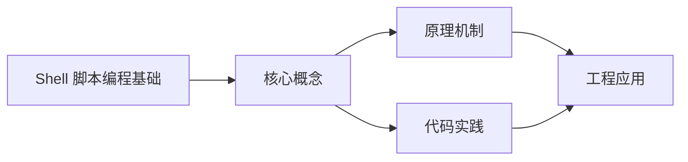
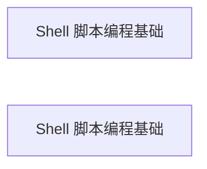

## 1. 学习目标（Bloom 分类）

本节按照布鲁姆教育目标分类学组织学习路径。本文主题为《Shell 脚本编程基础》，属于 Shell 模块，读者可以根据自身阶段选择阅读深度。

记忆层面：能够准确复述本文的核心概念、术语与基本语法或操作步骤，并能够在提问或检索时快速定位对应知识点。能够说出 Shell 的核心概念、工具与工作流。

理解层面：能够用自己的语言解释核心原理与工作机制，说明概念之间的因果关系，而不是机械记忆结论。能够解释 Shell 的关键机制与设计取舍。

应用层面：能够在真实项目或练习场景中运用本文知识解决具体问题，写出正确且可维护的实现。能够独立完成 Shell 的标准开发任务。

分析层面：能够拆解复杂问题，比较本文主题与相邻概念的异同，识别边界条件与例外情况。能够分析 Shell 在真实项目中的问题与边界。

评价层面：能够根据约束条件（性能、可读性、安全、成本）评价不同方案的优劣，做出有依据的技术决策。能够评价 Shell 相关技术选型。

创造层面：能够把本文知识与其他模块知识组合，设计出新的解决方案或可复用的工程模式。能够把 Shell 集成进完整项目体系。

通过本节学习，读者应当能够把《Shell 脚本编程基础》纳入自己的知识网络，并与 Shell 模块的其他主题（命令、脚本、管道、进程控制）建立关联。

## 2. 历史动机与发展脉络

《Shell 脚本编程基础》是 Shell 领域的重要主题。要真正理解它，需要先了解它解决的问题与演进过程。

Unix Shell 诞生于 1970 年代（Thompson shell、Bourne shell），是系统管理与自动化的核心接口；POSIX 规范统一语法。
现代 Shell 家族：bash（默认）、zsh（交互增强）、fish（友好）、PowerShell（Windows）；Linux 服务器脚本以 bash 为主。
应用：文件处理、日志分析、部署脚本、CI 步骤、系统监控；是 DevOps 与后端开发的基本功。

回到本文主题：Shell 脚本编程基础 的提出与成熟，正是上述技术背景下的必然产物。早期实现往往以简单可用为目标，随着工程规模扩大，社区逐渐沉淀出标准做法与最佳实践；理解这一脉络，可以帮助读者判断“为什么文档中的推荐写法是现在这个样子”，也能在遇到历史遗留代码时准确识别其设计年代与取舍。


## 3. 形式化定义与核心概念精讲

本节把《Shell 脚本编程基础》涉及的核心概念以“定义 + 讲解”的形式展开。读者应把定义当作工具，把讲解当作理解路径；两者结合才能形成可迁移的知识。

命令与参数：命令 + 选项 + 参数；环境变量与 PATH；exit code 表达成败。
管道与重定向：| 连接命令流，> / >> / < 重定向；2>&1 合并错误流。
脚本结构：#!/bin/bash shebang、变量、条件（if/test/[[ ]]）、循环（for/while）、函数。

### 3.1 原文章节逐一精讲

原文档把主题拆分为 9 个小节，下面按顺序给出每一节的导读讲解，随后保留原文细节供精读。

#### 原文精读（完整保留）


#### 1. Shell 是什么

Shell 是操作系统提供的命令解释器：读取用户输入的命令，调用系统程序，并把结果返回给用户。它既是交互式工具，也是脚本语言。Linux/macOS 默认是 bash（或 zsh），Windows 的 PowerShell 是另一套体系，但 Git Bash/WSL 可以运行 bash 脚本。

Shell 脚本的价值在于“胶水”：把已有的小工具（ls、grep、awk、curl）串成自动化流程，用于构建、部署、监控、数据处理。

#### 2. 基本命令与语法

##### 2.1 命令结构

```bash
命令名 [选项] [参数]
```

示例：

```bash
ls -la /home/user        # 列出目录详细信息
grep -rn "TODO" ./src    # 递归搜索文本
curl -s https://example.com  # 请求网页
```

每条命令执行后返回退出码（exit code）：0 表示成功，非 0 表示失败。`$?` 保存上一条命令的退出码。

##### 2.2 变量

```bash
#!/bin/bash
# 变量赋值：等号两侧不能有空格
name="FANDEX"
count=42

# 使用变量：$name 或 ${name}
echo "项目名称: $name"
echo "计数: ${count}"

# 命令替换：把命令输出存入变量
files=$(ls | wc -l)
echo "文件数: $files"
```

讲解：双引号内 `$var` 会展开，单引号内不会；`$(...)` 是命令替换的现代写法（反引号已过时）。

##### 2.3 管道与重定向

```bash
# 管道：把前一个命令的输出作为后一个命令的输入
cat access.log | grep "ERROR" | sort | uniq -c | sort -rn

# 重定向：写入文件 / 追加 / 从文件读
echo "hello" > out.txt
echo "world" >> out.txt
wc -l < out.txt

# 错误流合并
command > all.log 2>&1
```

讲解：管道是 Shell 最强大的能力：无需中间文件，数据在进程间流动。`2>&1` 把标准错误合并到标准输出，便于统一记录日志。

#### 3. 控制流

##### 3.1 条件判断

```bash
#!/bin/bash
file="config.yaml"

if [ -f "$file" ]; then
    echo "文件存在"
elif [ -d "$file" ]; then
    echo "是目录"
else
    echo "不存在"
fi

# test 命令的常用表达式
# -f 文件存在且是普通文件；-d 目录；-z 字符串为空；-n 非空
# -eq 数字相等；-lt 小于；-gt 大于
# && 与；|| 或
```

讲解：`[ ... ]` 是 `test` 命令的语法糖，`[[ ... ]]` 是 bash 扩展（支持正则与更安全比较）。变量必须加引号防止空值导致语法错误。

##### 3.2 循环

```bash
#!/bin/bash
# for 循环
for file in *.log; do
    echo "处理 $file"
done

# 数字循环
for i in $(seq 1 5); do
    echo "第 $i 次"
done

# while 循环：读取文件每一行
while IFS= read -r line; do
    echo "$line"
done < data.txt
```

讲解：`IFS=` 防止行首尾空白被吃掉，`-r` 防止反斜杠转义——这是读取文件行的标准姿势。

##### 3.3 函数

```bash
#!/bin/bash

# 函数定义
log() {
    local level="$1"
    shift
    echo "[$level] $*"
}

# 调用
log INFO "构建开始"
log ERROR "构建失败"
```

讲解：`$1`、`$2` 是位置参数，`$*` 是所有参数；`local` 声明局部变量，避免污染全局。

#### 4. 严格模式与错误处理

生产脚本必须在开头启用严格模式：

```bash
#!/bin/bash
set -euo pipefail
```

三者的含义：

`set -e`：任何命令失败立即退出脚本，避免“失败后继续执行”的连锁错误；

`set -u`：使用未定义变量即报错，捕获拼写错误；

`set -o pipefail`：管道中任意命令失败，整体视为失败（默认只看最后一个命令）。

配合 `trap` 实现清理：

```bash
#!/bin/bash
set -euo pipefail

cleanup() {
    echo "清理临时文件..."
    rm -f /tmp/tmp.$$
}
trap cleanup EXIT
```

讲解：`trap ... EXIT` 保证脚本无论正常结束还是出错退出都会执行清理函数。

#### 5. 常用文本处理

##### 5.1 grep：行匹配

```bash
grep -i "error" log.txt        # 忽略大小写
grep -v "^#" config.conf       # 排除注释行
grep -E "err|warn" log.txt     # 扩展正则，匹配多个词
```

##### 5.2 sed：流编辑

```bash
sed -i 's/old/new/g' file.txt   # 全局替换并写回
sed -n '10,20p' file.txt        # 打印第 10-20 行
```

##### 5.3 awk：列处理与统计

```bash
# 打印第 1 列和第 3 列
awk '{print $1, $3}' data.txt

# 统计行数
awk 'END {print NR}' file.txt

# 按第 2 列求和
awk '{sum += $2} END {print sum}' data.txt
```

#### 6. 工程实践

##### 6.1 部署脚本模板

```bash
#!/bin/bash
set -euo pipefail

APP_DIR="/opt/myapp"
VERSION="${1:?请提供版本号}"

echo "开始部署 v${VERSION}"

# 1. 拉取代码
git -C "$APP_DIR" fetch --tags
git -C "$APP_DIR" checkout "v${VERSION}"

# 2. 构建
(cd "$APP_DIR" && pnpm install --frozen-lockfile && pnpm build)

# 3. 重启服务（systemd 示例）
systemctl restart myapp
systemctl --no-pager status myapp

echo "部署完成"
```

讲解：`${1:?...}` 在缺少参数时直接报错退出；`(cd ... && ...)` 在子 shell 中切换目录，不影响当前脚本。

##### 6.2 日志分析

```bash
#!/bin/bash
set -euo pipefail

LOG="access.log"

echo "== 访问量 TOP10 IP =="
awk '{print $1}' "$LOG" | sort | uniq -c | sort -rn | head -10

echo "== 状态码统计 =="
awk '{print $9}' "$LOG" | sort | uniq -c

echo "== 404 页面 =="
grep " 404 " "$LOG" | awk '{print $7}' | sort -u
```

#### 7. 常见陷阱

陷阱一：忘记引号。`rm $file` 在文件名含空格时被拆成多个参数。所有变量加双引号。

陷阱二：不用严格模式。命令失败继续执行，产生半成品状态。

陷阱三：`rm -rf` 误删。删除前先 `echo` 预览，使用 `set -u` 防止空变量导致 `rm -rf /`。

陷阱四：脚本不可移植。避免 GNU 专属选项，或用 bash 明确 shebang。

陷阱五：忽略退出码。`command || { echo "失败"; exit 1; }` 显式处理。

#### 8. 参考资源

Bash 参考手册：https://www.gnu.org/software/bash/manual/

ShellCheck（静态检查）：https://www.shellcheck.net/

Explain Shell：https://explainshell.com/

Bash 陷阱汇总：https://mywiki.wooledge.org/BashPitfalls

尚硅谷 Bilibili 空间：https://space.bilibili.com/302417610

#### 9. 小结

Shell 是运维与后端开发者的基本功：命令、管道、控制流、严格模式四件套覆盖日常 90% 场景。脚本保持薄层，复杂逻辑交给 Python 等语言；用 shellcheck 保证质量，用 set -euo pipefail 保证安全。


### 3.2 概念关系图

下面用 Mermaid 图表达本文核心概念之间的关系，帮助读者建立整体图景：



图中展示的是本文知识的结构化关系：核心概念是入口，原理机制解释“为什么”，代码实践演示“怎么做”，工程应用回答“何时用”。读者学习时可以把每个小节的内容挂接到对应节点上。

## 4. 理论推导与原理解析

本节深入《Shell 脚本编程基础》背后的原理。理论部分不求面面俱到，而是聚焦“能解释现象、能指导实践”的关键推导。

命令与参数：命令 + 选项 + 参数；环境变量与 PATH；exit code 表达成败。
管道与重定向：| 连接命令流，> / >> / < 重定向；2>&1 合并错误流。
脚本结构：#!/bin/bash shebang、变量、条件（if/test/[[ ]]）、循环（for/while）、函数。
进程控制：& 后台、wait、jobs；信号（kill、trap）与进程组。

需要强调的是，理论推导与工程实践之间存在翻译层：理论给出的是理想化模型与边界条件，工程代码则必须处理真实环境中的例外。读者在学习时应先掌握理论的“标准情形”，再通过陷阱章节了解“非标准情形”。

## 5. 代码示例与逐行讲解

本节把原文中的代码示例系统整理，并为每个示例补充用途说明与讲解。读者不应只浏览代码，而应逐段对照讲解理解设计意图。

### 5.1 示例：2.1 命令结构

该示例来自原文《2.1 命令结构》小节，用于演示Shell 脚本编程基础相关操作。阅读时请先看代码结构，再看其后的讲解。

```bash
命令名 [选项] [参数]
```

讲解：这段代码演示了本节核心知识点。代码中的关键操作可以归纳为三步：准备（定义或初始化）、执行（核心逻辑）、收尾（释放资源或返回结果）。实际项目中，这三步往往被封装为函数或类，以提升复用性与可测试性。

关键点分析：

该示例共 1 行有效代码，结构以数据或配置为主。阅读时应关注：数据字段的含义、配置项的作用，以及它们与运行行为的对应关系。

进阶思考路径：先尝试修改参数观察行为变化，再把示例中的模式迁移到自己的项目中；每次修改都记录预期与实测差异，这是把示例转化为能力的最快方式。

### 5.2 示例：2.1 命令结构

该示例来自原文《2.1 命令结构》小节，用于演示Shell 脚本编程基础相关操作。阅读时请先看代码结构，再看其后的讲解。

```bash
ls -la /home/user        # 列出目录详细信息
grep -rn "TODO" ./src    # 递归搜索文本
curl -s https://example.com  # 请求网页
```

讲解：这段代码演示了本节核心知识点。代码中的关键操作可以归纳为三步：准备（定义或初始化）、执行（核心逻辑）、收尾（释放资源或返回结果）。实际项目中，这三步往往被封装为函数或类，以提升复用性与可测试性。

关键点分析：

该示例共 3 行有效代码，结构以数据或配置为主。阅读时应关注：数据字段的含义、配置项的作用，以及它们与运行行为的对应关系。

进阶思考路径：先尝试修改参数观察行为变化，再把示例中的模式迁移到自己的项目中；每次修改都记录预期与实测差异，这是把示例转化为能力的最快方式。

### 5.3 示例：2.2 变量

该示例来自原文《2.2 变量》小节，用于演示Shell 脚本编程基础相关操作。阅读时请先看代码结构，再看其后的讲解。

```bash
#!/bin/bash
# 变量赋值：等号两侧不能有空格
name="FANDEX"
count=42

# 使用变量：$name 或 ${name}
echo "项目名称: $name"
echo "计数: ${count}"

# 命令替换：把命令输出存入变量
files=$(ls | wc -l)
echo "文件数: $files"
```

讲解：这段代码演示了本节核心知识点。代码中的关键操作可以归纳为三步：准备（定义或初始化）、执行（核心逻辑）、收尾（释放资源或返回结果）。实际项目中，这三步往往被封装为函数或类，以提升复用性与可测试性。

关键点分析：

该示例共 10 行有效代码，结构以数据或配置为主。阅读时应关注：数据字段的含义、配置项的作用，以及它们与运行行为的对应关系。

进阶思考路径：先尝试修改参数观察行为变化，再把示例中的模式迁移到自己的项目中；每次修改都记录预期与实测差异，这是把示例转化为能力的最快方式。

### 5.4 示例：2.3 管道与重定向

该示例来自原文《2.3 管道与重定向》小节，用于演示Shell 脚本编程基础相关操作。阅读时请先看代码结构，再看其后的讲解。

```bash
# 管道：把前一个命令的输出作为后一个命令的输入
cat access.log | grep "ERROR" | sort | uniq -c | sort -rn

# 重定向：写入文件 / 追加 / 从文件读
echo "hello" > out.txt
echo "world" >> out.txt
wc -l < out.txt

# 错误流合并
command > all.log 2>&1
```

讲解：这段代码演示了本节核心知识点。代码中的关键操作可以归纳为三步：准备（定义或初始化）、执行（核心逻辑）、收尾（释放资源或返回结果）。实际项目中，这三步往往被封装为函数或类，以提升复用性与可测试性。

关键点分析：

该示例共 8 行有效代码，结构以数据或配置为主。阅读时应关注：数据字段的含义、配置项的作用，以及它们与运行行为的对应关系。

进阶思考路径：先尝试修改参数观察行为变化，再把示例中的模式迁移到自己的项目中；每次修改都记录预期与实测差异，这是把示例转化为能力的最快方式。

### 5.5 示例：3.1 条件判断

该示例来自原文《3.1 条件判断》小节，用于演示Shell 脚本编程基础相关操作。阅读时请先看代码结构，再看其后的讲解。

```bash
#!/bin/bash
file="config.yaml"

if [ -f "$file" ]; then
    echo "文件存在"
elif [ -d "$file" ]; then
    echo "是目录"
else
    echo "不存在"
fi

# test 命令的常用表达式
# -f 文件存在且是普通文件；-d 目录；-z 字符串为空；-n 非空
# -eq 数字相等；-lt 小于；-gt 大于
# && 与；|| 或
```

讲解：这段代码演示了本节核心知识点。代码中的关键操作可以归纳为三步：准备（定义或初始化）、执行（核心逻辑）、收尾（释放资源或返回结果）。实际项目中，这三步往往被封装为函数或类，以提升复用性与可测试性。

关键点分析：

该示例共 13 行有效代码，包含 1 类关键结构（if）。其中：

- 入口与初始化部分负责建立上下文，对应实际项目中的启动或装配逻辑；
- 核心逻辑部分体现本文主题的主要操作，是阅读时最需要对照讲解理解的部分；
- 输出或返回部分把结果交给调用方，注意其类型与边界条件。

进阶思考路径：先尝试修改参数观察行为变化，再把示例中的模式迁移到自己的项目中；每次修改都记录预期与实测差异，这是把示例转化为能力的最快方式。

### 5.6 示例：3.2 循环

该示例来自原文《3.2 循环》小节，用于演示Shell 脚本编程基础相关操作。阅读时请先看代码结构，再看其后的讲解。

```bash
#!/bin/bash
# for 循环
for file in *.log; do
    echo "处理 $file"
done

# 数字循环
for i in $(seq 1 5); do
    echo "第 $i 次"
done

# while 循环：读取文件每一行
while IFS= read -r line; do
    echo "$line"
done < data.txt
```

讲解：这段代码演示了本节核心知识点。代码中的关键操作可以归纳为三步：准备（定义或初始化）、执行（核心逻辑）、收尾（释放资源或返回结果）。实际项目中，这三步往往被封装为函数或类，以提升复用性与可测试性。

关键点分析：

该示例共 13 行有效代码，包含 2 类关键结构（for、while）。其中：

- 入口与初始化部分负责建立上下文，对应实际项目中的启动或装配逻辑；
- 核心逻辑部分体现本文主题的主要操作，是阅读时最需要对照讲解理解的部分；
- 输出或返回部分把结果交给调用方，注意其类型与边界条件。

进阶思考路径：先尝试修改参数观察行为变化，再把示例中的模式迁移到自己的项目中；每次修改都记录预期与实测差异，这是把示例转化为能力的最快方式。

### 5.7 示例：3.3 函数

该示例来自原文《3.3 函数》小节，用于演示Shell 脚本编程基础相关操作。阅读时请先看代码结构，再看其后的讲解。

```bash
#!/bin/bash

# 函数定义
log() {
    local level="$1"
    shift
    echo "[$level] $*"
}

# 调用
log INFO "构建开始"
log ERROR "构建失败"
```

讲解：这段代码演示了本节核心知识点。代码中的关键操作可以归纳为三步：准备（定义或初始化）、执行（核心逻辑）、收尾（释放资源或返回结果）。实际项目中，这三步往往被封装为函数或类，以提升复用性与可测试性。

关键点分析：

该示例共 10 行有效代码，结构以数据或配置为主。阅读时应关注：数据字段的含义、配置项的作用，以及它们与运行行为的对应关系。

进阶思考路径：先尝试修改参数观察行为变化，再把示例中的模式迁移到自己的项目中；每次修改都记录预期与实测差异，这是把示例转化为能力的最快方式。

### 5.8 示例：4. 严格模式与错误处理

该示例来自原文《4. 严格模式与错误处理》小节，用于演示Shell 脚本编程基础相关操作。阅读时请先看代码结构，再看其后的讲解。

```bash
#!/bin/bash
set -euo pipefail
```

讲解：这段代码演示了本节核心知识点。代码中的关键操作可以归纳为三步：准备（定义或初始化）、执行（核心逻辑）、收尾（释放资源或返回结果）。实际项目中，这三步往往被封装为函数或类，以提升复用性与可测试性。

关键点分析：

该示例共 2 行有效代码，结构以数据或配置为主。阅读时应关注：数据字段的含义、配置项的作用，以及它们与运行行为的对应关系。

进阶思考路径：先尝试修改参数观察行为变化，再把示例中的模式迁移到自己的项目中；每次修改都记录预期与实测差异，这是把示例转化为能力的最快方式。

### 5.9 示例：4. 严格模式与错误处理

该示例来自原文《4. 严格模式与错误处理》小节，用于演示Shell 脚本编程基础相关操作。阅读时请先看代码结构，再看其后的讲解。

```bash
#!/bin/bash
set -euo pipefail

cleanup() {
    echo "清理临时文件..."
    rm -f /tmp/tmp.$$
}
trap cleanup EXIT
```

讲解：这段代码演示了本节核心知识点。代码中的关键操作可以归纳为三步：准备（定义或初始化）、执行（核心逻辑）、收尾（释放资源或返回结果）。实际项目中，这三步往往被封装为函数或类，以提升复用性与可测试性。

关键点分析：

该示例共 7 行有效代码，结构以数据或配置为主。阅读时应关注：数据字段的含义、配置项的作用，以及它们与运行行为的对应关系。

进阶思考路径：先尝试修改参数观察行为变化，再把示例中的模式迁移到自己的项目中；每次修改都记录预期与实测差异，这是把示例转化为能力的最快方式。

### 5.10 示例：5.1 grep：行匹配

该示例来自原文《5.1 grep：行匹配》小节，用于演示Shell 脚本编程基础相关操作。阅读时请先看代码结构，再看其后的讲解。

```bash
grep -i "error" log.txt        # 忽略大小写
grep -v "^#" config.conf       # 排除注释行
grep -E "err|warn" log.txt     # 扩展正则，匹配多个词
```

讲解：这段代码演示了本节核心知识点。代码中的关键操作可以归纳为三步：准备（定义或初始化）、执行（核心逻辑）、收尾（释放资源或返回结果）。实际项目中，这三步往往被封装为函数或类，以提升复用性与可测试性。

关键点分析：

该示例共 3 行有效代码，结构以数据或配置为主。阅读时应关注：数据字段的含义、配置项的作用，以及它们与运行行为的对应关系。

进阶思考路径：先尝试修改参数观察行为变化，再把示例中的模式迁移到自己的项目中；每次修改都记录预期与实测差异，这是把示例转化为能力的最快方式。

### 5.11 示例：5.2 sed：流编辑

该示例来自原文《5.2 sed：流编辑》小节，用于演示Shell 脚本编程基础相关操作。阅读时请先看代码结构，再看其后的讲解。

```bash
sed -i 's/old/new/g' file.txt   # 全局替换并写回
sed -n '10,20p' file.txt        # 打印第 10-20 行
```

讲解：这段代码演示了本节核心知识点。代码中的关键操作可以归纳为三步：准备（定义或初始化）、执行（核心逻辑）、收尾（释放资源或返回结果）。实际项目中，这三步往往被封装为函数或类，以提升复用性与可测试性。

关键点分析：

该示例共 2 行有效代码，结构以数据或配置为主。阅读时应关注：数据字段的含义、配置项的作用，以及它们与运行行为的对应关系。

进阶思考路径：先尝试修改参数观察行为变化，再把示例中的模式迁移到自己的项目中；每次修改都记录预期与实测差异，这是把示例转化为能力的最快方式。

### 5.12 示例：5.3 awk：列处理与统计

该示例来自原文《5.3 awk：列处理与统计》小节，用于演示Shell 脚本编程基础相关操作。阅读时请先看代码结构，再看其后的讲解。

```bash
# 打印第 1 列和第 3 列
awk '{print $1, $3}' data.txt

# 统计行数
awk 'END {print NR}' file.txt

# 按第 2 列求和
awk '{sum += $2} END {print sum}' data.txt
```

讲解：这段代码演示了本节核心知识点。代码中的关键操作可以归纳为三步：准备（定义或初始化）、执行（核心逻辑）、收尾（释放资源或返回结果）。实际项目中，这三步往往被封装为函数或类，以提升复用性与可测试性。

关键点分析：

该示例共 6 行有效代码，结构以数据或配置为主。阅读时应关注：数据字段的含义、配置项的作用，以及它们与运行行为的对应关系。

进阶思考路径：先尝试修改参数观察行为变化，再把示例中的模式迁移到自己的项目中；每次修改都记录预期与实测差异，这是把示例转化为能力的最快方式。

### 5.13 示例：6.1 部署脚本模板

该示例来自原文《6.1 部署脚本模板》小节，用于演示Shell 脚本编程基础相关操作。阅读时请先看代码结构，再看其后的讲解。

```bash
#!/bin/bash
set -euo pipefail

APP_DIR="/opt/myapp"
VERSION="${1:?请提供版本号}"

echo "开始部署 v${VERSION}"

# 1. 拉取代码
git -C "$APP_DIR" fetch --tags
git -C "$APP_DIR" checkout "v${VERSION}"

# 2. 构建
(cd "$APP_DIR" && pnpm install --frozen-lockfile && pnpm build)

# 3. 重启服务（systemd 示例）
systemctl restart myapp
systemctl --no-pager status myapp

echo "部署完成"
```

讲解：这段代码演示了本节核心知识点。代码中的关键操作可以归纳为三步：准备（定义或初始化）、执行（核心逻辑）、收尾（释放资源或返回结果）。实际项目中，这三步往往被封装为函数或类，以提升复用性与可测试性。

关键点分析：

该示例共 14 行有效代码，结构以数据或配置为主。阅读时应关注：数据字段的含义、配置项的作用，以及它们与运行行为的对应关系。

进阶思考路径：先尝试修改参数观察行为变化，再把示例中的模式迁移到自己的项目中；每次修改都记录预期与实测差异，这是把示例转化为能力的最快方式。

### 5.14 示例：6.2 日志分析

该示例来自原文《6.2 日志分析》小节，用于演示Shell 脚本编程基础相关操作。阅读时请先看代码结构，再看其后的讲解。

```bash
#!/bin/bash
set -euo pipefail

LOG="access.log"

echo "== 访问量 TOP10 IP =="
awk '{print $1}' "$LOG" | sort | uniq -c | sort -rn | head -10

echo "== 状态码统计 =="
awk '{print $9}' "$LOG" | sort | uniq -c

echo "== 404 页面 =="
grep " 404 " "$LOG" | awk '{print $7}' | sort -u
```

讲解：这段代码演示了本节核心知识点。代码中的关键操作可以归纳为三步：准备（定义或初始化）、执行（核心逻辑）、收尾（释放资源或返回结果）。实际项目中，这三步往往被封装为函数或类，以提升复用性与可测试性。

关键点分析：

该示例共 9 行有效代码，结构以数据或配置为主。阅读时应关注：数据字段的含义、配置项的作用，以及它们与运行行为的对应关系。

进阶思考路径：先尝试修改参数观察行为变化，再把示例中的模式迁移到自己的项目中；每次修改都记录预期与实测差异，这是把示例转化为能力的最快方式。


综合以上示例，可以总结出本主题的代码实践要点：第一，先定义清晰的输入输出契约；第二，核心逻辑保持单一职责；第三，错误处理与边界条件不可省略；第四，命名与注释表达意图而非复述代码。

## 6. 对比分析

对比是理解《Shell 脚本编程基础》定位的最快路径。下面从多个维度与相邻方案进行对比。

bash 与 PowerShell：bash 类 Unix 标准，PowerShell 对象管道适合 Windows 管理。
脚本与工具：复杂文本处理可用 awk/sed，更复杂逻辑用 Python。
sh 与 bash：sh 是 POSIX 子集，bash 扩展更丰富。

对比的目的不是分出绝对优劣，而是建立选择依据：不同约束条件下，最优解不同。读者应把每个对比维度转化为决策检查清单。

## 7. 常见陷阱与最佳实践

本节整理该主题的高频错误与推荐做法。每个陷阱先描述现象，再解释原因，最后给出最佳实践。

### 7.1 忘记引号

文件名含空格被拆分。变量一律双引号包裹。

深入讲解：该问题之所以被归类为“常见陷阱”，是因为它在初学者的代码中反复出现，而且往往不在第一时间暴露——错误通常隐藏在特定数据或特定时序下。

从成因上看，忘记引号 一般源于对 Shell 某个机制的理解偏差：要么误用了默认行为，要么忽略了边界条件，要么把其他语言的思维惯性带了过来。

从影响上看，忘记引号 轻则产生错误结果，重则导致资源泄漏、数据损坏或安全事故；这也是为什么工程评审中会把它列为检查项。

从修复策略上看，处理忘记引号的正确顺序是：先复现（构造最小用例），再定位（确认机制层面的根因），最后修复并补充回归测试。跳过复现直接改代码，往往治标不治本。

### 7.2 set -e 缺失

命令失败继续执行。脚本开头 set -euo pipefail。

深入讲解：该问题之所以被归类为“常见陷阱”，是因为它在初学者的代码中反复出现，而且往往不在第一时间暴露——错误通常隐藏在特定数据或特定时序下。

从成因上看，set -e 缺失 一般源于对 Shell 某个机制的理解偏差：要么误用了默认行为，要么忽略了边界条件，要么把其他语言的思维惯性带了过来。

从影响上看，set -e 缺失 轻则产生错误结果，重则导致资源泄漏、数据损坏或安全事故；这也是为什么工程评审中会把它列为检查项。

从修复策略上看，处理set -e 缺失的正确顺序是：先复现（构造最小用例），再定位（确认机制层面的根因），最后修复并补充回归测试。跳过复现直接改代码，往往治标不治本。

### 7.3 使用废弃语法

` ` 命令替换过时。用 $( )。

深入讲解：该问题之所以被归类为“常见陷阱”，是因为它在初学者的代码中反复出现，而且往往不在第一时间暴露——错误通常隐藏在特定数据或特定时序下。

从成因上看，使用废弃语法 一般源于对 Shell 某个机制的理解偏差：要么误用了默认行为，要么忽略了边界条件，要么把其他语言的思维惯性带了过来。

从影响上看，使用废弃语法 轻则产生错误结果，重则导致资源泄漏、数据损坏或安全事故；这也是为什么工程评审中会把它列为检查项。

从修复策略上看，处理使用废弃语法的正确顺序是：先复现（构造最小用例），再定位（确认机制层面的根因），最后修复并补充回归测试。跳过复现直接改代码，往往治标不治本。

### 7.4 误删文件

rm -rf 无确认。先列出目标，谨慎使用。

深入讲解：该问题之所以被归类为“常见陷阱”，是因为它在初学者的代码中反复出现，而且往往不在第一时间暴露——错误通常隐藏在特定数据或特定时序下。

从成因上看，误删文件 一般源于对 Shell 某个机制的理解偏差：要么误用了默认行为，要么忽略了边界条件，要么把其他语言的思维惯性带了过来。

从影响上看，误删文件 轻则产生错误结果，重则导致资源泄漏、数据损坏或安全事故；这也是为什么工程评审中会把它列为检查项。

从修复策略上看，处理误删文件的正确顺序是：先复现（构造最小用例），再定位（确认机制层面的根因），最后修复并补充回归测试。跳过复现直接改代码，往往治标不治本。

### 7.5 变量名冲突

覆盖 PATH 等系统变量。使用前缀命名。

深入讲解：该问题之所以被归类为“常见陷阱”，是因为它在初学者的代码中反复出现，而且往往不在第一时间暴露——错误通常隐藏在特定数据或特定时序下。

从成因上看，变量名冲突 一般源于对 Shell 某个机制的理解偏差：要么误用了默认行为，要么忽略了边界条件，要么把其他语言的思维惯性带了过来。

从影响上看，变量名冲突 轻则产生错误结果，重则导致资源泄漏、数据损坏或安全事故；这也是为什么工程评审中会把它列为检查项。

从修复策略上看，处理变量名冲突的正确顺序是：先复现（构造最小用例），再定位（确认机制层面的根因），最后修复并补充回归测试。跳过复现直接改代码，往往治标不治本。

### 7.6 管道丢失退出码

管道只返回最后命令状态。用 pipefail 或 PIPESTATUS。

深入讲解：该问题之所以被归类为“常见陷阱”，是因为它在初学者的代码中反复出现，而且往往不在第一时间暴露——错误通常隐藏在特定数据或特定时序下。

从成因上看，管道丢失退出码 一般源于对 Shell 某个机制的理解偏差：要么误用了默认行为，要么忽略了边界条件，要么把其他语言的思维惯性带了过来。

从影响上看，管道丢失退出码 轻则产生错误结果，重则导致资源泄漏、数据损坏或安全事故；这也是为什么工程评审中会把它列为检查项。

从修复策略上看，处理管道丢失退出码的正确顺序是：先复现（构造最小用例），再定位（确认机制层面的根因），最后修复并补充回归测试。跳过复现直接改代码，往往治标不治本。

### 7.7 脚本不可移植

依赖 GNU 扩展。POSIX 兼容优先。

深入讲解：该问题之所以被归类为“常见陷阱”，是因为它在初学者的代码中反复出现，而且往往不在第一时间暴露——错误通常隐藏在特定数据或特定时序下。

从成因上看，脚本不可移植 一般源于对 Shell 某个机制的理解偏差：要么误用了默认行为，要么忽略了边界条件，要么把其他语言的思维惯性带了过来。

从影响上看，脚本不可移植 轻则产生错误结果，重则导致资源泄漏、数据损坏或安全事故；这也是为什么工程评审中会把它列为检查项。

从修复策略上看，处理脚本不可移植的正确顺序是：先复现（构造最小用例），再定位（确认机制层面的根因），最后修复并补充回归测试。跳过复现直接改代码，往往治标不治本。

### 7.8 无错误处理

失败静默。检查 $? 或 set -e。

深入讲解：该问题之所以被归类为“常见陷阱”，是因为它在初学者的代码中反复出现，而且往往不在第一时间暴露——错误通常隐藏在特定数据或特定时序下。

从成因上看，无错误处理 一般源于对 Shell 某个机制的理解偏差：要么误用了默认行为，要么忽略了边界条件，要么把其他语言的思维惯性带了过来。

从影响上看，无错误处理 轻则产生错误结果，重则导致资源泄漏、数据损坏或安全事故；这也是为什么工程评审中会把它列为检查项。

从修复策略上看，处理无错误处理的正确顺序是：先复现（构造最小用例），再定位（确认机制层面的根因），最后修复并补充回归测试。跳过复现直接改代码，往往治标不治本。

### 7.0 最佳实践总览

1. 脚本首行 set -euo pipefail，声明严格模式。
2. 函数化组织：main 函数 + 子命令风格。
3. 所有外部输入校验；临时文件用 mktemp。
4. 用 shellcheck 静态检查。

把这些最佳实践固化为团队规范与代码评审检查项，是避免同类问题反复出现的关键。

## 8. 工程实践

本节把《Shell 脚本编程基础》放入真实工程场景，给出可复用的模式与组织方法。

部署脚本：构建、测试、发布步骤串联；失败即停止。
日志处理：grep/awk/sort/uniq 组合分析；cron 定时任务。
CI：GitHub Actions 的 run 步骤即 Shell；本地与 CI 行为一致。

### 8.1 工程实践的原则拆解

以上工程实践可以归纳为四条原则。第一，配置与代码分离：Shell 项目中环境差异应通过配置注入，而不是散落在代码分支中；这保证同一份代码可以在开发、测试、生产环境一致运行。

第二，接口稳定优先：对外接口（函数签名、协议、数据格式）一旦被消费方依赖，变更成本极高；设计时应预留扩展点并保持向后兼容。

第三，可观测性内置：日志、指标与追踪应该在功能开发时同步设计，而不是故障发生后补救；没有观测手段的模块等于黑盒。

第四，变更可回滚：任何发布都应有对应的回滚方案；数据库迁移、配置变更与代码发布一样需要版本管理与逆向路径。

### 8.2 实践落地的检查清单

- [ ] 部署脚本：对照本节描述，检查当前项目是否已经落实；未落实的项列入技术债并排期处理。
- [ ] 日志处理：对照本节描述，检查当前项目是否已经落实；未落实的项列入技术债并排期处理。
- [ ] CI：对照本节描述，检查当前项目是否已经落实；未落实的项列入技术债并排期处理。

工程实践的共性原则：配置与代码分离、接口稳定优先、可观测性内置、变更可回滚。这些原则适用于本主题的所有实现。

## 9. 案例研究

本节通过一个完整案例把《Shell 脚本编程基础》的知识串起来。案例按“需求分析、方案设计、实现、验证”四步展开。

需求：编写备份脚本（打包 + 加密 + 上传 + 清理）。
方案：tar + gpg + rsync/oss + find 清理旧备份。
要点：严格模式、日志、失败告警、幂等。
验证：模拟故障（磁盘满、网络断）验证行为。

### 9.1 案例的扩展讨论

把案例中的方案放大到真实规模，需要额外考虑三个问题：

第一，规模：当数据量或并发量上升一个数量级时，原方案中的数据结构、缓存策略与任务调度是否仍然成立？通常需要引入分层与异步。

第二，团队：多人协作时，模块边界、接口契约与代码所有权必须明确；案例中的实现应拆分为可独立测试的单元，并配合文档说明设计意图。

第三，演进：上线后的需求变化不可避免；方案设计时应预留扩展点（配置化、插件化、事件化），并定期用真实指标验证假设。


案例研究的学习方法：先独立阅读需求，尝试在脑中形成方案，再对照实现与讲解，最后思考“如果约束变化（数据量、并发、团队规模），方案应如何调整”。

## 10. 知识要点总结与深入讲解

本节以讲解形式汇总全文要点，替代传统的习题与自测，读者不需要答题，只需跟随解释建立完整的认知框架。

关于《Shell 脚本编程基础》的核心结论：

Shell 的价值是“胶水”：把工具串成自动化。
严格模式与错误处理是脚本质量的基线。
复杂逻辑交给专门语言，Shell 保持薄层。

原文档各小节的要点回顾：

- 1. Shell 是什么：该小节围绕Shell 脚本编程基础展开具体细节，阅读时应关注其与核心结论的对应关系；每个小节都是核心结论在某一个侧面的展开。
- 2. 基本命令与语法：该小节围绕Shell 脚本编程基础展开具体细节，阅读时应关注其与核心结论的对应关系；每个小节都是核心结论在某一个侧面的展开。
- 3. 控制流：该小节围绕Shell 脚本编程基础展开具体细节，阅读时应关注其与核心结论的对应关系；每个小节都是核心结论在某一个侧面的展开。
- 4. 严格模式与错误处理：该小节围绕Shell 脚本编程基础展开具体细节，阅读时应关注其与核心结论的对应关系；每个小节都是核心结论在某一个侧面的展开。
- 5. 常用文本处理：该小节围绕Shell 脚本编程基础展开具体细节，阅读时应关注其与核心结论的对应关系；每个小节都是核心结论在某一个侧面的展开。
- 6. 工程实践：该小节围绕Shell 脚本编程基础展开具体细节，阅读时应关注其与核心结论的对应关系；每个小节都是核心结论在某一个侧面的展开。
- 7. 常见陷阱：该小节围绕Shell 脚本编程基础展开具体细节，阅读时应关注其与核心结论的对应关系；每个小节都是核心结论在某一个侧面的展开。
- 8. 参考资源：该小节围绕Shell 脚本编程基础展开具体细节，阅读时应关注其与核心结论的对应关系；每个小节都是核心结论在某一个侧面的展开。
- 9. 小结：该小节围绕Shell 脚本编程基础展开具体细节，阅读时应关注其与核心结论的对应关系；每个小节都是核心结论在某一个侧面的展开。

把以上要点与第 3-9 节的内容对照复习，即可完成对本文主题的闭环学习。

## 11. 参考文献


Bash 参考手册：https://www.gnu.org/software/bash/manual/
ShellCheck：https://www.shellcheck.net/
Explain Shell：https://explainshell.com/
Bash 陷阱：https://mywiki.wooledge.org/BashPitfalls

## 12. 延伸阅读


Shell 与 Linux 命令，见 001-getting-started/012-CommandLineBasics 文档。
CI/CD 中的 Shell，见 031-devops 模块。
文本处理工具，见 051-data-analysis 模块相关文档。
尚硅谷 Bilibili 空间（https://space.bilibili.com/302417610 ）提供 Linux 课程。

## 14. 模块知识图谱与学习路径

本文属于 Shell 模块。为了把《Shell 脚本编程基础》放入完整的知识网络，下面列出本模块的全部主题并给出相互关联的导读。学习时建议按模块内顺序推进，并在每个文档中留意交叉引用。



上图为模块主题的推荐学习顺序示意图（仅展示前若干主题）。各主题之间存在三类关联：

第一，前置依赖关系：早期主题是后期主题的基础，例如环境与语法先行、进阶主题随后；

第二，横向并列关系：同一层级主题从不同角度覆盖模块能力，学习顺序可以按兴趣调整；

第三，工程组合关系：多个主题在真实项目中组合使用，例如配置、性能与安全主题往往出现在同一系统的不同层面。

### 14.1 模块主题速查表

| 文档 | 主题 | 与本文的关联 |
| --- | --- | --- |
| Shell 脚本编程基础 | 001-ShellBasics | 本文自身 |

速查表的作用是让读者快速判断：哪些文档应在阅读本文前掌握（前置基础），哪些文档应在阅读本文后继续（延伸主题）。本模块的交叉引用体系即以此表为基础。

## 15. 术语表

下表整理《Shell 脚本编程基础》及 Shell 模块中出现的高频术语，给出简明释义。术语按字母序或逻辑序排列，供查阅。

| 术语 | 释义 |
| --- | --- |
| 命令与参数 | 命令 + 选项 + 参数；环境变量与 PATH；exit code 表达成败。 |
| 管道与重定向 | | 连接命令流，> / >> / < 重定向；2>&1 合并错误流。 |
| 脚本结构 | #!/bin/bash shebang、变量、条件（if/test/[[ ]]）、循环（for/while）、函数。 |
| 进程控制 | & 后台、wait、jobs；信号（kill、trap）与进程组。 |
| 忘记引号（易错点） | 参见常见陷阱章节的详细讲解 |
| set -e 缺失（易错点） | 参见常见陷阱章节的详细讲解 |
| 使用废弃语法（易错点） | 参见常见陷阱章节的详细讲解 |
| 误删文件（易错点） | 参见常见陷阱章节的详细讲解 |
| 变量名冲突（易错点） | 参见常见陷阱章节的详细讲解 |
| 管道丢失退出码（易错点） | 参见常见陷阱章节的详细讲解 |

术语表与正文配合使用：先通读正文，遇到模糊术语回查本表；长期使用后术语会自然进入工作记忆。

## 13. 深度专题扩展

以下专题从不同角度深入本文主题，供有进阶需求的读者研读。每个专题独立成节，内容相互补充。

### 13.1 bash 严格模式详解

set -e：命令非零退出即终止；注意管道与 if 条件的例外。
set -u：未定义变量报错；配合 ${var:-default} 提供默认。
set -o pipefail：管道任一段失败整体失败。
陷阱：set -e 在函数内与 && 链的行为差异；用 set -x 调试。

### 13.2 文本处理三剑客

grep：行匹配与正则；-E 扩展正则、-r 递归、-v 反选。
sed：流编辑；s/查找/替换/、-n p 打印、地址范围。
awk：列处理与统计；$NF 最后一列、BEGIN/END 块。
组合：管道串联三剑客完成日志统计报表。

## 16. 核心概念串讲（复习视角）

本节以“把知识讲给他人听”的方式，把《Shell 脚本编程基础》的核心概念重新串讲一遍。与前文按章节展开不同，这里的叙述更接近课堂总结：先说整体，再逐个展开，最后收束。

《Shell 脚本编程基础》属于 Shell 模块。要理解它，先要理解它在模块中的位置：它解决的是该领域的一个具体问题，并依赖模块内若干前置概念；反过来，它又为后续进阶主题提供基础。

第一个概念是命令与参数。命令 + 选项 + 参数；环境变量与 PATH；exit code 表达成败。

在实际使用中，命令与参数需要与相邻概念区分：它们的区别不在于名称，而在于适用条件与行为边界；这正是前文对比分析章节的意义。

第一个概念是管道与重定向。| 连接命令流，> / >> / < 重定向；2>&1 合并错误流。

在实际使用中，管道与重定向需要与相邻概念区分：它们的区别不在于名称，而在于适用条件与行为边界；这正是前文对比分析章节的意义。

第一个概念是脚本结构。#!/bin/bash shebang、变量、条件（if/test/[[ ]]）、循环（for/while）、函数。

在实际使用中，脚本结构需要与相邻概念区分：它们的区别不在于名称，而在于适用条件与行为边界；这正是前文对比分析章节的意义。

接下来是命令与参数。命令 + 选项 + 参数；环境变量与 PATH；exit code 表达成败。

理解该原理的关键不是记住结论，而是记住“它从什么假设出发、推出了什么、假设不成立时会怎样”。带着这个框架复习，原理之间就会连成网络。

接下来是管道与重定向。| 连接命令流，> / >> / < 重定向；2>&1 合并错误流。

理解该原理的关键不是记住结论，而是记住“它从什么假设出发、推出了什么、假设不成立时会怎样”。带着这个框架复习，原理之间就会连成网络。

接下来是脚本结构。#!/bin/bash shebang、变量、条件（if/test/[[ ]]）、循环（for/while）、函数。

理解该原理的关键不是记住结论，而是记住“它从什么假设出发、推出了什么、假设不成立时会怎样”。带着这个框架复习，原理之间就会连成网络。

接下来是进程控制。& 后台、wait、jobs；信号（kill、trap）与进程组。

理解该原理的关键不是记住结论，而是记住“它从什么假设出发、推出了什么、假设不成立时会怎样”。带着这个框架复习，原理之间就会连成网络。

串讲收束：把概念与原理放回本文主题，可以得出一个总纲——定义描述是什么，原理解释为什么，实践回答怎么做。三者构成完整的学习闭环；后续遇到相关问题，都可以按这个总纲检索知识。
