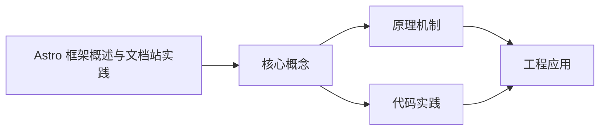
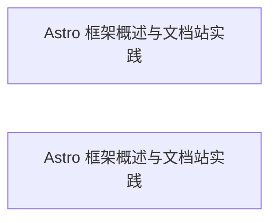

## 1. 学习目标（Bloom 分类）

本节按照布鲁姆教育目标分类学组织学习路径。本文主题为《Astro 框架概述与文档站实践》，属于 Astro 模块，读者可以根据自身阶段选择阅读深度。

记忆层面：能够准确复述本文的核心概念、术语与基本语法或操作步骤，并能够在提问或检索时快速定位对应知识点。能够说出 Astro 的核心概念、工具与工作流。

理解层面：能够用自己的语言解释核心原理与工作机制，说明概念之间的因果关系，而不是机械记忆结论。能够解释 Astro 的关键机制与设计取舍。

应用层面：能够在真实项目或练习场景中运用本文知识解决具体问题，写出正确且可维护的实现。能够独立完成 Astro 的标准开发任务。

分析层面：能够拆解复杂问题，比较本文主题与相邻概念的异同，识别边界条件与例外情况。能够分析 Astro 在真实项目中的问题与边界。

评价层面：能够根据约束条件（性能、可读性、安全、成本）评价不同方案的优劣，做出有依据的技术决策。能够评价 Astro 相关技术选型。

创造层面：能够把本文知识与其他模块知识组合，设计出新的解决方案或可复用的工程模式。能够把 Astro 集成进完整项目体系。

通过本节学习，读者应当能够把《Astro 框架概述与文档站实践》纳入自己的知识网络，并与 Astro 模块的其他主题（静态站点、岛屿架构、内容集合、SSR）建立关联。

## 2. 历史动机与发展脉络

《Astro 框架概述与文档站实践》是 Astro 领域的重要主题。要真正理解它，需要先了解它解决的问题与演进过程。

Astro 于 2021 年发布，定位“内容驱动网站”的 Web 框架：默认零 JS 输出，按需注入交互（岛屿架构）；2024-2025 年 Astro 5-7 持续演进。
核心理念：默认静态、按需增强——页面在构建期渲染为 HTML，只有显式组件（岛屿）才携带客户端 JS，兼顾性能与交互。
能力版图：内容集合（Content Collections/Content Layer）、Markdown/MDX、视图过渡（View Transitions）、服务端渲染（SSR）与适配器（Node/Netlify/Cloudflare）。

回到本文主题：Astro 框架概述与文档站实践 的提出与成熟，正是上述技术背景下的必然产物。早期实现往往以简单可用为目标，随着工程规模扩大，社区逐渐沉淀出标准做法与最佳实践；理解这一脉络，可以帮助读者判断“为什么文档中的推荐写法是现在这个样子”，也能在遇到历史遗留代码时准确识别其设计年代与取舍。


## 3. 形式化定义与核心概念精讲

本节把《Astro 框架概述与文档站实践》涉及的核心概念以“定义 + 讲解”的形式展开。读者应把定义当作工具，把讲解当作理解路径；两者结合才能形成可迁移的知识。

页面与路由：src/pages 文件即路由；.astro 组件由 frontmatter（---）与模板组成。
岛屿架构：<Component client:load> 等指令决定 JS 何时加载；无指令的组件仅服务端渲染。
内容集合：src/content 或 Content Layer 定义 schema，类型安全地加载 Markdown/MDX；getCollection 查询。

### 3.1 原文章节逐一精讲

原文档把主题拆分为 12 个小节，下面按顺序给出每一节的导读讲解，随后保留原文细节供精读。

#### 原文精读（完整保留）


#### 1. Astro 是什么

Astro 是一个面向内容驱动网站（博客、文档站、营销页）的 Web 框架，2021 年发布，当前主流版本为 Astro 5-7。它的核心思想是：默认输出零 JavaScript 的静态 HTML，只有显式标记的交互组件才在浏览器加载脚本。这一模式被称为“岛屿架构”（Islands Architecture）。

Astro 底层由 Vite 驱动，支持 Markdown/MDX、内容集合（Content Collections）、视图过渡（View Transitions）、SSR 与多种部署适配器。FANDEX 文档站即采用 Astro 构建。

#### 2. 设计动机：内容站的性能困境

传统 SPA（单页应用）把所有逻辑打包成一个大 JS bundle，浏览器必须先下载并执行 JS 才能渲染内容。对博客与文档站而言，大部分页面是静态文本，JS 只用于少量交互（目录高亮、搜索、主题切换）——为 10% 的交互付出 100% 的 JS 成本显然不划算。

Astro 的解法：

第一，构建期渲染：页面在构建时输出完整 HTML，首屏无需 JS；

第二，按需水合：交互组件用 `client:` 指令显式声明加载时机；

第三，框架无关：同一页面可以混合使用 React、Vue、Svelte 组件（岛屿）。

#### 3. 项目结构

```text
my-astro-site/
  src/
    pages/          # 路由：每个 .astro/.md 文件对应一个页面
      index.astro
      about.md
    components/     # 组件（.astro、.jsx、.vue 等）
    layouts/        # 布局组件
    content/        # 内容集合（docs/blog）
    styles/
  public/           # 静态资源
  astro.config.mjs  # Astro 配置
  package.json
```

讲解：`src/pages` 是文件路由：`pages/about.md` 生成 `/about` 页面；`pages/blog/[slug].astro` 是动态路由。

#### 4. 组件与页面

##### 4.1 .astro 组件结构

```astro
---
// frontmatter：组件逻辑（在服务端/构建期执行）
import Layout from '../layouts/BaseLayout.astro'
const title = "欢迎"
---

<!-- 模板：HTML + 组件 -->
<Layout pageTitle={title}>
  <h1>{title}</h1>
  <p>这是 Astro 组件。</p>
</Layout>
```

讲解：`---` 之间的代码在构建期运行（可访问文件系统、环境变量），不会发送到浏览器；模板部分输出 HTML。

##### 4.2 岛屿：交互组件

```astro
---
import SearchBox from '../components/SearchBox.tsx'
---

<!-- client:load：页面加载时水合 React 组件 -->
<SearchBox client:load />

<!-- client:visible：组件进入视口才加载 -->
<ThemeToggle client:visible />
```

讲解：`client:` 指令决定 JS 注入时机：`load`（立即）、`idle`（空闲）、`visible`（可见）、`only`（仅客户端）。没有指令的组件只输出服务端渲染的 HTML。

#### 5. 内容集合

内容集合用 schema 校验 frontmatter，让 Markdown 文档获得类型安全：

```ts
// src/content.config.ts
import { defineCollection, z } from 'astro:content'

const docs = defineCollection({
  schema: z.object({
    title: z.string(),
    description: z.string().optional(),
    order: z.number().default(0),
    updated: z.coerce.date().optional(),
  }),
})

export const collections = { docs }
```

查询与渲染：

```astro
---
import { getCollection } from 'astro:content'

// 按 order 排序获取全部文档
const docs = (await getCollection('docs')).sort(
  (a, b) => a.data.order - b.data.order
)
---

<ul>
  {docs.map((doc) => (
    <li><a href={`/docs/${doc.id}/`}>{doc.data.title}</a></li>
  ))}
</ul>
```

讲解：`getCollection` 返回带类型的数据；`doc.id` 由文件名生成。schema 校验失败时构建直接报错，从源头保证元数据质量。

#### 6. 布局、样式与集成

##### 6.1 布局组件

```astro
---
// src/layouts/BaseLayout.astro
interface Props {
  title: string
}
const { title } = Astro.props
---

<!doctype html>
<html lang="zh-CN">
  <head>
    <meta charset="utf-8" />
    <meta name="viewport" content="width=device-width, initial-scale=1" />
    <title>{title}</title>
    <slot name="head" />
  </head>
  <body>
    <slot /> <!-- 页面内容插槽 -->
  </body>
</html>
```

##### 6.2 样式

Astro 支持全局 CSS、`<style>` 作用域样式（自动 scoped）、CSS Modules、Tailwind 集成。现代项目推荐 Tailwind 4 + 设计令牌。

##### 6.3 常用集成

`@astrojs/react`（React 岛屿）、`@astrojs/mdx`（MDX 文档）、`@astrojs/sitemap`（站点地图）、`@astrojs/rss`（RSS 订阅）、Shiki（代码高亮）、KaTeX（数学公式）。

#### 7. 路由、SSR 与部署

##### 7.1 静态与 SSR

默认 `output: 'static'` 构建期生成全部页面；`output: 'server'` 启用 SSR，配合适配器（Node、Netlify、Cloudflare）在服务端渲染动态页面。文档站通常用静态输出。

##### 7.2 部署

`astro build` 输出 `dist/` 目录，可部署到任意静态托管（GitHub Pages、Netlify、Vercel、OSS）。CI 中执行 `pnpm build` 并上传产物即可。

#### 8. 性能与 SEO

性能基线：

第一，零 JS 默认：页面 HTML 直接可读，LCP 极快；

第二，图片优化：`astro:assets` 的 `<Image />` 组件自动压缩、响应式、防 CLS；

第三，字体与 CSS 优化：构建期内联关键资源。

SEO 内置：语义化 HTML、sitemap、RSS、规范链接、Open Graph 标签。

#### 9. 文档站实践（FANDEX 模式）

FANDEX 文档站的关键设计：

内容源：`cnt-content/full` 目录作为内容集合，2000+ 篇 Markdown 文档；

元数据：frontmatter 统一（title、order、module、difficulty、related、prerequisites）；

导航：按模块与 order 自动生成目录与面包屑；

检索：搜索组件作为岛屿按需加载；

构建：`node scripts/build-stats.mjs && astro build`，CI 门禁包含构建与链接检查。


#### 10. 常见陷阱

陷阱一：忘记 `client:` 指令，组件完全没有交互。交互组件必须显式水合。

陷阱二：在 frontmatter 中访问浏览器 API。frontmatter 在构建期执行，用 `client:only` 或条件判断。

陷阱三：内容集合 schema 过松，元数据错误到运行时才暴露。

陷阱四：全站 SSR 导致失去静态优势。按页面选择输出模式。

陷阱五：忽略构建报告。用 `astro build` 的产物分析监控每页 JS 体积。

#### 11. 参考资源

Astro 官方文档：https://docs.astro.build/zh-cn/

Astro 主题市场：https://astro.build/themes/

Astro 集成目录：https://astro.build/integrations/

Astro 官方博客：https://astro.build/blog/

尚硅谷 Bilibili 空间：https://space.bilibili.com/302417610

#### 12. 小结

Astro 重新定义了内容站的性能基线：默认零 JS、按需交互、内容优先。对文档站与内容密集型站点，Astro 是目前最合适的选择之一；理解岛屿架构与内容集合，就能发挥它的全部优势。


### 3.2 概念关系图

下面用 Mermaid 图表达本文核心概念之间的关系，帮助读者建立整体图景：



图中展示的是本文知识的结构化关系：核心概念是入口，原理机制解释“为什么”，代码实践演示“怎么做”，工程应用回答“何时用”。读者学习时可以把每个小节的内容挂接到对应节点上。

## 4. 理论推导与原理解析

本节深入《Astro 框架概述与文档站实践》背后的原理。理论部分不求面面俱到，而是聚焦“能解释现象、能指导实践”的关键推导。

页面与路由：src/pages 文件即路由；.astro 组件由 frontmatter（---）与模板组成。
岛屿架构：<Component client:load> 等指令决定 JS 何时加载；无指令的组件仅服务端渲染。
内容集合：src/content 或 Content Layer 定义 schema，类型安全地加载 Markdown/MDX；getCollection 查询。
构建管线：Vite 底层驱动，集成 Tailwind、MDX、Shiki 代码高亮；astro build 输出静态或 SSR 产物。

需要强调的是，理论推导与工程实践之间存在翻译层：理论给出的是理想化模型与边界条件，工程代码则必须处理真实环境中的例外。读者在学习时应先掌握理论的“标准情形”，再通过陷阱章节了解“非标准情形”。

## 5. 代码示例与逐行讲解

本节把原文中的代码示例系统整理，并为每个示例补充用途说明与讲解。读者不应只浏览代码，而应逐段对照讲解理解设计意图。

### 5.1 示例：3. 项目结构

该示例来自原文《3. 项目结构》小节，用于演示Astro 框架概述与文档站实践相关操作。阅读时请先看代码结构，再看其后的讲解。

```text
my-astro-site/
  src/
    pages/          # 路由：每个 .astro/.md 文件对应一个页面
      index.astro
      about.md
    components/     # 组件（.astro、.jsx、.vue 等）
    layouts/        # 布局组件
    content/        # 内容集合（docs/blog）
    styles/
  public/           # 静态资源
  astro.config.mjs  # Astro 配置
  package.json
```

讲解：这段代码演示了本节核心知识点。代码中的关键操作可以归纳为三步：准备（定义或初始化）、执行（核心逻辑）、收尾（释放资源或返回结果）。实际项目中，这三步往往被封装为函数或类，以提升复用性与可测试性。

关键点分析：

该示例共 12 行有效代码，结构以数据或配置为主。阅读时应关注：数据字段的含义、配置项的作用，以及它们与运行行为的对应关系。

进阶思考路径：先尝试修改参数观察行为变化，再把示例中的模式迁移到自己的项目中；每次修改都记录预期与实测差异，这是把示例转化为能力的最快方式。

### 5.2 示例：4.1 .astro 组件结构

该示例来自原文《4.1 .astro 组件结构》小节，用于演示Astro 框架概述与文档站实践相关操作。阅读时请先看代码结构，再看其后的讲解。

```astro
---
// frontmatter：组件逻辑（在服务端/构建期执行）
import Layout from '../layouts/BaseLayout.astro'
const title = "欢迎"
---

<!-- 模板：HTML + 组件 -->
<Layout pageTitle={title}>
  <h1>{title}</h1>
  <p>这是 Astro 组件。</p>
</Layout>
```

讲解：这段代码演示了本节核心知识点。代码中的关键操作可以归纳为三步：准备（定义或初始化）、执行（核心逻辑）、收尾（释放资源或返回结果）。实际项目中，这三步往往被封装为函数或类，以提升复用性与可测试性。

关键点分析：

该示例共 10 行有效代码，包含 2 类关键结构（import、from）。其中：

- 入口与初始化部分负责建立上下文，对应实际项目中的启动或装配逻辑；
- 核心逻辑部分体现本文主题的主要操作，是阅读时最需要对照讲解理解的部分；
- 输出或返回部分把结果交给调用方，注意其类型与边界条件。

进阶思考路径：先尝试修改参数观察行为变化，再把示例中的模式迁移到自己的项目中；每次修改都记录预期与实测差异，这是把示例转化为能力的最快方式。

### 5.3 示例：4.2 岛屿：交互组件

该示例来自原文《4.2 岛屿：交互组件》小节，用于演示Astro 框架概述与文档站实践相关操作。阅读时请先看代码结构，再看其后的讲解。

```astro
---
import SearchBox from '../components/SearchBox.tsx'
---

<!-- client:load：页面加载时水合 React 组件 -->
<SearchBox client:load />

<!-- client:visible：组件进入视口才加载 -->
<ThemeToggle client:visible />
```

讲解：这段代码演示了本节核心知识点。代码中的关键操作可以归纳为三步：准备（定义或初始化）、执行（核心逻辑）、收尾（释放资源或返回结果）。实际项目中，这三步往往被封装为函数或类，以提升复用性与可测试性。

关键点分析：

该示例共 7 行有效代码，包含 2 类关键结构（import、from）。其中：

- 入口与初始化部分负责建立上下文，对应实际项目中的启动或装配逻辑；
- 核心逻辑部分体现本文主题的主要操作，是阅读时最需要对照讲解理解的部分；
- 输出或返回部分把结果交给调用方，注意其类型与边界条件。

进阶思考路径：先尝试修改参数观察行为变化，再把示例中的模式迁移到自己的项目中；每次修改都记录预期与实测差异，这是把示例转化为能力的最快方式。

### 5.4 示例：5. 内容集合

该示例来自原文《5. 内容集合》小节，用于演示Astro 框架概述与文档站实践相关操作。阅读时请先看代码结构，再看其后的讲解。

```ts
// src/content.config.ts
import { defineCollection, z } from 'astro:content'

const docs = defineCollection({
  schema: z.object({
    title: z.string(),
    description: z.string().optional(),
    order: z.number().default(0),
    updated: z.coerce.date().optional(),
  }),
})

export const collections = { docs }
```

讲解：这段代码演示了本节核心知识点。代码中的关键操作可以归纳为三步：准备（定义或初始化）、执行（核心逻辑）、收尾（释放资源或返回结果）。实际项目中，这三步往往被封装为函数或类，以提升复用性与可测试性。

关键点分析：

该示例共 11 行有效代码，包含 2 类关键结构（import、from）。其中：

- 入口与初始化部分负责建立上下文，对应实际项目中的启动或装配逻辑；
- 核心逻辑部分体现本文主题的主要操作，是阅读时最需要对照讲解理解的部分；
- 输出或返回部分把结果交给调用方，注意其类型与边界条件。

进阶思考路径：先尝试修改参数观察行为变化，再把示例中的模式迁移到自己的项目中；每次修改都记录预期与实测差异，这是把示例转化为能力的最快方式。

### 5.5 示例：5. 内容集合

该示例来自原文《5. 内容集合》小节，用于演示Astro 框架概述与文档站实践相关操作。阅读时请先看代码结构，再看其后的讲解。

```astro
---
import { getCollection } from 'astro:content'

// 按 order 排序获取全部文档
const docs = (await getCollection('docs')).sort(
  (a, b) => a.data.order - b.data.order
)
---

<ul>
  {docs.map((doc) => (
    <li><a href={`/docs/${doc.id}/`}>{doc.data.title}</a></li>
  ))}
</ul>
```

讲解：这段代码演示了本节核心知识点。代码中的关键操作可以归纳为三步：准备（定义或初始化）、执行（核心逻辑）、收尾（释放资源或返回结果）。实际项目中，这三步往往被封装为函数或类，以提升复用性与可测试性。

关键点分析：

该示例共 12 行有效代码，包含 2 类关键结构（import、from）。其中：

- 入口与初始化部分负责建立上下文，对应实际项目中的启动或装配逻辑；
- 核心逻辑部分体现本文主题的主要操作，是阅读时最需要对照讲解理解的部分；
- 输出或返回部分把结果交给调用方，注意其类型与边界条件。

进阶思考路径：先尝试修改参数观察行为变化，再把示例中的模式迁移到自己的项目中；每次修改都记录预期与实测差异，这是把示例转化为能力的最快方式。

### 5.6 示例：6.1 布局组件

该示例来自原文《6.1 布局组件》小节，用于演示Astro 框架概述与文档站实践相关操作。阅读时请先看代码结构，再看其后的讲解。

```astro
---
// src/layouts/BaseLayout.astro
interface Props {
  title: string
}
const { title } = Astro.props
---

<!doctype html>
<html lang="zh-CN">
  <head>
    <meta charset="utf-8" />
    <meta name="viewport" content="width=device-width, initial-scale=1" />
    <title>{title}</title>
    <slot name="head" />
  </head>
  <body>
    <slot /> <!-- 页面内容插槽 -->
  </body>
</html>
```

讲解：这段代码演示了本节核心知识点。代码中的关键操作可以归纳为三步：准备（定义或初始化）、执行（核心逻辑）、收尾（释放资源或返回结果）。实际项目中，这三步往往被封装为函数或类，以提升复用性与可测试性。

关键点分析：

该示例共 19 行有效代码，结构以数据或配置为主。阅读时应关注：数据字段的含义、配置项的作用，以及它们与运行行为的对应关系。

进阶思考路径：先尝试修改参数观察行为变化，再把示例中的模式迁移到自己的项目中；每次修改都记录预期与实测差异，这是把示例转化为能力的最快方式。

### 5.7 示例：9. 文档站实践（FANDEX 模式）

该示例来自原文《9. 文档站实践（FANDEX 模式）》小节，用于演示Astro 框架概述与文档站实践相关操作。阅读时请先看代码结构，再看其后的讲解。


讲解：这段代码演示了本节核心知识点。代码中的关键操作可以归纳为三步：准备（定义或初始化）、执行（核心逻辑）、收尾（释放资源或返回结果）。实际项目中，这三步往往被封装为函数或类，以提升复用性与可测试性。

关键点分析：

该示例共 6 行有效代码，结构以数据或配置为主。阅读时应关注：数据字段的含义、配置项的作用，以及它们与运行行为的对应关系。

进阶思考路径：先尝试修改参数观察行为变化，再把示例中的模式迁移到自己的项目中；每次修改都记录预期与实测差异，这是把示例转化为能力的最快方式。


综合以上示例，可以总结出本主题的代码实践要点：第一，先定义清晰的输入输出契约；第二，核心逻辑保持单一职责；第三，错误处理与边界条件不可省略；第四，命名与注释表达意图而非复述代码。

## 6. 对比分析

对比是理解《Astro 框架概述与文档站实践》定位的最快路径。下面从多个维度与相邻方案进行对比。

Astro 与 Next.js：Astro 内容站性能极致、默认静态；Next.js 全栈与生态更重。
Astro 与 VitePress：Astro 通用内容站 + 自定义 UI；VitePress 文档站开箱即用。
岛屿架构与 MPA/SPA：MPA 多页天然轻；SPA 交互连续但 JS 重；Astro 按需融合。

对比的目的不是分出绝对优劣，而是建立选择依据：不同约束条件下，最优解不同。读者应把每个对比维度转化为决策检查清单。

## 7. 常见陷阱与最佳实践

本节整理该主题的高频错误与推荐做法。每个陷阱先描述现象，再解释原因，最后给出最佳实践。

### 7.1 JS 全部打包

岛屿指令缺失导致页面变重。按交互需求选 client: 指令。

深入讲解：该问题之所以被归类为“常见陷阱”，是因为它在初学者的代码中反复出现，而且往往不在第一时间暴露——错误通常隐藏在特定数据或特定时序下。

从成因上看，JS 全部打包 一般源于对 Astro 某个机制的理解偏差：要么误用了默认行为，要么忽略了边界条件，要么把其他语言的思维惯性带了过来。

从影响上看，JS 全部打包 轻则产生错误结果，重则导致资源泄漏、数据损坏或安全事故；这也是为什么工程评审中会把它列为检查项。

从修复策略上看，处理JS 全部打包的正确顺序是：先复现（构造最小用例），再定位（确认机制层面的根因），最后修复并补充回归测试。跳过复现直接改代码，往往治标不治本。

### 7.2 前端框架混用

React/Vue 混合增加包体。统一一个框架。

深入讲解：该问题之所以被归类为“常见陷阱”，是因为它在初学者的代码中反复出现，而且往往不在第一时间暴露——错误通常隐藏在特定数据或特定时序下。

从成因上看，前端框架混用 一般源于对 Astro 某个机制的理解偏差：要么误用了默认行为，要么忽略了边界条件，要么把其他语言的思维惯性带了过来。

从影响上看，前端框架混用 轻则产生错误结果，重则导致资源泄漏、数据损坏或安全事故；这也是为什么工程评审中会把它列为检查项。

从修复策略上看，处理前端框架混用的正确顺序是：先复现（构造最小用例），再定位（确认机制层面的根因），最后修复并补充回归测试。跳过复现直接改代码，往往治标不治本。

### 7.3 图片未优化

大图拖慢 LCP。使用 Astro 图片组件与 Image 服务。

深入讲解：该问题之所以被归类为“常见陷阱”，是因为它在初学者的代码中反复出现，而且往往不在第一时间暴露——错误通常隐藏在特定数据或特定时序下。

从成因上看，图片未优化 一般源于对 Astro 某个机制的理解偏差：要么误用了默认行为，要么忽略了边界条件，要么把其他语言的思维惯性带了过来。

从影响上看，图片未优化 轻则产生错误结果，重则导致资源泄漏、数据损坏或安全事故；这也是为什么工程评审中会把它列为检查项。

从修复策略上看，处理图片未优化的正确顺序是：先复现（构造最小用例），再定位（确认机制层面的根因），最后修复并补充回归测试。跳过复现直接改代码，往往治标不治本。

### 7.4 内容 schema 缺失

frontmatter 随意导致站点异常。内容集合强制校验。

深入讲解：该问题之所以被归类为“常见陷阱”，是因为它在初学者的代码中反复出现，而且往往不在第一时间暴露——错误通常隐藏在特定数据或特定时序下。

从成因上看，内容 schema 缺失 一般源于对 Astro 某个机制的理解偏差：要么误用了默认行为，要么忽略了边界条件，要么把其他语言的思维惯性带了过来。

从影响上看，内容 schema 缺失 轻则产生错误结果，重则导致资源泄漏、数据损坏或安全事故；这也是为什么工程评审中会把它列为检查项。

从修复策略上看，处理内容 schema 缺失的正确顺序是：先复现（构造最小用例），再定位（确认机制层面的根因），最后修复并补充回归测试。跳过复现直接改代码，往往治标不治本。

### 7.5 SSR 误用

全站 SSR 丢失静态优势。按页面选择输出模式。

深入讲解：该问题之所以被归类为“常见陷阱”，是因为它在初学者的代码中反复出现，而且往往不在第一时间暴露——错误通常隐藏在特定数据或特定时序下。

从成因上看，SSR 误用 一般源于对 Astro 某个机制的理解偏差：要么误用了默认行为，要么忽略了边界条件，要么把其他语言的思维惯性带了过来。

从影响上看，SSR 误用 轻则产生错误结果，重则导致资源泄漏、数据损坏或安全事故；这也是为什么工程评审中会把它列为检查项。

从修复策略上看，处理SSR 误用的正确顺序是：先复现（构造最小用例），再定位（确认机制层面的根因），最后修复并补充回归测试。跳过复现直接改代码，往往治标不治本。

### 7.6 构建缓存失效

内容变化不重建。理解缓存与 CI 策略。

深入讲解：该问题之所以被归类为“常见陷阱”，是因为它在初学者的代码中反复出现，而且往往不在第一时间暴露——错误通常隐藏在特定数据或特定时序下。

从成因上看，构建缓存失效 一般源于对 Astro 某个机制的理解偏差：要么误用了默认行为，要么忽略了边界条件，要么把其他语言的思维惯性带了过来。

从影响上看，构建缓存失效 轻则产生错误结果，重则导致资源泄漏、数据损坏或安全事故；这也是为什么工程评审中会把它列为检查项。

从修复策略上看，处理构建缓存失效的正确顺序是：先复现（构造最小用例），再定位（确认机制层面的根因），最后修复并补充回归测试。跳过复现直接改代码，往往治标不治本。

### 7.7 忽略 404 与 RSS

站点完整性缺失。配置 404 页与 RSS。

深入讲解：该问题之所以被归类为“常见陷阱”，是因为它在初学者的代码中反复出现，而且往往不在第一时间暴露——错误通常隐藏在特定数据或特定时序下。

从成因上看，忽略 404 与 RSS 一般源于对 Astro 某个机制的理解偏差：要么误用了默认行为，要么忽略了边界条件，要么把其他语言的思维惯性带了过来。

从影响上看，忽略 404 与 RSS 轻则产生错误结果，重则导致资源泄漏、数据损坏或安全事故；这也是为什么工程评审中会把它列为检查项。

从修复策略上看，处理忽略 404 与 RSS的正确顺序是：先复现（构造最小用例），再定位（确认机制层面的根因），最后修复并补充回归测试。跳过复现直接改代码，往往治标不治本。

### 7.8 依赖版本漂移

Astro 升级破坏 API。锁定版本与升级指南。

深入讲解：该问题之所以被归类为“常见陷阱”，是因为它在初学者的代码中反复出现，而且往往不在第一时间暴露——错误通常隐藏在特定数据或特定时序下。

从成因上看，依赖版本漂移 一般源于对 Astro 某个机制的理解偏差：要么误用了默认行为，要么忽略了边界条件，要么把其他语言的思维惯性带了过来。

从影响上看，依赖版本漂移 轻则产生错误结果，重则导致资源泄漏、数据损坏或安全事故；这也是为什么工程评审中会把它列为检查项。

从修复策略上看，处理依赖版本漂移的正确顺序是：先复现（构造最小用例），再定位（确认机制层面的根因），最后修复并补充回归测试。跳过复现直接改代码，往往治标不治本。

### 7.0 最佳实践总览

1. 组件最小化：静态内容不引 JS；交互封装为独立岛屿。
2. 内容与展示分离：内容集合管数据，组件管渲染。
3. 性能预算：Lighthouse 全绿为目标，图片与字体优化。
4. SEO 内置：路由、sitemap、RSS、规范链接。

把这些最佳实践固化为团队规范与代码评审检查项，是避免同类问题反复出现的关键。

## 8. 工程实践

本节把《Astro 框架概述与文档站实践》放入真实工程场景，给出可复用的模式与组织方法。

文档站模式：内容集合 + 自动目录 + 搜索集成 + 视图过渡。
部署：静态托管（Netlify/Vercel/GitHub Pages）或 SSR 适配器。
工程化：ESLint + Prettier + CI 构建校验 + 链接检查。

### 8.1 工程实践的原则拆解

以上工程实践可以归纳为四条原则。第一，配置与代码分离：Astro 项目中环境差异应通过配置注入，而不是散落在代码分支中；这保证同一份代码可以在开发、测试、生产环境一致运行。

第二，接口稳定优先：对外接口（函数签名、协议、数据格式）一旦被消费方依赖，变更成本极高；设计时应预留扩展点并保持向后兼容。

第三，可观测性内置：日志、指标与追踪应该在功能开发时同步设计，而不是故障发生后补救；没有观测手段的模块等于黑盒。

第四，变更可回滚：任何发布都应有对应的回滚方案；数据库迁移、配置变更与代码发布一样需要版本管理与逆向路径。

### 8.2 实践落地的检查清单

- [ ] 文档站模式：对照本节描述，检查当前项目是否已经落实；未落实的项列入技术债并排期处理。
- [ ] 部署：对照本节描述，检查当前项目是否已经落实；未落实的项列入技术债并排期处理。
- [ ] 工程化：对照本节描述，检查当前项目是否已经落实；未落实的项列入技术债并排期处理。

工程实践的共性原则：配置与代码分离、接口稳定优先、可观测性内置、变更可回滚。这些原则适用于本主题的所有实现。

## 9. 案例研究

本节通过一个完整案例把《Astro 框架概述与文档站实践》的知识串起来。案例按“需求分析、方案设计、实现、验证”四步展开。

需求：用 Astro 重构 FANDEX 文档站。
方案：内容集合管理 2000+ 文档、MDX 组件、岛屿搜索、RSS 与 sitemap。
要点：文档 frontmatter schema、目录导航生成、构建性能。
验证：构建零错误、Lighthouse 评分、全站链接检查。

### 9.1 案例的扩展讨论

把案例中的方案放大到真实规模，需要额外考虑三个问题：

第一，规模：当数据量或并发量上升一个数量级时，原方案中的数据结构、缓存策略与任务调度是否仍然成立？通常需要引入分层与异步。

第二，团队：多人协作时，模块边界、接口契约与代码所有权必须明确；案例中的实现应拆分为可独立测试的单元，并配合文档说明设计意图。

第三，演进：上线后的需求变化不可避免；方案设计时应预留扩展点（配置化、插件化、事件化），并定期用真实指标验证假设。


案例研究的学习方法：先独立阅读需求，尝试在脑中形成方案，再对照实现与讲解，最后思考“如果约束变化（数据量、并发、团队规模），方案应如何调整”。

## 10. 知识要点总结与深入讲解

本节以讲解形式汇总全文要点，替代传统的习题与自测，读者不需要答题，只需跟随解释建立完整的认知框架。

关于《Astro 框架概述与文档站实践》的核心结论：

Astro 的核心是“内容优先、按需交互”。
岛屿架构让性能与交互兼得。
内容集合是文档站的类型安全基座。

原文档各小节的要点回顾：

- 1. Astro 是什么：该小节围绕Astro 框架概述与文档站实践展开具体细节，阅读时应关注其与核心结论的对应关系；每个小节都是核心结论在某一个侧面的展开。
- 2. 设计动机：内容站的性能困境：该小节围绕Astro 框架概述与文档站实践展开具体细节，阅读时应关注其与核心结论的对应关系；每个小节都是核心结论在某一个侧面的展开。
- 3. 项目结构：该小节围绕Astro 框架概述与文档站实践展开具体细节，阅读时应关注其与核心结论的对应关系；每个小节都是核心结论在某一个侧面的展开。
- 4. 组件与页面：该小节围绕Astro 框架概述与文档站实践展开具体细节，阅读时应关注其与核心结论的对应关系；每个小节都是核心结论在某一个侧面的展开。
- 5. 内容集合：该小节围绕Astro 框架概述与文档站实践展开具体细节，阅读时应关注其与核心结论的对应关系；每个小节都是核心结论在某一个侧面的展开。
- 6. 布局、样式与集成：该小节围绕Astro 框架概述与文档站实践展开具体细节，阅读时应关注其与核心结论的对应关系；每个小节都是核心结论在某一个侧面的展开。
- 7. 路由、SSR 与部署：该小节围绕Astro 框架概述与文档站实践展开具体细节，阅读时应关注其与核心结论的对应关系；每个小节都是核心结论在某一个侧面的展开。
- 8. 性能与 SEO：该小节围绕Astro 框架概述与文档站实践展开具体细节，阅读时应关注其与核心结论的对应关系；每个小节都是核心结论在某一个侧面的展开。
- 9. 文档站实践（FANDEX 模式）：该小节围绕Astro 框架概述与文档站实践展开具体细节，阅读时应关注其与核心结论的对应关系；每个小节都是核心结论在某一个侧面的展开。
- 10. 常见陷阱：该小节围绕Astro 框架概述与文档站实践展开具体细节，阅读时应关注其与核心结论的对应关系；每个小节都是核心结论在某一个侧面的展开。
- 11. 参考资源：该小节围绕Astro 框架概述与文档站实践展开具体细节，阅读时应关注其与核心结论的对应关系；每个小节都是核心结论在某一个侧面的展开。
- 12. 小结：该小节围绕Astro 框架概述与文档站实践展开具体细节，阅读时应关注其与核心结论的对应关系；每个小节都是核心结论在某一个侧面的展开。

把以上要点与第 3-9 节的内容对照复习，即可完成对本文主题的闭环学习。

## 11. 参考文献


Astro 官方文档：https://docs.astro.build/zh-cn/
Astro 主题市场：https://astro.build/themes/
Astro 集成：https://astro.build/integrations/
Astro 博客：https://astro.build/blog/

## 12. 延伸阅读


Vite 构建机制，见 056-vite 模块。
Markdown/MDX 写作，见 002-markdown 模块。
Tailwind 样式，见 058-tailwind 模块。
尚硅谷 Bilibili 空间（https://space.bilibili.com/302417610 ）提供前端工程化课程。

## 14. 模块知识图谱与学习路径

本文属于 Astro 模块。为了把《Astro 框架概述与文档站实践》放入完整的知识网络，下面列出本模块的全部主题并给出相互关联的导读。学习时建议按模块内顺序推进，并在每个文档中留意交叉引用。



上图为模块主题的推荐学习顺序示意图（仅展示前若干主题）。各主题之间存在三类关联：

第一，前置依赖关系：早期主题是后期主题的基础，例如环境与语法先行、进阶主题随后；

第二，横向并列关系：同一层级主题从不同角度覆盖模块能力，学习顺序可以按兴趣调整；

第三，工程组合关系：多个主题在真实项目中组合使用，例如配置、性能与安全主题往往出现在同一系统的不同层面。

### 14.1 模块主题速查表

| 文档 | 主题 | 与本文的关联 |
| --- | --- | --- |
| Astro 框架概述与文档站实践 | 001-AstroOverview | 本文自身 |

速查表的作用是让读者快速判断：哪些文档应在阅读本文前掌握（前置基础），哪些文档应在阅读本文后继续（延伸主题）。本模块的交叉引用体系即以此表为基础。

## 15. 术语表

下表整理《Astro 框架概述与文档站实践》及 Astro 模块中出现的高频术语，给出简明释义。术语按字母序或逻辑序排列，供查阅。

| 术语 | 释义 |
| --- | --- |
| 页面与路由 | src/pages 文件即路由；.astro 组件由 frontmatter（---）与模板组成。 |
| 岛屿架构 | <Component client:load> 等指令决定 JS 何时加载；无指令的组件仅服务端渲染。 |
| 内容集合 | src/content 或 Content Layer 定义 schema，类型安全地加载 Markdown/MDX；getCollection 查询。 |
| 构建管线 | Vite 底层驱动，集成 Tailwind、MDX、Shiki 代码高亮；astro build 输出静态或 SSR 产物。 |
| JS 全部打包（易错点） | 参见常见陷阱章节的详细讲解 |
| 前端框架混用（易错点） | 参见常见陷阱章节的详细讲解 |
| 图片未优化（易错点） | 参见常见陷阱章节的详细讲解 |
| 内容 schema 缺失（易错点） | 参见常见陷阱章节的详细讲解 |
| SSR 误用（易错点） | 参见常见陷阱章节的详细讲解 |
| 构建缓存失效（易错点） | 参见常见陷阱章节的详细讲解 |

术语表与正文配合使用：先通读正文，遇到模糊术语回查本表；长期使用后术语会自然进入工作记忆。

## 13. 深度专题扩展

以下专题从不同角度深入本文主题，供有进阶需求的读者研读。每个专题独立成节，内容相互补充。

### 13.1 内容集合与类型安全

定义 schema（zod）：title、description、日期、标签；集合加载时校验。
getCollection('docs') 返回类型化条目；slug 由文件名或 frontmatter 决定。
Content Layer（Astro 5+）：从远程或本地数据源加载，缓存策略可配置。
实践：文档站把全部课程文档注册为集合，目录与搜索基于集合生成。

### 13.2 岛屿架构原理

静态页面输出 HTML 与 CSS；client:load 组件单独打包为岛屿脚本。
指令：client:load（加载即水合）、client:idle（空闲）、client:visible（可见）、client:only（仅客户端）。
水合成本：每个岛屿独立 JS 块，页面级状态传递用 store（nanostores）。
性能分析：astro build 报告每页 JS 大小，按报告调整指令。

## 16. 核心概念串讲（复习视角）

本节以“把知识讲给他人听”的方式，把《Astro 框架概述与文档站实践》的核心概念重新串讲一遍。与前文按章节展开不同，这里的叙述更接近课堂总结：先说整体，再逐个展开，最后收束。

《Astro 框架概述与文档站实践》属于 Astro 模块。要理解它，先要理解它在模块中的位置：它解决的是该领域的一个具体问题，并依赖模块内若干前置概念；反过来，它又为后续进阶主题提供基础。

第一个概念是页面与路由。src/pages 文件即路由；.astro 组件由 frontmatter（---）与模板组成。

在实际使用中，页面与路由需要与相邻概念区分：它们的区别不在于名称，而在于适用条件与行为边界；这正是前文对比分析章节的意义。

第一个概念是岛屿架构。<Component client:load> 等指令决定 JS 何时加载；无指令的组件仅服务端渲染。

在实际使用中，岛屿架构需要与相邻概念区分：它们的区别不在于名称，而在于适用条件与行为边界；这正是前文对比分析章节的意义。

第一个概念是内容集合。src/content 或 Content Layer 定义 schema，类型安全地加载 Markdown/MDX；getCollection 查询。

在实际使用中，内容集合需要与相邻概念区分：它们的区别不在于名称，而在于适用条件与行为边界；这正是前文对比分析章节的意义。

接下来是页面与路由。src/pages 文件即路由；.astro 组件由 frontmatter（---）与模板组成。

理解该原理的关键不是记住结论，而是记住“它从什么假设出发、推出了什么、假设不成立时会怎样”。带着这个框架复习，原理之间就会连成网络。

接下来是岛屿架构。<Component client:load> 等指令决定 JS 何时加载；无指令的组件仅服务端渲染。

理解该原理的关键不是记住结论，而是记住“它从什么假设出发、推出了什么、假设不成立时会怎样”。带着这个框架复习，原理之间就会连成网络。

接下来是内容集合。src/content 或 Content Layer 定义 schema，类型安全地加载 Markdown/MDX；getCollection 查询。

理解该原理的关键不是记住结论，而是记住“它从什么假设出发、推出了什么、假设不成立时会怎样”。带着这个框架复习，原理之间就会连成网络。

接下来是构建管线。Vite 底层驱动，集成 Tailwind、MDX、Shiki 代码高亮；astro build 输出静态或 SSR 产物。

理解该原理的关键不是记住结论，而是记住“它从什么假设出发、推出了什么、假设不成立时会怎样”。带着这个框架复习，原理之间就会连成网络。

串讲收束：把概念与原理放回本文主题，可以得出一个总纲——定义描述是什么，原理解释为什么，实践回答怎么做。三者构成完整的学习闭环；后续遇到相关问题，都可以按这个总纲检索知识。
