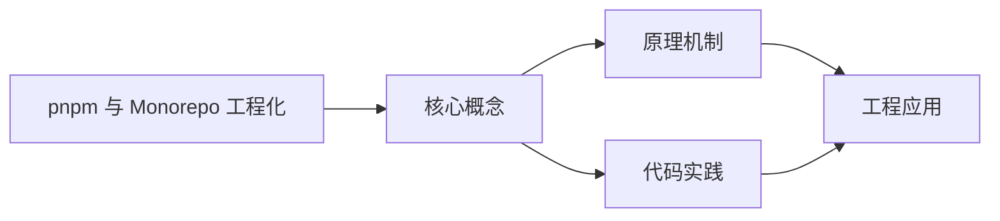
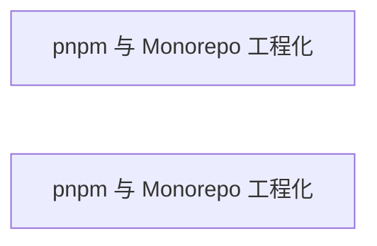

## 1. 学习目标（Bloom 分类）

本节按照布鲁姆教育目标分类学组织学习路径。本文主题为《pnpm 与 Monorepo 工程化》，属于 pnpm 与 Monorepo 模块，读者可以根据自身阶段选择阅读深度。

记忆层面：能够准确复述本文的核心概念、术语与基本语法或操作步骤，并能够在提问或检索时快速定位对应知识点。能够说出 pnpm 与 Monorepo 的核心概念、工具与工作流。

理解层面：能够用自己的语言解释核心原理与工作机制，说明概念之间的因果关系，而不是机械记忆结论。能够解释 pnpm 与 Monorepo 的关键机制与设计取舍。

应用层面：能够在真实项目或练习场景中运用本文知识解决具体问题，写出正确且可维护的实现。能够独立完成 pnpm 与 Monorepo 的标准开发任务。

分析层面：能够拆解复杂问题，比较本文主题与相邻概念的异同，识别边界条件与例外情况。能够分析 pnpm 与 Monorepo 在真实项目中的问题与边界。

评价层面：能够根据约束条件（性能、可读性、安全、成本）评价不同方案的优劣，做出有依据的技术决策。能够评价 pnpm 与 Monorepo 相关技术选型。

创造层面：能够把本文知识与其他模块知识组合，设计出新的解决方案或可复用的工程模式。能够把 pnpm 与 Monorepo 集成进完整项目体系。

通过本节学习，读者应当能够把《pnpm 与 Monorepo 工程化》纳入自己的知识网络，并与 pnpm 与 Monorepo 模块的其他主题（workspace、目录、依赖隔离、发布）建立关联。

## 2. 历史动机与发展脉络

《pnpm 与 Monorepo 工程化》是 pnpm 与 Monorepo 领域的重要主题。要真正理解它，需要先了解它解决的问题与演进过程。

Monorepo（单仓库多包）通过统一仓库管理多应用与共享包，Google/Meta/微软等大厂实践成熟；pnpm 以“内容寻址存储 + 严格依赖隔离”成为 Node 生态主流。
pnpm 核心：全局内容寻址存储（硬链接）、符号链接 node_modules、隔离依赖（防幽灵依赖）、workspace 协议。
工程形态：apps/（应用）+ packages/（共享库）+ tools/（工具）；catalog 统一依赖版本；Turborepo/Nx 提供任务编排。

回到本文主题：pnpm 与 Monorepo 工程化 的提出与成熟，正是上述技术背景下的必然产物。早期实现往往以简单可用为目标，随着工程规模扩大，社区逐渐沉淀出标准做法与最佳实践；理解这一脉络，可以帮助读者判断“为什么文档中的推荐写法是现在这个样子”，也能在遇到历史遗留代码时准确识别其设计年代与取舍。


## 3. 形式化定义与核心概念精讲

本节把《pnpm 与 Monorepo 工程化》涉及的核心概念以“定义 + 讲解”的形式展开。读者应把定义当作工具，把讲解当作理解路径；两者结合才能形成可迁移的知识。

内容寻址存储：依赖按内容存储一次，跨项目硬链接，节省磁盘；不同版本共存。
严格 node_modules：依赖只对声明它的包可见，消除幽灵依赖（依赖未声明却可用）。
workspace：pnpm-workspace.yaml 声明包目录；workspace:* 协议链接本地包。

### 3.1 原文章节逐一精讲

原文档把主题拆分为 11 个小节，下面按顺序给出每一节的导读讲解，随后保留原文细节供精读。

#### 原文精读（完整保留）


#### 1. 什么是 Monorepo

Monorepo（单仓库多包）是把多个应用、共享库与工具链放在同一个 Git 仓库中管理的工程模式。与之相对的是多仓库（Polyrepo）：每个项目独立仓库。

Monorepo 的优势：

第一，原子提交：跨包的修改一次提交，版本始终一致；

第二，统一依赖：依赖版本集中管理，避免各包漂移；

第三，代码复用：共享包通过 workspace 协议直接引用，无需发布到 npm 即可联调；

第四，统一 CI：一次流水线构建全部相关包。

代价是工具链复杂度：需要 workspace 管理、任务编排与构建缓存。pnpm 是目前 Node 生态中最适合 Monorepo 的包管理器之一。

#### 2. pnpm 的核心机制

##### 2.1 内容寻址存储

pnpm 把所有依赖包的内容存储在全局 store 中（按内容哈希寻址），项目通过硬链接引用。同一版本的依赖在多个项目中只存一份，节省磁盘；不同版本共存互不干扰。

##### 2.2 严格依赖隔离

传统 npm 把依赖扁平提升到根 node_modules，导致“幽灵依赖”：代码可以 import 未声明的包。pnpm 的 node_modules 是符号链接结构，只有 package.json 中声明的依赖可见。

```text
node_modules/
  .pnpm/              # 内容寻址存储的链接层
  my-app -> .pnpm/my-app@1.0.0/node_modules/my-app
```

讲解：直接依赖通过符号链接暴露，间接依赖藏在 .pnpm 中不可见，从结构上杜绝幽灵依赖。

##### 2.3 workspace 协议

`workspace:*` 让包依赖本地兄弟包：

```json
{
  "dependencies": {
    "@fandex/utils": "workspace:*"
  }
}
```

发布时 pnpm 会把 `workspace:*` 替换为实际版本号。

#### 3. 工程结构

FANDEX 采用典型 Monorepo 布局：

```text
FANDEX/
  app-web/               # Web 应用（Astro + React）
  app-desktop/           # 桌面应用（Tauri + Expo）
  app-android/           # Android 应用（Expo）
  shd-shared/            # 共享层（tokens、utils、assets）
  tls-tools/             # 工具链（ID 分配、清单生成）
  thd-third-party/       # 第三方组件封装
  dcs-docs/              # 文档目录
  pnpm-workspace.yaml    # workspace 配置
  package.json
```

```yaml
# pnpm-workspace.yaml
packages:
  - 'app-*'
  - 'shd-shared'
  - 'shd-shared/*'
  - 'tls-tools'
  - 'thd-third-party/*'
```

讲解：glob 模式声明所有包目录；catalog 在同一个文件中统一核心依赖版本。

#### 4. catalog 统一版本

```yaml
catalog:
  react: ^19.0.0
  typescript: ^5.7.0
  vite: ^6.0.0
```

各包通过 `catalog:` 协议引用：

```json
{
  "dependencies": {
    "react": "catalog:"
  }
}
```

讲解：catalog 是 pnpm 9+ 的特性，让“依赖版本单一事实来源”成为可能；升级版本只需改一处。

#### 5. 常用命令

```bash
pnpm install                     # 安装全部 workspace 依赖
pnpm --filter @fandex/web dev    # 只操作指定包
pnpm -r build                    # 递归构建所有包
pnpm -r --topological build      # 按依赖拓扑顺序构建
pnpm -F @fandex/web add lodash   # 给指定包添加依赖
pnpm why react                   # 查看依赖来源
pnpm store prune                 # 清理全局 store
```

讲解：`--filter` 精确定位包；`--topological` 保证先构建依赖再构建应用；`--parallel` 并行执行无依赖关系的任务。

#### 6. 任务编排与缓存

大型 Monorepo 推荐 Turborepo：

```json
{
  "turbo": {
    "tasks": {
      "build": {
        "dependsOn": ["^build"],
        "outputs": ["dist/**"]
      },
      "test": {
        "dependsOn": ["build"],
        "outputs": []
      }
    }
  }
}
```

讲解：`dependsOn: ["^build"]` 表示先构建依赖；turbo 按输入文件哈希缓存任务结果，未变更的包直接复用缓存，CI 提速显著。

#### 7. 版本管理与发布

Changesets 是 Monorepo 版本管理的标准方案：

```bash
pnpm changeset add        # 记录变更（major/minor/patch）
pnpm changeset version    # 更新版本与 CHANGELOG
pnpm changeset publish    # 发布到 npm
```

发布流程：CI 检查 changeset 存在 -> 合并 PR -> 发布流水线执行 version + publish。

#### 8. CI 最佳实践

```yaml
# GitHub Actions 片段
steps:
  - uses: pnpm/action-setup@v4
    with:
      version: 10
  - uses: actions/setup-node@v4
    with:
      node-version: 22
      cache: pnpm
  - run: pnpm install --frozen-lockfile
  - run: pnpm -r --topological build
  - run: pnpm -r test
```

讲解：`--frozen-lockfile` 保证按 lockfile 精确安装；`cache: pnpm` 缓存 store 与依赖。

#### 9. 常见陷阱

陷阱一：幽灵依赖。代码 import 了未声明的包，本地能跑、干净环境失败。用 pnpm 隔离并在 CI 强制 frozen-lockfile。

陷阱二：构建顺序错误。应用先于依赖构建失败。用 `--topological` 或 turbo 的 dependsOn。

陷阱三：忽略 lockfile 提交。团队环境不一致。pnpm-lock.yaml 必须入库。

陷阱四：版本漂移。各包直接写不同版本。用 catalog 统一。

陷阱五：循环依赖。包间互相引用导致构建死循环。重新设计分层。

陷阱六：大仓库 CI 慢。全量任务重复跑。用 turbo 缓存与 affected 模式。

#### 10. 参考资源

pnpm 官方文档：https://pnpm.io/zh/

pnpm workspace：https://pnpm.io/zh/workspaces

Turborepo：https://turborepo.com/

Changesets：https://changesets-docs.vercel.app/

黑马程序员 Bilibili 空间：https://space.bilibili.com/37974444

#### 11. 小结

pnpm + Monorepo 是现代前端工程化的主流组合：内容寻址存储节省磁盘，严格隔离保证正确性，catalog 统一版本，turbo 加速构建。FANDEX 即采用这一架构管理三端应用与共享层。


### 3.2 概念关系图

下面用 Mermaid 图表达本文核心概念之间的关系，帮助读者建立整体图景：



图中展示的是本文知识的结构化关系：核心概念是入口，原理机制解释“为什么”，代码实践演示“怎么做”，工程应用回答“何时用”。读者学习时可以把每个小节的内容挂接到对应节点上。

## 4. 理论推导与原理解析

本节深入《pnpm 与 Monorepo 工程化》背后的原理。理论部分不求面面俱到，而是聚焦“能解释现象、能指导实践”的关键推导。

内容寻址存储：依赖按内容存储一次，跨项目硬链接，节省磁盘；不同版本共存。
严格 node_modules：依赖只对声明它的包可见，消除幽灵依赖（依赖未声明却可用）。
workspace：pnpm-workspace.yaml 声明包目录；workspace:* 协议链接本地包。
catalog：集中定义依赖版本，各包用 catalog: 引用，避免版本漂移。

需要强调的是，理论推导与工程实践之间存在翻译层：理论给出的是理想化模型与边界条件，工程代码则必须处理真实环境中的例外。读者在学习时应先掌握理论的“标准情形”，再通过陷阱章节了解“非标准情形”。

## 5. 代码示例与逐行讲解

本节把原文中的代码示例系统整理，并为每个示例补充用途说明与讲解。读者不应只浏览代码，而应逐段对照讲解理解设计意图。

### 5.1 示例：2.2 严格依赖隔离

该示例来自原文《2.2 严格依赖隔离》小节，用于演示pnpm 与 Monorepo 工程化相关操作。阅读时请先看代码结构，再看其后的讲解。

```text
node_modules/
  .pnpm/              # 内容寻址存储的链接层
  my-app -> .pnpm/my-app@1.0.0/node_modules/my-app
```

讲解：这段代码演示了本节核心知识点。代码中的关键操作可以归纳为三步：准备（定义或初始化）、执行（核心逻辑）、收尾（释放资源或返回结果）。实际项目中，这三步往往被封装为函数或类，以提升复用性与可测试性。

关键点分析：

该示例共 3 行有效代码，结构以数据或配置为主。阅读时应关注：数据字段的含义、配置项的作用，以及它们与运行行为的对应关系。

进阶思考路径：先尝试修改参数观察行为变化，再把示例中的模式迁移到自己的项目中；每次修改都记录预期与实测差异，这是把示例转化为能力的最快方式。

### 5.2 示例：2.3 workspace 协议

该示例来自原文《2.3 workspace 协议》小节，用于演示pnpm 与 Monorepo 工程化相关操作。阅读时请先看代码结构，再看其后的讲解。

```json
{
  "dependencies": {
    "@fandex/utils": "workspace:*"
  }
}
```

讲解：这段代码演示了本节核心知识点。代码中的关键操作可以归纳为三步：准备（定义或初始化）、执行（核心逻辑）、收尾（释放资源或返回结果）。实际项目中，这三步往往被封装为函数或类，以提升复用性与可测试性。

关键点分析：

该示例共 5 行有效代码，结构以数据或配置为主。阅读时应关注：数据字段的含义、配置项的作用，以及它们与运行行为的对应关系。

进阶思考路径：先尝试修改参数观察行为变化，再把示例中的模式迁移到自己的项目中；每次修改都记录预期与实测差异，这是把示例转化为能力的最快方式。

### 5.3 示例：3. 工程结构

该示例来自原文《3. 工程结构》小节，用于演示pnpm 与 Monorepo 工程化相关操作。阅读时请先看代码结构，再看其后的讲解。

```text
FANDEX/
  app-web/               # Web 应用（Astro + React）
  app-desktop/           # 桌面应用（Tauri + Expo）
  app-android/           # Android 应用（Expo）
  shd-shared/            # 共享层（tokens、utils、assets）
  tls-tools/             # 工具链（ID 分配、清单生成）
  thd-third-party/       # 第三方组件封装
  dcs-docs/              # 文档目录
  pnpm-workspace.yaml    # workspace 配置
  package.json
```

讲解：这段代码演示了本节核心知识点。代码中的关键操作可以归纳为三步：准备（定义或初始化）、执行（核心逻辑）、收尾（释放资源或返回结果）。实际项目中，这三步往往被封装为函数或类，以提升复用性与可测试性。

关键点分析：

该示例共 10 行有效代码，结构以数据或配置为主。阅读时应关注：数据字段的含义、配置项的作用，以及它们与运行行为的对应关系。

进阶思考路径：先尝试修改参数观察行为变化，再把示例中的模式迁移到自己的项目中；每次修改都记录预期与实测差异，这是把示例转化为能力的最快方式。

### 5.4 示例：3. 工程结构

该示例来自原文《3. 工程结构》小节，用于演示pnpm 与 Monorepo 工程化相关操作。阅读时请先看代码结构，再看其后的讲解。

```yaml
# pnpm-workspace.yaml
packages:
  - 'app-*'
  - 'shd-shared'
  - 'shd-shared/*'
  - 'tls-tools'
  - 'thd-third-party/*'
```

讲解：这段代码演示了本节核心知识点。代码中的关键操作可以归纳为三步：准备（定义或初始化）、执行（核心逻辑）、收尾（释放资源或返回结果）。实际项目中，这三步往往被封装为函数或类，以提升复用性与可测试性。

关键点分析：

该示例共 7 行有效代码，结构以数据或配置为主。阅读时应关注：数据字段的含义、配置项的作用，以及它们与运行行为的对应关系。

进阶思考路径：先尝试修改参数观察行为变化，再把示例中的模式迁移到自己的项目中；每次修改都记录预期与实测差异，这是把示例转化为能力的最快方式。

### 5.5 示例：4. catalog 统一版本

该示例来自原文《4. catalog 统一版本》小节，用于演示pnpm 与 Monorepo 工程化相关操作。阅读时请先看代码结构，再看其后的讲解。

```yaml
catalog:
  react: ^19.0.0
  typescript: ^5.7.0
  vite: ^6.0.0
```

讲解：这段代码演示了本节核心知识点。代码中的关键操作可以归纳为三步：准备（定义或初始化）、执行（核心逻辑）、收尾（释放资源或返回结果）。实际项目中，这三步往往被封装为函数或类，以提升复用性与可测试性。

关键点分析：

该示例共 4 行有效代码，结构以数据或配置为主。阅读时应关注：数据字段的含义、配置项的作用，以及它们与运行行为的对应关系。

进阶思考路径：先尝试修改参数观察行为变化，再把示例中的模式迁移到自己的项目中；每次修改都记录预期与实测差异，这是把示例转化为能力的最快方式。

### 5.6 示例：4. catalog 统一版本

该示例来自原文《4. catalog 统一版本》小节，用于演示pnpm 与 Monorepo 工程化相关操作。阅读时请先看代码结构，再看其后的讲解。

```json
{
  "dependencies": {
    "react": "catalog:"
  }
}
```

讲解：这段代码演示了本节核心知识点。代码中的关键操作可以归纳为三步：准备（定义或初始化）、执行（核心逻辑）、收尾（释放资源或返回结果）。实际项目中，这三步往往被封装为函数或类，以提升复用性与可测试性。

关键点分析：

该示例共 5 行有效代码，结构以数据或配置为主。阅读时应关注：数据字段的含义、配置项的作用，以及它们与运行行为的对应关系。

进阶思考路径：先尝试修改参数观察行为变化，再把示例中的模式迁移到自己的项目中；每次修改都记录预期与实测差异，这是把示例转化为能力的最快方式。

### 5.7 示例：5. 常用命令

该示例来自原文《5. 常用命令》小节，用于演示pnpm 与 Monorepo 工程化相关操作。阅读时请先看代码结构，再看其后的讲解。

```bash
pnpm install                     # 安装全部 workspace 依赖
pnpm --filter @fandex/web dev    # 只操作指定包
pnpm -r build                    # 递归构建所有包
pnpm -r --topological build      # 按依赖拓扑顺序构建
pnpm -F @fandex/web add lodash   # 给指定包添加依赖
pnpm why react                   # 查看依赖来源
pnpm store prune                 # 清理全局 store
```

讲解：这段代码演示了本节核心知识点。代码中的关键操作可以归纳为三步：准备（定义或初始化）、执行（核心逻辑）、收尾（释放资源或返回结果）。实际项目中，这三步往往被封装为函数或类，以提升复用性与可测试性。

关键点分析：

该示例共 7 行有效代码，结构以数据或配置为主。阅读时应关注：数据字段的含义、配置项的作用，以及它们与运行行为的对应关系。

进阶思考路径：先尝试修改参数观察行为变化，再把示例中的模式迁移到自己的项目中；每次修改都记录预期与实测差异，这是把示例转化为能力的最快方式。

### 5.8 示例：6. 任务编排与缓存

该示例来自原文《6. 任务编排与缓存》小节，用于演示pnpm 与 Monorepo 工程化相关操作。阅读时请先看代码结构，再看其后的讲解。

```json
{
  "turbo": {
    "tasks": {
      "build": {
        "dependsOn": ["^build"],
        "outputs": ["dist/**"]
      },
      "test": {
        "dependsOn": ["build"],
        "outputs": []
      }
    }
  }
}
```

讲解：这段代码演示了本节核心知识点。代码中的关键操作可以归纳为三步：准备（定义或初始化）、执行（核心逻辑）、收尾（释放资源或返回结果）。实际项目中，这三步往往被封装为函数或类，以提升复用性与可测试性。

关键点分析：

该示例共 14 行有效代码，结构以数据或配置为主。阅读时应关注：数据字段的含义、配置项的作用，以及它们与运行行为的对应关系。

进阶思考路径：先尝试修改参数观察行为变化，再把示例中的模式迁移到自己的项目中；每次修改都记录预期与实测差异，这是把示例转化为能力的最快方式。

### 5.9 示例：7. 版本管理与发布

该示例来自原文《7. 版本管理与发布》小节，用于演示pnpm 与 Monorepo 工程化相关操作。阅读时请先看代码结构，再看其后的讲解。

```bash
pnpm changeset add        # 记录变更（major/minor/patch）
pnpm changeset version    # 更新版本与 CHANGELOG
pnpm changeset publish    # 发布到 npm
```

讲解：这段代码演示了本节核心知识点。代码中的关键操作可以归纳为三步：准备（定义或初始化）、执行（核心逻辑）、收尾（释放资源或返回结果）。实际项目中，这三步往往被封装为函数或类，以提升复用性与可测试性。

关键点分析：

该示例共 3 行有效代码，结构以数据或配置为主。阅读时应关注：数据字段的含义、配置项的作用，以及它们与运行行为的对应关系。

进阶思考路径：先尝试修改参数观察行为变化，再把示例中的模式迁移到自己的项目中；每次修改都记录预期与实测差异，这是把示例转化为能力的最快方式。

### 5.10 示例：8. CI 最佳实践

该示例来自原文《8. CI 最佳实践》小节，用于演示pnpm 与 Monorepo 工程化相关操作。阅读时请先看代码结构，再看其后的讲解。

```yaml
# GitHub Actions 片段
steps:
  - uses: pnpm/action-setup@v4
    with:
      version: 10
  - uses: actions/setup-node@v4
    with:
      node-version: 22
      cache: pnpm
  - run: pnpm install --frozen-lockfile
  - run: pnpm -r --topological build
  - run: pnpm -r test
```

讲解：这段代码演示了本节核心知识点。代码中的关键操作可以归纳为三步：准备（定义或初始化）、执行（核心逻辑）、收尾（释放资源或返回结果）。实际项目中，这三步往往被封装为函数或类，以提升复用性与可测试性。

关键点分析：

该示例共 12 行有效代码，结构以数据或配置为主。阅读时应关注：数据字段的含义、配置项的作用，以及它们与运行行为的对应关系。

进阶思考路径：先尝试修改参数观察行为变化，再把示例中的模式迁移到自己的项目中；每次修改都记录预期与实测差异，这是把示例转化为能力的最快方式。


综合以上示例，可以总结出本主题的代码实践要点：第一，先定义清晰的输入输出契约；第二，核心逻辑保持单一职责；第三，错误处理与边界条件不可省略；第四，命名与注释表达意图而非复述代码。

## 6. 对比分析

对比是理解《pnpm 与 Monorepo 工程化》定位的最快路径。下面从多个维度与相邻方案进行对比。

pnpm 与 npm/yarn：pnpm 磁盘高效、依赖隔离严格；npm 兼容性最广。
Monorepo 与多仓库：Monorepo 原子变更与统一依赖；多仓独立治理。
Turborepo 与 Nx：都是任务编排器；按团队偏好选择。

对比的目的不是分出绝对优劣，而是建立选择依据：不同约束条件下，最优解不同。读者应把每个对比维度转化为决策检查清单。

## 7. 常见陷阱与最佳实践

本节整理该主题的高频错误与推荐做法。每个陷阱先描述现象，再解释原因，最后给出最佳实践。

### 7.1 幽灵依赖

未声明的包被隐式使用。pnpm 默认隔离，CI 用 frozen-lockfile。

深入讲解：该问题之所以被归类为“常见陷阱”，是因为它在初学者的代码中反复出现，而且往往不在第一时间暴露——错误通常隐藏在特定数据或特定时序下。

从成因上看，幽灵依赖 一般源于对 pnpm 与 Monorepo 某个机制的理解偏差：要么误用了默认行为，要么忽略了边界条件，要么把其他语言的思维惯性带了过来。

从影响上看，幽灵依赖 轻则产生错误结果，重则导致资源泄漏、数据损坏或安全事故；这也是为什么工程评审中会把它列为检查项。

从修复策略上看，处理幽灵依赖的正确顺序是：先复现（构造最小用例），再定位（确认机制层面的根因），最后修复并补充回归测试。跳过复现直接改代码，往往治标不治本。

### 7.2 构建顺序

依赖包未先构建。用 --filter 与拓扑排序（turbo/pnpm -r）。

深入讲解：该问题之所以被归类为“常见陷阱”，是因为它在初学者的代码中反复出现，而且往往不在第一时间暴露——错误通常隐藏在特定数据或特定时序下。

从成因上看，构建顺序 一般源于对 pnpm 与 Monorepo 某个机制的理解偏差：要么误用了默认行为，要么忽略了边界条件，要么把其他语言的思维惯性带了过来。

从影响上看，构建顺序 轻则产生错误结果，重则导致资源泄漏、数据损坏或安全事故；这也是为什么工程评审中会把它列为检查项。

从修复策略上看，处理构建顺序的正确顺序是：先复现（构造最小用例），再定位（确认机制层面的根因），最后修复并补充回归测试。跳过复现直接改代码，往往治标不治本。

### 7.3 版本漂移

各包依赖版本不一致。catalog 统一。

深入讲解：该问题之所以被归类为“常见陷阱”，是因为它在初学者的代码中反复出现，而且往往不在第一时间暴露——错误通常隐藏在特定数据或特定时序下。

从成因上看，版本漂移 一般源于对 pnpm 与 Monorepo 某个机制的理解偏差：要么误用了默认行为，要么忽略了边界条件，要么把其他语言的思维惯性带了过来。

从影响上看，版本漂移 轻则产生错误结果，重则导致资源泄漏、数据损坏或安全事故；这也是为什么工程评审中会把它列为检查项。

从修复策略上看，处理版本漂移的正确顺序是：先复现（构造最小用例），再定位（确认机制层面的根因），最后修复并补充回归测试。跳过复现直接改代码，往往治标不治本。

### 7.4 循环依赖

包间循环导致构建失败。重新分层。

深入讲解：该问题之所以被归类为“常见陷阱”，是因为它在初学者的代码中反复出现，而且往往不在第一时间暴露——错误通常隐藏在特定数据或特定时序下。

从成因上看，循环依赖 一般源于对 pnpm 与 Monorepo 某个机制的理解偏差：要么误用了默认行为，要么忽略了边界条件，要么把其他语言的思维惯性带了过来。

从影响上看，循环依赖 轻则产生错误结果，重则导致资源泄漏、数据损坏或安全事故；这也是为什么工程评审中会把它列为检查项。

从修复策略上看，处理循环依赖的正确顺序是：先复现（构造最小用例），再定位（确认机制层面的根因），最后修复并补充回归测试。跳过复现直接改代码，往往治标不治本。

### 7.5 node_modules 膨胀

重复安装。验证 pnpm store 复用与 dedupe。

深入讲解：该问题之所以被归类为“常见陷阱”，是因为它在初学者的代码中反复出现，而且往往不在第一时间暴露——错误通常隐藏在特定数据或特定时序下。

从成因上看，node_modules 膨胀 一般源于对 pnpm 与 Monorepo 某个机制的理解偏差：要么误用了默认行为，要么忽略了边界条件，要么把其他语言的思维惯性带了过来。

从影响上看，node_modules 膨胀 轻则产生错误结果，重则导致资源泄漏、数据损坏或安全事故；这也是为什么工程评审中会把它列为检查项。

从修复策略上看，处理node_modules 膨胀的正确顺序是：先复现（构造最小用例），再定位（确认机制层面的根因），最后修复并补充回归测试。跳过复现直接改代码，往往治标不治本。

### 7.6 忽略 lockfile

环境不一致。pnpm-lock.yaml 必须提交。

深入讲解：该问题之所以被归类为“常见陷阱”，是因为它在初学者的代码中反复出现，而且往往不在第一时间暴露——错误通常隐藏在特定数据或特定时序下。

从成因上看，忽略 lockfile 一般源于对 pnpm 与 Monorepo 某个机制的理解偏差：要么误用了默认行为，要么忽略了边界条件，要么把其他语言的思维惯性带了过来。

从影响上看，忽略 lockfile 轻则产生错误结果，重则导致资源泄漏、数据损坏或安全事故；这也是为什么工程评审中会把它列为检查项。

从修复策略上看，处理忽略 lockfile的正确顺序是：先复现（构造最小用例），再定位（确认机制层面的根因），最后修复并补充回归测试。跳过复现直接改代码，往往治标不治本。

### 7.7 大仓库 CI 慢

全量任务浪费时间。增量缓存（turbo）与按需构建。

深入讲解：该问题之所以被归类为“常见陷阱”，是因为它在初学者的代码中反复出现，而且往往不在第一时间暴露——错误通常隐藏在特定数据或特定时序下。

从成因上看，大仓库 CI 慢 一般源于对 pnpm 与 Monorepo 某个机制的理解偏差：要么误用了默认行为，要么忽略了边界条件，要么把其他语言的思维惯性带了过来。

从影响上看，大仓库 CI 慢 轻则产生错误结果，重则导致资源泄漏、数据损坏或安全事故；这也是为什么工程评审中会把它列为检查项。

从修复策略上看，处理大仓库 CI 慢的正确顺序是：先复现（构造最小用例），再定位（确认机制层面的根因），最后修复并补充回归测试。跳过复现直接改代码，往往治标不治本。

### 7.8 发布顺序

发布本地依赖前需构建与版本更新。changesets 管理。

深入讲解：该问题之所以被归类为“常见陷阱”，是因为它在初学者的代码中反复出现，而且往往不在第一时间暴露——错误通常隐藏在特定数据或特定时序下。

从成因上看，发布顺序 一般源于对 pnpm 与 Monorepo 某个机制的理解偏差：要么误用了默认行为，要么忽略了边界条件，要么把其他语言的思维惯性带了过来。

从影响上看，发布顺序 轻则产生错误结果，重则导致资源泄漏、数据损坏或安全事故；这也是为什么工程评审中会把它列为检查项。

从修复策略上看，处理发布顺序的正确顺序是：先复现（构造最小用例），再定位（确认机制层面的根因），最后修复并补充回归测试。跳过复现直接改代码，往往治标不治本。

### 7.0 最佳实践总览

1. 包命名与目录规范：@scope/name、apps/packages 分层。
2. 依赖显式声明：禁止隐式使用兄弟包。
3. 脚本统一：根 package.json 提供 dev/build/typecheck 聚合命令。
4. 变更管理：changesets 记录并自动发布。

把这些最佳实践固化为团队规范与代码评审检查项，是避免同类问题反复出现的关键。

## 8. 工程实践

本节把《pnpm 与 Monorepo 工程化》放入真实工程场景，给出可复用的模式与组织方法。

FANDEX 即采用 pnpm workspace：app-web/app-desktop/app-android 三应用 + shd-shared 共享层 + tls-tools 工具链。
CI：pnpm install --frozen-lockfile -> filter 构建 -> 缓存（turbo）。
发布：changesets 版本化、Changelog 生成、npm 发布。

### 8.1 工程实践的原则拆解

以上工程实践可以归纳为四条原则。第一，配置与代码分离：pnpm 与 Monorepo 项目中环境差异应通过配置注入，而不是散落在代码分支中；这保证同一份代码可以在开发、测试、生产环境一致运行。

第二，接口稳定优先：对外接口（函数签名、协议、数据格式）一旦被消费方依赖，变更成本极高；设计时应预留扩展点并保持向后兼容。

第三，可观测性内置：日志、指标与追踪应该在功能开发时同步设计，而不是故障发生后补救；没有观测手段的模块等于黑盒。

第四，变更可回滚：任何发布都应有对应的回滚方案；数据库迁移、配置变更与代码发布一样需要版本管理与逆向路径。

### 8.2 实践落地的检查清单

- [ ] FANDEX 即采用 pnpm workspace：对照本节描述，检查当前项目是否已经落实；未落实的项列入技术债并排期处理。
- [ ] CI：对照本节描述，检查当前项目是否已经落实；未落实的项列入技术债并排期处理。
- [ ] 发布：对照本节描述，检查当前项目是否已经落实；未落实的项列入技术债并排期处理。

工程实践的共性原则：配置与代码分离、接口稳定优先、可观测性内置、变更可回滚。这些原则适用于本主题的所有实现。

## 9. 案例研究

本节通过一个完整案例把《pnpm 与 Monorepo 工程化》的知识串起来。案例按“需求分析、方案设计、实现、验证”四步展开。

需求：在 Monorepo 中搭建共享 UI 包并被两个应用引用。
方案：packages/ui + workspace:* 依赖 + 构建顺序配置。
要点：类型声明导出、样式隔离、版本管理。
验证：两应用构建通过、依赖图正确、发布流程演练。

### 9.1 案例的扩展讨论

把案例中的方案放大到真实规模，需要额外考虑三个问题：

第一，规模：当数据量或并发量上升一个数量级时，原方案中的数据结构、缓存策略与任务调度是否仍然成立？通常需要引入分层与异步。

第二，团队：多人协作时，模块边界、接口契约与代码所有权必须明确；案例中的实现应拆分为可独立测试的单元，并配合文档说明设计意图。

第三，演进：上线后的需求变化不可避免；方案设计时应预留扩展点（配置化、插件化、事件化），并定期用真实指标验证假设。


案例研究的学习方法：先独立阅读需求，尝试在脑中形成方案，再对照实现与讲解，最后思考“如果约束变化（数据量、并发、团队规模），方案应如何调整”。

## 10. 知识要点总结与深入讲解

本节以讲解形式汇总全文要点，替代传统的习题与自测，读者不需要答题，只需跟随解释建立完整的认知框架。

关于《pnpm 与 Monorepo 工程化》的核心结论：

pnpm 的核心价值是严格的依赖管理与高效的存储。
Monorepo 的收益来自统一治理，代价是工具链复杂度。
catalog、lockfile、changesets 是工程化三件套。

原文档各小节的要点回顾：

- 1. 什么是 Monorepo：该小节围绕pnpm 与 Monorepo 工程化展开具体细节，阅读时应关注其与核心结论的对应关系；每个小节都是核心结论在某一个侧面的展开。
- 2. pnpm 的核心机制：该小节围绕pnpm 与 Monorepo 工程化展开具体细节，阅读时应关注其与核心结论的对应关系；每个小节都是核心结论在某一个侧面的展开。
- 3. 工程结构：该小节围绕pnpm 与 Monorepo 工程化展开具体细节，阅读时应关注其与核心结论的对应关系；每个小节都是核心结论在某一个侧面的展开。
- 4. catalog 统一版本：该小节围绕pnpm 与 Monorepo 工程化展开具体细节，阅读时应关注其与核心结论的对应关系；每个小节都是核心结论在某一个侧面的展开。
- 5. 常用命令：该小节围绕pnpm 与 Monorepo 工程化展开具体细节，阅读时应关注其与核心结论的对应关系；每个小节都是核心结论在某一个侧面的展开。
- 6. 任务编排与缓存：该小节围绕pnpm 与 Monorepo 工程化展开具体细节，阅读时应关注其与核心结论的对应关系；每个小节都是核心结论在某一个侧面的展开。
- 7. 版本管理与发布：该小节围绕pnpm 与 Monorepo 工程化展开具体细节，阅读时应关注其与核心结论的对应关系；每个小节都是核心结论在某一个侧面的展开。
- 8. CI 最佳实践：该小节围绕pnpm 与 Monorepo 工程化展开具体细节，阅读时应关注其与核心结论的对应关系；每个小节都是核心结论在某一个侧面的展开。
- 9. 常见陷阱：该小节围绕pnpm 与 Monorepo 工程化展开具体细节，阅读时应关注其与核心结论的对应关系；每个小节都是核心结论在某一个侧面的展开。
- 10. 参考资源：该小节围绕pnpm 与 Monorepo 工程化展开具体细节，阅读时应关注其与核心结论的对应关系；每个小节都是核心结论在某一个侧面的展开。
- 11. 小结：该小节围绕pnpm 与 Monorepo 工程化展开具体细节，阅读时应关注其与核心结论的对应关系；每个小节都是核心结论在某一个侧面的展开。

把以上要点与第 3-9 节的内容对照复习，即可完成对本文主题的闭环学习。

## 11. 参考文献


pnpm 官方文档：https://pnpm.io/zh/
pnpm workspace 文档：https://pnpm.io/zh/workspaces
Turborepo：https://turborepo.com/
Changesets：https://changesets-docs.vercel.app/
Monorepo 模式（Nx 博客）：https://nx.dev/blog/

## 12. 延伸阅读


FANDEX 项目结构解析，见 058-pnpm-monorepo 模块文档。
Vite 多包构建，见 056-vite 模块。
CI/CD 与发布，见 031-devops 模块。
黑马程序员 Bilibili 空间（https://space.bilibili.com/37974444 ）提供工程化课程。

## 14. 模块知识图谱与学习路径

本文属于 pnpm 与 Monorepo 模块。为了把《pnpm 与 Monorepo 工程化》放入完整的知识网络，下面列出本模块的全部主题并给出相互关联的导读。学习时建议按模块内顺序推进，并在每个文档中留意交叉引用。



上图为模块主题的推荐学习顺序示意图（仅展示前若干主题）。各主题之间存在三类关联：

第一，前置依赖关系：早期主题是后期主题的基础，例如环境与语法先行、进阶主题随后；

第二，横向并列关系：同一层级主题从不同角度覆盖模块能力，学习顺序可以按兴趣调整；

第三，工程组合关系：多个主题在真实项目中组合使用，例如配置、性能与安全主题往往出现在同一系统的不同层面。

### 14.1 模块主题速查表

| 文档 | 主题 | 与本文的关联 |
| --- | --- | --- |
| pnpm 与 Monorepo 工程化 | 001-PnpmMonorepoOverview | 本文自身 |

速查表的作用是让读者快速判断：哪些文档应在阅读本文前掌握（前置基础），哪些文档应在阅读本文后继续（延伸主题）。本模块的交叉引用体系即以此表为基础。

## 15. 术语表

下表整理《pnpm 与 Monorepo 工程化》及 pnpm 与 Monorepo 模块中出现的高频术语，给出简明释义。术语按字母序或逻辑序排列，供查阅。

| 术语 | 释义 |
| --- | --- |
| 内容寻址存储 | 依赖按内容存储一次，跨项目硬链接，节省磁盘；不同版本共存。 |
| 严格 node_modules | 依赖只对声明它的包可见，消除幽灵依赖（依赖未声明却可用）。 |
| workspace | pnpm-workspace.yaml 声明包目录；workspace:* 协议链接本地包。 |
| catalog | 集中定义依赖版本，各包用 catalog: 引用，避免版本漂移。 |
| 幽灵依赖（易错点） | 参见常见陷阱章节的详细讲解 |
| 构建顺序（易错点） | 参见常见陷阱章节的详细讲解 |
| 版本漂移（易错点） | 参见常见陷阱章节的详细讲解 |
| 循环依赖（易错点） | 参见常见陷阱章节的详细讲解 |
| node_modules 膨胀（易错点） | 参见常见陷阱章节的详细讲解 |
| 忽略 lockfile（易错点） | 参见常见陷阱章节的详细讲解 |

术语表与正文配合使用：先通读正文，遇到模糊术语回查本表；长期使用后术语会自然进入工作记忆。

## 13. 深度专题扩展

以下专题从不同角度深入本文主题，供有进阶需求的读者研读。每个专题独立成节，内容相互补充。

### 13.1 pnpm 存储与链接机制

全局 store：按内容哈希存储包；硬链接到项目 node_modules/.pnpm。
符号链接：项目直接依赖链接到 .pnpm 中对应版本；间接依赖不暴露。
hoist 选项：shamefully-hoist 模拟 npm 扁平结构（慎用）。
诊断：pnpm store status、why 命令分析依赖来源。

### 13.2 Monorepo 任务编排

拓扑构建：先构建依赖再构建应用；pnpm -r --topological。
缓存：turbo 按输入哈希缓存任务结果；远程缓存加速 CI。
过滤器：--filter 精确选择任务范围；affected 模式只跑变更相关。
并行与限制：--parallel 与 --concurrency 平衡资源。

## 16. 核心概念串讲（复习视角）

本节以“把知识讲给他人听”的方式，把《pnpm 与 Monorepo 工程化》的核心概念重新串讲一遍。与前文按章节展开不同，这里的叙述更接近课堂总结：先说整体，再逐个展开，最后收束。

《pnpm 与 Monorepo 工程化》属于 pnpm 与 Monorepo 模块。要理解它，先要理解它在模块中的位置：它解决的是该领域的一个具体问题，并依赖模块内若干前置概念；反过来，它又为后续进阶主题提供基础。

第一个概念是内容寻址存储。依赖按内容存储一次，跨项目硬链接，节省磁盘；不同版本共存。

在实际使用中，内容寻址存储需要与相邻概念区分：它们的区别不在于名称，而在于适用条件与行为边界；这正是前文对比分析章节的意义。

第一个概念是严格 node_modules。依赖只对声明它的包可见，消除幽灵依赖（依赖未声明却可用）。

在实际使用中，严格 node_modules需要与相邻概念区分：它们的区别不在于名称，而在于适用条件与行为边界；这正是前文对比分析章节的意义。

第一个概念是workspace。pnpm-workspace.yaml 声明包目录；workspace:* 协议链接本地包。

在实际使用中，workspace需要与相邻概念区分：它们的区别不在于名称，而在于适用条件与行为边界；这正是前文对比分析章节的意义。

接下来是内容寻址存储。依赖按内容存储一次，跨项目硬链接，节省磁盘；不同版本共存。

理解该原理的关键不是记住结论，而是记住“它从什么假设出发、推出了什么、假设不成立时会怎样”。带着这个框架复习，原理之间就会连成网络。

接下来是严格 node_modules。依赖只对声明它的包可见，消除幽灵依赖（依赖未声明却可用）。

理解该原理的关键不是记住结论，而是记住“它从什么假设出发、推出了什么、假设不成立时会怎样”。带着这个框架复习，原理之间就会连成网络。

接下来是workspace。pnpm-workspace.yaml 声明包目录；workspace:* 协议链接本地包。

理解该原理的关键不是记住结论，而是记住“它从什么假设出发、推出了什么、假设不成立时会怎样”。带着这个框架复习，原理之间就会连成网络。

接下来是catalog。集中定义依赖版本，各包用 catalog: 引用，避免版本漂移。

理解该原理的关键不是记住结论，而是记住“它从什么假设出发、推出了什么、假设不成立时会怎样”。带着这个框架复习，原理之间就会连成网络。

串讲收束：把概念与原理放回本文主题，可以得出一个总纲——定义描述是什么，原理解释为什么，实践回答怎么做。三者构成完整的学习闭环；后续遇到相关问题，都可以按这个总纲检索知识。
