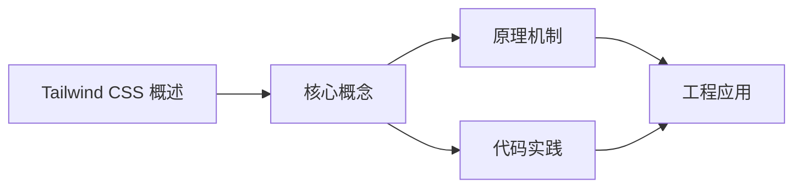
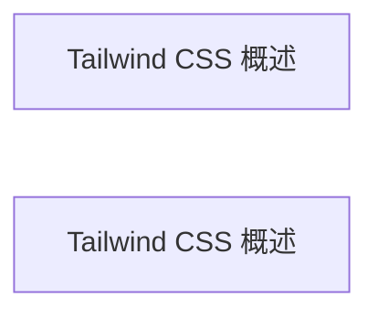

## 1. 学习目标（Bloom 分类）

本节按照布鲁姆教育目标分类学组织学习路径。本文主题为《Tailwind CSS 概述》，属于 Tailwind CSS 模块，读者可以根据自身阶段选择阅读深度。

记忆层面：能够准确复述本文的核心概念、术语与基本语法或操作步骤，并能够在提问或检索时快速定位对应知识点。能够说出 Tailwind CSS 的核心概念、工具与工作流。

理解层面：能够用自己的语言解释核心原理与工作机制，说明概念之间的因果关系，而不是机械记忆结论。能够解释 Tailwind CSS 的关键机制与设计取舍。

应用层面：能够在真实项目或练习场景中运用本文知识解决具体问题，写出正确且可维护的实现。能够独立完成 Tailwind CSS 的标准开发任务。

分析层面：能够拆解复杂问题，比较本文主题与相邻概念的异同，识别边界条件与例外情况。能够分析 Tailwind CSS 在真实项目中的问题与边界。

评价层面：能够根据约束条件（性能、可读性、安全、成本）评价不同方案的优劣，做出有依据的技术决策。能够评价 Tailwind CSS 相关技术选型。

创造层面：能够把本文知识与其他模块知识组合，设计出新的解决方案或可复用的工程模式。能够把 Tailwind CSS 集成进完整项目体系。

通过本节学习，读者应当能够把《Tailwind CSS 概述》纳入自己的知识网络，并与 Tailwind CSS 模块的其他主题（工具类、配置、主题、响应式）建立关联。

## 2. 历史动机与发展脉络

《Tailwind CSS 概述》是 Tailwind CSS 领域的重要主题。要真正理解它，需要先了解它解决的问题与演进过程。

Tailwind CSS 由 Adam Wathan 于 2017 年发布，定位“实用优先”（utility-first）的 CSS 框架；2023 年 Tailwind 4 重写为 CSS-first 配置与原生引擎。
核心理念：不预设组件样式，提供原子工具类（utilities），在 HTML 中组合出设计；配合设计令牌实现一致主题。
Tailwind 4：CSS 配置（@theme）、原生层叠、Vite 插件、自动内容检测；v3 的 tailwind.config.js 仍可兼容迁移。

回到本文主题：Tailwind CSS 概述 的提出与成熟，正是上述技术背景下的必然产物。早期实现往往以简单可用为目标，随着工程规模扩大，社区逐渐沉淀出标准做法与最佳实践；理解这一脉络，可以帮助读者判断“为什么文档中的推荐写法是现在这个样子”，也能在遇到历史遗留代码时准确识别其设计年代与取舍。


## 3. 形式化定义与核心概念精讲

本节把《Tailwind CSS 概述》涉及的核心概念以“定义 + 讲解”的形式展开。读者应把定义当作工具，把讲解当作理解路径；两者结合才能形成可迁移的知识。

工具类体系：布局（flex/grid）、间距（p-4/m-2）、排版（text-lg/font-bold）、颜色（bg-red-500）、响应式前缀（sm:/md:/lg:）。
内容检测：扫描源码中的类名，只生成使用到的 CSS（JIT）；内容配置决定扫描范围。
设计令牌：颜色/字体/间距在 @theme 定义，生成对应工具类；暗色模式用 dark: 变体。

### 3.1 原文章节逐一精讲

原文档把主题拆分为 9 个小节，下面按顺序给出每一节的导读讲解，随后保留原文细节供精读。

#### 原文精读（完整保留）


#### 1. Tailwind CSS 是什么

Tailwind CSS 是一个“实用优先”（utility-first）的 CSS 框架：它不提供预设组件，而是提供大量原子工具类（如 `flex`、`p-4`、`text-lg`），开发者直接在 HTML/组件中组合出设计。

2023 年发布的 Tailwind 4 重写了引擎：CSS-first 配置（`@theme`）、原生层叠、自动内容检测、Vite 插件原生集成，构建速度与产物体积大幅优化。

#### 2. 为什么需要工具类

传统“语义类”写法：

```css
.card {
  padding: 16px;
  border-radius: 8px;
  background: white;
  box-shadow: 0 2px 8px rgba(0,0,0,0.1);
}
```

工具类写法：

```html
<div class="rounded-lg bg-white p-4 shadow-md">内容</div>
```

工具类的优势：

第一，无需命名：不用为每个样式块起类名；

第二，约束一致：间距、颜色、字号来自设计令牌，不会出现随意值；

第三，删除安全：组件删除时样式自动消失，没有死代码；

第四，响应式内联：`sm:`、`md:` 前缀直接写在类名上。

#### 3. 核心语法

##### 3.1 布局

```html
<div class="flex items-center justify-between gap-4">
  <span>左</span>
  <span>右</span>
</div>

<div class="grid grid-cols-3 gap-4">
  <div>1</div><div>2</div><div>3</div>
</div>
```

##### 3.2 间距与尺寸

`p-4`（padding 16px）、`m-2`（margin 8px）、`w-1/2`、`h-screen`、`max-w-3xl`。数值基于间距刻度（0.25rem 基数）。

##### 3.3 排版

`text-sm`、`font-bold`、`tracking-wide`、`leading-relaxed`、`text-center`。

##### 3.4 颜色

`bg-red-500`、`text-blue-600`、`border-gray-200`。色板按色相-明度命名（50-950）。

#### 4. 响应式与状态

##### 4.1 响应式断点

```html
<div class="grid grid-cols-1 md:grid-cols-2 lg:grid-cols-4">
  <!-- 移动端 1 列，md 2 列，lg 4 列 -->
</div>
```

断点前缀：`sm`（640）、`md`（768）、`lg`（1024）、`xl`（1280）、`2xl`（1536），移动优先语义。

##### 4.2 状态变体

```html
<button class="bg-blue-500 hover:bg-blue-600 focus:outline-none active:bg-blue-700">
  按钮
</button>
```

常用变体：`hover:`、`focus:`、`active:`、`disabled:`、`group-hover:`、`peer-`。

##### 4.3 暗色模式

```html
<div class="bg-white dark:bg-gray-900 dark:text-gray-100">
  自动适配系统暗色偏好
</div>
```

#### 5. Tailwind 4 的 CSS-first 配置

```css
/* src/styles/global.css */
@import "tailwindcss";

/* 设计令牌：定义后自动生成 bg-primary、text-surface 等工具类 */
@theme {
  --color-primary: #1677ff;
  --color-surface: #ffffff;
  --color-text: #1f1f1f;
  --font-sans: "Inter", system-ui, sans-serif;
  --radius-card: 12px;
}
```

```html
<button class="bg-primary rounded-card px-4 py-2">主题按钮</button>
```

讲解：`@theme` 中定义的 `--color-primary` 生成 `bg-primary`、`text-primary`、`border-primary` 等全套工具类。主题切换只需覆盖变量。

#### 6. 与框架集成

##### 6.1 Vite + React

```bash
pnpm add tailwindcss @tailwindcss/vite
```

```ts
// vite.config.ts
import tailwindcss from '@tailwindcss/vite'

export default defineConfig({
  plugins: [tailwindcss()],
})
```

##### 6.2 Astro

Astro 使用同一 Vite 插件，在布局中 `@import "tailwindcss"` 即可全局生效。

##### 6.3 组件封装

配合 `class-variance-authority` 与 `clsx` 管理组件类名变体：

```tsx
import { cva } from 'class-variance-authority'

const button = cva('rounded-lg font-medium', {
  variants: {
    intent: {
      primary: 'bg-blue-500 text-white',
      ghost: 'bg-transparent text-blue-500',
    },
  },
})
```

#### 7. 常见陷阱

陷阱一：动态拼接类名。`bg-${color}-500` 无法被内容扫描识别。写完整类名或使用 safelist。

陷阱二：滥用 `@apply`。把工具类塞回 CSS 层增加复杂度；适度用于组件库基础类。

陷阱三：自定义断点碎片化。优先使用预设断点。

陷阱四：忽略暗色配置。确认使用系统策略还是 class 策略。

陷阱五：内联样式与工具类混用。统一工具类，保持主题一致。

#### 8. 参考资源

Tailwind 官方文档：https://tailwindcss.com/docs

Tailwind 中文文档：https://www.tailwindcss.cn/docs

Tailwind UI：https://tailwindui.com/

prettier-plugin-tailwindcss：https://github.com/tailwindlabs/prettier-plugin-tailwindcss

尚硅谷 Bilibili 空间：https://space.bilibili.com/302417610

#### 9. 小结

Tailwind 用“约束下的原子类”平衡了效率与一致性：设计令牌保证风格统一，工具类保证开发速度，变体体系覆盖响应式与状态。Tailwind 4 的 CSS-first 配置进一步简化了集成，是 FANDEX Web 端样式方案的核心。


### 3.2 概念关系图

下面用 Mermaid 图表达本文核心概念之间的关系，帮助读者建立整体图景：



图中展示的是本文知识的结构化关系：核心概念是入口，原理机制解释“为什么”，代码实践演示“怎么做”，工程应用回答“何时用”。读者学习时可以把每个小节的内容挂接到对应节点上。

## 4. 理论推导与原理解析

本节深入《Tailwind CSS 概述》背后的原理。理论部分不求面面俱到，而是聚焦“能解释现象、能指导实践”的关键推导。

工具类体系：布局（flex/grid）、间距（p-4/m-2）、排版（text-lg/font-bold）、颜色（bg-red-500）、响应式前缀（sm:/md:/lg:）。
内容检测：扫描源码中的类名，只生成使用到的 CSS（JIT）；内容配置决定扫描范围。
设计令牌：颜色/字体/间距在 @theme 定义，生成对应工具类；暗色模式用 dark: 变体。
组合与复用：@apply 提取重复类；组件类与工具类并存策略由团队约定。

需要强调的是，理论推导与工程实践之间存在翻译层：理论给出的是理想化模型与边界条件，工程代码则必须处理真实环境中的例外。读者在学习时应先掌握理论的“标准情形”，再通过陷阱章节了解“非标准情形”。

## 5. 代码示例与逐行讲解

本节把原文中的代码示例系统整理，并为每个示例补充用途说明与讲解。读者不应只浏览代码，而应逐段对照讲解理解设计意图。

### 5.1 示例：2. 为什么需要工具类

该示例来自原文《2. 为什么需要工具类》小节，用于演示Tailwind CSS 概述相关操作。阅读时请先看代码结构，再看其后的讲解。

```css
.card {
  padding: 16px;
  border-radius: 8px;
  background: white;
  box-shadow: 0 2px 8px rgba(0,0,0,0.1);
}
```

讲解：这段代码演示了本节核心知识点。代码中的关键操作可以归纳为三步：准备（定义或初始化）、执行（核心逻辑）、收尾（释放资源或返回结果）。实际项目中，这三步往往被封装为函数或类，以提升复用性与可测试性。

关键点分析：

该示例共 6 行有效代码，结构以数据或配置为主。阅读时应关注：数据字段的含义、配置项的作用，以及它们与运行行为的对应关系。

进阶思考路径：先尝试修改参数观察行为变化，再把示例中的模式迁移到自己的项目中；每次修改都记录预期与实测差异，这是把示例转化为能力的最快方式。

### 5.2 示例：2. 为什么需要工具类

该示例来自原文《2. 为什么需要工具类》小节，用于演示Tailwind CSS 概述相关操作。阅读时请先看代码结构，再看其后的讲解。

```html
<div class="rounded-lg bg-white p-4 shadow-md">内容</div>
```

讲解：这段代码演示了本节核心知识点。代码中的关键操作可以归纳为三步：准备（定义或初始化）、执行（核心逻辑）、收尾（释放资源或返回结果）。实际项目中，这三步往往被封装为函数或类，以提升复用性与可测试性。

关键点分析：

该示例共 1 行有效代码，包含 1 类关键结构（class）。其中：

- 入口与初始化部分负责建立上下文，对应实际项目中的启动或装配逻辑；
- 核心逻辑部分体现本文主题的主要操作，是阅读时最需要对照讲解理解的部分；
- 输出或返回部分把结果交给调用方，注意其类型与边界条件。

进阶思考路径：先尝试修改参数观察行为变化，再把示例中的模式迁移到自己的项目中；每次修改都记录预期与实测差异，这是把示例转化为能力的最快方式。

### 5.3 示例：3.1 布局

该示例来自原文《3.1 布局》小节，用于演示Tailwind CSS 概述相关操作。阅读时请先看代码结构，再看其后的讲解。

```html
<div class="flex items-center justify-between gap-4">
  <span>左</span>
  <span>右</span>
</div>

<div class="grid grid-cols-3 gap-4">
  <div>1</div><div>2</div><div>3</div>
</div>
```

讲解：这段代码演示了本节核心知识点。代码中的关键操作可以归纳为三步：准备（定义或初始化）、执行（核心逻辑）、收尾（释放资源或返回结果）。实际项目中，这三步往往被封装为函数或类，以提升复用性与可测试性。

关键点分析：

该示例共 7 行有效代码，包含 1 类关键结构（class）。其中：

- 入口与初始化部分负责建立上下文，对应实际项目中的启动或装配逻辑；
- 核心逻辑部分体现本文主题的主要操作，是阅读时最需要对照讲解理解的部分；
- 输出或返回部分把结果交给调用方，注意其类型与边界条件。

进阶思考路径：先尝试修改参数观察行为变化，再把示例中的模式迁移到自己的项目中；每次修改都记录预期与实测差异，这是把示例转化为能力的最快方式。

### 5.4 示例：4.1 响应式断点

该示例来自原文《4.1 响应式断点》小节，用于演示Tailwind CSS 概述相关操作。阅读时请先看代码结构，再看其后的讲解。

```html
<div class="grid grid-cols-1 md:grid-cols-2 lg:grid-cols-4">
  <!-- 移动端 1 列，md 2 列，lg 4 列 -->
</div>
```

讲解：这段代码演示了本节核心知识点。代码中的关键操作可以归纳为三步：准备（定义或初始化）、执行（核心逻辑）、收尾（释放资源或返回结果）。实际项目中，这三步往往被封装为函数或类，以提升复用性与可测试性。

关键点分析：

该示例共 3 行有效代码，包含 1 类关键结构（class）。其中：

- 入口与初始化部分负责建立上下文，对应实际项目中的启动或装配逻辑；
- 核心逻辑部分体现本文主题的主要操作，是阅读时最需要对照讲解理解的部分；
- 输出或返回部分把结果交给调用方，注意其类型与边界条件。

进阶思考路径：先尝试修改参数观察行为变化，再把示例中的模式迁移到自己的项目中；每次修改都记录预期与实测差异，这是把示例转化为能力的最快方式。

### 5.5 示例：4.2 状态变体

该示例来自原文《4.2 状态变体》小节，用于演示Tailwind CSS 概述相关操作。阅读时请先看代码结构，再看其后的讲解。

```html
<button class="bg-blue-500 hover:bg-blue-600 focus:outline-none active:bg-blue-700">
  按钮
</button>
```

讲解：这段代码演示了本节核心知识点。代码中的关键操作可以归纳为三步：准备（定义或初始化）、执行（核心逻辑）、收尾（释放资源或返回结果）。实际项目中，这三步往往被封装为函数或类，以提升复用性与可测试性。

关键点分析：

该示例共 3 行有效代码，包含 1 类关键结构（class）。其中：

- 入口与初始化部分负责建立上下文，对应实际项目中的启动或装配逻辑；
- 核心逻辑部分体现本文主题的主要操作，是阅读时最需要对照讲解理解的部分；
- 输出或返回部分把结果交给调用方，注意其类型与边界条件。

进阶思考路径：先尝试修改参数观察行为变化，再把示例中的模式迁移到自己的项目中；每次修改都记录预期与实测差异，这是把示例转化为能力的最快方式。

### 5.6 示例：4.3 暗色模式

该示例来自原文《4.3 暗色模式》小节，用于演示Tailwind CSS 概述相关操作。阅读时请先看代码结构，再看其后的讲解。

```html
<div class="bg-white dark:bg-gray-900 dark:text-gray-100">
  自动适配系统暗色偏好
</div>
```

讲解：这段代码演示了本节核心知识点。代码中的关键操作可以归纳为三步：准备（定义或初始化）、执行（核心逻辑）、收尾（释放资源或返回结果）。实际项目中，这三步往往被封装为函数或类，以提升复用性与可测试性。

关键点分析：

该示例共 3 行有效代码，包含 1 类关键结构（class）。其中：

- 入口与初始化部分负责建立上下文，对应实际项目中的启动或装配逻辑；
- 核心逻辑部分体现本文主题的主要操作，是阅读时最需要对照讲解理解的部分；
- 输出或返回部分把结果交给调用方，注意其类型与边界条件。

进阶思考路径：先尝试修改参数观察行为变化，再把示例中的模式迁移到自己的项目中；每次修改都记录预期与实测差异，这是把示例转化为能力的最快方式。

### 5.7 示例：5. Tailwind 4 的 CSS-first 配置

该示例来自原文《5. Tailwind 4 的 CSS-first 配置》小节，用于演示Tailwind CSS 概述相关操作。阅读时请先看代码结构，再看其后的讲解。

```css
/* src/styles/global.css */
@import "tailwindcss";

/* 设计令牌：定义后自动生成 bg-primary、text-surface 等工具类 */
@theme {
  --color-primary: #1677ff;
  --color-surface: #ffffff;
  --color-text: #1f1f1f;
  --font-sans: "Inter", system-ui, sans-serif;
  --radius-card: 12px;
}
```

讲解：这段代码演示了本节核心知识点。代码中的关键操作可以归纳为三步：准备（定义或初始化）、执行（核心逻辑）、收尾（释放资源或返回结果）。实际项目中，这三步往往被封装为函数或类，以提升复用性与可测试性。

关键点分析：

该示例共 10 行有效代码，包含 1 类关键结构（import）。其中：

- 入口与初始化部分负责建立上下文，对应实际项目中的启动或装配逻辑；
- 核心逻辑部分体现本文主题的主要操作，是阅读时最需要对照讲解理解的部分；
- 输出或返回部分把结果交给调用方，注意其类型与边界条件。

进阶思考路径：先尝试修改参数观察行为变化，再把示例中的模式迁移到自己的项目中；每次修改都记录预期与实测差异，这是把示例转化为能力的最快方式。

### 5.8 示例：5. Tailwind 4 的 CSS-first 配置

该示例来自原文《5. Tailwind 4 的 CSS-first 配置》小节，用于演示Tailwind CSS 概述相关操作。阅读时请先看代码结构，再看其后的讲解。

```html
<button class="bg-primary rounded-card px-4 py-2">主题按钮</button>
```

讲解：这段代码演示了本节核心知识点。代码中的关键操作可以归纳为三步：准备（定义或初始化）、执行（核心逻辑）、收尾（释放资源或返回结果）。实际项目中，这三步往往被封装为函数或类，以提升复用性与可测试性。

关键点分析：

该示例共 1 行有效代码，包含 1 类关键结构（class）。其中：

- 入口与初始化部分负责建立上下文，对应实际项目中的启动或装配逻辑；
- 核心逻辑部分体现本文主题的主要操作，是阅读时最需要对照讲解理解的部分；
- 输出或返回部分把结果交给调用方，注意其类型与边界条件。

进阶思考路径：先尝试修改参数观察行为变化，再把示例中的模式迁移到自己的项目中；每次修改都记录预期与实测差异，这是把示例转化为能力的最快方式。

### 5.9 示例：6.1 Vite + React

该示例来自原文《6.1 Vite + React》小节，用于演示Tailwind CSS 概述相关操作。阅读时请先看代码结构，再看其后的讲解。

```bash
pnpm add tailwindcss @tailwindcss/vite
```

讲解：这段代码演示了本节核心知识点。代码中的关键操作可以归纳为三步：准备（定义或初始化）、执行（核心逻辑）、收尾（释放资源或返回结果）。实际项目中，这三步往往被封装为函数或类，以提升复用性与可测试性。

关键点分析：

该示例共 1 行有效代码，结构以数据或配置为主。阅读时应关注：数据字段的含义、配置项的作用，以及它们与运行行为的对应关系。

进阶思考路径：先尝试修改参数观察行为变化，再把示例中的模式迁移到自己的项目中；每次修改都记录预期与实测差异，这是把示例转化为能力的最快方式。

### 5.10 示例：6.1 Vite + React

该示例来自原文《6.1 Vite + React》小节，用于演示Tailwind CSS 概述相关操作。阅读时请先看代码结构，再看其后的讲解。

```ts
// vite.config.ts
import tailwindcss from '@tailwindcss/vite'

export default defineConfig({
  plugins: [tailwindcss()],
})
```

讲解：这段代码演示了本节核心知识点。代码中的关键操作可以归纳为三步：准备（定义或初始化）、执行（核心逻辑）、收尾（释放资源或返回结果）。实际项目中，这三步往往被封装为函数或类，以提升复用性与可测试性。

关键点分析：

该示例共 5 行有效代码，包含 2 类关键结构（import、from）。其中：

- 入口与初始化部分负责建立上下文，对应实际项目中的启动或装配逻辑；
- 核心逻辑部分体现本文主题的主要操作，是阅读时最需要对照讲解理解的部分；
- 输出或返回部分把结果交给调用方，注意其类型与边界条件。

进阶思考路径：先尝试修改参数观察行为变化，再把示例中的模式迁移到自己的项目中；每次修改都记录预期与实测差异，这是把示例转化为能力的最快方式。

### 5.11 示例：6.3 组件封装

该示例来自原文《6.3 组件封装》小节，用于演示Tailwind CSS 概述相关操作。阅读时请先看代码结构，再看其后的讲解。

```tsx
import { cva } from 'class-variance-authority'

const button = cva('rounded-lg font-medium', {
  variants: {
    intent: {
      primary: 'bg-blue-500 text-white',
      ghost: 'bg-transparent text-blue-500',
    },
  },
})
```

讲解：这段代码演示了本节核心知识点。代码中的关键操作可以归纳为三步：准备（定义或初始化）、执行（核心逻辑）、收尾（释放资源或返回结果）。实际项目中，这三步往往被封装为函数或类，以提升复用性与可测试性。

关键点分析：

该示例共 9 行有效代码，包含 3 类关键结构（class、import、from）。其中：

- 入口与初始化部分负责建立上下文，对应实际项目中的启动或装配逻辑；
- 核心逻辑部分体现本文主题的主要操作，是阅读时最需要对照讲解理解的部分；
- 输出或返回部分把结果交给调用方，注意其类型与边界条件。

进阶思考路径：先尝试修改参数观察行为变化，再把示例中的模式迁移到自己的项目中；每次修改都记录预期与实测差异，这是把示例转化为能力的最快方式。


综合以上示例，可以总结出本主题的代码实践要点：第一，先定义清晰的输入输出契约；第二，核心逻辑保持单一职责；第三，错误处理与边界条件不可省略；第四，命名与注释表达意图而非复述代码。

## 6. 对比分析

对比是理解《Tailwind CSS 概述》定位的最快路径。下面从多个维度与相邻方案进行对比。

Tailwind 与 CSS Modules：Tailwind 全局工具类快速一致；CSS Modules 组件隔离。可混合。
Tailwind 与 Bootstrap：Bootstrap 预设组件开箱即用；Tailwind 灵活定制无预设。
v3 与 v4：v4 CSS-first 配置与原生性能；新项目用 v4。

对比的目的不是分出绝对优劣，而是建立选择依据：不同约束条件下，最优解不同。读者应把每个对比维度转化为决策检查清单。

## 7. 常见陷阱与最佳实践

本节整理该主题的高频错误与推荐做法。每个陷阱先描述现象，再解释原因，最后给出最佳实践。

### 7.1 类名遗漏扫描

动态拼接类名不被识别。完整类名写全，或 safelist。

深入讲解：该问题之所以被归类为“常见陷阱”，是因为它在初学者的代码中反复出现，而且往往不在第一时间暴露——错误通常隐藏在特定数据或特定时序下。

从成因上看，类名遗漏扫描 一般源于对 Tailwind CSS 某个机制的理解偏差：要么误用了默认行为，要么忽略了边界条件，要么把其他语言的思维惯性带了过来。

从影响上看，类名遗漏扫描 轻则产生错误结果，重则导致资源泄漏、数据损坏或安全事故；这也是为什么工程评审中会把它列为检查项。

从修复策略上看，处理类名遗漏扫描的正确顺序是：先复现（构造最小用例），再定位（确认机制层面的根因），最后修复并补充回归测试。跳过复现直接改代码，往往治标不治本。

### 7.2 滥用 @apply

回到“语义类”老路且增加复杂度。适度使用。

深入讲解：该问题之所以被归类为“常见陷阱”，是因为它在初学者的代码中反复出现，而且往往不在第一时间暴露——错误通常隐藏在特定数据或特定时序下。

从成因上看，滥用 @apply 一般源于对 Tailwind CSS 某个机制的理解偏差：要么误用了默认行为，要么忽略了边界条件，要么把其他语言的思维惯性带了过来。

从影响上看，滥用 @apply 轻则产生错误结果，重则导致资源泄漏、数据损坏或安全事故；这也是为什么工程评审中会把它列为检查项。

从修复策略上看，处理滥用 @apply的正确顺序是：先复现（构造最小用例），再定位（确认机制层面的根因），最后修复并补充回归测试。跳过复现直接改代码，往往治标不治本。

### 7.3 样式优先级

工具类冲突。用变体与顺序，避免 !important 泛滥。

深入讲解：该问题之所以被归类为“常见陷阱”，是因为它在初学者的代码中反复出现，而且往往不在第一时间暴露——错误通常隐藏在特定数据或特定时序下。

从成因上看，样式优先级 一般源于对 Tailwind CSS 某个机制的理解偏差：要么误用了默认行为，要么忽略了边界条件，要么把其他语言的思维惯性带了过来。

从影响上看，样式优先级 轻则产生错误结果，重则导致资源泄漏、数据损坏或安全事故；这也是为什么工程评审中会把它列为检查项。

从修复策略上看，处理样式优先级的正确顺序是：先复现（构造最小用例），再定位（确认机制层面的根因），最后修复并补充回归测试。跳过复现直接改代码，往往治标不治本。

### 7.4 响应式断点臆造

随意断点导致碎片化。遵循预设断点（sm/md/lg/xl/2xl）。

深入讲解：该问题之所以被归类为“常见陷阱”，是因为它在初学者的代码中反复出现，而且往往不在第一时间暴露——错误通常隐藏在特定数据或特定时序下。

从成因上看，响应式断点臆造 一般源于对 Tailwind CSS 某个机制的理解偏差：要么误用了默认行为，要么忽略了边界条件，要么把其他语言的思维惯性带了过来。

从影响上看，响应式断点臆造 轻则产生错误结果，重则导致资源泄漏、数据损坏或安全事故；这也是为什么工程评审中会把它列为检查项。

从修复策略上看，处理响应式断点臆造的正确顺序是：先复现（构造最小用例），再定位（确认机制层面的根因），最后修复并补充回归测试。跳过复现直接改代码，往往治标不治本。

### 7.5 主题覆盖混乱

直接改默认色值。统一在 @theme 定义。

深入讲解：该问题之所以被归类为“常见陷阱”，是因为它在初学者的代码中反复出现，而且往往不在第一时间暴露——错误通常隐藏在特定数据或特定时序下。

从成因上看，主题覆盖混乱 一般源于对 Tailwind CSS 某个机制的理解偏差：要么误用了默认行为，要么忽略了边界条件，要么把其他语言的思维惯性带了过来。

从影响上看，主题覆盖混乱 轻则产生错误结果，重则导致资源泄漏、数据损坏或安全事故；这也是为什么工程评审中会把它列为检查项。

从修复策略上看，处理主题覆盖混乱的正确顺序是：先复现（构造最小用例），再定位（确认机制层面的根因），最后修复并补充回归测试。跳过复现直接改代码，往往治标不治本。

### 7.6 暗色模式未配置

dark: 不生效。确认 darkMode 策略。

深入讲解：该问题之所以被归类为“常见陷阱”，是因为它在初学者的代码中反复出现，而且往往不在第一时间暴露——错误通常隐藏在特定数据或特定时序下。

从成因上看，暗色模式未配置 一般源于对 Tailwind CSS 某个机制的理解偏差：要么误用了默认行为，要么忽略了边界条件，要么把其他语言的思维惯性带了过来。

从影响上看，暗色模式未配置 轻则产生错误结果，重则导致资源泄漏、数据损坏或安全事故；这也是为什么工程评审中会把它列为检查项。

从修复策略上看，处理暗色模式未配置的正确顺序是：先复现（构造最小用例），再定位（确认机制层面的根因），最后修复并补充回归测试。跳过复现直接改代码，往往治标不治本。

### 7.7 构建产物大

全量生成。验证内容路径覆盖所有模板。

深入讲解：该问题之所以被归类为“常见陷阱”，是因为它在初学者的代码中反复出现，而且往往不在第一时间暴露——错误通常隐藏在特定数据或特定时序下。

从成因上看，构建产物大 一般源于对 Tailwind CSS 某个机制的理解偏差：要么误用了默认行为，要么忽略了边界条件，要么把其他语言的思维惯性带了过来。

从影响上看，构建产物大 轻则产生错误结果，重则导致资源泄漏、数据损坏或安全事故；这也是为什么工程评审中会把它列为检查项。

从修复策略上看，处理构建产物大的正确顺序是：先复现（构造最小用例），再定位（确认机制层面的根因），最后修复并补充回归测试。跳过复现直接改代码，往往治标不治本。

### 7.8 与内联样式混用

维护困难。统一工具类。

深入讲解：该问题之所以被归类为“常见陷阱”，是因为它在初学者的代码中反复出现，而且往往不在第一时间暴露——错误通常隐藏在特定数据或特定时序下。

从成因上看，与内联样式混用 一般源于对 Tailwind CSS 某个机制的理解偏差：要么误用了默认行为，要么忽略了边界条件，要么把其他语言的思维惯性带了过来。

从影响上看，与内联样式混用 轻则产生错误结果，重则导致资源泄漏、数据损坏或安全事故；这也是为什么工程评审中会把它列为检查项。

从修复策略上看，处理与内联样式混用的正确顺序是：先复现（构造最小用例），再定位（确认机制层面的根因），最后修复并补充回归测试。跳过复现直接改代码，往往治标不治本。

### 7.0 最佳实践总览

1. 设计令牌先行：颜色、字体、圆角、间距在主题中定义。
2. 组件模式：UI 组件用工具类组合，页面级样式保持声明式。
3. 响应式移动优先：默认样式为移动端，sm: 起增强。
4. 与框架集成：Vite 插件 + PostCSS，React/Vue 组件内直接使用。

把这些最佳实践固化为团队规范与代码评审检查项，是避免同类问题反复出现的关键。

## 8. 工程实践

本节把《Tailwind CSS 概述》放入真实工程场景，给出可复用的模式与组织方法。

设计系统落地：令牌 + 组件库（Radix + Tailwind）+ 暗色模式。
性能：JIT 产物极小；CDN 版仅原型。
质量：类名排序（prettier-plugin-tailwindcss）、lint 检查。

### 8.1 工程实践的原则拆解

以上工程实践可以归纳为四条原则。第一，配置与代码分离：Tailwind CSS 项目中环境差异应通过配置注入，而不是散落在代码分支中；这保证同一份代码可以在开发、测试、生产环境一致运行。

第二，接口稳定优先：对外接口（函数签名、协议、数据格式）一旦被消费方依赖，变更成本极高；设计时应预留扩展点并保持向后兼容。

第三，可观测性内置：日志、指标与追踪应该在功能开发时同步设计，而不是故障发生后补救；没有观测手段的模块等于黑盒。

第四，变更可回滚：任何发布都应有对应的回滚方案；数据库迁移、配置变更与代码发布一样需要版本管理与逆向路径。

### 8.2 实践落地的检查清单

- [ ] 设计系统落地：对照本节描述，检查当前项目是否已经落实；未落实的项列入技术债并排期处理。
- [ ] 性能：对照本节描述，检查当前项目是否已经落实；未落实的项列入技术债并排期处理。
- [ ] 质量：对照本节描述，检查当前项目是否已经落实；未落实的项列入技术债并排期处理。

工程实践的共性原则：配置与代码分离、接口稳定优先、可观测性内置、变更可回滚。这些原则适用于本主题的所有实现。

## 9. 案例研究

本节通过一个完整案例把《Tailwind CSS 概述》的知识串起来。案例按“需求分析、方案设计、实现、验证”四步展开。

需求：为文档站实现统一主题与暗色模式。
方案：@theme 定义令牌、dark 变体、组件类封装。
要点：语义色（primary/surface/text）而非裸色值。
验证：主题切换一致性、对比度、产物体积。

### 9.1 案例的扩展讨论

把案例中的方案放大到真实规模，需要额外考虑三个问题：

第一，规模：当数据量或并发量上升一个数量级时，原方案中的数据结构、缓存策略与任务调度是否仍然成立？通常需要引入分层与异步。

第二，团队：多人协作时，模块边界、接口契约与代码所有权必须明确；案例中的实现应拆分为可独立测试的单元，并配合文档说明设计意图。

第三，演进：上线后的需求变化不可避免；方案设计时应预留扩展点（配置化、插件化、事件化），并定期用真实指标验证假设。


案例研究的学习方法：先独立阅读需求，尝试在脑中形成方案，再对照实现与讲解，最后思考“如果约束变化（数据量、并发、团队规模），方案应如何调整”。

## 10. 知识要点总结与深入讲解

本节以讲解形式汇总全文要点，替代传统的习题与自测，读者不需要答题，只需跟随解释建立完整的认知框架。

关于《Tailwind CSS 概述》的核心结论：

Tailwind 的价值是“约束下的效率”：令牌与工具类保证一致与快速。
CSS-first 配置（v4）简化了工程集成。
好的团队规范：令牌统一、变体统一、组件复用。

原文档各小节的要点回顾：

- 1. Tailwind CSS 是什么：该小节围绕Tailwind CSS 概述展开具体细节，阅读时应关注其与核心结论的对应关系；每个小节都是核心结论在某一个侧面的展开。
- 2. 为什么需要工具类：该小节围绕Tailwind CSS 概述展开具体细节，阅读时应关注其与核心结论的对应关系；每个小节都是核心结论在某一个侧面的展开。
- 3. 核心语法：该小节围绕Tailwind CSS 概述展开具体细节，阅读时应关注其与核心结论的对应关系；每个小节都是核心结论在某一个侧面的展开。
- 4. 响应式与状态：该小节围绕Tailwind CSS 概述展开具体细节，阅读时应关注其与核心结论的对应关系；每个小节都是核心结论在某一个侧面的展开。
- 5. Tailwind 4 的 CSS-first 配置：该小节围绕Tailwind CSS 概述展开具体细节，阅读时应关注其与核心结论的对应关系；每个小节都是核心结论在某一个侧面的展开。
- 6. 与框架集成：该小节围绕Tailwind CSS 概述展开具体细节，阅读时应关注其与核心结论的对应关系；每个小节都是核心结论在某一个侧面的展开。
- 7. 常见陷阱：该小节围绕Tailwind CSS 概述展开具体细节，阅读时应关注其与核心结论的对应关系；每个小节都是核心结论在某一个侧面的展开。
- 8. 参考资源：该小节围绕Tailwind CSS 概述展开具体细节，阅读时应关注其与核心结论的对应关系；每个小节都是核心结论在某一个侧面的展开。
- 9. 小结：该小节围绕Tailwind CSS 概述展开具体细节，阅读时应关注其与核心结论的对应关系；每个小节都是核心结论在某一个侧面的展开。

把以上要点与第 3-9 节的内容对照复习，即可完成对本文主题的闭环学习。

## 11. 参考文献


Tailwind 官方文档：https://tailwindcss.com/docs
Tailwind 中文文档：https://www.tailwindcss.cn/docs
Tailwind UI 组件：https://tailwindui.com/
prettier-plugin-tailwindcss：https://github.com/tailwindlabs/prettier-plugin-tailwindcss

## 12. 延伸阅读


CSS 基础与变量，见 007-css 模块。
Astro + Tailwind 集成，见 055-astro 模块。
设计系统与主题，见 007-css 模块相关文档。
尚硅谷 Bilibili 空间（https://space.bilibili.com/302417610 ）提供 Tailwind 课程。

## 14. 模块知识图谱与学习路径

本文属于 Tailwind CSS 模块。为了把《Tailwind CSS 概述》放入完整的知识网络，下面列出本模块的全部主题并给出相互关联的导读。学习时建议按模块内顺序推进，并在每个文档中留意交叉引用。



上图为模块主题的推荐学习顺序示意图（仅展示前若干主题）。各主题之间存在三类关联：

第一，前置依赖关系：早期主题是后期主题的基础，例如环境与语法先行、进阶主题随后；

第二，横向并列关系：同一层级主题从不同角度覆盖模块能力，学习顺序可以按兴趣调整；

第三，工程组合关系：多个主题在真实项目中组合使用，例如配置、性能与安全主题往往出现在同一系统的不同层面。

### 14.1 模块主题速查表

| 文档 | 主题 | 与本文的关联 |
| --- | --- | --- |
| Tailwind CSS 概述 | 001-TailwindOverview | 本文自身 |

速查表的作用是让读者快速判断：哪些文档应在阅读本文前掌握（前置基础），哪些文档应在阅读本文后继续（延伸主题）。本模块的交叉引用体系即以此表为基础。

## 15. 术语表

下表整理《Tailwind CSS 概述》及 Tailwind CSS 模块中出现的高频术语，给出简明释义。术语按字母序或逻辑序排列，供查阅。

| 术语 | 释义 |
| --- | --- |
| 工具类体系 | 布局（flex/grid）、间距（p-4/m-2）、排版（text-lg/font-bold）、颜色（bg-red-500）、响应式前缀（sm:/md:/lg: |
| 内容检测 | 扫描源码中的类名，只生成使用到的 CSS（JIT）；内容配置决定扫描范围。 |
| 设计令牌 | 颜色/字体/间距在 @theme 定义，生成对应工具类；暗色模式用 dark: 变体。 |
| 组合与复用 | @apply 提取重复类；组件类与工具类并存策略由团队约定。 |
| 类名遗漏扫描（易错点） | 参见常见陷阱章节的详细讲解 |
| 滥用 @apply（易错点） | 参见常见陷阱章节的详细讲解 |
| 样式优先级（易错点） | 参见常见陷阱章节的详细讲解 |
| 响应式断点臆造（易错点） | 参见常见陷阱章节的详细讲解 |
| 主题覆盖混乱（易错点） | 参见常见陷阱章节的详细讲解 |
| 暗色模式未配置（易错点） | 参见常见陷阱章节的详细讲解 |

术语表与正文配合使用：先通读正文，遇到模糊术语回查本表；长期使用后术语会自然进入工作记忆。

## 13. 深度专题扩展

以下专题从不同角度深入本文主题，供有进阶需求的读者研读。每个专题独立成节，内容相互补充。

### 13.1 Tailwind 4 的 CSS-first 配置

@theme 块定义令牌：--color-primary 生成 bg-primary 等工具类。
原生层叠：@layer 管理 theme/base/components/utilities 顺序。
自动检测：源码扫描无需配置文件；自定义来源用 @source。
与 Vite：@tailwindcss/vite 插件一步集成。

### 13.2 组件复用策略

方案一：纯工具类 + 组件封装（React 组件、Astro 组件）。
方案二：@apply 提取可复用类（注意 v4 语法变化）。
方案三：CSS 变量 + 工具类组合，动态主题。
选择依据：团队规模、设计系统成熟度、主题需求。

## 16. 核心概念串讲（复习视角）

本节以“把知识讲给他人听”的方式，把《Tailwind CSS 概述》的核心概念重新串讲一遍。与前文按章节展开不同，这里的叙述更接近课堂总结：先说整体，再逐个展开，最后收束。

《Tailwind CSS 概述》属于 Tailwind CSS 模块。要理解它，先要理解它在模块中的位置：它解决的是该领域的一个具体问题，并依赖模块内若干前置概念；反过来，它又为后续进阶主题提供基础。

第一个概念是工具类体系。布局（flex/grid）、间距（p-4/m-2）、排版（text-lg/font-bold）、颜色（bg-red-500）、响应式前缀（sm:/md:/lg:）。

在实际使用中，工具类体系需要与相邻概念区分：它们的区别不在于名称，而在于适用条件与行为边界；这正是前文对比分析章节的意义。

第一个概念是内容检测。扫描源码中的类名，只生成使用到的 CSS（JIT）；内容配置决定扫描范围。

在实际使用中，内容检测需要与相邻概念区分：它们的区别不在于名称，而在于适用条件与行为边界；这正是前文对比分析章节的意义。

第一个概念是设计令牌。颜色/字体/间距在 @theme 定义，生成对应工具类；暗色模式用 dark: 变体。

在实际使用中，设计令牌需要与相邻概念区分：它们的区别不在于名称，而在于适用条件与行为边界；这正是前文对比分析章节的意义。

接下来是工具类体系。布局（flex/grid）、间距（p-4/m-2）、排版（text-lg/font-bold）、颜色（bg-red-500）、响应式前缀（sm:/md:/lg:）。

理解该原理的关键不是记住结论，而是记住“它从什么假设出发、推出了什么、假设不成立时会怎样”。带着这个框架复习，原理之间就会连成网络。

接下来是内容检测。扫描源码中的类名，只生成使用到的 CSS（JIT）；内容配置决定扫描范围。

理解该原理的关键不是记住结论，而是记住“它从什么假设出发、推出了什么、假设不成立时会怎样”。带着这个框架复习，原理之间就会连成网络。

接下来是设计令牌。颜色/字体/间距在 @theme 定义，生成对应工具类；暗色模式用 dark: 变体。

理解该原理的关键不是记住结论，而是记住“它从什么假设出发、推出了什么、假设不成立时会怎样”。带着这个框架复习，原理之间就会连成网络。

接下来是组合与复用。@apply 提取重复类；组件类与工具类并存策略由团队约定。

理解该原理的关键不是记住结论，而是记住“它从什么假设出发、推出了什么、假设不成立时会怎样”。带着这个框架复习，原理之间就会连成网络。

串讲收束：把概念与原理放回本文主题，可以得出一个总纲——定义描述是什么，原理解释为什么，实践回答怎么做。三者构成完整的学习闭环；后续遇到相关问题，都可以按这个总纲检索知识。
