<!-- ============ 文档分隔线：002-markdown/001-HeadingSyntax.md ============ -->

# 标题语法

> **符号约定**：`< >` 必填参数 | `[ ]` 可选参数

---

## ATX 风格标题

**单行写法：一级标题**
`# <标题文本>`
```markdown
# 一级标题
```

**单行写法：二级标题**
`## <标题文本>`
```markdown
## 二级标题
```

**单行写法：三级标题**
`### <标题文本>`
```markdown
### 三级标题
```

**单行写法：四级标题**
`#### <标题文本>`
```markdown
#### 四级标题
```

**单行写法：五级标题**
`##### <标题文本>`
```markdown
##### 五级标题
```

**单行写法：六级标题**
`###### <标题文本>`
```markdown
###### 六级标题
```

**换行写法：多级标题组合**
`# <标题 1>\n## <标题 2>\n### <标题 3>`
```markdown
# 文档标题
## 第一章
### 第一节
```

---

## Setext 风格标题

**单行写法：Setext 一级标题**
`<标题文本>\n===`
```markdown
Setext 风格一级标题
===
```

**单行写法：Setext 二级标题**
`<标题文本>\n---`
```markdown
Setext 风格二级标题
---
```

---

## 标题语法规则

**基本写法：# 后必须加空格**
`<#><空格><标题文本>`
```markdown
# 正确写法（# 后有空格）
```

**错误写法：# 后无空格**
`<#><标题文本>`
```markdown
#错误写法（# 后无空格，语法不生效）
```

**换行写法：标题前后加空行**
`\n<#> <标题文本>\n`
```markdown
正文内容

## 二级标题

正文内容
```


<!-- ============ 文档分隔线：002-markdown/002-Table.md ============ -->

# 表格

> **符号约定**：`< >` 必填参数 | `[ ]` 可选参数

---

## 基本表格

**换行写法：创建基本表格**
`| <表头 1> | <表头 2> |\n| --- | --- |\n| <单元格 1> | <单元格 2> |`
```markdown
| 姓名 | 年龄 |
| ---- | ---- |
| 张三 | 25   |
| 李四 | 30   |
```

**换行写法：三列表格**
`| <列 1> | <列 2> | <列 3> |\n| --- | --- | --- |\n| <值 1> | <值 2> | <值 3> |`
```markdown
| 姓名 | 年龄 | 城市 |
| ---- | ---- | ---- |
| 张三 | 25   | 北京 |
| 李四 | 30   | 上海 |
```

---

## 表格对齐

**单行写法：左对齐列**
`| :--- |`
```markdown
| 左对齐 |
| :----- |
| 内容   |
```

**单行写法：居中对齐列**
`| :---: |`
```markdown
| 居中对齐 |
| :------: |
|   内容   |
```

**单行写法：右对齐列**
`| ---: |`
```markdown
| 右对齐 |
| -----: |
|   内容 |
```

**换行写法：混合对齐表格**
`| :--- | :---: | ---: |`
```markdown
| 左对齐   | 居中对齐 | 右对齐 |
| :------- | :------: | -----: |
| 内容 1   |  内容 2  |   内容 3 |
```

---

## 表格中的特殊内容

**单行写法：表格中换行使用 br 标签**
`| <文本><br><文本> |`
```markdown
| 地址 |
| ---- |
| 北京市朝阳区<br>建国路 88 号 |
```

**单行写法：表格中的链接**
`| [<文本>](<URL>) |`
```markdown
| 链接 |
| ---- |
| [GitHub](https://github.com) |
```

**单行写法：表格中的行内代码**
`| `<代码>` |`
```markdown
| 代码 |
| ---- |
| `print('Hello')` |
```

**单行写法：表格中转义管道符**
`| <文本>\|<文本> |`
```markdown
| 命令 |
| ---- |
| `grep \| file` |
```

---

## 合并单元格

**换行写法：使用 HTML colspan 合并单元格**
`<th colspan="<N>">`
```markdown
<table>
  <tr>
    <th colspan="2">个人信息</th>
  </tr>
  <tr>
    <td>姓名</td>
    <td>张三</td>
  </tr>
</table>
```

**换行写法：使用 HTML rowspan 合并单元格**
`<td rowspan="<N>">`
```markdown
<table>
  <tr>
    <td rowspan="2">部门 A</td>
    <td>张三</td>
  </tr>
  <tr>
    <td>李四</td>
  </tr>
</table>
```


<!-- ============ 文档分隔线：002-markdown/003-CodeBlockSyntaxHighlight.md ============ -->

# 代码块与语法高亮

> **符号约定**：`< >` 必填参数 | `[ ]` 可选参数

---

## 行内代码

**单行写法：使用反引号包裹行内代码**
`` `<代码>` ``
```markdown
使用 `console.log()` 输出内容
```

---

## 基本代码块

**换行写法：使用三个反引号创建代码块**
` ``` \n<代码>\n``` `
```markdown
```
function hello() {
  console.log('Hello, World!');
}
```
```

---

## 语法高亮

**换行写法：指定 JavaScript 语言高亮**
` ```javascript \n<代码>\n``` `
```markdown
```javascript
function hello() {
  console.log('Hello, World!');
}
```
```

**换行写法：指定 Python 语言高亮**
` ```python \n<代码>\n``` `
```markdown
```python
def hello():
    print('Hello, World!')
```
```

**换行写法：指定 Java 语言高亮**
` ```java \n<代码>\n``` `
```markdown
```java
public class Hello {
    public static void main(String[] args) {
        System.out.println("Hello, World!");
    }
}
```
```

**换行写法：指定 SQL 语言高亮**
` ```sql \n<代码>\n``` `
```markdown
```sql
SELECT * FROM users WHERE age > 18;
```
```

**换行写法：指定 JSON 语言高亮**
` ```json \n<代码>\n``` `
```markdown
```json
{
  "name": "John",
  "age": 30
}
```
```

**换行写法：指定 YAML 语言高亮**
` ```yaml \n<代码>\n``` `
```markdown
```yaml
server:
  port: 8080
```
```

**换行写法：指定 Bash 语言高亮**
` ```bash \n<代码>\n``` `
```markdown
```bash
echo "Hello, World!"
```
```

---

## 常用语言标识符

**单行写法：C 语言标识符**
` ```c `
```markdown
```c
printf("Hello, World!");
```
```

**单行写法：C++ 语言标识符**
` ```cpp `
```markdown
```cpp
cout << "Hello, World!";
```
```

**单行写法：C# 语言标识符**
` ```csharp `
```markdown
```csharp
Console.WriteLine("Hello, World!");
```
```

**单行写法：Go 语言标识符**
` ```go `
```markdown
```go
fmt.Println("Hello, World!")
```
```

**单行写法：Rust 语言标识符**
` ```rust `
```markdown
```rust
println!("Hello, World!");
```
```

**单行写法：Kotlin 语言标识符**
` ```kotlin `
```markdown
```kotlin
println("Hello, World!")
```
```

**单行写法：HTML 语言标识符**
` ```html `
```markdown
```html
<p>Hello, World!</p>
```
```

**单行写法：CSS 语言标识符**
` ```css `
```markdown
```css
body { color: red; }
```
```

**单行写法：PHP 语言标识符**
` ```php `
```markdown
```php
echo "Hello, World!";
```
```

---

## 代码块高级功能

**换行写法：显示行号**
` ```<语言> {linenos} `
```markdown
```javascript {linenos}
function hello() {
  console.log('Hello, World!');
}
```
```

**换行写法：高亮特定行**
` ```<语言> {hl_lines=[<行号>]} `
```markdown
```javascript {hl_lines=[2,4]}
function hello() {
  console.log('Hello, World!');
}
hello();
```
```

---

## 代码块中的反引号

**换行写法：使用四个反引号包围含三个反引号的代码**
` ```` \n```<代码> \n```` `
````markdown
```
代码块中包含三个反引号
```
````

---

## 数学公式代码块

**换行写法：使用 math 语言标识符**
` ```math \n<公式>\n``` `
````markdown
```math
E = mc^2
```
````


<!-- ============ 文档分隔线：002-markdown/004-ParagraphLineBreak.md ============ -->

# 段落与换行

> **符号约定**：`< >` 必填参数 | `[ ]` 可选参数

---

## 段落

**单行写法：单行段落**
`<文本>`
```markdown
这是一个段落。
```

**换行写法：空行分隔多个段落**
`<文本>\n\n<文本>`
```markdown
这是第一个段落。

这是第二个段落。
```

---

## 换行

**单行写法：行尾两个空格换行**
`<文本>  \n<文本>`
```markdown
这是第一行  
这是第二行
```

**单行写法：HTML br 标签换行**
`<文本><br>\n<文本>`
```markdown
这是第一行<br>
这是第二行
```

**单行写法：反斜杠换行**
`<文本>\\n<文本>`
```markdown
这是第一行\
这是第二行
```

---

## 空行

**换行写法：元素间用空行分隔**
`<元素>\n\n<元素>`
```markdown
# 标题

这是一个段落。

- 列表项 1
- 列表项 2
```

**换行写法：代码块前后加空行**
`<文本>\n\n```<语言>\n<代码>\n```\n\n<文本>`
````markdown
正文内容

```python
print("Hello!")
```

另一个段落
````


<!-- ============ 文档分隔线：002-markdown/005-BasicTextFormat.md ============ -->

# 基础文本格式

> **符号约定**：`< >` 必填参数 | `[ ]` 可选参数

---

## 斜体

**单行写法：使用星号包裹斜体**
`*<文本>*`
```markdown
*斜体文本*
```

**单行写法：使用下划线包裹斜体**
`_<文本>_`
```markdown
_斜体文本_
```

---

## 粗体

**单行写法：使用双星号包裹粗体**
`**<文本>**`
```markdown
**粗体文本**
```

**单行写法：使用双下划线包裹粗体**
`__<文本>__`
```markdown
__粗体文本__
```

---

## 粗斜体

**单行写法：使用三星号包裹粗斜体**
`***<文本>***`
```markdown
***粗斜体文本***
```

**单行写法：使用三下划线包裹粗斜体**
`___<文本>___`
```markdown
___粗斜体文本___
```

---

## 删除线

**单行写法：使用双波浪号包裹删除线**
`~~<文本>~~`
```markdown
~~删除线文本~~
```

---

## 下划线

**单行写法：使用 HTML u 标签**
`<u><文本></u>`
```markdown
<u>下划线文本</u>
```

---

## 上标与下标

**单行写法：使用 HTML sup 标签创建上标**
`<sup><文本></sup>`
```markdown
2<sup>2</sup> = 4
```

**单行写法：使用 HTML sub 标签创建下标**
`<sub><文本></sub>`
```markdown
H<sub>2</sub>O
```

---

## 高亮文本

**单行写法：使用双等号包裹高亮文本**
`==<文本>==`
```markdown
==高亮文本==
```

---

## 行内代码

**单行写法：使用反引号包裹行内代码**
`` `<文本>` ``
```markdown
使用 `console.log()` 输出内容
```


<!-- ============ 文档分隔线：002-markdown/006-Footnote.md ============ -->

# 脚注

> **符号约定**：`< >` 必填参数 | `[ ]` 可选参数

---

## 基本语法

**单行写法：在正文中标记脚注引用**
`<文本>[^<标识符>]`
```markdown
这是一段正文[^1]。
```

**单行写法：定义脚注内容**
`[^<标识符>]: <脚注内容>`
```markdown
[^1]: 这是第一个脚注的内容。
```

**换行写法：完整脚注用法**
`<文本>[^<标识符>]\n\n[^<标识符>]: <脚注内容>`
```markdown
这是一段正文[^1]。

[^1]: 这是脚注的内容。
```

---

## 脚注标签类型

**单行写法：数字标签**
`[^<数字>]`
```markdown
正文内容[^1]。
```

**单行写法：描述标签**
`[^<描述>]`
```markdown
正文内容[^source]。
```

**换行写法：描述标签完整用法**
`<文本>[^<描述>]\n\n[^<描述>]: <内容>`
```markdown
正文内容[^source]。

[^source]: 这是来源说明。
```

---

## 多行脚注

**换行写法：使用缩进延续多行脚注**
`[^<标识符>]: <第一行>\n    <第二行>`
```markdown
[^long]:
    这是第一行。
    这是第二行（缩进4个空格）。
```

---

## 多次引用同一脚注

**换行写法：同一标识符多次引用**
`<文本>[^<标识符>] ... <文本>[^<标识符>]`
```markdown
TypeScript[^ts] 是 JavaScript 的超集。
TypeScript[^ts] 添加了静态类型检查。

[^ts]: TypeScript 由 Microsoft 开发。
```

---

## 脚注中的 Markdown

**单行写法：脚注中包含链接和代码**
`[^<标识符>]: <Markdown 内容>`
```markdown
[^api]: 参见 [API 文档](https://example.com/api) 中关于 `fetch()` 的说明。
```

---

## 行内脚注

**单行写法：Obsidian 行内脚注**
`<文本>^[<脚注内容>]`
```markdown
正文内容^[这是行内脚注，无需单独定义。]
```

---

## 替代方案

**换行写法：行内链接替代脚注**
`<文本>[<编号>]\n\n[<编号>]: <引用内容>`
```markdown
根据研究[1]。

[1] Smith, J. "Deep Learning Survey." 2023.
```

**换行写法：HTML 锚点替代脚注**
`<a href="#<锚点>">[<编号>]</a>`
```markdown
根据研究<a href="#ref1">[1]</a>。

<a name="ref1"></a>
1. Smith, J. "Deep Learning Survey." 2023.
```


<!-- ============ 文档分隔线：002-markdown/007-LinkImage.md ============ -->

# 链接与图片

> **符号约定**：`< >` 必填参数 | `[ ]` 可选参数

---

## 行内链接

**单行写法：基本行内链接**
`[<链接文本>](<URL>)`
```markdown
[Markdown 指南](https://www.markdownguide.org)
```

**单行写法：带标题的行内链接**
`[<链接文本>](<URL> "<标题>")`
```markdown
[GitHub](https://github.com "GitHub 官方网站")
```

---

## 引用链接

**换行写法：定义引用链接**
`[<链接文本>][<引用标识符>]\n[<引用标识符>]: <URL> ["<标题>"]`
```markdown
[GitHub][github]

[github]: https://github.com "GitHub 官方网站"
```

---

## 自动链接

**单行写法：URL 自动链接**
`<<URL>>`
```markdown
<https://github.com>
```

**单行写法：邮箱自动链接**
`<<邮箱>>`
```markdown
<user@example.com>
```

---

## 相对链接

**单行写法：指向本地文件**
`[<链接文本>](<相对路径>)`
```markdown
[README 文件](./README.md)
```

**单行写法：指向上级目录**
`[<链接文本>](<相对路径>)`
```markdown
[图片目录](../assets/)
```

---

## 基本图片

**单行写法：插入图片**
``
```markdown

```

**单行写法：带标题的图片**
``
```markdown

```

---

## 引用图片

**换行写法：定义引用图片**
`![<替代文本>][<图片引用标识符>]\n[<图片引用标识符>]: <图片URL> ["<标题>"]`
```markdown
![GitHub Logo][github-logo]

[github-logo]: https://github.githubassets.com/logo.png "GitHub Logo"
```

---

## 本地图片

**单行写法：使用相对路径插入本地图片**
``
```markdown

```

---

## 图片链接

**单行写法：将图片嵌套在链接中**
`[](<链接URL>)`
```markdown
[](https://github.com)
```

---

## 图片大小控制

**单行写法：使用 HTML img 标签控制大小**
`" alt="<替代文本>" width="<宽>" height="<高>" />`
```markdown

```

**单行写法：仅控制宽度**
`" alt="<替代文本>" width="<宽>" />`
```markdown

```


<!-- ============ 文档分隔线：002-markdown/008-ListSyntax.md ============ -->

# 列表语法

> **符号约定**：`< >` 必填参数 | `[ ]` 可选参数

---

## 无序列表

**单行写法：使用减号创建无序列表项**
`- <列表项>`
```markdown
- 无序列表项
```

**单行写法：使用星号创建无序列表项**
`* <列表项>`
```markdown
* 无序列表项
```

**单行写法：使用加号创建无序列表项**
`+ <列表项>`
```markdown
+ 无序列表项
```

**换行写法：多行无序列表**
`- <项 1>\n- <项 2>\n- <项 3>`
```markdown
- 无序列表项 1
- 无序列表项 2
- 无序列表项 3
```

**换行写法：列表项内换行对齐**
`- <第一行>\n  <第二行>`
```markdown
- 这是一个很长的列表项，
  换行后需要与第一行文本对齐
```

---

## 有序列表

**单行写法：创建有序列表项**
`<数字>. <列表项>`
```markdown
1. 有序列表项
```

**换行写法：多行有序列表**
`1. <项 1>\n2. <项 2>\n3. <项 3>`
```markdown
1. 有序列表项 1
2. 有序列表项 2
3. 有序列表项 3
```

**换行写法：序号自动调整**
`1. <项 1>\n1. <项 2>\n1. <项 3>`
```markdown
1. 第一项
1. 第二项
1. 第三项
```

---

## 任务列表

**单行写法：未完成任务项**
`- [ ] <列表项>`
```markdown
- [ ] 未完成的待办任务
```

**单行写法：已完成任务项**
`- [x] <列表项>`
```markdown
- [x] 已完成的待办任务
```

**换行写法：混合任务列表**
`- [ ] <项 1>\n- [x] <项 2>`
```markdown
- [ ] 未完成任务
- [x] 已完成任务
```

---

## 嵌套列表

**换行写法：无序嵌套列表**
`- <一级项>\n    - <二级项>`
```markdown
- 一级无序列表项
    - 二级无序列表项
```

**换行写法：三级嵌套列表**
`- <一级项>\n    - <二级项>\n        - <三级项>`
```markdown
- 一级项
    - 二级项
        - 三级项
```

**换行写法：无序与有序混合嵌套**
`- <无序项>\n    1. <有序项>`
```markdown
- 无序列表项
    1. 有序列表项
    2. 有序列表项
```

---

## 列表中使用代码块

**换行写法：列表中嵌入代码块**
`- <项>\n\n  ```<语言>\n  <代码>\n  ````
```markdown
- 列表项 1

  ```python
  print("Hello, World!")
  ```

- 列表项 2
```

---

## 列表中使用引用

**换行写法：列表中嵌入引用**
`- <项>\n  > <引用>`
```markdown
- 列表项 1
  > 这是一个引用
  > 可以跨越多行
- 列表项 2
```


<!-- ============ 文档分隔线：002-markdown/009-Strikethrough.md ============ -->

# 删除线

> **符号约定**：`< >` 必填参数 | `[ ]` 可选参数

---

## 基本语法

**单行写法：使用双波浪号包裹删除线**
`~~<文本>~~`
```markdown
~~这段文字会被加上删除线~~
```

---

## 语法规则

**单行写法：双波浪号必须成对出现**
`~~<文本>~~`
```markdown
~~正确写法~~
```

**错误写法：单波浪号无效**
`~<文本>~`
```markdown
~错误写法~（单波浪号无效）
```

**错误写法：未闭合标记**
`~~<文本>`
```markdown
~~ 未闭合（缺少结束标记）
```

**基本写法：波浪号与文本之间不能有空格**
`~~<文本>~~`
```markdown
~~正确~~
```

**错误写法：有空格时标记不生效**
`~~ <文本> ~~`
```markdown
~~ 错误 ~~（空格会被保留）
```

---

## 与其他格式组合

**单行写法：删除线与斜体组合**
`~~_<文本>_~~`
```markdown
~~_删除且斜体_~~
```

**单行写法：删除线与粗体组合**
`~~**<文本>**~~`
```markdown
~~**删除且粗体**~~
```

**单行写法：删除线与粗斜体组合**
`~~**_<文本>_**~~`
```markdown
~~**_删除且粗斜体_**~~
```

**单行写法：删除线与行内代码组合**
`~~`<代码>`~~`
```markdown
~~`删除的代码`~~
```

---

## HTML 替代

**单行写法：使用 del 标签**
`<del><文本></del>`
```markdown
<del>这段文字会被加上删除线</del>
```

**单行写法：使用 s 标签**
`<s><文本></s>`
```markdown
<s>这段文字会被加上删除线</s>
```

**单行写法：使用 strike 标签**
`<strike><文本></strike>`
```markdown
<strike>这段文字会被加上删除线</strike>
```

**单行写法：del 标签带日期属性**
`<del datetime="<日期>"><文本></del>`
```markdown
<del datetime="2026-06-14">已删除的内容</del>
```

**单行写法：del 标签带引用属性**
`<del cite="<引用URL>"><文本></del>`
```markdown
<del cite="https://example.com/reason">删除原因见链接</del>
```

---

## 使用场景

**单行写法：价格标注**
`~~<原价>~~ <现价>`
```markdown
限时优惠：~~¥299~~ ¥199
```

**单行写法：文档修订**
`~~<旧内容>~~ <新内容>`
```markdown
项目使用 ~~Webpack~~ Vite 作为构建工具。
```

**换行写法：变更记录列表**
`- ~~<旧方法>~~ → <新方法>`
```markdown
- ~~`oldMethod()`~~ → `newMethod()`
- ~~`Config.default`~~ → `Config.defaults`
```


<!-- ============ 文档分隔线：002-markdown/010-EscapeCharacter.md ============ -->

# 转义字符

> **符号约定**：`< >` 必填参数 | `[ ]` 可选参数

---

## 反斜杠转义

**单行写法：转义星号**
`\*<文本>\*`
```markdown
\*不是强调\*
```

**单行写法：转义井号**
`\#<文本>`
```markdown
\#不是标题
```

**单行写法：转义反引号**
`` \`<文本>\` ``
```markdown
\`不是代码
```

---

## 可转义字符

**单行写法：转义反斜杠**
`\\`
```markdown
\\   反斜杠
```

**单行写法：转义反引号**
`\``
```markdown
\`   反引号
```

**单行写法：转义星号**
`\*`
```markdown
\*   星号
```

**单行写法：转义下划线**
 `\_`
```markdown
\_   下划线
```

**单行写法：转义花括号**
`\{` | `\}`
```markdown
\{   左花括号
\}   右花括号
```

**单行写法：转义方括号**
`\[` | `\]`
```markdown
\[   左方括号
\]   右方括号
```

**单行写法：转义圆括号**
`\(` | `\)`
```markdown
\(   左圆括号
\)   右圆括号
```

**单行写法：转义井号**
`\#`
```markdown
\#   井号
```

**单行写法：转义加号**
`\+`
```markdown
\+   加号
```

**单行写法：转义减号**
`\-`
```markdown
\-   减号
```

**单行写法：转义句点**
`\.`
```markdown
\.   句点
```

**单行写法：转义感叹号**
`\!`
```markdown
\!   感叹号
```

**单行写法：转义管道符**
`\|`
```markdown
\|   管道符
```

---

## 转义规则

**基本写法：反斜杠后跟可转义字符时原样显示**
`\<可转义字符>`
```markdown
\*不是强调\*
```

**基本写法：反斜杠后跟不可转义字符时反斜杠保留**
`\<不可转义字符>`
```markdown
\A → \A
```

**单行写法：反斜杠在行尾表示硬换行**
`<文本>\`
```markdown
第一行\
第二行
```

---

## HTML 实体转义

**单行写法：小于号实体**
`&lt;`
```markdown
&lt;   小于号 <
```

**单行写法：大于号实体**
`&gt;`
```markdown
&gt;   大于号 >
```

**单行写法：& 符号实体**
`&amp;`
```markdown
&amp;   & 符号
```

**单行写法：双引号实体**
`&quot;`
```markdown
&quot;   双引号 "
```

**单行写法：单引号实体**
`&apos;`
```markdown
&apos;   单引号 '
```

**单行写法：版权符号实体**
`&copy;`
```markdown
&copy;   版权符号
```

**单行写法：注册商标实体**
`&reg;`
```markdown
&reg;   注册商标
```

**单行写法：商标符号实体**
`&trade;`
```markdown
&trade;   商标符号
```

**单行写法：不换行空格实体**
`&nbsp;`
```markdown
&nbsp;   不换行空格
```

---

## 表格中的管道符

**单行写法：表格中转义管道符**
`\|`
```markdown
| 命令 |
| ---- |
| `grep \| file` |
```

**单行写法：使用 HTML 实体转义管道符**
`&#124;`
```markdown
| 命令 |
| ---- |
| `grep &#124; file` |
```

---

## 代码块中的转义

**换行写法：代码块内不需要转义**
` ``` \n<任意字符>\n``` `
```markdown
```
*这是代码块中的星号，不需要转义*
`这也是，不需要转义`
```
```


<!-- ============ 文档分隔线：002-markdown/011-AutoLink.md ============ -->

# 自动链接

> **符号约定**：`< >` 必填参数 | `[ ]` 可选参数

---

## 尖括号自动链接

**单行写法：URL 自动链接**
`<<URL>>`
```markdown
<https://github.com>
```

**单行写法：带路径的 URL 自动链接**
`<<URL>>`
```markdown
<http://example.com/path?q=1>
```

**单行写法：邮箱自动链接**
`<<邮箱>>`
```markdown
<user@example.com>
```

---

## GFM 裸 URL 自动链接

**单行写法：裸 URL 自动识别**
`<URL>`
```markdown
访问 https://github.com 了解更多
```

**单行写法：裸 www 地址自动识别**
`www.<域名>`
```markdown
浏览 www.example.com 查看
```

**单行写法：裸邮箱自动识别**
`<邮箱>`
```markdown
联系 user@example.com 获取更多信息
```

---

## 自动链接规则

**基本写法：URL 必须包含协议**
`<http://> | <https://>`
```markdown
<https://example.com>
```

**错误写法：缺少协议无效**
`<域名>`
```markdown
<example.com>（无效，缺少协议）
```

**基本写法：尖括号内不能有空格**
`<<URL>>`
```markdown
<https://example.com>
```

**错误写法：有空格无效**
`< <URL> >`
```markdown
< https://example.com >（无效，有空格）
```

---

## 自定义链接文本

**单行写法：使用标准链接语法自定义文本**
`[<文本>](<URL>)`
```markdown
[GitHub](https://github.com)
```

**换行写法：自动链接与标准链接对比**
`<<URL>> | [<文本>](<URL>)`
```markdown
<https://github.com>

[GitHub](https://github.com)
```

---

## 新窗口打开

**单行写法：使用 HTML a 标签在新窗口打开**
`<a href="<URL>" target="_blank"><文本></a>`
```markdown
<a href="https://example.com" target="_blank">在新窗口打开</a>
```

**单行写法：添加 nofollow 属性**
`<a href="<URL>" rel="nofollow"><文本></a>`
```markdown
<a href="https://example.com" rel="nofollow">不追踪的链接</a>
```

**单行写法：同时设置新窗口和 nofollow**
`<a href="<URL>" target="_blank" rel="nofollow"><文本></a>`
```markdown
<a href="https://example.com" target="_blank" rel="nofollow">新窗口且不追踪</a>
```


<!-- ============ 文档分隔线：002-markdown/012-LaTeXMathFormula.md ============ -->

# LaTeX 数学公式

> **符号约定**：`< >` 必填参数 | `[ ]` 可选参数

---

## 行内公式

**单行写法：使用单个 $ 包裹行内公式**
`$<公式>$`
```markdown
质能方程 $E = mc^2$ 是物理学最著名的公式之一。
```

---

## 块级公式

**换行写法：使用双 $$ 包裹块级公式**
`$$\n<公式>\n$$`
```markdown
$$
E = mc^2
$$
```

---

## 上标与下标

**单行写法：上标使用 ^ 符号**
`$<底>^<指数>$`
```markdown
$x^2$
```

**单行写法：多字符上标使用花括号**
`$<底>^{<指数>}$`
```markdown
$x^{10}$
```

**单行写法：下标使用 _ 符号**
`$<底>_<下标>$`
```markdown
$a_n$
```

**单行写法：多字符下标使用花括号**
`$<底>_{<下标>}$`
```markdown
$a_{ij}$
```

**单行写法：上下标组合**
`$<底>_<下标>^<指数>$`
```markdown
$x_1^2$
```

---

## 分数

**单行写法：基本分数**
`$\frac{<分子>}{<分母>}$`
```markdown
$\frac{a}{b}$
```

**单行写法：大分数**
`$\dfrac{<分子>}{<分母>}$`
```markdown
$\dfrac{a}{b}$
```

**单行写法：连分数**
`$\cfrac{<分子>}{<分母>}$`
```markdown
$\cfrac{1}{1+\cfrac{1}{1+\cfrac{1}{1}}}$
```

---

## 根号

**单行写法：平方根**
`$\sqrt{<表达式>}$`
```markdown
$\sqrt{2}$
```

**单行写法：n 次方根**
`$\sqrt[<n>]{<表达式>}$`
```markdown
$\sqrt[3]{8}$
```

---

## 希腊字母

**单行写法：小写希腊字母 alpha**
`$\alpha$`
```markdown
$\alpha$
```

**单行写法：小写希腊字母 beta**
`$\beta$`
```markdown
$\beta$
```

**单行写法：小写希腊字母 gamma**
`$\gamma$`
```markdown
$\gamma$
```

**单行写法：小写希腊字母 delta**
`$\delta$`
```markdown
$\delta$
```

**单行写法：小写希腊字母 theta**
`$\theta$`
```markdown
$\theta$
```

**单行写法：小写希腊字母 lambda**
`$\lambda$`
```markdown
$\lambda$
```

**单行写法：小写希腊字母 pi**
`$\pi$`
```markdown
$\pi$
```

**单行写法：小写希腊字母 sigma**
`$\sigma$`
```markdown
$\sigma$
```

**单行写法：小写希腊字母 omega**
`$\omega$`
```markdown
$\omega$
```

**单行写法：大写希腊字母 Gamma**
`$\Gamma$`
```markdown
$\Gamma$
```

**单行写法：大写希腊字母 Delta**
`$\Delta$`
```markdown
$\Delta$
```

**单行写法：大写希腊字母 Sigma**
`$\Sigma$`
```markdown
$\Sigma$
```

**单行写法：大写希腊字母 Omega**
`$\Omega$`
```markdown
$\Omega$
```

---

## 求和与积分

**单行写法：求和**
`$\sum_{<下界>}^{<上界>} <表达式>$`
```markdown
$\sum_{i=1}^{n} i$
```

**单行写法：乘积**
`$\prod_{<下界>}^{<上界>} <表达式>$`
```markdown
$\prod_{i=1}^{n} i$
```

**单行写法：定积分**
`$\int_{<下界>}^{<上界>} <表达式> d<变量>$`
```markdown
$\int_{0}^{\infty} f(x) dx$
```

**单行写法：二重积分**
`$\iint_{<区域>} <表达式> d<变量>$`
```markdown
$\iint_{D} f(x,y) dA$
```

**单行写法：环路积分**
`$\oint_{<路径>} <表达式>$`
```markdown
$\oint_{C} F \cdot dr$
```

---

## 极限与导数

**单行写法：极限**
`$\lim_{<变量> \to <值>} <表达式>$`
```markdown
$\lim_{x \to \infty} f(x)$
```

**单行写法：导数**
`$\frac{d<因变量>}{d<自变量>}$`
```markdown
$\frac{dy}{dx}$
```

**单行写法：偏导数**
`$\frac{\partial <函数>}{\partial <变量>}$`
```markdown
$\frac{\partial f}{\partial x}$
```

**单行写法：梯度**
`$\nabla <函数>$`
```markdown
$\nabla f$
```

---

## 关系运算符

**单行写法：小于等于**
`$\leq$`
```markdown
$\leq$
```

**单行写法：大于等于**
`$\geq$`
```markdown
$\geq$
```

**单行写法：不等于**
`$\neq$`
```markdown
$\neq$
```

**单行写法：约等于**
`$\approx$`
```markdown
$\approx$
```

**单行写法：恒等于**
`$\equiv$`
```markdown
$\equiv$
```

**单行写法：属于**
`$\in$`
```markdown
$\in$
```

**单行写法：子集**
`$\subseteq$`
```markdown
$\subseteq$
```

**单行写法：任意**
`$\forall$`
```markdown
$\forall$
```

**单行写法：存在**
`$\exists$`
```markdown
$\exists$
```

---

## 矩阵

**换行写法：圆括号矩阵**
`\begin{pmatrix} ... \end{pmatrix}`
```markdown
$$
\begin{pmatrix}
a & b \\
c & d
\end{pmatrix}
$$
```

**换行写法：方括号矩阵**
`\begin{bmatrix} ... \end{bmatrix}`
```markdown
$$
\begin{bmatrix}
1 & 2 & 3 \\
4 & 5 & 6 \\
7 & 8 & 9
\end{bmatrix}
$$
```

**换行写法：行列式**
`\begin{vmatrix} ... \end{vmatrix}`
```markdown
$$
\begin{vmatrix}
a & b \\
c & d
\end{vmatrix} = ad - bc
$$
```

**换行写法：增广矩阵**
`\left[\begin{array}{cc|c} ... \end{array}\right]`
```markdown
$$
\left[
\begin{array}{cc|c}
1 & 2 & 3 \\
4 & 5 & 6
\end{array}
\right]
$$
```

---

## 方程组与分段函数

**换行写法：方程组**
`\begin{cases} ... \end{cases}`
```markdown
$$
\begin{cases}
x + y = 5 \\
2x - y = 1
\end{cases}
$$
```

**换行写法：分段函数**
`f(x) = \begin{cases} ... \end{cases}`
```markdown
$$
f(x) = \begin{cases}
x^2 & \text{if } x \geq 0 \\
-x^2 & \text{if } x < 0
\end{cases}
$$
```

---

## 字体控制

**单行写法：粗体**
`$\mathbf{<文本>}$`
```markdown
$\mathbf{A}$
```

**单行写法：黑板粗体**
`$\mathbb{<文本>}$`
```markdown
$\mathbb{R}$
```

**单行写法：花体**
`$\mathcal{<文本>}$`
```markdown
$\mathcal{L}$
```

**单行写法：正体文本**
`$\text{<文本>}$`
```markdown
$\text{if } x \geq 0$
```

---

## 空格控制

**单行写法：负空格**
`$\<命令>$`
```markdown
$a\!b$
```

**单行写法：薄空格**
`$a\,b$`
```markdown
$a\,b$
```

**单行写法：中等空格**
`$a\;b$`
```markdown
$a\;b$
```

**单行写法：1em 空格**
`$a\quad b$`
```markdown
$a\quad b$
```

**单行写法：2em 空格**
`$a\qquad b$`
```markdown
$a\qquad b$
```

---

## 颜色

**单行写法：红色文字**
`$\textcolor{red}{<文本>}$`
```markdown
$\textcolor{red}{红色文字}$
```

**单行写法：蓝色文字**
`$\textcolor{blue}{<文本>}$`
```markdown
$\textcolor{blue}{蓝色文字}$
```

---

## 常见公式示例

**换行写法：欧拉公式**
`$$\n<公式>\n$$`
```markdown
$$
e^{i\pi} + 1 = 0
$$
```

**换行写法：高斯积分**
`$$\n<公式>\n$$`
```markdown
$$
\int_{-\infty}^{\infty} e^{-x^2} dx = \sqrt{\pi}
$$
```

**换行写法：贝叶斯定理**
`$$\n<公式>\n$$`
```markdown
$$
P(A|B) = \frac{P(B|A) \cdot P(A)}{P(B)}
$$
```


<!-- ============ 文档分隔线：002-markdown/013-MarkdownAdvancedSyntax.md ============ -->

# Markdown 高级语法速查

> **符号约定**：`< >` 必填参数 | `[ ]` 可选参数

---

## 任务列表

**基本写法：任务列表**
`- [ ] <未完成项>`
`- [x] <已完成项>`
```markdown
- [x] 已完成任务
- [ ] 待办任务
- [ ] 进行中任务
```

---

## 引用与嵌套引用

**基本写法：引用**
`> <引用内容>`
```markdown
> 这是一段引用
```

---

**基本写法：嵌套引用**
`> <一级引用>`<br>`> > <二级引用>`
```markdown
> 一级引用
> > 二级引用
> > > 三级引用
```

---

**基本写法：引用内含其他元素**
`> <元素>`
```markdown
> ## 标题
> - 列表项
> **加粗** 文本
```

---

## 代码块扩展

**基本写法：行内代码**
`` `<代码>` ``
```markdown
使用 `print()` 函数
```

---

**基本写法：带语言标签的代码块**
`` ```<语言> ``<br>`<代码>`<br>`` ``` ``
````markdown
```python
def hello():
    print("Hello")
```
````

---

**基本写法：diff 代码块**
`` ```diff ``<br>`<代码>`<br>`` ``` ``
````markdown
```diff
+ 新增行
- 删除行
! 重要修改
# 注释
```
````

---

## 表格高级用法

**基本写法：对齐表格**
`| <列1> | <列2> |`<br>`| :--- | :---: | ---: |`
```markdown
| 左对齐 | 居中对齐 | 右对齐 |
| :--- | :---: | ---: |
| Left | Center | Right |
```

---

**基本写法：表格内换行**
`<br>`
```markdown
| 列1 | 列2 |
| --- | --- |
| 第一行<br>第二行 | 内容 |
```

---

**基本写法：内联格式化表格**
`| **<列>** | *<列>* |`
```markdown
| **加粗** | *斜体* | `代码` |
| --- | --- | --- |
| 内容 | 内容 | 内容 |
```

---

## 链接高级用法

**基本写法：参考式链接**
`[<文本>][<引用标记>]`<br>`[<引用标记>]: <URL> "<标题>"`
```markdown
[Google][1]

[1]: https://google.com "Google 首页"
```

---

**基本写法：自动链接**
`<URL>`
```markdown
<https://example.com>
<user@example.com>
```

---

**基本写法：页面内锚点**
`[<文本>](#<锚点>)`
```markdown
[跳转到标题](#标题名)

## 标题名
```

---

## 图片扩展

**基本写法：带链接的图片**
`[](<链接URL>)`
```markdown
[](https://example.com)
```

---

**基本写法：指定尺寸（HTML）**
`" alt="<替代>" width="<宽>" height="<高>">`
```markdown

```

---

## 锚点与脚注

**基本写法：脚注引用**
`<文本>[^<标记>]`<br>`[^<标记>]: <脚注内容>`
```markdown
这是一个概念[^1]

[^1]: 脚注的详细说明文字
```

---

**基本写法：多行脚注**
`[^<标记>]: <第一行>`<br>`    <后续行>`
```markdown
[^2]: 第一行说明
    第二行延续内容
```

---

## 转义字符

**基本写法：转义特殊字符**
`\<字符>`
```markdown
\* 不是斜体 \*
\# 不是标题
\_ 不是强调
\` 不是代码
```

---

## HTML 内嵌

**基本写法：直接使用 HTML**
`<<标签> <属性>="<值>">`
```markdown
<details>
<summary>点击展开</summary>
隐藏的内容
</details>
```

---

**基本写法：键盘按键**
`<kbd><按键></kbd>`
```markdown
按 <kbd>Ctrl</kbd> + <kbd>C</kbd> 复制
```

---

**基本写法：高亮文本**
`<mark><内容></mark>`
```markdown
<mark>高亮显示</mark> 的文本
```

---

## 评论与注释

**基本写法：HTML 注释**
`<!-- <注释> -->`
```markdown
<!-- 这是注释，不会显示 -->
```

---

## 定义列表

**基本写法：定义列表**
`<术语>`<br>`: <定义>`
```markdown
术语 1
: 定义 1

术语 2
: 定义 2
```

---

## 缩写

**基本写法：缩写定义**
`*[<缩写>]: <全称>`
```markdown
HTML 是一种标记语言

*[HTML]: HyperText Markup Language
```

---

## 数学公式

**基本写法：行内公式**
`$<公式>$`
```markdown
质能方程 $E = mc^2$
```

---

**基本写法：块级公式**
`$$<公式>$$`
```markdown
$$
\int_a^b f(x) dx = F(b) - F(a)
$$
```

---

## Mermaid 图表

**基本写法：流程图**
`` ```mermaid ``<br>`graph <方向>`<br>`<节点定义>`
````markdown
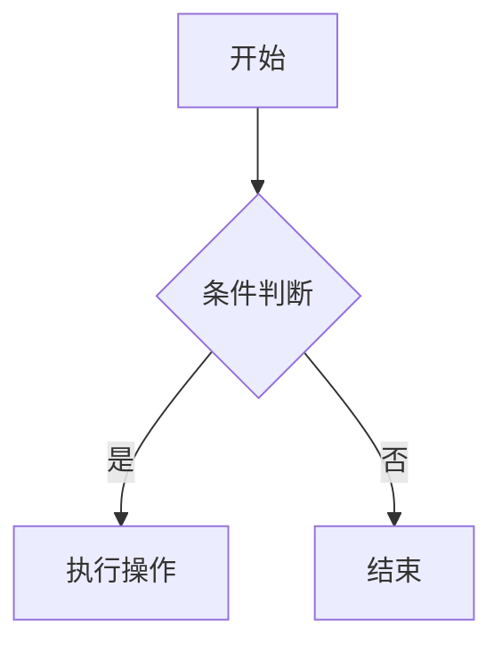
````

---

**基本写法：时序图**
`` ```mermaid ``<br>`sequenceDiagram`
````markdown
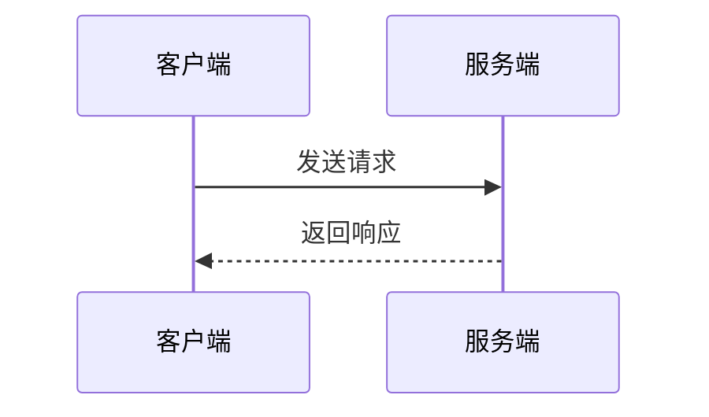
````


<!-- ============ 文档分隔线：002-markdown/014-TaskList.md ============ -->

# Markdown 任务列表

> **符号约定**：`< >` 必填参数 | `[ ]` 可选参数

---

## 基本语法

**基本写法：未完成任务**
`- [ ] <任务描述>`
```markdown
# 未勾选的待办项
- [ ] 编写单元测试
```

---

**基本写法：已完成任务**
`- [x] <任务描述>`
```markdown
# 已勾选的完成项
- [x] 完成需求评审
```

---

**基本写法：混合任务列表**
`- [ ] <项1>` 与 `- [x] <项2>`
```markdown
# 同时包含已完成与未完成项
- [x] 拉取最新代码
- [x] 修改登录逻辑
- [ ] 提交代码评审
- [ ] 部署测试环境
```

---

## 嵌套任务列表

**基本写法：缩进子任务**
`  - [ ] <子任务>`
```markdown
# 用两个空格缩进表示子任务
- [ ] 后端开发
  - [x] 设计 API 接口
  - [ ] 实现业务逻辑
- [ ] 前端开发
  - [ ] 页面布局
  - [ ] 接口联调
```

---

**基本写法：多级嵌套**
`    - [ ] <三级任务>`
```markdown
# 多层级任务嵌套
- [ ] 项目交付
  - [ ] 模块 A
    - [x] 编码
    - [ ] 测试
  - [ ] 模块 B
    - [ ] 编码
```

---

## 有序任务列表

**基本写法：有序编号任务**
`1. [ ] <任务>`
```markdown
# 用数字编号的任务列表
1. [x] 需求确认
2. [ ] 方案设计
3. [ ] 编码实现
4. [ ] 测试验证
```

---

**基本写法：有序任务嵌套**
`1. [ ] <项>` 与 `   1. [ ] <子项>`
```markdown
# 有序任务的子项缩进
1. [x] 准备阶段
   1. [x] 收集资料
   2. [ ] 整理清单
2. [ ] 执行阶段
```

---

## 任务列表交互

**基本写法：GitHub 上的可勾选任务**
`- [ ] <任务>`
```markdown
# GitHub Issue 与 PR 中支持点击勾选
- [ ] 修复登录 bug
- [ ] 补充测试用例
```

---

**基本写法：引用 Issue 任务同步**
`- [ ] <描述> #<编号>`
```markdown
# 任务描述中关联 issue
- [x] 完成 OAuth 接入 #123
- [ ] 编写接入文档 #124
```

---

## 任务列表与其他元素组合

**基本写法：任务加粗强调**
`- [ ] **<重要任务>**: <说明>`
```markdown
# 用粗体突出重要任务
- [ ] **核心功能**: 实现支付模块
- [x] **基础功能**: 完成用户注册
```

---

**基本写法：任务带链接**
`- [ ] [<名称>](<URL>)`
```markdown
# 任务项包含链接
- [x] 阅读 [需求文档](https://example.com/spec)
- [ ] 参考 [设计稿](https://example.com/design)
```

---

**基本写法：任务带代码**
`- [ ] 实现 `<函数名>` 函数`
```markdown
# 任务项包含行内代码
- [x] 实现 `getUserInfo` 接口
- [ ] 重构 `parseToken` 方法
```

---

**基本写法：任务分段说明**
`- [ ] <任务> — <说明>`
```markdown
# 用破折号分隔任务与说明
- [x] 数据库迁移 — 包含索引调整
- [ ] 接口联调 — 需后端配合
```

---

## 任务列表在表格中

**基本写法：表格内嵌入复选框**
`| <列> | <状态> |`
```markdown
# 表格中使用任务语法
| 模块 | 状态 |
| --- | --- |
| 登录 | [x] 完成 |
| 注册 | [ ] 待办 |
```

---

## 进度统计

**基本写法：手动统计进度**
`<完成数>/<总数>`
```markdown
# 在标题或段落中标注进度
## 项目进度 2/4
- [x] 模块 A
- [x] 模块 B
- [ ] 模块 C
- [ ] 模块 D
```

---

**基本写法：分组任务统计**
`### <分组> <完成数>/<总数>`
```markdown
# 分组任务清单
### 前端 1/2
- [x] 首页
- [ ] 详情页

### 后端 0/2
- [ ] 接口 A
- [ ] 接口 B
```

---

## 不同渲染器差异

**基本写法：GitHub Flavored Markdown**
`- [ ] <项>`
```markdown
# GitHub 渲染为可交互复选框
- [ ] 待办事项
```

---

**基本写法：GitLab 支持**
`- [ ] <项>`
```markdown
# GitLab 同样支持任务列表渲染
- [ ] GitLab 任务项
```

---

**基本写法：Obsidian 任务管理**
`- [ ] <项> #<标签>`
```markdown
# Obsidian 支持任务扩展语法
- [ ] 整理笔记 #重要
- [x] 完成周报 #日常
```

---

## 进阶用法

**基本写法：任务带优先级标记**
`- [ ] <优先级> <任务>`
```markdown
# 用 emoji 或符号标记优先级（替代方案用文字）
- [ ] [P0] 修复线上故障
- [ ] [P1] 优化性能瓶颈
- [ ] [P2] 完善文档
```

---

**基本写法：任务带时间**
`- [ ] <任务> (<时间>)`
```markdown
# 任务后追加计划时间
- [x] 发布版本 (2024-12-01)
- [ ] 修复回归 (2024-12-05)
```

---

**基本写法：跨行任务说明**
`- [ ] <任务>`
`  <详细说明>`
```markdown
# 任务下方缩进写详细说明
- [ ] 实现导出功能
  需要支持 CSV、JSON 两种格式
  并提供进度回调
- [x] 实现导入功能
```

---

## 任务列表注意事项

**基本写法：方括号间必须有空格**
`- [ ] <项>`
```markdown
# 正确写法：方括号内含空格
- [ ] 任务一
```

---

**基本写法：避免错误写法**
`-[] <项>`
```markdown
# 错误写法：缺少空格不会被识别
-[] 不会被识别为任务
```

---

**基本写法：x 不区分大小写**
`- [X] <项>`
```markdown
# 大写 X 同样表示完成
- [X] 已完成任务
```

---

**基本写法：任务与列表项混用**
`- <普通项>` 与 `- [ ] <任务>`
```markdown
# 普通列表项与任务项可混合
- 普通列表项
- [ ] 待办任务项
- [x] 已完成任务项
```


<!-- ============ 文档分隔线：002-markdown/015-DefinitionList.md ============ -->

# Markdown 定义列表

> **符号约定**：`< >` 必填参数 | `[ ]` 可选参数

---

## PHP Markdown Extra 语法

**基本写法：术语与定义**
`<术语>`
`: <定义>`
```markdown
# 术语下一行用冒号开头写定义
Git
: 分布式版本控制系统

Markdown
: 轻量级标记语言
```

---

**基本写法：多术语共享定义**
`<术语1>`
`<术语2>`
`: <定义>`
```markdown
# 多个术语共享同一释义
HTML
超文本标记语言
: 用于构建网页结构的标记语言
```

---

**基本写法：术语多定义**
`<术语>`
`: <定义1>`
`: <定义2>`
```markdown
# 同一术语可有多个定义项
API
: 应用程序编程接口
: 一种软件接口规范
```

---

## 缩进格式

**基本写法：冒号后缩进定义**
`<术语>`
`:    <定义>`
```markdown
# 冒号后多个空格保持对齐
HTTP
:    超文本传输协议

HTTPS
:    安全超文本传输协议
```

---

**基本写法：多行定义**
`<术语>`
`: <第一行>`
`  <第二行>`
```markdown
# 定义跨行用空格缩进续行
Markdown
: 一种轻量级标记语言
  通过简单符号生成结构化文档
```

---

## kramdown 语法

**基本写法：kramdown 定义列表**
`<术语>`
`: <定义>`
```markdown
# kramdown 兼容 PHP Markdown Extra 语法
Term
: Definition text
```

---

**基本写法：kramdown 多定义项**
`<术语>`
`: <定义1>`
`: <定义2>`
```markdown
# 多个冒号开头定义同一术语
Open Source
: 开源软件源代码公开
: 鼓励社区协作改进
```

---

## CommonMark 不支持情况

**基本写法：用 HTML 实现定义列表**
`<dl>`、`<dt>`、`<dd>`
```markdown
# CommonMark 不支持原生定义列表，用 HTML 标签实现
<dl>
  <dt>Git</dt>
  <dd>分布式版本控制系统</dd>
  <dt>Markdown</dt>
  <dd>轻量级标记语言</dd>
</dl>
```

---

**基本写法：HTML 加样式**
`<dl><dt><术语></dt><dd><定义></dd></dl>`
```markdown
# 用 HTML 标签嵌套实现丰富样式
<dl>
  <dt><strong>HTTP</strong></dt>
  <dd>超文本传输协议，Web 通信基础</dd>
</dl>
```

---

## 替代方案：粗体加冒号

**基本写法：用粗体模拟术语**
`**<术语>**: <定义>`
```markdown
# CommonMark 通用兼容写法
**Git**: 分布式版本控制系统
**Markdown**: 轻量级标记语言
```

---

**基本写法：列表模拟定义**
`- **<术语>**: <定义>`
```markdown
# 用列表加粗体实现定义效果
- **Git**: 分布式版本控制系统
- **Markdown**: 轻量级标记语言
- **API**: 应用程序编程接口
```

---

**基本写法：术语与定义分行**
`**<术语>**`
`<定义>`
```markdown
# 术语独占一行，定义另起一行
**Git**

分布式版本控制系统，支持离线操作与分支管理。
```

---

## 表格替代

**基本写法：用表格表示术语定义**
`| 术语 | 定义 |`
```markdown
# 用表格组织术语与定义
| 术语 | 定义 |
| --- | --- |
| Git | 分布式版本控制系统 |
| Markdown | 轻量级标记语言 |
```

---

## 渲染器支持差异

**基本写法：GitHub 不支持原生定义列表**
`- **<术语>**: <定义>`
```markdown
# GitHub 用粗体加冒号替代
- **HTTP**: 超文本传输协议
- **HTTPS**: 加密的超文本传输协议
```

---

**基本写法：Obsidian 支持 HTML**
`<dl><dt><术语></dt><dd><定义></dd></dl>`
```markdown
# Obsidian 通过 HTML 标签实现
<dl>
  <dt>术语</dt>
  <dd>这里写定义</dd>
</dl>
```

---

**基本写法：MkDocs 与 Python Markdown**
`<术语>`
`: <定义>`
```markdown
# MkDocs 启用 def_list 扩展后支持
Term
: Definition here
```

---

## 实战场景

**基本写法：术语表**
`## 术语表`
`<术语>`
`: <定义>`
```markdown
# 文档末尾附术语表
## 术语表

VCS
: 版本控制系统

Repository
: 代码仓库，存储项目所有文件与历史
```

---

**基本写法：API 字段说明**
`<字段名>`
`: <说明>`
```markdown
# API 文档中描述字段含义
userId
: 用户唯一标识，类型为 string

token
: 访问令牌，有效期 2 小时
```

---

**基本写法：缩写解释**
`<缩写>`
`: <全称>`
```markdown
# 解释缩写词含义
REST
: 表述性状态转移（Representational State Transfer）

GraphQL
: 图查询语言
```

---

## 与其他元素组合

**基本写法：定义中带链接**
`<术语>`
`: <说明> [<链接>](<URL>)`
```markdown
# 定义中嵌入参考链接
RFC
: 请求意见稿，互联网技术标准文档
  参见 [IETF RFC 页面](https://www.ietf.org/standards/rfcs/)
```

---

**基本写法：定义中带代码**
`<术语>`
`: 包含 \`<代码>\` 的说明`
```markdown
# 定义中嵌入行内代码
Promise
: JavaScript 异步编程对象，通过 `then` 注册回调
```

---

**基本写法：定义中带列表**
`<术语>`
`: 概述：`
`  - <项1>`
`  - <项2>`
```markdown
# 定义中嵌套列表说明
HTTP 方法
: 常用方法包括：
  - GET 获取资源
  - POST 创建资源
  - PUT 更新资源
  - DELETE 删除资源
```

---

## 注意事项

**基本写法：术语与定义间空行**
`<术语>`
`<空行>`
`: <定义>`
```markdown
# 部分解析器要求术语与定义间有空行
HTTP

: 超文本传输协议
```

---

**基本写法：术语不能为空**
`<非空术语>`
`: <定义>`
```markdown
# 术语行必须有内容
协议名称
: 协议的具体说明
```

---

**基本写法：定义冒号必须紧跟**
`<术语>`
`: <定义>`
```markdown
# 冒号必须位于新行开头（可有一个空格）
术语
: 这是正确的定义写法
```


<!-- ============ 文档分隔线：002-markdown/016-MermaidDiagram.md ============ -->

# Markdown Mermaid 图表语法

> **符号约定**：`< >` 必填参数 | `[ ]` 可选参数

---

## 代码块基础

**基本写法：插入 Mermaid 图表**
` ```mermaid ` 与 ` ``` `
````markdown
# 用 mermaid 代码块标识图表

````
---

## 流程图（flowchart）

**基本写法：基础流程图**
`graph <方向>`
`    <节点A> --> <节点B>`
````markdown
# 自上而下的流程图
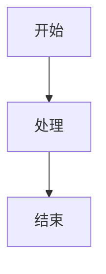
````

---

**基本写法：图表方向**
`graph <方向>`
````markdown
# TD/TB 自上而下，LR 从左到右，RL 从右到左，BT 自下而上
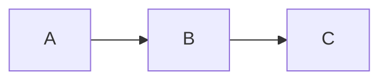
````

---

**基本写法：节点形状**
`<节点>[<文本>]`、`<节点>(<文本>)`、`<节点>{<文本>}`
````markdown
# 不同括号表示不同形状
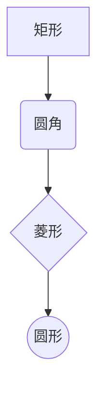
````

---

**基本写法：带文本的连线**
`<节点A> -- <文本> --> <节点B>`
````markdown
# 连线上标注说明文字
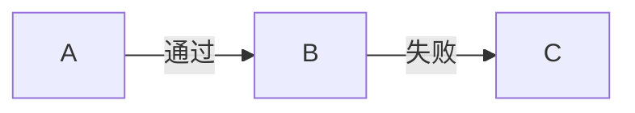
````

---

**基本写法：虚线与粗线**
`<节点A> -.-> <节点B>`、`<节点A> ==> <节点B>`
````markdown
# 虚线箭头与粗线箭头
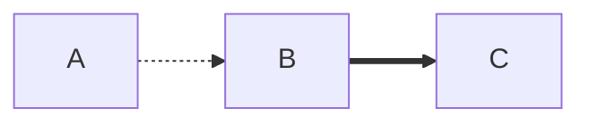
````

---

**基本写法：子图分组**
`subgraph <名称>` ... `end`
````markdown
# 用子图对节点分组
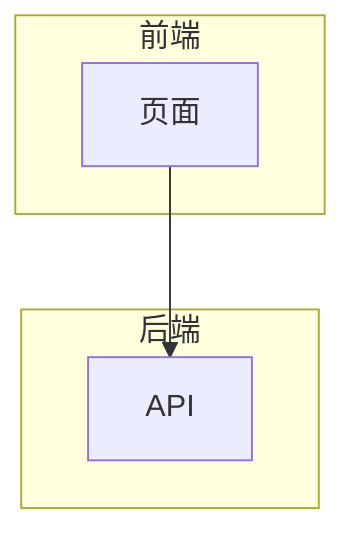
````

---

## 时序图（sequence）

**基本写法：基础时序图**
`sequenceDiagram`
`    <参与者A>->> <参与者B>: <消息>`
````markdown
# 参与者之间的消息交互
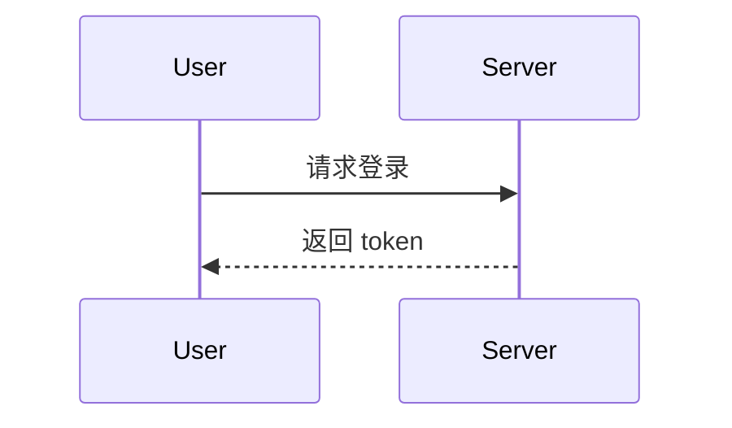
````

---

**基本写法：参与者别名**
`participant <别名> as <显示名>`
````markdown
# 为参与者设置显示别名
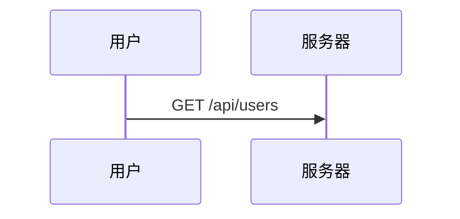
````

---

**基本写法：消息类型**
`->>` 实线箭头，`-->>` 虚线箭头，`--)` 异步实线
````markdown
# 不同箭头表示不同消息类型
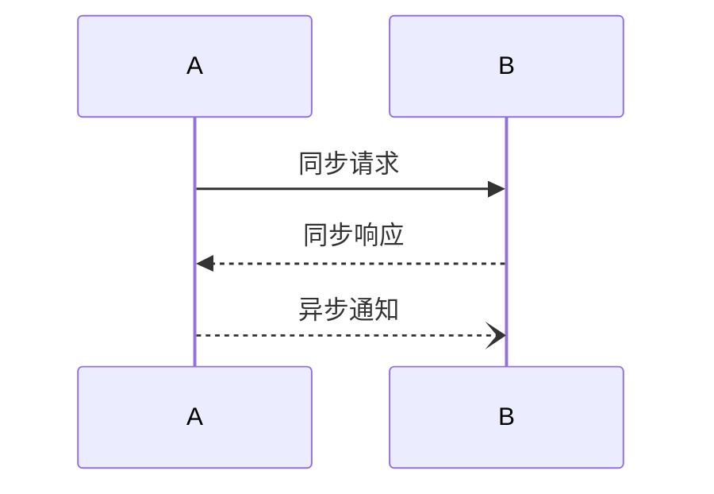
````

---

**基本写法：激活与停用**
`activate <参与者>` 与 `deactivate <参与者>`
````markdown
# 标记参与者激活时段
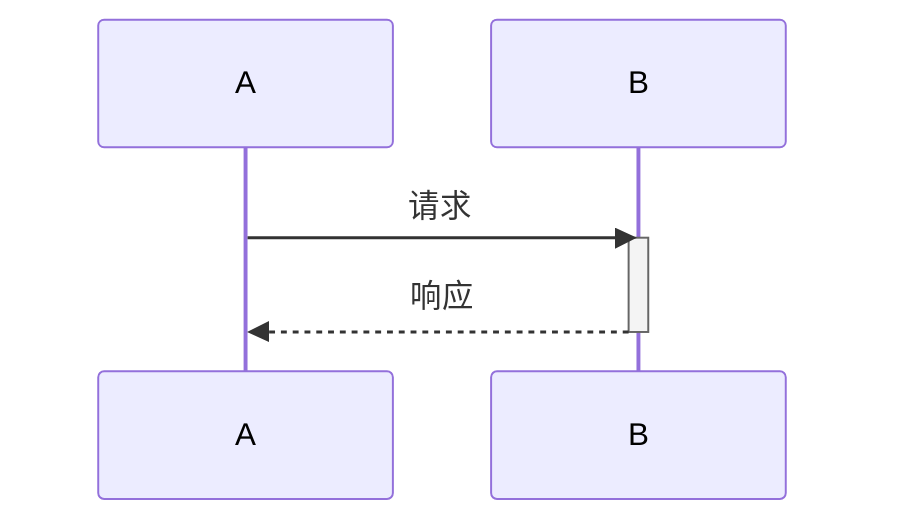
````

---

**基本写法：注释与分组**
`Note over <参与者>: <说明>`、`loop <描述>` ... `end`
````markdown
# 添加注释与循环块
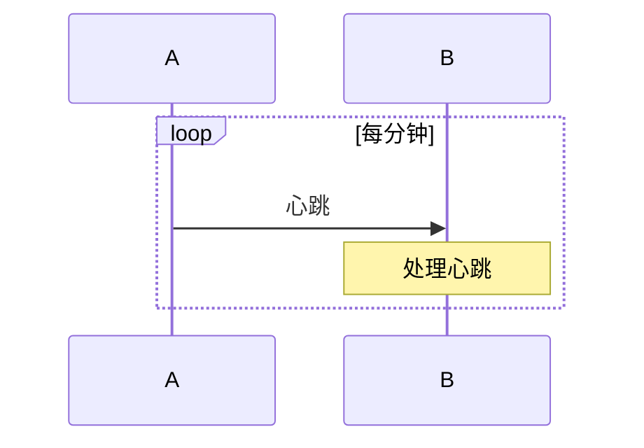
````

---

**基本写法：条件分支**
`alt <条件>` ... `else` ... `end`
````markdown
# 条件分支结构
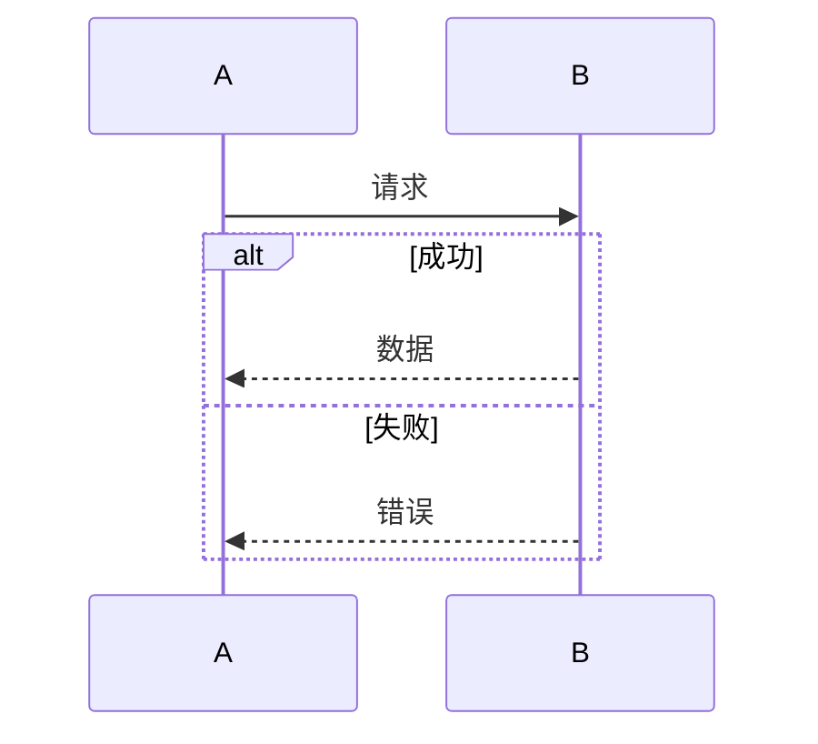
````

---

## 类图（class）

**基本写法：基础类图**
`classDiagram`
`    class <类名>`
````markdown
# 定义类与属性
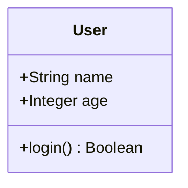
````

---

**基本写法：类关系**
`<类A> <关系> <类B>`
````markdown
# 不同箭头表示继承、组合、聚合等关系
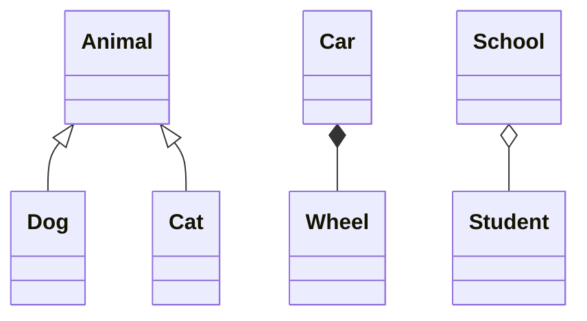
````

---

**基本写法：可见性修饰**
`+` 公有、`-` 私有、`#` 受保护、`~` 包内
````markdown
# 用符号标注成员可见性
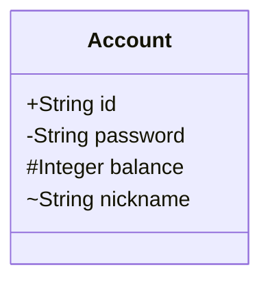
````

---

## 状态图（state）

**基本写法：基础状态图**
`stateDiagram-v2`
`    [*] --> <状态>`
````markdown
# 状态转换图
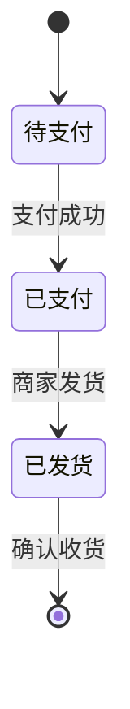
````

---

**基本写法：状态描述**
`<状态>: <说明>`
````markdown
# 状态下方写详细描述
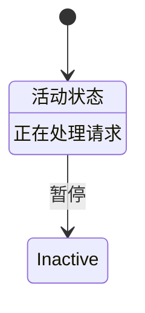
````

---

**基本写法：复合状态**
`state <名称> {` ... `}`
````markdown
# 嵌套的复合状态
```mermaid
stateDiagram-v2
    [*] --> 运行中
    state 运行中 {
        [*] --> 加载
        加载 --> 就绪
    }
    运行中 --> [*]: 停止
```
````

---

**基本写法：分支状态**
`<<choice>>` 与条件分支
````markdown
# 用 choice 实现条件分支
```mermaid
stateDiagram-v2
    [*] --> 检查
    state 检查 <<choice>>
    检查 --> 通过: 成功
    检查 --> 拒绝: 失败
    通过 --> [*]
    拒绝 --> [*]
```
````

---

## 甘特图（gantt）

**基本写法：基础甘特图**
`gantt`
`    dateFormat <格式>`
````markdown
# 项目任务时间线
```mermaid
gantt
    title 项目计划
    dateFormat YYYY-MM-DD
    section 设计
    需求分析 :a1, 2024-01-01, 5d
    原型设计 :after a1, 3d
    section 开发
    编码 :2024-01-10, 10d
```
````

---

**基本写法：任务状态**
`done`、`active`、`crit`
````markdown
# 标记任务状态与关键路径
```mermaid
gantt
    dateFormat YYYY-MM-DD
    section 阶段一
    已完成 :done, a1, 2024-01-01, 3d
    进行中 :active, a2, after a1, 5d
    关键任务 :crit, a3, after a2, 4d
```
````

---

## 饼图（pie）

**基本写法：基础饼图**
`pie title <标题>`
`    "<标签>" : <数值>`
````markdown
# 用饼图展示占比
```mermaid
pie title 浏览器市场份额
    "Chrome" : 65
    "Safari" : 18
    "Edge" : 5
    "其他" : 12
```
````

---

## 用户旅程图（journey）

**基本写法：基础旅程图**
`journey`
`    title <标题>`
````markdown
# 描述用户体验旅程
```mermaid
journey
    title 用户购物流程
    section 浏览
      访问首页: 5: 用户
      搜索商品: 4: 用户
    section 下单
      加入购物车: 5: 用户
      提交订单: 3: 用户, 系统
```
````

---

## 主题与样式

**基本写法：自定义节点样式**
`style <节点> fill:<颜色>,stroke:<颜色>`
````markdown
# 修改节点颜色样式
```mermaid
graph TD
    A[开始] --> B[处理]
    style A fill:#f9f,stroke:#333
    style B fill:#bbf,stroke:#369
```
````

---

**基本写法：定义类样式**
`classDef <类名> fill:<颜色>,stroke:<颜色>`
`class <节点> <类名>`
````markdown
# 用 classDef 复用样式
```mermaid
graph LR
    A --> B --> C
    classDef highlight fill:#ff9,stroke:#333
    class B highlight
```
````

---

## 链接与交互

**基本写法：节点绑定链接**
`click <节点> "<URL>"`
````markdown
# 点击节点跳转链接
```mermaid
graph TD
    A[文档] --> B[官网]
    click A "https://example.com/docs"
    click B "https://example.com"
```
````

---

**基本写法：节点回调函数**
`click <节点> call <函数>`
````markdown
# 点击节点调用 JavaScript 函数
```mermaid
graph TD
    A[按钮] --> B[处理]
    click A call handleButtonClick()
```
````


<!-- ============ 文档分隔线：002-markdown/017-AdmonitionCallout.md ============ -->

# Markdown 提示框（admonition/callout）

> **符号约定**：`< >` 必填参数 | `[ ]` 可选参数

---

## Obsidian Callout 语法

**基本写法：基础 callout**
`> [!<类型>] <标题>`
`> <内容>`
```markdown
# 折叠式提示框
> [!note] 提示
> 这是一个提示框内容
```

---

**基本写法：可折叠 callout**
`> [!<类型>]+ <标题>`
`> <内容>`
```markdown
# 默认展开的可折叠框
> [!info]+ 详情
> 默认展开可手动折叠
```

---

**基本写法：默认折叠**
`> [!<类型>]- <标题>`
`> <内容>`
```markdown
# 默认折叠的可折叠框
> [!warning]- 警告
> 默认折叠需点击展开
```

---

**基本写法：无标题 callout**
`> [!<类型>]`
`> <内容>`
```markdown
# 省略标题只显示内容
> [!tip]
> 这是一个无标题提示
```

---

## Obsidian Callout 类型

**基本写法：note 笔记**
`> [!note] <标题>`
```markdown
# 普通笔记类型
> [!note] 备注
> 普通信息记录
```

---

**基本写法：info 信息**
`> [!info] <标题>`
```markdown
# 信息类型
> [!info] 信息
> 一般性说明信息
```

---

**基本写法：tip 提示**
`> [!tip] <标题>`
```markdown
# 技巧提示
> [!tip] 技巧
> 提升效率的小窍门
```

---

**基本写法：warning 警告**
`> [!warning] <标题>`
```markdown
# 警告信息
> [!warning] 警告
> 注意潜在风险
```

---

**基本写法：danger 危险**
`> [!danger] <标题>`
```markdown
# 危险操作提示
> [!danger] 危险
> 此操作不可逆
```

---

**基本写法：success 成功**
`> [!success] <标题>`
```markdown
# 成功状态提示
> [!success] 成功
> 操作已完成
```

---

**基本写法：failure 失败**
`> [!failure] <标题>`
```markdown
# 失败状态提示
> [!failure] 失败
> 操作未成功
```

---

**基本写法：question 问题**
`> [!question] <标题>`
```markdown
# 常见问题提示
> [!question] 问题
> 这是常见疑问
```

---

**基本写法：example 示例**
`> [!example] <标题>`
```markdown
# 示例展示
> [!example] 示例
> 这是代码示例
```

---

**基本写法：quote 引用**
`> [!quote] <标题>`
```markdown
# 引用名言
> [!quote] 引言
> 知识就是力量
```

---

**基本写法：abstract 摘要**
`> [!abstract] <标题>`
```markdown
# 摘要总结
> [!abstract] 摘要
> 本文核心要点
```

---

**基本写法：bug 缺陷**
`> [!bug] <标题>`
```markdown
# 缺陷提示
> [!bug] 已知缺陷
> 此处行为不符合预期
```

---

## 多行内容

**基本写法：多行 callout**
`> [!<类型>] <标题>`
`> <行1>`
`> <行2>`
```markdown
# 多行内容用引用符续行
> [!note] 多行示例
> 第一行内容
> 第二行内容
> 第三行内容
```

---

**基本写法：段落分隔**
`> [!<类型>] <标题>`
`>`
`> <新段落>`
```markdown
# 用空引用行分隔段落
> [!info] 多段说明
> 第一段说明文字
>
> 第二段说明文字
```

---

**基本写法：嵌套列表**
`> [!<类型>] <标题>`
`> - <项1>`
`> - <项2>`
```markdown
# callout 内嵌套列表
> [!todo] 待办事项
> - [x] 任务一
> - [ ] 任务二
> - [ ] 任务三
```

---

**基本写法：嵌套代码块**
`> [!<类型>] <标题>`
`> \`\`\``
`> <代码>`
`> \`\`\``
````markdown
# callout 内嵌套代码块
> [!example] 示例
> ```python
> print("hello")
> ```
````

---

## 自定义 Callout

**基本写法：自定义类型**
`> [!my-custom] <标题>`
```markdown
# 通过 CSS 自定义新类型
> [!my-custom] 自定义
> 需配合 CSS 样式定义
```

---

**基本写法：自定义颜色（CSS）**
`.callout[data-callout="<类型>"]`
```css
/* 在 snippet 中定义样式 */
.callout[data-callout="my-custom"] {
    --callout-color: 255, 100, 100;
}
```

---

## MkDocs Admonition 语法

**基本写法：基础 admonition**
`!!! <类型>`
`    <内容>`
```markdown
# MkDocs 用三感叹号标识
!!! note
    这是一个提示框内容
```

---

**基本写法：带标题**
`!!! <类型> "<标题>"`
`    <内容>`
```markdown
# 类型后用引号包裹标题
!!! warning "重要警告"
    请注意此风险提示
```

---

**基本写法：可折叠默认展开**
`???+ <类型>`
`    <内容>`
```markdown
# 三个问号加号表示默认展开
???+ note
    默认展开可折叠
```

---

**基本写法：可折叠默认收起**
`??? <类型>`
`    <内容>`
```markdown
# 三个问号表示默认收起
??? tip "提示"
    默认折叠需点击展开
```

---

**基本写法：MkDocs 嵌套内容**
`!!! <类型>`
`    <段落1>`
`        <嵌套>`
```markdown
# 用 4 空格缩进表示嵌套
!!! note
    第一段内容

    - 列表项 1
    - 列表项 2
```

---

## Docusaurus Admonition

**基本写法：Docusaurus 语法**
`:::<类型>`
`<内容>`
`:::`
```markdown
# Docusaurus 用三冒号包裹
:::note
这是一个提示
:::
```

---

**基本写法：带标题**
`:::<类型> <标题>`
`<内容>`
`:::`
```markdown
# 类型后空格加标题
:::warning 重要警告
请注意此风险
:::
```

---

**基本写法：嵌套 admonition**
`:::<类型1>`
`:::<类型2>`
`<内容>`
`:::`
`:::`
````markdown
# 嵌套提示框
:::note
外层说明
:::tip
内层提示
:::
:::
````

---

## GitHub 不支持情况

**基本写法：GitHub 用引用模拟**
`> **<类型>**: <内容>`
```markdown
# GitHub 用粗体加引用模拟
> **Warning**: 此操作不可逆
> **Note**: 请参考文档
```

---

**基本写法：用 emoji 区分类型**
`> **<emoji> <类型>**: <内容>`
```markdown
# 文字替代 emoji 的纯文本方案
> **Note 提示**: 这里是说明文字
> **Warning 警告**: 注意潜在风险
```

---

## 实战场景

**基本写法：文档头部警告**
`> [!warning] <标题>`
`> <内容>`
```markdown
# 文档开头放置重要提示
> [!warning] 弃用提示
> 此 API 已废弃，请使用 v2 版本
```

---

**基本写法：示例代码块说明**
`> [!example] <标题>`
`> <内容>`
```markdown
# 在示例前添加说明
> [!example] 使用示例
> 演示函数调用方式
```

---

**基本写法：版本兼容提示**
`> [!info] <标题>`
`> <内容>`
```markdown
# 标注版本要求
> [!info] 版本要求
> 本功能需要 v2.0 及以上版本
```

---

## 跨平台兼容写法

**基本写法：通用引用替代**
`> <类型>: <内容>`
```markdown
# 兼容所有平台的简单写法
> Note: 这是说明内容
> Warning: 这是警告内容
```

---

**基本写法：HTML 实现提示框**
`<div class="<类>"><strong><类型></strong>: <内容></div>`
```markdown
# 用 HTML 实现带样式提示框
<div class="alert alert-warning">
<strong>警告</strong>: 此操作不可恢复
</div>
```


<!-- ============ 文档分隔线：002-markdown/018-CodeBlockAdvanced.md ============ -->

# Markdown 代码块高级用法

> **符号约定**：`< >` 必填参数 | `[ ]` 可选参数

---

## 基础围栏代码块

**基本写法：基础代码块**
` ``` `
`<代码>`
` ``` `
````markdown
# 用三个反引号包裹代码
```
plain text
```
````

---

**基本写法：指定语言高亮**
` ```<语言> `
`<代码>`
` ``` `
````markdown
# 围栏后紧跟语言名
```python
print("hello")
```
````

---

**基本写法：用波浪号围栏**
`~~~<语言>`
`<代码>`
`~~~`
````markdown
# 波浪号同样可作为围栏
~~~javascript
console.log("hi")
~~~
````

---

## 嵌套代码块

**基本写法：四反引号外层围栏**
` ```` `
` ``` `
`<代码>`
` ``` `
` ```` `
`````markdown
# 外层用更多反引号实现嵌套
````markdown
```python
print("hello")
```
````
`````

---

**基本写法：五反引号围栏**
` ````` `
`<内部内容>`
` ````` `
``````markdown
# 多层嵌套用更多反引号
`````markdown
````javascript
```js
nested code
```
````
`````
``````

---

## 行高亮

**基本写法：高亮单行**
` ```<语言>{<行号>} `
````markdown
# 高亮第 2 行
```javascript{2}
function hello() {
  console.log("hi");
  return true;
}
```
````

---

**基本写法：高亮多行**
` ```<语言>{<行1>,<行2>} `
````markdown
# 同时高亮多行
```python{1,3}
import os
import sys
print(sys.path)
```
````

---

**基本写法：高亮行范围**
` ```<语言>{<起>-<止>} `
````markdown
# 高亮 2 到 4 行
```javascript{2-4}
function a() {}
function b() {}
function c() {}
function d() {}
```
````

---

**基本写法：组合行号与范围**
` ```<语言>{<行1>,<起>-<止>} `
````markdown
# 同时高亮单行与范围
```python{1,3-5}
import os
import sys
def main():
    print("hi")
    return
```
````

---

**基本写法：相对行高亮**
` ```<语言>{<行号>}` 配合标注 `
````markdown
# Vue/Docusaurus 等支持相对行高亮
```javascript{2}{lines: true}
const a = 1;
const b = 2;
const c = 3;
```
````

---

## 行号显示

**基本写法：开启行号**
` ```<语言> showLineNumbers `
````markdown
# Docusaurus 等支持显式行号
```javascript showLineNumbers
const a = 1;
const b = 2;
```
````

---

**基本写法：从指定行开始**
` ```<语言> showLineNumbers{<起始>} `
````markdown
# 行号从指定数字开始
```javascript showLineNumbers{10}
const a = 1;
const b = 2;
```
````

---

**基本写法：全局开启行号**
` ```<语言>{行号} `
````markdown
# 部分渲染器默认显示行号
```python
print("默认带行号")
```
````

---

## 代码块标题

**基本写法：Docusaurus 标题**
` ```<语言> title="<文件名>" `
````markdown
# 用 title 属性标注文件名
```javascript title="src/index.js"
export default function () {
  return null;
}
```
````

---

**基本写法：标题加行高亮**
` ```<语言> title="<文件名>" {<行>} `
````markdown
# 同时指定标题与高亮
```python title="utils.py" {3}
def add(a, b):
    return a + b
```
````

---

**基本写法：Vue 标题语法**
` ```<语言>[vue] `
````markdown
# VuePress 风格的标题写法
```javascript[utils.js]
export const add = (a, b) => a + b
```
````

---

## 代码折叠

**基本写法：Docusaurus 折叠**
` ```<语言> showLineNumbers collapse `
````markdown
# 折叠长代码块
```javascript {1-2} collapse
function longFunc() {
  // 多行实现
}
```
````

---

**基本写法：MkDocs 折叠**
` ```<语言> linenums="<起始>" hl_lines="<行>" `
````markdown
# MkDocs 风格的折叠与高亮
```python linenums="1" hl_lines="2"
import os
import sys
```
````

---

## 复制按钮

**基本写法：Docusaurus 复制按钮**
` ```<语言> `
````markdown
# 默认提供复制按钮
```javascript
const x = 1;
```
````

---

## 代码组

**基本写法：Docusaurus 代码组**
` <CodeBlock language="<语言>"> `
````markdown
# 多语言切换代码组
```jsx
export default function App() {
  return <div />;
}
```

```tsx
export default function App(): JSX.Element {
  return <div />;
}
```
````

---

**基本写法：MkDocs 选项卡**
` === "tab1"`
`     ```<语言>`
`     <代码>`
`     ````
````markdown
# MkDocs Material 多语言选项卡
=== "JavaScript"

    ```js
    console.log("hi")
    ```

=== "Python"

    ```python
    print("hi")
    ```
````

---

## 代码块内特殊字符

**基本写法：转义反引号**
` ``` `
`包含 ` 反引号`
` ``` `
````markdown
# 围栏内反引号无需转义
```
这个符号是 ` 反引号
```
````

---

**基本写法：包含围栏字符**
` ```` `
` ``` `
`内部用三个反引号`
` ``` `
` ```` `
````markdown
# 外层用更多反引号包裹
````markdown
```python
print("nested")
```
````
````

---

## Diff 高亮

**基本写法：diff 语言高亮**
` ```diff `
`+ <新增>`
`- <删除>`
````markdown
# 用 diff 标记增删行
```diff
- const old = "v1";
+ const new = "v2";
```
````

---

**基本写法：行内 diff 标记**
` ```<语言> diff `
````markdown
# 部分渲染器支持 diff 与语言组合
```javascript diff
- const a = 1;
+ const a = 2;
```
````

---

## 注释与行内标注

**基本写法：代码内注释**
` ```<语言> `
`<代码> // <注释>`
````markdown
# 代码块内正常写注释
```javascript
function add(a, b) { // 求和函数
  return a + b;
}
```
````

---

**基本写法：高亮注释标记**
` ```<语言> {<行>}`
````markdown
# 通过行高亮突出注释行
```python {2}
def main():
    # 这里是关键步骤
    return True
```
````

---

## 行内代码

**基本写法：行内代码**
`` `<代码> ``
```markdown
# 单反引号包裹行内代码
使用 `print()` 函数
```

---

**基本写法：行内代码含反引号`
`` `` ` `` ``
```markdown
# 用双反引号包裹含反引号的内容
输出 ` 反引号符号
```

---

**基本写法：多反引号行内代码`
`` `` `<代码>` `` ``
```markdown
# 双反引号实现含反引号的行内代码
`` `print()` ``
```

---

## 代码块缩进式

**基本写法：缩进式代码块`
`    <代码>`
```markdown
# 4 空格缩进表示代码块
    indented code
    second line
```

---

**基本写法：缩进式与列表混合`
`1. 列表项`
`       <代码>`
```markdown
# 列表内代码需 8 空格缩进
1.  示例代码：

        print("hi")
```

---

## 注意事项

**基本写法：语言名称小写**
` ```<语言小写> `
````markdown
# 语言名建议用小写
```python
# 正确写法
```
````

---

**基本写法：围栏前后空行`
`<段落>`
` ```<语言> `
`<代码>`
` ``` `
````markdown
# 围栏代码块前后建议留空行
这是段落。

```python
print("hi")
```
````

---

**基本写法：避免解析错误`
` ```<语言> `
`无尾随空格`
` ``` `
````markdown
# 围栏后不要加多余空格
```python
print("hi")
```
````


<!-- ============ 文档分隔线：002-markdown/019-AnchorAndTOC.md ============ -->

# Markdown 锚点与目录

> **符号约定**：`< >` 必填参数 | `[ ]` 可选参数

---

## 自动生成的标题锚点

**基本写法：标题自动生成锚点**
`## <标题>`
```markdown
# 标题自动生成锚点 id
## 安装步骤
# 锚点为 #安装步骤
```

---

**基本写法：链接到本页锚点**
`[<文本>](#<锚点>)`
```markdown
# 跳转到当前文档的某标题
[跳到安装步骤](#安装步骤)
```

---

**基本写法：英文标题锚点规则**
`## <English Title>`
```markdown
# GitHub 规则：小写、空格转横线、去特殊字符
## Getting Started
# 锚点为 #getting-started
```

---

**基本写法：中文标题锚点**
`## <中文标题>`
```markdown
# 中文标题原样作为锚点
## 中文标题
# 锚点为 #中文标题
```

---

**基本写法：带特殊字符的标题**
`## <标题 (含符号)>`
```markdown
# 特殊字符被忽略
## API v2.0 - 简介
# 锚点为 #api-v20--简介
```

---

## 重复标题处理

**基本写法：重复标题加序号**
`## <标题>` 出现多次
```markdown
# 第二次出现的标题自动加 -1，第三次加 -2
## 示例
## 示例
# 第一个锚点 #示例
# 第二个锚点 #示例-1
```

---

**基本写法：手动锚点**
`## <标题> {#<自定义锚点>}`
```markdown
# 用 {#id} 指定自定义锚点（部分渲染器支持）
## 自定义锚点 {#my-anchor}
```

---

## 自定义锚点（HTML）

**基本写法：用 HTML 锚点**
`<a id="<锚点>"></a>`
```markdown
# 用 HTML 标签定义锚点
<a id="custom-section"></a>
## 章节内容
```

---

**基本写法：链接到自定义锚点**
`[<文本>](#<自定义锚点>)`
```markdown
# 跳转到 HTML 定义的锚点
[跳到自定义](#custom-section)
```

---

**基本写法：name 属性锚点**
`<a name="<锚点>"></a>`
```markdown
# 旧式 name 属性定义锚点
<a name="section-1"></a>
```

---

## 跨文档锚点跳转

**基本写法：链接到其他文件锚点`
`[<文本>](<文件>#<锚点>)`
```markdown
# 跳转到其他 markdown 文件的标题
[参见安装文档](install.md#安装步骤)
```

---

**基本写法：链接到 HTML 文件锚点`
`[<文本>](<文件>.html#<锚点>)`
```markdown
# 跳转到 HTML 文件的锚点
[查看页面](page.html#section)
```

---

**基本写法：绝对路径锚点`
`[<文本>](/<路径>#<锚点>)`
```markdown
# 用绝对路径跳转
[文档首页](/docs/index.md#top)
```

---

## 目录（TOC）自动生成

**基本写法：GitHub 自动目录`
`<鼠标悬停标题旁的链接图标>`
```markdown
# GitHub 在标题旁自动生成链接图标
# README 顶部会自动生成目录
## 章节一
```

---

**基本写法：VS Code 插件生成 TOC`
`通过 Markdown All in One 等插件生成`
```markdown
# 用插件自动生成目录
- [章节一](#章节一)
- [章节二](#章节二)
```

---

**基本写法：手动目录`
`- [<章节>](#<锚点>)`
```markdown
# 手动维护目录列表
## 目录
- [安装](#安装)
- [配置](#配置)
- [使用](#使用)
```

---

**基本写法：嵌套目录`
`- [<父章节>](#<锚点>)`
`  - [<子章节>](#<锚点>)`
```markdown
# 用缩进表示层级
## 目录
- [基础](#基础)
  - [安装](#安装)
  - [运行](#运行)
- [进阶](#进阶)
```

---

## GitHub 锚点规则

**基本写法：转小写`
`<标题>` 转为 `<小写>`
```markdown
# GitHub 锚点全部小写
## Hello World
# 锚点 #hello-world
```

---

**基本写法：空格转横线`
`<空格>` 转为 `-`
```markdown
# 空格替换为横线
## Getting Started Guide
# 锚点 #getting-started-guide
```

---

**基本写法：去除特殊字符`
`<特殊字符>` 被忽略
```markdown
# 标点符号被移除
## What's New?
# 锚点 #whats-new
```

---

**基本写法：连续横线合并`
`<多个空格>` 合并为单个 `-`
```markdown
# 多个空格不产生多个横线
## A  B
# 锚点 #a--b（部分渲染器合并为 #a-b）
```

---

## 锚点实战场景

**基本写法：返回顶部`
`[返回顶部](#<顶部锚点>)`
```markdown
# 在文档末尾添加返回顶部链接
[返回顶部](#top)
```

---

**基本写法：顶部锚点定义`
`<a id="top"></a>`
```markdown
# 文档顶部定义锚点
<a id="top"></a>
# 标题
```

---

**基本写法：脚注式跳转`
`<正文>[<跳转>](#<锚点>)`
```markdown
# 文中插入跳转链接
详见 [附录](#附录)。
```

---

**基本写法：导航栏式目录`
`[<章节1>](#<锚点1>) | [<章节2>](#<锚点2>)`
```markdown
# 顶部水平导航目录
[安装](#安装) | [配置](#配置) | [使用](#使用)
```

---

## 不同渲染器差异

**基本写法：GitHub 锚点`
`[<文本>](#<小写横线格式>)`
```markdown
# GitHub 标题生成小写横线锚点
[跳转](#section-title)
```

---

**基本写法：GitLab 锚点`
`[<文本>](#<锚点>)`
```markdown
# GitLab 类似 GitHub 规则
[跳转](#section-title)
```

---

**基本写法：VuePress 自定义容器锚点`
`## <标题>`
```markdown
# VuePress 自动生成侧边栏目录与锚点
## 章节标题
```

---

**基本写法：Docusaurus 锚点`
`## <标题>`
```markdown
# Docusaurus 自动生成 TOC 与锚点
## Section Title
```

---

## 锚点链接验证

**基本写法：检查锚点有效性`
`点击链接验证跳转`
```markdown
# 提交前点击所有锚点链接验证
[测试链接](#测试锚点)
```

---

**基本写法：用工具检测`
`markdown-link-check <文件>`
```bash
# 用工具检测 markdown 链接有效性
markdown-link-check README.md
```

---

## 锚点命名规范

**基本写法：英文锚点规范`
`## <English Title>`
```markdown
# 推荐使用英文锚点避免编码问题
## Installation Steps
```

---

**基本写法：简短锚点`
`## <简短标题>`
```markdown
# 锚点尽量简短易记
## Quick Start
```

---

**基本写法：层级清晰`
`## <父章节> ### <子章节>`
```markdown
# 通过标题层级反映文档结构
## 基础
### 安装
### 配置
## 进阶
### 高级用法
```

---

## 注意事项

**基本写法：锚点区分大小写`
`[<文本>](#<精确大小写>)`
```markdown
# 锚点通常区分大小写需精确匹配
[跳转](#SectionTitle)
```

---

**基本写法：避免锚点重复`
`为重复标题指定自定义锚点`
```markdown
# 重复标题用自定义锚点区分
## 示例 {#example-1}
## 示例 {#example-2}
```

---

**基本写法：链接前后留空行`
`<段落>`
`[<链接>](#<锚点>)`
```markdown
# 链接与上下文用空行分隔避免解析问题
正文段落。

[跳转](#section)

下一段落。
```


<!-- ============ 文档分隔线：002-markdown/020-GitHubFlavoredMarkdown.md ============ -->

# GitHub Flavored Markdown 扩展

> **符号约定**：`< >` 必填参数 | `[ ]` 可选参数

---

## 删除线

**基本写法：删除线**
`~~<文本>~~`
```markdown
# 双波浪线表示删除线
~~废弃内容~~
```

---

**基本写法：删除线与粗体组合`
`**~~<文本>~~**`
```markdown
# 删除线加粗组合
**~~重要废弃~~**
```

---

## 任务列表

**基本写法：任务列表`
`- [ ] <项>`
```markdown
# GFM 支持可勾选任务列表
- [x] 完成功能
- [ ] 修复 bug
```

---

**基本写法：任务列表嵌套`
`  - [ ] <子项>`
```markdown
# 嵌套任务列表
- [ ] 主任务
  - [x] 子任务一
  - [ ] 子任务二
```

---

## 表格扩展

**基本写法：GFM 表格`
`| <列1> | <列2> |`
`| --- | --- |`
```markdown
# GFM 表格语法
| 名称 | 版本 |
| --- | --- |
| Node | 20 |
| Git | 2.47 |
```

---

**基本写法：表格对齐`
`| :--- | :---: | ---: |`
```markdown
# 用冒号控制列对齐
| 左对齐 | 居中 | 右对齐 |
| :--- | :---: | ---: |
| a | b | c |
```

---

**基本写法：表格内行内代码`
`| \`<代码>\` |`
```markdown
# 表格单元格内可使用行内代码
| 命令 | 说明 |
| --- | --- |
| `git status` | 查看状态 |
```

---

## 自动链接

**基本写法：URL 自动链接`
`<https://example.com>`
```markdown
# 尖括号包裹 URL 转为链接
<https://github.com>
```

---

**基本写法：邮箱自动链接`
`<user@example.com>`
```markdown
# 邮箱地址自动转为 mailto 链接
<alice@example.com>
```

---

**基本写法：裸 URL 自动识别`
`https://example.com`
```markdown
# GFM 自动将裸 URL 转为链接
访问 https://github.com 了解更多
```

---

## 围栏代码块

**基本写法：围栏代码块`
` ```<语言> `
```markdown
# GFM 支持围栏代码块语法
```python
print("hi")
```
```

---

**基本写法：语法高亮`
` ```<语言> `
```markdown
# 指定语言启用语法高亮
```javascript
console.log("hi")
```
```

---

## 引用折行

**基本写法：引用内多段`
`> <段落1>`
`>`
`> <段落2>`
```markdown
# 引用内用空引用行分隔段落
> 第一段
>
> 第二段
```

---

**基本写法：引用嵌套`
`> > <内容>`
```markdown
# 多层引用嵌套
> 外层引用
> > 内层引用
```

---

## 列表扩展

**基本写法：列表内嵌套段落`
`1.  <项>`
`    <续行>`
```markdown
# 列表项内容跨行需缩进
1.  第一项

    续行说明

2.  第二项
```

---

**基本写法：列表内代码块`
`1.  <项>`
`        <代码>`
```markdown
# 列表内代码需 8 空格缩进
1. 示例：

        print("hi")
```

---

## 列表前后空行

**基本写法：列表前空行`
`<段落>`
`(空行)`
`- <项>`
```markdown
# 列表前建议留空行
这是段落。

- 列表项一
- 列表项二
```

---

## 链接引用

**基本写法：定义链接引用`
`[<标识>]: <URL>`
```markdown
# 文档末尾定义链接引用
[GitHub]: https://github.com
```

---

**基本写法：使用链接引用`
`[<文本>][<标识>]`
```markdown
# 引用预定义的链接
访问 [GitHub][GitHub] 仓库
```

---

**基本写法：链接引用带标题`
`[<标识>]: <URL> "<标题>"`
```markdown
# 链接引用追加 title 属性
[Google]: https://google.com "搜索引擎"
```

---

## 禁用与转义

**基本写法：转义星号`
`\*<文本>\*`
```markdown
# 反斜杠转义避免被解析为强调
这里不是 *斜体* 而是 \*字面星号\*
```

---

**基本写法：转义反引号`
`\`<文本>\``
```markdown
# 反斜杠转义反引号
显示 \`code\` 字面文本
```

---

## 警告与提示（GitHub 不支持原生）

**基本写法：用引用模拟提示`
`> **<类型>**: <内容>`
```markdown
# GitHub 用引用加粗体模拟提示框
> **Note**: 这是提示内容
> **Warning**: 这是警告内容
```

---

## 表情符号

**基本写法：emoji 短码`
`:<短码>:`
```markdown
# GFM 支持 emoji 短码
:smile: :rocket: :+1:
```

---

**基本写法：直接使用 emoji 字符`
`<emoji>`
```markdown
# 直接输入 Unicode emoji 字符
完成 享受
```

---

## 用户与 Issue 引用

**基本写法：提及用户`
`@<用户名>`
```markdown
# @ 后跟用户名提及他人
@octocat 请查看
```

---

**基本写法：引用 Issue 与 PR`
`#<编号>`
```markdown
# 自动链接到 issue 与 PR
修复 #123 的回归
关闭 PR #456
```

---

**基本写法：跨仓库引用`
`<用户>/<仓库>#<编号>`
```markdown
# 跨仓库引用 issue
相关 microsoft/vscode#12345
```

---

## 提交 SHA 引用

**基本写法：引用提交哈希`
`<40位哈希>`
```markdown
# 自动链接到提交记录
提交 08103b9f2b6e7fbed517a7e268e4e371d84a9a10 修复此问题
```

---

**基本写法：短 SHA 引用`
`<7位哈希>`
```markdown
# 7 位以上哈希自动识别
参见 abc1234
```

---

## 对比表格（diff）

**基本写法：diff 代码块`
` ```diff `
```markdown
# 用 diff 代码块展示差异
```diff
- old line
+ new line
```
```

---

## 折叠内容

**基本写法：用 HTML details 折叠`
`<details><summary><标题></summary><内容></details>`
```markdown
# GitHub 用 details 标签实现折叠
<details>
<summary>点击展开</summary>

这里是折叠内容

</details>
```

---

**基本写法：默认展开折叠`
`<details open>`
```markdown
# 用 open 属性默认展开
<details open>
<summary>默认展开</summary>
内容
</details>
```

---

## 图片扩展

**基本写法：指定图片宽高`
`" width="<宽>" height="<高>">`
```markdown
# 用 HTML img 标签指定尺寸

```

---

**基本写法：图片带链接`
`[](<链接URL>)`
```markdown
# 图片外层包裹链接
[](https://example.com)
```

---

## 数学公式扩展

**基本写法：行内公式`
`$<公式>$`
```markdown
# GFM 2022 年起支持 LaTeX 公式
能量 $E = mc^2$
```

---

**基本写法：块级公式`
`$$<公式>$$`
```markdown
# 块级公式独占一行
$$
\int_0^1 x^2 dx = \frac{1}{3}
$$
```

---

## 锚点自动生成

**基本写法：标题锚点`
`## <标题>`
```markdown
# 标题自动生成小写横线锚点
## Quick Start
# 锚点 #quick-start
```

---

**基本写法：链接到锚点`
`[<文本>](#<锚点>)`
```markdown
# 链接到本文档某标题
[快速开始](#quick-start)
```

---

## 渲染器适配

**基本写法：GitHub 渲染规则`
`GFM 规范`
```markdown
# GitHub 遵循 GFM 规范
# 支持上述所有扩展语法
```

---

**基本写法：GitLab 扩展`
`GitLab Flavored Markdown`
```markdown
# GitLab 在 GFM 基础上扩展
# 支持数学公式、Mermaid 图表等
```

---

**基本写法：VS Code 预览`
`内置 Markdown 预览`
```markdown
# VS Code 支持大部分 GFM 语法
# 通过插件可扩展更多功能
```

---

## 注意事项

**基本写法：GFM 与 CommonMark 关系`
`GFM 是 CommonMark 的超集`
```markdown
# GFM 兼容 CommonMark 并扩展
# CommonMark 不支持的扩展可参考本文档
```

---

**基本写法：兼容性检查`
`在目标平台预览验证`
```markdown
# 不同平台支持程度不同
# 建议提交前在目标平台预览
```


<!-- ============ 文档分隔线：002-markdown/021-HtmlEmbed.md ============ -->

# Markdown HTML 内嵌

> **符号约定**：`< >` 必填参数 | `[ ]` 可选参数

---

## 基础 HTML 嵌入

**基本写法：行内 HTML 标签`
`<tag> <内容> </tag>`
```markdown
# 直接在 markdown 中写 HTML 标签
这是一个 <strong>加粗</strong> 的文本
```

---

**基本写法：块级 HTML 标签`
`<div> <内容> </div>`
```markdown
# 块级 HTML 标签独占一行
<div>
这是 div 包裹的内容
</div>
```

---

**基本写法：HTML 标签嵌套`
`<div><p> <内容> </p></div>`
```markdown
# HTML 标签可嵌套使用
<div>
<p>段落一</p>
<p>段落二</p>
</div>
```

---

## 文本格式化

**基本写法：HTML 加粗`
`<strong> <文本> </strong>`
```markdown
# 用 strong 标签加粗
<strong>重要内容</strong>
```

---

**基本写法：HTML 斜体`
`<em> <文本> </em>`
```markdown
# 用 em 标签表示斜体
<em>强调文本</em>
```

---

**基本写法：HTML 下划线`
`<u> <文本> </u>`
```markdown
# 用 u 标签添加下划线
<u>带下划线的文本</u>
```

---

**基本写法：HTML 删除线`
`<del> <文本> </del>` 或 `<s> <文本> </s>`
```markdown
# 用 del 或 s 标签表示删除线
<del>已废弃</del>
<s>已失效</s>
```

---

**基本写法：HTML 高亮`
`<mark> <文本> </mark>`
```markdown
# 用 mark 标签高亮文本
<mark>关键信息</mark>
```

---

## 颜色与样式

**基本写法：行内颜色`
`<span style="color:<颜色>"> <文本> </span>`
```markdown
# 用 span 加 style 设置颜色
<span style="color:red">红色文本</span>
```

---

**基本写法：背景色`
`<span style="background-color:<颜色>"> <文本> </span>`
```markdown
# 设置文本背景色
<span style="background-color:yellow">黄色背景</span>
```

---

**基本写法：字号`
`<span style="font-size:<大小>"> <文本> </span>`
```markdown
# 修改字体大小
<span style="font-size:20px">大字号</span>
```

---

**基本写法：组合样式`
`<span style="color:<颜色>;font-weight:bold"> <文本> </span>`
```markdown
# 多个样式属性组合
<span style="color:blue;font-weight:bold">蓝色加粗</span>
```

---

## 换行与对齐

**基本写法：强制换行`
`<br>`
```markdown
# 用 br 标签强制换行
第一行<br>第二行
```

---

**基本写法：水平线`
`<hr>`
```markdown
# 用 hr 标签画水平分隔线
内容一
<hr>
内容二
```

---

**基本写法：文本居中`
`<div align="center"> <内容> </div>`
```markdown
# 用 align 属性居中文本
<div align="center">
居中显示
</div>
```

---

**基本写法：右对齐`
`<div align="right"> <内容> </div>`
```markdown
# 文本右对齐
<div align="right">
右对齐文本
</div>
```

---

## 锚点与链接

**基本写法：定义锚点`
`<a id="<锚点>"></a>`
```markdown
# 用 a 标签定义锚点
<a id="section-1"></a>
## 章节一
```

---

**基本写法：HTML 链接`
`<a href="<URL>"> <文本> </a>`
```markdown
# 用 a 标签创建链接
<a href="https://example.com">访问示例</a>
```

---

**基本写法：新窗口打开链接`
`<a href="<URL>" target="_blank"> <文本> </a>`
```markdown
# target="_blank" 在新标签页打开
<a href="https://example.com" target="_blank">新窗口打开</a>
```

---

## 图片扩展

**基本写法：HTML 图片`
`" alt="<描述>">`
```markdown
# 用 img 标签插入图片

```

---

**基本写法：指定图片尺寸`
`" width="<宽>" height="<高>">`
```markdown
# 设置图片宽高

```

---

**基本写法：图片样式`
`" style="border:1px solid">`
```markdown
# 给图片添加样式

```

---

**基本写法：图片居中`
`<div align="center">"></div>`
```markdown
# 用 div 居中图片
<div align="center">

</div>
```

---

## 折叠内容

**基本写法：折叠区块`
`<details><summary><标题></summary><内容></details>`
```markdown
# 用 details 实现折叠
<details>
<summary>点击展开详情</summary>

这里是折叠的内容

</details>
```

---

**基本写法：默认展开折叠`
`<details open>`
```markdown
# 用 open 属性默认展开
<details open>
<summary>默认展开</summary>
内容
</details>
```

---

**基本写法：嵌套折叠`
`<details><summary><外层>`
`<details><summary><内层>...`
```markdown
# 折叠区块可嵌套
<details>
<summary>外层</summary>
<details>
<summary>内层</summary>
内容
</details>
</details>
```

---

## 提示框

**基本写法：警告框`
`<div class="alert alert-warning"><内容></div>`
```markdown
# 用 div 加 class 实现提示框
<div class="alert alert-warning">
<strong>警告</strong> 注意此风险
</div>
```

---

**基本写法：调用框`
`<blockquote class="warning"><内容></blockquote>`
```markdown
# 用 blockquote 加 class 实现引用框
<blockquote class="warning">
警告内容
</blockquote>
```

---

## 表格扩展

**基本写法：HTML 表格`
`<table><tr><td> <内容> </td></tr></table>`
```markdown
# 用 HTML 实现更复杂的表格
<table>
<tr>
<th>姓名</th>
<th>年龄</th>
</tr>
<tr>
<td>张三</td>
<td>25</td>
</tr>
</table>
```

---

**基本写法：合并单元格`
`<td colspan="<列数>"> <内容> </td>`
```markdown
# 用 colspan 与 rowspan 合并单元格
<table>
<tr>
<td colspan="2">合并两列</td>
</tr>
<tr>
<td>单元格</td>
<td>单元格</td>
</tr>
</table>
```

---

## 视频与媒体

**基本写法：嵌入视频`
`<video src="<URL>" controls></video>`
```markdown
# 用 video 标签嵌入视频
<video src="demo.mp4" controls width="400"></video>
```

---

**基本写法：嵌入音频`
`<audio src="<URL>" controls></audio>`
```markdown
# 用 audio 标签嵌入音频
<audio src="song.mp3" controls></audio>
```

---

**基本写法：嵌入 iframe`
`<iframe src="<URL>"></iframe>`
```markdown
# 用 iframe 嵌入网页
<iframe src="https://example.com" width="600" height="400"></iframe>
```

---

## 注释

**基本写法：HTML 注释`
`<!-- <注释内容> -->`
```markdown
# 用 HTML 注释隐藏内容
<!-- 这是注释不会渲染 -->
```

---

**基本写法：多行注释`
`<!--`
`<多行内容>`
`-->`
```markdown
# 多行注释
<!--
多行
注释内容
-->
```

---

## 键盘按键样式

**基本写法：键盘按键`
`<kbd> <按键> </kbd>`
```markdown
# 用 kbd 标签表示键盘按键
按 <kbd>Ctrl</kbd> + <kbd>C</kbd> 复制
```

---

## 上下标

**基本写法：下标`
`<sub> <内容> </sub>`
```markdown
# 用 sub 标签实现下标
H<sub>2</sub>O
```

---

**基本写法：上标`
`<sup> <内容> </sup>`
```markdown
# 用 sup 标签实现上标
x<sup>2</sup> + y<sup>2</sup>
```

---

## 内联样式

**基本写法：用 style 属性`
`<元素 style="<CSS>">`
```markdown
# 行内 style 属性指定样式
<p style="color:green;font-size:18px">绿色大字</p>
```

---

**基本写法：用 class 属性`
`<元素 class="<类名>">`
```markdown
# 用 class 关联外部 CSS
<div class="highlight">高亮内容</div>
```

---

## 渲染器支持差异

**基本写法：GitHub 支持的 HTML`
`<a>  <details> <kbd> 等`
```markdown
# GitHub 支持部分安全 HTML 标签
# 禁用 script、style 标签
```

---

**基本写法：GitLab HTML 过滤`
`允许大部分 HTML 标签`
```markdown
# GitLab 允许更多 HTML 标签与属性
# 包括 style 属性
```

---

**基本写法：Obsidian 完整支持`
`支持所有 HTML 标签与样式`
```markdown
# Obsidian 渲染时保留 HTML 原样
# 支持完整样式属性
```

---

## 注意事项

**基本写法：块级 HTML 前后空行`
`<段落>`
`<div> <内容> </div>`
`<段落>`
```markdown
# 块级 HTML 前后建议留空行
段落

<div>HTML 块</div>

段落
```

---

**基本写法：避免 script 标签`
`多数平台禁用 script`
```markdown
# 多数平台出于安全过滤 script 标签
# 不要依赖 JavaScript 实现
```

---

**基本写法：HTML 与 Markdown 混用`
`<div>`
`<Markdown 内容>`
`</div>`
```markdown
# HTML 块内 Markdown 可能不解析
# 建议复杂格式统一用 HTML 或 Markdown
```

---

## 实战场景

**基本写法：文档头部居中标题`
`<div align="center"><h1> <标题> </h1></div>`
```markdown
# 居中显示项目标题
<div align="center">
<h1>项目名称</h1>
<p>项目简介</p>
</div>
```

---

**基本写法：徽章组合`
`">`
```markdown
# 用 img 标签展示多个状态徽章


```

---

**基本写法：警告区块`
`<div class="warning"><内容></div>`
```markdown
# 突出显示重要警告
<div class="warning">
<strong>重要</strong> 此功能已弃用
</div>
```


<!-- ============ 文档分隔线：002-markdown/022-BlockquoteNestedList.md ============ -->

# Markdown 引用与嵌套列表语法速查

> **符号约定**：`< >` 必填参数 | `[ ]` 可选参数

---

## 基础引用

**基本写法：单行引用**
`> <文本>`
```markdown
> 这是一段引用内容
```

---

**基本写法：多行引用**
`> <行1>`
`> <行2>`
```markdown
> 第一行引用
> 第二行引用
> 第三行引用
```

---

## 引用嵌套

**基本写法：引用嵌套引用**
`>> <内层文本>`
```markdown
> 外层引用
>> 内层引用
>>> 更深层引用
```

---

## 引用内含其他语法

**基本写法：引用内含标题与列表**
`> ## <标题>`
```markdown
> ## 引用内标题
> - 列表项一
> - 列表项二
> **加粗** 与 *斜体* 均可
```

---

## 嵌套列表

**基本写法：列表嵌套子项**
`<缩进>- <子项>`
```markdown
- 父项一
  - 子项一
  - 子项二
- 父项二
  - 子项三
```

---

**基本写法：有序列表嵌套**
`<缩进><数字>. <子项>`
```markdown
1. 父项
   1. 子项一
   2. 子项二
2. 父项二
```

---

## 任务列表嵌套

**基本写法：任务列表内嵌套列表**
`  - [ ] <子任务>`
```markdown
- [x] 主任务
  - [x] 子任务一
  - [ ] 子任务二
- [ ] 另一主任务
```

---

## 引用与列表混合

**基本写法：列表项内放引用**
`<列表项>` 换行 `  > <引用>`
```markdown
- 项目一
  > 项目一的说明引用
- 项目二
```

---

## 缩进规范

**基本写法：缩进位数**
`<2 或 4 空格>- <子项>`
```markdown
// 2 空格缩进（GFM 推荐）
- 项
  - 子项

// 4 空格缩进（CommonMark 标准）
- 项
    - 子项
```

---

## 多级嵌套缩进

**基本写法：三级嵌套**
`<层级数 × 2 空格>- <项>`
```markdown
- 一级
  - 二级
    - 三级
      - 四级
```

---

## 嵌套列表与代码块

**基本写法：列表项内代码块**
`<列表项>` 换行 `  <缩进 4 空格代码>`
```markdown
- 项目一

      const x = 1;
      console.log(x);

- 项目二
```

---

## 紧凑与松散列表

**基本写法：紧凑列表（无空行）**
`- <项>` 直接换行 `- <项>`
```markdown
// 紧凑：项间无空行
- 项一
- 项二

// 松散：项间有空行，渲染为段落
- 项一

- 项二
```

---


<!-- ============ 文档分隔线：002-markdown/023-FrontmatterYAML.md ============ -->

# Markdown Frontmatter YAML 语法速查

> **符号约定**：`< >` 必填参数 | `[ ]` 可选参数

---

## 基础语法

**基本写法：frontmatter 块**
`---` 换行 `<YAML>` 换行 `---`
```markdown
---
title: 文档标题
date: 2025-07-31
---
正文内容
```

---

## 标量字段

**基本写法：字符串与数字**
`<键>: <值>`
```yaml
title: 用户指南
version: 2.1
draft: false
rating: 4.5
```

---

**基本写法：带引号字符串**
`<键>: "<值>"`
```yaml
title: "包含: 冒号的标题"
desc: '单引号也可'
path: "a/b/c"
```

---

## 数组字段

**基本写法：行内数组**
`<键>: [<项1>, <项2>]`
```yaml
tags: [js, ts, web]
authors: [Alice, Bob]
```

---

**基本写法：块状数组**
`<键>:`
`  - <项>`
```yaml
tags:
  - javascript
  - typescript
  - vue
```

---

## 对象字段

**基本写法：嵌套对象**
`<键>:`
`  <子键>: <值>`
```yaml
author:
  name: Alice
  email: alice@example.com
  social:
    twitter: "@alice"
```

---

**基本写法：对象数组**
`<键>:`
`  - <子键>: <值>`
```yaml
posts:
  - title: 第一篇
    date: 2025-01-01
  - title: 第二篇
    date: 2025-02-01
```

---

## 布尔与空值

**基本写法：布尔与 null**
`<键>: true` | `<键>: null`
```yaml
published: true
draft: false
featured: null
empty: ~        # ~ 等价 null
```

---

## 多行文本

**基本写法：保留换行**
`<键>: |`
```yaml
description: |
  第一行
  第二行
  保留所有换行与缩进
```

---

**基本写法：折叠换行**
`<键>: >`
```yaml
summary: >
  这是一段
  长文本，换行
  会被折叠成空格
```

---

**基本写法：保留末尾换行控制**
`<键>: |-` | `<键>: |+`
```yaml
# |- 去除末尾换行，|+ 保留全部末尾换行
desc: |- 精确无末尾换行
desc2: |+ 保留所有换行
```

---

## 日期类型

**基本写法：日期字段**
`date: <YYYY-MM-DD>`
```yaml
date: 2025-07-31
datetime: 2025-07-31T10:30:00Z
datetime2: 2025-07-31 18:30:00 +08:00
```

---

## 常用约定字段

**基本写法：博客类 frontmatter**
`<键>: <值>`
```yaml
---
title: 文章标题
date: 2025-07-31
tags: [前端, JS]
categories: 教程
author: Alice
cover: /img/a.png
draft: false
summary: 简短摘要
---
```

---

**基本写法：文档类 frontmatter**
`<键>: <值>`
```yaml
---
title: API 文档
description: 接口说明文档
sidebar_position: 3
sidebar_label: 接口
slug: /api
---
```

---

## 锚点与引用

**基本写法：锚点定义与引用**
`<键>: &<锚点名> <值>` | `*<锚点名>`
```yaml
defaults: &def
  lang: zh
  draft: false
post1:
  <<: *def
  title: 第一篇
```

---

## 转义与特殊字符

**基本写法：特殊字符处理**
`<键>: "<值>"`
```yaml
# 含冒号、井号等需引号
note: "key: value 含冒号"
url: "https://a.com/?x=1&y=2"
hash: "#标题"
```

---

## 多文档分隔

**基本写法：多 frontmatter 文档**
`---`
```yaml
---
title: 第一篇
---
正文一
---
title: 第二篇
---
正文二
```

---

## 注意事项

**基本写法：frontmatter 位置**
`---` 必须位于文件最顶部
```markdown
---
title: 标题
---
<!-- frontmatter 必须是文件第一行，前面不能有空行或内容 -->
正文
```

---


<!-- ============ 文档分隔线：002-markdown/024-TableAdvanced.md ============ -->

# Markdown 表格进阶语法速查

> **符号约定**：`< >` 必填参数 | `[ ]` 可选参数

---

## 基础表格回顾

**基本写法：标准表格**
`| <表头> | <表头> |`
`| --- | --- |`
```markdown
| 名称 | 数量 |
| --- | --- |
| 苹果 | 3 |
| 香蕉 | 5 |
```

---

## 列对齐

**基本写法：左对齐**
`| :--- |`
```markdown
| 名称 | 数量 |
| :--- | :--- |
| 左 | 左对齐 |
```

---

**基本写法：居中对齐**
`| :---: |`
```markdown
| 名称 | 价格 |
| :---: | :---: |
| 居中 | 居中 |
```

---

**基本写法：右对齐**
`| ---: |`
```markdown
| 名称 | 价格 |
| --- | ---: |
| 商品 | 右对齐 |
```

---

**基本写法：混合对齐**
`| :--- | :---: | ---: |`
```markdown
| 名称 | 类型 | 价格 |
| :--- | :---: | ---: |
| 左对齐 | 居中 | 右对齐 |
```

---

## 单元格内格式

**基本写法：行内格式**
`| **<加粗>** | *<斜体>* |`
```markdown
| 名称 | 状态 | 备注 |
| --- | --- | --- |
| **商品** | *在售* | ~~旧价~~ |
| [链接](/a) | `code` | 普通 |
```

---

**基本写法：单元格内换行**
`<行1><br><行2>`
```markdown
| 名称 | 说明 |
| --- | --- |
| 商品 | 第一行<br>第二行 |
```

---

**基本写法：单元格内列表（HTML）**
`<ul><li><项></li></ul>`
```markdown
| 名称 | 选项 |
| --- | --- |
| 商品 | <ul><li>红</li><li>蓝</li></ul> |
```

---

## 合并单元格（HTML）

**基本写法：跨列合并**
`<td colspan="<列数>">`
```markdown
<table>
<tr><th>姓名</th><th>年龄</th></tr>
<tr><td colspan="2">合并两列</td></tr>
</table>
```

---

**基本写法：跨行合并**
`<td rowspan="<行数>">`
```markdown
<table>
<tr><td rowspan="2">分组A</td><td>张三</td></tr>
<tr><td>李四</td></tr>
</table>
```

---

## 宽表格与可滚动

**基本写法：HTML 包裹滚动**
`<div style="overflow-x:auto"><table>...</table></div>`
```markdown
<div style="overflow-x:auto">

| 很长的表头一 | 很长的表头二 | 很长的表头三 |
| --- | --- | --- |
| 数据 | 数据 | 数据 |

</div>
```

---

## GFM 表格注意点

**基本写法：表格前后空行**
`<空行>` 表格 `<空行>`
```markdown
// 表格上下需空行，否则可能不被解析

| a | b |
| --- | --- |
| 1 | 2 |

// 表格内不能直接放块级元素
```

---

**基本写法：转义管道符**
`<单元格内容中 \| 表示字面管道符>`
```markdown
| 表达式 | 结果 |
| --- | --- |
| a \| b | 文本管道符 |
```

---

## 表格与代码

**基本写法：单元格内行内代码**
`| `<代码>` |`
```markdown
| 方法 | 说明 |
| --- | --- |
| `map()` | 映射 |
| `filter()` | 过滤 |
```

---

**基本写法：单元格内多行代码**
`HTML <pre><code>` 包裹
```markdown
| 示例 | 代码 |
| --- | --- |
| 多行 | <pre><code>const a = 1;<br>const b = 2;</code></pre> |
```

---

## 标题行省略

**基本写法：无表头表格（HTML）**
`<table>` 不含 `<th>`
```markdown
<table>
<tr><td>张三</td><td>20</td></tr>
<tr><td>李四</td><td>22</td></tr>
</table>
```

---

## 排版优化

**基本写法：列宽对齐（不影响渲染）**
`| <补空格对齐> |`
```markdown
// 列宽对齐仅影响源码可读性，渲染结果一致
| 名称   | 数量 |
| ------ | ---- |
| 苹果   |    3 |
| 香蕉   |    5 |
```

---

## 复杂表头（HTML）

**基本写法：多级表头**
`<th>` + `colspan`
```markdown
<table>
<tr>
  <th rowspan="2">姓名</th>
  <th colspan="2">成绩</th>
</tr>
<tr>
  <th>语文</th><th>数学</th>
</tr>
<tr><td>张三</td><td>90</td><td>95</td></tr>
</table>
```

---

