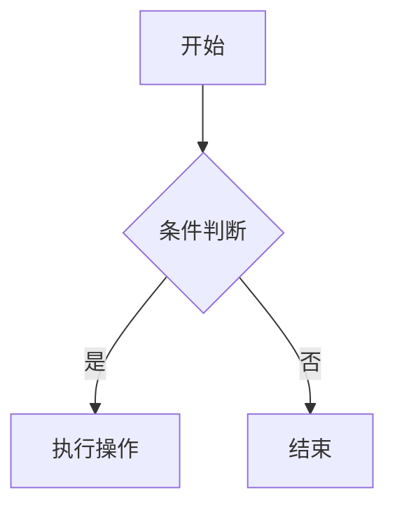
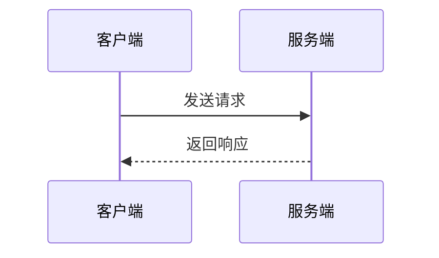

# Markdown 高级语法速查

> **符号约定**：`< >` 必填参数 | `[ ]` 可选参数

---

## 任务列表

**基本写法：任务列表**
`- [ ] <未完成项>`
`- [x] <已完成项>`
```markdown
- [x] 已完成任务
- [ ] 待办任务
- [ ] 进行中任务
```

---

## 引用与嵌套引用

**基本写法：引用**
`> <引用内容>`
```markdown
> 这是一段引用
```

---

**基本写法：嵌套引用**
`> <一级引用>`<br>`> > <二级引用>`
```markdown
> 一级引用
> > 二级引用
> > > 三级引用
```

---

**基本写法：引用内含其他元素**
`> <元素>`
```markdown
> ## 标题
> - 列表项
> **加粗** 文本
```

---

## 代码块扩展

**基本写法：行内代码**
`` `<代码>` ``
```markdown
使用 `print()` 函数
```

---

**基本写法：带语言标签的代码块**
`` ```<语言> ``<br>`<代码>`<br>`` ``` ``
````markdown
```python
def hello():
    print("Hello")
```
````

---

**基本写法：diff 代码块**
`` ```diff ``<br>`<代码>`<br>`` ``` ``
````markdown
```diff
+ 新增行
- 删除行
! 重要修改
# 注释
```
````

---

## 表格高级用法

**基本写法：对齐表格**
`| <列1> | <列2> |`<br>`| :--- | :---: | ---: |`
```markdown
| 左对齐 | 居中对齐 | 右对齐 |
| :--- | :---: | ---: |
| Left | Center | Right |
```

---

**基本写法：表格内换行**
`<br>`
```markdown
| 列1 | 列2 |
| --- | --- |
| 第一行<br>第二行 | 内容 |
```

---

**基本写法：内联格式化表格**
`| **<列>** | *<列>* |`
```markdown
| **加粗** | *斜体* | `代码` |
| --- | --- | --- |
| 内容 | 内容 | 内容 |
```

---

## 链接高级用法

**基本写法：参考式链接**
`[<文本>][<引用标记>]`<br>`[<引用标记>]: <URL> "<标题>"`
```markdown
[Google][1]

[1]: https://google.com "Google 首页"
```

---

**基本写法：自动链接**
`<URL>`
```markdown
<https://example.com>
<user@example.com>
```

---

**基本写法：页面内锚点**
`[<文本>](#<锚点>)`
```markdown
[跳转到标题](#标题名)

## 标题名
```

---

## 图片扩展

**基本写法：带链接的图片**
`[](<链接URL>)`
```markdown
[](https://example.com)
```

---

**基本写法：指定尺寸（HTML）**
`" alt="<替代>" width="<宽>" height="<高>">`
```markdown

```

---

## 锚点与脚注

**基本写法：脚注引用**
`<文本>[^<标记>]`<br>`[^<标记>]: <脚注内容>`
```markdown
这是一个概念[^1]

[^1]: 脚注的详细说明文字
```

---

**基本写法：多行脚注**
`[^<标记>]: <第一行>`<br>`    <后续行>`
```markdown
[^2]: 第一行说明
    第二行延续内容
```

---

## 转义字符

**基本写法：转义特殊字符**
`\<字符>`
```markdown
\* 不是斜体 \*
\# 不是标题
\_ 不是强调
\` 不是代码
```

---

## HTML 内嵌

**基本写法：直接使用 HTML**
`<<标签> <属性>="<值>">`
```markdown
<details>
<summary>点击展开</summary>
隐藏的内容
</details>
```

---

**基本写法：键盘按键**
`<kbd><按键></kbd>`
```markdown
按 <kbd>Ctrl</kbd> + <kbd>C</kbd> 复制
```

---

**基本写法：高亮文本**
`<mark><内容></mark>`
```markdown
<mark>高亮显示</mark> 的文本
```

---

## 评论与注释

**基本写法：HTML 注释**
`<!-- <注释> -->`
```markdown
<!-- 这是注释，不会显示 -->
```

---

## 定义列表

**基本写法：定义列表**
`<术语>`<br>`: <定义>`
```markdown
术语 1
: 定义 1

术语 2
: 定义 2
```

---

## 缩写

**基本写法：缩写定义**
`*[<缩写>]: <全称>`
```markdown
HTML 是一种标记语言

*[HTML]: HyperText Markup Language
```

---

## 数学公式

**基本写法：行内公式**
`$<公式>$`
```markdown
质能方程 $E = mc^2$
```

---

**基本写法：块级公式**
`$$<公式>$$`
```markdown
$$
\int_a^b f(x) dx = F(b) - F(a)
$$
```

---

## Mermaid 图表

**基本写法：流程图**
`` ```mermaid ``<br>`graph <方向>`<br>`<节点定义>`
````markdown

````

---

**基本写法：时序图**
`` ```mermaid ``<br>`sequenceDiagram`
````markdown

````
