# Markdown Mermaid 图表语法

> **符号约定**：`< >` 必填参数 | `[ ]` 可选参数

---

## 代码块基础

**基本写法：插入 Mermaid 图表**
` ```mermaid ` 与 ` ``` `
````markdown
# 用 mermaid 代码块标识图表

````
---

## 流程图（flowchart）

**基本写法：基础流程图**
`graph <方向>`
`    <节点A> --> <节点B>`
````markdown
# 自上而下的流程图
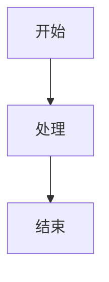
````

---

**基本写法：图表方向**
`graph <方向>`
````markdown
# TD/TB 自上而下，LR 从左到右，RL 从右到左，BT 自下而上
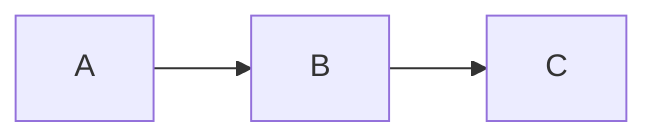
````

---

**基本写法：节点形状**
`<节点>[<文本>]`、`<节点>(<文本>)`、`<节点>{<文本>}`
````markdown
# 不同括号表示不同形状
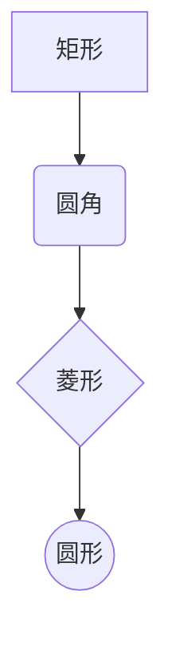
````

---

**基本写法：带文本的连线**
`<节点A> -- <文本> --> <节点B>`
````markdown
# 连线上标注说明文字
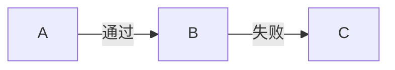
````

---

**基本写法：虚线与粗线**
`<节点A> -.-> <节点B>`、`<节点A> ==> <节点B>`
````markdown
# 虚线箭头与粗线箭头
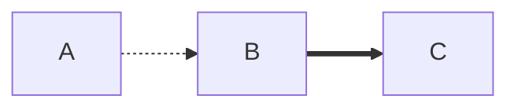
````

---

**基本写法：子图分组**
`subgraph <名称>` ... `end`
````markdown
# 用子图对节点分组
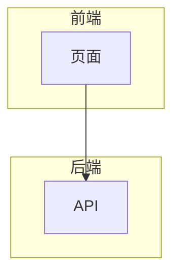
````

---

## 时序图（sequence）

**基本写法：基础时序图**
`sequenceDiagram`
`    <参与者A>->> <参与者B>: <消息>`
````markdown
# 参与者之间的消息交互
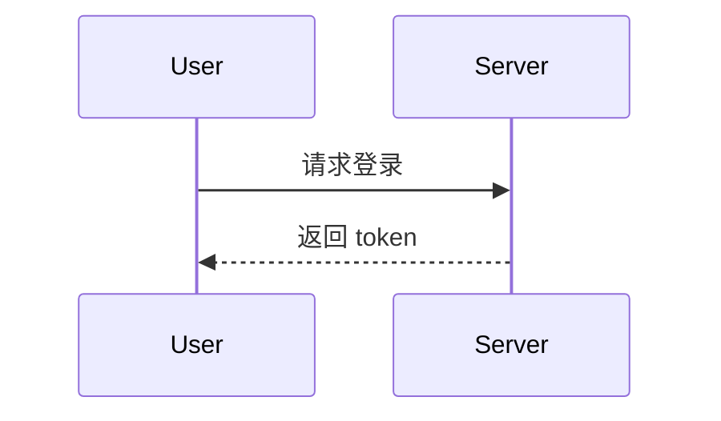
````

---

**基本写法：参与者别名**
`participant <别名> as <显示名>`
````markdown
# 为参与者设置显示别名
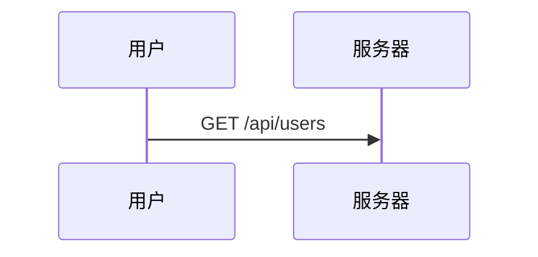
````

---

**基本写法：消息类型**
`->>` 实线箭头，`-->>` 虚线箭头，`--)` 异步实线
````markdown
# 不同箭头表示不同消息类型
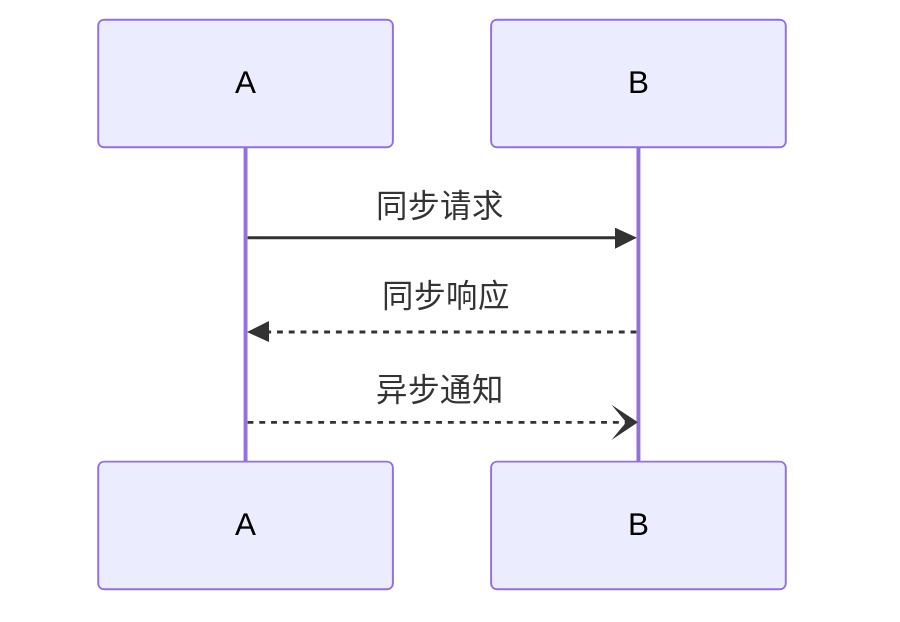
````

---

**基本写法：激活与停用**
`activate <参与者>` 与 `deactivate <参与者>`
````markdown
# 标记参与者激活时段
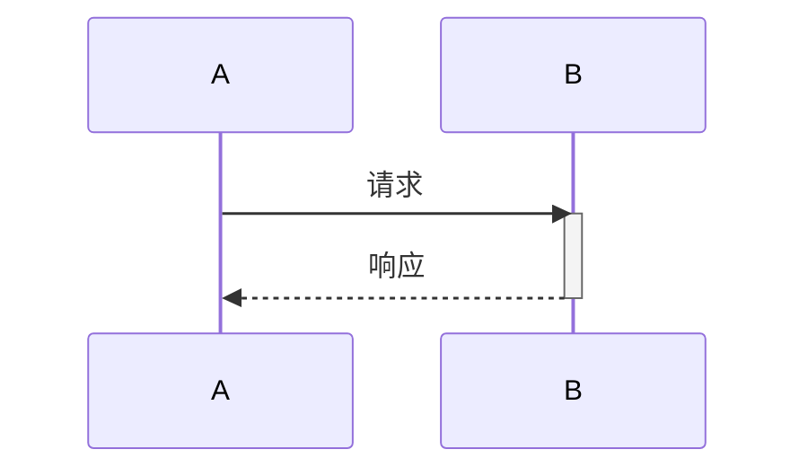
````

---

**基本写法：注释与分组**
`Note over <参与者>: <说明>`、`loop <描述>` ... `end`
````markdown
# 添加注释与循环块
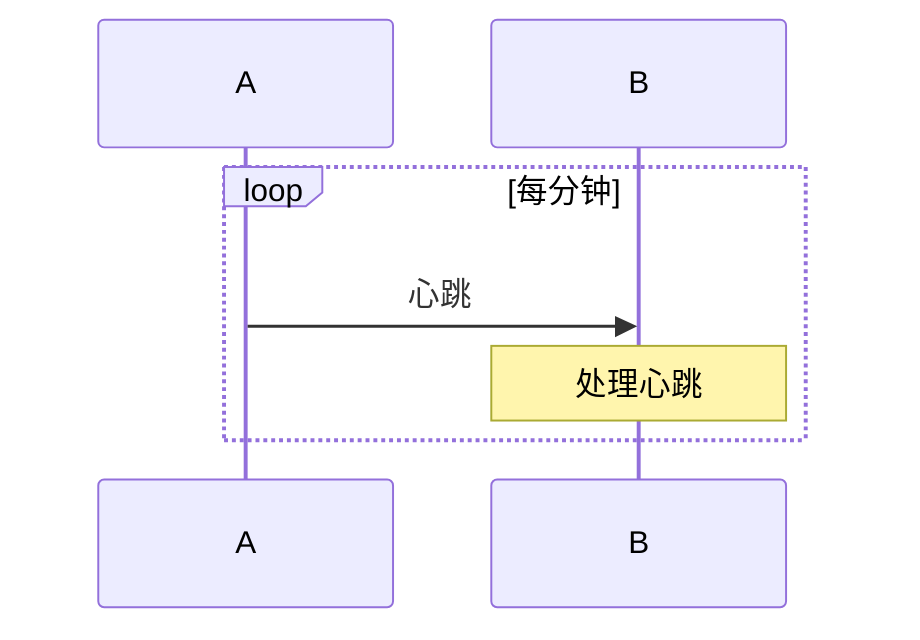
````

---

**基本写法：条件分支**
`alt <条件>` ... `else` ... `end`
````markdown
# 条件分支结构
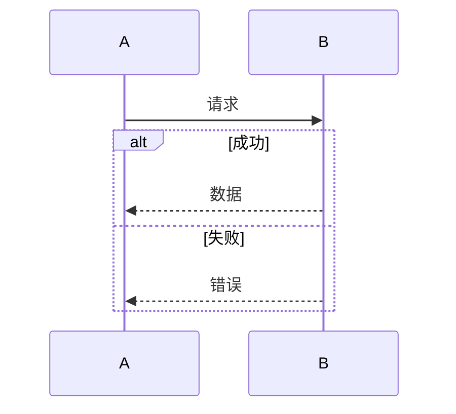
````

---

## 类图（class）

**基本写法：基础类图**
`classDiagram`
`    class <类名>`
````markdown
# 定义类与属性
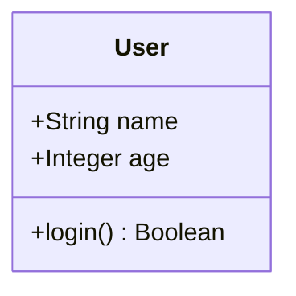
````

---

**基本写法：类关系**
`<类A> <关系> <类B>`
````markdown
# 不同箭头表示继承、组合、聚合等关系
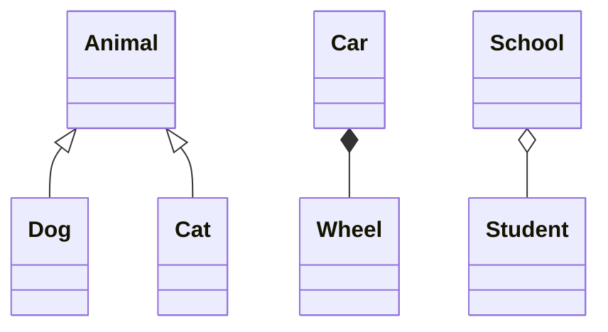
````

---

**基本写法：可见性修饰**
`+` 公有、`-` 私有、`#` 受保护、`~` 包内
````markdown
# 用符号标注成员可见性
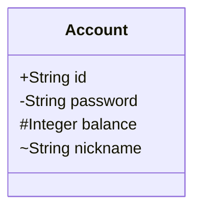
````

---

## 状态图（state）

**基本写法：基础状态图**
`stateDiagram-v2`
`    [*] --> <状态>`
````markdown
# 状态转换图
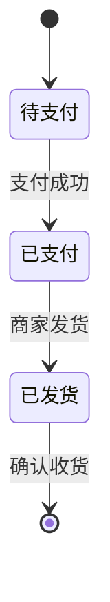
````

---

**基本写法：状态描述**
`<状态>: <说明>`
````markdown
# 状态下方写详细描述
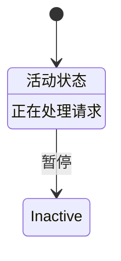
````

---

**基本写法：复合状态**
`state <名称> {` ... `}`
````markdown
# 嵌套的复合状态
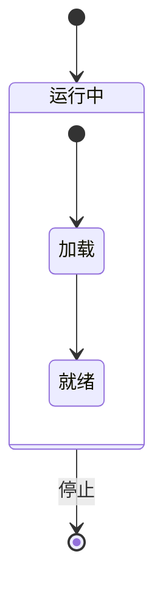
````

---

**基本写法：分支状态**
`<<choice>>` 与条件分支
````markdown
# 用 choice 实现条件分支
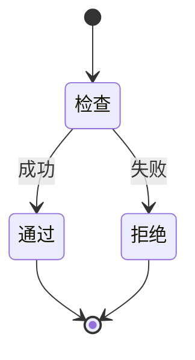
````

---

## 甘特图（gantt）

**基本写法：基础甘特图**
`gantt`
`    dateFormat <格式>`
````markdown
# 项目任务时间线
```mermaid
gantt
    title 项目计划
    dateFormat YYYY-MM-DD
    section 设计
    需求分析 :a1, 2024-01-01, 5d
    原型设计 :after a1, 3d
    section 开发
    编码 :2024-01-10, 10d
```
````

---

**基本写法：任务状态**
`done`、`active`、`crit`
````markdown
# 标记任务状态与关键路径
```mermaid
gantt
    dateFormat YYYY-MM-DD
    section 阶段一
    已完成 :done, a1, 2024-01-01, 3d
    进行中 :active, a2, after a1, 5d
    关键任务 :crit, a3, after a2, 4d
```
````

---

## 饼图（pie）

**基本写法：基础饼图**
`pie title <标题>`
`    "<标签>" : <数值>`
````markdown
# 用饼图展示占比
```mermaid
pie title 浏览器市场份额
    "Chrome" : 65
    "Safari" : 18
    "Edge" : 5
    "其他" : 12
```
````

---

## 用户旅程图（journey）

**基本写法：基础旅程图**
`journey`
`    title <标题>`
````markdown
# 描述用户体验旅程
```mermaid
journey
    title 用户购物流程
    section 浏览
      访问首页: 5: 用户
      搜索商品: 4: 用户
    section 下单
      加入购物车: 5: 用户
      提交订单: 3: 用户, 系统
```
````

---

## 主题与样式

**基本写法：自定义节点样式**
`style <节点> fill:<颜色>,stroke:<颜色>`
````markdown
# 修改节点颜色样式
```mermaid
graph TD
    A[开始] --> B[处理]
    style A fill:#f9f,stroke:#333
    style B fill:#bbf,stroke:#369
```
````

---

**基本写法：定义类样式**
`classDef <类名> fill:<颜色>,stroke:<颜色>`
`class <节点> <类名>`
````markdown
# 用 classDef 复用样式
```mermaid
graph LR
    A --> B --> C
    classDef highlight fill:#ff9,stroke:#333
    class B highlight
```
````

---

## 链接与交互

**基本写法：节点绑定链接**
`click <节点> "<URL>"`
````markdown
# 点击节点跳转链接
```mermaid
graph TD
    A[文档] --> B[官网]
    click A "https://example.com/docs"
    click B "https://example.com"
```
````

---

**基本写法：节点回调函数**
`click <节点> call <函数>`
````markdown
# 点击节点调用 JavaScript 函数
```mermaid
graph TD
    A[按钮] --> B[处理]
    click A call handleButtonClick()
```
````
