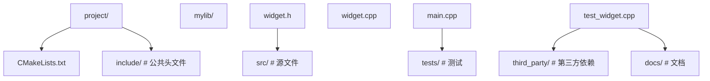

<!-- ============ 文档分隔线：026-cpp/001-CppBasicSyntax.md ============ -->

# 基础语法

> **符号约定**：`< >` 必填参数 | `[ ]` 可选参数

---

## 头文件包含

**系统头文件写法：包含系统头文件**
`#include <<header>>`
```cpp
// 包含输入输出流头文件
#include <iostream>
```

---

**用户头文件写法：包含自定义头文件**
`#include "<header>"`
```cpp
// 包含当前目录下的头文件
#include "myheader.h"
```

---

## 命名空间

**基本写法：使用命名空间**
`using namespace <name>;`
```cpp
// 使用标准命名空间
using namespace std;
```

---

**作用域写法：使用命名空间中的特定成员**
`using <namespace>::<member>;`
```cpp
// 使用 std::cout
using std::cout;
```

---

**限定写法：使用完整限定名**
`<namespace>::<member>`
```cpp
// 使用完整限定名
std::cout << "Hello" << std::endl;
```

---

**定义写法：自定义命名空间**
`namespace <name> { ... }`
```cpp
// 定义命名空间
namespace MyMath {
    int add(int a, int b) { return a + b; }
}
```

---

## 输入输出

**输出写法：标准输出**
`std::cout << <value>;`
```cpp
// 输出字符串到标准输出
std::cout << "Hello C++";
```

---

**换行写法：输出并换行**
`std::cout << <value> << std::endl;`
```cpp
// 输出并换行
std::cout << "Hello" << std::endl;
```

---

**输入写法：标准输入**
`std::cin >> <variable>;`
```cpp
// 从标准输入读取
int age;
std::cin >> age;
```

---

**多值输入写法：连续读取多个值**
`std::cin >> <var1> >> <var2>;`
```cpp
// 连续读取多个值
int a, b;
std::cin >> a >> b;
```

---

## main 函数

**无参写法：无参数主函数**
`int main() { ... return 0; }`
```cpp
// 无参数形式的 main 函数
int main() {
    std::cout << "Hello" << std::endl;
    return 0;
}
```

---

**带参写法：命令行参数主函数**
`int main(int argc, char *argv[]) { ... }`
```cpp
// argc 为参数个数，argv 为参数字符串数组
int main(int argc, char *argv[]) {
    for (int i = 0; i < argc; i++) {
        std::cout << argv[i] << std::endl;
    }
    return 0;
}
```

---

## 变量声明与初始化

**基本写法：变量声明与初始化**
`<type> <var_name> = <value>;`
```cpp
// 声明并初始化变量
int x = 10;
```

---

**直接初始化写法：构造函数式初始化**
`<type> <var_name>(<value>);`
```cpp
// 直接初始化
int x(10);
```

---

**列表初始化写法：C++11 列表初始化**
`<type> <var_name>{<value>};`
```cpp
// 列表初始化
int x{10};
```

---

**auto 写法：自动类型推导**
`auto <var_name> = <value>;`
```cpp
// 编译器自动推导类型
auto x = 10;
```

---

**decltype 写法：推导表达式类型**
`decltype(<expression>) <var_name>;`
```cpp
// 推导表达式的类型
int a = 10;
decltype(a) b = 20;
```

---

**const 写法：常量声明**
`const <type> <var_name> = <value>;`
```cpp
// 声明常量
const int MAX_SIZE = 100;
```

---

**constexpr 写法：编译期常量**
`constexpr <type> <var_name> = <value>;`
```cpp
// 编译期常量
constexpr int SIZE = 10;
```

---

## 注释

**单行写法：单行注释**
`// <注释内容>`
```cpp
// 这是一个单行注释
int x = 10;
```

---

**多行写法：多行注释**
`/* <注释内容> */`
```cpp
/*
 * 这是一个多行注释
 * 可以跨越多行
 */
int y = 20;
```

---

## 引用

**基本写法：左值引用**
`<type>& <ref_name> = <var>;`
```cpp
// 引用是变量的别名
int x = 10;
int& ref = x;
```

---

**常量引用写法：const 引用**
`const <type>& <ref_name> = <value>;`
```cpp
// 常量引用，不能通过引用修改值
const int& ref = 10;
```

---

**右值引用写法：C++11 右值引用**
`<type>&& <ref_name> = <value>;`
```cpp
// 右值引用，绑定到临时值
int&& rref = 10;
```

---

## 指针

**基本写法：指针声明与初始化**
`<type>* <ptr_name> = &<var>;`
```cpp
// ptr 指向 x 的地址
int x = 10;
int* ptr = &x;
```

---

**空指针写法：C++11 nullptr**
`<type>* <ptr_name> = nullptr;`
```cpp
// 初始化为空指针
int* ptr = nullptr;
```

---

**智能指针写法：unique_ptr**
`std::unique_ptr<<type>> <ptr> = std::make_unique<<type>>(<args>);`
```cpp
#include <memory>
// 独占所有权的智能指针
std::unique_ptr<int> p = std::make_unique<int>(10);
```

---

**智能指针写法：shared_ptr**
`std::shared_ptr<<type>> <ptr> = std::make_shared<<type>>(<args>);`
```cpp
#include <memory>
// 共享所有权的智能指针
std::shared_ptr<int> p = std::make_shared<int>(10);
```

---

## 类型转换

**static_cast 写法：静态类型转换**
`static_cast<<target_type>>(<expression>)`
```cpp
// 静态类型转换
double pi = 3.14;
int rounded = static_cast<int>(pi);
```

---

**dynamic_cast 写法：动态类型转换**
`dynamic_cast<<target_type>>(<expression>)`
```cpp
// 动态类型转换（用于多态类型）
Base* base = new Derived();
Derived* derived = dynamic_cast<Derived*>(base);
```

---

**const_cast 写法：常量转换**
`const_cast<<target_type>>(<expression>)`
```cpp
// 添加或移除 const
const int* cp = &x;
int* p = const_cast<int*>(cp);
```

---

**reinterpret_cast 写法：重解释转换**
`reinterpret_cast<<target_type>>(<expression>)`
```cpp
// 重解释类型转换
long addr = reinterpret_cast<long>(ptr);
```

---

## 异常处理

**基本写法：try-catch**
`try { ... } catch (<type> <e>) { ... }`
```cpp
// 异常处理
try {
    throw std::runtime_error("Error");
} catch (const std::exception& e) {
    std::cerr << e.what() << std::endl;
}
```

---

**抛出写法：抛出异常**
`throw <expression>;`
```cpp
// 抛出异常
throw std::runtime_error("Something went wrong");
```

---

**多 catch 写法：捕获多种异常**
`try { ... } catch (<type1> <e>) { ... } catch (<type2> <e>) { ... }`
```cpp
// 捕获多种异常
try {
    // 可能抛出不同异常的代码
} catch (const std::runtime_error& e) {
    std::cerr << e.what() << std::endl;
} catch (const std::logic_error& e) {
    std::cerr << e.what() << std::endl;
}
```

---

## 编译命令

**单文件写法：编译单个源文件**
`g++ <source.cpp> -o <output>`
```bash
# 编译 hello.cpp 生成可执行文件 hello
g++ hello.cpp -o hello
```

---

**标准写法：指定 C++ 标准**
`g++ -std=c++17 <source.cpp> -o <output>`
```bash
# 使用 C++17 标准编译
g++ -std=c++17 hello.cpp -o hello
```

---

## C++23/26 新特性

**基本写法：C++23 std::print**
`std::print("<格式>", <参数>);`
```cpp
// 格式化输出到 stdout，支持 {} 占位符
#include <print>
std::print("Hello, {}! Value = {}\n", "World", 42);
// 输出：Hello, World! Value = 42
```

**基本写法：C++23 std::println**
`std::println("<格式>", <参数>);`
```cpp
// 自动换行的格式化输出
#include <print>
std::println("Sum of {} and {} is {}", 3, 5, 8);
// 输出：Sum of 3 and 5 is 8（自动换行）
```

**基本写法：C++23 if consteval**
`if consteval { }`
```cpp
// 编译期分支判断：仅在常量求值上下文中执行
constexpr int compute(int x) {
    if consteval {
        return x * 2;  // 编译期执行
    } else {
        return x + 1;  // 运行期执行
    }
}
```

**基本写法：C++23 多维下标运算符**
`operator[](size_t x, size_t y)`
```cpp
// 支持多维下标访问，简化矩阵类设计
class Matrix {
    int data[3][3];
public:
    // 多参数 operator[]
    int& operator[](size_t i, size_t j) {
        return data[i][j];
    }
};
Matrix m;
m[1, 2] = 42;  // 直接多维访问
```

**基本写法：C++23 static call operator**
`static operator()(<参数>) { }`
```cpp
// 静态调用运算符：无需实例即可调用
class Calculator {
public:
    static int operator()(int a, int b) {
        return a + b;
    }
};
// 直接通过类型名调用
int result = Calculator()(3, 4);  // 返回 7
```

**基本写法：C++26 = delete 原因**
`= delete("reason");`
```cpp
// = delete 支持说明删除原因
class NonCopyable {
public:
    NonCopyable() = default;
    // 禁用拷贝构造并说明原因
    NonCopyable(const NonCopyable&) = delete("该类不允许拷贝构造");
    NonCopyable& operator=(const NonCopyable&) = delete("该类不允许拷贝赋值");
};
```

**基本写法：C++26 pack indexing**
`typename...<T>[N]`
```cpp
// 模板参数包索引：直接访问参数包中第 N 个类型
template <typename... Ts>
using First = Ts...[0];  // 取参数包第一个类型
template <typename... Ts>
using Last = Ts...[sizeof...(Ts) - 1];  // 取参数包最后一个类型
// 使用
First<int, double, char> a = 10;   // a 为 int
Last<int, double, char> b = 3.14;  // b 为 double
```

**基本写法：C++26 hazard pointer**
`std::hazard_pointer<<T>>`
```cpp
// 危险指针：用于无锁数据结构的安全内存回收
#include <hazard_pointer>
// 获取危险指针
std::hazard_pointer hp = std::make_hazard_pointer();
// 保护对象指针，防止被回收
hp.protect(ptr);
// 操作受保护对象
if (hp.get() != nullptr) {
    hp.get()->do_something();
}
// 离开作用域自动释放保护
```

**基本写法：C++26 RCU(Read-Copy-Update)**
`std::rcu<<T>>`
```cpp
// RCU：读多写少场景的无锁同步原语
#include <rcu>
// 读端：在 RCU 域中安全访问共享数据
std::rcu_reader reader;
auto* p = shared_ptr.load();
if (p) p->read_data();
// 写端：复制更新后原子替换，并延迟回收旧数据
auto* new_data = new Data(*p);
new_data->update();
shared_ptr.store(new_data);
std::rcu_retire(p);  // 等待所有读者退出后回收
```


<!-- ============ 文档分隔线：026-cpp/002-COOPBasics.md ============ -->

# 面向对象基础

> **符号约定**：`< >` 必填参数 | `[ ]` 可选参数

---

## 类定义

**基本写法：类定义**
`class <ClassName> { private: ... public: ... };`
```cpp
// 定义 Point 类
class Point {
private:
    int x;
    int y;
public:
    Point(int x, int y) : x(x), y(y) {}
    int getX() { return x; }
};
```

---

**struct 写法：使用 struct 定义类**
`struct <ClassName> { ... };`
```cpp
// 使用 struct 定义类（默认 public）
struct Point {
    int x;
    int y;
};
```

---

## 访问修饰符

**public 写法：公有成员**
`public: <members>`
```cpp
// 公有成员，外部可访问
class MyClass {
public:
    int public_var;
};
```

---

**private 写法：私有成员**
`private: <members>`
```cpp
// 私有成员，仅类内部可访问
class MyClass {
private:
    int private_var;
};
```

---

**protected 写法：受保护成员**
`protected: <members>`
```cpp
// 受保护成员，类内部和派生类可访问
class MyClass {
protected:
    int protected_var;
};
```

---

## 构造函数

**默认写法：默认构造函数**
`<ClassName>() { ... }`
```cpp
// 默认构造函数
class Point {
    int x, y;
public:
    Point() : x(0), y(0) {}
};
```

---

**参数化写法：带参数构造函数**
`<ClassName>(<params>) { ... }`
```cpp
// 带参数构造函数
class Point {
    int x, y;
public:
    Point(int x, int y) : x(x), y(y) {}
};
```

---

**初始化列表写法：成员初始化列表**
`<ClassName>(<params>) : <member1>(<val1>), <member2>(<val2>) { ... }`
```cpp
// 使用初始化列表初始化成员
class Point {
    int x, y;
public:
    Point(int x, int y) : x(x), y(y) {}
};
```

---

**委托写法：委托构造函数**
`<ClassName>(<params>) : <ClassName>(<other_params>) { ... }`
```cpp
// 委托给另一个构造函数
class Point {
    int x, y;
public:
    Point() : Point(0, 0) {}
    Point(int x, int y) : x(x), y(y) {}
};
```

---

**explicit 写法：禁止隐式转换**
`explicit <ClassName>(<params>) { ... }`
```cpp
// 禁止隐式转换
class MyInt {
    int value;
public:
    explicit MyInt(int v) : value(v) {}
};
```

---

## 拷贝构造函数

**基本写法：拷贝构造函数**
`<ClassName>(const <ClassName>& <other>) { ... }`
```cpp
// 拷贝构造函数
class String {
    char* data;
public:
    String(const String& other) {
        data = new char[strlen(other.data) + 1];
        strcpy(data, other.data);
    }
};
```

---

**禁用写法：禁用拷贝构造函数**
`<ClassName>(const <ClassName>&) = delete;`
```cpp
// 禁用拷贝构造函数
class NonCopyable {
public:
    NonCopyable(const NonCopyable&) = delete;
};
```

---

## 移动构造函数

**基本写法：移动构造函数**
`<ClassName>(<ClassName>&& <other>) noexcept { ... }`
```cpp
// 移动构造函数
class String {
    char* data;
public:
    String(String&& other) noexcept : data(other.data) {
        other.data = nullptr;
    }
};
```

---

## 析构函数

**基本写法：析构函数**
`~<ClassName>() { ... }`
```cpp
// 析构函数
class String {
    char* data;
public:
    ~String() {
        delete[] data;
    }
};
```

---

**virtual 写法：虚析构函数**
`virtual ~<ClassName>() { ... }`
```cpp
// 虚析构函数，确保派生类正确析构
class Base {
public:
    virtual ~Base() {}
};
```

---

## this 指针

**基本写法：使用 this 指针**
`this-><member>`
```cpp
// 使用 this 指针访问成员
class Point {
    int x;
public:
    void setX(int x) {
        this->x = x;
    }
};
```

---

**返回写法：返回 *this**
`return *this;`
```cpp
// 返回 *this 支持链式调用
class Builder {
    std::string str;
public:
    Builder& append(const std::string& s) {
        str += s;
        return *this;
    }
};
```

---

## 静态成员

**静态成员变量写法**
`static <type> <var_name>;`
```cpp
// 静态成员变量声明
class Counter {
public:
    static int count;
};
int Counter::count = 0;
```

---

**静态成员函数写法**
`static <return_type> <func>() { ... }`
```cpp
// 静态成员函数
class Counter {
public:
    static int get_count() { return count; }
};
```

---

**调用写法：通过类名调用静态成员**
`<ClassName>::<static_member>`
```cpp
// 通过类名调用静态成员
int c = Counter::count;
```

---

## 友元

**友元函数写法**
`friend <return_type> <func>(<params>);`
```cpp
// 声明友元函数
class Point {
    int x, y;
public:
    friend void print(const Point& p);
};

void print(const Point& p) {
    std::cout << p.x << ", " << p.y << std::endl;
}
```

---

**友元类写法**
`friend class <ClassName>;`
```cpp
// 声明友元类
class A {
    int private_var;
public:
    friend class B;
};

class B {
public:
    void access(A& a) { std::cout << a.private_var << std::endl; }
};
```

---

## 继承

**基本写法：公有继承**
`class <Derived> : public <Base> { ... };`
```cpp
// 公有继承
class Animal {
public:
    void eat() { std::cout << "Eating" << std::endl; }
};
class Dog : public Animal {
public:
    void bark() { std::cout << "Barking" << std::endl; }
};
```

---

**私有继承写法**
`class <Derived> : private <Base> { ... };`
```cpp
// 私有继承
class Derived : private Base {
};
```

---

**多继承写法**
`class <Derived> : public <Base1>, public <Base2> { ... };`
```cpp
// 多继承
class Drawable {
public:
    virtual void draw() {}
};
class Animal {
public:
    virtual void eat() {}
};
class Dog : public Animal, public Drawable {
};
```

---

## 虚函数与多态

**基本写法：虚函数**
`virtual <return_type> <func>(<params>) { ... }`
```cpp
// 虚函数
class Animal {
public:
    virtual void sound() {
        std::cout << "Animal sound" << std::endl;
    }
};
```

---

**override 写法：重写虚函数**
`virtual <return_type> <func>(<params>) override { ... }`
```cpp
// 重写虚函数
class Dog : public Animal {
public:
    void sound() override {
        std::cout << "Woof" << std::endl;
    }
};
```

---

**纯虚函数写法**
`virtual <return_type> <func>(<params>) = 0;`
```cpp
// 纯虚函数，使类成为抽象类
class Shape {
public:
    virtual double area() = 0;
};
```

---

**final 写法：禁止重写**
`virtual <return_type> <func>(<params>) final { ... }`
```cpp
// 禁止派生类重写
class Base {
public:
    virtual void func() final {}
};
```

---

## 多态使用

**基本写法：通过基类指针调用虚函数**
`<Base>* <ptr> = new <Derived>(); <ptr>-><virtual_func>();`
```cpp
// 通过基类指针调用虚函数（多态）
Animal* animal = new Dog();
animal->sound();
```

---

**引用写法：通过基类引用调用虚函数**
`<Base>& <ref> = <derived>; <ref>.<virtual_func>();`
```cpp
// 通过基类引用调用虚函数（多态）
Dog dog;
Animal& ref = dog;
ref.sound();
```


<!-- ============ 文档分隔线：026-cpp/003-NamespaceLinkage.md ============ -->

# 命名空间与链接

> **符号约定**：`< >` 必填参数 | `[ ]` 可选参数

---

## 命名空间定义

**基本写法：定义命名空间**
`namespace <name> { ... }`
```cpp
// 定义命名空间
namespace MyMath {
    int add(int a, int b) { return a + b; }
}
```

---

**嵌套写法：嵌套命名空间**
`namespace <outer> { namespace <inner> { ... } }`
```cpp
// 嵌套命名空间
namespace Outer {
    namespace Inner {
        int value = 10;
    }
}
```

---

**C++17 写法：嵌套命名空间简化**
`namespace <outer>::<inner> { ... }`
```cpp
// C++17 嵌套命名空间简化写法
namespace Outer::Inner {
    int value = 10;
}
```

---

## 使用命名空间

**基本写法：使用整个命名空间**
`using namespace <name>;`
```cpp
// 使用标准命名空间
using namespace std;
```

---

**特定成员写法：使用命名空间中的特定成员**
`using <namespace>::<member>;`
```cpp
// 使用 std::cout
using std::cout;
```

---

**限定写法：使用完整限定名**
`<namespace>::<member>`
```cpp
// 使用完整限定名
std::cout << "Hello" << std::endl;
```

---

**作用域写法：命名空间别名**
`namespace <alias> = <original>;`
```cpp
// 命名空间别名
namespace fs = std::filesystem;
```

---

## 内部链接

**static 写法：内部链接变量**
`static <type> <var_name> = <value>;`
```cpp
// static 全局变量，仅当前文件可见
static int file_count = 0;
```

---

**static 写法：内部链接函数**
`static <return_type> <func>(<params>) { ... }`
```cpp
// static 函数，仅当前文件可见
static void helper() {
    // 内部辅助函数
}
```

---

**匿名命名空间写法：匿名命名空间**
`namespace { ... }`
```cpp
// 匿名命名空间，内容仅当前文件可见
namespace {
    int internal_var = 10;
}
```

---

## inline 命名空间

**基本写法：inline 命名空间**
`inline namespace <name> { ... }`
```cpp
// inline 命名空间，成员直接暴露到外层
inline namespace V1 {
    void func() {}
}
```

---

## 链接属性

**基本写法：查看符号链接属性**
`nm <object_file>`
```bash
# 查看目标文件的符号表
nm myprogram.o
```

---

**extern template 写法：显式实例化声明**
`extern template class <ClassName><<type>>;`
```cpp
// 显式实例化声明，避免重复实例化
extern template class std::vector<int>;
```

---

**显式实例化写法：显式实例化定义**
`template class <ClassName><<type>>;`
```cpp
// 显式实例化定义
template class std::vector<int>;
```

---

## 头文件与源文件分离

**头文件写法：声明放在头文件**
`// header.h: <return_type> <func>(<params>);`
```cpp
// header.h
#ifndef MY_HEADER_H
#define MY_HEADER_H
void my_function();
#endif
```

---

**源文件写法：定义放在源文件**
`// source.cpp: <return_type> <func>(<params>) { ... }`
```cpp
// source.cpp
#include "header.h"
void my_function() {
    // 函数实现
}
```

---

## 编译与链接

**编译写法：编译为目标文件**
`g++ -c <source.cpp> -o <object.o>`
```bash
# 编译 source.cpp 生成目标文件
g++ -c source.cpp -o source.o
```

---

**链接写法：链接多个目标文件**
`g++ <file1.o> <file2.o> -o <output>`
```bash
# 链接多个目标文件生成可执行文件
g++ main.o utils.o -o program
```


<!-- ============ 文档分隔线：026-cpp/004-VariadicTemplate.md ============ -->

# 模板

> **符号约定**：`< >` 必填参数 | `[ ]` 可选参数

---

## 函数模板

**基本写法：函数模板定义**
`template<typename T> <return_type> <func>(T <param>) { ... }`
```cpp
// 定义通用加法函数模板
template<typename T>
T add(T a, T b) {
    return a + b;
}
```

---

**调用写法：隐式实例化**
`<func>(<arg1>, <arg2>);`
```cpp
// 编译器自动推导模板参数
int result = add(10, 20);
```

---

**调用写法：显式指定模板参数**
`<func><<type>>(<args>);`
```cpp
// 显式指定模板参数类型
double result = add<double>(10.5, 20.5);
```

---

**多参数写法：多类型参数函数模板**
`template<typename T1, typename T2> <return_type> <func>(T1 <a>, T2 <b>) { ... }`
```cpp
// 多类型参数函数模板
template<typename T1, typename T2>
void print(T1 a, T2 b) {
    std::cout << a << ", " << b << std::endl;
}
```

---

**非类型写法：非类型模板参数**
`template<int N> <return_type> <func>() { ... }`
```cpp
// 非类型模板参数
template<int N>
int get_size() {
    return N;
}
```

---

## 类模板

**基本写法：类模板定义**
`template<typename T> class <ClassName> { ... };`
```cpp
// 定义栈类模板
template<typename T>
class Stack {
    std::vector<T> data;
public:
    void push(const T& value) { data.push_back(value); }
    T pop() { T val = data.back(); data.pop_back(); return val; }
};
```

---

**使用写法：实例化类模板**
`<ClassName><<type>> <var_name>;`
```cpp
// 实例化 int 类型的栈
Stack<int> int_stack;
```

---

**多参数写法：多类型参数类模板**
`template<typename T1, typename T2> class <ClassName> { ... };`
```cpp
// 多类型参数类模板
template<typename Key, typename Value>
class Map {
    std::vector<std::pair<Key, Value>> data;
};
```

---

**非类型写法：非类型参数类模板**
`template<int N> class <ClassName> { ... };`
```cpp
// 非类型参数类模板
template<int N>
class Array {
    T data[N];
};
```

---

**默认参数写法：模板默认参数**
`template<typename T = int> class <ClassName> { ... };`
```cpp
// 模板默认参数
template<typename T = int>
class Container {
    T value;
};
```

---

## 模板特化

**全特化写法：完全特化**
`template<> class <ClassName><<type>> { ... };`
```cpp
// 对 int 类型完全特化
template<>
class Stack<int> {
    int data[100];
};
```

---

**偏特化写法：部分特化**
`template<typename T> class <ClassName><T*> { ... };`
```cpp
// 对指针类型部分特化
template<typename T>
class Stack<T*> {
    std::vector<T*> data;
};
```

---

**函数特化写法：函数模板全特化**
`template<> <return_type> <func><<type>>(<type> <param>) { ... }`
```cpp
// 对 const char* 类型特化
template<>
std::string add(const char* a, const char* b) {
    return std::string(a) + std::string(b);
}
```

---

## 变长参数模板

**基本写法：变长参数模板**
`template<typename... Args> <return_type> <func>(Args... <args>) { ... }`
```cpp
// 变长参数模板
template<typename... Args>
void print(Args... args) {
    // 使用折叠表达式展开参数包
}
```

---

**sizeof 写法：获取参数包大小**
`sizeof...(args)`
```cpp
// 获取参数包中的参数个数
template<typename... Args>
void count_args(Args... args) {
    std::cout << sizeof...(args) << std::endl;
}
```

---

**折叠写法：C++17 折叠表达式**
`(... <op> <args>)`
```cpp
// 使用折叠表达式求和
template<typename... Args>
auto sum(Args... args) {
    return (... + args);
}
```

---

## 模板元编程

**编译期计算写法：模板递归**
`template<int N> struct <Factorial> { static const int value = N * <Factorial><N-1>::value; };`
```cpp
// 编译期计算阶乘
template<int N>
struct Factorial {
    static const int value = N * Factorial<N - 1>::value;
};

template<>
struct Factorial<0> {
    static const int value = 1;
};
```

---

**类型萃取写法：使用 type_traits**
`std::is_integral<<type>>::value`
```cpp
#include <type_traits>
// 检查类型是否为整数
bool is_int = std::is_integral<int>::value;
```

---

## SFINAE

**enable_if 写法：启用/禁用函数模板**
`template<typename T, typename = std::enable_if_t<<condition>>>`
```cpp
#include <type_traits>
// 仅当 T 为整数类型时启用
template<typename T, typename = std::enable_if_t<std::is_integral_v<T>>>
void process(T value) {
    std::cout << value << std::endl;
}
```

---

## if constexpr

**基本写法：编译期条件判断**
`if constexpr (<condition>) { ... } else { ... }`
```cpp
// 编译期条件判断
template<typename T>
void process(T value) {
    if constexpr (std::is_integral_v<T>) {
        std::cout << "Integer: " << value << std::endl;
    } else {
        std::cout << "Other: " << value << std::endl;
    }
}
```

---

## 概念与约束（C++20）

**基本写法：定义概念**
`template<typename T> concept <ConceptName> = <condition>;`
```cpp
#include <concepts>
// 定义概念
template<typename T>
concept Numeric = std::is_integral_v<T> || std::is_floating_point_v<T>;
```

---

**约束写法：使用概念约束模板**
`template<Numeric T> <return_type> <func>(T <param>) { ... }`
```cpp
// 使用概念约束模板参数
template<Numeric T>
T add(T a, T b) {
    return a + b;
}
```

---

**requires 写法：使用 requires 子句**
`template<typename T> requires <Concept> <return_type> <func>(T <param>) { ... }`
```cpp
// 使用 requires 子句
template<typename T>
requires std::integral<T>
T add(T a, T b) {
    return a + b;
}
```


<!-- ============ 文档分隔线：026-cpp/005-FileIOFileSystem.md ============ -->

# 文件IO与文件系统

> **符号约定**：`< >` 必填参数 | `[ ]` 可选参数

---

## 文件流基础

**包含头文件写法**
`#include <fstream>`
```cpp
// 包含文件流头文件
#include <fstream>
```

---

## 文件打开与关闭

**输出流写法：打开输出文件流**
`std::ofstream <ofs>("<filename>");`
```cpp
#include <fstream>
// 打开输出文件流
std::ofstream ofs("output.txt");
```

---

**输入流写法：打开输入文件流**
`std::ifstream <ifs>("<filename>");`
```cpp
#include <fstream>
// 打开输入文件流
std::ifstream ifs("input.txt");
```

---

**打开模式写法：指定打开模式**
`std::ofstream <ofs>("<filename>", <mode>);`
```cpp
#include <fstream>
// 以追加模式打开文件
std::ofstream ofs("log.txt", std::ios::app);
```

---

**检查写法：检查文件是否打开成功**
`if (!<stream>) { ... }` 或 `if (<stream>.is_open()) { ... }`
```cpp
// 检查文件是否成功打开
std::ifstream ifs("data.txt");
if (!ifs) {
    std::cerr << "Failed to open file" << std::endl;
}
```

---

**关闭写法：关闭文件流**
`<stream>.close();`
```cpp
// 关闭文件流
ofs.close();
```

---

## 写入文件

**基本写法：使用 << 写入**
`<ofs> << <value>;`
```cpp
// 使用 << 写入数据
std::ofstream ofs("output.txt");
ofs << "Hello World" << std::endl;
ofs << 42 << std::endl;
```

---

**write 写法：二进制写入**
`<ofs>.write(<buffer>, <size>);`
```cpp
// 二进制写入
std::ofstream ofs("data.bin", std::ios::binary);
int data = 42;
ofs.write(reinterpret_cast<const char*>(&data), sizeof(data));
```

---

## 读取文件

**基本写法：使用 >> 读取**
`<ifs> >> <var>;`
```cpp
// 使用 >> 读取数据
std::ifstream ifs("input.txt");
int value;
ifs >> value;
```

---

**getline 写法：读取一行**
`std::getline(<ifs>, <line>);`
```cpp
#include <string>
// 读取一行
std::ifstream ifs("input.txt");
std::string line;
std::getline(ifs, line);
```

---

**read 写法：二进制读取**
`<ifs>.read(<buffer>, <size>);`
```cpp
// 二进制读取
std::ifstream ifs("data.bin", std::ios::binary);
int data;
ifs.read(reinterpret_cast<char*>(&data), sizeof(data));
```

---

## 遍历文件

**按行遍历写法：逐行读取文件**
`while (std::getline(<ifs>, <line>)) { ... }`
```cpp
#include <fstream>
#include <string>
// 逐行读取文件
std::ifstream ifs("input.txt");
std::string line;
while (std::getline(ifs, line)) {
    std::cout << line << std::endl;
}
```

---

**按字符遍历写法：逐字符读取**
`while (<ifs>.get(<ch>)) { ... }`
```cpp
// 逐字符读取文件
std::ifstream ifs("input.txt");
char ch;
while (ifs.get(ch)) {
    std::cout << ch;
}
```

---

## 文件定位

**seekg 写法：设置读取位置**
`<ifs>.seekg(<offset>, <origin>);`
```cpp
// 设置读取位置到文件开头
ifs.seekg(0, std::ios::beg);
```

---

**tellg 写法：获取读取位置**
`std::streampos <pos> = <ifs>.tellg();`
```cpp
// 获取当前读取位置
std::streampos pos = ifs.tellg();
```

---

**seekp 写法：设置写入位置**
`<ofs>.seekp(<offset>, <origin>);`
```cpp
// 设置写入位置到文件末尾
ofs.seekp(0, std::ios::end);
```

---

## 文件状态检查

**eof 写法：检查文件结束**
`<ifs>.eof()`
```cpp
// 检查是否到达文件末尾
if (ifs.eof()) {
    std::cout << "End of file" << std::endl;
}
```

---

**fail 写法：检查文件错误**
`<ifs>.fail()`
```cpp
// 检查文件操作是否失败
if (ifs.fail()) {
    std::cerr << "File operation failed" << std::endl;
}
```

---

**clear 写法：清除错误状态**
`<ifs>.clear();`
```cpp
// 清除文件错误状态
ifs.clear();
```

---

## 字符串流

**istringstream 写法：字符串输入流**
`std::istringstream <iss>(<str>);`
```cpp
#include <sstream>
// 从字符串读取
std::string str = "10 20 30";
std::istringstream iss(str);
int a, b, c;
iss >> a >> b >> c;
```

---

**ostringstream 写法：字符串输出流**
`std::ostringstream <oss>;`
```cpp
#include <sstream>
// 写入到字符串
std::ostringstream oss;
oss << "Value: " << 42;
std::string result = oss.str();
```

---

**stringstream 写法：双向字符串流**
`std::stringstream <ss>;`
```cpp
#include <sstream>
// 双向字符串流
std::stringstream ss;
ss << "Hello";
std::string result;
ss >> result;
```

---

## 文件系统（C++17）

**包含头文件写法**
`#include <filesystem>`
```cpp
// 包含文件系统头文件
#include <filesystem>
namespace fs = std::filesystem;
```

---

**创建目录写法**
`fs::create_directory(<path>);`
```cpp
#include <filesystem>
// 创建目录
fs::create_directory("mydir");
```

---

**创建多级目录写法**
`fs::create_directories(<path>);`
```cpp
#include <filesystem>
// 创建多级目录
fs::create_directories("a/b/c");
```

---

**删除文件写法**
`fs::remove(<path>);`
```cpp
#include <filesystem>
// 删除文件
fs::remove("file.txt");
```

---

**删除目录写法**
`fs::remove_all(<path>);`
```cpp
#include <filesystem>
// 递归删除目录
fs::remove_all("mydir");
```

---

**检查文件存在写法**
`fs::exists(<path>)`
```cpp
#include <filesystem>
// 检查文件是否存在
if (fs::exists("file.txt")) {
    std::cout << "File exists" << std::endl;
}
```

---

**复制文件写法**
`fs::copy(<src>, <dest>);`
```cpp
#include <filesystem>
// 复制文件
fs::copy("src.txt", "dest.txt");
```

---

**重命名文件写法**
`fs::rename(<old>, <new>);`
```cpp
#include <filesystem>
// 重命名文件
fs::rename("old.txt", "new.txt");
```

---

**获取文件大小写法**
`fs::file_size(<path>)`
```cpp
#include <filesystem>
// 获取文件大小
std::uintmax_t size = fs::file_size("file.txt");
```

---

## 目录遍历

**基本写法：遍历目录**
`for (const auto& <entry> : fs::directory_iterator(<path>)) { ... }`
```cpp
#include <filesystem>
// 遍历目录
for (const auto& entry : fs::directory_iterator(".")) {
    std::cout << entry.path() << std::endl;
}
```

---

**递归遍历写法：递归遍历目录**
`for (const auto& <entry> : fs::recursive_directory_iterator(<path>)) { ... }`
```cpp
#include <filesystem>
// 递归遍历目录
for (const auto& entry : fs::recursive_directory_iterator(".")) {
    std::cout << entry.path() << std::endl;
}
```

---

## 路径操作

**基本写法：创建路径对象**
`fs::path <p>("<path>");`
```cpp
#include <filesystem>
// 创建路径对象
fs::path p("dir/file.txt");
```

---

**拼接写法：路径拼接**
`<p> / "<subpath>"`
```cpp
#include <filesystem>
// 使用 / 运算符拼接路径
fs::path p = "dir";
p /= "subdir";
p /= "file.txt";
```

---

**获取文件名写法**
`<path>.filename()`
```cpp
#include <filesystem>
// 获取文件名
fs::path p("dir/file.txt");
std::cout << p.filename() << std::endl;
```

---

**获取扩展名写法**
`<path>.extension()`
```cpp
#include <filesystem>
// 获取文件扩展名
fs::path p("file.txt");
std::cout << p.extension() << std::endl;
```

---

**获取父路径写法**
`<path>.parent_path()`
```cpp
#include <filesystem>
// 获取父路径
fs::path p("dir/file.txt");
std::cout << p.parent_path() << std::endl;
```


<!-- ============ 文档分隔线：026-cpp/006-ExceptionSecurity.md ============ -->

# 异常安全

> **符号约定**：`< >` 必填参数 | `[ ]` 可选参数

---

## 异常抛出

**基本写法：抛出异常**
`throw <expression>;`
```cpp
// 抛出异常
throw std::runtime_error("Something went wrong");
```

---

**基本写法：抛出内置类型异常**
`throw <value>;`
```cpp
// 抛出整数异常
throw 404;
```

---

**自定义异常写法：抛出自定义异常**
`throw <CustomException>(<args>);`
```cpp
// 抛出自定义异常
class MyException : public std::exception {
public:
    const char* what() const noexcept override {
        return "Custom exception";
    }
};
throw MyException();
```

---

## 异常捕获

**基本写法：try-catch**
`try { ... } catch (<type> <e>) { ... }`
```cpp
// 异常处理
try {
    throw std::runtime_error("Error");
} catch (const std::exception& e) {
    std::cerr << e.what() << std::endl;
}
```

---

**多 catch 写法：捕获多种异常**
`try { ... } catch (<type1> <e>) { ... } catch (<type2> <e>) { ... }`
```cpp
// 捕获多种异常
try {
    // 可能抛出不同异常的代码
} catch (const std::runtime_error& e) {
    std::cerr << e.what() << std::endl;
} catch (const std::logic_error& e) {
    std::cerr << e.what() << std::endl;
}
```

---

**捕获所有写法：捕获所有异常**
`catch (...) { ... }`
```cpp
// 捕获所有类型的异常
try {
    // 可能抛出异常的代码
} catch (...) {
    std::cerr << "Unknown exception" << std::endl;
}
```

---

**重新抛出写法：重新抛出异常**
`throw;`
```cpp
// 重新抛出当前异常
try {
    // 可能抛出异常的代码
} catch (const std::exception& e) {
    std::cerr << "Logging: " << e.what() << std::endl;
    throw;
}
```

---

## 标准异常类

**基本写法：使用 std::exception**
`throw std::runtime_error("<message>");`
```cpp
#include <stdexcept>
// 抛出运行时错误
throw std::runtime_error("Runtime error");
```

---

**逻辑异常写法：使用逻辑异常**
`throw std::invalid_argument("<message>");`
```cpp
#include <stdexcept>
// 抛出无效参数异常
throw std::invalid_argument("Invalid argument");
```

---

**越界异常写法：使用 out_of_range**
`throw std::out_of_range("<message>");`
```cpp
#include <stdexcept>
// 抛出越界异常
throw std::out_of_range("Index out of range");
```

---

## 自定义异常类

**基本写法：继承 std::exception**
`class <CustomException> : public std::exception { ... };`
```cpp
#include <exception>
// 自定义异常类
class FileError : public std::exception {
public:
    const char* what() const noexcept override {
        return "File error occurred";
    }
};
```

---

**带消息写法：自定义异常携带消息**
`class <CustomException> : public std::exception { ... };`
```cpp
#include <exception>
#include <string>
// 带消息的自定义异常
class MyException : public std::exception {
    std::string msg;
public:
    MyException(const std::string& m) : msg(m) {}
    const char* what() const noexcept override {
        return msg.c_str();
    }
};
```

---

## noexcept 说明符

**基本写法：声明不抛出异常**
`<return_type> <func>() noexcept { ... }`
```cpp
// 声明函数不会抛出异常
void safe_function() noexcept {
    // 不抛出异常的代码
}
```

---

**条件写法：条件 noexcept**
`<return_type> <func>() noexcept(<condition>) { ... }`
```cpp
// 条件 noexcept
template<typename T>
void process(T value) noexcept(noexcept(T())) {
    // 根据 T() 是否抛出异常决定
}
```

---

**检查写法：检查是否 noexcept**
`noexcept(<func>)`
```cpp
// 检查函数是否 noexcept
bool is_safe = noexcept(safe_function());
```

---

## RAII 资源管理

**基本写法：RAII 类**
`class <RAII> { <resource>* <ptr>; public: ... };`
```cpp
// RAII 管理资源
class FileGuard {
    FILE* fp;
public:
    FileGuard(const char* filename) : fp(fopen(filename, "r")) {}
    ~FileGuard() { if (fp) fclose(fp); }
};
```

---

**智能指针写法：使用智能指针管理资源**
`std::unique_ptr<<Type>> <ptr>(new <Type>);`
```cpp
#include <memory>
// 使用智能指针自动管理内存
std::unique_ptr<int> p(new int(10));
```

---

## 异常安全等级

**基本保证写法：基本异常安全**
`try { ... } catch (...) { /* 恢复到有效状态 */ }`
```cpp
// 基本保证：异常发生后对象处于有效状态
class Container {
    std::vector<int> data;
public:
    void add(int value) {
        try {
            data.push_back(value);
        } catch (...) {
            // data 仍处于有效状态
        }
    }
};
```

---

**强保证写法：强异常安全（事务语义）**
`void <func>() { <Type> <temp> = ...; <swap>(<temp>, <original>); }`
```cpp
// 强保证：操作成功或完全不影响对象
class Container {
    std::vector<int> data;
public:
    void add_all(const std::vector<int>& values) {
        std::vector<int> temp = data;
        for (int v : values) {
            temp.push_back(v);
        }
        std::swap(data, temp);
    }
};
```

---

## 异常与构造函数

**基本写法：构造函数中抛出异常**
`<ClassName>(<params>) { ... throw ...; }`
```cpp
// 构造函数中抛出异常
class FileHandler {
    FILE* fp;
public:
    FileHandler(const char* filename) {
        fp = fopen(filename, "r");
        if (!fp) {
            throw std::runtime_error("Cannot open file");
        }
    }
};
```

---

## 异常与析构函数

**基本写法：析构函数中不抛出异常**
`~<ClassName>() noexcept { ... }`
```cpp
// 析构函数应标记为 noexcept
class MyClass {
public:
    ~MyClass() noexcept {
        // 清理资源，不抛出异常
    }
};
```

---

## 异常传播

**嵌套写法：异常在调用栈中传播**
`void <inner>() { throw ...; } void <outer>() { <inner>(); }`
```cpp
// 异常会沿调用栈向上传播
void inner() {
    throw std::runtime_error("Error");
}

void outer() {
    inner();
}
```

---

## function-try-block

**基本写法：函数 try 块**
`<return_type> <func>(<params>) try { ... } catch (<type> <e>) { ... }`
```cpp
// 函数级 try 块
int divide(int a, int b) try {
    if (b == 0) throw std::runtime_error("Divide by zero");
    return a / b;
} catch (const std::exception& e) {
    std::cerr << e.what() << std::endl;
    return 0;
}
```


<!-- ============ 文档分隔线：026-cpp/007-CppReference.md ============ -->

# 引用

> **符号约定**：`< >` 必填参数 | `[ ]` 可选参数

---

## 左值引用

**基本写法：左值引用声明**
`<type>& <ref_name> = <var>;`
```cpp
// 引用是变量的别名
int x = 10;
int& ref = x;
```

---

**修改写法：通过引用修改值**
`<ref_name> = <new_value>;`
```cpp
// 通过引用修改变量的值
int x = 10;
int& ref = x;
ref = 20;
```

---

**const 写法：常量引用**
`const <type>& <ref_name> = <var>;`
```cpp
// 常量引用，不能通过引用修改值
int x = 10;
const int& ref = x;
```

---

**字面量写法：const 引用绑定到字面量**
`const <type>& <ref_name> = <literal>;`
```cpp
// const 引用可以绑定到字面量
const int& ref = 100;
```

---

## 右值引用

**基本写法：右值引用声明**
`<type>&& <ref_name> = <value>;`
```cpp
// 右值引用，绑定到临时值
int&& rref = 10;
```

---

**移动写法：右值引用用于移动语义**
`<Type>(<Type>&& <other>) { ... }`
```cpp
// 移动构造函数
class String {
    char* data;
public:
    String(String&& other) noexcept : data(other.data) {
        other.data = nullptr;
    }
};
```

---

## 引用作为函数参数

**基本写法：引用作为函数参数**
`<return_type> <func>(<type>& <param>) { ... }`
```cpp
// 通过引用修改参数
void increment(int& x) {
    x++;
}
```

---

**const 写法：const 引用作为函数参数**
`<return_type> <func>(const <type>& <param>) { ... }`
```cpp
// 避免拷贝，且不修改参数
void print(const std::string& str) {
    std::cout << str << std::endl;
}
```

---

**输出参数写法：使用引用返回多个值**
`void <func>(<type>& <out1>, <type>& <out2>) { ... }`
```cpp
// 使用引用参数返回多个值
void get_values(int& a, int& b) {
    a = 10;
    b = 20;
}
```

---

## 引用作为返回值

**基本写法：返回引用**
`<type>& <func>() { ... return <var>; }`
```cpp
// 返回引用，可用于链式调用
class Array {
    int data[10];
public:
    int& at(int i) {
        return data[i];
    }
};
```

---

**const 写法：返回 const 引用**
`const <type>& <func>() const { ... }`
```cpp
// 返回 const 引用，不允许修改
class Container {
    std::vector<int> data;
public:
    const std::vector<int>& get_data() const {
        return data;
    }
};
```

---

**链式调用写法：返回 *this**
`<Type>& <func>() { ... return *this; }`
```cpp
// 返回 *this 支持链式调用
class Builder {
    std::string str;
public:
    Builder& append(const std::string& s) {
        str += s;
        return *this;
    }
};
```

---

## 引用与指针

**对比写法：引用与指针的区别**
`<type>& <ref> = <var>;` vs `<type>* <ptr> = &<var>;`
```cpp
// 引用必须初始化，指针可以不初始化
int x = 10;
int& ref = x;  // 引用
int* ptr = &x; // 指针
```

---

**成员访问写法：引用访问成员**
`<ref>.<member>`
```cpp
// 通过引用访问成员
struct Point { int x; int y; };
Point p = {10, 20};
Point& ref = p;
std::cout << ref.x << std::endl;
```

---

## 引用折叠

**基本写法：引用折叠规则**
`<type>& &` -> `<type>&`
```cpp
// 引用折叠：左值引用的引用仍为左值引用
typedef int& IntRef;
IntRef& ref = x;  // 等价于 int& ref = x;
```

---

## 万能引用

**基本写法：模板中的万能引用**
`template<typename T> void <func>(T&& <param>) { ... }`
```cpp
// 万能引用，可以接受左值或右值
template<typename T>
void process(T&& arg) {
    // 使用 std::forward 完美转发
}
```

---

**完美转发写法：使用 std::forward**
`std::forward<T>(<arg>)`
```cpp
#include <utility>
// 完美转发参数
template<typename T>
void wrapper(T&& arg) {
    target(std::forward<T>(arg));
}
```

---

## std::move

**基本写法：将左值转换为右值**
`std::move(<var>)`
```cpp
#include <utility>
// 将左值转换为右值引用
std::string str = "Hello";
std::string moved = std::move(str);
```

---

**移动容器写法：移动容器内容**
`std::move(<begin>, <end>, <dest>)`
```cpp
#include <algorithm>
// 移动范围内的元素
std::vector<int> src = {1, 2, 3};
std::vector<int> dest(3);
std::move(src.begin(), src.end(), dest.begin());
```

---

## 引用与多态

**基本写法：基类引用指向派生类**
`<Base>& <ref> = <derived>;`
```cpp
// 基类引用指向派生类对象
class Base { public: virtual void show() {} };
class Derived : public Base { public: void show() override {} };
Derived d;
Base& ref = d;
```

---

**虚函数写法：通过引用调用虚函数**
`<ref>.<virtual_func>()`
```cpp
// 通过引用调用虚函数（多态）
ref.show();
```


<!-- ============ 文档分隔线：026-cpp/008-RvalueReferenceMoveSemantics.md ============ -->

# 右值引用与移动语义

> **符号约定**：`< >` 必填参数 | `[ ]` 可选参数

---

## 右值引用

**基本写法：右值引用声明**
`<type>&& <ref_name> = <value>;`
```cpp
// 右值引用，绑定到临时值
int&& rref = 10;
```

---

**基本写法：右值引用绑定到临时对象**
`<Type>&& <ref> = <Type>(<args>);`
```cpp
// 右值引用绑定到临时对象
std::string&& ref = std::string("Hello");
```

---

**修改写法：通过右值引用修改值**
`<ref_name> = <new_value>;`
```cpp
// 通过右值引用修改值
int&& rref = 10;
rref = 20;
```

---

## std::move

**基本写法：将左值转换为右值**
`std::move(<var>)`
```cpp
#include <utility>
// 将左值转换为右值引用
std::string str = "Hello";
std::string moved = std::move(str);
```

---

**移动容器写法：移动容器内容**
`std::move(<begin>, <end>, <dest>)`
```cpp
#include <algorithm>
#include <vector>
// 移动范围内的元素
std::vector<int> src = {1, 2, 3};
std::vector<int> dest(3);
std::move(src.begin(), src.end(), dest.begin());
```

---

**移动元素写法：移动单个元素**
`<container>.push_back(std::move(<element>));`
```cpp
#include <vector>
// 移动元素到容器
std::vector<std::string> vec;
std::string str = "Hello";
vec.push_back(std::move(str));
```

---

## 移动构造函数

**基本写法：移动构造函数**
`<ClassName>(<ClassName>&& <other>) noexcept { ... }`
```cpp
// 移动构造函数
class String {
    char* data;
    size_t size;
public:
    String(String&& other) noexcept : data(other.data), size(other.size) {
        other.data = nullptr;
        other.size = 0;
    }
};
```

---

**默认写法：默认移动构造函数**
`<ClassName>(<ClassName>&&) = default;`
```cpp
// 使用默认移动构造函数
class Point {
    int x, y;
public:
    Point(Point&&) = default;
};
```

---

**禁用写法：禁用移动构造函数**
`<ClassName>(<ClassName>&&) = delete;`
```cpp
// 禁用移动构造函数
class NonMovable {
public:
    NonMovable(NonMovable&&) = delete;
};
```

---

## 移动赋值运算符

**基本写法：移动赋值运算符**
`<ClassName>& operator=(<ClassName>&& <other>) noexcept { ... }`
```cpp
// 移动赋值运算符
class String {
    char* data;
public:
    String& operator=(String&& other) noexcept {
        if (this != &other) {
            delete[] data;
            data = other.data;
            other.data = nullptr;
        }
        return *this;
    }
};
```

---

**默认写法：默认移动赋值运算符**
`<ClassName>& operator=(<ClassName>&&) = default;`
```cpp
// 使用默认移动赋值运算符
class Point {
    int x, y;
public:
    Point& operator=(Point&&) = default;
};
```

---

## 完美转发

**万能引用写法：模板中的万能引用**
`template<typename T> void <func>(T&& <param>) { ... }`
```cpp
// 万能引用，可以接受左值或右值
template<typename T>
void process(T&& arg) {
    // 使用 std::forward 完美转发
}
```

---

**std::forward 写法：完美转发**
`std::forward<T>(<arg>)`
```cpp
#include <utility>
// 完美转发参数
template<typename T>
void wrapper(T&& arg) {
    target(std::forward<T>(arg));
}
```

---

**多参数转发写法：转发多个参数**
`template<typename... Args> void <func>(Args&&... <args>) { <target>(std::forward<Args>(<args>)...); }`
```cpp
#include <utility>
// 转发多个参数
template<typename... Args>
void wrapper(Args&&... args) {
    target(std::forward<Args>(args)...);
}
```

---

## 移动语义与容器

**emplace_back 写法：原地构造元素**
`<container>.emplace_back(<args>);`
```cpp
#include <vector>
// 原地构造元素，避免临时对象
std::vector<std::string> vec;
vec.emplace_back("Hello");
```

---

**push_back 写法：使用 push_back 配合 move**
`<container>.push_back(std::move(<element>));`
```cpp
#include <vector>
// 使用 move 配合 push_back
std::vector<std::string> vec;
std::string str = "Hello";
vec.push_back(std::move(str));
```

---

## 返回值优化

**返回写法：返回局部对象**
`<Type> <func>() { <Type> <local>; return <local>; }`
```cpp
// 返回局部对象，可能触发 RVO
std::string create_string() {
    std::string s = "Hello";
    return s;
}
```

---

**返回右值写法：返回右值引用**
`<Type>&& <func>() { return std::move(<var>); }`
```cpp
#include <utility>
// 返回右值引用
std::string get_string() {
    std::string s = "Hello";
    return std::move(s);
}
```

---

## 移动语义与智能指针

**unique_ptr 移动写法**
`std::unique_ptr<<type>> <new_ptr> = std::move(<old_ptr>);`
```cpp
#include <memory>
// 移动 unique_ptr 所有权
std::unique_ptr<int> p1 = std::make_unique<int>(10);
std::unique_ptr<int> p2 = std::move(p1);
```

---

**shared_ptr 移动写法**
`std::shared_ptr<<type>> <new_ptr> = std::move(<old_ptr>);`
```cpp
#include <memory>
// 移动 shared_ptr
std::shared_ptr<int> p1 = std::make_shared<int>(10);
std::shared_ptr<int> p2 = std::move(p1);
```

---

## 移动语义最佳实践

**noexcept 写法：移动操作标记为 noexcept**
`<ClassName>(<ClassName>&&) noexcept { ... }`
```cpp
// 移动操作应标记为 noexcept
class MyClass {
public:
    MyClass(MyClass&&) noexcept {}
};
```

---

**swap 写法：使用 move 实现 swap**
`void <swap>(<Type>& <a>, <Type>& <b>) { <Type> <temp> = std::move(<a>); <a> = std::move(<b>); <b> = std::move(<temp>); }`
```cpp
#include <utility>
// 使用 move 实现 swap
void my_swap(std::string& a, std::string& b) {
    std::string temp = std::move(a);
    a = std::move(b);
    b = std::move(temp);
}
```

---

## 区分左值与右值

**is_lvalue_reference 写法：检查左值引用**
`std::is_lvalue_reference<<type>>::value`
```cpp
#include <type_traits>
// 检查是否为左值引用
bool is_lref = std::is_lvalue_reference<int&>::value;
```

---

**is_rvalue_reference 写法：检查右值引用**
`std::is_rvalue_reference<<type>>::value`
```cpp
#include <type_traits>
// 检查是否为右值引用
bool is_rref = std::is_rvalue_reference<int&&>::value;
```

---

## std::move_if_noexcept

**基本写法：条件移动**
`std::move_if_noexcept(<var>)`
```cpp
#include <utility>
// 如果移动构造不是 noexcept 则返回 const 引用
auto result = std::move_if_noexcept(obj);
```


<!-- ============ 文档分隔线：026-cpp/009-OperatorOverloading.md ============ -->

# 运算符重载

> **符号约定**：`< >` 必填参数 | `[ ]` 可选参数

---

## 成员函数重载

**基本写法：重载二元运算符**
`<ReturnType> operator<op>(const <Type>& <other>) const { ... }`
```cpp
// 重载加法运算符
class Vector {
    int x, y;
public:
    Vector operator+(const Vector& other) const {
        return Vector{x + other.x, y + other.y};
    }
};
```

---

**基本写法：重载一元运算符**
`<ReturnType> operator<op>() { ... }`
```cpp
// 重载负号运算符
class Vector {
    int x, y;
public:
    Vector operator-() const {
        return Vector{-x, -y};
    }
};
```

---

**基本写法：重载前置自增**
`<Type>& operator++() { ... }`
```cpp
// 重载前置自增运算符
class Counter {
    int count;
public:
    Counter& operator++() {
        ++count;
        return *this;
    }
};
```

---

**基本写法：重载后置自增**
`<Type> operator++(int) { ... }`
```cpp
// 重载后置自增运算符
class Counter {
    int count;
public:
    Counter operator++(int) {
        Counter temp = *this;
        ++count;
        return temp;
    }
};
```

---

## 赋值运算符重载

**基本写法：重载赋值运算符**
`<Type>& operator=(const <Type>& <other>) { ... }`
```cpp
// 重载赋值运算符
class String {
    char* data;
public:
    String& operator=(const String& other) {
        if (this != &other) {
            delete[] data;
            data = new char[strlen(other.data) + 1];
            strcpy(data, other.data);
        }
        return *this;
    }
};
```

---

**移动写法：重载移动赋值运算符**
`<Type>& operator=(<Type>&& <other>) noexcept { ... }`
```cpp
// 重载移动赋值运算符
class String {
    char* data;
public:
    String& operator=(String&& other) noexcept {
        if (this != &other) {
            delete[] data;
            data = other.data;
            other.data = nullptr;
        }
        return *this;
    }
};
```

---

## 比较运算符重载

**基本写法：重载等于运算符**
`bool operator==(const <Type>& <other>) const { ... }`
```cpp
// 重载等于运算符
class Point {
    int x, y;
public:
    bool operator==(const Point& other) const {
        return x == other.x && y == other.y;
    }
};
```

---

**基本写法：重载小于运算符**
`bool operator<(const <Type>& <other>) const { ... }`
```cpp
// 重载小于运算符
class Point {
    int x, y;
public:
    bool operator<(const Point& other) const {
        return x < other.x;
    }
};
```

---

## 函数调用运算符重载

**基本写法：重载函数调用运算符**
`<ReturnType> operator()(<params>) { ... }`
```cpp
// 重载函数调用运算符
class Adder {
public:
    int operator()(int a, int b) {
        return a + b;
    }
};
```

---

## 下标运算符重载

**基本写法：重载下标运算符**
`<Type>& operator[](size_t <index>) { ... }`
```cpp
// 重载下标运算符
class Array {
    int* data;
public:
    int& operator[](size_t index) {
        return data[index];
    }
};
```

---

**const 写法：重载 const 版本下标运算符**
`const <Type>& operator[](size_t <index>) const { ... }`
```cpp
// 重载 const 版本下标运算符
class Array {
    int* data;
public:
    const int& operator[](size_t index) const {
        return data[index];
    }
};
```

---

## 成员访问运算符重载

**基本写法：重载箭头运算符**
`<Type>* operator->() { ... }`
```cpp
// 重载箭头运算符
class SmartPtr {
    MyClass* ptr;
public:
    MyClass* operator->() {
        return ptr;
    }
};
```

---

**基本写法：重载解引用运算符**
`<Type>& operator*() const { ... }`
```cpp
// 重载解引用运算符
class SmartPtr {
    MyClass* ptr;
public:
    MyClass& operator*() const {
        return *ptr;
    }
};
```

---

## 流运算符重载

**基本写法：重载输出流运算符**
`std::ostream& operator<<(std::ostream& <os>, const <Type>& <obj>) { ... }`
```cpp
// 重载输出流运算符
class Point {
    int x, y;
public:
    friend std::ostream& operator<<(std::ostream& os, const Point& p);
};

std::ostream& operator<<(std::ostream& os, const Point& p) {
    os << "(" << p.x << ", " << p.y << ")";
    return os;
}
```

---

**基本写法：重载输入流运算符**
`std::istream& operator>>(std::istream& <is>, <Type>& <obj>) { ... }`
```cpp
// 重载输入流运算符
class Point {
    int x, y;
public:
    friend std::istream& operator>>(std::istream& is, Point& p);
};

std::istream& operator>>(std::istream& is, Point& p) {
    is >> p.x >> p.y;
    return is;
}
```

---

## 类型转换运算符重载

**基本写法：重载类型转换运算符**
`operator <target_type>() const { ... }`
```cpp
// 重载类型转换运算符
class MyInt {
    int value;
public:
    operator int() const {
        return value;
    }
};
```

---

**explicit 写法：显式类型转换运算符**
`explicit operator <target_type>() const { ... }`
```cpp
// 显式类型转换运算符
class MyInt {
    int value;
public:
    explicit operator int() const {
        return value;
    }
};
```

---

## 友元函数重载

**基本写法：使用友元函数重载运算符**
`friend <ReturnType> operator<op>(const <Type>& <lhs>, const <Type>& <rhs>) { ... }`
```cpp
// 使用友元函数重载加法运算符
class Vector {
    int x, y;
public:
    friend Vector operator+(const Vector& lhs, const Vector& rhs);
};

Vector operator+(const Vector& lhs, const Vector& rhs) {
    return Vector{lhs.x + rhs.x, lhs.y + rhs.y};
}
```

---

## 三元比较运算符（C++20）

**基本写法：重载太空船运算符**
`auto operator<=>(const <Type>&) const = default;`
```cpp
// 使用默认的三元比较运算符
class Point {
    int x, y;
public:
    auto operator<=>(const Point&) const = default;
};
```


<!-- ============ 文档分隔线：026-cpp/010-PointersCppreferenceCom.md ============ -->

# 指针

> **符号约定**：`< >` 必填参数 | `[ ]` 可选参数

---

## 指针基础

**基本写法：指针声明与初始化**
`<type>* <ptr_name> = &<var>;`
```cpp
// ptr 指向 x 的地址
int x = 10;
int* ptr = &x;
```

---

**空指针写法：C++11 nullptr**
`<type>* <ptr_name> = nullptr;`
```cpp
// 初始化为空指针
int* ptr = nullptr;
```

---

**解引用写法：通过指针访问值**
`*<ptr_name>`
```cpp
// 解引用获取指针指向的值
int x = 10;
int* ptr = &x;
std::cout << *ptr << std::endl;
```

---

**修改写法：通过指针修改值**
`*<ptr_name> = <new_value>;`
```cpp
// 通过指针修改变量的值
int x = 10;
int* ptr = &x;
*ptr = 20;
```

---

## const 指针

**指向常量的指针写法**
`const <type>* <ptr_name>;`
```cpp
// 不能通过指针修改所指向的值
const int* p1;
```

---

**常量指针写法**
`<type>* const <ptr_name> = &<var>;`
```cpp
// 指针本身不能改变指向
int x = 10;
int* const p3 = &x;
```

---

**双重 const 写法**
`const <type>* const <ptr_name> = &<var>;`
```cpp
// 既不能修改值，也不能修改指针
int x = 10;
const int* const p4 = &x;
```

---

## 指针与数组

**基本写法：数组名作为指针**
`<type>* <ptr> = <array_name>;`
```cpp
// 数组名即首元素地址
int arr[5] = {1, 2, 3, 4, 5};
int* p = arr;
```

---

**指针算术写法：指针加减运算**
`<ptr> + <n>`
```cpp
// 指针向后移动 n 个元素
int arr[5] = {1, 2, 3, 4, 5};
int* p = arr;
int* q = p + 2;
```

---

**下标写法：指针下标访问**
`<ptr>[<index>]`
```cpp
// 指针使用下标访问
int arr[5] = {1, 2, 3, 4, 5};
int* p = arr;
std::cout << p[2] << std::endl;
```

---

## 动态内存分配

**new 写法：分配单个变量**
`<type>* <ptr> = new <type>(<value>);`
```cpp
// 动态分配单个变量
int* p = new int(10);
```

---

**new 写法：分配数组**
`<type>* <ptr> = new <type>[<size>];`
```cpp
// 动态分配数组
int* arr = new int[10];
```

---

**delete 写法：释放单个变量**
`delete <ptr>;`
```cpp
// 释放动态分配的单个变量
delete p;
```

---

**delete[] 写法：释放数组**
`delete[] <ptr>;`
```cpp
// 释放动态分配的数组
delete[] arr;
```

---

## 智能指针

**unique_ptr 写法：独占所有权**
`std::unique_ptr<<type>> <ptr> = std::make_unique<<type>>(<args>);`
```cpp
#include <memory>
// 独占所有权的智能指针
std::unique_ptr<int> p = std::make_unique<int>(10);
```

---

**shared_ptr 写法：共享所有权**
`std::shared_ptr<<type>> <ptr> = std::make_shared<<type>>(<args>);`
```cpp
#include <memory>
// 共享所有权的智能指针
std::shared_ptr<int> p = std::make_shared<int>(10);
```

---

**weak_ptr 写法：弱引用**
`std::weak_ptr<<type>> <ptr> = <shared_ptr>;`
```cpp
#include <memory>
// 弱引用，不增加引用计数
std::shared_ptr<int> shared = std::make_shared<int>(10);
std::weak_ptr<int> weak = shared;
```

---

**移动写法：转移 unique_ptr 所有权**
`std::unique_ptr<<type>> <new_ptr> = std::move(<old_ptr>);`
```cpp
#include <memory>
// 转移 unique_ptr 所有权
std::unique_ptr<int> p1 = std::make_unique<int>(10);
std::unique_ptr<int> p2 = std::move(p1);
```

---

## 函数指针

**基本写法：函数指针定义**
`<return_type> (*<ptr_name>)(<parameter_list>);`
```cpp
// 定义函数指针
int (*add_ptr)(int, int);
```

---

**using 写法：使用类型别名定义函数指针**
`using <FuncType> = <return_type>(*)(<params>);`
```cpp
// 使用 using 定义函数指针类型
using Operation = int (*)(int, int);
```

---

**调用写法：通过函数指针调用**
`<result> = <func_ptr>(<args>);`
```cpp
// 通过函数指针调用函数
int result = add_ptr(10, 20);
```

---

## 多级指针

**二级指针写法**
`<type>** <ptr_name>;`
```cpp
// 二级指针
int x = 10;
int* p = &x;
int** pp = &p;
```

---

**访问写法：解引用二级指针**
`**<ptr_name>`
```cpp
// 通过二级指针访问原始值
int x = 10;
int* p = &x;
int** pp = &p;
std::cout << **pp << std::endl;
```

---

## 指针与结构体

**基本写法：指向结构体的指针**
`<StructType>* <ptr_name> = &<var>;`
```cpp
// 指向结构体的指针
struct Point { int x; int y; };
Point p = {10, 20};
Point* ptr = &p;
```

---

**成员访问写法：通过指针访问成员**
`<ptr>-><member>`
```cpp
// 使用 -> 访问结构体成员
std::cout << ptr->x << std::endl;
```

---

## void 指针

**基本写法：void 指针声明**
`void* <ptr_name>;`
```cpp
// 通用指针
void* generic_ptr;
int x = 10;
generic_ptr = &x;
```

---

**转换写法：void 指针类型转换**
`static_cast<<type>*>(<void_ptr>)`
```cpp
// void 指针转换为具体类型指针
void* ptr = &x;
int* int_ptr = static_cast<int*>(ptr);
```

---

## 指针常见陷阱

**野指针写法：未初始化的指针**
`<type>* <ptr>;` （危险）
```cpp
// 危险：未初始化的指针
int* ptr;
// *ptr = 10; // 未定义行为
```

---

**悬空指针写法：释放后仍使用**
`delete <ptr>; <ptr> = nullptr;`
```cpp
// 释放后将指针置空
delete p;
p = nullptr;
```


<!-- ============ 文档分隔线：026-cpp/011-SmartPointer.md ============ -->

# 智能指针

> **符号约定**：`< >` 必填参数 | `[ ]` 可选参数

---

## unique_ptr

**基本写法：创建 unique_ptr**
`std::unique_ptr<<type>> <ptr> = std::make_unique<<type>>(<args>);`
```cpp
#include <memory>
// 创建独占所有权的智能指针
std::unique_ptr<int> p = std::make_unique<int>(10);
```

---

**数组写法：创建 unique_ptr 数组**
`std::unique_ptr<<type>[]> <ptr> = std::make_unique<<type>[]>(<size>);`
```cpp
#include <memory>
// 创建独占所有权的数组
std::unique_ptr<int[]> arr = std::make_unique<int[]>(10);
```

---

**访问写法：访问 unique_ptr**
`*<ptr>` 或 `<ptr>-><member>`
```cpp
// 解引用访问值
std::unique_ptr<int> p = std::make_unique<int>(10);
std::cout << *p << std::endl;
```

---

**移动写法：转移所有权**
`std::unique_ptr<<type>> <new_ptr> = std::move(<old_ptr>);`
```cpp
#include <memory>
// 转移 unique_ptr 所有权
std::unique_ptr<int> p1 = std::make_unique<int>(10);
std::unique_ptr<int> p2 = std::move(p1);
```

---

**释放写法：释放所有权**
`<type>* <raw_ptr> = <ptr>.release();`
```cpp
// 释放所有权，返回原始指针
std::unique_ptr<int> p = std::make_unique<int>(10);
int* raw = p.release();
delete raw;
```

---

**重置写法：重置 unique_ptr**
`<ptr>.reset(<new_ptr>);`
```cpp
// 重置为新的指针
std::unique_ptr<int> p = std::make_unique<int>(10);
p.reset(new int(20));
```

---

## shared_ptr

**基本写法：创建 shared_ptr**
`std::shared_ptr<<type>> <ptr> = std::make_shared<<type>>(<args>);`
```cpp
#include <memory>
// 创建共享所有权的智能指针
std::shared_ptr<int> p = std::make_shared<int>(10);
```

---

**拷贝写法：拷贝 shared_ptr**
`std::shared_ptr<<type>> <ptr2> = <ptr1>;`
```cpp
// 拷贝 shared_ptr，引用计数增加
std::shared_ptr<int> p1 = std::make_shared<int>(10);
std::shared_ptr<int> p2 = p1;
```

---

**引用计数写法：获取引用计数**
`<ptr>.use_count()`
```cpp
// 获取当前引用计数
std::shared_ptr<int> p1 = std::make_shared<int>(10);
std::shared_ptr<int> p2 = p1;
std::cout << p1.use_count() << std::endl;
```

---

**重置写法：重置 shared_ptr**
`<ptr>.reset();`
```cpp
// 重置 shared_ptr，引用计数减少
std::shared_ptr<int> p = std::make_shared<int>(10);
p.reset();
```

---

**自定义删除器写法**
`std::shared_ptr<<type>> <ptr>(<raw_ptr>, <deleter>);`
```cpp
#include <memory>
// 使用自定义删除器
std::shared_ptr<FILE> file(fopen("test.txt", "r"), [](FILE* f) {
    if (f) fclose(f);
});
```

---

## weak_ptr

**基本写法：创建 weak_ptr**
`std::weak_ptr<<type>> <weak> = <shared_ptr>;`
```cpp
#include <memory>
// 创建弱引用，不增加引用计数
std::shared_ptr<int> shared = std::make_shared<int>(10);
std::weak_ptr<int> weak = shared;
```

---

**lock 写法：获取 shared_ptr**
`std::shared_ptr<<type>> <ptr> = <weak>.lock();`
```cpp
// 尝试获取 shared_ptr
std::weak_ptr<int> weak = shared;
if (auto p = weak.lock()) {
    std::cout << *p << std::endl;
}
```

---

**expired 写法：检查是否过期**
`<weak>.expired()`
```cpp
// 检查 weak_ptr 是否过期
std::weak_ptr<int> weak = shared;
if (weak.expired()) {
    std::cout << "Pointer expired" << std::endl;
}
```

---

**use_count 写法：获取引用计数**
`<weak>.use_count()`
```cpp
// 获取 weak_ptr 对应的引用计数
std::weak_ptr<int> weak = shared;
std::cout << weak.use_count() << std::endl;
```

---

## 智能指针与数组

**unique_ptr 数组写法**
`std::unique_ptr<<type>[]> <ptr> = std::make_unique<<type>[]>(<size>);`
```cpp
#include <memory>
// unique_ptr 管理数组
std::unique_ptr<int[]> arr = std::make_unique<int[]>(10);
arr[0] = 100;
```

---

**shared_ptr 数组写法（C++17）**
`std::shared_ptr<<type>[]> <ptr> = std::make_shared<<type>[]>(<size>);`
```cpp
#include <memory>
// C++17 shared_ptr 管理数组
std::shared_ptr<int[]> arr = std::make_shared<int[]>(10);
arr[0] = 100;
```

---

## 智能指针与自定义类型

**基本写法：管理自定义类型**
`std::unique_ptr<<Type>> <ptr> = std::make_unique<<Type>>(<args>);`
```cpp
#include <memory>
// 管理自定义类型
struct Point { int x; int y; Point(int x, int y) : x(x), y(y) {} };
std::unique_ptr<Point> p = std::make_unique<Point>(10, 20);
```

---

**成员访问写法：访问智能指针成员**
`<ptr>-><member>`
```cpp
// 通过智能指针访问成员
std::unique_ptr<Point> p = std::make_unique<Point>(10, 20);
std::cout << p->x << std::endl;
```

---

## 智能指针转换

**dynamic_pointer_cast 写法**
`std::dynamic_pointer_cast<<Derived>>(<base_ptr>);`
```cpp
#include <memory>
// 动态转换 shared_ptr
std::shared_ptr<Base> base = std::make_shared<Derived>();
std::shared_ptr<Derived> derived = std::dynamic_pointer_cast<Derived>(base);
```

---

**static_pointer_cast 写法**
`std::static_pointer_cast<<Target>>(<src_ptr>);`
```cpp
#include <memory>
// 静态转换 shared_ptr
std::shared_ptr<Derived> derived = std::make_shared<Derived>();
std::shared_ptr<Base> base = std::static_pointer_cast<Base>(derived);
```

---

## 智能指针与容器

**容器写法：存储智能指针**
`std::vector<std::unique_ptr<<type>>> <vec>;`
```cpp
#include <memory>
#include <vector>
// 容器存储智能指针
std::vector<std::unique_ptr<int>> vec;
vec.push_back(std::make_unique<int>(10));
```

---

**shared_ptr 容器写法**
`std::vector<std::shared_ptr<<type>>> <vec>;`
```cpp
#include <memory>
#include <vector>
// 容器存储 shared_ptr
std::vector<std::shared_ptr<int>> vec;
vec.push_back(std::make_shared<int>(10));
```

---

## enable_shared_from_this

**基本写法：继承 enable_shared_from_this**
`class <Type> : public std::enable_shared_from_this<<Type>> { ... };`
```cpp
#include <memory>
// 继承 enable_shared_from_this
class MyClass : public std::enable_shared_from_this<MyClass> {
public:
    std::shared_ptr<MyClass> get_ptr() {
        return shared_from_this();
    }
};
```

---

**使用写法：获取自身的 shared_ptr**
`<obj>.shared_from_this()`
```cpp
// 获取自身的 shared_ptr
std::shared_ptr<MyClass> obj = std::make_shared<MyClass>();
std::shared_ptr<MyClass> ptr = obj->get_ptr();
```

---

## 智能指针最佳实践

**优先写法：优先使用 make_unique 和 make_shared**
`auto <ptr> = std::make_unique<<type>>(<args>);`
```cpp
#include <memory>
// 优先使用 make_unique/make_shared
auto p = std::make_unique<int>(10);
```

---

**unique_ptr 优先写法：默认使用 unique_ptr**
`std::unique_ptr<<type>> <ptr> = std::make_unique<<type>>(<args>);`
```cpp
#include <memory>
// 默认使用 unique_ptr，需要共享时再使用 shared_ptr
std::unique_ptr<int> p = std::make_unique<int>(10);
```


<!-- ============ 文档分隔线：026-cpp/012-StringProcessing.md ============ -->

# 字符串处理

> **符号约定**：`< >` 必填参数 | `[ ]` 可选参数

---

## std::string 基础

**基本写法：创建字符串**
`std::string <str> = "<value>";`
```cpp
#include <string>
// 创建字符串
std::string str = "Hello";
```

---

**构造写法：使用构造函数**
`std::string <str>("<value>");`
```cpp
#include <string>
// 使用构造函数创建字符串
std::string str("Hello");
```

---

**重复写法：构造重复字符的字符串**
`std::string <str>(<count>, '<char>');`
```cpp
#include <string>
// 创建包含 5 个 'a' 的字符串
std::string str(5, 'a');
```

---

**子串写法：从已有字符串构造子串**
`std::string <str>(<other>, <pos>, <len>);`
```cpp
#include <string>
// 从 str 的位置 1 开始取 3 个字符
std::string sub(str, 1, 3);
```

---

## 字符串操作

**拼接写法：使用 + 运算符**
`<str1> + <str2>`
```cpp
// 使用 + 拼接字符串
std::string s1 = "Hello";
std::string s2 = " World";
std::string result = s1 + s2;
```

---

**追加写法：使用 append 方法**
`<str>.append("<value>");`
```cpp
// 使用 append 追加字符串
std::string str = "Hello";
str.append(" World");
```

---

**追加写法：使用 += 运算符**
`<str> += "<value>";`
```cpp
// 使用 += 追加字符串
std::string str = "Hello";
str += " World";
```

---

**长度写法：获取字符串长度**
`<str>.length()` 或 `<str>.size()`
```cpp
// 获取字符串长度
std::string str = "Hello";
size_t len = str.length();
```

---

## 字符串查找

**find 写法：查找子串**
`<str>.find("<substring>")`
```cpp
// 查找子串位置
std::string str = "Hello World";
size_t pos = str.find("World");
```

---

**rfind 写法：从后向前查找**
`<str>.rfind("<substring>")`
```cpp
// 从后向前查找子串位置
std::string str = "Hello World World";
size_t pos = str.rfind("World");
```

---

**find_first_of 写法：查找第一个匹配字符**
`<str>.find_first_of("<chars>")`
```cpp
// 查找第一个匹配的字符
std::string str = "Hello";
size_t pos = str.find_first_of("aeiou");
```

---

**npos 写法：检查是否找到**
`if (<pos> != std::string::npos) { ... }`
```cpp
// 检查是否找到子串
std::string str = "Hello";
size_t pos = str.find("xyz");
if (pos != std::string::npos) {
    std::cout << "Found" << std::endl;
}
```

---

## 子串提取

**substr 写法：提取子串**
`<str>.substr(<pos>, <len>)`
```cpp
// 从位置 6 开始提取 5 个字符
std::string str = "Hello World";
std::string sub = str.substr(6, 5);
```

---

**substr 写法：提取到末尾**
`<str>.substr(<pos>)`
```cpp
// 从位置 6 提取到末尾
std::string str = "Hello World";
std::string sub = str.substr(6);
```

---

## 字符串修改

**replace 写法：替换子串**
`<str>.replace(<pos>, <len>, "<new>")`
```cpp
// 替换子串
std::string str = "Hello World";
str.replace(6, 5, "C++");
```

---

**insert 写法：插入字符串**
`<str>.insert(<pos>, "<value>")`
```cpp
// 在指定位置插入字符串
std::string str = "Hello";
str.insert(5, " World");
```

---

**erase 写法：删除字符**
`<str>.erase(<pos>, <len>)`
```cpp
// 删除指定位置的字符
std::string str = "Hello World";
str.erase(5, 6);
```

---

**push_back 写法：追加单个字符**
`<str>.push_back('<char>')`
```cpp
// 追加单个字符
std::string str = "Hello";
str.push_back('!');
```

---

## 字符串比较

**比较写法：使用比较运算符**
`<str1> == <str2>` / `<str1> < <str2>`
```cpp
// 使用比较运算符
std::string s1 = "abc";
std::string s2 = "abd";
bool equal = (s1 == s2);
bool less = (s1 < s2);
```

---

**compare 写法：使用 compare 方法**
`<str1>.compare(<str2>)`
```cpp
// 使用 compare 方法比较
std::string s1 = "abc";
std::string s2 = "abd";
int result = s1.compare(s2);
```

---

## 字符串转换

**数字转字符串写法：使用 std::to_string**
`std::to_string(<number>)`
```cpp
#include <string>
// 数字转换为字符串
int num = 42;
std::string str = std::to_string(num);
```

---

**字符串转数字写法：使用 std::stoi**
`std::stoi(<str>)`
```cpp
#include <string>
// 字符串转换为整数
std::string str = "123";
int num = std::stoi(str);
```

---

**字符串转数字写法：使用 std::stod**
`std::stod(<str>)`
```cpp
#include <string>
// 字符串转换为 double
std::string str = "3.14";
double num = std::stod(str);
```

---

## C 风格字符串

**c_str 写法：获取 C 风格字符串**
`<str>.c_str()`
```cpp
// 获取 C 风格字符串
std::string str = "Hello";
const char* cstr = str.c_str();
```

---

**data 写法：获取字符数组**
`<str>.data()`
```cpp
// 获取字符数组
std::string str = "Hello";
const char* data = str.data();
```

---

## 字符串流

**istringstream 写法：字符串输入流**
`std::istringstream <iss>(<str>);`
```cpp
#include <sstream>
// 从字符串读取
std::string str = "10 20 30";
std::istringstream iss(str);
int a, b, c;
iss >> a >> b >> c;
```

---

**ostringstream 写法：字符串输出流**
`std::ostringstream <oss>;`
```cpp
#include <sstream>
// 写入到字符串
std::ostringstream oss;
oss << "Value: " << 42;
std::string result = oss.str();
```

---

## 字符串遍历

**范围 for 写法：遍历字符串**
`for (char <c> : <str>) { ... }`
```cpp
// 使用范围 for 循环遍历
std::string str = "Hello";
for (char c : str) {
    std::cout << c << std::endl;
}
```

---

**索引写法：通过索引遍历**
`for (size_t i = 0; i < <str>.size(); i++) { ... <str>[i] ... }`
```cpp
// 通过索引遍历
std::string str = "Hello";
for (size_t i = 0; i < str.size(); i++) {
    std::cout << str[i] << std::endl;
}
```

---

## 字符串迭代器

**迭代器写法：使用迭代器遍历**
`for (auto it = <str>.begin(); it != <str>.end(); ++it) { ... }`
```cpp
// 使用迭代器遍历
std::string str = "Hello";
for (auto it = str.begin(); it != str.end(); ++it) {
    std::cout << *it << std::endl;
}
```

---

## 字符串视图

**基本写法：创建 string_view**
`std::string_view <sv> = "<value>";`
```cpp
#include <string_view>
// 创建字符串视图（不拥有数据）
std::string_view sv = "Hello";
```

---

**使用写法：函数参数使用 string_view**
`void <func>(std::string_view <sv>) { ... }`
```cpp
#include <string_view>
// 使用 string_view 避免拷贝
void print(std::string_view sv) {
    std::cout << sv << std::endl;
}
```

---

## 原始字符串字面量

**基本写法：原始字符串**
`R"(<content>)"`
```cpp
// 原始字符串，转义字符不生效
std::string str = R"(Hello\nWorld)";
```

---

**分隔符写法：带分隔符的原始字符串**
`R"<delim>(<content>)<delim>"`
```cpp
// 带分隔符的原始字符串
std::string str = R"DELIM(This contains )")DELIM";
```


<!-- ============ 文档分隔线：026-cpp/013-ConstexprCompileTime.md ============ -->

# constexpr与编译期计算

> **符号约定**：`< >` 必填参数 | `[ ]` 可选参数

---

## constexpr 变量

**基本写法：定义编译期常量**
`constexpr <type> <var_name> = <value>;`
```cpp
// 定义编译期常量
constexpr int SIZE = 10;
```

---

**表达式写法：使用常量表达式**
`constexpr <type> <var> = <constexpr_expr>;`
```cpp
// 使用常量表达式
constexpr int AREA = 5 * 5;
```

---

**函数调用写法：使用 constexpr 函数初始化**
`constexpr <type> <var> = <constexpr_func>(<args>);`
```cpp
// 使用 constexpr 函数初始化
constexpr int result = square(5);
```

---

## constexpr 函数

**基本写法：定义 constexpr 函数**
`constexpr <return_type> <func>(<params>) { ... }`
```cpp
// 定义编译期可计算的函数
constexpr int square(int x) {
    return x * x;
}
```

---

**递归写法：constexpr 递归函数**
`constexpr <return_type> <func>(<params>) { if (<base>) return ...; return <recursive>; }`
```cpp
// 编译期递归计算阶乘
constexpr int factorial(int n) {
    return n <= 1 ? 1 : n * factorial(n - 1);
}
```

---

**条件写法：constexpr 函数中使用 if**
`constexpr <return_type> <func>(<params>) { if (<cond>) { ... } else { ... } }`
```cpp
// C++14 constexpr 函数可以使用 if
constexpr int abs_val(int x) {
    if (x >= 0) {
        return x;
    } else {
        return -x;
    }
}
```

---

**循环写法：constexpr 函数中使用循环**
`constexpr <return_type> <func>(<params>) { for (...) { ... } }`
```cpp
// C++14 constexpr 函数可以使用循环
constexpr int sum(int n) {
    int total = 0;
    for (int i = 1; i <= n; i++) {
        total += i;
    }
    return total;
}
```

---

## constexpr 与 const

**const 写法：运行期常量**
`const <type> <var> = <value>;`
```cpp
// 运行期常量
const int runtime_val = 10;
```

---

**constexpr 写法：编译期常量**
`constexpr <type> <var> = <value>;`
```cpp
// 编译期常量
constexpr int compiletime_val = 10;
```

---

**const + constexpr 写法：两者结合**
`const constexpr <type> <var> = <value>;`
```cpp
// const 和 constexpr 结合
const constexpr int VALUE = 100;
```

---

## if constexpr

**基本写法：编译期条件判断**
`if constexpr (<condition>) { ... } else { ... }`
```cpp
// 编译期条件判断
template<typename T>
void process(T value) {
    if constexpr (std::is_integral_v<T>) {
        std::cout << "Integer: " << value << std::endl;
    } else {
        std::cout << "Other: " << value << std::endl;
    }
}
```

---

**无 else 写法：仅 if constexpr**
`if constexpr (<condition>) { ... }`
```cpp
// 仅 if constexpr
template<typename T>
void process(T value) {
    if constexpr (std::is_integral_v<T>) {
        std::cout << "Integer" << std::endl;
    }
}
```

---

## constexpr 类

**基本写法：constexpr 构造函数**
`constexpr <ClassName>(<params>) : <members> { ... }`
```cpp
// constexpr 构造函数
class Point {
    int x, y;
public:
    constexpr Point(int x, int y) : x(x), y(y) {}
};
```

---

**constexpr 成员函数写法**
`constexpr <return_type> <func>() const { ... }`
```cpp
// constexpr 成员函数
class Point {
    int x, y;
public:
    constexpr int get_x() const { return x; }
};
```

---

**constexpr 对象写法**
`constexpr <ClassName> <var>(<args>);`
```cpp
// 创建 constexpr 对象
constexpr Point p(10, 20);
```

---

## constexpr 与模板

**模板写法：constexpr 模板函数**
`template<typename T> constexpr <return_type> <func>(T <param>) { ... }`
```cpp
// constexpr 模板函数
template<typename T>
constexpr T max_val(T a, T b) {
    return a > b ? a : b;
}
```

---

## 编译期计算

**递归写法：模板递归编译期计算**
`template<int N> struct <Factorial> { static constexpr int value = N * <Factorial><N-1>::value; };`
```cpp
// 模板递归计算阶乘
template<int N>
struct Factorial {
    static constexpr int value = N * Factorial<N - 1>::value;
};

template<>
struct Factorial<0> {
    static constexpr int value = 1;
};
```

---

**使用写法：访问编译期计算的值**
`<Factorial><N>::value`
```cpp
// 访问编译期计算的值
constexpr int result = Factorial<5>::value;
```

---

## constexpr 与数组

**数组大小写法：使用 constexpr 作为数组大小**
`<type> <array>[<constexpr_var>];`
```cpp
// 使用 constexpr 作为数组大小
constexpr int SIZE = 10;
int arr[SIZE];
```

---

**std::array 写法：使用 constexpr 作为 std::array 大小**
`std::array<<type>, <constexpr_var>> <arr>;`
```cpp
#include <array>
// 使用 constexpr 作为 std::array 大小
constexpr int SIZE = 10;
std::array<int, SIZE> arr;
```

---

## constexpr 与 std::array

**基本写法：constexpr std::array**
`constexpr std::array<<type>, <size>> <arr> = {<values>};`
```cpp
#include <array>
// constexpr std::array
constexpr std::array<int, 5> arr = {1, 2, 3, 4, 5};
```

---

## constexpr lambda（C++17）

**基本写法：constexpr lambda**
`auto <lambda> = []() constexpr { ... }`
```cpp
// C++17 constexpr lambda
auto square = [](int x) constexpr {
    return x * x;
};
```

---

**调用写法：在编译期调用 constexpr lambda**
`constexpr <type> <var> = <lambda>(<args>);`
```cpp
// 在编译期调用 constexpr lambda
constexpr int result = square(5);
```

---

## consteval（C++20）

**基本写法：定义 consteval 函数**
`consteval <return_type> <func>(<params>) { ... }`
```cpp
// C++20 consteval 函数，必须在编译期执行
consteval int square(int x) {
    return x * x;
}
```

---

**调用写法：调用 consteval 函数**
`constexpr <type> <var> = <func>(<args>);`
```cpp
// 调用 consteval 函数
constexpr int result = square(5);
```

---

## constinit（C++20）

**基本写法：constinit 变量**
`constinit <type> <var> = <value>;`
```cpp
// C++20 constinit 变量，必须编译期初始化
constinit int global_var = 10;
```

---

## 类型检查

**is_constant_evaluated 写法：检查是否在编译期求值**
`if (std::is_constant_evaluated()) { ... }`
```cpp
#include <type_traits>
// 检查是否在编译期求值
constexpr int compute(int x) {
    if (std::is_constant_evaluated()) {
        return x * 2;
    } else {
        return x * 3;
    }
}
```

---

## constexpr 与标准库

**基本写法：constexpr 标准库函数**
`constexpr <type> <var> = std::<func>(<args>);`
```cpp
#include <cmath>
// 使用 constexpr 标准库函数
constexpr double result = std::abs(-3.14);
```

---

**constexpr 容器写法：C++20 constexpr 容器**
`constexpr std::vector<<type>> <vec>;`
```cpp
#include <vector>
// C++20 constexpr vector
constexpr std::vector<int> vec = {1, 2, 3};
```


<!-- ============ 文档分隔线：026-cpp/014-LambdaExpression.md ============ -->

# Lambda表达式

> **符号约定**：`< >` 必填参数 | `[ ]` 可选参数

---

## Lambda 基础

**基本写法：Lambda 表达式定义**
`[<capture>](<params>) -> <return_type> { <body> }`
```cpp
// 定义 Lambda 表达式
auto add = [](int a, int b) -> int {
    return a + b;
};
```

---

**调用写法：调用 Lambda**
`<lambda>(<args>);`
```cpp
// 调用 Lambda
int result = add(10, 20);
```

---

**auto 写法：自动推导返回类型**
`[<capture>](<params>) { <body> }`
```cpp
// 省略返回类型，自动推导
auto add = [](int a, int b) {
    return a + b;
};
```

---

**无参写法：无参数 Lambda**
`[<capture>]() { <body> }`
```cpp
// 无参数 Lambda
auto greet = []() {
    std::cout << "Hello" << std::endl;
};
```

---

## 捕获方式

**值捕获写法：捕获外部变量**
`[<var>](<params>) { <body> }`
```cpp
// 值捕获变量 x
int x = 10;
auto lambda = [x]() {
    std::cout << x << std::endl;
};
```

---

**引用捕获写法：按引用捕获**
`[&<var>](<params>) { <body> }`
```cpp
// 引用捕获变量 x
int x = 10;
auto lambda = [&x]() {
    x++;
};
```

---

**全部值捕获写法：捕获所有变量**
`[=](<params>) { <body> }`
```cpp
// 值捕获所有外部变量
int x = 10, y = 20;
auto lambda = [=]() {
    std::cout << x + y << std::endl;
};
```

---

**全部引用捕获写法：按引用捕获所有变量**
`[&](<params>) { <body> }`
```cpp
// 引用捕获所有外部变量
int x = 10, y = 20;
auto lambda = [&]() {
    x++;
    y++;
};
```

---

**混合捕获写法：混合捕获**
`[=, &<var>](<params>) { <body> }`
```cpp
// 默认值捕获，x 按引用捕获
int x = 10, y = 20;
auto lambda = [=, &x]() {
    x = y;
};
```

---

**this 捕获写法：捕获 this 指针**
`[this](<params>) { <body> }`
```cpp
// 捕获 this 指针
class MyClass {
    int value;
public:
    void func() {
        auto lambda = [this]() {
            value = 10;
        };
    }
};
```

---

**初始化捕获写法：C++14 初始化捕获**
`[<var> = <expr>](<params>) { <body> }`
```cpp
// C++14 初始化捕获
auto lambda = [x = 10]() {
    std::cout << x << std::endl;
};
```

---

## Lambda 与 STL

**for_each 写法：使用 Lambda 遍历**
`std::for_each(<begin>, <end>, <lambda>);`
```cpp
#include <algorithm>
#include <vector>
// 使用 Lambda 遍历容器
std::vector<int> vec = {1, 2, 3, 4, 5};
std::for_each(vec.begin(), vec.end(), [](int x) {
    std::cout << x << std::endl;
});
```

---

**sort 写法：使用 Lambda 作为比较函数**
`std::sort(<begin>, <end>, <lambda>);`
```cpp
#include <algorithm>
#include <vector>
// 使用 Lambda 排序
std::vector<int> vec = {5, 3, 1, 4, 2};
std::sort(vec.begin(), vec.end(), [](int a, int b) {
    return a > b;
});
```

---

**find_if 写法：使用 Lambda 查找**
`std::find_if(<begin>, <end>, <lambda>);`
```cpp
#include <algorithm>
#include <vector>
// 使用 Lambda 查找
std::vector<int> vec = {1, 2, 3, 4, 5};
auto it = std::find_if(vec.begin(), vec.end(), [](int x) {
    return x > 3;
});
```

---

**transform 写法：使用 Lambda 转换**
`std::transform(<begin>, <end>, <dest>, <lambda>);`
```cpp
#include <algorithm>
#include <vector>
// 使用 Lambda 转换元素
std::vector<int> src = {1, 2, 3};
std::vector<int> dest(3);
std::transform(src.begin(), src.end(), dest.begin(), [](int x) {
    return x * 2;
});
```

---

## std::function

**基本写法：使用 std::function 存储 Lambda**
`std::function<<return_type>(<params>)> <func> = <lambda>;`
```cpp
#include <functional>
// 使用 std::function 存储 Lambda
std::function<int(int, int)> add = [](int a, int b) {
    return a + b;
};
```

---

**回调写法：使用 std::function 作为回调**
`void <func>(std::function<<signature>> <callback>) { ... }`
```cpp
#include <functional>
// 使用 std::function 作为回调参数
void process(std::function<void(int)> callback) {
    callback(42);
}
```

---

## 泛型 Lambda

**基本写法：C++14 泛型 Lambda**
`auto <lambda> = [](auto <a>, auto <b>) { ... }`
```cpp
// C++14 泛型 Lambda
auto add = [](auto a, auto b) {
    return a + b;
};
```

---

## Lambda 与递归

**基本写法：使用 std::function 实现递归 Lambda**
`std::function<<type>(<type>)> <func> = [&](<type> <n>) -> <type> { ... };`
```cpp
#include <functional>
// 递归 Lambda 计算阶乘
std::function<int(int)> factorial = [&](int n) -> int {
    if (n <= 1) return 1;
    return n * factorial(n - 1);
};
```

---

## 立即调用的 Lambda

**基本写法：立即调用的 Lambda（IIFE）**
`[<capture>](<params>) { <body> }();`
```cpp
// 立即调用的 Lambda
int result = [](int a, int b) {
    return a + b;
}(10, 20);
```

---

**初始化写法：使用 IIFE 初始化 const 变量**
`const auto <var> = [<capture>] { ... }();`
```cpp
// 使用 IIFE 初始化常量
const auto value = []() {
    int x = 10;
    int y = 20;
    return x + y;
}();
```

---

## mutable Lambda

**基本写法：mutable Lambda**
`[<capture>](<params>) mutable { <body> }`
```cpp
// mutable 允许修改值捕获的变量
int x = 10;
auto lambda = [x]() mutable {
    x++;
    std::cout << x << std::endl;
};
```

---

## Lambda 与模板

**模板写法：Lambda 作为模板参数**
`template<typename Func> void <func>(Func <callback>) { ... }`
```cpp
// Lambda 作为模板参数
template<typename Func>
void process(Func callback) {
    callback(42);
}

// 调用
process([](int x) { std::cout << x << std::endl; });
```


<!-- ============ 文档分隔线：026-cpp/015-CSTL.md ============ -->

# STL容器与迭代器

> **符号约定**：`< >` 必填参数 | `[ ]` 可选参数

---

## vector

**基本写法：创建 vector**
`std::vector<<type>> <vec>;`
```cpp
#include <vector>
// 创建整型 vector
std::vector<int> vec;
```

---

**初始化写法：列表初始化**
`std::vector<<type>> <vec> = {<values>};`
```cpp
#include <vector>
// 列表初始化 vector
std::vector<int> vec = {1, 2, 3, 4, 5};
```

---

**大小写法：指定大小初始化**
`std::vector<<type>> <vec>(<size>);`
```cpp
#include <vector>
// 创建包含 10 个 0 的 vector
std::vector<int> vec(10);
```

---

**大小填充写法：指定大小和初始值**
`std::vector<<type>> <vec>(<size>, <value>);`
```cpp
#include <vector>
// 创建包含 10 个 5 的 vector
std::vector<int> vec(10, 5);
```

---

**添加写法：添加元素**
`<vec>.push_back(<value>);`
```cpp
#include <vector>
// 添加元素到末尾
std::vector<int> vec;
vec.push_back(10);
```

---

**原地构造写法：原地构造元素**
`<vec>.emplace_back(<args>);`
```cpp
#include <vector>
// 原地构造元素
std::vector<std::string> vec;
vec.emplace_back("Hello");
```

---

**访问写法：访问元素**
`<vec>[<index>]`
```cpp
#include <vector>
// 通过索引访问元素
std::vector<int> vec = {1, 2, 3};
std::cout << vec[0] << std::endl;
```

---

**at 写法：安全访问元素**
`<vec>.at(<index>)`
```cpp
#include <vector>
// 使用 at 安全访问（会进行边界检查）
std::vector<int> vec = {1, 2, 3};
std::cout << vec.at(0) << std::endl;
```

---

**大小写法：获取元素个数**
`<vec>.size()`
```cpp
#include <vector>
// 获取 vector 元素个数
std::vector<int> vec = {1, 2, 3};
std::cout << vec.size() << std::endl;
```

---

**删除写法：删除末尾元素**
`<vec>.pop_back();`
```cpp
#include <vector>
// 删除末尾元素
std::vector<int> vec = {1, 2, 3};
vec.pop_back();
```

---

**清空写法：清空 vector**
`<vec>.clear();`
```cpp
#include <vector>
// 清空 vector
std::vector<int> vec = {1, 2, 3};
vec.clear();
```

---

## list

**基本写法：创建 list**
`std::list<<type>> <lst>;`
```cpp
#include <list>
// 创建整型 list
std::list<int> lst;
```

---

**初始化写法：列表初始化**
`std::list<<type>> <lst> = {<values>};`
```cpp
#include <list>
// 列表初始化 list
std::list<int> lst = {1, 2, 3};
```

---

**添加写法：添加元素到末尾**
`<lst>.push_back(<value>);`
```cpp
#include <list>
// 添加元素到末尾
std::list<int> lst;
lst.push_back(10);
```

---

**添加写法：添加元素到开头**
`<lst>.push_front(<value>);`
```cpp
#include <list>
// 添加元素到开头
std::list<int> lst;
lst.push_front(10);
```

---

## deque

**基本写法：创建 deque**
`std::deque<<type>> <dq>;`
```cpp
#include <deque>
// 创建整型 deque
std::deque<int> dq;
```

---

**添加写法：添加元素到末尾**
`<dq>.push_back(<value>);`
```cpp
#include <deque>
// 添加元素到末尾
std::deque<int> dq;
dq.push_back(10);
```

---

**添加写法：添加元素到开头**
`<dq>.push_front(<value>);`
```cpp
#include <deque>
// 添加元素到开头
std::deque<int> dq;
dq.push_front(10);
```

---

## map

**基本写法：创建 map**
`std::map<<key_type>, <value_type>> <m>;`
```cpp
#include <map>
// 创建 string 到 int 的 map
std::map<std::string, int> m;
```

---

**初始化写法：列表初始化**
`std::map<<key_type>, <value_type>> <m> = { {<key>, <value>}, ... };`
```cpp
#include <map>
// 列表初始化 map
std::map<std::string, int> m = {{"apple", 1}, {"banana", 2}};
```

---

**插入写法：插入键值对**
`<m>[<key>] = <value>;`
```cpp
#include <map>
// 使用下标插入键值对
std::map<std::string, int> m;
m["apple"] = 1;
```

---

**insert 写法：使用 insert 插入**
`<m>.insert({<key>, <value>});`
```cpp
#include <map>
// 使用 insert 插入键值对
std::map<std::string, int> m;
m.insert({"banana", 2});
```

---

**访问写法：访问元素**
`<m>[<key>]`
```cpp
#include <map>
// 通过键访问值
std::map<std::string, int> m = {{"apple", 1}};
std::cout << m["apple"] << std::endl;
```

---

**at 写法：安全访问元素**
`<m>.at(<key>)`
```cpp
#include <map>
// 使用 at 安全访问（会进行键检查）
std::map<std::string, int> m = {{"apple", 1}};
std::cout << m.at("apple") << std::endl;
```

---

**查找写法：查找元素**
`auto <it> = <m>.find(<key>);`
```cpp
#include <map>
// 查找键
std::map<std::string, int> m = {{"apple", 1}};
auto it = m.find("apple");
if (it != m.end()) {
    std::cout << it->second << std::endl;
}
```

---

**删除写法：删除元素**
`<m>.erase(<key>);`
```cpp
#include <map>
// 删除指定键的元素
std::map<std::string, int> m = {{"apple", 1}};
m.erase("apple");
```

---

## unordered_map

**基本写法：创建 unordered_map**
`std::unordered_map<<key_type>, <value_type>> <m>;`
```cpp
#include <unordered_map>
// 创建哈希表
std::unordered_map<std::string, int> m;
```

---

**初始化写法：列表初始化**
`std::unordered_map<<key_type>, <value_type>> <m> = { {<key>, <value>}, ... };`
```cpp
#include <unordered_map>
// 列表初始化 unordered_map
std::unordered_map<std::string, int> m = {{"apple", 1}, {"banana", 2}};
```

---

## set

**基本写法：创建 set**
`std::set<<type>> <s>;`
```cpp
#include <set>
// 创建整型 set
std::set<int> s;
```

---

**插入写法：插入元素**
`<s>.insert(<value>);`
```cpp
#include <set>
// 插入元素
std::set<int> s;
s.insert(10);
```

---

**查找写法：查找元素**
`auto <it> = <s>.find(<value>);`
```cpp
#include <set>
// 查找元素
std::set<int> s = {1, 2, 3};
auto it = s.find(2);
if (it != s.end()) {
    std::cout << "Found" << std::endl;
}
```

---

## 迭代器

**begin 写法：获取起始迭代器**
`<container>.begin()`
```cpp
#include <vector>
// 获取起始迭代器
std::vector<int> vec = {1, 2, 3};
auto it = vec.begin();
```

---

**end 写法：获取结束迭代器**
`<container>.end()`
```cpp
#include <vector>
// 获取结束迭代器
std::vector<int> vec = {1, 2, 3};
auto it = vec.end();
```

---

**迭代器遍历写法：使用迭代器遍历**
`for (auto it = <container>.begin(); it != <container>.end(); ++it) { ... }`
```cpp
#include <vector>
// 使用迭代器遍历
std::vector<int> vec = {1, 2, 3};
for (auto it = vec.begin(); it != vec.end(); ++it) {
    std::cout << *it << std::endl;
}
```

---

**范围 for 写法：使用范围 for 循环**
`for (const auto& <item> : <container>) { ... }`
```cpp
#include <vector>
// 使用范围 for 循环遍历
std::vector<int> vec = {1, 2, 3};
for (const auto& item : vec) {
    std::cout << item << std::endl;
}
```

---

**反向迭代器写法：反向遍历**
`for (auto it = <container>.rbegin(); it != <container>.rend(); ++it) { ... }`
```cpp
#include <vector>
// 反向遍历
std::vector<int> vec = {1, 2, 3};
for (auto it = vec.rbegin(); it != vec.rend(); ++it) {
    std::cout << *it << std::endl;
}
```

---

## 算法

**sort 写法：排序**
`std::sort(<begin>, <end>);`
```cpp
#include <algorithm>
#include <vector>
// 对 vector 排序
std::vector<int> vec = {3, 1, 4, 1, 5};
std::sort(vec.begin(), vec.end());
```

---

**find 写法：查找元素**
`std::find(<begin>, <end>, <value>);`
```cpp
#include <algorithm>
#include <vector>
// 查找元素
std::vector<int> vec = {1, 2, 3};
auto it = std::find(vec.begin(), vec.end(), 2);
```

---

**count 写法：统计元素个数**
`std::count(<begin>, <end>, <value>);`
```cpp
#include <algorithm>
#include <vector>
// 统计元素个数
std::vector<int> vec = {1, 2, 3, 2, 2};
int count = std::count(vec.begin(), vec.end(), 2);
```

---

**accumulate 写法：求和**
`std::accumulate(<begin>, <end>, <init>);`
```cpp
#include <numeric>
#include <vector>
// 计算元素总和
std::vector<int> vec = {1, 2, 3, 4, 5};
int sum = std::accumulate(vec.begin(), vec.end(), 0);
```

---

**for_each 写法：遍历处理**
`std::for_each(<begin>, <end>, <func>);`
```cpp
#include <algorithm>
#include <vector>
// 遍历处理每个元素
std::vector<int> vec = {1, 2, 3};
std::for_each(vec.begin(), vec.end(), [](int x) {
    std::cout << x << std::endl;
});
```

---

**transform 写法：转换元素**
`std::transform(<begin>, <end>, <dest>, <func>);`
```cpp
#include <algorithm>
#include <vector>
// 转换元素
std::vector<int> src = {1, 2, 3};
std::vector<int> dest(3);
std::transform(src.begin(), src.end(), dest.begin(), [](int x) {
    return x * 2;
});
```

---

**copy 写法：复制元素**
`std::copy(<begin>, <end>, <dest>);`
```cpp
#include <algorithm>
#include <vector>
// 复制元素
std::vector<int> src = {1, 2, 3};
std::vector<int> dest(3);
std::copy(src.begin(), src.end(), dest.begin());
```

---

**remove 写法：删除元素**
`<container>.erase(std::remove(<begin>, <end>, <value>), <end>);`
```cpp
#include <algorithm>
#include <vector>
// 删除所有值为 2 的元素
std::vector<int> vec = {1, 2, 3, 2, 4};
vec.erase(std::remove(vec.begin(), vec.end(), 2), vec.end());
```

---

**lower_bound 写法：二分查找下界**
`std::lower_bound(<begin>, <end>, <value>);`
```cpp
#include <algorithm>
#include <vector>
// 二分查找下界
std::vector<int> vec = {1, 2, 3, 4, 5};
auto it = std::lower_bound(vec.begin(), vec.end(), 3);
```

---

**upper_bound 写法：二分查找上界**
`std::upper_bound(<begin>, <end>, <value>);`
```cpp
#include <algorithm>
#include <vector>
// 二分查找上界
std::vector<int> vec = {1, 2, 3, 4, 5};
auto it = std::upper_bound(vec.begin(), vec.end(), 3);
```


<!-- ============ 文档分隔线：026-cpp/016-STLAlgorithmAndFunctionObject.md ============ -->

# C++ STL 算法与函数对象速查

> **符号约定**：`< >` 必填参数 | `[ ]` 可选参数

---

## 非修改算法

**基本写法：for_each 遍历**
`std::for_each(<首迭代器>, <尾迭代器>, <函数>);`
```cpp
// 遍历输出每个元素
std::for_each(v.begin(), v.end(), [](int x) { std::cout << x; });
```

---

**基本写法：find 查找**
`std::find(<首迭代器>, <尾迭代器>, <值>);`
```cpp
// 查找值为 5 的元素
auto it = std::find(v.begin(), v.end(), 5);
```

---

**基本写法：find_if 条件查找**
`std::find_if(<首迭代器>, <尾迭代器>, <谓词>);`
```cpp
// 查找第一个大于 10 的元素
auto it = std::find_if(v.begin(), v.end(), [](int x) { return x > 10; });
```

---

**基本写法：count 计数**
`std::count(<首迭代器>, <尾迭代器>, <值>);`
```cpp
// 统计值为 3 的元素个数
auto n = std::count(v.begin(), v.end(), 3);
```

---

## 修改算法

**基本写法：transform 转换**
`std::transform(<首迭代器>, <尾迭代器>, <输出迭代器>, <函数>);`
```cpp
// 将每个元素乘以 2
std::transform(v.begin(), v.end(), v.begin(), [](int x) { return x * 2; });
```

---

**基本写法：copy 复制**
`std::copy(<首迭代器>, <尾迭代器>, <输出迭代器>);`
```cpp
// 复制到另一容器
std::copy(v.begin(), v.end(), std::back_inserter(dest));
```

---

**基本写法：remove_if 移除**
`std::remove_if(<首迭代器>, <尾迭代器>, <谓词>);`
```cpp
// 移除所有偶数（需配合 erase）
v.erase(std::remove_if(v.begin(), v.end(), [](int x) { return x % 2 == 0; }), v.end());
```

---

**基本写法：replace 替换**
`std::replace(<首迭代器>, <尾迭代器>, <旧值>, <新值>);`
```cpp
// 将所有 0 替换为 -1
std::replace(v.begin(), v.end(), 0, -1);
```

---

**基本写法：fill 填充**
`std::fill(<首迭代器>, <尾迭代器>, <值>);`
```cpp
// 填充所有元素为 0
std::fill(v.begin(), v.end(), 0);
```

---

## 排序与分区

**基本写法：sort 排序**
`std::sort(<首迭代器>, <尾迭代器>);`
```cpp
// 默认升序排序
std::sort(v.begin(), v.end());
```

---

**基本写法：自定义排序**
`std::sort(<首迭代器>, <尾迭代器>, <比较器>);`
```cpp
// 降序排序
std::sort(v.begin(), v.end(), std::greater<int>());
```

---

**基本写法：stable_sort 稳定排序**
`std::stable_sort(<首迭代器>, <尾迭代器>);`
```cpp
// 保持相等元素的相对顺序
std::stable_sort(v.begin(), v.end());
```

---

**基本写法：partial_sort 部分排序**
`std::partial_sort(<首迭代器>, <中间迭代器>, <尾迭代器>);`
```cpp
// 前 10 个最小元素有序排列
std::partial_sort(v.begin(), v.begin() + 10, v.end());
```

---

**基本写法：nth_element 第 N 大**
`std::nth_element(<首迭代器>, <第n迭代器>, <尾迭代器>);`
```cpp
// 找第 5 小的元素
std::nth_element(v.begin(), v.begin() + 4, v.end());
```

---

## 二分查找

**基本写法：lower_bound 下界**
`std::lower_bound(<首迭代器>, <尾迭代器>, <值>);`
```cpp
// 查找第一个不小于 5 的位置
auto it = std::lower_bound(v.begin(), v.end(), 5);
```

---

**基本写法：upper_bound 上界**
`std::upper_bound(<首迭代器>, <尾迭代器>, <值>);`
```cpp
// 查找第一个大于 5 的位置
auto it = std::upper_bound(v.begin(), v.end(), 5);
```

---

**基本写法：binary_search 二分查找**
`std::binary_search(<首迭代器>, <尾迭代器>, <值>);`
```cpp
// 判断元素是否存在
bool found = std::binary_search(v.begin(), v.end(), 5);
```

---

## 数值算法

**基本写法：accumulate 累加**
`std::accumulate(<首迭代器>, <尾迭代器>, <初始值>);`
```cpp
// 求和
int sum = std::accumulate(v.begin(), v.end(), 0);
```

---

**基本写法：inner_product 内积**
`std::inner_product(<首1>, <尾1>, <首2>, <初始值>);`
```cpp
// 计算两向量内积
int product = std::inner_product(v1.begin(), v1.end(), v2.begin(), 0);
```

---

**基本写法：partial_sum 前缀和**
`std::partial_sum(<首迭代器>, <尾迭代器>, <输出迭代器>);`
```cpp
// 计算前缀和
std::partial_sum(v.begin(), v.end(), result.begin());
```

---

## 函数对象

**基本写法：std::plus 加法**
`std::plus<<类型>>()`
```cpp
// 加法函数对象
auto add = std::plus<int>();
int result = add(3, 5);
```

---

**基本写法：std::less 小于**
`std::less<<类型>>()`
```cpp
// 小于比较函数对象
auto cmp = std::less<int>();
bool result = cmp(3, 5);
```

---

**基本写法：std::greater 大于**
`std::greater<<类型>>()`
```cpp
// 用于降序排序
std::sort(v.begin(), v.end(), std::greater<int>());
```


<!-- ============ 文档分隔线：026-cpp/017-Cpp20Concept.md ============ -->

# C++20 Concepts 速查

> **符号约定**：`< >` 必填参数 | `[ ]` 可选参数

---

## 定义 Concept

**基本写法：requires 表达式**
`template <<类型参数>> concept <名称> = requires(<参数>) { <要求>; };`
```cpp
// 定义数值类型 Concept
template <typename T>
concept Numeric = requires(T a, T b) {
    { a + b } -> std::same_as<T>;
    { a < b } -> std::convertible_to<bool>;
};
```

---

**基本写法：基于已有 Concept**
`template <<类型参数>> concept <名称> = <Concept表达式>;`
```cpp
// 组合已有 Concept
template <typename T>
concept Integer = std::integral<T> && !std::same_as<T, bool>;
```

---

## 使用 Concept

**基本写法：约束模板参数**
`template <<Concept> <参数>>`
```cpp
// 约束 T 必须为 Numeric
template <Numeric T>
T add(T a, T b) { return a + b; }
```

---

**基本写法：简写模板语法**
`<Concept> <参数>`
```cpp
// 使用 Concept 简写
Numeric auto add(Numeric auto a, Numeric auto b) { return a + b; }
```

---

**基本写法：requires 子句**
`template <<类型参数>> requires <Concept> <函数声明>`
```cpp
// 使用 requires 子句
template <typename T>
requires std::integral<T>
T factorial(T n) { return n <= 1 ? 1 : n * factorial(n - 1); }
```

---

## 标准 Concept

**基本写法：std::integral 整数类型**
`std::integral<<类型>>`
```cpp
// 约束为整数类型
template <std::integral T>
T gcd(T a, T b) { return b == 0 ? a : gcd(b, a % b); }
```

---

**基本写法：std::floating_point 浮点类型**
`std::floating_point<<类型>>`
```cpp
// 约束为浮点类型
template <std::floating_point T>
T sqrt(T x) { return std::sqrt(x); }
```

---

**基本写法：std::same_as 相同类型**
`std::same_as<<目标类型>>`
```cpp
// 约束为 int 类型
template <typename T>
requires std::same_as<T, int>
void process(T value) { }
```

---

**基本写法：std::convertible_to 可转换**
`std::convertible_to<<目标类型>>`
```cpp
// 可转换为 bool
template <typename T>
requires std::convertible_to<T, bool>
bool to_bool(T value) { return static_cast<bool>(value); }
```

---

**基本写法：std::derived_from 派生关系**
`std::derived_from<<基类>>`
```cpp
// 必须派生自 Base
class Base { };
template <std::derived_from<Base> T>
void process(T& obj) { }
```

---

**基本写法：std::default_initializable 默认可构造**
`std::default_initializable<<类型>>`
```cpp
// 必须可以默认构造
template <std::default_initializable T>
T create() { return T{}; }
```

---

## 迭代器 Concept

**基本写法：std::input_iterator 输入迭代器**
`std::input_iterator<<迭代器类型>>`
```cpp
// 约束为输入迭代器
template <std::input_iterator It>
void process(It first, It last) { }
```

---

**基本写法：std::random_access_iterator 随机访问迭代器**
`std::random_access_iterator<<迭代器类型>>`
```cpp
// 约束为随机访问迭代器
template <std::random_access_iterator It>
void sort(It first, It last) { }
```

---

## 可调用 Concept

**基本写法：std::invocable 可调用**
`std::invocable<<函数类型>>`
```cpp
// 约束 F 为可调用对象
template <std::invocable F>
void run(F func) { func(); }
```

---

**基本写法：std::predicate 谓词**
`std::predicate<<函数类型>>`
```cpp
// 约束 F 为返回 bool 的谓词
template <std::predicate<int> F>
bool test(F func, int x) { return func(x); }
```


<!-- ============ 文档分隔线：026-cpp/018-Cpp20Range.md ============ -->

# C++20 Ranges 速查

> **符号约定**：`< >` 必填参数 | `[ ]` 可选参数

---

## 视图基础

**基本写法：filter 过滤**
`<range> | std::views::filter(<谓词>);`
```cpp
// 过滤出偶数
auto evens = v | std::views::filter([](int x) { return x % 2 == 0; });
```

---

**基本写法：transform 转换**
`<range> | std::views::transform(<函数>);`
```cpp
// 每个元素乘以 2
auto doubled = v | std::views::transform([](int x) { return x * 2; });
```

---

**基本写法：take 取前 N 个**
`<range> | std::views::take(<数量>);`
```cpp
// 取前 5 个元素
auto first5 = v | std::views::take(5);
```

---

**基本写法：drop 跳过前 N 个**
`<range> | std::views::drop(<数量>);`
```cpp
// 跳过前 3 个元素
auto rest = v | std::views::drop(3);
```

---

**基本写法：reverse 反转**
`<range> | std::views::reverse;`
```cpp
// 反转顺序
auto reversed = v | std::views::reverse;
```

---

## 链式组合

**基本写法：管道操作符组合**
`<range> | std::views::filter(<谓词>) | std::views::transform(<函数>);`
```cpp
// 过滤偶数并乘以 10
auto result = v
    | std::views::filter([](int x) { return x % 2 == 0; })
    | std::views::transform([](int x) { return x * 10; });
```

---

**基本写法：取前 N 个并反转**
`<range> | std::views::take(<数量>) | std::views::reverse;`
```cpp
// 取前 3 个并反转
auto result = v | std::views::take(3) | std::views::reverse;
```

---

## 生成视图

**基本写法：iota 递增序列**
`std::views::iota(<起始> [, <结束>]);`
```cpp
// 生成 0 到 9
auto nums = std::views::iota(0, 10);

// 生成无限序列（配合 take）
auto infinite = std::views::iota(0) | std::views::take(100);
```

---

**基本写法：repeat 重复**
`std::views::repeat(<值> [, <次数>]);`
```cpp
// 重复 5 五次（无限需配合 take）
auto fives = std::views::repeat(5, 3);
```

---

**基本写法：empty 单元素视图**
`std::views::single(<值>);`
```cpp
// 包含单个元素的视图
auto one = std::views::single(42);
```

---

## 元素访问

**基本写法：遍历 range**
`for (auto&& <元素> : <range>) { ... }`
```cpp
// 遍历过滤后的视图
for (int x : v | std::views::filter([](int n) { return n > 0; })) {
    std::cout << x;
}
```

---

## 常用算法

**基本写法：ranges::sort 排序**
`std::ranges::sort(<range> [, <比较器>]);`
```cpp
// 对容器排序
std::ranges::sort(v);
// 降序
std::ranges::sort(v, std::greater<int>());
```

---

**基本写法：ranges::find 查找**
`std::ranges::find(<range>, <值>);`
```cpp
// 查找值为 5 的元素
auto it = std::ranges::find(v, 5);
```

---

**基本写法：ranges::min_element 最小值**
`std::ranges::min_element(<range>);`
```cpp
// 查找最小元素
auto it = std::ranges::min_element(v);
```

---

**基本写法：ranges::count 计数**
`std::ranges::count(<range>, <值>);`
```cpp
// 统计值为 3 的个数
auto n = std::ranges::count(v, 3);
```

---

**基本写法：ranges::transform 转换**
`std::ranges::transform(<range>, <输出迭代器>, <函数>);`
```cpp
// 转换并存入另一容器
std::ranges::transform(v, std::back_inserter(dest), [](int x) { return x * 2; });
```


<!-- ============ 文档分隔线：026-cpp/019-CppMultithreading.md ============ -->

# C++ 多线程并发速查

> **符号约定**：`< >` 必填参数 | `[ ]` 可选参数

---

## 创建线程

**基本写法：thread 创建**
`std::thread <变量>(<函数>, [<参数>...]);`
```cpp
// 创建并启动线程
std::thread t([]() { std::cout << "Hello"; });
```

---

**基本写法：带参数线程**
`std::thread <变量>(<函数>, <参数1>, <参数2>);`
```cpp
// 传递参数
std::thread t([](int x) { std::cout << x; }, 42);
```

---

**基本写法：join 等待线程**
`<thread>.join();`
```cpp
// 等待线程完成
t.join();
```

---

**基本写法：detach 分离线程**
`<thread>.detach();`
```cpp
// 分离线程在后台运行
t.detach();
```

---

## 互斥锁

**基本写法：mutex 加锁解锁**
`std::mutex <变量>;`
```cpp
// 手动加锁解锁
std::mutex mtx;
mtx.lock();
// 临界区
mtx.unlock();
```

---

**基本写法：lock_guard 自动锁**
`std::lock_guard<<类型>> <变量>(<mutex>);`
```cpp
// RAII 自动管理锁
std::lock_guard<std::mutex> lock(mtx);
// 临界区
```

---

**基本写法：unique_lock 灵活锁**
`std::unique_lock<<类型>> <变量>(<mutex>);`
```cpp
// 可手动解锁的灵活锁
std::unique_lock<std::mutex> lock(mtx);
lock.unlock();
// 后续操作
lock.lock();
```

---

**基本写法：scoped_lock 多锁同时**
`std::scoped_lock <变量>(<mutex1>, <mutex2>);`
```cpp
// 同时锁住多个 mutex（避免死锁）
std::scoped_lock lock(mtx1, mtx2);
```

---

## 条件变量

**基本写法：等待通知**
`<cv>.wait(<unique_lock>, <谓词>);`
```cpp
// 等待条件成立
std::condition_variable cv;
std::unique_lock<std::mutex> lock(mtx);
cv.wait(lock, [] { return ready; });
```

---

**基本写法：通知一个**
`<cv>.notify_one();`
```cpp
// 通知一个等待线程
cv.notify_one();
```

---

**基本写法：通知所有**
`<cv>.notify_all();`
```cpp
// 通知所有等待线程
cv.notify_all();
```

---

## 异步与 Future

**基本写法：async 异步执行**
`std::async(<策略>, <函数>, [<参数>...]);`
```cpp
// 异步执行任务
auto future = std::async(std::launch::async, []() { return 42; });
int result = future.get();
```

---

**基本写法：promise 承诺**
`std::promise<<类型>> <变量>;`
```cpp
// 设置异步结果
std::promise<int> p;
p.set_value(42);
// 在另一线程获取
int value = p.get_future().get();
```

---

**基本写法：packaged_task 打包任务**
`std::packaged_task<<函数签名>> <变量>(<函数>);`
```cpp
// 打包任务获取 future
std::packaged_task<int()> task([]() { return 42; });
auto future = task.get_future();
std::thread t(std::move(task));
t.join();
```

---

## 原子操作

**基本写法：atomic 原子变量**
`std::atomic<<类型>> <变量>;`
```cpp
// 原子计数器
std::atomic<int> counter{0};
counter++;
counter.fetch_add(1);
```

---

**基本写法：load 读取**
`<atomic>.load();`
```cpp
// 读取原子值
int value = counter.load();
```

---

**基本写法：store 存储**
`<atomic>.store(<值>);`
```cpp
// 存储原子值
counter.store(100);
```

---

**基本写法：compare_exchange 比较交换**
`<atomic>.compare_exchange_strong(<期望值>, <新值>);`
```cpp
// CAS 操作
int expected = 10;
bool changed = counter.compare_exchange_strong(expected, 20);
```

---

## 线程安全容器

**基本写法：call_once 单次调用**
`std::call_once(<flag>, <函数>, [<参数>...]);`
```cpp
// 保证函数只执行一次
std::once_flag flag;
std::call_once(flag, []() { initialize(); });
```

---

## 线程信息

**基本写法：获取线程 ID**
`std::this_thread::get_id();`
```cpp
// 获取当前线程 ID
auto id = std::this_thread::get_id();
```

---

**基本写法：线程休眠**
`std::this_thread::sleep_for(<时长>);`
```cpp
// 休眠 1 秒
std::this_thread::sleep_for(std::chrono::seconds(1));
```

---

**基本写法：让出 CPU**
`std::this_thread::yield();`
```cpp
// 让出当前时间片
std::this_thread::yield();
```


<!-- ============ 文档分隔线：026-cpp/020-Cpp20Module.md ============ -->

# C++20 模块

> **符号约定**：`< >` 必填参数 | `[ ]` 可选参数

---

## 模块声明

**基本写法：声明一个模块接口单元**
`export module <模块名>;`
```cpp
// 定义名为 math 的模块接口
export module math;
```

---

**基本写法：声明模块分区**
`module <模块名>:<分区名>;`
```cpp
// 模块 math 的内部实现分区
module math:impl;
```

---

**基本写法：声明模块实现单元**
`module <模块名>;`
```cpp
// 模块 math 的实现单元，不导出声明
module math;
```

---

## 导出声明

**基本写法：导出函数**
`export <返回类型> <函数名>(<参数>);`
```cpp
// 导出加法函数供外部使用
export int add(int a, int b);
```

---

**基本写法：导出类**
`export class <类名> { };`
```cpp
// 导出整个类
export class Calculator {
public:
    int sub(int a, int b);
};
```

---

**基本写法：导出命名空间**
`export namespace <命名空间名> { }`
```cpp
// 导出整个命名空间
export namespace geo {
    double pi = 3.14159;
    double area(double r);
}
```

---

**基本写法：分组导出**
`export { <声明1>; <声明2>; }`
```cpp
// 一次性导出多个声明
export {
    int mul(int a, int b);
    int div(int a, int b);
}
```

---

## 导入模块

**基本写法：导入模块**
`import <模块名>;`
```cpp
// 导入 math 模块以使用其导出内容
import math;
```

---

**基本写法：导入头文件单元**
`import <头文件名>;`
```cpp
// 将头文件作为模块单元导入
import <iostream>;
```

---

**基本写法：全局模块片段声明头文件**
`module; <头文件包含> export module <模块名>;`
```cpp
// 全局片段中包含传统头文件
module;
#include <cstdio>
export module logger;
```

---

## 模块分区组合

**基本写法：导入本模块分区**
`import :<分区名>;`
```cpp
// 在主接口中导入分区
export module math;
import :impl;
```

---

**基本写法：导出分区**
`export import :<分区名>;`
```cpp
// 将分区的导出内容重新导出
export module math;
export import :core;
```

---

## 编译与使用

**基本写法：编译模块接口**
`g++ -std=c++20 -fmodules-ts -c <文件>.cpp`
```cpp
// 编译模块接口单元生成 gcm 文件
g++ -std=c++20 -fmodules-ts -c math.cpp
```

---

**基本写法：MSVC 编译模块**
`cl /std:c++20 /c /interface <文件>.cpp`
```cpp
// MSVC 编译模块接口单元
cl /std:c++20 /c /interface math.cpp
```


<!-- ============ 文档分隔线：026-cpp/021-Cpp20Coroutine.md ============ -->

# C++20 协程

> **符号约定**：`< >` 必填参数 | `[ ]` 可选参数

---

## 协程关键字

**基本写法：暂停等待异步操作**
`co_await <表达式>;`
```cpp
// 暂停协程直到异步操作完成
co_await std::suspend_always{};
```

---

**基本写法：产出值并暂停**
`co_yield <表达式>;`
```cpp
// 产出当前值后暂停执行
co_yield 42;
```

---

**基本写法：结束协程并返回值**
`co_return <表达式>;`
```cpp
// 结束协程并返回最终值
co_return 100;
```

---

## Promise 类型

**基本写法：定义 promise_type**
`struct promise_type { <方法> };`
```cpp
// 协程控制中枢必须实现的接口
struct promise_type {
    Task get_return_object();
    std::suspend_never initial_suspend() noexcept;
    std::suspend_never final_suspend() noexcept;
    void return_void();
    void unhandled_exception();
};
```

---

**基本写法：初始与最终挂起策略**
`<返回类型> initial_suspend();`
```cpp
// 协程开始时立即挂起
std::suspend_always initial_suspend() noexcept { return {}; }
```

---

**基本写法：处理返回值**
`void return_value(<类型> <值>);`
```cpp
// 接收 co_return 的值
void return_value(int v) { result = v; }
```

---

**基本写法：处理 yield 值**
`std::suspend_always yield_value(<类型> <值>);`
```cpp
// 接收 co_yield 产出的值
std::suspend_always yield_value(int v) {
    current = v;
    return {};
}
```

---

**基本写法：异常处理**
`void unhandled_exception();`
```cpp
// 捕获协程内部未处理异常
void unhandled_exception() { std::terminate(); }
```

---

## 协程句柄

**基本写法：从 promise 获取句柄**
`std::coroutine_handle<<promise类型>>::from_promise(<promise>);`
```cpp
// 通过 promise 对象构造协程句柄
auto h = std::coroutine_handle<promise_type>::from_promise(p);
```

---

**基本写法：恢复执行**
`<handle>.resume();`
```cpp
// 恢复挂起的协程
h.resume();
```

---

**基本写法：判断是否完成**
`<handle>.done();`
```cpp
// 检查协程是否已执行完毕
bool finished = h.done();
```

---

**基本写法：销毁协程帧**
`<handle>.destroy();`
```cpp
// 手动销毁协程状态释放资源
h.destroy();
```

---

## Awaitable 接口

**基本写法：自定义 awaitable**
`struct <名称> { bool await_ready(); void await_suspend(<handle>); <类型> await_resume(); };`
```cpp
// 实现三个方法构成可等待对象
struct MyAwaiter {
    bool await_ready() { return false; }
    void await_suspend(std::coroutine_handle<> h) { h.resume(); }
    int await_resume() { return 42; }
};
```

---

## 内置挂起器

**基本写法：总是挂起**
`std::suspend_always{}`
```cpp
// 总是暂停协程的 awaitable
co_await std::suspend_always{};
```

---

**基本写法：从不挂起**
`std::suspend_never{}`
```cpp
// 从不暂停协程的 awaitable
co_await std::suspend_never{};
```

---

## 生成器示例

**基本写法：协程生成器返回类型**
`struct <名称> { struct promise_type { ... }; };`
```cpp
// 简易生成器框架
struct Generator {
    struct promise_type {
        int current;
        Generator get_return_object() {
            return Generator{std::coroutine_handle<promise_type>::from_promise(*this)};
        }
        std::suspend_always initial_suspend() { return {}; }
        std::suspend_always final_suspend() noexcept { return {}; }
        std::suspend_always yield_value(int v) { current = v; return {}; }
        void return_void() {}
        void unhandled_exception() { std::terminate(); }
    };
    std::coroutine_handle<promise_type> h;
};
```

---

**基本写法：使用生成器产出序列**
`Generator <函数名>() { while (...) co_yield <值>; }`
```cpp
// 产出自然数序列的协程
Generator counter() {
    int i = 0;
    while (true) {
        co_yield i++;
    }
}
```


<!-- ============ 文档分隔线：026-cpp/022-Cpp23NewFeatures.md ============ -->

# C++23 新特性

> **符号约定**：`< >` 必填参数 | `[ ]` 可选参数

---

## Deducing this

**基本写法：显式对象参数**
`<返回类型> <方法名>(this <Self> <self>, <参数>);`
```cpp
// 一个方法同时支持 const 与非 const 调用
template <typename Self>
auto& get(this Self& self) {
    return self.value;
}
```

---

**基本写法：完美转发 self**
`auto&& <方法名>(this auto&& <self>) { return std::forward<decltype(<self>)>(<self>).<成员>; }`
```cpp
// 保留值类别以支持移动语义
template <typename Self>
auto&& data(this Self&& self) {
    return std::forward<Self>(self).data_;
}
```

---

**基本写法：CRTP 简化**
`void <方法名>(this auto&& <self>) { <self>.<实现>(); }`
```cpp
// 无需模板参数即可实现静态多态
struct Base {
    template <typename Self>
    void interface(this Self&& self) {
        self.impl();
    }
};
```

---

**基本写法：递归 lambda**
`auto <名> = [](this auto <self>, <参数>) { <body> };`
```cpp
// lambda 自身递归调用
auto factorial = [](this auto self, int n) -> int {
    return n <= 1 ? 1 : n * self(n - 1);
};
```

---

## std::expected

**基本写法：创建 expected**
`std::expected<<值类型>, <错误类型>> <变量>;`
```cpp
// 表示可能成功或失败的结果
std::expected<int, std::string> result = 42;
```

---

**基本写法：返回失败**
`return std::unexpected(<错误>);`
```cpp
// 返回错误对象
return std::unexpected("parse error");
```

---

**基本写法：检查是否有值**
`<result>.has_value()` 或 `static_cast<bool>(<result>)`
```cpp
// 判断 expected 是否持有成功值
if (result) { /* 使用 *result */ }
```

---

**基本写法：获取值**
`*<result>` 或 `<result>.value()`
```cpp
// 取出成功值
int v = *result;
```

---

**基本写法：获取错误**
`<result>.error()`
```cpp
// 取出错误对象
std::string err = result.error();
```

---

**基本写法：单子转换 transform**
`<result>.transform(<函数>)`
```cpp
// 成功时对值应用函数
auto doubled = result.transform([](int x) { return x * 2; });
```

---

**基本写法：失败处理 or_else**
`<result>.or_else(<函数>)`
```cpp
// 失败时应用函数
auto recovered = result.or_else([](std::string e) {
    return std::expected<int, std::string>(0);
});
```

---

## std::print

**基本写法：格式化输出**
`std::print(<格式串>, <参数>...);`
```cpp
// 不换行的格式化输出
std::print("x = {}", x);
```

---

**基本写法：换行输出**
`std::println(<格式串>, <参数>...);`
```cpp
// 自动换行的格式化输出
std::println("sum = {}", sum);
```

---

**基本写法：输出到文件流**
`std::print(<文件流>, <格式串>, <参数>...);`
```cpp
// 输出到指定流
std::print(std::cerr, "error: {}", msg);
```

---

## std::flat_map / std::flat_set

**基本写法：创建 flat_map**
`std::flat_map<<键>, <值>> <变量>;`
```cpp
// 基于连续存储的有序映射
std::flat_map<int, std::string> m;
```

---

**基本写法：插入元素**
`<map>.insert({<键>, <值>});`
```cpp
// 插入键值对
m.insert({1, "one"});
```

---

## 其他常用特性

**基本写法：if consteval**
`if consteval { <编译时分支> } else { <运行时分支> }`
```cpp
// 判断是否在常量求值上下文
if consteval {
    return compile_impl();
} else {
    return runtime_impl();
}
```

---

**基本写法：多维下标运算符**
`<返回类型> operator[](<索引1>, <索引2>);`
```cpp
// 支持多维索引
int& operator[](size_t i, size_t j);
```

---

**基本写法：不可达声明**
`std::unreachable();`
```cpp
// 标记程序不应到达此处
throw std::logic_error("unreachable");
```

---

**基本写法：枚举底层值**
`std::to_underlying(<枚举值>)`
```cpp
// 获取枚举的底层整数值
int n = std::to_underlying(Color::Red);
```

---

**基本写法：字节序交换**
`std::byteswap(<整数>)`
```cpp
// 交换字节序用于端序转换
uint32_t be = std::byteswap(host_val);
```

---

**基本写法：assume 属性**
`[[assume(<条件>)]];`
```cpp
// 给编译器提供假设以辅助优化
[[assume(n > 0)]];
```


<!-- ============ 文档分隔线：026-cpp/023-CppTemplate.md ============ -->

# C++ 模板编程

> **符号约定**：`< >` 必填参数 | `[ ]` 可选参数

---

## 函数模板

**基本写法：定义函数模板**
`template <typename <T>> <返回类型> <函数名>(<参数>) { }`
```cpp
// 泛型加法函数
template <typename T>
T add(T a, T b) { return a + b; }
```

---

**基本写法：多类型参数**
`template <typename <T1>, typename <T2>>`
```cpp
// 两个不同类型的参数
template <typename T1, typename T2>
auto mul(T1 a, T2 b) { return a * b; }
```

---

**基本写法：非类型模板参数**
`template <typename <T>, <类型> <N>>`
```cpp
// 编译期常量参数
template <typename T, int N>
T scale(T x) { return x * N; }
```

---

**基本写法：调用函数模板**
`<函数名><<类型>>(<参数>);`
```cpp
// 显式指定模板参数
int r = add<int>(3, 4);
```

---

## 类模板

**基本写法：定义类模板**
`template <typename <T>> class <类名> { };`
```cpp
// 泛型栈容器
template <typename T>
class Stack {
    std::vector<T> data;
public:
    void push(T v) { data.push_back(v); }
};
```

---

**基本写法：实例化类模板**
`<类名><<类型>> <变量>;`
```cpp
// 创建 int 类型栈
Stack<int> s;
```

---

**基本写法：类外定义成员**
`template <typename <T>> <返回类型> <类名><<T>>::<方法名>(<参数>) { }`
```cpp
// 类外定义成员函数
template <typename T>
void Stack<T>::push(T v) { data.push_back(v); }
```

---

## 模板特化

**基本写法：全特化**
`template <> class <类名><<具体类型>> { };`
```cpp
// 针对 bool 类型的特化实现
template <>
class Stack<bool> {
    std::vector<bool> data;
public:
    void push(bool v) { data.push_back(v); }
};
```

---

**基本写法：函数模板全特化**
`template <> <返回类型> <函数名><<具体类型>>(<参数>) { }`
```cpp
// 针对指针类型的特化
template <>
int max_ptr<int>(int* a, int* b) { return *a > *b ? *a : *b; }
```

---

**基本写法：偏特化**
`template <typename <T>> class <类名><<T>*> { };`
```cpp
// 针对指针类型的偏特化
template <typename T>
class Stack<T*> {
    std::vector<T*> data;
};
```

---

## 可变参数模板

**基本写法：参数包**
`template <typename... <Args>>`
```cpp
// 接收任意数量类型
template <typename... Args>
void print(Args... args);
```

---

**基本写法：sizeof 计算参数数量**
`sizeof...(<参数包>)`
```cpp
// 获取包中元素个数
constexpr size_t n = sizeof...(Args);
```

---

## 模板元编程

**基本写法：编译期递归**
`template <int <N>> struct <名称> { static const int value = <N> * <名称><<N-1>>::value; };`
```cpp
// 编译期阶乘
template <int N>
struct Factorial {
    static const int value = N * Factorial<N - 1>::value;
};
```

---

**基本写法：递归终止特化**
`template <> struct <名称><0> { static const int value = 1; };`
```cpp
// 0 的阶乘为 1
template <>
struct Factorial<0> {
    static const int value = 1;
};
```

---

## 别名模板

**基本写法：类型别名**
`template <typename <T>> using <别名> = <类型><<T>>;`
```cpp
// 简化容器类型书写
template <typename T>
using Vec = std::vector<T>;
```

---

## 变量模板

**基本写法：变量模板**
`template <typename <T>> constexpr <类型> <名> = <值>;`
```cpp
// 编译期常量模板
template <typename T>
constexpr T pi = T(3.14159265358979);
```

---

## if constexpr

**基本写法：编译期条件分支**
`if constexpr (<条件>) { } else { }`
```cpp
// 编译期选择分支避免非法代码
if constexpr (std::is_integral_v<T>) {
    return x + 1;
} else {
    return x;
}
```


<!-- ============ 文档分隔线：026-cpp/024-CppTypeSystem.md ============ -->

# C++ 类型系统

> **符号约定**：`< >` 必填参数 | `[ ]` 可选参数

---

## auto 与 decltype

**基本写法：自动类型推导**
`auto <变量> = <表达式>;`
```cpp
// 编译器推导变量类型
auto x = 42;       // int
auto y = 3.14;     // double
```

---

**基本写法：推导表达式类型**
`decltype(<表达式>) <变量> = <值>;`
```cpp
// 获取表达式的精确类型
int a = 0;
decltype(a) b = 1;
```

---

**基本写法：decltype(auto)**
`decltype(auto) <变量> = <表达式>;`
```cpp
// 保留引用与 cv 限定
decltype(auto) r = foo();
```

---

**基本写法：尾置返回类型**
`auto <函数名>(<参数>) -> <返回类型> { }`
```cpp
// 后置返回类型用于模板
auto f(int x) -> double { return x; }
```

---

## 引用类型

**基本写法：左值引用**
`<类型>& <变量> = <对象>;`
```cpp
// 绑定到左值
int a = 10;
int& ref = a;
```

---

**基本写法：右值引用**
`<类型>&& <变量> = <右值>;`
```cpp
// 绑定到右值支持移动语义
int&& rref = 42;
```

---

**基本写法：const 引用**
`const <类型>& <变量> = <值>;`
```cpp
// 可绑定到右值的常量引用
const int& cref = 100;
```

---

**基本写法：转发引用**
`template <typename <T>> void <函数名>(<T>&& <参数>);`
```cpp
// 模板中的万能引用
template <typename T>
void wrapper(T&& arg);
```

---

## 类型转换

**基本写法：static_cast**
`static_cast<<目标类型>>(<表达式>)`
```cpp
// 编译期安全转换
double d = static_cast<double>(3);
```

---

**基本写法：dynamic_cast**
`dynamic_cast<<目标指针>>(<基类指针>)`
```cpp
// 运行时多态向下转换
Derived* p = dynamic_cast<Derived*>(base_ptr);
```

---

**基本写法：const_cast**
`const_cast<<目标类型>>(<表达式>)`
```cpp
// 移除或添加 const 限定
int& r = const_cast<int&>(cref);
```

---

**基本写法：reinterpret_cast**
`reinterpret_cast<<目标类型>>(<表达式>)`
```cpp
// 位模式重解释
long n = reinterpret_cast<long>(ptr);
```

---

## cv 限定符

**基本写法：const 变量**
`const <类型> <变量> = <值>;`
```cpp
// 不可修改的常量
const int max_size = 100;
```

---

**基本写法：const 成员函数**
`<返回类型> <方法名>() const;`
```cpp
// 承诺不修改对象状态
int size() const { return n; }
```

---

**基本写法：constexpr 变量**
`constexpr <类型> <变量> = <常量表达式>;`
```cpp
// 编译期常量
constexpr int size = 10;
```

---

**基本写法：constexpr 函数**
`constexpr <返回类型> <函数名>(<参数>) { }`
```cpp
// 可在编译期求值的函数
constexpr int square(int x) { return x * x; }
```

---

## 类型别名

**基本写法：using 别名**
`using <别名> = <类型>;`
```cpp
// 现代类型别名语法
using String = std::string;
```

---

**基本写法：typedef 别名**
`typedef <类型> <别名>;`
```cpp
// 传统类型别名
typedef unsigned long ulong;
```

---

## 类型推断辅助

**基本写法：auto 与引用结合**
`auto& <变量> = <对象>;`
```cpp
// 推导为左值引用避免拷贝
auto& ref = container;
```

---

**基本写法：auto 与 const 结合**
`const auto& <变量> = <表达式>;`
```cpp
// 只读引用避免拷贝
const auto& item = vec[i];
```

---

## 强类型枚举

**基本写法：枚举类**
`enum class <名称> { <枚举值> };`
```cpp
// 作用域安全枚举
enum class Color { Red, Green, Blue };
```

---

**基本写法：指定底层类型**
`enum class <名称> : <整数类型> { };`
```cpp
// 指定底层类型为 uint8_t
enum class Flag : unsigned char { None = 0, All = 0xFF };
```

---

**基本写法：访问枚举值**
`<枚举名>::<枚举值>`
```cpp
// 使用作用域访问
Color c = Color::Red;
```


<!-- ============ 文档分隔线：026-cpp/025-AtomicMemoryOrder.md ============ -->

# C++ 内存模型

> **符号约定**：`< >` 必填参数 | `[ ]` 可选参数

---

## 原子类型

**基本写法：声明原子变量**
`std::atomic<<类型>> <变量>;`
```cpp
// 原子整型变量
std::atomic<int> counter{0};
```

---

**基本写法：原子加载**
`<变量>.load([<内存序>]);`
```cpp
// 原子读取值
int v = counter.load(std::memory_order_acquire);
```

---

**基本写法：原子存储**
`<变量>.store(<值>, [<内存序>]);`
```cpp
// 原子写入值
counter.store(10, std::memory_order_release);
```

---

**基本写法：原子交换**
`<变量>.exchange(<值>, [<内存序>]);`
```cpp
// 原子替换并返回旧值
int old = counter.exchange(5);
```

---

## CAS 操作

**基本写法：比较并交换**
`<变量>.compare_exchange_strong(<期望>, <新值>, [<内存序>]);`
```cpp
// 强版本 CAS，失败时更新期望值
int expected = 0;
bool ok = counter.compare_exchange_strong(expected, 1);
```

---

**基本写法：弱版本 CAS**
`<变量>.compare_exchange_weak(<期望>, <新值>);`
```cpp
// 可能伪失败，适合循环中
while (!counter.compare_exchange_weak(expected, expected + 1));
```

---

**基本写法：fetch_add 原子加法**
`<变量>.fetch_add(<值>, [<内存序>]);`
```cpp
// 原子加并返回旧值
int prev = counter.fetch_add(1);
```

---

**基本写法：fetch_sub 原子减法**
`<变量>.fetch_sub(<值>, [<内存序>]);`
```cpp
// 原子减并返回旧值
int prev = counter.fetch_sub(1);
```

---

## 内存序

**基本写法：顺序一致性**
`std::memory_order_seq_cst`
```cpp
// 最强保证，全局总序
counter.store(1, std::memory_order_seq_cst);
```

---

**基本写法：获取语义**
`std::memory_order_acquire`
```cpp
// 加载时保证后续读不重排到此之前
v = counter.load(std::memory_order_acquire);
```

---

**基本写法：释放语义**
`std::memory_order_release`
```cpp
// 存储时保证之前写不重排到此之后
counter.store(1, std::memory_order_release);
```

---

**基本写法：宽松语义**
`std::memory_order_relaxed`
```cpp
// 仅保证原子性无顺序约束
counter.fetch_add(1, std::memory_order_relaxed);
```

---

## fence 屏障

**基本写法：释放屏障**
`std::atomic_thread_fence(std::memory_order_release);`
```cpp
// 显式内存屏障防止写重排
std::atomic_thread_fence(std::memory_order_release);
data = 42;
ready.store(true);
```

---

**基本写法：获取屏障**
`std::atomic_thread_fence(std::memory_order_acquire);`
```cpp
// 显式内存屏障防止读重排
std::atomic_thread_fence(std::memory_order_acquire);
int v = data;
```

---

## 自旋锁示例

**基本写法：使用原子实现自旋锁**
`while (<锁>.test_and_set(std::memory_order_acquire)) {}`
```cpp
// 原子标志位自旋等待
std::atomic_flag lock = ATOMIC_FLAG_INIT;
while (lock.test_and_set(std::memory_order_acquire)) {}
// 临界区
lock.clear(std::memory_order_release);
```

---

**基本写法：等待与通知**
`<变量>.wait(<旧值>);` `<变量>.notify_one();`
```cpp
// C++20 原子等待通知
counter.wait(0);          // 阻塞直到值变化
counter.store(1);
counter.notify_one();     // 唤醒一个等待者
```


<!-- ============ 文档分隔线：026-cpp/026-RAIIResourceManagement.md ============ -->

# C++ RAII 资源管理

> **符号约定**：`< >` 必填参数 | `[ ]` 可选参数

---

## RAII 基本模式

**基本写法：构造函数获取资源**
`<类名>(<参数>) : <资源>{ <初始化> } { }`
```cpp
// 构造时获取资源
class FileGuard {
    FILE* fp;
public:
    FileGuard(const char* path) : fp(std::fopen(path, "r")) {}
};
```

---

**基本写法：析构函数释放资源**
`~<类名>() { <释放代码> }`
```cpp
// 析构时自动释放
~FileGuard() {
    if (fp) std::fclose(fp);
}
```

---

**基本写法：禁用拷贝**
`<类名>(const <类名>&) = delete;`
```cpp
// 防止资源被多次释放
FileGuard(const FileGuard&) = delete;
FileGuard& operator=(const FileGuard&) = delete;
```

---

**基本写法：支持移动**
`<类名>(<类名>&& <o>) noexcept : <成员>{<o>.<成员>} { <o>.<成员> = nullptr; }`
```cpp
// 转移资源所有权
FileGuard(FileGuard&& o) noexcept : fp(o.fp) {
    o.fp = nullptr;
}
```

---

**基本写法：移动赋值**
`<类名>& operator=(<类名>&& <o>) noexcept { }`
```cpp
// 释放旧资源再转移新资源
FileGuard& operator=(FileGuard&& o) noexcept {
    if (this != &o) {
        if (fp) std::fclose(fp);
        fp = o.fp;
        o.fp = nullptr;
    }
    return *this;
}
```

---

## lock_guard

**基本写法：作用域锁**
`std::lock_guard<<锁类型>> <变量>(<锁>);`
```cpp
// 进入作用域加锁离开解锁
std::mutex m;
std::lock_guard<std::mutex> lk(m);
```

---

**基本写法：带额外锁的 lock_guard**
`std::lock_guard<<锁类型>> <变量>(<锁>, std::adopt_lock);`
```cpp
// 假设锁已被持有仅管理析构解锁
std::lock(m1, m2);
std::lock_guard<std::mutex> lk1(m1, std::adopt_lock);
std::lock_guard<std::mutex> lk2(m2, std::adopt_lock);
```

---

## unique_lock

**基本写法：可灵活管理锁**
`std::unique_lock<<锁类型>> <变量>(<锁>);`
```cpp
// 支持延迟加锁与手动解锁
std::unique_lock<std::mutex> lk(m);
```

---

**基本写法：延迟加锁**
`std::unique_lock<<锁类型>> <变量>(<锁>, std::defer_lock);`
```cpp
// 构造时不加锁
std::unique_lock<std::mutex> lk(m, std::defer_lock);
lk.lock();
```

---

**基本写法：手动解锁**
`<锁变量>.unlock();`
```cpp
// 主动释放锁
lk.unlock();
```

---

**基本写法：转移锁所有权**
`std::move(<锁变量>);`
```cpp
// 转移 unique_lock 给另一变量
std::unique_lock<std::mutex> lk2 = std::move(lk1);
```

---

## scoped_lock

**基本写法：多锁同时加锁**
`std::scoped_lock <变量>(<锁1>, <锁2>);`
```cpp
// C++17 一次锁住多个互斥避免死锁
std::scoped_lock lk(m1, m2);
```

---

## 资源封装类模板

**基本写法：std::unique_ptr 管理**
`std::unique_ptr<<类型>> <变量>(new <类型>(<参数>));`
```cpp
// 独占所有权智能指针
std::unique_ptr<Widget> p(new Widget());
```

---

**基本写法：自定义删除器**
`std::unique_ptr<<类型>, <删除器类型>> <变量>(<指针>, <删除器>);`
```cpp
// 自定义资源释放逻辑
auto deleter = [](FILE* f) { if (f) std::fclose(f); };
std::unique_ptr<FILE, decltype(deleter)> fp(std::fopen("a.txt", "r"), deleter);
```

---

## 常见 RAII 容器

**基本写法：vector 自动管理**
`std::vector<<类型>> <变量>;`
```cpp
// 动态数组自动释放内存
std::vector<int> v(100);
```

---

**基本写法：string 自动管理**
`std::string <变量>;`
```cpp
// 字符串自动管理字符缓冲
std::string s = "hello";
```

---

**基本写法：fstream 自动管理**
`std::ifstream <变量>(<文件名>);`
```cpp
// 文件流析构自动关闭
std::ifstream in("data.txt");
```


<!-- ============ 文档分隔线：026-cpp/027-CppMemoryManagement.md ============ -->

# C++ 内存管理

> **符号约定**：`< >` 必填参数 | `[ ]` 可选参数

---

## new 与 delete

**基本写法：堆上分配对象**
`<类型>* <指针> = new <类型>(<参数>);`
```cpp
// 动态创建单个对象
int* p = new int(42);
```

---

**基本写法：释放单个对象**
`delete <指针>;`
```cpp
// 释放堆内存
delete p;
```

---

**基本写法：分配数组**
`<类型>* <指针> = new <类型>[<数量>];`
```cpp
// 动态创建对象数组
int* arr = new int[10];
```

---

**基本写法：释放数组**
`delete[] <指针>;`
```cpp
// 释放数组内存
delete[] arr;
```

---

**基本写法：placement new**
`new (<地址>) <类型>(<参数>);`
```cpp
// 在指定内存构造对象
char buf[sizeof(Widget)];
new (buf) Widget();
```

---

**基本写法：手动调用析构**
`<指针>->~<类型>();`
```cpp
// 析构但不释放内存
w->~Widget();
```

---

## 内存分配器

**基本写法：使用 allocator**
`std::allocator<<类型>> <变量>;`
```cpp
// 标准分配器
std::allocator<int> alloc;
```

---

**基本写法：分配未构造内存**
`<alloc>.allocate(<数量>);`
```cpp
// 仅分配内存不构造对象
int* mem = alloc.allocate(5);
```

---

**基本写法：构造对象**
`std::construct_at(<地址>, <参数>);`
```cpp
// 在内存上构造对象
std::construct_at(mem, 42);
```

---

**基本写法：销毁对象**
`std::destroy_at(<指针>);`
```cpp
// 调用析构不释放内存
std::destroy_at(mem);
```

---

**基本写法：释放内存**
`<alloc>.deallocate(<指针>, <数量>);`
```cpp
// 释放分配的内存
alloc.deallocate(mem, 5);
```

---

## 智能指针

**基本写法：独占指针**
`std::unique_ptr<<类型>> <变量> = std::make_unique<<类型>>(<参数>);`
```cpp
// 独占所有权
auto p = std::make_unique<Widget>(args);
```

---

**基本写法：共享指针**
`std::shared_ptr<<类型>> <变量> = std::make_shared<<类型>>(<参数>);`
```cpp
// 引用计数共享所有权
auto sp = std::make_shared<Widget>(args);
```

---

**基本写法：弱引用**
`std::weak_ptr<<类型>> <变量> = <shared_ptr>;`
```cpp
// 不影响引用计数的弱引用
std::weak_ptr<Widget> wp = sp;
```

---

**基本写法：从 weak 提升为 shared**
`<weak_ptr>.lock();`
```cpp
// 提升为 shared_ptr 检查有效性
if (auto p = wp.lock()) { /* 使用 p */ }
```

---

**基本写法：自定义删除器**
`std::shared_ptr<<类型>> <变量>(<指针>, <删除器>);`
```cpp
// 数组与自定义释放
std::shared_ptr<int> sp(new int[10], std::default_delete<int[]>());
```

---

## 内存对齐

**基本写法：指定对齐**
`alignas(<对齐值>) <类型> <变量>;`
```cpp
// 指定变量对齐到 16 字节
alignas(16) float data[4];
```

---

**基本写法：查询对齐**
`alignof(<类型>)`
```cpp
// 获取类型的对齐要求
size_t a = alignof(double);
```

---

**基本写法：对齐分配**
`std::aligned_alloc(<对齐>, <大小>);`
```cpp
// 分配对齐内存 C11
void* p = std::aligned_alloc(64, 1024);
```

---

## 低级内存操作

**基本写法：复制内存**
`std::memcpy(<目标>, <源>, <字节数>);`
```cpp
// 复制字节块
std::memcpy(dst, src, n * sizeof(int));
```

---

**基本写法：移动内存**
`std::memmove(<目标>, <源>, <字节数>);`
```cpp
// 支持重叠区域的复制
std::memmove(dst, src, n);
```

---

**基本写法：填充内存**
`std::memset(<目标>, <值>, <字节数>);`
```cpp
// 将内存清零
std::memset(buf, 0, sizeof(buf));
```

---

## 自定义 operator new

**基本写法：类专属 new**
`static void* operator new(size_t <大小>);`
```cpp
// 为类定制内存分配
static void* operator new(size_t sz) {
    return std::malloc(sz);
}
```

---

**基本写法：类专属 delete**
`static void operator delete(void* <指针>);`
```cpp
// 配套的释放函数
static void operator delete(void* p) {
    std::free(p);
}
```


<!-- ============ 文档分隔线：026-cpp/028-CppMemoryModel.md ============ -->

# C++ 内存模型基础

> **符号约定**：`< >` 必填参数 | `[ ]` 可选参数

---

## 内存顺序基础

**基本写法：顺序一致顺序**
`std::memory_order_seq_cst`
```cpp
// 默认最严格的全局一致顺序
a.store(1, std::memory_order_seq_cst);
```

---

**基本写法：获取释放顺序**
`std::memory_order_acquire` / `std::memory_order_release`
```cpp
// 配对使用建立同步关系
data.store(42, std::memory_order_release);
int v = data.load(std::memory_order_acquire);
```

---

**基本写法：宽松顺序**
`std::memory_order_relaxed`
```cpp
// 仅保证原子操作本身无竞争
counter.fetch_add(1, std::memory_order_relaxed);
```

---

**基本写法：消费顺序**
`std::memory_order_consume`
```cpp
// 依赖数据的获取顺序通常建议用 acquire 替代
int v = data.load(std::memory_order_consume);
```

---

## 同步关系

**基本写法：发布订阅模式**
`<写线程>.store(<值>, release); <读线程>.load(acquire);`
```cpp
// 线程间建立先行关系
// 线程 A
data = 42;
flag.store(true, std::memory_order_release);
// 线程 B
while (!flag.load(std::memory_order_acquire));
// 此处能看到 data == 42
```

---

**基本写法：栅栏建立同步**
`std::atomic_thread_fence(<内存序>);`
```cpp
// 显式屏障替代操作内存序
data = 42;
std::atomic_thread_fence(std::memory_order_release);
flag.store(true, std::memory_order_relaxed);
```

---

## happens-before 关系

**基本写法：序列先行**
`<语句1>; <语句2>;`
```cpp
// 同一线程内前者 sequenced-before 后者
int a = 1;
int b = a + 1;
```

---

**基本写法：同步建立先行**
`store(release) ↔ load(acquire)`
```cpp
// release 操作 happens-before 配对的 acquire
ready.store(true, std::memory_order_release);
```

---

## 数据竞争

**基本写法：避免数据竞争**
`std::atomic<<类型>> <变量>;`
```cpp
// 多线程访问共享变量需原子或加锁
std::atomic<int> counter{0};
```

---

**基本写法：mutex 保护共享数据**
`std::lock_guard<<锁类型>> <变量>(<锁>);`
```cpp
// 通过锁保证互斥访问
std::mutex m;
std::lock_guard<std::mutex> lk(m);
data.push_back(x);
```

---

## 可见性与顺序

**基本写法：一次性写入**
`std::call_once(<flag>, <函数>);`
```cpp
// 保证初始化只执行一次
std::once_flag flag;
std::call_once(flag, []{ obj = new Object; });
```

---

**基本写法：局部静态线程安全**
`static <类型> <变量>(<参数>);`
```cpp
// C++11 起局部静态初始化线程安全
static Widget& instance() {
    static Widget w;
    return w;
}
```

---

## volatile 关键字

**基本写法：禁止优化**
`volatile <类型> <变量>;`
```cpp
// 阻止编译器优化读写用于硬件寄存器
volatile int* reg = (volatile int*)0x4000;
```

---

**基本写法：注意 volatile 不保证原子性**
`volatile <类型> <变量>;  // 多线程下不安全`
```cpp
// volatile 仅禁优化不提供原子或顺序保证
volatile int v = 0;  // 多线程读写仍需锁或原子
```

---

## 顺序一致性与性能

**基本写法：选择适当内存序**
`load(acquire)` / `store(release)`
```cpp
// 性能优于 seq_cst 的常用配对
flag.load(std::memory_order_acquire);
flag.store(true, std::memory_order_release);
```

---

**基本写法：统计计数用宽松**
`fetch_add(<值>, relaxed)`
```cpp
// 无顺序要求场景使用最宽松顺序
counter.fetch_add(1, std::memory_order_relaxed);
```

---

## 信号量 C++20

**基本写法：创建信号量**
`std::counting_semaphore<<最大值>> <变量>(<初始值>);`
```cpp
// 计数信号量
std::counting_semaphore<10> sem(3);
```

---

**基本写法：获取与释放**
`<sem>.acquire();` `<sem>.release();`
```cpp
// P 操作与 V 操作
sem.acquire();   // 计数减 1
// 临界区
sem.release();   // 计数加 1
```

---

**基本写法：二元信号量**
`std::binary_semaphore <变量>(<初始值>);`
```cpp
// 等价于只有 0 和 1 的信号量
std::binary_semaphore sem(1);
```


<!-- ============ 文档分隔线：026-cpp/029-TypeTraitsSFINAE.md ============ -->

# C++ 类型萃取与 SFINAE

> **符号约定**：`< >` 必填参数 | `[ ]` 可选参数

---

## 类型萃取基础

**基本写法：判断整型**
`std::is_integral_v<<类型>>`
```cpp
// 检查类型是否为整型
bool b = std::is_integral_v<int>;
```

---

**基本写法：判断浮点型**
`std::is_floating_point_v<<类型>>`
```cpp
// 检查类型是否为浮点型
bool b = std::is_floating_point_v<double>;
```

---

**基本写法：判断指针**
`std::is_pointer_v<<类型>>`
```cpp
// 检查类型是否为指针
bool b = std::is_pointer_v<int*>;
```

---

**基本写法：判断引用**
`std::is_lvalue_reference_v<<类型>>` / `std::is_rvalue_reference_v<<类型>>`
```cpp
// 区分左值与右值引用
bool l = std::is_lvalue_reference_v<T>;
```

---

**基本写法：判断相同类型**
`std::is_same_v<<T1>, <T2>>`
```cpp
// 判断两个类型是否相同
bool b = std::is_same_v<int, int32_t>;
```

---

## 类型变换

**基本写法：移除 const**
`std::remove_const_t<<类型>>`
```cpp
// 去掉 const 限定
using T = std::remove_const_t<const int>;  // int
```

---

**基本写法：移除引用**
`std::remove_reference_t<<类型>>`
```cpp
// 去掉引用
using T = std::remove_reference_t<int&>;  // int
```

---

**基本写法：移除指针**
`std::remove_pointer_t<<类型>>`
```cpp
// 去掉指针
using T = std::remove_pointer_t<int*>;  // int
```

---

**基本写法：添加 const**
`std::add_const_t<<类型>>`
```cpp
// 添加 const 限定
using T = std::add_const_t<int>;  // const int
```

---

**基本写法：decay**
`std::decay_t<<类型>>`
```cpp
// 模拟按值传参的退化
using T = std::decay_t<const int&>;  // int
```

---

## 条件类型选择

**基本写法：编译期选择类型**
`std::conditional_t<<条件>, <真类型>, <假类型>>`
```cpp
// 根据条件选择类型
using T = std::conditional_t<sizeof(int) == 4, int, long>;
```

---

**基本写法：enable_if 启用模板**
`std::enable_if_t<<条件>, [<类型>]>`
```cpp
// 条件满足时类型有效
template <typename T,
          typename = std::enable_if_t<std::is_integral_v<T>>>
void f(T x);
```

---

**基本写法：enable_if 用于返回类型**
`template <typename T> std::enable_if_t<<条件>, <返回类型>> <函数名>(T);`
```cpp
// 通过返回类型 SFINAE
template <typename T>
std::enable_if_t<std::is_integral_v<T>, int> to_int(T x) {
    return static_cast<int>(x);
}
```

---

## SFINAE 技巧

**基本写法：函数模板 SFINAE**
`template <typename T> auto <函数名>(T x) -> decltype(<表达式>);`
```cpp
// 表达式有效才匹配
template <typename T>
auto size(T& c) -> decltype(c.size()) {
    return c.size();
}
```

---

**基本写法：void_t 检测成员**
`template <typename T, typename = void> struct <名称> { };`
```cpp
// 检测类型是否有 size 成员
template <typename T, typename = void>
struct has_size : std::false_type {};

template <typename T>
struct has_size<T, std::void_t<decltype(std::declval<T>().size())>>
    : std::true_type {};
```

---

**基本写法：declval 生成假想值**
`std::declval<<类型>>()`
```cpp
// 在不求值上下文生成右值引用
decltype(std::declval<T>().foo()) ret;
```

---

## Concepts 替代 SFINAE

**基本写法：用 concept 替代 enable_if**
`template <typename T> requires <概念> <返回类型> <函数名>(T);`
```cpp
// C++20 更清晰的约束
template <typename T>
requires std::integral<T>
T add(T a, T b) { return a + b; }
```

---

## 编译期断言

**基本写法：static_assert**
`static_assert(<条件>, "[<消息>]");`
```cpp
// 编译期检查条件
static_assert(sizeof(int) == 4, "int must be 4 bytes");
```

---

**基本写法：断言类型属性**
`static_assert(std::is_integral_v<<类型>>);`
```cpp
// 编译期验证类型特征
static_assert(std::is_default_constructible_v<Widget>);
```

---

## 类型推断辅助

**基本写法：common_type**
`std::common_type_t<<T1>, <T2>>`
```cpp
// 取多个类型的公共类型
using T = std::common_type_t<int, double>;  // double
```

---

**基本写法：underlying_type**
`std::underlying_type_t<<枚举类型>>`
```cpp
// 获取枚举底层类型
using U = std::underlying_type_t<Color>;
```


<!-- ============ 文档分隔线：026-cpp/030-PerfectForwarding.md ============ -->

# C++ 完美转发与引用折叠

> **符号约定**：`< >` 必填参数 | `[ ]` 可选参数

---

## 转发引用

**基本写法：模板中的万能引用**
`template <typename <T>> void <函数名>(<T>&& <参数>);`
```cpp
// 既可接受左值也可接受右值
template <typename T>
void wrapper(T&& arg);
```

---

**基本写法：auto&& 也是万能引用**
`auto&& <变量> = <表达式>;`
```cpp
// auto 推导配合 && 形成转发引用
auto&& ref = some_expr();
```

---

## std::forward

**基本写法：完美转发参数**
`std::forward<<T>>(<参数>)`
```cpp
// 保持参数的左右值属性转发
template <typename T>
void wrapper(T&& arg) {
    target(std::forward<T>(arg));
}
```

---

**基本写法：转发给构造函数**
`: <成员>(std::forward<<T>>(<参数>)) { }`
```cpp
// 转发初始化成员
template <typename T>
struct Holder {
    T data;
    template <typename U>
    Holder(U&& u) : data(std::forward<U>(u)) {}
};
```

---

**基本写法：转发多个参数**
`target(std::forward<<Args>>(<args>)...);`
```cpp
// 转发可变参数包
template <typename... Args>
void emplace(Args&&... args) {
    construct(std::forward<Args>(args)...);
}
```

---

## std::move

**基本写法：强制转为右值**
`std::move(<对象>)`
```cpp
// 触发移动语义
std::string s = "hi";
vec.push_back(std::move(s));
```

---

**基本写法：移动成员**
`<成员> = std::move(<其他>.<成员>);`
```cpp
// 转移资源所有权
String(String&& o) noexcept : data_(std::move(o.data_)) {}
```

---

## std::move_if_noexcept

**基本写法：条件移动**
`std::move_if_noexcept(<对象>)`
```cpp
// 移动构造非异常安全时退化为拷贝
auto x = std::move_if_noexcept(obj);
```

---

## 引用折叠规则

**基本写法：折叠为左值引用**
`<类型>& &` → `<类型>&`
```cpp
// 左值引用遇到左值引用折叠为左值引用
using R = int& &;   // 折叠为 int&
```

---

**基本写法：右值与右值折叠**
`<类型>&& &&` → `<类型>&&`
```cpp
// 两个右值引用折叠为右值引用
using R = int&& &&;  // 折叠为 int&&
```

---

**基本写法：任意左值参与折叠为左值**
`<类型>& &&` 或 `<类型>&& &` → `<类型>&`
```cpp
// 只要有一个左值引用就折叠为左值引用
using R = int& &&;   // 折叠为 int&
```

---

## 转发工厂函数

**基本写法：make_unique 转发**
`std::make_unique<<类型>>(<参数>...)`
```cpp
// 标准库通过完美转发构造对象
auto p = std::make_unique<Widget>(arg1, arg2);
```

---

**基本写法：emplace 系列转发**
`<容器>.emplace_back(<参数>...);`
```cpp
// 容器原地构造避免临时对象
vec.emplace_back(42, "name");
```

---

## 完美转发包装器

**基本写法：通用函数包装**
`template <typename F, typename... Args> auto <函数名>(F&& <f>, Args&&... <args>) { return std::forward<F>(<f>)(std::forward<Args>(<args>)...); }`
```cpp
// 包装可调用对象与参数
template <typename F, typename... Args>
auto invoke_wrap(F&& f, Args&&... args) {
    return std::forward<F>(f)(std::forward<Args>(args)...);
}
```

---

## as_const 转发

**基本写法：添加 const 左值引用**
`std::as_const(<对象>)`
```cpp
// 将对象转为 const 引用避免被修改
for (auto& item : std::as_const(container)) {
    // 只读访问
}
```

---

## 注意事项

**基本写法：不要转发多次**
`auto& <别名> = std::forward<<T>>(<参数>);  // 后续使用别名而非再次 forward`
```cpp
// 转发后的对象状态可能已被移动
template <typename T>
void wrapper(T&& arg) {
    target(std::forward<T>(arg));
    // 不要再次使用 arg，可能已被移动
}
```


<!-- ============ 文档分隔线：026-cpp/031-FoldExpression.md ============ -->

# C++ 折叠表达式

> **符号约定**：`< >` 必填参数 | `[ ]` 可选参数

---

## 一元右折叠

**基本写法：一元右折叠**
`(<参数包> <op> ...)`
```cpp
// 从右向左结合计算
template <typename... Args>
auto sum(Args... args) {
    return (args + ...);   // 等价 a1+(a2+(...+aN))
}
```

---

## 一元左折叠

**基本写法：一元左折叠**
`(... <op> <参数包>)`
```cpp
// 从左向右结合计算
template <typename... Args>
auto sum(Args... args) {
    return (... + args);   // 等价 ((a1+a2)+...)+aN
}
```

---

## 二元右折叠

**基本写法：带初值的右折叠**
`(<参数包> <op> ... <op> <初值>)`
```cpp
// 指定初值从右向左
template <typename... Args>
auto sum(Args... args) {
    return (args + ... + 0);   // 空包返回 0
}
```

---

## 二元左折叠

**基本写法：带初值的左折叠**
`(<初值> <op> ... <op> <参数包>)`
```cpp
// 指定初值从左向右
template <typename... Args>
auto sum(Args... args) {
    return (0 + ... + args);   // 空包返回 0
}
```

---

## 常用运算符

**基本写法：逻辑与**
`(... && <args>)`
```cpp
// 全部条件为真
template <typename... Args>
bool all_true(Args... args) {
    return (... && args);
}
```

---

**基本写法：逻辑或**
`(... || <args>)`
```cpp
// 任一条件为真
template <typename... Args>
bool any_true(Args... args) {
    return (args || ...);
}
```

---

**基本写法：逗号折叠**
`(<args>, ...)`
```cpp
// 按顺序执行每个表达式
template <typename... Args>
void print_all(Args... args) {
    ((std::cout << args << ' '), ...);
}
```

---

**基本写法：位运算折叠**
`(<args> | ...)`
```cpp
// 合并所有位标志
template <typename... Flags>
int combine(Flags... flags) {
    return (flags | ...);
}
```

---

## 类型包折叠

**基本写法：检查全部类型相同**
`((std::is_same_v<<T>, <Args>>) && ...)`
```cpp
// 编译期判断类型包是否全为 T
template <typename T, typename... Args>
constexpr bool all_same = (std::is_same_v<T, Args> && ...);
```

---

**基本写法：检查任意类型匹配**
`((std::is_same_v<<T>, <Args>>) || ...)`
```cpp
// 编译期判断类型包是否包含 T
template <typename T, typename... Args>
constexpr bool any_same = (std::is_same_v<T, Args> || ...);
```

---

## 继承链折叠

**基本写法：多继承折叠**
`class <派生> : public <Bases>... { };`
```cpp
// 通过折叠展开基类列表
template <typename... Bases>
struct Derived : Bases... {
    using Bases::operator()...;
};
```

---

## 数组与初始化折叠

**基本写法：数组初始化列表**
`{ <args>... }`
```cpp
// 展开为初始化列表
template <typename... Args>
auto make_array(Args... args) {
    return std::array<std::common_type_t<Args...>, sizeof...(Args)>{args...};
}
```

---

**基本写法：索引序列展开**
`<arr>[<seq>]...`
```cpp
// 配合 index_sequence 展开数组
template <size_t... I>
void print_indices(std::index_sequence<I...>) {
    ((std::cout << I << ' '), ...);
}
```

---

## 空包处理

**基本写法：空包与二元折叠**
`(<初值> <op> ... <op> <args>)`
```cpp
// 空参数包使用二元折叠返回初值
template <typename... Args>
auto count() {
    return (sizeof...(Args) + ... + 0);
}
```

---

**基本写法：空包一元折叠仅部分运算符合法**
`(... && <args>)` 空包返回 true
```cpp
// && 与 || 与 , 对空包有定义
template <typename... Args>
bool always_true() {
    return (... && Args::value);   // 空包为 true
}
```


<!-- ============ 文档分隔线：026-cpp/032-CppFormatOutput.md ============ -->

# C++ 格式化输出

> **符号约定**：`< >` 必填参数 | `[ ]` 可选参数

---

## std::format 基础

**基本写法：格式化字符串**
`std::format(<格式串>, <参数>...);`
```cpp
// 返回格式化后的字符串
std::string s = std::format("x = {}, y = {}", 1, 2);
```

---

**基本写法：占位符位置**
`std::format("{<索引>}", <参数>...)`
```cpp
// 通过索引指定参数顺序
std::string s = std::format("{1} before {0}", "B", "A");
```

---

## 格式说明

**基本写法：填充与对齐**
`{:[<填充>]<对齐><宽度>}`
```cpp
// 居中对齐宽度 10 填充 *
std::string s = std::format("{:*^10}", "hi");
```

---

**基本写法：整数进制**
`{:<进制>}`
```cpp
// 二进制与十六进制输出
std::string b = std::format("{:b}", 42);
std::string h = std::format("{:x}", 255);
```

---

**基本写法：显示前缀**
`{:<#进制>}`
```cpp
// 显示 0x 0b 前缀
std::string s = std::format("{:#x}", 255);  // 0xff
```

---

**基本写法：浮点精度**
`{:<宽度>.<精度>f}`
```cpp
// 保留两位小数
std::string s = std::format("{:.2f}", 3.14159);
```

---

**基本写法：科学计数法**
`{:<宽度>.<精度>e}`
```cpp
// 科学计数法输出
std::string s = std::format("{:.3e}", 12345.6);
```

---

**基本写法：正负号**
`{:+<格式>}`
```cpp
// 总是显示正负号
std::string s = std::format("{:+}", 42);
```

---

**基本写法：零填充**
`{:0<宽度>}`
```cpp
// 前导零填充
std::string s = std::format("{:05}", 42);  // 00042
```

---

## format_to 输出

**基本写法：输出到迭代器**
`std::format_to(<迭代器>, <格式串>, <参数>...);`
```cpp
// 写入容器避免临时字符串
std::string out;
std::format_to(std::back_inserter(out), "x={}", 1);
```

---

**基本写法：限定输出数量**
`std::format_to_n(<迭代器>, <数量>, <格式串>, <参数>...);`
```cpp
// 限制输出字符数
char buf[16];
auto r = std::format_to_n(buf, 15, "{}", 12345);
*r.out = '\0';
```

---

**基本写法：计算所需大小**
`std::formatted_size(<格式串>, <参数>...);`
```cpp
// 预先获取输出长度
size_t n = std::formatted_size("{}", value);
```

---

## format_to_n 结果

**基本写法：获取结果信息**
`auto <r> = std::format_to_n(...); <r>.out; <r>.size;`
```cpp
// 结果包含输出迭代器与字符数
auto r = std::format_to_n(buf, n, "{}", x);
size_t written = r.size;
```

---

## 自定义类型格式化

**基本写法：特化 formatter**
`template <> struct std::formatter<<类型>> { };`
```cpp
// 为自定义类型支持 format
template <>
struct std::formatter<Point> {
    constexpr auto parse(format_parse_context& ctx) { return ctx.begin(); }
    auto format(const Point& p, format_context& ctx) const {
        return std::format_to(ctx.out(), "({}, {})", p.x, p.y);
    }
};
```

---

**基本写法：使用自定义格式化**
`std::format("{}", <对象>);`
```cpp
// 自定义类型可直接格式化
Point p{1, 2};
std::string s = std::format("{}", p);
```

---

## std::print C++23

**基本写法：打印输出**
`std::print(<格式串>, <参数>...);`
```cpp
// 直接输出到标准输出
std::print("value = {}\n", x);
```

---

**基本写法：自动换行**
`std::println(<格式串>, <参数>...);`
```cpp
// C++23 自动追加换行
std::println("sum = {}", total);
```

---

**基本写法：输出到文件流**
`std::print(<流>, <格式串>, <参数>...);`
```cpp
// 输出到指定流
std::print(std::cerr, "error: {}\n", msg);
```

---

## 常用格式速查

**基本写法：字符与字符串**
`{:s}` 或 `{}`
```cpp
// 字符串直接输出
std::format("name={}, ch={}", "Tom", 'A');
```

---

**基本写法：布尔值**
`{}`
```cpp
// 布尔输出为 0/1 或 true/false
std::format("{}", true);  // 1 或 true
```

---

**基本写法：指针**
`{:p}`
```cpp
// 指针地址输出
std::format("{:p}", (void*)ptr);
```


<!-- ============ 文档分隔线：026-cpp/033-CppDateTime.md ============ -->

# C++ 日期时间库

> **符号约定**：`< >` 必填参数 | `[ ]` 可选参数

---

## duration 时长

**基本写法：定义时长**
`std::chrono::duration<<类型>, <比率>> <变量>(<值>);`
```cpp
// 表示 5 秒
std::chrono::duration<int> sec(5);
```

---

**基本写法：预定义时长类型**
`std::chrono::seconds` / `std::chrono::milliseconds`
```cpp
// 使用标准时长别名
std::chrono::seconds s(10);
std::chrono::milliseconds ms(100);
```

---

**基本写法：时长运算**
`<时长1> + <时长2>`
```cpp
// 时长相加
auto total = std::chrono::seconds(5) + std::chrono::milliseconds(500);
```

---

**基本写法：时长转换**
`std::chrono::duration_cast<<目标类型>>(<时长>);`
```cpp
// 秒转毫秒
auto ms = std::chrono::duration_cast<std::chrono::milliseconds>(sec);
```

---

**基本写法：获取计数值**
`<时长>.count()`
```cpp
// 取出底层计数
long n = ms.count();
```

---

## time_point 时间点

**基本写法：获取当前时间**
`std::chrono::system_clock::now();`
```cpp
// 系统时钟当前时间点
auto now = std::chrono::system_clock::now();
```

---

**基本写法：稳态时钟**
`std::chrono::steady_clock::now();`
```cpp
// 单调递增时钟用于计时
auto start = std::chrono::steady_clock::now();
```

---

**基本写法：高精度时钟**
`std::chrono::high_resolution_clock::now();`
```cpp
// 最高精度时钟
auto t = std::chrono::high_resolution_clock::now();
```

---

**基本写法：计算时间差**
`<结束> - <开始>`
```cpp
// 两个时间点相减得到时长
auto diff = end - start;
```

---

**基本写法：时间点加时长**
`<时间点> + <时长>`
```cpp
// 时间点偏移
auto later = now + std::chrono::hours(1);
```

---

## time_t 转换

**基本写法：转 time_t**
`std::chrono::system_clock::to_time_t(<时间点>);`
```cpp
// 转为 C 风格 time_t
std::time_t t = std::chrono::system_clock::to_time_t(now);
```

---

**基本写法：从 time_t 转**
`std::chrono::system_clock::from_time_t(<t>);`
```cpp
// time_t 转回时间点
auto tp = std::chrono::system_clock::from_time_t(t);
```

---

**基本写法：格式化时间**
`std::ctime(&<t>);`
```cpp
// 转为可读字符串
std::string s = std::ctime(&t);
```

---

## year_month_day C++20

**基本写法：构造日期**
`std::chrono::year(<年>)/<月>/<日>`
```cpp
// C++20 日历日期
auto date = std::chrono::year(2026)/7/31;
```

---

**基本写法：获取年月日**
`<date>.year()` / `.month()` / `.day()`
```cpp
// 取出日期各部分
auto y = date.year();
auto m = date.month();
```

---

**基本写法：从时间点转日期**
`std::chrono::year_month_day{std::chrono::floor<std::chrono::days>(<tp>)};`
```cpp
// 时间点转日历日期
auto days = std::chrono::floor<std::chrono::days>(now);
auto ymd = std::chrono::year_month_day{days};
```

---

## 时钟相关

**基本写法：clock 字符串格式 C++23**
`std::format("{:%Y-%m-%d}", <时间点>);`
```cpp
// 格式化日历
auto s = std::format("{:%Y-%m-%d %H:%M:%S}", now);
```

---

**基本写法：休眠**
`std::this_thread::sleep_for(<时长>);`
```cpp
// 线程休眠指定时长
std::this_thread::sleep_for(std::chrono::seconds(2));
```

---

**基本写法：休眠到时间点**
`std::this_thread::sleep_until(<时间点>);`
```cpp
// 休眠到指定时间点
std::this_thread::sleep_until(now + std::chrono::hours(1));
```

---

## 计时器示例

**基本写法：测量耗时**
`auto <开始> = steady_clock::now(); <任务>; auto <耗时> = steady_clock::now() - <开始>;`
```cpp
// 测量代码执行耗时
auto start = std::chrono::steady_clock::now();
do_work();
auto elapsed = std::chrono::steady_clock::now() - start;
auto us = std::chrono::duration_cast<std::chrono::microseconds>(elapsed);
```

---

## C 风格 time

**基本写法：获取时间戳**
`std::time(nullptr);`
```cpp
// 当前时间戳秒数
std::time_t t = std::time(nullptr);
```

---

**基本写法：分解时间**
`std::localtime(&<t>);`
```cpp
// 转为本地时间结构
std::tm* tm = std::localtime(&t);
```

---

**基本写法：格式化分解时间**
`std::strftime(<缓冲>, <大小>, <格式>, <tm>);`
```cpp
// 自定义格式输出
char buf[64];
std::strftime(buf, sizeof(buf), "%Y-%m-%d %H:%M:%S", tm);
```


<!-- ============ 文档分隔线：026-cpp/034-CppRegex.md ============ -->

# C++ 正则表达式

> **符号约定**：`< >` 必填参数 | `[ ]` 可选参数

---

## 正则对象

**基本写法：构造正则**
`std::regex <变量>(<模式>);`
```cpp
// 编译正则模式
std::regex re("\\d+");
```

---

**基本写法：忽略大小写**
`std::regex <变量>(<模式>, std::regex::icase);`
```cpp
// 匹配时忽略大小写
std::regex re("hello", std::regex::icase);
```

---

**基本写法：扩展语法**
`std::regex <变量>(<模式>, std::regex::extended);`
```cpp
// 使用 POSIX 扩展正则语法
std::regex re("a+", std::regex::extended);
```

---

## 匹配

**基本写法：整串匹配**
`std::regex_match(<字符串>, <正则>);`
```cpp
// 整个字符串是否匹配
bool b = std::regex_match("12345", re);
```

---

**基本写法：匹配并捕获**
`std::regex_match(<字符串>, <smatch>, <正则>);`
```cpp
// 提取捕获组
std::smatch m;
if (std::regex_match(str, m, re)) {
    std::string g1 = m[1];
}
```

---

**基本写法：搜索子串**
`std::regex_search(<字符串>, <正则>);`
```cpp
// 查找第一个匹配子串
bool b = std::regex_search("abc123def", re);
```

---

**基本写法：搜索并捕获**
`std::regex_search(<字符串>, <smatch>, <正则>);`
```cpp
// 提取匹配子串与捕获组
std::smatch m;
if (std::regex_search(str, m, re)) {
    std::string matched = m[0];
}
```

---

## 迭代匹配

**基本写法：遍历所有匹配**
`std::sregex_iterator(<起始>, <结束>, <正则>);`
```cpp
// 遍历所有匹配结果
auto begin = std::sregex_iterator(str.begin(), str.end(), re);
auto end = std::sregex_iterator();
for (auto it = begin; it != end; ++it) {
    std::cout << it->str() << '\n';
}
```

---

**基本写法：分词迭代**
`std::sregex_token_iterator(<起始>, <结束>, <正则>, [-1]);`
```cpp
// 按分隔符切分字符串
std::regex sep("[,\\s]+");
auto it = std::sregex_token_iterator(str.begin(), str.end(), sep, -1);
```

---

## 替换

**基本写法：替换全部**
`std::regex_replace(<字符串>, <正则>, <替换串>);`
```cpp
// 替换所有匹配子串
std::string r = std::regex_replace(s, re, "NUM");
```

---

**基本写法：只替换第一个**
`std::regex_replace(<字符串>, <正则>, <替换串>, std::format_first_only);`
```cpp
// 仅替换首次匹配
std::string r = std::regex_replace(s, re, "X", std::format_first_only);
```

---

**基本写法：使用反向引用**
`std::regex_replace(<字符串>, <正则>, "$1")`
```cpp
// 引用捕获组内容
std::regex re("(\\w+)@(\\w+)");
std::string r = std::regex_replace(s, re, "$2.$1");
```

---

## match 结果

**基本写法：获取匹配前缀**
`<m>.prefix()`
```cpp
// 匹配子串之前的内容
auto pre = m.prefix();
```

---

**基本写法：获取匹配后缀**
`<m>.suffix()`
```cpp
// 匹配子串之后的内容
auto suf = m.suffix();
```

---

**基本写法：获取捕获组数量**
`<m>.size()`
```cpp
// 包含完整匹配的捕获组数
size_t n = m.size();
```

---

## 常用元字符

**基本写法：字符类**
`[<字符集>]`
```cpp
// 匹配数字字母
std::regex re("[0-9a-zA-Z]+");
```

---

**基本写法：预定义字符类**
`\\d` `\\w` `\\s`
```cpp
// 数字字母空白
std::regex re("\\w+\\s\\d+");
```

---

**基本写法：量词**
`*` `+` `?` `{n,m}`
```cpp
// 重复次数
std::regex re("a{2,4}");
```

---

**基本写法：锚点**
`^` `$`
```cpp
// 行首行尾
std::regex re("^start.*end$");
```

---

**基本写法：分组与非捕获**
`(...)` `(?:...)`
```cpp
// 捕获组与非捕获组
std::regex re("(\\d+)(?:\\.\\d+)?");
```


<!-- ============ 文档分隔线：026-cpp/035-STLContainerUsage.md ============ -->

# C++ STL 容器使用速查

> **符号约定**：`< >` 必填参数 | `[ ]` 可选参数

---

## vector

**基本写法：创建 vector**
`std::vector<<类型>> <变量>;`
```cpp
// 动态数组
std::vector<int> v;
```

---

**基本写法：初始化列表**
`std::vector<<类型>> <变量> = {<元素>...};`
```cpp
// 列表初始化
std::vector<int> v = {1, 2, 3};
```

---

**基本写法：尾部添加**
`<v>.push_back(<值>);`
```cpp
// 末尾追加元素
v.push_back(4);
```

---

**基本写法：原地构造**
`<v>.emplace_back(<参数>...);`
```cpp
// 原地构造避免临时对象
v.emplace_back(42, "name");
```

---

**基本写法：访问元素**
`<v>[<索引>]` 或 `<v>.at(<索引>)`
```cpp
// at 带边界检查
int x = v.at(0);
```

---

**基本写法：删除尾部**
`<v>.pop_back();`
```cpp
// 移除末尾元素
v.pop_back();
```

---

## deque

**基本写法：双端队列**
`std::deque<<类型>> <变量>;`
```cpp
// 支持头尾高效增删
std::deque<int> dq;
```

---

**基本写法：头部添加**
`<dq>.push_front(<值>);`
```cpp
// 头部插入
dq.push_front(1);
```

---

## list / forward_list

**基本写法：双向链表**
`std::list<<类型>> <变量>;`
```cpp
// 双向链表
std::list<int> lst;
```

---

**基本写法：单链表**
`std::forward_list<<类型>> <变量>;`
```cpp
// 单向链表节省内存
std::forward_list<int> fl;
```

---

**基本写法：链表插入**
`<lst>.insert(<迭代器>, <值>);`
```cpp
// 指定位置插入
auto it = lst.begin();
lst.insert(it, 10);
```

---

**基本写法：链表删除**
`<lst>.remove(<值>);`
```cpp
// 按值删除所有匹配
lst.remove(10);
```

---

## array

**基本写法：固定大小数组**
`std::array<<类型>, <大小>> <变量>;`
```cpp
// 编译期固定大小数组
std::array<int, 5> arr = {1, 2, 3, 4, 5};
```

---

**基本写法：获取大小**
`<arr>.size()`
```cpp
// 编译期已知大小
size_t n = arr.size();
```

---

## map / unordered_map

**基本写法：有序映射**
`std::map<<键>, <值>> <变量>;`
```cpp
// 按键有序的映射
std::map<std::string, int> m;
```

---

**基本写法：哈希映射**
`std::unordered_map<<键>, <值>> <变量>;`
```cpp
// 哈希表实现查找更快
std::unordered_map<std::string, int> um;
```

---

**基本写法：插入键值对**
`<m>[<键>] = <值>;`
```cpp
// 下标操作插入或更新
m["apple"] = 3;
```

---

**基本写法：插入**
`<m>.insert({<键>, <值>});`
```cpp
// 插入键值对
m.insert({"pear", 5});
```

---

**基本写法：查找**
`<m>.find(<键>);`
```cpp
// 返回迭代器
auto it = m.find("apple");
if (it != m.end()) { /* 找到 */ }
```

---

**基本写法：判断包含 C++20**
`<m>.contains(<键>);`
```cpp
// 返回布尔值
bool has = m.contains("apple");
```

---

**基本写法：删除**
`<m>.erase(<键>);`
```cpp
// 按键删除
m.erase("apple");
```

---

## set / unordered_set

**基本写法：有序集合**
`std::set<<类型>> <变量>;`
```cpp
// 自动排序去重
std::set<int> s;
```

---

**基本写法：哈希集合**
`std::unordered_set<<类型>> <变量>;`
```cpp
// 哈希实现去重集合
std::unordered_set<int> us;
```

---

**基本写法：插入元素**
`<s>.insert(<值>);`
```cpp
// 插入元素
s.insert(10);
```

---

## stack / queue

**基本写法：栈**
`std::stack<<类型>> <变量>;`
```cpp
// 后进先出
std::stack<int> st;
st.push(1);
st.top();
st.pop();
```

---

**基本写法：队列**
`std::queue<<类型>> <变量>;`
```cpp
// 先进先出
std::queue<int> q;
q.push(1);
q.front();
q.pop();
```

---

**基本写法：优先队列**
`std::priority_queue<<类型>> <变量>;`
```cpp
// 大顶堆默认
std::priority_queue<int> pq;
pq.push(3);
pq.top();   // 最大值
```

---

**基本写法：小顶堆**
`std::priority_queue<<类型>, std::vector<<类型>>, std::greater<>> <变量>;`
```cpp
// 最小元素在顶
std::priority_queue<int, std::vector<int>, std::greater<>> min_pq;
```

---

## 通用操作

**基本写法：获取大小**
`<容器>.size()`
```cpp
// 元素个数
size_t n = v.size();
```

---

**基本写法：判断空**
`<容器>.empty()`
```cpp
// 是否为空
bool e = v.empty();
```

---

**基本写法：清空**
`<容器>.clear()`
```cpp
// 清空所有元素
v.clear();
```

---

**基本写法：遍历**
`for (auto& <项> : <容器>) { }`
```cpp
// 范围 for 循环
for (auto& x : v) { x *= 2; }
```

---

**基本写法：迭代器**
`<容器>.begin()` / `<容器>.end()`
```cpp
// 起止迭代器
for (auto it = v.begin(); it != v.end(); ++it) { }
```


<!-- ============ 文档分隔线：026-cpp/036-ConcurrencySyncPrimitives.md ============ -->

# C++ 并发同步原语

> **符号约定**：`< >` 必填参数 | `[ ]` 可选参数

---

## thread 线程

**基本写法：创建线程**
`std::thread <变量>(<函数>, <参数>...);`
```cpp
// 启动新线程执行函数
std::thread t(worker, 42);
```

---

**基本写法：等待线程结束**
`<t>.join();`
```cpp
// 阻塞直到线程完成
t.join();
```

---

**基本写法：分离线程**
`<t>.detach();`
```cpp
// 线程独立运行不再管理
t.detach();
```

---

**基本写法：获取线程 ID**
`<t>.get_id()` 或 `std::this_thread::get_id()`
```cpp
// 获取线程标识
std::thread::id id = t.get_id();
```

---

**基本写法：硬件并发数**
`std::thread::hardware_concurrency();`
```cpp
// 返回 CPU 支持的并发线程数
unsigned n = std::thread::hardware_concurrency();
```

---

## mutex 互斥锁

**基本写法：创建互斥锁**
`std::mutex <变量>;`
```cpp
// 互斥锁对象
std::mutex m;
```

---

**基本写法：手动加锁解锁**
`<m>.lock();` `<m>.unlock();`
```cpp
// 显式加锁解锁
m.lock();
// 临界区
m.unlock();
```

---

**基本写法：递归锁**
`std::recursive_mutex <变量>;`
```cpp
// 同一线程可多次加锁
std::recursive_mutex rm;
```

---

**基本写法：定时锁**
`std::timed_mutex <变量>;`
```cpp
// 支持超时的互斥锁
std::timed_mutex tm;
```

---

**基本写法：尝试加锁**
`<m>.try_lock();`
```cpp
// 非阻塞加锁
if (m.try_lock()) { /* 成功 */ }
```

---

**基本写法：超时加锁**
`<m>.try_lock_for(<时长>);`
```cpp
// 限时等待加锁
if (tm.try_lock_for(std::chrono::seconds(1))) { }
```

---

## lock_guard / unique_lock

**基本写法：作用域锁**
`std::lock_guard<<锁类型>> <变量>(<锁>);`
```cpp
// RAII 自动加锁解锁
std::lock_guard<std::mutex> lk(m);
```

---

**基本写法：unique_lock 灵活锁**
`std::unique_lock<<锁类型>> <变量>(<锁>);`
```cpp
// 可延迟加锁或手动解锁
std::unique_lock<std::mutex> lk(m);
```

---

**基本写法：多锁同时加锁**
`std::lock(<锁1>, <锁2>);`
```cpp
// 一次性锁住多个互斥避免死锁
std::lock(m1, m2);
```

---

## condition_variable 条件变量

**基本写法：创建条件变量**
`std::condition_variable <变量>;`
```cpp
// 条件变量对象
std::condition_variable cv;
```

---

**基本写法：等待条件**
`<cv>.wait(<unique_lock>, [<谓词>]);`
```cpp
// 释放锁并等待唤醒
std::unique_lock<std::mutex> lk(m);
cv.wait(lk, []{ return ready; });
```

---

**基本写法：通知一个**
`<cv>.notify_one();`
```cpp
// 唤醒一个等待线程
cv.notify_one();
```

---

**基本写法：通知所有**
`<cv>.notify_all();`
```cpp
// 唤醒所有等待线程
cv.notify_all();
```

---

**基本写法：超时等待**
`<cv>.wait_for(<unique_lock>, <时长>, [<谓词>]);`
```cpp
// 限时等待
if (cv.wait_for(lk, std::chrono::seconds(2), []{ return ready; })) { }
```

---

## future / promise / async

**基本写法：异步任务**
`std::async(std::launch::async, <函数>, <参数>...);`
```cpp
// 异步执行并返回 future
auto fut = std::async(std::launch::async, compute, 42);
```

---

**基本写法：获取异步结果**
`<fut>.get();`
```cpp
// 阻塞等待并取回结果
int result = fut.get();
```

---

**基本写法：promise 设置值**
`std::promise<<类型>> <变量>; <变量>.set_value(<值>);`
```cpp
// 通过 promise 传递结果
std::promise<int> p;
p.set_value(100);
auto f = p.get_future();
```

---

**基本写法：打包任务**
`std::packaged_task<<签名>>(<函数>);`
```cpp
// 包装可调用对象为可获取结果的任务
std::packaged_task<int(int)> task(compute);
auto f = task.get_future();
task(42);
```

---

## shared_mutex 读写锁

**基本写法：共享互斥**
`std::shared_mutex <变量>;`
```cpp
// 读写锁支持多读单写
std::shared_mutex rw;
```

---

**基本写法：共享读锁**
`std::shared_lock<<锁类型>> <变量>(<锁>);`
```cpp
// 多线程可同时读
std::shared_lock<std::shared_mutex> rl(rw);
```

---

**基本写法：独占写锁**
`std::unique_lock<<锁类型>> <变量>(<锁>);`
```cpp
// 独占写
std::unique_lock<std::shared_mutex> wl(rw);
```

---

## barrier 屏障 C++20

**基本写法：创建屏障**
`std::barrier<<数量>>(<计数>);`
```cpp
// 多线程同步屏障
std::barrier b(4);
```

---

**基本写法：到达并等待**
`<b>.arrive_and_wait();`
```cpp
// 等待所有线程到达
b.arrive_and_wait();
```

---

## latch 闩锁 C++20

**基本写法：创建闩锁**
`std::latch <变量>(<计数>);`
```cpp
// 一次性倒计数同步
std::latch l(3);
```

---

**基本写法：计数减一**
`<l>.count_down();`
```cpp
// 计数减一
l.count_down();
```

---

**基本写法：等待计数归零**
`<l>.wait();`
```cpp
// 阻塞直到计数为零
l.wait();
```


<!-- ============ 文档分隔线：026-cpp/037-StructuredBinding.md ============ -->

# C++ 结构化绑定语法速查手册

> **符号约定**：`< >` 必填参数 | `[ ]` 可选参数

---

## 基础语法

**基本写法：绑定数组**
`auto [<标识1>, <标识2>, ...] = <数组对象>;`
```cpp
// 按位置绑定数组元素
int arr[3] = {1, 2, 3};
auto [a, b, c] = arr;  // a=1, b=2, c=3
```

---

**基本写法：绑定 pair / tuple**
`auto [<标识1>, <标识2>, ...] = <tuple 类对象>;`
```cpp
// 解包 pair 与 tuple
std::pair<int, std::string> p{42, "Tom"};
auto [id, name] = p;  // id=42, name="Tom"

std::tuple t{1, 2.5, "hi"};
auto [x, y, z] = t;
```

---

**基本写法：绑定结构体公有成员**
`auto [<标识1>, <标识2>, ...] = <结构体对象>;`
```cpp
// 按声明顺序绑定公有非静态成员
struct Point { int x; int y; };
Point pt{10, 20};
auto [px, py] = pt;  // px=10, py=20
```

---

## 值类别修饰

**基本写法：值拷贝绑定**
`auto [<...>] = <对象>;`
```cpp
// 拷贝一份，原对象不受影响
auto [a, b] = make_pair(1, 2);
```

---

**基本写法：引用绑定**
`auto& [<...>] = <对象>;`
```cpp
// 绑定为左值引用，可修改原对象
std::pair<int, int> p{1, 2};
auto& [a, b] = p;
a = 100;  // p.first 变为 100
```

---

**基本写法：常量引用绑定**
`const auto& [<...>] = <对象>;`
```cpp
// 只读引用，避免拷贝
const auto& [a, b] = some_big_pair;
```

---

**基本写法：右值引用绑定**
`auto&& [<...>] = <对象>;`
```cpp
// 转发引用，保留值类别
auto&& [a, b] = std::make_pair(1, 2);
```

---

## 范围 for 与解构

**基本写法：遍历 map**
`for (const auto& [<键>, <值>] : <map>) { ... }`
```cpp
// 直接解构 map 元素
std::map<std::string, int> m{{"a", 1}, {"b", 2}};
for (const auto& [key, val] : m) {
    std::cout << key << "=" << val << "\n";
}
```

---

**基本写法：遍历 vector of pair**
`for (auto& [<a>, <b>] : <容器>) { ... }`
```cpp
// 解构容器中的 pair 元素
std::vector<std::pair<int, int>> v{{1, 2}, {3, 4}};
for (auto& [first, second] : v) {
    second += 10;
}
```

---

## 函数返回值解构

**基本写法：解构函数返回的 tuple**
`auto [<...>] = <函数调用>();`
```cpp
// 一次返回多值并解构
auto divide(int a, int b) {
    return std::tuple{a / b, a % b};
}
auto [quot, rem] = divide(17, 5);  // quot=3, rem=2
```

---

## C++20 扩展

**基本写法：位域绑定（C++20）**
`auto [<标识>] = <含位域的结构体>;`
```cpp
// C++20 支持位字段绑定（取值为副本）
struct Flags { unsigned a : 3; unsigned b : 5; };
Flags f{1, 2};
auto [x, y] = f;  // x=1, y=2（位域绑定为副本）
```

---

**基本写法：结构化绑定作 lambda 捕获（C++20）**
`[<...>]<lambda>`
```cpp
// C++20 允许结构化绑定变量被 lambda 捕获
std::pair p{1, 2};
auto [a, b] = p;
auto f = [=] { return a + b; };
```

---

## 限定符组合

**基本写法：带 cv 限定与推导**
`<cv> auto [<...>] = <对象>;`
```cpp
// 限定符写在 auto 前
const auto [a, b] = std::make_pair(1, 2);  // a, b 为 const
```

---

**基本写法：decltype(auto) 绑定**
`decltype(auto) [<...>] = <对象>;`
```cpp
// 保留表达式精确值类别
decltype(auto) [a, b] = p;
```

---

## 注意事项速查

**基本写法：标识符数量必须匹配**
`auto [<n 个标识>] = <含 n 个成员的对象>;`
```cpp
// 数量不匹配会编译错误
std::tuple t{1, 2, 3};
auto [a, b] = t;      // 错误：数量不符
auto [a, b, c] = t;   // 正确
```


<!-- ============ 文档分隔线：026-cpp/038-CppSTLIterator.md ============ -->

# C++ STL 迭代器

> **符号约定**：`< >` 必填参数 | `[ ]` 可选参数

---

## 迭代器类别

**基本写法：输入迭代器**
`std::input_iterator<T>`
```cpp
// 只读、单遍递增，如 istream_iterator
std::istream_iterator<int> it(std::cin), end;
while (it != end) { std::cout << *it++; }
```

---

**基本写法：前向迭代器**
`std::forward_iterator<T>`
```cpp
// 只读或多遍递增，如 forward_list 的迭代器
std::forward_list<int> l{1, 2, 3};
for (auto it = l.begin(); it != l.end(); ++it) { *it += 1; }
```

---

**基本写法：双向迭代器**
`std::bidirectional_iterator<T>`
```cpp
// 支持递减，如 list/set/map 的迭代器
std::list<int> l{1, 2, 3};
auto it = l.end(); --it; // 指向 3
```

---

**基本写法：随机访问迭代器**
`std::random_access_iterator<T>`
```cpp
// 支持 + n / - n 与下标，如 vector/deque/array
std::vector<int> v{10, 20, 30};
auto it = v.begin() + 2; // 指向 30
```

---

**基本写法：连续迭代器（C++20）**
`std::contiguous_iterator<T>`
```cpp
// 元素连续存储，最强保证，如 vector/array
int* p = v.data(); // 等价裸指针访问
```

---

## 容器迭代器

**基本写法：begin/end**
`<容器>.begin()` / `<容器>.end()`
```cpp
// 返回首元素与尾后位置迭代器
std::vector<int> v{1, 2, 3};
for (auto it = v.begin(); it != v.end(); ++it) { std::cout << *it; }
```

---

**基本写法：只读迭代器**
`<容器>.cbegin()` / `<容器>.cend()`
```cpp
// const 版本，元素不可修改
for (auto it = v.cbegin(); it != v.cend(); ++it) { /* *it = 0; 错误 */ }
```

---

**基本写法：反向迭代器**
`<容器>.rbegin()` / `<容器>.rend()`
```cpp
// 反向遍历，rbegin 指向末元素
for (auto it = v.rbegin(); it != v.rend(); ++it) { std::cout << *it; }
```

---

**基本写法：自由函数版本**
`std::begin(<容器>)` / `std::end(<容器>)`
```cpp
// 适配原生数组与容器
int arr[] = {1, 2, 3};
auto total = std::accumulate(std::begin(arr), std::end(arr), 0);
```

---

## 迭代器辅助函数

**基本写法：距离**
`std::distance(<首>, <尾>)`
```cpp
// 计算两个迭代器间距离
auto n = std::distance(v.begin(), v.end()); // 元素个数
```

---

**基本写法：前进**
`std::advance(<迭代器>, <步数>)`
```cpp
// 原地移动迭代器，负数需双向或随机访问
auto it = v.begin();
std::advance(it, 2); // 指向第 3 个元素
```

---

**基本写法：移动到下一位置**
`std::next(<迭代器> [, <步数>])`
```cpp
// 返回前进后的副本，不修改原迭代器
auto it = std::next(v.begin()); // 指向第 2 个元素
auto it2 = std::next(v.begin(), 2);
```

---

**基本写法：移动到上一位置**
`std::prev(<迭代器> [, <步数>])`
```cpp
// 返回后退后的副本，需双向迭代器
auto it = std::prev(v.end()); // 指向末元素
```

---

## 插入迭代器

**基本写法：尾插迭代器**
`std::back_inserter(<容器>)`
```cpp
// 每次赋值调用 push_back
std::vector<int> dst;
std::copy(v.begin(), v.end(), std::back_inserter(dst));
```

---

**基本写法：头插迭代器**
`std::front_inserter(<容器>)`
```cpp
// 每次赋值调用 push_front，需有该接口
std::list<int> dst;
std::copy(v.begin(), v.end(), std::front_inserter(dst));
```

---

**基本写法：任意位置插入迭代器**
`std::inserter(<容器>, <位置>)`
```cpp
// 在指定位置前插入
auto it = std::inserter(dst, dst.begin());
```

---

**基本写法：移动迭代器**
`std::make_move_iterator(<迭代器>)`
```cpp
// 将解引用转为右值引用，触发移动
std::vector<std::string> v2(std::make_move_iterator(v.begin()),
                           std::make_move_iterator(v.end()));
```

---

## 流迭代器

**基本写法：输入流迭代器**
`std::istream_iterator<T>(<流>)`
```cpp
// 从输入流读取 T 序列
std::vector<int> v2((std::istream_iterator<int>(std::cin)),
                    std::istream_iterator<int>());
```

---

**基本写法：输出流迭代器**
`std::ostream_iterator<T>(<流> [, <分隔串>])`
```cpp
// 将元素写入输出流
std::copy(v.begin(), v.end(),
          std::ostream_iterator<int>(std::cout, ", "));
```

---

## C++20 哨兵与范围

**基本写法：哨兵判断结束**
`<范围>.end()` 可与迭代器不同类型
```cpp
// C++20 允许 end() 返回哨兵类型，如 read_until_eof 的结束判断
// 算法用 == 比较迭代器与哨兵
```

---

**基本写法：ranges 迭代器**
`std::ranges::begin(<范围>)`
```cpp
// 范式库的迭代器接口，返回第一元素
auto it = std::ranges::begin(v);
auto end = std::ranges::end(v);
```

---

**基本写法：view 迭代**
`for (auto&& <x> : <视图>)`
```cpp
// 视图是惰性迭代的轻量范围
auto even = v | std::views::filter([](int x){ return x % 2 == 0; });
for (int x : even) { std::cout << x; }
```

---

## 自定义迭代器

**基本写法：迭代器特征别名**
`std::iterator_traits<<迭代器类型>>`
```cpp
// 提取 value_type/difference_type/pointer/reference
using traits = std::iterator_traits<std::vector<int>::iterator>;
traits::value_type n = 0;
```

---

**基本写法：C++20 概念约束迭代器**
`std::input_iterator<I>`
```cpp
#include <iterator>
// 用 concept 约束模板迭代器类型
template <std::input_iterator It>
auto sum(It first, It last) {
    return std::accumulate(first, last, 0);
}
```

---


<!-- ============ 文档分隔线：026-cpp/039-CppTuplePair.md ============ -->

# C++ tuple 与 pair

> **符号约定**：`< >` 必填参数 | `[ ]` 可选参数

---

## pair 基本用法

**基本写法：构造 pair**
`std::pair<<类型1>, <类型2>> <变量>(<值1>, <值2>);`
```cpp
// 存储两个可能不同类型的值
std::pair<int, std::string> p(1, "hello");
```

---

**基本写法：make_pair**
`std::make_pair(<值1>, <值2>)`
```cpp
// 自动推导元素类型
auto p = std::make_pair(42, 3.14);
```

---

**基本写法：访问成员**
`<pair>.first` / `<pair>.second`
```cpp
// 直接访问两个元素
std::cout << p.first << " " << p.second;
```

---

**基本写法：结构化绑定解包**
`auto [a, b] = <pair>;`
```cpp
// C++17 一次性解包两个成员
auto [id, name] = p;
```

---

**基本写法：pair 比较**
`<lhs> < <rhs>`
```cpp
// 字典序比较，先比 first 再比 second
bool before = (std::make_pair(1, 2) < std::make_pair(1, 3));
```

---

## tuple 基本用法

**基本写法：构造 tuple**
`std::tuple<<类型>...> <变量>(<值>...);`
```cpp
// 任意数量、任意类型的元素组合
std::tuple<int, double, std::string> t(1, 2.0, "x");
```

---

**基本写法：make_tuple**
`std::make_tuple(<值>...)`
```cpp
// 自动推导各元素类型
auto t = std::make_tuple(1, 2.0, "x");
```

---

**基本写法：按索引取值**
`std::get<<索引>>(<tuple>)`
```cpp
// 编译期固定索引取出元素
std::cout << std::get<0>(t); // 1
std::cout << std::get<std::string>(t); // 也可按类型取，需唯一
```

---

**基本写法：结构化绑定解包**
`auto [a, b, c] = <tuple>;`
```cpp
// C++17 一次性解包全部元素
auto [i, d, s] = t;
```

---

**基本写法：元素个数**
`std::tuple_size<<tuple类型>>::value`
```cpp
// 编译期获取元素数量
constexpr auto n = std::tuple_size<decltype(t)>::value;
```

---

**基本写法：元素类型**
`std::tuple_element<<索引>, <tuple类型>>::type`
```cpp
// 编译期获取指定位置元素类型
using T = std::tuple_element<0, decltype(t)>::type; // int
```

---

## tuple 操作

**基本写法：tie 绑定变量**
`std::tie(<引用1>, <引用2>...)`
```cpp
// 将变量以引用方式打包，常用于接收多返回值
int a, b;
std::tie(a, b) = std::make_pair(1, 2);
```

---

**基本写法：tie 忽略某位**
`std::tie(<变量>, std::ignore)`
```cpp
// 用 std::ignore 跳过不需要的位置
int id;
std::tie(id, std::ignore) = some_pair_func();
```

---

**基本写法：拼接多个 tuple**
`std::tuple_cat(<tuple1>, <tuple2>...)`
```cpp
// 将多个 tuple 连成一个更大的 tuple
auto t1 = std::make_tuple(1);
auto t2 = std::make_tuple(2.0, "x");
auto big = std::tuple_cat(t1, t2); // tuple<int, double, const char*>
```

---

**基本写法：函数调用解包**
`std::apply(<函数>, <tuple>)`
```cpp
// 将 tuple 元素作为参数调用函数
int add(int a, int b) { return a + b; }
auto args = std::make_tuple(3, 4);
int r = std::apply(add, args); // 7
```

---

**基本写法：构造时元素类型转换**
`std::make_from_tuple<<类型>>(<tuple>)`
```cpp
// 用 tuple 元素构造指定类型对象
struct Point { int x, y; };
auto args = std::make_tuple(1, 2);
Point p = std::make_from_tuple<Point>(args);
```

---

## pair/tuple 与容器

**基本写法：map 元素即为 pair**
`std::map<...>::value_type` 为 `std::pair<const Key, T>`
```cpp
// 遍历时元素就是 pair
for (const auto& kv : mymap) {
    std::cout << kv.first << ":" << kv.second;
}
```

---

**基本写法：返回多值**
`return std::make_tuple(<值>...);`
```cpp
// 用 tuple 一次返回多个值，配合 tie 或结构化绑定接收
std::tuple<bool, int> divmod(int a, int b) {
    return {b != 0, b ? a / b : 0};
}
```

---

## C++23/26 增强

**基本写法：tuple-like 协议**
`std::tuple_size` / `std::tuple_element` 适配更多类型
```cpp
// C++23 起 array/pair 等均满足 tuple-like 概念
// 可直接用于结构化绑定与 apply
```

---

**基本写法：pair-like 访问**
`std::get<<索引>>(<pair>)`
```cpp
// C++23 起对 pair 也可用 get<0>/<1> 访问，与 tuple 接口一致
std::cout << std::get<0>(p);
```

---


<!-- ============ 文档分隔线：026-cpp/040-CppVariantOptionalAny.md ============ -->

# C++ variant / optional / any

> **符号约定**：`< >` 必填参数 | `[ ]` 可选参数

---

## std::optional 可选值

**基本写法：构造 optional**
`std::optional<<类型>> <变量>;`
```cpp
// 表示可能存在也可能不存在的值，避免用裸指针或特殊值
std::optional<int> find_id(const std::string& name);
std::optional<int> oid = find_id("x");
```

---

**基本写法：构造有值**
`std::optional<<类型>>(<值>)`
```cpp
// 直接用值构造
std::optional<int> o(42);
auto o2 = std::make_optional(3.14); // 自动推导类型
```

---

**基本写法：判空**
`<optional>.has_value()`
```cpp
// 判断是否持有值
if (oid.has_value()) { std::cout << *oid; }
```

---

**基本写法：解引用取值**
`*<optional>` / `<optional>.value()`
```cpp
// value() 在空时抛 std::bad_optional_access，* 不检查
int a = *oid;
int b = oid.value();
```

---

**基本写法：取值或默认**
`<optional>.value_or(<默认值>)`
```cpp
// 为空时返回默认值
int id = oid.value_or(-1);
```

---

**基本写法：置空**
`<optional>.reset()` / `<optional> = std::nullopt`
```cpp
// 清空当前值
oid.reset();
oid = std::nullopt;
```

---

**基本写法：值存在时执行**
`<optional>.and_then(<函数>)`
```cpp
// C++23：值存在则应用函数返回新 optional，否则返回空
auto name = oid.and_then([](int i){ return std::optional<std::string>(std::to_string(i)); });
```

---

## std::variant 多值容器

**基本写法：定义 variant**
`std::variant<<类型>...> <变量>;`
```cpp
// 类型安全的联合体，同一时刻持有其一候选类型
std::variant<int, double, std::string> v;
```

---

**基本写法：赋值**
`<variant> = <值>;`
```cpp
// 赋值后自动记录当前活跃类型
v = 42;          // 当前为 int
v = std::string("hi"); // 切换为 string
```

---

**基本写法：按索引取值**
`std::get<<索引>>(<variant>)`
```cpp
// 编译期按位置取出，类型不符抛 std::bad_variant_access
int i = std::get<0>(v);
```

---

**基本写法：按类型取值**
`std::get<<类型>>(<variant>)`
```cpp
// 按类型取出，需该类型当前活跃
std::string s = std::get<std::string>(v);
```

---

**基本写法：安全取指针**
`std::get_if<<类型>>(&<variant>)`
```cpp
// 类型匹配返回指针，否则返回 nullptr，不抛异常
if (auto p = std::get_if<int>(&v)) { std::cout << *p; }
```

---

**基本写法：查询当前索引**
`<variant>.index()`
```cpp
// 返回当前活跃类型的索引
std::size_t idx = v.index();
```

---

**基本写法：判断是否持有某类型**
`std::holds_alternative<<类型>>(<variant>)`
```cpp
// 编译期类型查询
if (std::holds_alternative<int>(v)) { /* int 活跃 */ }
```

---

**基本写法：访问者模式**
`std::visit(<访问者>, <variant>)`
```cpp
// 对活跃类型分派到访问者的对应 operator()
auto printer = [](auto&& x) { std::cout << x; };
std::visit(printer, v);
```

---

**基本写法：多 variant 访问**
`std::visit(<访问者>, <variant1>, <variant2>)`
```cpp
// 同时对多个 variant 分派，访问者接收每种组合
auto add = [](auto a, auto b) { return a + b; };
auto r = std::visit(add, v1, v2);
```

---

**基本写法：空状态标记类型**
`std::variant<std::monostate, <其他类型>...>`
```cpp
// monostate 作为默认首类型，使 variant 默认构造不抛异常
std::variant<std::monostate, int, double> v2;
```

---

**基本写法：泛型 lambda 访问**
`std::visit([](auto&& x){...}, <variant>)`
```cpp
// 用泛型 lambda 统一处理，按活跃类型实例化
std::visit([](auto&& x){ std::cout << x << "\n"; }, v);
```

---

**基本写法：overload 访问者**
`struct { auto operator()(<类型>) {...} ... }`
```cpp
// 手写结构体重载每类型，或用辅助模板组合多个 lambda
struct Visitor {
    void operator()(int i) { std::cout << "int:" << i; }
    void operator()(const std::string& s) { std::cout << "str:" << s; }
};
std::visit(Visitor{}, v);
```

---

## std::any 任意类型

**基本写法：构造 any**
`std::any <变量>;`
```cpp
// 持有任意可复制构造类型的值
std::any a;
```

---

**基本写法：赋值**
`std::any <变量> = <值>;`
```cpp
// 用任意类型赋值，类型信息被记录
a = 42;
a = std::string("hi"); // 后赋值覆盖前值
```

---

**基本写法：判空**
`<any>.has_value()`
```cpp
// 判断是否持有值
if (!a.has_value()) { /* 空 */ }
```

---

**基本写法：取类型信息**
`<any>.type()`
```cpp
// 返回 const std::type_info&，需 <typeinfo>
if (a.type() == typeid(int)) { /* 当前持有 int */ }
```

---

**基本写法：取值**
`std::any_cast<<类型>>(<any>)`
```cpp
// 类型匹配返回值，不匹配抛 std::bad_any_cast
int i = std::any_cast<int>(a);
```

---

**基本写法：安全取指针**
`std::any_cast<<类型>>(&<any>)`
```cpp
// 返回指针，类型不符返回 nullptr
if (auto p = std::any_cast<int>(&a)) { std::cout << *p; }
```

---

**基本写法：置空**
`<any>.reset()` / `<any> = std::nullopt` 不适用
```cpp
// any 用 reset 清空
a.reset();
```

---

## 选型对比

**基本写法：何时用哪个**
`optional` / `variant` / `any`
```cpp
// optional：可能无值或单类型缺失值
// variant：有限已知类型集合中选一（编译期类型安全）
// any：完全未知类型、运行期动态类型（牺牲类型安全）
```

---


<!-- ============ 文档分隔线：026-cpp/042-CompileCommand.md ============ -->

# C++ 编译命令

> **符号约定**：`< >` 必填参数 | `[ ]` 可选参数

---

## g++/gcc 编译

**基本写法：基础编译**
`g++ <源文件> -o <输出文件>`
```bash
# 编译单个文件
g++ main.cpp -o main
# 运行
./main
```

---

**基本写法：指定 C++ 标准**
`g++ -std=<标准> <源文件>`
```bash
# 指定语言标准
g++ -std=c++20 main.cpp -o main
g++ -std=c++23 main.cpp -o main
g++ -std=c++17 main.cpp -o main
```

---

**基本写法：优化级别**
`g++ -O<级别> <源文件>`
```bash
# 优化选项
g++ -O0 main.cpp -o main   # 不优化（调试用）
g++ -O1 main.cpp -o main   # 基本优化
g++ -O2 main.cpp -o main   # 标准优化（推荐）
g++ -O3 main.cpp -o main   # 激进优化
g++ -Os main.cpp -o main   # 优化体积
g++ -Ofast main.cpp -o main # O3 + 快速数学
```

---

**基本写法：警告选项**
`g++ -W<警告> <源文件>`
```bash
# 常用警告
g++ -Wall main.cpp          # 常用警告
g++ -Wextra main.cpp        # 额外警告
g++ -Werror main.cpp        # 警告视为错误
g++ -Wpedantic main.cpp     # 严格标准
g++ -Wall -Wextra -Werror main.cpp # 组合
```

---

**基本写法：包含与库路径**
`g++ -I<路径> -L<路径> -l<库> <源文件>`
```bash
# 头文件搜索路径、库搜索路径、链接库
g++ -I./include -L./lib -lmylib main.cpp -o main
# -I  头文件搜索路径
# -L  库文件搜索路径
# -l  链接库（libmylib.so / libmylib.a）
```

---

**基本写法：生成调试信息**
`g++ -g <源文件>`
```bash
# 生成调试信息（配合 gdb）
g++ -g -O0 main.cpp -o main
# -g         生成调试信息
# -ggdb      生成 gdb 专用调试信息
# -g3        最详细调试信息
```

---

**基本写法：多文件编译**
`g++ <源1> <源2> ... -o <输出>`
```bash
# 多文件一起编译
g++ main.cpp utils.cpp io.cpp -o app
```

---

**基本写法：分步编译**
`g++ -c <源文件>` → `g++ <对象文件> -o <输出>`
```bash
# 先编译为目标文件
g++ -c main.cpp -o main.o
g++ -c utils.cpp -o utils.o
# 再链接
g++ main.o utils.o -o app
```

---

**基本写法：生成静态库**
`ar rcs <库文件> <对象文件>...`
```bash
# 打包目标文件为静态库
g++ -c utils.cpp -o utils.o
ar rcs libutils.a utils.o
# 使用静态库
g++ main.cpp -L. -lutils -o app
```

---

**基本写法：生成动态库**
`g++ -shared -fPIC -o <库文件> <源文件>`
```bash
# 编译为动态库
g++ -shared -fPIC -o libutils.so utils.cpp
# -fPIC  位置无关代码
# -shared 生成共享库
# 使用动态库
g++ main.cpp -L. -lutils -o app
LD_LIBRARY_PATH=. ./app
```

---

## clang++ 编译

**基本写法：clang++ 基础**
`clang++ <选项> <源文件>`
```bash
# clang++ 与 g++ 选项基本兼容
clang++ -std=c++20 -O2 main.cpp -o main
# 使用 libc++ 标准库
clang++ -stdlib=libc++ -std=c++20 main.cpp -o main
```

---

**基本写法：clang 静态分析**
`clang++ --analyze <源文件>`
```bash
# 静态分析
clang++ --analyze main.cpp
# 生成分析报告
scan-build g++ main.cpp -o main
```

---

## MSVC cl 编译

**基本写法：cl 基础**
`cl [选项] <源文件>`
```bash
# MSVC 编译
cl /std:c++20 /EHsc main.cpp
# /std:c++20  C++20 标准
# /EHsc       启用异常
# /O2         优化
# /Fe:out.exe 指定输出名
```

---

**基本写法：MSVC 头文件与库**
`cl /I<路径> <源文件> /link /LIBPATH:<路径> <库>.lib`
```bash
# 包含路径与链接库
cl /Iinclude main.cpp /link /LIBPATH:lib utils.lib
```

---

## 预处理与汇编

**基本写法：只预处理**
`g++ -E <源文件>`
```bash
# 输出预处理结果
g++ -E main.cpp -o main.ii
```

---

**基本写法：只编译为汇编**
`g++ -S <源文件>`
```bash
# 生成汇编代码
g++ -S main.cpp -o main.s
```

---

**基本写法：生成目标文件**
`g++ -c <源文件>`
```bash
# 只编译不链接
g++ -c main.cpp -o main.o
```

---

## 其他常用选项

**基本写法：开启全部特性**
`g++ -std=c++20 -O2 -Wall -Wextra -g <源文件>`
```bash
# 推荐开发组合
g++ -std=c++20 -O2 -Wall -Wextra -g -fsanitize=address main.cpp -o main
# -fsanitize=address  地址消毒器（检测内存错误）
# -fsanitize=undefined 未定义行为检测
```

---

**基本写法：多线程链接**
`g++ -pthread <源文件>`
```bash
# 链接 pthread 库（Linux）
g++ -std=c++20 -pthread main.cpp -o main
```

---

**基本写法：查看编译选项**
`g++ --help` `g++ -v`
```bash
# 查看帮助与版本
g++ --help
g++ -v              # 详细版本与配置
g++ -dM -E -x c++ /dev/null | sort # 查看预定义宏
```


<!-- ============ 文档分隔线：026-cpp/043-CMakeBuild.md ============ -->

# C++ CMake 构建命令

> **符号约定**：`< >` 必填参数 | `[ ]` 可选参数

---

## CMake 基础

**基本写法：最小 CMakeLists.txt**
`cmake_minimum_required(VERSION <版本>)`
```cmake
# CMake 项目配置文件
cmake_minimum_required(VERSION 3.15)
project(MyApp LANGUAGES CXX)

set(CMAKE_CXX_STANDARD 20)
set(CMAKE_CXX_STANDARD_REQUIRED ON)

add_executable(app main.cpp)
```

---

**基本写法：命令行生成构建**
`cmake -S <源目录> -B <构建目录>`
```bash
# 配置生成构建文件
cmake -S . -B build
# -S 源目录（含 CMakeLists.txt）
# -B 构建目录（生成文件位置）
```

---

**基本写法：指定生成器**
`cmake -G <生成器> -S . -B build`
```bash
# 指定构建系统
cmake -G "Unix Makefiles" -S . -B build   # Linux/macOS make
cmake -G Ninja -S . -B build              # Ninja（更快）
cmake -G "Visual Studio 17 2022" -S . -B build # MSVC
```

---

**基本写法：编译构建**
`cmake --build <构建目录>`
```bash
# 执行编译
cmake --build build
# 指定并行数
cmake --build build -j 8
# 指定配置（Debug/Release）
cmake --build build --config Release
```

---

## 目标与源文件

**基本写法：添加可执行文件**
`add_executable(<名称> <源文件>...)`
```cmake
# 定义可执行目标
add_executable(app main.cpp utils.cpp io.cpp)
```

---

**基本写法：添加静态库**
`add_library(<名称> STATIC <源文件>...)`
```cmake
# 静态库
add_library(mylib STATIC utils.cpp io.cpp)
```

---

**基本写法：添加动态库**
`add_library(<名称> SHARED <源文件>...)`
```cmake
# 动态库
add_library(mylib SHARED utils.cpp io.cpp)
# 头文件库（interface）
add_library(mylib INTERFACE)
```

---

**基本写法：链接库**
`target_link_libraries(<目标> <库>...)`
```cmake
# 链接依赖库
target_link_libraries(app PRIVATE mylib)
target_link_libraries(app PRIVATE pthread)
# PRIVATE   仅当前目标使用
# PUBLIC    当前目标及依赖者使用
# INTERFACE 仅依赖者使用
```

---

**基本写法：包含目录**
`target_include_directories(<目标> <可见性> <路径>...)`
```cmake
# 头文件搜索路径
target_include_directories(app PRIVATE include)
target_include_directories(app PUBLIC
    ${CMAKE_SOURCE_DIR}/include
)
```

---

## 编译选项

**基本写法：设置编译选项**
`target_compile_options(<目标> <可见性> <选项>...)`
```cmake
# 添加编译选项
target_compile_options(app PRIVATE -Wall -Wextra -Werror)
# 条件添加
if(CMAKE_CXX_COMPILER_ID MATCHES "GNU|Clang")
    target_compile_options(app PRIVATE -O2 -pipe)
endif()
```

---

**基本写法：设置 C++ 标准**
`set(CMAKE_CXX_STANDARD <版本>)`
```cmake
# 全局设置标准
set(CMAKE_CXX_STANDARD 20)
set(CMAKE_CXX_STANDARD_REQUIRED ON)
set(CMAKE_CXX_EXTENSIONS OFF) # 禁用编译器扩展
# 或针对单个目标
set_property(TARGET app PROPERTY CXX_STANDARD 20)
```

---

**基本写法：编译定义**
`target_compile_definitions(<目标> <可见性> <定义>...)`
```cmake
# 预处理宏定义
target_compile_definitions(app PRIVATE DEBUG=1)
target_compile_definitions(app PUBLIC VERSION="1.0.0")
```

---

## 构建类型

**基本写法：构建类型**
`set(CMAKE_BUILD_TYPE <类型>)`
```cmake
# 构建类型：Debug/Release/RelWithDebInfo/MinSizeRel
if(NOT CMAKE_BUILD_TYPE)
    set(CMAKE_BUILD_TYPE Release)
endif()
# 命令行指定
# cmake -S . -B build -DCMAKE_BUILD_TYPE=Debug
```

---

**基本写法：类型专属选项**
`set(CMAKE_CXX_FLAGS_<类型> <选项>)`
```cmake
# 各类型编译选项
set(CMAKE_CXX_FLAGS_DEBUG "-g -O0 -DDEBUG")
set(CMAKE_CXX_FLAGS_RELEASE "-O3 -DNDEBUG")
set(CMAKE_CXX_FLAGS_RELWITHDEBINFO "-O2 -g")
```

---

## 查找与使用依赖

**基本写法：find_package 查找包**
`find_package(<包名> [版本] [REQUIRED])`
```cmake
# 查找已安装的包
find_package(Threads REQUIRED)
find_package(OpenCV 4.5 REQUIRED)
find_package(fmt CONFIG REQUIRED)
```

---

**基本写法：使用 find_package 结果**
`<包>::<目标>`
```cmake
# 链接找到的库目标
target_link_libraries(app PRIVATE Threads::Threads)
target_link_libraries(app PRIVATE fmt::fmt)
target_link_libraries(app PRIVATE ${OpenCV_LIBS})
```

---

**基本写法：查找系统库**
`find_library(<变量> <库名>)`
```cmake
# 查找系统库
find_library(MATH_LIB m)
target_link_libraries(app PRIVATE ${MATH_LIB})
```

---

## 子目录与安装

**基本写法：添加子目录**
`add_subdirectory(<目录>)`
```cmake
# 包含子项目的 CMakeLists.txt
add_subdirectory(src)
add_subdirectory(lib/mylib)
```

---

**基本写法：安装规则**
`install(TARGETS <目标> DESTINATION <目录>)`
```cmake
# 安装目标
install(TARGETS app DESTINATION bin)
install(TARGETS mylib DESTINATION lib)
install(DIRECTORY include/ DESTINATION include)
```

---

## 变量与条件

**基本写法：设置变量**
`set(<变量> <值>)`
```cmake
# 变量赋值
set(SOURCES main.cpp utils.cpp)
set(MY_VERSION 1.0.0)
# 使用变量
add_executable(app ${SOURCES})
```

---

**基本写法：条件判断**
`if(<条件>) ... elseif() ... else() ... endif()`
```cmake
# 条件分支
if(CMAKE_BUILD_TYPE STREQUAL "Debug")
    target_compile_definitions(app PRIVATE DEBUG=1)
elseif(CMAKE_BUILD_TYPE STREQUAL "Release")
    target_compile_definitions(app PRIVATE NDEBUG=1)
endif()
```

---

## 实用命令

**基本写法：打印消息**
`message(<模式> <消息>)`
```cmake
# 输出消息
message(STATUS "配置开始")
message(WARNING "自定义警告")
message(FATAL_ERROR "致命错误，停止配置")
```

---

**基本写法：列出源文件**
`file(GLOB <变量> <模式>)`
```cmake
# 通配符收集源文件
file(GLOB SOURCES src/*.cpp)
file(GLOB_RECURSE SOURCES src/*.cpp) # 递归
add_executable(app ${SOURCES})
```


<!-- ============ 文档分隔线：026-cpp/044-DebugCommand.md ============ -->

# C++ 调试命令

> **符号约定**：`< >` 必填参数 | `[ ]` 可选参数

---

## gdb 基础

**基本写法：启动 gdb**
`gdb <可执行文件>`
```bash
# 启动调试器
gdb ./app
# 带参数运行
gdb --args ./app arg1 arg2
# 带核心转储
gdb ./app core.dump
```

---

**基本写法：运行程序**
`run [参数]` 或 `r`
```bash
gdb> run              # 开始运行
gdb> run arg1 arg2    # 带参数运行
gdb> start            # 在 main 处暂停
```

---

**基本写法：断点**
`break <位置>` 或 `b <位置>`
```bash
gdb> break main         # 函数处断点
gdb> break main.cpp:42  # 文件行号断点
gdb> break 42           # 当前行号断点
gdb> tbreak main        # 临时断点（触发一次后删除）
gdb> break if x == 5    # 条件断点
```

---

**基本写法：管理断点**
`delete/info/disable/enable <断点号>`
```bash
gdb> info breakpoints   # 列出所有断点
gdb> delete 2           # 删除 2 号断点
gdb> delete             # 删除所有断点
gdb> disable 1          # 禁用 1 号断点
gdb> enable 1           # 启用
gdb> ignore 1 5         # 忽略前 5 次触发
```

---

**基本写法：单步执行**
`step / next / finish`
```bash
gdb> step        # 单步进入函数（s）
gdb> next        # 单步不进入函数（n）
gdb> finish      # 运行到当前函数结束
gdb> continue    # 继续运行（c）
gdb> until 50    # 运行到第 50 行
```

---

**基本写法：查看变量**
`print <表达式>` 或 `p <表达式>`
```bash
gdb> print x          # 查看变量
gdb> print x = 10     # 修改变量值
gdb> print *arr@5     # 查看数组前 5 个元素
gdb> print myvec.size()
gdb> display x        # 每次停止自动显示
```

---

**基本写法：查看内存**
`x/<数量><格式><大小> <地址>`
```bash
# 检查内存
gdb> x/10xw 0xaddr    # 10 个 16 进制 4 字节
gdb> x/4cb &ch        # 4 个字符字节
# 格式：x 16进制 d 十进制 c 字符 s 字符串
# 大小：b 字节 h 半字 w 字 g 双字
```

---

**基本写法：查看栈**
`backtrace` 或 `bt`
```bash
gdb> backtrace        # 查看调用栈
gdb> bt full          # 带局部变量
gdb> frame 2          # 切换到第 2 帧
gdb> up / down        # 上一帧/下一帧
gdb> info locals      # 当前帧局部变量
gdb> info args        # 当前帧参数
```

---

**基本写法：监视点**
`watch <表达式>`
```bash
# 数据变化时暂停
gdb> watch x          # 写入时触发
gdb> rwatch x         # 读取时触发
gdb> awatch x         # 读写都触发
```

---

## gdb 进阶

**基本写法：线程调试**
`info threads / thread <号>`
```bash
gdb> info threads        # 列出所有线程
gdb> thread 2            # 切换到 2 号线程
gdb> thread apply all bt # 所有线程栈
gdb> set scheduler-locking on # 锁定其他线程
```

---

**基本写法：信号处理**
`handle <信号> <动作>`
```bash
gdb> handle SIGINT stop    # 收到信号暂停
gdb> handle SIGUSR1 nostop # 不暂停
gdb> handle SIGSEGV stop print # 暂停并打印
```

---

**基本写法：调试已运行进程**
`gdb -p <PID>`
```bash
# 附加到运行中的进程
gdb -p 12345
# 或在 gdb 内
gdb> attach 12345
gdb> detach  # 分离
```

---

**基本写法：核心转储**
`gcore <PID>` 或 `ulimit -c unlimited`
```bash
# 启用核心转储
ulimit -c unlimited
# 运行崩溃后生成 core 文件
gdb ./app core
```

---

## lldb 调试

**基本写法：启动 lldb**
`lldb <可执行文件>`
```bash
# lldb 命令与 gdb 类似但语法不同
lldb ./app
lldb -- ./app arg1 arg2
```

---

**基本写法：lldb 常用命令对照**
`breakpoint / step / next / continue / frame`
```bash
lldb> breakpoint set --name main       # 设断点（b main）
lldb> breakpoint set --file main.cpp --line 42
lldb> run                              # 运行
lldb> step                             # 单步进入
lldb> next                             # 单步不进入
lldb> continue                         # 继续
lldb> frame variable                   # 查看局部变量
lldb> thread backtrace                 # 调用栈
```

---

**基本写法：lldb 查看变量**
`frame variable` 或 `expression`
```bash
lldb> frame variable x       # 查看变量
lldb> expression x           # 查看表达式
lldb> expression x = 10      # 修改变量
lldb> p x                    # print 简写
```

---

## 调试技巧

**基本写法：编译时加调试信息**
`g++ -g -O0 <源文件>`
```bash
# 调试专用编译选项
g++ -g -O0 -Wall main.cpp -o app
# -g3      最详细调试信息
# -O0      不优化（避免变量被优化掉）
```

---

**基本写法：AddressSanitizer**
`g++ -fsanitize=address -g <源文件>`
```bash
# 内存错误检测
g++ -fsanitize=address -g main.cpp -o app
./app
# 检测：越界、释放后使用、双重释放等
# 组合多个消毒器
g++ -fsanitize=address,undefined -g main.cpp -o app
```

---

**基本写法：命令脚本**
`gdb -x <脚本文件> <程序>`
```bash
# 自动执行 gdb 命令
# script.gdb 内容：
# break main
# run
# bt
gdb -x script.gdb ./app
```


<!-- ============ 文档分隔线：026-cpp/045-LinkSymbol.md ============ -->

# C++ 链接与符号

> **符号约定**：`< >` 必填参数 | `[ ]` 可选参数

---

## 链接基础

**基本写法：链接目标文件**
`g++ <对象文件>... -o <输出>`
```bash
# 链接多个目标文件
g++ main.o utils.o io.o -o app
# 链接时指定库
g++ main.o -L./lib -lutils -o app
```

---

**基本写法：静态链接**
`g++ <源文件> -static -o <输出>`
```bash
# 完全静态链接
g++ main.cpp -static -o app
# 静态库参与链接
g++ main.cpp libutils.a -o app
```

---

**基本写法：动态链接**
`g++ <源文件> -l<库> -o <输出>`
```bash
# 链接动态库
g++ main.cpp -lutils -o app
# 运行时需要找到 .so
LD_LIBRARY_PATH=/path/to/lib ./app
```

---

## 符号查看

**基本写法：nm 列出符号**
`nm <目标文件>`
```bash
# 列出目标文件符号
nm main.o
nm -C main.o          # C++ 符号 demangle
nm -D libutils.so     # 动态符号
# 符号类型：
# T  代码段（已定义函数）
# U  未定义（外部引用）
# D  已初始化数据
# B  未初始化数据
# W  弱符号
```

---

**基本写法：demangle C++ 符号**
`c++filt <符号>`
```bash
# 还原 C++ 修饰名
echo _ZN3foo3barEv | c++filt
# 输出 foo::bar()
nm main.o | c++filt
```

---

**基本写法：objdump 反汇编**
`objdump -d <文件>`
```bash
# 反汇编目标文件
objdump -d main.o
objdump -d -M intel main.o    # Intel 语法
objdump -t libutils.so        # 符号表
objdump -T libutils.so        # 动态符号
objdump -h main.o             # 段信息
```

---

**基本写法：readelf 查看 ELF**
`readelf -a <文件>`
```bash
# 查看 ELF 文件信息
readelf -h app           # ELF 头
readelf -S app           # 段表
readelf -s app           # 符号表
readelf -d app           # 动态段
readelf -l app           # 程序头
```

---

## 动态库依赖

**基本写法：ldd 查看依赖**
`ldd <可执行文件>`
```bash
# 查看动态库依赖
ldd ./app
# 输出示例：
# libutils.so => ./libutils.so
# libc.so.6 => /lib/x86_64-linux-gnu/libc.so.6
```

---

**基本写法：ldconfig 配置**
`ldconfig [<目录>]`
```bash
# 更新动态链接器缓存
sudo ldconfig
sudo ldconfig /opt/mylib
# 查看缓存
ldconfig -p | grep utils
```

---

**基本写法：RPATH/RUNPATH**
`g++ -Wl,-rpath,<路径> <源文件>`
```bash
# 嵌入运行时库搜索路径
g++ main.cpp -L./lib -lutils -Wl,-rpath,./lib -o app
# -Wl,-rpath,$ORIGIN  相对可执行文件位置
g++ main.cpp -L./lib -lutils -Wl,-rpath,\$ORIGIN -o app
```

---

## 链接错误排查

**基本写法：未定义引用**
`undefined reference to \`<符号>\``
```bash
# 常见链接错误
# 1. 检查库是否链接
g++ main.cpp -lutils  # 添加 -l
# 2. 检查库顺序（被依赖的放后面）
g++ main.cpp -lA -lB  # 若 A 依赖 B
# 3. 检查库路径
g++ main.cpp -L./lib -lutils
```

---

**基本写法：重复定义**
`multiple definition of \`<符号>\``
```bash
# 符号重复定义
# 1. 检查是否在头文件中定义了全局变量/函数
# 2. 使用 inline 或 static 限制作用域
# 3. 头文件中只声明，源文件中定义
```

---

## 弱符号与可见性

**基本写法：弱符号**
`__attribute__((weak)) <声明>`
```cpp
// 弱符号：可被强符号覆盖
__attribute__((weak)) void hook() {
    // 默认实现
}
// 其他目标文件定义同名强符号会覆盖此实现
```

---

**基本写法：符号可见性**
`__attribute__((visibility("<可见性>"))`
```cpp
// 控制符号在动态库中的可见性
__attribute__((visibility("default"))) void api_func();
__attribute__((visibility("hidden"))) void internal_func();
// 默认隐藏，显式导出
// 编译选项：-fvisibility=hidden
```

---

## 链接脚本与控制

**基本写法：链接脚本**
`ld -T <脚本文件> <对象文件>`
```bash
# 使用自定义链接脚本
ld -T linker.ld main.o -o app
```

---

**基本写法：Map 文件**
`g++ -Wl,-Map,<文件> <源文件>`
```bash
# 生成链接 map 文件（查看符号地址）
g++ main.cpp -Wl,-Map,app.map -o app
```


<!-- ============ 文档分隔线：026-cpp/046-DesignPattern.md ============ -->

# C++ 设计模式

> **符号约定**：`< >` 必填参数 | `[ ]` 可选参数

---

## 单例模式 Singleton

**基本写法：Meyers 单例**
`static <类型>& <实例>()`
```cpp
// 线程安全的局部静态变量
class Logger {
public:
    static Logger& instance() {
        static Logger inst; // C++11 起线程安全
        return inst;
    }
    Logger(const Logger&) = delete;
    Logger& operator=(const Logger&) = delete;
private:
    Logger() = default;
};
```

---

## 工厂模式 Factory

**基本写法：简单工厂**
`static <基类指针> create(<类型标识>)`
```cpp
// 根据参数创建不同子类
struct Shape { virtual void draw() = 0; virtual ~Shape() = default; };
struct Circle : Shape { void draw() override {} };
struct Square : Shape { void draw() override {} };

struct ShapeFactory {
    static std::unique_ptr<Shape> create(const std::string& kind) {
        if (kind == "circle") return std::make_unique<Circle>();
        if (kind == "square") return std::make_unique<Square>();
        return nullptr;
    }
};
```

---

**基本写法：抽象工厂**
`struct <抽象工厂接口> { virtual <产品> create() = 0; };`
```cpp
// 工厂接口与具体工厂
struct GUIFactory {
    virtual std::unique_ptr<class Button> makeButton() = 0;
    virtual ~GUIFactory() = default;
};
struct WinFactory : GUIFactory {
    std::unique_ptr<Button> makeButton() override;
};
struct MacFactory : GUIFactory {
    std::unique_ptr<Button> makeButton() override;
};
```

---

## 观察者模式 Observer

**基本写法：订阅/通知**
`<subject>.attach(<observer>); <subject>.notify();`
```cpp
#include <functional>
#include <vector>
struct Subject {
    using Slot = std::function<void(int)>;
    std::vector<Slot> observers;
    void attach(Slot s) { observers.push_back(std::move(s)); }
    void notify(int value) {
        for (auto& s : observers) s(value);
    }
};
// 使用
Subject s;
s.attach([](int v){ std::cout << v; });
s.notify(42);
```

---

## 策略模式 Strategy

**基本写法：函数对象策略**
`std::function<<签名>> <策略>`
```cpp
// 用 std::function 持有策略
struct Context {
    std::function<int(int, int)> strategy;
    int execute(int a, int b) { return strategy(a, b); }
};
Context c;
c.strategy = [](int a, int b){ return a + b; };
c.execute(2, 3); // 5
c.strategy = [](int a, int b){ return a * b; };
c.execute(2, 3); // 6
```

---

## RAII 资源管理

**基本写法：RAII 包装**
`struct <包装类> { <资源> res; ~<类>() { <释放>; } };`
```cpp
// 构造获取资源，析构释放
struct FileGuard {
    FILE* fp;
    explicit FileGuard(const char* path) : fp(fopen(path, "r")) {}
    ~FileGuard() { if (fp) fclose(fp); }
    FileGuard(const FileGuard&) = delete;
    FileGuard& operator=(const FileGuard&) = delete;
};
```

---

## Pimpl 惯用法

**基本写法：指针隐藏实现**
`struct <类> { struct Impl; std::unique_ptr<Impl> pimpl; };`
```cpp
// 头文件 widget.h
class Widget {
public:
    Widget();
    ~Widget(); // 需在源文件定义（因 unique_ptr 完整类型要求）
    void doWork();
private:
    struct Impl;
    std::unique_ptr<Impl> pimpl;
};
// 源文件 widget.cpp 中实现 Impl
```

---

## 模板方法模式

**基本写法：非虚接口模式**
`<基类> { public: void <模板方法>() final; private: virtual void <步骤>() = 0; };`
```cpp
// 基类定义算法骨架
struct Task {
    void run() {        // 模板方法
        step1();
        step2();
    }
    virtual ~Task() = default;
private:
    virtual void step1() = 0;
    virtual void step2() = 0;
};
struct MyTask : Task {
    void step1() override { /* */ }
    void step2() override { /* */ }
};
```

---

## 适配器模式 Adapter

**基本写法：对象适配器**
`struct <适配器> : <目标接口> { <被适配者> adaptee; };`
```cpp
// 适配不同接口
struct Target { virtual void request() = 0; virtual ~Target() = default; };
struct Adaptee { void specificRequest() {} };

struct Adapter : Target {
    Adaptee adaptee;
    void request() override { adaptee.specificRequest(); }
};
```

---

## 装饰器模式 Decorator

**基本写法：包装增强**
`struct <装饰器> : <组件> { <组件*> wrapped; };`
```cpp
// 递归包装
struct Component { virtual void op() = 0; virtual ~Component() = default; };
struct Decorator : Component {
    std::unique_ptr<Component> inner;
    void op() override { inner->op(); }
};
struct LoggingDecorator : Decorator {
    void op() override { std::cout << "log"; Decorator::op(); }
};
```

---

## 命令模式 Command

**基本写法：命令封装**
`struct <命令> { virtual void execute() = 0; };`
```cpp
// 将操作封装为对象
struct Command {
    virtual void execute() = 0;
    virtual ~Command() = default;
};
struct LightOnCmd : Command {
    void execute() override { /* 开灯 */ }
};
// 调用者持有命令
std::vector<std::unique_ptr<Command>> cmds;
cmds.push_back(std::make_unique<LightOnCmd>());
cmds.back()->execute();
```

---

## 现代模式速查

**基本写法：用 lambda 替代策略**
`auto <策略> = [](<参数>) { ... };`
```cpp
// 现代 C++ 倾向用 lambda/std::function 替代部分模式
std::vector<int> v = {3, 1, 4, 1, 5};
std::sort(v.begin(), v.end(), [](int a, int b){ return a > b; });
// 命令模式也可用 std::function
std::vector<std::function<void()>> actions;
actions.push_back([]{ std::cout << "hi"; });
```


<!-- ============ 文档分隔线：026-cpp/047-NetworkProgramming.md ============ -->

# C++ 网络编程

> **符号约定**：`< >` 必填参数 | `[ ]` 可选参数

---

## POSIX Socket 基础

**基本写法：创建套接字**
`int socket(<域>, <类型>, <协议>)`
```cpp
#include <sys/socket.h>
// 创建 TCP 套接字
int fd = socket(AF_INET, SOCK_STREAM, 0);
if (fd < 0) { perror("socket"); }
// AF_INET    IPv4
// AF_INET6   IPv6
// SOCK_STREAM TCP
// SOCK_DGRAM  UDP
```

---

**基本写法：绑定地址**
`bind(<fd>, <地址指针>, <地址长度>)`
```cpp
#include <netinet/in.h>
struct sockaddr_in addr{};
addr.sin_family = AF_INET;
addr.sin_port = htons(8080);          // 端口转网络字节序
addr.sin_addr.s_addr = INADDR_ANY;    // 监听所有地址
bind(fd, (struct sockaddr*)&addr, sizeof(addr));
```

---

**基本写法：监听**
`listen(<fd>, <等待队列长度>)`
```cpp
// 开始监听
listen(fd, 5); // backlog=5
```

---

**基本写法：接受连接**
`accept(<fd>, <地址>, <长度>)`
```cpp
// 接受客户端连接（阻塞）
struct sockaddr_in client{};
socklen_t len = sizeof(client);
int conn = accept(fd, (struct sockaddr*)&client, &len);
```

---

**基本写法：连接服务器**
`connect(<fd>, <地址>, <长度>)`
```cpp
// 客户端连接
struct sockaddr_in srv{};
srv.sin_family = AF_INET;
srv.sin_port = htons(8080);
inet_pton(AF_INET, "127.0.0.1", &srv.sin_addr);
connect(fd, (struct sockaddr*)&srv, sizeof(srv));
```

---

**基本写法：收发数据**
`send/recv` 或 `read/write`
```cpp
// TCP 收发
char buf[1024];
ssize_t n = recv(conn, buf, sizeof(buf), 0);
send(conn, "hello", 5, 0);
// UDP 用 sendto/recvfrom
sendto(fd, "hi", 2, 0, (struct sockaddr*)&srv, sizeof(srv));
recvfrom(fd, buf, sizeof(buf), 0, nullptr, nullptr);
```

---

## 地址转换

**基本写法：IP 字符串与二进制互转**
`inet_pton(<域>, <字符串>, <二进制>)`
```cpp
#include <arpa/inet.h>
// 字符串转二进制
struct in_addr addr;
inet_pton(AF_INET, "192.168.1.1", &addr);
// 二进制转字符串
char str[INET_ADDRSTRLEN];
inet_ntop(AF_INET, &addr, str, sizeof(str));
```

---

**基本写法：getaddrinfo 解析**
`getaddrinfo(<主机>, <服务>, <提示>, <结果>)`
```cpp
#include <netdb.h>
struct addrinfo hints{}, *res;
hints.ai_family = AF_INET;
hints.ai_socktype = SOCK_STREAM;
getaddrinfo("example.com", "80", &hints, &res);
// 使用 res 链表
freeaddrinfo(res);
```

---

## 套接字选项

**基本写法：设置选项**
`setsockopt(<fd>, <级别>, <选项>, <值>, <长度>)`
```cpp
// 地址重用
int yes = 1;
setsockopt(fd, SOL_SOCKET, SO_REUSEADDR, &yes, sizeof(yes));
// 接收超时
struct timeval tv{.tv_sec = 5, .tv_usec = 0};
setsockopt(fd, SOL_SOCKET, SO_RCVTIMEO, &tv, sizeof(tv));
```

---

## I/O 复用

**基本写法：select 多路复用**
`select(<最大fd+1>, <读集>, <写集>, <异常集>, <超时>)`
```cpp
#include <sys/select.h>
fd_set readfds;
FD_ZERO(&readfds);
FD_SET(fd, &readfds);
struct timeval tv{5, 0};
int n = select(fd + 1, &readfds, nullptr, nullptr, &tv);
if (n > 0 && FD_ISSET(fd, &readfds)) { /* 可读 */ }
```

---

**基本写法：poll 多路复用**
`poll(<数组>, <数量>, <超时>)`
```cpp
#include <poll.h>
struct pollfd fds[2];
fds[0].fd = fd1; fds[0].events = POLLIN;
fds[1].fd = fd2; fds[1].events = POLLIN;
int n = poll(fds, 2, 5000); // 超时 5 秒
for (int i = 0; i < 2; ++i)
    if (fds[i].revents & POLLIN) { /* 可读 */ }
```

---

**基本写法：epoll（Linux）**
`epoll_create / epoll_ctl / epoll_wait`
```cpp
#include <sys/epoll.h>
int ep = epoll_create1(0);
struct epoll_event ev{.events = EPOLLIN, .data.fd = fd};
epoll_ctl(ep, EPOLL_CTL_ADD, fd, &ev);
struct epoll_event events[10];
int n = epoll_wait(ep, events, 10, -1); // -1 阻塞
```

---

## 非阻塞 I/O

**基本写法：设置非阻塞**
`fcntl(<fd>, F_SETFL, O_NONBLOCK)`
```cpp
#include <fcntl.h>
// 设为非阻塞
int flags = fcntl(fd, F_GETFL, 0);
fcntl(fd, F_SETFL, flags | O_NONBLOCK);
```

---

## 简易 TCP 服务器框架

**基本写法：服务器流程**
`socket → bind → listen → accept → recv/send`
```cpp
// TCP echo 服务器骨架
int srv = socket(AF_INET, SOCK_STREAM, 0);
struct sockaddr_in addr{};
addr.sin_family = AF_INET;
addr.sin_port = htons(8080);
addr.sin_addr.s_addr = INADDR_ANY;
bind(srv, (struct sockaddr*)&addr, sizeof(addr));
listen(srv, 5);
while (true) {
    int conn = accept(srv, nullptr, nullptr);
    char buf[1024];
    ssize_t n = recv(conn, buf, sizeof(buf), 0);
    send(conn, buf, n, 0); // 回显
    close(conn);
}
```

---

## C++ 封装

**基本写法：RAII 套接字**
`struct Socket { int fd; ~Socket() { close(fd); } };`
```cpp
// RAII 管理套接字生命周期
struct Socket {
    int fd;
    Socket(int f) : fd(f) {}
    ~Socket() { if (fd >= 0) close(fd); }
    Socket(const Socket&) = delete;
    Socket& operator=(const Socket&) = delete;
    Socket(Socket&& o) noexcept : fd(o.fd) { o.fd = -1; }
};
```


<!-- ============ 文档分隔线：026-cpp/048-OOPAdvanced.md ============ -->

# C++ OOP 进阶

> **符号约定**：`< >` 必填参数 | `[ ]` 可选参数

---

## 虚函数与多态

**基本写法：虚函数与 override**
`virtual <返回> <方法>() [const] [override];`
```cpp
// 动态多态基础
struct Animal {
    virtual void speak() const { std::cout << "..."; }
    virtual ~Animal() = default; // 虚析构
};
struct Dog : Animal {
    void speak() const override { std::cout << "woof"; }
};
Animal* a = new Dog;
a->speak(); // 调用 Dog::speak
```

---

**基本写法：纯虚函数与抽象类**
`virtual <返回> <方法>() = 0;`
```cpp
// 含纯虚函数的类不可实例化
struct Shape {
    virtual double area() const = 0; // 纯虚
    virtual ~Shape() = default;
};
// Shape s; // 错误：抽象类
struct Circle : Shape {
    double r;
    double area() const override { return 3.14 * r * r; }
};
```

---

**基本写法：final 禁止覆盖/继承**
`<类> final` 或 `<方法> final`
```cpp
// 禁止进一步继承
struct Base final {};
// struct Derived : Base {}; // 错误

struct A {
    virtual void f() final; // 禁止子类覆盖
};
```

---

## 多重继承

**基本写法：多继承**
`struct <类> : <访问> <基类1>, <访问> <基类2> ...`
```cpp
// 一个类继承多个基类
struct Drawable { virtual void draw() = 0; virtual ~Drawable() = default; };
struct Clickable { virtual void click() = 0; virtual ~Clickable() = default; };
struct Button : Drawable, Clickable {
    void draw() override {}
    void click() override {}
};
```

---

**基本写法：虚继承解决菱形**
`virtual <访问> <基类>`
```cpp
// 菱形继承：虚继承避免二义性
struct Base { int value; };
struct A : virtual Base {};
struct B : virtual Base {};
struct C : A, B {
    // 只有一份 Base::value
};
```

---

## CRTP 静态多态

**基本写法：CRTP 模式**
`template <typename <派生>> struct <基类> { ... };`
```cpp
// 奇异递归模板模式（编译期多态）
template <typename Derived>
struct Shape {
    double area() { return static_cast<Derived*>(this)->areaImpl(); }
};
struct Circle : Shape<Circle> {
    double areaImpl() { return 3.14 * r * r; }
    double r;
};
Circle c; c.r = 2;
c.area(); // 编译期分发，无虚函数开销
```

---

## 对象生命周期

**基本写法：构造/析构顺序**
`基类构造 → 成员构造 → 派生类构造 → 派生类析构 → 成员析构 → 基类析构`
```cpp
struct Base { Base(){ log("B+"); } ~Base(){ log("B-"); } };
struct Member { Member(){ log("M+"); } ~Member(){ log("M-"); } };
struct Derived : Base {
    Member m;
    Derived(){ log("D+"); }
    ~Derived(){ log("D-"); }
};
// 构造 Derived 时输出：B+ M+ D+
// 析构时输出：D- M- B-
```

---

**基本写法：委托构造**
`<类>(<参数>) : <类>(<其他参数>) {}`
```cpp
// 构造函数调用另一构造函数
struct Point {
    int x, y;
    Point() : Point(0, 0) {}          // 委托
    Point(int a) : Point(a, 0) {}     // 委托
    Point(int a, int b) : x(a), y(b) {}
};
```

---

**基本写法：继承构造**
`using <基类>::<基类>;`
```cpp
// C++11 继承基类构造函数
struct Base {
    Base(int);
    Base(int, int);
};
struct Derived : Base {
    using Base::Base; // 继承所有构造函数
};
```

---

## 拷贝与移动控制

**基本写法：Rule of Five**
`<类>(const <类>&); <类>(<类>&&); operator=; ~<类>();`
```cpp
// 自定义资源管理时需定义五个
struct Buffer {
    int* data; size_t size;
    Buffer(size_t n) : data(new int[n]), size(n) {}
    ~Buffer() { delete[] data; }
    Buffer(const Buffer& o) : data(new int[o.size]), size(o.size) {
        std::copy(o.data, o.data+size, data);
    }
    Buffer& operator=(const Buffer& o) {
        Buffer tmp(o); swap(tmp); return *this;
    }
    Buffer(Buffer&& o) noexcept : data(o.data), size(o.size) {
        o.data = nullptr; o.size = 0;
    }
    Buffer& operator=(Buffer&& o) noexcept {
        swap(o); return *this;
    }
    void swap(Buffer& o) noexcept {
        std::swap(data, o.data); std::swap(size, o.size);
    }
};
```

---

**基本写法：Rule of Zero**
`<类>() = default;`
```cpp
// 让编译器自动生成，最简
struct Widget {
    std::vector<int> v;
    std::string name;
    std::unique_ptr<int> p;
    // 无需定义任何特殊成员函数
};
```

---

## 运行时类型信息

**基本写法：typeid 与 dynamic_cast**
`typeid(<对象>)` `dynamic_cast<<派生>*>(<基类*>)`
```cpp
// RTTI 需要虚函数支持
struct Base { virtual ~Base() = default; };
struct Derived : Base { void special() {} };

Base* p = new Derived;
if (typeid(*p) == typeid(Derived)) { /* 类型匹配 */ }
if (Derived* d = dynamic_cast<Derived*>(p)) { d->special(); }
```

---

## 接口设计

**基本写法：NVI 非虚接口**
`public: <接口方法> final { <调用私有虚函数>; }`
```cpp
// 公开非虚方法，私有虚函数实现
struct Widget {
    void work() final {     // 公开接口固定
        beforeWork();
        doWork();            // 私有可覆盖
        afterWork();
    }
    virtual ~Widget() = default;
private:
    virtual void doWork() = 0;
    void beforeWork() {}
    void afterWork() {}
};
```


<!-- ============ 文档分隔线：026-cpp/049-Toolchain.md ============ -->

# C++ 工具链

> **符号约定**：`< >` 必填参数 | `[ ]` 可选参数

---

## 编译器

**基本写法：查看版本**
`<编译器> --version`
```bash
# 主流编译器版本查看
g++ --version
clang++ --version
cl 2>&1 | findstr Version   # MSVC
```

---

**基本写法：查看默认标准**
`g++ -dM -E -x c++ /dev/null | grep __cplusplus`
```bash
# 查看编译器默认 C++ 标准宏
g++ -dM -E -x c++ /dev/null | grep __cplusplus
# 202002L 表示 C++20
```

---

**基本写法：查看支持的特性**
`g++ -std=c++2a -dM -E -x c++ /dev/null`
```bash
# 检查特性宏支持
g++ -std=c++20 -dM -E -x c++ /dev/null | grep cpp_impl
# __cpp_impl_coroutine 201902L  支持协程
# __cpp_impl_three_way_comparison 201907L
```

---

## 构建工具

**基本写法：CMake**
`cmake -S . -B build && cmake --build build`
```bash
# CMake 标准流程
cmake -S . -B build -DCMAKE_BUILD_TYPE=Release
cmake --build build -j 8
cmake --install build
```

---

**基本写法：Make**
`make [目标]`
```bash
# 直接用 make
make              # 默认目标
make app          # 指定目标
make -j 8         # 并行 8 任务
make clean        # 清理
make install      # 安装
```

---

**基本写法：Ninja**
`ninja [目标]`
```bash
# Ninja 更快的构建工具
ninja          # 构建
ninja -j 8     # 并行
ninja clean    # 清理
```

---

**基本写法：Meson**
`meson setup <构建目录>`
```bash
# Meson 构建系统
meson setup build
ninja -C build
meson compile -C build
meson install -C build
```

---

**基本写法：Bazel**
`bazel build //<目标>`
```bash
# Bazel 构建工具
bazel build //main:app
bazel test //...
bazel run //main:app
```

---

## 包管理器

**基本写法：vcpkg**
`vcpkg install <包>`
```bash
# vcpkg 包管理
vcpkg install fmt
vcpkg install boost-system
# 配合 CMake
cmake -S . -B build -DCMAKE_TOOLCHAIN_FILE=<vcpkg>/scripts/buildsystems/vcpkg.cmake
```

---

**基本写法：Conan**
`conan install .`
```bash
# Conan 包管理
conan install . --output-folder=build --build=missing
conan profile new default --detect
# conanfile.txt 示例：
# [requires]
# fmt/10.1.1
```

---

**基本写法：FetchContent（CMake）**
`FetchContent_Declare(<名称> ...)`
```cmake
# CMake 内置下载依赖
include(FetchContent)
FetchContent_Declare(
    fmt
    GIT_REPOSITORY https://github.com/fmtlib/fmt.git
    GIT_TAG 10.1.1
)
FetchContent_MakeAvailable(fmt)
target_link_libraries(app PRIVATE fmt::fmt)
```

---

## 静态分析

**基本写法：clang-tidy**
`clang-tidy <源文件> -- -std=c++20`
```bash
# 静态分析工具
clang-tidy main.cpp -- -std=c++20
# 指定检查规则
clang-tidy -checks='bugprone-*,modernize-*' main.cpp -- -std=c++20
# 生成 .clang-tidy 配置
clang-tidy -dump-config > .clang-tidy
```

---

**基本写法：cppcheck**
`cppcheck <源文件>`
```bash
# C/C++ 静态分析
cppcheck --enable=all main.cpp
cppcheck --std=c++20 --enable=warning,style main.cpp
cppcheck --xml --xml-version=2 main.cpp 2> report.xml
```

---

**基本写法：include-what-you-use**
`include-what-you-use <源文件>`
```bash
# 检查头文件使用
include-what-you-use main.cpp
```

---

## 格式化与 Lint

**基本写法：clang-format**
`clang-format -i <源文件>`
```bash
# 代码格式化
clang-format -i main.cpp
clang-format -i src/*.cpp
# 生成配置
clang-format -style=google -dump-config > .clang-format
# 检查是否需格式化
clang-format --dry-run --Werror main.cpp
```

---

**基本写法：clang-tidy 修复**
`clang-tidy --fix <源文件>`
```bash
# 自动修复
clang-tidy -p build --fix main.cpp
```

---

## 文档生成

**基本写法：Doxygen**
`doxygen <配置文件>`
```bash
# 生成 API 文档
doxygen -g          # 生成 Doxyfile
doxygen Doxyfile    # 生成文档
```

---

## 性能分析工具

**基本写法：perf**
`perf record ./app`
```bash
# Linux 性能分析
perf record ./app
perf report
perf stat ./app
```

---

**基本写法：Valgrind**
`valgrind ./app`
```bash
# 内存检测
valgrind --leak-check=full ./app
valgrind --tool=callgrind ./app  # 性能分析
valgrind --tool=massif ./app     # 堆分析
```


<!-- ============ 文档分隔线：026-cpp/050-TestFramework.md ============ -->

# C++ 测试框架

> **符号约定**：`< >` 必填参数 | `[ ]` 可选参数

---

## GoogleTest

**基本写法：基本测试**
`TEST(<套件>, <用例>)`
```cpp
#include <gtest/gtest.h>
// 简单测试
TEST(MathTest, Add) {
    EXPECT_EQ(1 + 1, 2);
    ASSERT_EQ(2 * 3, 6);
}
// EXPECT_* 失败继续
// ASSERT_* 失败终止当前测试
```

---

**基本写法：测试夹具**
`struct <夹具> : testing::Test { void SetUp() override {} };`
```cpp
// 共享初始化逻辑
class VectorTest : public testing::Test {
protected:
    void SetUp() override { v = {1, 2, 3}; }
    std::vector<int> v;
};
TEST_F(VectorTest, Size) {
    EXPECT_EQ(v.size(), 3u);
}
```

---

**基本写法：参数化测试**
`TEST_P(<夹具>, <用例>)`
```cpp
// 多组参数运行同一测试
class SortTest : public testing::TestWithParam<std::vector<int>> {};
TEST_P(SortTest, Ascending) {
    auto v = GetParam();
    std::sort(v.begin(), v.end());
    EXPECT_TRUE(std::is_sorted(v.begin(), v.end()));
}
INSTANTIATE_TEST_SUITE_P(Data, SortTest,
    testing::Values(std::vector<int>{3,1,2}, std::vector<int>{5,4,3}));
```

---

**基本写法：断言**
`EXPECT_<条件>` `ASSERT_<条件>`
```cpp
// 常用断言
EXPECT_EQ(a, b);    // a == b
EXPECT_NE(a, b);    // a != b
EXPECT_LT(a, b);    // a < b
EXPECT_LE(a, b);    // a <= b
EXPECT_GT(a, b);    // a > b
EXPECT_GE(a, b);    // a >= b
EXPECT_TRUE(cond);
EXPECT_FALSE(cond);
EXPECT_STREQ("hi", s.c_str()); // C 字符串比较
EXPECT_THROW(f(), std::runtime_error); // 期望抛异常
EXPECT_NO_THROW(f());
```

---

**基本写法：Mock**
`MOCK_METHOD(<返回>, <名>, (<参数>));`
```cpp
#include <gmock/gmock.h>
// 定义 Mock 类
class MockDB : public DB {
public:
    MOCK_METHOD(int, query, (const std::string&), (override));
};
// 使用
MockDB db;
EXPECT_CALL(db, query("id")).WillOnce(testing::Return(42));
EXPECT_EQ(db.query("id"), 42);
```

---

## Catch2

**基本写法：基本测试**
`TEST_CASE("<描述>")`
```cpp
#define CATCH_CONFIG_MAIN
#include <catch2/catch_all.hpp>
// 简单测试
TEST_CASE("Addition works") {
    REQUIRE(1 + 1 == 2);
    REQUIRE_FALSE(1 + 1 == 3);
}
```

---

**基本写法：节与用例**
`TEST_CASE("<描述>") { SECTION("<节>") {} }`
```cpp
// 每个节独立执行
TEST_CASE("Vector operations") {
    std::vector<int> v;
    SECTION("push_back increases size") {
        v.push_back(1);
        REQUIRE(v.size() == 1);
    }
    SECTION("empty initially") {
        REQUIRE(v.empty());
    }
}
```

---

**基本写法：BDD 风格**
`SCENARIO("<场景>") { GIVEN() WHEN() THEN() }`
```cpp
// 行为驱动开发风格
SCENARIO("Vector grows") {
    GIVEN("A vector with one item") {
        std::vector<int> v{1};
        WHEN("push_back is called") {
            v.push_back(2);
            THEN("size becomes 2") {
                REQUIRE(v.size() == 2);
            }
        }
    }
}
```

---

**基本写法：生成器**
`GENERATE(<值>...)`
```cpp
// 多组数据测试
TEST_CASE("Squares") {
    int x = GENERATE(1, 2, 3, 4, 5);
    REQUIRE(x * x >= x);
}
```

---

## doctest

**基本写法：基本测试**
`TEST_CASE("<描述>")`
```cpp
#define DOCTEST_CONFIG_IMPLEMENT_WITH_MAIN
#include <doctest.h>
// 轻量级测试框架
TEST_CASE("Quick test") {
    CHECK(2 + 2 == 4);
    CHECK_FALSE(2 + 2 == 5);
}
```

---

## Benchmark

**基本写法：Google Benchmark**
`static void <名>(benchmark::State& state)`
```cpp
#include <benchmark/benchmark.h>
// 性能基准测试
static void BM_StringCopy(benchmark::State& state) {
    std::string src = "hello";
    for (auto _ : state) {
        std::string dst = src;
        benchmark::DoNotOptimize(dst);
    }
}
BENCHMARK(BM_StringCopy);
BENCHMARK_MAIN();
```

---

## CTest 集成

**基本写法：CMake 注册测试**
`add_test(NAME <名> COMMAND <可执行>)`
```cmake
# CMakeLists.txt 中添加测试
enable_testing()
add_executable(unit_test test.cpp)
target_link_libraries(unit_test PRIVATE gtest_main)
include(GoogleTest)
gtest_discover_tests(unit_test)
# 运行测试
# ctest --test-dir build
```

---

**基本写法：运行 CTest**
`ctest [选项]`
```bash
# 运行所有测试
ctest --test-dir build
ctest --test-dir build -j 8        # 并行
ctest --test-dir build -V          # 详细输出
ctest --test-dir build -R MathTest # 按名称过滤
```


<!-- ============ 文档分隔线：026-cpp/051-PerformanceOptimization.md ============ -->

# C++ 性能优化

> **符号约定**：`< >` 必填参数 | `[ ]` 可选参数

---

## 编译优化

**基本写法：优化级别**
`g++ -O<级别> <源文件>`
```bash
# 优化级别选择
g++ -O0 main.cpp    # 调试用
g++ -O2 main.cpp    # 发布推荐
g++ -O3 main.cpp    # 激进优化
g++ -Ofast main.cpp # O3 + 快速数学
g++ -Os main.cpp    # 优化体积
```

---

**基本写法：链接时优化 LTO**
`g++ -flto <源文件>`
```bash
# 跨文件优化
g++ -O2 -flto main.cpp utils.cpp -o app
# CMake 中
set(CMAKE_INTERPROCEDURAL_OPTIMIZATION TRUE)
```

---

**基本写法：目标架构优化**
`g++ -march=<架构>`
```bash
# 针对特定 CPU 架构
g++ -march=native main.cpp   # 当前 CPU
g++ -march=x86-64-v3 main.cpp # AVX2 等
```

---

## 内存优化

**基本写法：避免伪共享**
`alignas(<缓存行>) <变量>`
```cpp
// 缓存行对齐
struct alignas(64) Counter {
    std::atomic<int> value{0};
    // 防止多线程伪共享
};
```

---

**基本写法：内存池**
`<类型>* pool = new <类型>[<数量>];`
```cpp
// 批量分配减少碎片
struct Pool {
    std::vector<std::unique_ptr<Object>> storage;
    Object* acquire() {
        storage.push_back(std::make_unique<Object>());
        return storage.back().get();
    }
};
```

---

**基本写法：小对象优化**
`struct <字符串> { char buf[<n>]; };`
```cpp
// SSO 短字符串优化（std::string 已内置）
// 自定义小对象存储
struct ShortStr {
    static constexpr size_t SSO = 15;
    union { char buf[SSO+1]; char* ptr; };
    // 短串内联，长串堆分配
};
```

---

## 算法优化

**基本写法：reserve 预分配**
`<容器>.reserve(<容量>)`
```cpp
// 预分配避免多次扩容
std::vector<int> v;
v.reserve(1000);     // 预留容量
for (int i = 0; i < 1000; ++i) v.push_back(i);
```

---

**基本写法：emplace 原位构造**
`<容器>.emplace_back(<参数>...)`
```cpp
// 原位构造避免临时对象
std::vector<std::string> v;
v.emplace_back(10, 'x');    // 直接构造，无临时对象
// v.push_back(std::string(10, 'x')); // 先构造临时再移动
```

---

**基本写法：连续内存容器**
`std::vector` 优于 `std::list`
```cpp
// 缓存友好性：连续内存更快
std::vector<int> v(1000);    // 缓存友好
// std::list<int> l(1000);   // 节点分散，慢
// 遍历性能：vector >> list
```

---

## 移动语义

**基本写法：std::move 转移所有权**
`<目标> = std::move(<源>)`
```cpp
// 避免深拷贝
std::vector<int> big(1000000, 42);
std::vector<int> dst = std::move(big); // 移动，O(1)
// big 现在为空
```

---

**基本写法：返回值优化 RVO**
`return <临时对象>;`
```cpp
// 编译器自动消除拷贝
std::vector<int> makeVec() {
    return std::vector<int>(1000, 1); // RVO/NRVO
}
auto v = makeVec(); // 无拷贝
```

---

## 并发优化

**基本写法：无锁数据结构**
`std::atomic<<类型>>`
```cpp
// 原子操作避免锁
std::atomic<int> counter{0};
counter.fetch_add(1, std::memory_order_relaxed); // 无锁自增
```

---

**基本写法：避免锁竞争**
`thread_local <变量>`
```cpp
// 线程局部变量避免锁
thread_local std::vector<int> localBuf;
// 每线程独立缓冲，最后合并
localBuf.push_back(x);
```

---

## 内联与热点

**基本写法：内联函数**
`inline <返回> <函数>(<参数>)`
```cpp
// 建议内联（编译器决定）
inline int square(int x) { return x * x; }
// 强制内联（部分编译器）
__attribute__((always_inline)) inline int cube(int x) { return x*x*x; }
```

---

**基本写法：likely/unlikely 提示**
`[[likely]]` `[[unlikely]]`
```cpp
// C++20 分支预测提示
if (cache_hit) [[likely]] {
    return cache_value;
} else [[unlikely]] {
    return compute();
}
```

---

## 测量与分析

**基本写法：chrono 计时**
`std::chrono::high_resolution_clock`
```cpp
#include <chrono>
auto t1 = std::chrono::high_resolution_clock::now();
// 待测代码
work();
auto t2 = std::chrono::high_resolution_clock::now();
auto us = std::chrono::duration_cast<std::chrono::microseconds>(t2 - t1).count();
```

---

**基本写法：perf 分析**
`perf record ./app`
```bash
# 采样分析
perf record -g ./app        # 带调用栈
perf report                 # 查看报告
perf top                    # 实时热点
perf stat ./app             # 统计信息
```


<!-- ============ 文档分隔线：026-cpp/052-CodeStyle.md ============ -->

# C++ 代码风格

> **符号约定**：`< >` 必填参数 | `[ ]` 可选参数

---

## 命名规范

**基本写法：命名约定**
`<作用域> <命名风格>`
```cpp
// 常见命名风格
int localVar;          // 局部变量：小驼峰或下划线
int g_counter;         // 全局变量：g_ 前缀
constexpr int MAX_SIZE = 100; // 常量：全大写下划线
class HttpClient {};   // 类名：大驼峰
struct Point {};       // 结构体：大驼峰
void fetchData();      // 函数：小驼峰或下划线
int m_count;           // 成员变量：m_ 前缀
int m_data;            // 或 _data 前缀
```

---

**基本写法：Google 风格**
`<类型> <命名>`
```cpp
// Google C++ 风格
class MyClass {
public:
    void DoWork();        // 公开方法：大驼峰
private:
    int counter_;         // 成员变量：下划线后缀
};
enum class Color { kRed, kGreen }; // 枚举值 k 前缀
constexpr int kBufferSize = 1024;  // 常量 k 前缀
```

---

**基本写法：STL/标准库风格**
`<小写下划线>`
```cpp
// 标准库风格
class string_view {};
template <typename T> class unique_ptr {};
int some_value = 0;
void make_unique();
```

---

## 头文件

**基本写法：头文件保护**
`#pragma once`
```cpp
// 现代 C++ 推荐用 #pragma once
#pragma once
class Widget {};

// 传统 include guard
#ifndef MY_HEADER_H
#define MY_HEADER_H
class Widget {};
#endif
```

---

**基本写法：include 顺序**
`<标准库> → <第三方> → <项目>`
```cpp
// 推荐顺序
#include <vector>           // 1. C++ 标准库
#include <string>

#include <fmt/format.h>     // 2. 第三方库

#include "myproject/widget.h" // 3. 项目头文件
```

---

## const 与 constexpr

**基本写法：const 修饰**
`const <类型> <变量>` 或 `<类型> const <变量>`
```cpp
// const 正确性
const int max = 100;        // 不可变变量
const int* p1;              // 指向 const 的指针
int* const p2 = &x;         // const 指针
const int& ref = x;         // const 引用
void print() const;         // const 成员函数
```

---

**基本写法：constexpr 编译期**
`constexpr <返回> <函数>()`
```cpp
// 编译期常量与函数
constexpr int factorial(int n) {
    return n <= 1 ? 1 : n * factorial(n - 1);
}
constexpr int x = factorial(5); // 120，编译期计算
```

---

## 现代类型推导

**基本写法：auto 与 decltype**
`auto <变量> = <表达式>;`
```cpp
// 类型推导
auto i = 42;                // int
auto& ref = obj;            // 引用
const auto& cref = obj;     // const 引用
auto ptr = std::make_unique<int>(5); // unique_ptr<int>

decltype(auto) x = expr;    // 保持表达式类型
decltype(obj.member) m;     // 成员类型
```

---

**基本写法：函数返回类型推导**
`auto <函数>() -> <返回类型>`
```cpp
// 尾随返回类型
auto divide(double a, double b) -> double {
    return a / b;
}
// C++14 直接 auto
auto add(int a, int b) { return a + b; }
```

---

## 资源管理

**基本写法：智能指针优先**
`std::unique_ptr` / `std::shared_ptr`
```cpp
// 避免裸 new/delete
std::unique_ptr<Widget> w = std::make_unique<Widget>();
std::shared_ptr<Widget> s = std::make_shared<Widget>();
// 函数参数传引用或指针
void process(const Widget& w);  // 输入参数用 const 引用
void update(Widget& w);          // 输出参数用引用
```

---

**基本写法：RAII 守卫**
`std::lock_guard` `std::unique_lock`
```cpp
// RAII 管理锁
std::mutex m;
{
    std::lock_guard<std::mutex> lk(m);
    // 临界区
} // 自动解锁
```

---

## 异常与错误处理

**基本写法：异常安全**
`try { } catch (const <异常>& e) {}`
```cpp
// 异常处理
try {
    riskyOperation();
} catch (const std::runtime_error& e) {
    std::cerr << e.what();
} catch (...) {
    // 捕获所有异常
}
// noexcept 标记不抛异常
void swap(T& a, T& b) noexcept;
```

---

## 格式化工具

**基本写法：clang-format 配置**
`.clang-format`
```yaml
# clang-format 配置文件示例
BasedOnStyle: Google
IndentWidth: 4
ColumnLimit: 100
BreakBeforeBraces: Attach
AllowShortFunctionsOnASingleLine: Empty
```

---

**基本写法：现代格式化输出**
`std::format` / `std::print`
```cpp
// C++20 std::format
#include <format>
std::string s = std::format("x={}, y={}", x, y);

// C++23 std::print
#include <print>
std::println("result = {}", result);
```


<!-- ============ 文档分隔线：026-cpp/053-MathLibrary.md ============ -->

# C++ 数学库

> **符号约定**：`< >` 必填参数 | `[ ]` 可选参数

---

## <cmath> 标准数学

**基本写法：常用数学函数**
`std::<函数>(<参数>)`
```cpp
#include <cmath>
// 基础函数
double y = std::sqrt(2.0);      // 平方根
double p = std::pow(2, 10);     // 2^10 = 1024
double e = std::exp(1.0);       // e^1
double l = std::log(10.0);      // 自然对数
double l2 = std::log2(8.0);     // log2(8) = 3
double l10 = std::log10(100.0); // log10(100) = 2
```

---

**基本写法：三角函数**
`std::sin / cos / tan`
```cpp
// 三角函数（弧度制）
double s = std::sin(3.14159 / 2); // 1.0
double c = std::cos(0);           // 1.0
double t = std::tan(0.785);       // tan(45°)
// 反三角
double as = std::asin(1.0);       // π/2
// 双曲
double h = std::sinh(1.0);
```

---

**基本写法：取整与绝对值**
`std::floor / ceil / round / abs`
```cpp
// 取整函数
double f = std::floor(3.7);   // 3.0 向下
double c = std::ceil(3.2);    // 4.0 向上
double r = std::round(3.5);   // 4.0 四舍五入
double tr = std::trunc(3.9);  // 3.0 截断
// 绝对值
int ai = std::abs(-5);        // 5
double ad = std::fabs(-3.14); // 3.14
```

---

**基本写法：特殊函数**
`std::erf / tgamma / lgamma`
```cpp
// 特殊数学函数
double e = std::erf(1.0);         // 误差函数
double g = std::tgamma(5.0);      // Γ(5) = 24
double lg = std::lgamma(5.0);     // ln(Γ(5))
double b = std::beta(2.0, 3.0);   // 贝塔函数（C++17）
```

---

## <numeric> 数值算法

**基本写法：累加**
`std::accumulate(<起始>, <结束>, <初值>)`
```cpp
#include <numeric>
std::vector<int> v = {1, 2, 3, 4, 5};
int sum = std::accumulate(v.begin(), v.end(), 0); // 15
// 自定义操作（累积乘积）
int prod = std::accumulate(v.begin(), v.end(), 1, std::multiplies<>{}); // 120
```

---

**基本写法：部分和**
`std::partial_sum(<起始>, <结束>, <输出>)`
```cpp
// 前缀和
std::vector<int> v = {1, 2, 3, 4};
std::vector<int> result(4);
std::partial_sum(v.begin(), v.end(), result.begin());
// result = {1, 3, 6, 10}
```

---

**基本写法：相邻差**
`std::adjacent_difference(<起始>, <结束>, <输出>)`
```cpp
// 相邻元素差
std::vector<int> v = {1, 3, 6, 10};
std::vector<int> result(4);
std::adjacent_difference(v.begin(), v.end(), result.begin());
// result = {1, 2, 3, 4}
```

---

**基本写法：内积**
`std::inner_product(<起始1>, <结束1>, <起始2>, <初值>)`
```cpp
// 向量内积
std::vector<int> a = {1, 2, 3};
std::vector<int> b = {4, 5, 6};
int dot = std::inner_product(a.begin(), a.end(), b.begin(), 0); // 1*4+2*5+3*6 = 32
```

---

**基本写法：GCD/LCM（C++17）**
`std::gcd(<a>, <b>)` `std::lcm(<a>, <b>)`
```cpp
#include <numeric>
int g = std::gcd(12, 18); // 6
int l = std::lcm(4, 6);    // 12
```

---

## <random> 随机数

**基本写法：随机数引擎**
`std::mt19937 <引擎>(<种子>);`
```cpp
#include <random>
// Mersenne Twister 引擎
std::random_device rd;
std::mt19937 gen(rd()); // 用硬件随机种子
// 或固定种子
std::mt19937 gen(42);
```

---

**基本写法：分布**
`std::uniform_int_distribution<<类型>> <分布>(<min>, <max>)`
```cpp
// 均匀分布
std::uniform_int_distribution<int> dist(1, 100);
int r = dist(gen); // 1-100 随机整数
std::uniform_real_distribution<double> rdist(0.0, 1.0);
double d = rdist(gen); // [0,1) 随机浮点
```

---

**基本写法：正态分布**
`std::normal_distribution<<类型>> <分布>(<均值>, <方差>)`
```cpp
// 正态分布
std::normal_distribution<double> ndist(0.0, 1.0); // 均值 0，标准差 1
double v = ndist(gen);
```

---

## <complex> 复数

**基本写法：复数**
`std::complex<<类型>> <变量>(<实部>, <虚部>)`
```cpp
#include <complex>
std::complex<double> c(3.0, 4.0); // 3 + 4i
double real = c.real();   // 3.0
double imag = c.imag();   // 4.0
double mag = std::abs(c); // 5.0 模长
double arg = std::arg(c); // 幅角
auto conj = std::conj(c); // 共轭复数
```

---

## 数学常量（C++20）

**基本写法：数学常量**
`std::numbers::<常量>`
```cpp
#include <numbers>
double pi = std::numbers::pi;          // 3.14159...
double e = std::numbers::e;            // 2.71828...
double sqrt2 = std::numbers::sqrt2;    // 1.41421...
double ln2 = std::numbers::ln2;        // 0.69314...
double phi = std::numbers::phi;        // 黄金比例
```


<!-- ============ 文档分隔线：026-cpp/054-Cpp26LatestStandard.md ============ -->

# C++26 最新标准

> **符号约定**：`< >` 必填参数 | `[ ]` 可选参数

---

## C++26 概览

**基本写法：编译启用 C++26**
`g++ -std=c++26 <源文件>` 或 `g++ -std=c++2c`
```bash
# C++26 仍在制定中（部分特性可能调整）
g++ -std=c++2c -fconcepts main.cpp
clang++ -std=c++2c main.cpp
# 特性宏查看
g++ -std=c++2c -dM -E -x c++ /dev/null | grep cpp_
```

---

## Contracts 契约（进行中）

**基本写法：契约断言**
`[[assert: <条件>]];`
```cpp
// C++26 契约（提案中）
int divide(int a, int b) {
    [[assert: b != 0]];          // 断言前置条件
    return a / b;
}
// 前置/后置条件（语法可能调整）
int compute(int x)
    [[pre: x > 0]]               // 前置条件
    [[post r: r > 0]]            // 后置条件
{
    return x * 2;
}
```

---

## 静态反射（进行中）

**基本写法：反射元信息**
`^^<类型>` `std::meta::info`
```cpp
// C++26 反射提案（语法可能变化）
#include <meta>
struct Point { int x; int y; };

// 获取类型信息
constexpr auto info = ^^Point;
// 遍历成员
template_for (auto member : info.members) {
    std::cout << member.name;
}
// 反射特性仍在演进，具体语法以最终标准为准
```

---

## Senders/Receivers（进行中）

**基本写法：执行模型**
`std::execution`
```cpp
// C++26 异步执行框架（P2300 提案）
#include <execution>
using namespace std::execution;
// 发送器链
auto work = just(42)
    | then([](int x){ return x * 2; })
    | then([](int x){ std::cout << x; });
sync_wait(std::move(work));
```

---

## 已确认特性

**基本写法：= delete 理由**
`= delete("<理由>")`
```cpp
// C++26 标注删除原因
struct NonCopyable {
    NonCopyable(const NonCopyable&) = delete("不可拷贝");
    NonCopyable& operator=(const NonCopyable&) = delete("不可拷贝");
};
```

---

**基本写法：静态索引 operator[]**
`<返回> operator[](size_t, size_t) static`
```cpp
// 静态下标运算符
struct Matrix {
    static constexpr int data[3][3] = {{1,2,3},{4,5,6},{7,8,9}};
    // 静态上下标
    static constexpr int at(size_t i, size_t j) { return data[i][j]; }
};
int v = Matrix::at(1, 2); // 6
```

---

**基本写法：包索引**
`<包>...[<索引>]`
```cpp
// C++26 访问变参包中特定元素
template <typename... Ts>
auto first(Ts... args) {
    return args...[0]; // 访问第一个参数
}
int x = first(1, 2, 3); // 1
```

---

**基本写法：用户自定义占位符**
`_` 作为忽略变量
```cpp
// C++26 标准化下划线占位符
auto [x, _, z] = std::tuple(1, 2, 3);
// _ 不需要使用，避免未使用警告
auto [a, _unused, b] = someTriple();
```

---

## 测试支持增强

**基本写法：constexpr 更多支持**
`constexpr` 可用于更多场景
```cpp
// C++26 扩展 constexpr 能力
constexpr void printAtCompile() {
    // 编译期输出（提案中）
}
// 更多标准库函数变为 constexpr
constexpr double v = std::sin(0.0); // 编译期计算
```

---

## 字符串改进

**基本写法：string read_until**
`<字符串>.read_until(<谓词>)`
```cpp
// C++26 字符串处理增强（提案）
std::string s = "hello world";
// 字符串搜索与分割增强
auto pos = s.find("world");
```

---

## 警告与现状

**基本写法：特性宏检查**
`#ifdef __cpp_<特性>`
```cpp
// 编译期检测 C++26 特性支持
#ifdef __cpp_static_call_operator
    // 静态调用运算符
#endif

#ifdef __cpp_pack_indexing
    // 包索引
    auto x = args...[0];
#endif
// 注意：C++26 特性仍在演进，使用前请查询编译器支持情况
```

---

## 编译器支持

**基本写法：查看支持情况**
`g++ -std=c++2c -dM -E -x c++ /dev/null`
```bash
# GCC / Clang 对 C++26 的部分支持
# GCC 14+ 部分特性
# Clang 18+ 部分特性
# 特性仍在开发，建议关注最新编译器版本
g++ -std=c++2c -dM -E -x c++ /dev/null | sort | grep cpp_
```


<!-- ============ 文档分隔线：026-cpp/055-CoreGuidelinesResource.md ============ -->

# C++ 核心指南资源管理

> **符号约定**：`< >` 必填参数 | `[ ]` 可选参数

---

## RAII 原则

**基本写法：RAII 资源获取即初始化**
`struct <类> { <资源> res; ~<类>() { <释放>; } };`
```cpp
// 构造获取，析构释放
struct FileRAII {
    FILE* fp;
    explicit FileRAII(const char* path) : fp(std::fopen(path, "r")) {
        if (!fp) throw std::runtime_error("open failed");
    }
    ~FileRAII() { if (fp) std::fclose(fp); }
    FileRAII(const FileRAII&) = delete;
    FileRAII& operator=(const FileRAII&) = delete;
};
```

---

**基本写法：make_unique 工厂**
`std::make_unique<<类型>>(<参数>...)`
```cpp
// 推荐用工厂函数创建智能指针
auto p = std::make_unique<Widget>(42);
// 异常安全：避免裸 new
// std::unique_ptr<Widget> p(new Widget(42)); // 不推荐
```

---

## 智能指针选择

**基本写法：unique_ptr 独占**
`std::unique_ptr<<类型>>`
```cpp
// 默认首选 unique_ptr
std::unique_ptr<Widget> p = std::make_unique<Widget>();
// 转移所有权
std::unique_ptr<Widget> q = std::move(p);
// 自定义删除器
auto deleter = [](FILE* f){ if (f) fclose(f); };
std::unique_ptr<FILE, decltype(deleter)> fp(fopen("a", "r"), deleter);
```

---

**基本写法：shared_ptr 共享**
`std::shared_ptr<<类型>>`
```cpp
// 多个所有者共享
auto p = std::make_shared<Widget>();
std::shared_ptr<Widget> q = p; // 引用计数 +1
// 注意：有原子操作开销
```

---

**基本写法：weak_ptr 打破循环**
`std::weak_ptr<<类型>>`
```cpp
// 观察但不拥有
auto sp = std::make_shared<Widget>();
std::weak_ptr<Widget> wp = sp;
// 使用前提升
if (auto locked = wp.lock()) {
    locked->doWork();
}
```

---

## 资源管理规则

**基本写法：R.1 自动管理**
`用 RAII 自动管理资源`
```cpp
// R.1: 不要手动管理资源
// 错误：裸 new/delete
// Widget* w = new Widget; ... delete w;
// 正确：智能指针
auto w = std::make_unique<Widget>();
```

---

**基本写法：R.11 避免显式 new/delete**
`std::make_unique` / `std::make_shared`
```cpp
// R.11: 避免显式调用 new 和 delete
auto p = std::make_unique<int[]>(100); // 数组
auto s = std::make_shared<Widget>();
// 容器自动管理
std::vector<Widget> v(100);
```

---

**基本写法：R.23 sort 自定义**
`sort 用 lambda 比自定义类型更简单`
```cpp
// R.23: 用 lambda 而非函数对象
std::sort(v.begin(), v.end(),
    [](const auto& a, const auto& b){ return a.x < b.x; });
```

---

## 容器与所有权

**基本写法：容器持有对象**
`std::vector<<类型>>`
```cpp
// 容器自动管理元素生命周期
std::vector<Widget> widgets;
widgets.emplace_back(42); // 自动构造存储
// 容器销毁时元素自动销毁
```

---

**基本写法：容器持有指针**
`std::vector<std::unique_ptr<Widget>>`
```cpp
// 多态容器用智能指针
std::vector<std::unique_ptr<Animal>> zoo;
zoo.push_back(std::make_unique<Dog>());
zoo.push_back(std::make_unique<Cat>());
```

---

## 传递参数规则

**基本写法：F.15 排序规则**
`<类型> | const& | && | const*`
```cpp
// 参数传递指导
void inParam(const Widget& w);      // 输入：const 引用
void inParam(Widget w);             // 小类型或要拷贝：值传递
void outParam(Widget& w);           // 输出：引用
void ownParam(std::unique_ptr<Widget> w); // 转移所有权
void shareParam(std::shared_ptr<Widget> w); // 共享所有权
```

---

**基本写法：返回值规则**
`值返回 | unique_ptr | &`
```cpp
// 返回值指导
Widget makeWidget();                 // 返回值（RVO）
std::unique_ptr<Widget> makePtr();   // 返回多态对象
const std::vector<int>& getVec();    // 返回成员引用
std::string_view getName();          // 返回视图
```

---

## 异常安全

**基本写法：RAII 保证异常安全**
`auto <指针> = std::make_unique<...>();`
```cpp
// 即使抛异常，RAII 也会正确释放
void work() {
    auto file = std::make_unique<FileRAII>("a.txt");
    auto buf  = std::make_unique<char[]>(1024);
    riskyOp(); // 抛异常时 file、buf 自动释放
}
```

---

## GSL 指导库

**基本写法：gsl::owner 标注**
`gsl::owner<T*>`
```cpp
// 标注所有权
#include <gsl/gsl>
gsl::owner<int*> p = new int(42); // 标注拥有
delete p;
// gsl::not_null 确保非空
void f(gsl::not_null<Widget*> w);
```


<!-- ============ 文档分隔线：026-cpp/056-VTablePolymorphism.md ============ -->

# C++ 虚函数表与多态内存布局

> **符号约定**：`< >` 必填参数 | `[ ]` 可选参数

---

## 虚函数表基础

**基本写法：含虚函数的对象布局**
`struct <类> { virtual void <方法>(); };`
```cpp
// 含虚函数的类，对象首部有虚表指针
struct Base {
    int x;
    virtual void f() {}
    virtual ~Base() = default;
};
// 内存布局（64 位）：
// [vptr][int x]
// vptr 指向虚函数表
```

---

**基本写法：虚表工作原理**
`<对象>.vptr → <虚表> → <函数地址>`
```cpp
// 虚函数调用过程
struct Base { virtual void f() { std::cout << "B"; } };
struct Derived : Base { void f() override { std::cout << "D"; } };

Base* p = new Derived;
p->f(); // 1. 取 p->vptr
        // 2. 查虚表 f 的槽位
        // 3. 调用 Derived::f
```

---

## 多继承虚表

**基本写法：多继承的虚表**
`struct <类> : <基类1>, <基类2> {}`
```cpp
// 多继承有多个 vptr
struct A { virtual void fa() {} };
struct B { virtual void fb() {} };
struct C : A, B {
    void fa() override {}
    void fb() override {}
};
// C 对象内存：[vptr_A][vptr_B]
// 两个虚表指针分别指向 A、B 的虚表
```

---

## 虚析构函数

**基本写法：虚析构保证正确释放**
`virtual ~<类>() = default;`
```cpp
// 基类析构必须是虚函数
struct Base {
    virtual ~Base() = default; // 关键
    virtual void f() = 0;
};
struct Derived : Base {
    ~Derived() override { /* 释放资源 */ }
};
Base* p = new Derived;
delete p; // 虚析构保证调用 Derived::~Derived
```

---

## RTTI 与 type_info

**基本写法：type_info 存储**
`typeid(<对象>)` 返回 type_info
```cpp
// 虚表相关联的 RTTI 信息
struct Base { virtual ~Base() = default; };
struct Derived : Base {};
Base* p = new Derived;
// typeid 通过 vptr 找到 RTTI
const std::type_info& ti = typeid(*p);
std::cout << ti.name(); // 类型名
```

---

## final 优化

**基本写法：final 去虚化**
`<方法> final` 或 `<类> final`
```cpp
// final 允许编译器去虚化
struct Base { virtual void f(); };
struct Derived final : Base {
    void f() override; // 可去虚化
};
Derived d;
d.f(); // 编译器可直接调用（非虚调用）
```

---

## 内存对齐

**基本写法：查看对象大小**
`sizeof(<类>)`
```cpp
// 含虚函数的类大小
struct NoVirtual { int x; };           // sizeof = 4
struct WithVirtual { int x; virtual void f(){} }; // sizeof = 16（vptr+int+padding）
// 64 位下 vptr 为 8 字节
```

---

**基本写法：alignas 指定对齐**
`struct alignas(<n>) <类> {};`
```cpp
// 自定义对齐
struct alignas(64) CacheLine {
    int data[16];
};
// 强制 64 字节对齐（缓存行大小）
```

---

## 纯虚函数调用

**基本写法：纯虚函数实现**
`<返回> <方法>() = 0;` 可有实现
```cpp
// 纯虚函数也可以有实现
struct Base {
    virtual void f() = 0; // 纯虚
};
void Base::f() { std::cout << "base impl"; } // 实现
struct Derived : Base {
    void f() override { Base::f(); } // 调用基类实现
};
```

---

## 构造与析构中的虚函数

**基本写法：构造时虚函数不生效**
`<构造函数> 中调用虚函数调用本类版本`
```cpp
// 构造/析构中虚函数退化为当前类版本
struct Base {
    Base() { f(); } // 调用 Base::f，非 Derived::f
    virtual void f() { std::cout << "B"; }
};
struct Derived : Base {
    void f() override { std::cout << "D"; }
};
Derived d; // 构造时打印 "B"（不是 "D"）
```

---

## 多态性能

**基本写法：虚调用开销**
`虚调用有间接寻址开销`
```cpp
// 虚函数调用：2 次内存访问 + 1 次间接调用
// 非虚函数：1 次直接调用
// 现代 CPU 分支预测可缓解
// 热点路径考虑 CRTP 或 final 去虚化
struct Base { virtual int compute() = 0; };
// CRTP 替代方案
template <typename D>
struct CRTPBase { int compute() { return static_cast<D*>(this)->computeImpl(); } };
```


<!-- ============ 文档分隔线：026-cpp/057-SmartPointerCircularRef.md ============ -->

# C++ 智能指针循环引用

> **符号约定**：`< >` 必填参数 | `[ ]` 可选参数

---

## 循环引用问题

**基本写法：shared_ptr 循环引用**
`a->b, b->a 导致内存泄漏`
```cpp
// 循环引用导致无法释放
struct Node {
    std::shared_ptr<Node> next;
    ~Node() { std::cout << "destroyed"; }
};
auto a = std::make_shared<Node>();
auto b = std::make_shared<Node>();
a->next = b; // a 引用 b
b->next = a; // b 引用 a
// 离开作用域后：a 引用计数 1（b 持有），b 引用计数 1（a 持有）
// 析构函数不会被调用！内存泄漏
```

---

## weak_ptr 解决方案

**基本写法：用 weak_ptr 打破循环**
`std::weak_ptr<<类型>> <变量>`
```cpp
// 用 weak_ptr 持有不拥有
struct Node {
    std::shared_ptr<Node> next;
    std::weak_ptr<Node> prev;     // 弱引用，不增加计数
    ~Node() { std::cout << "destroyed"; }
};
auto a = std::make_shared<Node>();
auto b = std::make_shared<Node>();
a->next = b;      // b 引用计数 +1
b->prev = a;      // a 引用计数不变
// 离开作用域后正常析构
```

---

## weak_ptr 使用

**基本写法：lock 提升**
`<weak>.lock()` 返回 shared_ptr 或空
```cpp
// 使用前检查有效性
std::weak_ptr<Widget> wp = sp;
if (auto p = wp.lock()) {
    // 提升成功，对象仍存活
    p->doWork();
} else {
    // 对象已被释放
}
```

---

**基本写法：expired 检查**
`<weak>.expired()` 判断是否失效
```cpp
// 检查是否过期
std::weak_ptr<Widget> wp = sp;
sp.reset(); // 释放
if (wp.expired()) {
    std::cout << "对象已销毁";
}
```

---

**基本写法：use_count 查看计数**
`<weak>.use_count()`
```cpp
// 查看引用计数
auto sp = std::make_shared<Widget>();
std::weak_ptr<Widget> wp = sp;
std::cout << wp.use_count(); // 1
auto sp2 = sp;
std::cout << wp.use_count(); // 2
```

---

## 常见循环场景

**基本写法：父子关系**
`父持 shared_ptr 子，子持 weak_ptr 父`
```cpp
// 父子结构：父拥有子，子弱引用父
struct Parent;
struct Child {
    std::weak_ptr<Parent> parent; // 弱引用
    void useParent() {
        if (auto p = parent.lock()) { /* 安全使用 */ }
    }
};
struct Parent {
    std::vector<std::shared_ptr<Child>> children; // 强引用
};
```

---

**基本写法：观察者模式**
`被观察者持 shared_ptr，观察者持 weak_ptr`
```cpp
// 事件订阅避免延长生命周期
struct Event;
struct Listener {
    std::weak_ptr<Event> event; // 不阻止 event 释放
};
struct Event {
    std::vector<std::shared_ptr<Listener>> listeners;
};
```

---

**基本写法：双向链表**
`一方向 shared_ptr，另一方向 weak_ptr`
```cpp
// 双向链表：next 用 shared，prev 用 weak
struct Node {
    std::shared_ptr<Node> next;
    std::weak_ptr<Node> prev;
};
```

---

## enable_shared_from_this

**基本写法：安全获取自身 shared_ptr**
`std::enable_shared_from_this<<类型>>`
```cpp
// 在类内安全获取指向自己的 shared_ptr
struct Widget : std::enable_shared_from_this<Widget> {
    std::shared_ptr<Widget> getPtr() {
        return shared_from_this(); // 安全
        // return std::shared_ptr<Widget>(this); // 错误：双重释放
    }
};
auto w = std::make_shared<Widget>();
auto w2 = w->getPtr(); // 与 w 共享计数
```

---

**基本写法：weak_from_this**
`weak_from_this()`
```cpp
// C++17 获取 weak_ptr，避免增加计数
struct Widget : std::enable_shared_from_this<Widget> {
    std::weak_ptr<Widget> getWeak() {
        return weak_from_this();
    }
};
```

---

## 检测与调试

**基本写法：检查泄漏**
`use_count 长期不归零`
```cpp
// 调试循环引用
// 1. 析构函数加日志，检查是否调用
struct Watched {
    ~Watched() { std::cout << "freed"; }
};
// 2. 用 valgrind 检测泄漏
// valgrind --leak-check=full ./app
// 3. 用 AddressSanitizer
// g++ -fsanitize=address
```


<!-- ============ 文档分隔线：026-cpp/058-LambdaCaptureDetailed.md ============ -->

# C++ Lambda 捕获详解

> **符号约定**：`< >` 必填参数 | `[ ]` 可选参数

---

## 捕获方式

**基本写法：值捕获**
`[<变量>] { ... }`
```cpp
// 值捕获：拷贝一份
int x = 10;
auto f = [x] { return x; }; // 捕获 x 的副本
// f 中 x 为 10，与外部 x 解耦
```

---

**基本写法：引用捕获**
`[&<变量>] { ... }`
```cpp
// 引用捕获：共享同一变量
int x = 10;
auto f = [&x] { x = 20; };
f();
std::cout << x; // 20，外部被修改
```

---

**基本写法：全部值捕获**
`[=] { ... }`
```cpp
// 捕获所有用到的变量（值）
int a = 1, b = 2;
auto f = [=] { return a + b; }; // 3
// 所有变量拷贝
```

---

**基本写法：全部引用捕获**
`[&] { ... }`
```cpp
// 捕获所有用到的变量（引用）
int a = 1, b = 2;
auto f = [&] { a = 10; b = 20; };
f();
// a=10, b=20
```

---

## 混合捕获

**基本写法：混合捕获**
`[=, &<变量>]` 或 `[&, <变量>]`
```cpp
// 默认值捕获，特定变量引用
int a = 1, b = 2, c = 3;
auto f = [=, &c] {
    // a, b 值捕获
    c = a + b; // c 引用捕获
};
```

---

**基本写法：this 捕获**
`[this] { ... }`
```cpp
// 捕获 this 指针
struct Widget {
    int x = 42;
    auto getCallback() {
        return [this] { return x; }; // 访问成员
    }
};
```

---

**基本写法：捕获初始化（C++14）**
`[<名> = <表达式>]`
```cpp
// 在捕获中初始化新变量
auto f = [p = std::make_unique<int>(42)] {
    return *p;
};
// p 是 lambda 内的 unique_ptr
```

---

**基本写法：捕获移动（C++14）**
`[<名> = std::move(<变量>)]`
```cpp
// 移动捕获
auto ptr = std::make_unique<int>(42);
auto f = [p = std::move(ptr)] {
    return *p;
};
// ptr 已被移动，p 持有资源
```

---

## 泛型 Lambda

**基本写法：auto 参数（C++14）**
`[](auto <参数>) { ... }`
```cpp
// 泛型 lambda
auto add = [](auto a, auto b) { return a + b; };
add(1, 2);       // int
add(1.0, 2.0);   // double
add(std::string("a"), std::string("b")); // string
```

---

**基本写法：模板参数（C++20）**
`[]<typename T>(T <参数>) { ... }`
```cpp
// C++20 显式模板参数
auto f = []<typename T>(std::vector<T> const& v) {
    return v.size();
};
std::vector<int> vi{1,2,3};
f(vi); // 3
```

---

## 可变 Lambda

**基本写法：mutable**
`[<捕获>] (<参数>) mutable { ... }`
```cpp
// 允许修改值捕获的副本
int x = 10;
auto f = [x]() mutable {
    return ++x; // 修改副本
};
f(); // 11
f(); // 12
std::cout << x; // 10（外部不变）
```

---

## 递归 Lambda

**基本写法：std::function 递归**
`std::function<<签名>> <名> = ...;`
```cpp
// 用 std::function 实现递归
std::function<int(int)> fact = [&](int n) {
    return n <= 1 ? 1 : n * fact(n - 1);
};
fact(5); // 120
```

---

**基本写法：泛型 lambda 递归（C++14）**
`auto <名> = [](auto& self, ...) { ... };`
```cpp
// 传递自身实现递归
auto fact = [](auto& self, int n) -> int {
    return n <= 1 ? 1 : n * self(self, n - 1);
};
fact(fact, 5); // 120
```

---

## Lambda 与返回类型

**基本写法：尾随返回类型**
`[](...) -> <类型> { ... }`
```cpp
// 显式指定返回类型
auto f = [](int x) -> double {
    if (x < 0) return 0.0;
    return std::sqrt(x);
};
```

---

**基本写法：无返回值**
`[](...) -> void { ... }`
```cpp
// 显式 void 返回
auto log = [](const std::string& msg) -> void {
    std::cout << msg << "\n";
};
```

---

## 存储与传递

**基本写法：存入 std::function**
`std::function<<签名>> <变量> = <lambda>;`
```cpp
// 持有 lambda
std::function<int(int, int)> op = [](int a, int b){ return a + b; };
op(2, 3); // 5
```

---

**基本写法：模板参数传递（零开销）**
`template <typename F> void <函数>(F <回调>)`
```cpp
// 模板参数避免 std::function 开销
template <typename F>
void forEach(std::vector<int>& v, F callback) {
    for (auto& x : v) callback(x);
}
forEach(v, [](int& x){ x *= 2; });
```


<!-- ============ 文档分隔线：026-cpp/059-ExceptionPerformance.md ============ -->

# C++ 异常与性能

> **符号约定**：`< >` 必填参数 | `[ ]` 可选参数

---

## 异常开销

**基本写法：禁用异常**
`g++ -fno-exceptions <源文件>`
```bash
# 禁用异常以减小体积（嵌入式/游戏）
g++ -fno-exceptions main.cpp
# 影响：throw/catch 不可用，需用错误码
```

---

**基本写法：noexcept 优化**
`<函数> noexcept`
```cpp
// noexcept 标记不抛异常，编译器可优化
void swapValues(int& a, int& b) noexcept {
    int t = a; a = b; b = t;
}
// 条件 noexcept
template <typename T>
void mySwap(T& a, T& b) noexcept(noexcept(a.swap(b))) {
    a.swap(b);
}
```

---

## 异常性能特征

**基本写法：异常的开销**
`正常路径零开销，异常路径昂贵`
```cpp
// 现代编译器：零成本异常模型
// 正常执行路径几乎无开销（表驱动）
// 抛异常时：栈展开 + 查表，比错误码慢 10-100 倍
// 热点路径避免抛异常，用 expected/error_code
```

---

## 错误码与异常对比

**基本写法：错误码返回**
`std::pair<<值>, <错误>> <函数>()`
```cpp
// 轻量错误处理
std::pair<int, ErrorCode> parseInt(std::string_view s) {
    try { return {std::stoi(std::string(s)), ErrorCode::Ok}; }
    catch (...) { return {0, ErrorCode::ParseError}; }
}
```

---

**基本写法：std::expected（C++23）**
`std::expected<<值>, <错误>>`
```cpp
// C++23 推荐的错误处理
#include <expected>
std::expected<int, std::string> parse(std::string s) {
    if (s.empty()) return std::unexpected("empty");
    return std::stoi(s);
}
auto r = parse("42");
if (r) use(*r);
else handleError(r.error());
```

---

## 异常安全级别

**基本写法：基本异常安全**
`不泄漏资源，对象保持有效状态`
```cpp
// 基本保证：异常时资源不泄漏
void work() {
    auto p = std::make_unique<Resource>();
    riskyOp(); // 抛异常时 p 自动释放
    // 对象可能处于未指定但有效的状态
}
```

---

**基本写法：强异常安全**
`操作成功或回滚`
```cpp
// 强保证：copy-and-swap 惯用法
class Vector {
    int* data; size_t n;
public:
    void push_back(int x) {
        Vector copy = *this;     // 拷贝
        copy.grow(x);            // 修改副本
        swap(copy);              // 不抛交换
    }                            // 失败时原对象不变
};
```

---

**基本写法：nothrow 保证**
`<函数> noexcept`
```cpp
// 不抛保证：绝不抛异常
~Destructor() noexcept {
    // 析构函数默认 noexcept
    // 释放资源，不抛异常
}
```

---

## 性能测量

**基本写法：异常 vs 错误码基准**
`benchmark 对比`
```cpp
// 用 Google Benchmark 对比
#include <benchmark/benchmark.h>
static void BM_Exception(benchmark::State& s) {
    for (auto _ : s) {
        try { throw std::runtime_error("e"); }
        catch (...) {}
    }
}
BENCHMARK(BM_Exception);
static void BM_ErrorCode(benchmark::State& s) {
    for (auto _ : s) {
        auto e = errorCodePath();
        benchmark::DoNotOptimize(e);
    }
}
BENCHMARK(BM_ErrorCode);
```

---

## 异常使用建议

**基本写法：异常用于错误，非控制流**
`抛异常表示异常情况`
```cpp
// 推荐：异常用于真正的错误
File openFile(const std::string& path) {
    FILE* fp = fopen(path.c_str(), "r");
    if (!fp) throw std::runtime_error("cannot open");
    return File(fp);
}
// 不推荐：用异常做正常流程控制
// for (int i = 0; ; ++i) {
//     if (i >= n) throw EndException();
// }
```

---

**基本写法：catch 常引用**
`catch (const <异常类型>& e)`
```cpp
// 避免拷贝
try {
    risky();
} catch (const std::exception& e) { // const 引用
    std::cerr << e.what();
} catch (...) {
    // 兜底
    std::terminate(); // 或重新抛出
}
```

---

## 构造与析构

**基本写法：析构不抛异常**
`~<类>() noexcept`
```cpp
// 析构函数绝不抛异常（默认 noexcept）
struct Resource {
    ~Resource() noexcept {
        try { cleanup(); }
        catch (...) { /* 吞掉异常 */ }
    }
};
```

---

**基本写法：构造抛异常**
`构造函数抛异常，成员按声明逆序析构`
```cpp
// 构造中抛异常，已构造的成员会析构
struct Widget {
    Resource a;
    Resource b;
    Widget() : a() {
        throw std::runtime_error("init failed");
        // a 已构造，会析构
        // b 未构造，不析构
    }
};
```


<!-- ============ 文档分隔线：026-cpp/060-CDebugPerformance.md ============ -->

# C/C++ 调试与性能分析

> **符号约定**：`< >` 必填参数 | `[ ]` 可选参数

---

## 调试工具

**基本写法：gdb 调试**
`gdb <程序>`
```bash
# 启动 gdb
g++ -g -O0 main.cpp -o app
gdb ./app
# 常用命令
# break main / run / next / step / print x / backtrace
```

---

**基本写法：lldb 调试**
`lldb <程序>`
```bash
# clang 配套调试器
lldb ./app
lldb> breakpoint set --name main
lldb> run
lldb> frame variable
```

---

**基本写法：核心转储分析**
`gdb <程序> <core文件>`
```bash
# 分析崩溃转储
ulimit -c unlimited      # 启用 core
./app                    # 崩溃生成 core
gdb ./app core
gdb> bt                  # 查看崩溃栈
```

---

## 内存检测

**基本写法：AddressSanitizer**
`g++ -fsanitize=address -g`
```bash
# 内存错误检测（编译时）
g++ -fsanitize=address -g main.cpp -o app
./app
# 检测：堆栈溢出、释放后使用、双重释放、内存泄漏
```

---

**基本写法：MemorySanitizer**
`g++ -fsanitize=memory -g`
```bash
# 检测未初始化内存读取（clang）
clang++ -fsanitize=memory -g main.cpp -o app
./app
```

---

**基本写法：ThreadSanitizer**
`g++ -fsanitize=thread -g`
```bash
# 数据竞争检测
g++ -fsanitize=thread -g main.cpp -o app
./app
# 检测：多线程数据竞争、死锁
```

---

**基本写法：UndefinedBehaviorSanitizer**
`g++ -fsanitize=undefined -g`
```bash
# 未定义行为检测
g++ -fsanitize=undefined -g main.cpp -o app
./app
# 检测：整数溢出、空指针、除零等
```

---

## Valgrind

**基本写法：内存泄漏检测**
`valgrind --leak-check=full <程序>`
```bash
# 检测内存泄漏
valgrind --leak-check=full --show-leak-kinds=all ./app
# 输出：definitely lost / indirectly lost 等
```

---

**基本写法：调用图分析**
`valgrind --tool=callgrind <程序>`
```bash
# 性能分析
valgrind --tool=callgrind ./app
# 生成 callgrind.out.<pid>
callgrind_annotate callgrind.out.12345  # 查看报告
# 或用 kcachegrind 图形化查看
```

---

**基本写法：缓存分析**
`valgrind --tool=cachegrind <程序>`
```bash
# 缓存命中分析
valgrind --tool=cachegrind ./app
# 生成 cachegrind.out.<pid>
cg_annotate cachegrind.out.12345
```

---

## perf 性能分析

**基本写法：perf record**
`perf record -g <程序>`
```bash
# 采样性能数据
perf record -g ./app
perf report                    # 查看报告
perf report --sort=symbol      # 按符号排序
```

---

**基本写法：perf stat**
`perf stat <程序>`
```bash
# 统计硬件事件
perf stat ./app
# 输出：CPU 周期、指令数、缓存缺失等
perf stat -e cache-misses,cache-references ./app
```

---

**基本写法：perf top**
`perf top`
```bash
# 实时热点分析
perf top
perf top -p <pid>     # 指定进程
```

---

## 火焰图

**基本写法：生成火焰图**
`perf script | <flamegraph工具>`
```bash
# 生成火焰图（需 FlameGraph 工具）
perf record -F 99 -g ./app
perf script > out.perf
git clone https://github.com/brendangregg/FlameGraph
./FlameGraph/stackcollapse-perf.pl out.perf > out.folded
./FlameGraph/flamegraph.pl out.folded > flame.svg
```

---

## 编译诊断

**基本写法：警告选项**
`g++ -Wall -Wextra -Werror`
```bash
# 严格警告
g++ -Wall -Wextra -Wpedantic -Werror main.cpp
# 转换警告
g++ -Wconversion -Wsign-conversion main.cpp
```

---

**基本写法：静态分析**
`cppcheck --enable=all`
```bash
# 静态分析
cppcheck --enable=all --inconclusive main.cpp
cppcheck --xml --xml-version=2 main.cpp 2> report.xml
```

---

**基本写法：clang-tidy**
`clang-tidy -p <build> <源文件>`
```bash
# clang 静态检查
clang-tidy -p build main.cpp
clang-tidy -checks='bugprone-*,modernize-*,performance-*' main.cpp
```

---

## 时间测量

**基本写法：chrono 精确计时**
`std::chrono::high_resolution_clock`
```cpp
#include <chrono>
auto t1 = std::chrono::high_resolution_clock::now();
work();
auto t2 = std::chrono::high_resolution_clock::now();
auto ns = std::chrono::duration_cast<std::chrono::nanoseconds>(t2-t1).count();
std::cout << ns << " ns";
```

---

**基本写法：clock 测 CPU 时间**
`std::clock()`
```cpp
#include <ctime>
std::clock_t start = std::clock();
work();
double seconds = double(std::clock() - start) / CLOCKS_PER_SEC;
```


<!-- ============ 文档分隔线：026-cpp/061-ProjectPractice.md ============ -->

# C++ 项目实践

> **符号约定**：`< >` 必填参数 | `[ ]` 可选参数

---

## 项目结构

**基本写法：典型项目布局**
`<目录>/ <文件>`


---

**基本写法：CMakeLists.txt 模板**
`cmake_minimum_required(...) project(...)`
```cmake
cmake_minimum_required(VERSION 3.15)
project(MyApp VERSION 1.0.0 LANGUAGES CXX)

set(CMAKE_CXX_STANDARD 20)
set(CMAKE_CXX_STANDARD_REQUIRED ON)
set(CMAKE_CXX_EXTENSIONS OFF)

option(BUILD_TESTING "Build tests" ON)

add_executable(app src/main.cpp src/widget.cpp)
target_include_directories(app PRIVATE include)

if(BUILD_TESTING)
    enable_testing()
    add_subdirectory(tests)
endif()
```

---

## 头文件设计

**基本写法：头文件模板**
`#pragma once` + 前置声明
```cpp
#pragma once
#include <memory>
#include <string>

// 前置声明减少依赖
namespace mylib {
class Impl;
class Widget {
public:
    Widget();
    ~Widget();  // 因 pimpl 需自定义
    void doWork(const std::string& input);
private:
    std::unique_ptr<Impl> pimpl_;
};
} // namespace mylib
```

---

**基本写法：源文件实现**
`#include "<对应头文件>"`
```cpp
#include "mylib/widget.h"
#include <iostream>

namespace mylib {

struct Widget::Impl {
    std::string data;
};

Widget::Widget() : pimpl_(std::make_unique<Impl>()) {}
Widget::~Widget() = default;

void Widget::doWork(const std::string& input) {
    pimpl_->data = input;
    std::cout << pimpl_->data;
}

} // namespace mylib
```

---

## 依赖管理

**基本写法：vcpkg 集成**
`vcpkg.json`
```json
{
  "name": "myapp",
  "version": "1.0.0",
  "dependencies": [
    "fmt",
    "spdlog",
    "gtest"
  ]
}
```

---

**基本写法：FetchContent 下载**
`FetchContent_Declare(...)`
```cmake
include(FetchContent)
FetchContent_Declare(
    fmt
    GIT_REPOSITORY https://github.com/fmtlib/fmt.git
    GIT_TAG 10.1.1
)
FetchContent_MakeAvailable(fmt)
target_link_libraries(app PRIVATE fmt::fmt)
```

---

## 测试集成

**基本写法：GoogleTest 集成**
`enable_testing() add_subdirectory(tests)`
```cmake
# tests/CMakeLists.txt
find_package(GTest REQUIRED)
add_executable(unit_tests test_widget.cpp)
target_link_libraries(unit_tests PRIVATE GTest::gtest_main app)
include(GoogleTest)
gtest_discover_tests(unit_tests)
```

---

**基本写法：测试用例**
`TEST(<套件>, <用例>)`
```cpp
#include <gtest/gtest.h>
#include "mylib/widget.h"
TEST(WidgetTest, DoWork) {
    mylib::Widget w;
    w.doWork("test");
    SUCCEED();
}
```

---

## CI/CD

**基本写法：GitHub Actions**
`.github/workflows/ci.yml`
```yaml
name: CI
on: [push, pull_request]
jobs:
  build:
    runs-on: ubuntu-latest
    steps:
      - uses: actions/checkout@v3
      - name: Install
        run: sudo apt-get install -y cmake g++
      - name: Build
        run: |
          cmake -S . -B build -DCMAKE_BUILD_TYPE=Release
          cmake --build build -j 4
      - name: Test
        run: ctest --test-dir build --output-on-failure
```

---

## 文档

**基本写法：Doxygen 配置**
`Doxyfile`
```text
PROJECT_NAME = "MyApp"
INPUT = include src
EXTRACT_ALL = YES
GENERATE_HTML = YES
OUTPUT_DIRECTORY = docs
```

---

## 发布管理

**基本写法：版本号**
`project(<名> VERSION <主>.<次>.<修订>)`
```cmake
project(MyApp VERSION 1.2.3)
# 使用版本
configure_file(
    config.h.in
    ${CMAKE_BINARY_DIR}/config.h
)
# config.h.in:
# #define APP_VERSION "@PROJECT_VERSION@"
```

---

**基本写法：安装规则**
`install(TARGETS ...)`
```cmake
install(TARGETS app DESTINATION bin)
install(DIRECTORY include/ DESTINATION include)
install(FILES config.h DESTINATION include)
# CMake 配置导出
install(EXPORT MyAppTargets DESTINATION lib/cmake/MyApp)
```

---

## 代码质量

**基本写法：clang-format 配置**
`.clang-format`
```yaml
BasedOnStyle: Google
IndentWidth: 4
ColumnLimit: 100
AllowShortFunctionsOnASingleLine: Empty
```

---

**基本写法：.clang-tidy 配置**
`.clang-tidy`
```yaml
Checks: >
  bugprone-*,
  modernize-*,
  performance-*,
  readability-*
WarningsAsErrors: ''
HeaderFilterRegex: '.*'
```


<!-- ============ 文档分隔线：026-cpp/062-SmartPointerAdvanced.md ============ -->

# C++ 智能指针进阶

> **符号约定**：`< >` 必填参数 | `[ ]` 可选参数

---

## unique_ptr 进阶

**基本写法：自定义删除器**
`std::unique_ptr<<类型>, <删除器类型>>`
```cpp
// 函数指针删除器
auto fileDeleter = [](FILE* f){ if (f) fclose(f); };
std::unique_ptr<FILE, decltype(fileDeleter)> fp(fopen("a.txt", "r"), fileDeleter);

// 仿函数删除器
struct FreeDeleter {
    void operator()(void* p) const { std::free(p); }
};
std::unique_ptr<int, FreeDeleter> up((int*)std::malloc(4));
```

---

**基本写法：数组特化**
`std::unique_ptr<<类型>[]>`
```cpp
// 动态数组
std::unique_ptr<int[]> arr(new int[100]);
arr[0] = 42; // 支持 operator[]
// 推荐：用 std::vector 替代
std::vector<int> v(100);
```

---

**基本写法：make_unique**
`std::make_unique<<类型>>(<参数>...)`
```cpp
// 工厂函数创建
auto p = std::make_unique<Widget>(42);
auto arr = std::make_unique<int[]>(100); // 数组
// 异常安全：避免裸 new
```

---

**基本写法：release 释放所有权**
`<ptr>.release()`
```cpp
// 释放并返回裸指针
auto p = std::make_unique<Widget>();
Widget* raw = p.release(); // p 变空，调用者负责删除
delete raw;
```

---

**基本写法：reset 重置**
`<ptr>.reset(<新指针>)`
```cpp
// 替换管理的对象
auto p = std::make_unique<Widget>();
p.reset(new Widget()); // 删除旧对象，管理新对象
p.reset();             // 删除对象，变空
```

---

## shared_ptr 进阶

**基本写法：make_shared 优势**
`std::make_shared<<类型>>(<参数>...)`
```cpp
// make_shared 一次分配（对象+控制块）
auto p = std::make_shared<Widget>(42);
// shared_ptr<Widget>(new Widget) 两次分配，且非异常安全
```

---

**基本写法：控制块**
`<ptr>.use_count()` `<ptr>.unique()`
```cpp
// 引用计数查询
auto p = std::make_shared<Widget>();
auto q = p;
std::cout << p.use_count(); // 2
// C++17 起 unique() 已弃用
```

---

**基本写法：自定义删除器（shared）**
`std::shared_ptr<<类型>>(<裸指针>, <删除器>)`
```cpp
// shared_ptr 自定义删除器（运行时开销）
std::shared_ptr<FILE> fp(fopen("a.txt", "r"),
    [](FILE* f){ if (f) fclose(f); });
// 删除器存储在控制块，类型不影响 shared_ptr 类型
```

---

**基本写法：enable_shared_from_this**
`std::enable_shared_from_this<<类型>>`
```cpp
// 在成员函数中安全获取 shared_ptr
struct Node : std::enable_shared_from_this<Node> {
    std::shared_ptr<Node> getSelf() {
        return shared_from_this(); // 安全共享
        // return std::shared_ptr<Node>(this); // 错误：双重管理
    }
};
```

---

**基本写法：aliasing 构造**
`std::shared_ptr<<类型>>(<其他shared>, <裸指针>)`
```cpp
// 共享所有权但指向不同对象
auto pair = std::make_shared<std::pair<int,int>>(1, 2);
std::shared_ptr<int> first(pair, &pair->first);
// first 共享 pair 的计数，但指向 first 成员
```

---

## weak_ptr 进阶

**基本写法：构造与提升**
`std::weak_ptr<<类型>> <变量>(<shared>)`
```cpp
// 弱引用
auto sp = std::make_shared<Widget>(42);
std::weak_ptr<Widget> wp = sp;
// 提升为 shared_ptr
if (auto p = wp.lock()) {
    use(*p); // 对象仍存活
}
// 直接构造可能抛异常
// std::shared_ptr<Widget> p(wp); // 若失效抛 bad_weak_ptr
```

---

**基本写法：owner_before**
`<weak>.owner_before(<其他>)`
```cpp
// 比较所有权（用于排序/关联容器键）
auto sp1 = std::make_shared<int>(1);
auto sp2 = std::make_shared<int>(2);
std::weak_ptr<int> w1 = sp1, w2 = sp1; // 同一控制块
bool same = !w1.owner_before(w2) && !w2.owner_before(w1); // true
```

---

## 分配器与智能指针

**基本写法：allocate_shared**
`std::allocate_shared<<类型>>(<分配器>, <参数>...)`
```cpp
// 使用自定义分配器
std::allocator<Widget> alloc;
auto p = std::allocate_shared<Widget>(alloc, 42);
```

---

## 类型转换

**基本写法：static_pointer_cast**
`std::static_pointer_cast<<目标>>(<智能指针>)`
```cpp
// 智能指针类型转换
auto derived = std::make_shared<Derived>();
std::shared_ptr<Base> base = std::static_pointer_cast<Base>(derived);
// 动态转换
std::shared_ptr<Derived> d = std::dynamic_pointer_cast<Derived>(base);
// const 转换
std::shared_ptr<Widget> p = std::const_pointer_cast<Widget>(constPtr);
```

---

## 内存布局

**基本写法：make_shared 内存优化**
`对象与控制块同一次分配`
```cpp
// make_shared：1 次分配
auto p = std::make_shared<Widget>();
// [控制块][Widget] 连续内存
// shared_ptr(new Widget)：2 次分配
std::shared_ptr<Widget> q(new Widget);
// 缺点：make_shared 的内存在 weak_ptr 存活时不释放
```

---

## 最佳实践

**基本写法：选用决策**
`unique_ptr > shared_ptr > weak_ptr`
```cpp
// 1. 默认用 unique_ptr
auto p = std::make_unique<Widget>();
// 2. 需要共享所有权时用 shared_ptr
auto sp = std::make_shared<Widget>();
// 3. 观察不拥有用 weak_ptr
std::weak_ptr<Widget> wp = sp;
// 4. 函数参数传 const& 或值
void use(const std::shared_ptr<Widget>& p); // 不增计数
void take(std::unique_ptr<Widget> p);       // 转移所有权
```


<!-- ============ 文档分隔线：026-cpp/063-Cpp20Overview.md ============ -->

# C++20 新特性汇总

> **符号约定**：`< >` 必填参数 | `[ ]` 可选参数

---

## 四大核心特性

**基本写法：Concepts 概念**
`template <<概念> T>`
```cpp
#include <concepts>
// 约束模板参数
template<std::integral T>
T add(T a, T b) { return a + b; }

// 自定义概念
template<typename T>
concept Addable = requires(T a, T b) {
    { a + b } -> std::convertible_to<T>;
};
template<Addable T> T sum(T a, T b) { return a + b; }
```

---

**基本写法：Ranges 范围**
`std::views::<适配器>`
```cpp
#include <ranges>
#include <vector>
std::vector<int> v = {1, 2, 3, 4, 5};
// 链式管道
auto result = v
    | std::views::filter([](int x){ return x % 2 == 0; })
    | std::views::transform([](int x){ return x * 10; });
// result = {20, 40}
```

---

**基本写法：Modules 模块**
`export module <名>;`
```cpp
// 模块定义（.cppm 文件）
export module mathlib;
export int add(int a, int b) { return a + b; }
// 使用
import mathlib;
int main() { return add(1, 2); }
```

---

**基本写法：Coroutines 协程**
`co_await / co_yield / co_return`
```cpp
#include <coroutine>
// 生成器
struct Generator {
    struct promise_type {
        int value;
        Generator get_return_object() {
            return {std::coroutine_handle<promise_type>::from_promise(*this)};
        }
        std::suspend_always initial_suspend() { return {}; }
        std::suspend_always final_suspend() noexcept { return {}; }
        std::suspend_always yield_value(int v) { value = v; return {}; }
        void return_void() {}
    };
    std::coroutine_handle<promise_type> h;
};
Generator counter() {
    for (int i = 0; i < 3; ++i) co_yield i;
}
```

---

## 语言特性

**基本写法：三向比较**
`operator<=>`
```cpp
// 一行定义所有比较运算符
struct Point {
    int x, y;
    auto operator<=>(const Point&) const = default;
    // 自动生成 <, <=, ==, !=, >=, >
};
```

---

**基本写法：指定初始化**
`{.<成员> = <值>}`
```cpp
// C 风格指定成员初始化
struct Config {
    int width = 800;
    int height = 600;
    bool fullscreen = false;
};
Config c{.width = 1920, .fullscreen = true};
```

---

**基本写法：consteval**
`consteval <返回> <函数>()`
```cpp
// 必须编译期执行
consteval int square(int x) { return x * x; }
constexpr int a = square(5); // 25，编译期
// int b = square(5); // 错误：必须编译期
```

---

**基本写法：constinit**
`constinit <类型> <变量> = <常量表达式>;`
```cpp
// 编译期初始化，但可运行时修改
constinit int g_count = 100;
int main() { g_count = 200; } // 允许修改
```

---

**基本写法：char8_t**
`char8_t` 类型
```cpp
// UTF-8 字符类型
char8_t c = u8'A';
std::u8string s = u8"hello";
```

---

## 库特性

**基本写法：std::format**
`std::format("<格式串>", <参数>...)`
```cpp
#include <format>
std::string s = std::format("x={}, y={:.2f}", 42, 3.14159);
// "x=42, y=3.14"
// 占位符 {}
// 格式说明 :.2f :>10 :x 等
```

---

**基本写法：std::span**
`std::span<<类型>>`
```cpp
#include <span>
// 非拥有视图
void process(std::span<int> data) {
    for (auto& x : data) x *= 2;
}
int arr[] = {1, 2, 3, 4};
process(arr);
std::vector<int> v = {5, 6, 7};
process(v);
```

---

**基本写法：std::jthread**
`std::jthread`
```cpp
#include <thread>
// 自动 join 的线程
std::jthread t([]{ /* work */ });
// 离开作用域自动 join，无需显式调用
// 支持停止令牌
std::jthread worker([](std::stop_token st){
    while (!st.stop_requested()) {
        // 工作循环
    }
});
worker.request_stop(); // 请求停止
```

---

**基本写法：std::source_location**
`std::source_location::current()`
```cpp
#include <source_location>
// 获取源码位置
void log(const std::string& msg,
         const std::source_location& loc = std::source_location::current()) {
    std::cout << loc.file_name() << ":" << loc.line() << " " << msg;
}
log("hello"); // 自动捕获调用位置
```

---

**基本写法：std::bit_cast**
`std::bit_cast<<目标>>(<源>)`
```cpp
#include <bit>
// 类型双关（位级重新解释）
float f = 1.0f;
uint32_t bits = std::bit_cast<uint32_t>(f);
// 要求：源和目标大小相同、可平凡拷贝
```

---

## 容器与算法

**基本写法：contains**
`<容器>.contains(<键>)`
```cpp
// C++20 容器包含检查
std::map<int, std::string> m = {{1, "a"}, {2, "b"}};
if (m.contains(2)) { /* 找到 */ }
std::set<int> s = {1, 2, 3};
if (s.contains(3)) { /* 找到 */ }
```

---

**基本写法：ranges 算法**
`std::ranges::<算法>(<范围>, ...)`
```cpp
#include <algorithm>
#include <ranges>
std::vector<int> v = {3, 1, 4, 1, 5};
std::ranges::sort(v);
bool has = std::ranges::contains(v, 4); // C++23
auto it = std::ranges::find(v, 4);
```

---

**基本写法：views 工厂**
`std::views::iota / repeat`
```cpp
#include <ranges>
// 无限序列
for (int i : std::views::iota(1) | std::views::take(5)) {
    std::cout << i; // 12345
}
// 重复
for (auto x : std::views::repeat(42) | std::views::take(3)) {
    std::cout << x; // 424242
}
```


<!-- ============ 文档分隔线：026-cpp/064-Serialization.md ============ -->

# C++ 序列化

> **符号约定**：`< >` 必填参数 | `[ ]` 可选参数

---

## JSON 序列化

**基本写法：nlohmann/json**
`#include <nlohmann/json.hpp>`
```cpp
#include <nlohmann/json.hpp>
using json = nlohmann::json;
// 构造 JSON
json j;
j["name"] = "Alice";
j["age"] = 30;
j["scores"] = {90, 85, 92};
std::string s = j.dump();        // 序列化为字符串
std::string p = j.dump(4);       // 格式化缩进 4 空格
```

---

**基本写法：解析 JSON**
`json::parse(<字符串>)`
```cpp
// 从字符串解析
json j = json::parse(R"({"name":"Bob","age":25})");
std::string name = j["name"];
int age = j["age"];
// 从文件解析
std::ifstream f("data.json");
json jf = json::parse(f);
```

---

**基本写法：结构体与 JSON 互转**
`NLOHMANN_DEFINE_TYPE_NON_INTRUSIVE`
```cpp
struct Person {
    std::string name;
    int age;
};
NLOHMANN_DEFINE_TYPE_NON_INTRUSIVE(Person, name, age)
// 自动生成 to_json / from_json
Person p{"Alice", 30};
json j = p;                   // 结构体转 JSON
Person p2 = j.get<Person>();  // JSON 转结构体
```

---

## 二进制序列化

**基本写法：手写二进制**
`<流>.write(<指针>, <大小>)`
```cpp
#include <fstream>
// 写入二进制
struct Header {
    uint32_t magic;
    uint32_t version;
    uint64_t size;
};
std::ofstream out("data.bin", std::ios::binary);
Header h{0x4D4946, 1, 1024};
out.write(reinterpret_cast<const char*>(&h), sizeof(h));
// 读取
std::ifstream in("data.bin", std::ios::binary);
Header h2;
in.read(reinterpret_cast<char*>(&h2), sizeof(h2));
```

---

**基本写法：字节序处理**
`std::endian` `htobe32` 等
```cpp
#include <bit>
#include <endian.h>
// C++20 检查字节序
if constexpr (std::endian::native == std::endian::little) {
    // 小端
}
// 转网络字节序（大端）
uint32_t net = htobe32(local_value);
uint32_t local = be32toh(net);
```

---

## Protobuf

**基本写法：定义消息**
`message <名> { <字段>; }`
```protobuf
// person.proto
syntax = "proto3";
message Person {
    string name = 1;
    int32 age = 2;
    repeated string emails = 3;
}
```

---

**基本写法：使用 Protobuf**
`<消息>.SerializeToString(<串>)`
```cpp
#include "person.pb.h"
// 序列化
Person p;
p.set_name("Alice");
p.set_age(30);
p.add_emails("alice@example.com");
std::string output;
p.SerializeToString(&output);
// 反序列化
Person p2;
p2.ParseFromString(output);
std::cout << p2.name();
```

---

## Cereal 库

**基本写法：cereal 序列化**
`cereal::JSONOutputArchive`
```cpp
#include <cereal/cereal.hpp>
#include <cereal/archives/json.hpp>
#include <fstream>
struct Data {
    int x;
    std::string y;
    template <typename Archive>
    void serialize(Archive& ar) {
        ar(x, y);
    }
};
// 序列化
std::ofstream os("data.json");
cereal::JSONOutputArchive ar(os);
Data d{42, "hello"};
ar(d);
```

---

## 流式序列化

**基本写法：operator<<**
`std::ostream& operator<<(std::ostream&, <类型>)`
```cpp
// 自定义输出
struct Point { int x, y; };
std::ostream& operator<<(std::ostream& os, const Point& p) {
    return os << "(" << p.x << "," << p.y << ")";
}
Point p{3, 4};
std::cout << p; // (3,4)
std::stringstream ss;
ss << p; // 序列化到字符串
```

---

**基本写法：operator>>**
`std::istream& operator>>(std::istream&, <类型>&)`
```cpp
// 自定义输入
std::istream& operator>>(std::istream& is, Point& p) {
    char c;
    return is >> c >> p.x >> c >> p.y >> c; // (3,4)
}
std::stringstream ss("(3,4)");
Point p;
ss >> p; // 反序列化
```

---

## 网络字节序

**基本写法：htonl/ntohl**
`htonl(<32位>)` `ntohl(<32位>)`
```cpp
#include <arpa/inet.h>
// 主机字节序转网络字节序
uint32_t host = 0x12345678;
uint32_t net = htonl(host);
uint32_t back = ntohl(net);
// 16 位
uint16_t net16 = htons(8080);
uint16_t host16 = ntohs(net16);
```

---

## 版本兼容

**基本写法：版本号字段**
`struct <数据> { uint32_t version; ... };`
```cpp
// 序列化时记录版本
struct Data {
    uint32_t version = 1;
    int x;
    std::string y;
    // 版本 2 新增字段
    // double z = 0; // 旧版本无此字段
};
// 读取时根据版本决定如何解析
```


<!-- ============ 文档分隔线：026-cpp/065-ReflectionMetaprogramming.md ============ -->

# C++ 反射与元编程

> **符号约定**：`< >` 必填参数 | `[ ]` 可选参数

---

## 类型信息

**基本写法：typeid**
`typeid(<类型或表达式>)`
```cpp
#include <typeinfo>
// 运行时类型信息
int x = 42;
const std::type_info& ti = typeid(x);
std::cout << ti.name();      // 类型名（编译器相关）
if (typeid(x) == typeid(int)) { /* 类型匹配 */ }
```

---

**基本写法：dynamic_cast**
`dynamic_cast<<派生>*>(<基类*>)`
```cpp
// 运行时类型转换
Base* p = getBase();
if (Derived* d = dynamic_cast<Derived*>(p)) {
    d->specificMethod();
}
```

---

## 编译期类型操作

**基本写法：type_traits 类型特征**
`std::is_<特征><<类型>>::value`
```cpp
#include <type_traits>
// 类型判断
static_assert(std::is_integral_v<int>);          // 是否整数
static_assert(std::is_pointer_v<int*>);          // 是否指针
static_assert(std::is_class_v<std::string>);     // 是否类
static_assert(std::is_base_of_v<Base, Derived>); // 继承关系
static_assert(std::is_convertible_v<int, double>); // 可转换
```

---

**基本写法：类型变换**
`std::remove_const<...>::type` 等
```cpp
// 类型变换（C++14 起有 _t 别名）
using T1 = std::remove_const_t<const int>;        // int
using T2 = std::remove_pointer_t<int*>;           // int
using T3 = std::add_const_t<int>;                 // const int
using T4 = std::decay_t<const int&>;              // int
using T5 = std::conditional_t<sizeof(int)==4, int, long>; // int
```

---

**基本写法：decay 与 common_type**
`std::decay_t<T>` `std::common_type_t<T...>`
```cpp
// 类型退化（值传递语义）
template <typename T>
void func(T x) {
    using D = std::decay_t<T>; // 去除引用、cv、数组退化
}
// 公共类型
using C = std::common_type_t<int, double>; // double
using C2 = std::common_type_t<char, short, int>; // int
```

---

## SFINAE

**基本写法：enable_if**
`std::enable_if_t<<条件>, <类型>>`
```cpp
#include <type_traits>
// SFINAE 条件启用
template <typename T,
          typename = std::enable_if_t<std::is_integral_v<T>>>
T addOne(T x) { return x + 1; }
addOne(42);     // OK
// addOne(3.14); // 错误：float 非整数
```

---

**基本写法：void_t 技巧**
`std::void_t<<表达式>...>`
```cpp
// 检测类型是否有某成员
template <typename T, typename = void>
struct has_size : std::false_type {};
template <typename T>
struct has_size<T, std::void_t<decltype(std::declval<T>().size())>>
    : std::true_type {};
static_assert(has_size<std::vector<int>>::value);  // true
static_assert(!has_size<int>::value);              // true
```

---

## Concepts（C++20）

**基本写法：requires 表达式**
`requires(<参数>) { <表达式>; }`
```cpp
// 编译期约束
template <typename T>
concept Iterable = requires(T t) {
    t.begin();
    t.end();
    { t.size() } -> std::convertible_to<size_t>;
};
template <Iterable T>
void printAll(const T& container) { /* ... */ }
```

---

**基本写法：requires 子句**
`requires <概念>`
```cpp
// 函数模板约束
template <typename T>
requires std::integral<T>
T gcd(T a, T b) {
    while (b) { T t = b; b = a % b; a = t; }
    return a;
}
```

---

## 编译期反射技巧

**基本写法：聚合体反射**
`struct <数据> { ... };` + 模板
```cpp
// 利用结构化绑定做字段遍历（技巧）
struct Point { int x; int y; };
template <typename T>
void printFields(const T& obj) {
    // C++17 结构化绑定
    const auto& [a, b] = obj;
    std::cout << a << "," << b;
}
Point p{3, 4};
printFields(p);
```

---

**基本写法：magic_get / Boost.PFR**
`boost::pfr::for_each_field`
```cpp
#include <boost/pfr.hpp>
// 无宏反射聚合体
struct Person { std::string name; int age; };
Person p{"Alice", 30};
boost::pfr::for_each_field(p, [](const auto& field) {
    std::cout << field << " ";
});
// 输出 Alice 30
```

---

## 编译期字符串

**基本写法：consteval 字符串处理**
`consteval <返回> <函数>()`
```cpp
// 编译期字符串操作
consteval size_t strLen(const char* s) {
    size_t n = 0;
    while (s[n]) ++n;
    return n;
}
constexpr size_t len = strLen("hello"); // 5，编译期
```

---

## 元编程工具

**基本写法：integral_constant**
`std::integral_constant<<类型>, <值>>`
```cpp
// 编译期常量类型
using Two = std::integral_constant<int, 2>;
static_assert(Two::value == 2);
// bool 特化
using True = std::true_type;
using False = std::false_type;
static_assert(True::value);
```

---

**基本写法：编译期循环展开**
`template <size_t... I>`
```cpp
// 编译期整数序列
template <size_t... I>
void printIndices(std::index_sequence<I...>) {
    ((std::cout << I << " "), ...); // 折叠表达式
}
printIndices(std::make_index_sequence<5>{});
// 输出 0 1 2 3 4
```


<!-- ============ 文档分隔线：026-cpp/066-CppStringView.md ============ -->

# C++ string_view 字符串视图

> **符号约定**：`< >` 必填参数 | `[ ]` 可选参数

---

## 基础用法

**基本写法：创建 string_view**
`std::string_view <变量>(<字符串>);`
```cpp
#include <string_view>
// 从字符串字面量
std::string_view sv1 = "hello";
// 从 std::string
std::string s = "world";
std::string_view sv2 = s;
// 从指针和长度
std::string_view sv3(s.data(), 3);
// 默认构造（空）
std::string_view sv4;
```

---

**基本写法：make_string_view**
`std::string_view(<指针>, <长度>)`
```cpp
// 显式构造
const char* data = "hello world";
std::string_view sv(data, 5); // "hello"
// 从 C 字符串
std::string_view sv2(data);   // "hello world"
```

---

## 访问元素

**基本写法：下标访问**
`<sv>[<索引>]` `<sv>.at(<索引>)`
```cpp
// 字符访问
std::string_view sv = "hello";
char c = sv[0];        // 'h'
char c2 = sv.at(1);    // 'e'（越界抛异常）
char front = sv.front(); // 'h'
char back = sv.back();   // 'o'
```

---

**基本写法：data 与 size**
`<sv>.data()` `<sv>.size()` `<sv>.length()`
```cpp
// 底层数据与大小
std::string_view sv = "hello";
const char* p = sv.data(); // 指向底层字符
size_t n = sv.size();      // 5
size_t n2 = sv.length();   // 5（同 size）
bool empty = sv.empty();   // false
```

---

## 子串与查找

**基本写法：substr**
`<sv>.substr(<位置> [, <长度>])`
```cpp
// 取子串视图（不拷贝）
std::string_view sv = "hello world";
std::string_view sub = sv.substr(0, 5);  // "hello"
std::string_view sub2 = sv.substr(6);    // "world"
// O(1) 操作，返回新视图
```

---

**基本写法：find 查找**
`<sv>.find(<子串> [, <位置>])`
```cpp
// 查找子串
std::string_view sv = "hello world";
size_t pos = sv.find("world"); // 6
size_t pos2 = sv.find("xyz");  // npos
// 反向查找
size_t rpos = sv.rfind("o");   // 7
// 查找字符集
size_t f = sv.find_first_of("aeiou"); // 1（e）
size_t l = sv.find_last_of("aeiou");  // 7（o）
size_t fn = sv.find_first_not_of("helo"); // 6
```

---

**基本写法：contains（C++23）**
`<sv>.contains(<子串>)`
```cpp
// C++23 包含检查
std::string_view sv = "hello world";
bool has = sv.contains("world"); // true
bool has2 = sv.contains("xyz");  // false
bool has3 = sv.contains('w');    // true
```

---

**基本写法：starts_with/ends_with（C++20）**
`<sv>.starts_with(<前缀>)`
```cpp
// 前缀后缀检查
std::string_view sv = "hello.cpp";
bool isCpp = sv.ends_with(".cpp");    // true
bool startsHello = sv.starts_with("hello"); // true
sv.starts_with('h'); // true（字符）
```

---

## 比较

**基本写法：比较运算**
`<sv> == <sv2>` `<sv> < <sv2>`
```cpp
// 字典序比较
std::string_view a = "apple", b = "banana";
bool eq = (a == b);    // false
bool less = (a < b);   // true
// compare 返回值
int r = a.compare(b);  // 负数（a < b）
```

---

## 修改视图

**基本写法：remove_prefix**
`<sv>.remove_prefix(<长度>)`
```cpp
// 移除前缀（修改视图，不修改数据）
std::string_view sv = "  hello";
sv.remove_prefix(2); // sv = "hello"
```

---

**基本写法：remove_suffix**
`<sv>.remove_suffix(<长度>)`
```cpp
// 移除后缀
std::string_view sv = "hello.cpp";
sv.remove_suffix(4); // sv = "hello"
```

---

**基本写法：swap**
`<sv>.swap(<其他sv>)`
```cpp
// 交换两个视图
std::string_view a = "hello", b = "world";
a.swap(b);
// a = "world", b = "hello"
```

---

## 转换为 string

**基本写法：转 std::string**
`std::string(<sv>)`
```cpp
// 转换为 string（拷贝）
std::string_view sv = "hello";
std::string s(sv);          // 构造
std::string s2 = sv;        // 拷贝构造
std::string s3 = std::string(sv); // 显式
```

---

## 函数参数

**基本写法：用 string_view 作参数**
`void func(std::string_view <参数>)`
```cpp
// 接受多种字符串类型
void print(std::string_view sv) {
    std::cout << sv << "\n";
}
print("hello");              // C 字符串
print(std::string("world")); // std::string
print(someStringView);       // string_view
// 避免重载爆炸
```

---

## 注意事项

**基本写法：悬垂引用**
`std::string_view` 不拥有数据
```cpp
// 危险：临时 string 销毁后 view 失效
std::string_view bad = std::string("temp"); // 销毁后失效
// 安全：保持源数据存活
std::string s = "safe";
std::string_view sv = s; // s 存活期间有效
// 不可用 string_view 接收需要持有的数据
```

---

## 迭代

**基本写法：遍历**
`for (char c : <sv>)`
```cpp
// 范围 for 循环
std::string_view sv = "hello";
for (char c : sv) {
    std::cout << c;
}
// 迭代器
for (auto it = sv.begin(); it != sv.end(); ++it) {
    std::cout << *it;
}
```
