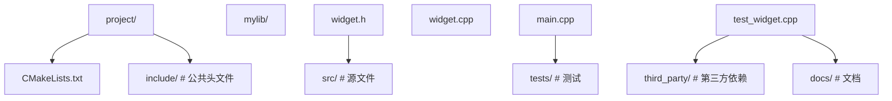

# C++ 项目实践

> **符号约定**：`< >` 必填参数 | `[ ]` 可选参数

---

## 项目结构

**基本写法：典型项目布局**
`<目录>/ <文件>`


---

**基本写法：CMakeLists.txt 模板**
`cmake_minimum_required(...) project(...)`
```cmake
cmake_minimum_required(VERSION 3.15)
project(MyApp VERSION 1.0.0 LANGUAGES CXX)

set(CMAKE_CXX_STANDARD 20)
set(CMAKE_CXX_STANDARD_REQUIRED ON)
set(CMAKE_CXX_EXTENSIONS OFF)

option(BUILD_TESTING "Build tests" ON)

add_executable(app src/main.cpp src/widget.cpp)
target_include_directories(app PRIVATE include)

if(BUILD_TESTING)
    enable_testing()
    add_subdirectory(tests)
endif()
```

---

## 头文件设计

**基本写法：头文件模板**
`#pragma once` + 前置声明
```cpp
#pragma once
#include <memory>
#include <string>

// 前置声明减少依赖
namespace mylib {
class Impl;
class Widget {
public:
    Widget();
    ~Widget();  // 因 pimpl 需自定义
    void doWork(const std::string& input);
private:
    std::unique_ptr<Impl> pimpl_;
};
} // namespace mylib
```

---

**基本写法：源文件实现**
`#include "<对应头文件>"`
```cpp
#include "mylib/widget.h"
#include <iostream>

namespace mylib {

struct Widget::Impl {
    std::string data;
};

Widget::Widget() : pimpl_(std::make_unique<Impl>()) {}
Widget::~Widget() = default;

void Widget::doWork(const std::string& input) {
    pimpl_->data = input;
    std::cout << pimpl_->data;
}

} // namespace mylib
```

---

## 依赖管理

**基本写法：vcpkg 集成**
`vcpkg.json`
```json
{
  "name": "myapp",
  "version": "1.0.0",
  "dependencies": [
    "fmt",
    "spdlog",
    "gtest"
  ]
}
```

---

**基本写法：FetchContent 下载**
`FetchContent_Declare(...)`
```cmake
include(FetchContent)
FetchContent_Declare(
    fmt
    GIT_REPOSITORY https://github.com/fmtlib/fmt.git
    GIT_TAG 10.1.1
)
FetchContent_MakeAvailable(fmt)
target_link_libraries(app PRIVATE fmt::fmt)
```

---

## 测试集成

**基本写法：GoogleTest 集成**
`enable_testing() add_subdirectory(tests)`
```cmake
# tests/CMakeLists.txt
find_package(GTest REQUIRED)
add_executable(unit_tests test_widget.cpp)
target_link_libraries(unit_tests PRIVATE GTest::gtest_main app)
include(GoogleTest)
gtest_discover_tests(unit_tests)
```

---

**基本写法：测试用例**
`TEST(<套件>, <用例>)`
```cpp
#include <gtest/gtest.h>
#include "mylib/widget.h"
TEST(WidgetTest, DoWork) {
    mylib::Widget w;
    w.doWork("test");
    SUCCEED();
}
```

---

## CI/CD

**基本写法：GitHub Actions**
`.github/workflows/ci.yml`
```yaml
name: CI
on: [push, pull_request]
jobs:
  build:
    runs-on: ubuntu-latest
    steps:
      - uses: actions/checkout@v3
      - name: Install
        run: sudo apt-get install -y cmake g++
      - name: Build
        run: |
          cmake -S . -B build -DCMAKE_BUILD_TYPE=Release
          cmake --build build -j 4
      - name: Test
        run: ctest --test-dir build --output-on-failure
```

---

## 文档

**基本写法：Doxygen 配置**
`Doxyfile`
```text
PROJECT_NAME = "MyApp"
INPUT = include src
EXTRACT_ALL = YES
GENERATE_HTML = YES
OUTPUT_DIRECTORY = docs
```

---

## 发布管理

**基本写法：版本号**
`project(<名> VERSION <主>.<次>.<修订>)`
```cmake
project(MyApp VERSION 1.2.3)
# 使用版本
configure_file(
    config.h.in
    ${CMAKE_BINARY_DIR}/config.h
)
# config.h.in:
# #define APP_VERSION "@PROJECT_VERSION@"
```

---

**基本写法：安装规则**
`install(TARGETS ...)`
```cmake
install(TARGETS app DESTINATION bin)
install(DIRECTORY include/ DESTINATION include)
install(FILES config.h DESTINATION include)
# CMake 配置导出
install(EXPORT MyAppTargets DESTINATION lib/cmake/MyApp)
```

---

## 代码质量

**基本写法：clang-format 配置**
`.clang-format`
```yaml
BasedOnStyle: Google
IndentWidth: 4
ColumnLimit: 100
AllowShortFunctionsOnASingleLine: Empty
```

---

**基本写法：.clang-tidy 配置**
`.clang-tidy`
```yaml
Checks: >
  bugprone-*,
  modernize-*,
  performance-*,
  readability-*
WarningsAsErrors: ''
HeaderFilterRegex: '.*'
```
