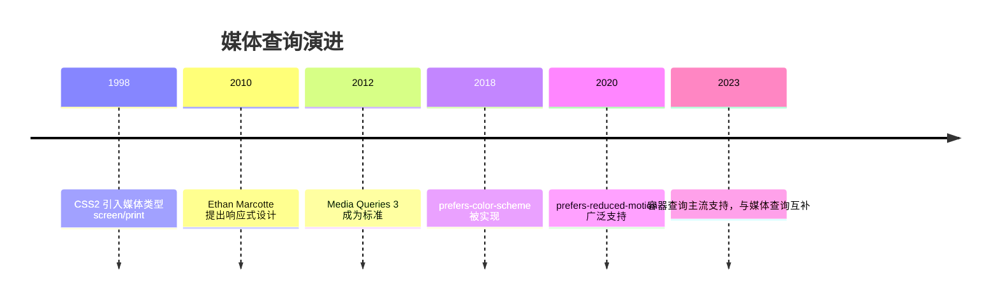
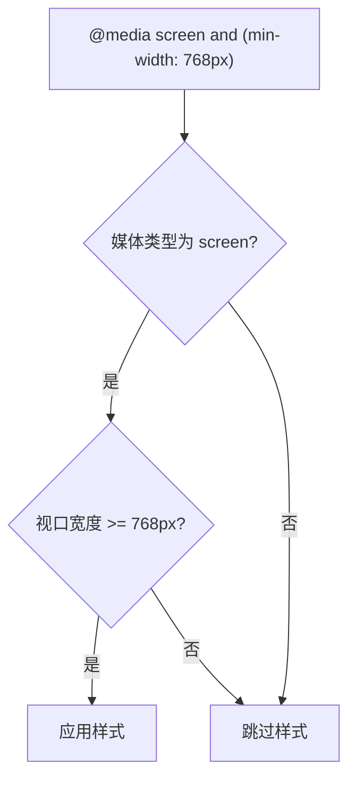

## 1. 学习目标（Bloom 分类）

记忆层面：能够说出 `@media` 规则的基本语法（媒体类型 + 媒体特性 + 逻辑操作符），能够复述 `min-width`、`max-width`、`orientation`、`prefers-color-scheme`、`prefers-reduced-motion` 等常用媒体特性。

理解层面：能够解释响应式设计的工作机制：媒体查询基于视口（viewport）或用户偏好等外部条件条件化应用样式；理解 `min-width` 与 `max-width` 的数学含义（前者是“大于等于”，后者是“小于等于”）。

应用层面：能够编写移动优先（mobile-first）断点体系、深色模式、减少动画偏好适配，能够组合 `and`、`not`、`,`（或）逻辑操作符，并处理 `@media` 与 CSS 变量的协作。

分析层面：能够分析断点选择策略（内容驱动 vs 设备驱动）、容器查询（`@container`）与媒体查询的适用边界，能够分析媒体查询与 `@import`、`<link media>` 的性能差异。

评价层面：能够评价“为每种设备写断点”的维护成本，形成基于内容的断点设计方法，并评估图片 `srcset`、`<picture>` 与媒体查询在响应式图片上的分工。

创造层面：能够设计完整的响应式布局系统（流式网格 + 断点 + 组件级容器查询），并支持深色模式、减少动画、高对比度等用户偏好。

## 2. 历史动机与发展脉络

2004 年前后，移动设备开始访问 Web，固定宽度布局在窄屏上需要横向滚动。2007 年 iPhone 发布后，响应式 Web 设计（Responsive Web Design）由 Ethan Marcotte 于 2010 年在 A List Apart 提出，其三大支柱是流式网格、弹性图片与媒体查询。

媒体查询本身起源于 CSS2 的媒体类型（`screen`、`print`、`aural`），Media Queries Level 3（2012 年成为 W3C Recommendation）引入媒体特性（width、orientation 等）与逻辑操作符；Media Queries Level 4（2017 年草案，2022 年前后稳定）新增 `prefers-color-scheme`、`prefers-reduced-motion`、`hover`、`pointer` 等用户偏好与交互能力特性。2023 年起容器查询（Container Queries，CSS Containment Level 3）获得主流浏览器支持，组件级响应式成为新方向，但媒体查询仍是页面级响应式的基石。



## 3. 形式化定义

`@media` 规则由媒体查询列表构成，语法：

```css
@media <media-query-list> {
  /* 条件成立时应用的样式 */
}
```

媒体查询列表用逗号分隔多个查询，任一查询为真则整体为真（或语义）。单个查询由可选媒体类型、媒体特性与逻辑操作符组成：

媒体类型：`all`（默认）、`screen`、`print`、`speech`。`not` 只能修饰整个查询（不能修饰单个特性）。

媒体特性以 `(特性: 值)` 或 `(特性)` 形式书写：`(min-width: 768px)`、`(orientation: portrait)`、`(hover: hover)`。无值特性如 `(color)` 表示支持该特性。

逻辑操作符：

`and`：连接媒体类型与特性，全部成立才为真；

`,`：查询列表分隔符，任一查询为真即为真；

`not`：对整个查询取反；

`only`：用于兼容不支持媒体查询的旧浏览器（现代已不必要，仍可保留）。

范围语法（Media Queries Level 4）：`(400px <= width <= 800px)`、`(width >= 768px)` 是新的区间写法，可读性优于 `min/max`，现代浏览器均支持。



## 4. 理论推导与原理解析

### 4.1 min-width 与 max-width 的不等式

`min-width: 768px` 等价于 `width >= 768px`；`max-width: 767px` 等价于 `width <= 767px`。两者在 767/768 边界互补。移动优先策略使用 `min-width` 从窄到宽逐步增强；桌面优先策略使用 `max-width` 从宽到窄逐步降级。

### 4.2 视口与布局视口

媒体查询中的 `width` 指布局视口宽度（layout viewport），由 `<meta name="viewport" content="width=device-width, initial-scale=1">` 控制。缺失该 meta 时，移动浏览器使用默认视口宽度（如 980px），媒体查询将按 980px 判断，导致移动优先样式失效。因此响应式页面的第一步是正确设置 viewport meta。

### 4.3 媒体查询的层叠行为

媒体查询不改变 CSS 层叠优先级，只控制规则是否参与层叠。因此两条规则同时命中时，后定义者胜出。移动优先写法中，基础样式在前，`min-width` 增强在后，天然符合层叠顺序。

### 4.4 与容器查询的分工

媒体查询参照视口，解决“页面级”响应；容器查询参照最近的容器尺寸，解决“组件级”响应。一个卡片组件在窄侧栏与宽主区中应自适应容器，而不是依赖视口断点。容器查询需要父元素声明 `container-type: inline-size`，且不能替代媒体查询（页面级排版仍需视口信息）。

## 5. 代码示例（带详尽注释）

### 5.1 移动优先断点体系

```css
/* 基础样式：默认面向窄屏（移动优先） */
.grid {
  display: grid;
  grid-template-columns: 1fr; /* 单列 */
  gap: 16px;
}

/* 视口 >= 640px：两列 */
@media (min-width: 640px) {
  .grid {
    grid-template-columns: repeat(2, 1fr);
  }
}

/* 视口 >= 1024px：三列 */
@media (min-width: 1024px) {
  .grid {
    grid-template-columns: repeat(3, 1fr);
  }
}
```

讲解：断点 640/1024 是内容驱动的常用选择。移动优先的要点：基础样式无需媒体查询，增强逐级叠加，因此窄屏设备只加载最简样式。

### 5.2 深色模式

```css
:root {
  --bg: #ffffff;
  --text: #1f1f1f;
}

/* 用户系统偏好深色时切换变量 */
@media (prefers-color-scheme: dark) {
  :root {
    --bg: #1f1f1f;
    --text: #f0f0f0;
  }
}

body {
  background: var(--bg);
  color: var(--text);
}
```

讲解：`prefers-color-scheme` 读取操作系统或浏览器的深色偏好。通过 CSS 变量切换主题，一套选择器适配两种模式，避免重复编写整套样式。

### 5.3 减少动画偏好

```css
/* 默认动画 */
.banner {
  animation: slide-in 0.6s ease;
}

/* 用户开启“减少动态效果”时关闭动画 */
@media (prefers-reduced-motion: reduce) {
  .banner {
    animation: none;
    transition: none;
  }
}
```

讲解：`prefers-reduced-motion` 服务于前庭障碍与晕动症用户，是 WCAG 2.1 可访问性最佳实践。关闭动画的同时应保证内容立即可见（不要用 `opacity: 0` 残留）。

### 5.4 打印样式

```css
/* 打印时隐藏导航与广告，展开正文 */
@media print {
  .navbar,
  .sidebar,
  .ad {
    display: none !important;
  }
  main {
    width: 100%;
  }
}
```

讲解：`print` 媒体类型为打印优化：隐藏非内容区域、设置黑白配色、避免分页截断。可用 `page-break-inside: avoid` 控制元素不跨页。

### 5.5 方向与指针能力

```css
/* 横屏：两栏布局 */
@media (orientation: landscape) {
  .profile {
    grid-template-columns: 200px 1fr;
  }
}

/* 主输入设备支持悬停：显示桌面悬停效果 */
@media (hover: hover) and (pointer: fine) {
  .item:hover {
    transform: translateY(-2px);
  }
}
```

讲解：`orientation` 适配平板横竖屏；`hover`/`pointer` 区分触屏与鼠标设备，避免触屏设备出现无法取消的悬停态。

### 5.6 范围语法

```css
/* 新语法：只命中 768-1024 区间 */
@media (768px <= width <= 1024px) {
  .container {
    padding: 24px;
  }
}
```

讲解：范围语法表达区间更直观，且避免 767/768 边界笔误。2023 年起所有主流浏览器支持，可放心用于现代项目。

### 5.7 JavaScript 中的媒体查询

```js
// 用 matchMedia 在 JS 中响应视口变化
const mq = window.matchMedia('(min-width: 1024px)')

function handleChange(e) {
  // e.matches 表示当前是否命中
  console.log('桌面布局:', e.matches)
}

mq.addEventListener('change', handleChange)
handleChange(mq) // 初始化执行一次
```

讲解：`matchMedia` 返回 MediaQueryList，`change` 事件在命中状态变化时触发。注意使用 `addEventListener` 而非已废弃的 `addListener`，并清理监听避免泄漏。

### 5.8 响应式图片

```html
<!-- 根据视口宽度选择图片资源 -->

```

讲解：`srcset` 按资源宽度声明候选，`sizes` 告诉浏览器图片在布局中的实际宽度，浏览器综合视口、DPR 与带宽自动选择。这是媒体查询之外的响应式图片标准方案。

## 6. 对比分析

### 6.1 媒体查询与容器查询

| 维度 | 媒体查询 | 容器查询 |
| --- | --- | --- |
| 参照对象 | 视口 | 最近容器 |
| 粒度 | 页面级 | 组件级 |
| 前置条件 | 无 | 父元素 container-type |
| 适用 | 整体布局 | 复用组件 |

### 6.2 min-width 与 max-width 策略

移动优先（min-width）代码路径短、性能好、渐进增强；桌面优先（max-width）适合改造存量桌面站点。新项目推荐移动优先。

### 6.3 @media 与 @import media

`<link media="...">` 与 `@import url(...) media` 也能条件加载样式表，但会额外产生请求；`@media` 内联规则没有请求开销。性能敏感场景优先内联媒体查询。

## 7. 常见陷阱与最佳实践

陷阱一：缺少 viewport meta，移动端媒体查询失效。

陷阱二：断点基于固定设备（iPhone 宽度），设备碎片化导致维护失控。最佳实践：基于内容换行点选择断点。

陷阱三：`max-width: 767px` 与 `min-width: 768px` 间隙或重叠。使用范围语法或统一取整策略。

陷阱四：媒体查询嵌套在组件 scoped 样式中时，Vue/React 的 scoped 机制不影响媒体查询（媒体查询作用于全局视口），可放心使用。

陷阱五：深色模式只改背景不改图片/阴影，出现刺眼白色卡片。最佳实践：用 CSS 变量覆盖全部颜色令牌。

陷阱六：`prefers-reduced-motion: reduce` 下仍保留 `scroll-behavior: smooth`。应同时关闭平滑滚动。

陷阱七：媒体查询中写 `not (min-width: 768px)` 的非法组合。`not` 修饰整个查询，等价写法为 `@media not all and (min-width: 768px)`。

## 8. 工程实践

### 8.1 断点设计令牌

```css
:root {
  --bp-sm: 640px;
  --bp-md: 768px;
  --bp-lg: 1024px;
  --bp-xl: 1280px;
}
```

讲解：断点值收敛为令牌，配合注释说明每个断点的内容动机（如“列表换两列”“导航收起为汉堡”），避免随意新增断点。

### 8.2 组合查询的组件化

```css
/* 桌面端且在浅色模式下：给卡片添加悬停投影 */
@media (min-width: 1024px) and (prefers-color-scheme: light) {
  .card:hover {
    box-shadow: 0 8px 24px rgba(0, 0, 0, 0.1);
  }
}
```

讲解：`and` 组合多个维度条件。组合越多越脆弱，建议每个查询只解决一个维度的适配。

## 9. 案例研究：文档站点完整响应式方案

需求：文档站桌面三栏（目录/正文/相关）、平板两栏、手机单栏，支持深色模式与减少动画。

```css
/* 移动优先基础：单栏 */
.layout {
  display: grid;
  grid-template-columns: 1fr;
  gap: 16px;
  padding: 16px;
}

/* 平板：正文 + 目录 */
@media (min-width: 768px) {
  .layout {
    grid-template-columns: 240px 1fr;
  }
}

/* 桌面：三栏 */
@media (min-width: 1280px) {
  .layout {
    grid-template-columns: 240px 1fr 220px;
  }
}

/* 深色模式变量覆盖 */
@media (prefers-color-scheme: dark) {
  :root {
    --bg: #16181d;
    --text: #e6e6e6;
    --border: #2d3138;
  }
}

/* 减少动画 */
@media (prefers-reduced-motion: reduce) {
  * {
    animation-duration: 0.01ms !important;
    transition-duration: 0.01ms !important;
  }
}
```

讲解：方案分层清晰：布局断点解决结构，色彩变量解决主题，动画偏好解决无障碍。每层独立演进，互不干扰。`animation-duration: 0.01ms` 的技巧让动画“瞬间完成”而非硬性禁用，避免依赖动画完成的逻辑挂起。

## 10. 知识要点总结与深入讲解

媒体查询的条件本质是“视口/环境特性谓词”，命中则参与层叠。移动优先的核心是把默认样式写成窄屏最优，再用 `min-width` 逐级增强。

用户偏好类媒体查询（深色、减少动画、对比度）是 CSS 与现代操作系统的桥梁，它们不是设备特性而是用户意图，理应获得更高优先级的设计关注。

容器查询与媒体查询的分工可以总结为：页面排版问视口，组件排版问容器。两者配合才能覆盖现代响应式设计的全部场景。

## 11. 参考文献

W3C, Media Queries Level 3, 访问日期 2026-08-01, https://www.w3.org/TR/mediaqueries-3/

W3C, Media Queries Level 4, 访问日期 2026-08-01, https://www.w3.org/TR/mediaqueries-4/

MDN Web Docs, Using media queries, 访问日期 2026-08-01, https://developer.mozilla.org/en-US/docs/Web/CSS/CSS_media_queries/Using_media_queries

MDN Web Docs, prefers-color-scheme, 访问日期 2026-08-01, https://developer.mozilla.org/en-US/docs/Web/CSS/@media/prefers-color-scheme

MDN Web Docs, CSS Container Queries, 访问日期 2026-08-01, https://developer.mozilla.org/en-US/docs/Web/CSS/CSS_containment/Container_queries

MDN Web Docs, Responsive images, 访问日期 2026-08-01, https://developer.mozilla.org/en-US/docs/Learn_web_development/Core/Media_queries/Responsive_images

## 12. 延伸阅读

响应式布局常与 Grid/Flex 配合，见 007-css 模块的布局文档；

深色模式与 CSS 变量体系，见本模块变量相关文档；

移动端适配的完整方案，见本模块 021-MobileAdaptation 文档；

JS 中 matchMedia 的更多用法，见 008-javascript 模块相关文档；

尚硅谷 Bilibili 空间（https://space.bilibili.com/302417610 ）提供 CSS 响应式与移动端课程；黑马程序员 Bilibili 空间（https://space.bilibili.com/37974444 ）提供前端实战课程。

{{APPENDIX}}
