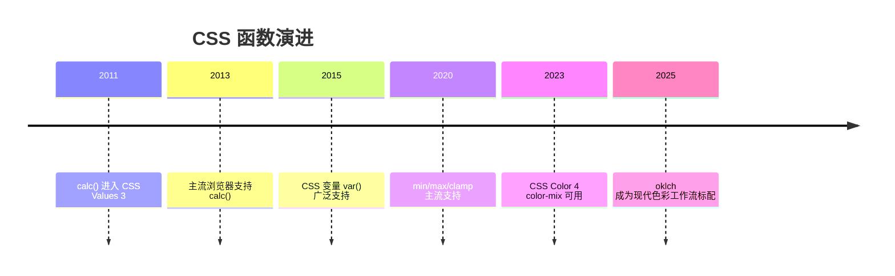
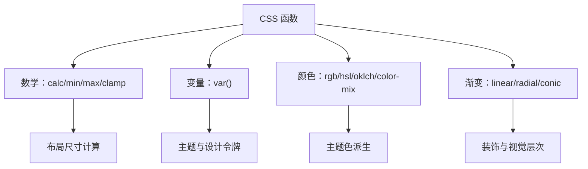

## 1. 学习目标（Bloom 分类）

记忆层面：能够说出 CSS 数学函数家族：`calc()`、`min()`、`max()`、`clamp()`，以及常用颜色函数（`rgb()`/`rgba()`、`hsl()`/`hsla()`、`color-mix()`）、渐变函数（`linear-gradient()`、`radial-gradient()`、`conic-gradient()`）、变量函数 `var()` 的语法。

理解层面：能够解释 CSS 函数在解析期的求值时机：数学函数在“计算值”阶段求值，支持混合单位（`calc(100% - 40px)`），理解 `var()` 的替换发生在自定义属性解析阶段以及由此产生的回退规则。

应用层面：能够用 `clamp()` 实现流体排版，用 `min()`/`max()` 实现自适应尺寸边界，用 `calc()` 处理百分比与固定值的差值，用 `color-mix()` 生成派生颜色。

分析层面：能够分析 CSS 函数与预处理器（Sass 函数）在求值时机上的差异（浏览器原生 vs 构建时），能够分析 `min()`/`max()`/`clamp()` 与媒体查询在响应式上的替代关系。

评价层面：能够评价哪些场景适合原生 CSS 函数、哪些仍需媒体查询或容器查询，能够判断 `var()` 回退值与 `@supports` 的组合策略。

创造层面：能够构建基于 CSS 变量的完整主题系统（颜色、间距、排版），并用原生函数实现无 JS 的响应式效果。

## 2. 历史动机与发展脉络

CSS 早期没有计算能力，布局中“容器宽度减去固定侧栏”只能依赖百分比近似或 JS 计算。CSS Values and Units Level 3 于 2011 年前后开始定义 `calc()`，2013 年后主流浏览器陆续支持。`min()`/`max()`/`clamp()` 属于 CSS Values and Units Level 4，2020 年前后获得主流支持，补齐了“取极值”与“钳制”能力。

颜色函数的发展同样显著：`rgba()`/`hsla()` 在 CSS3 Color 中标准化（2011）；CSS Color 4（2023 年成为候选推荐）引入 `color-mix()`、`oklch()`、`lab()` 等现代色彩空间函数，使颜色混合与感知均匀性成为可能。渐变函数从 CSS3 的 `linear-gradient` 演进到支持角度、位置、重复渐变与锥形渐变。

CSS 变量（自定义属性）在 CSS Custom Properties for Cascading Variables Level 1（2012 年草案，2015 年后广泛支持）中定义，`var()` 成为主题系统的基石，并与数学函数形成组合：`calc(var(--gap) * 2)`。



## 3. 形式化定义

### 3.1 数学函数

`calc(表达式)`：对长度、百分比、角度、时间等数值类型执行加减乘除。语法约束：`+` 与 `-` 两侧必须有空格（避免与正负号歧义），`*` 与 `/` 不需要空格但两侧操作数类型受限（乘法至少一侧为数字，除法右侧必须为数字且不能为零）。

`min(值1, 值2, ...)`：返回参数中的最小值，参数可以混合单位，但最终结果类型必须一致。

`max(值1, 值2, ...)`：返回最大值。

`clamp(最小值, 首选值, 最大值)`：等价于 `max(最小值, min(首选值, 最大值))`。首选值被钳制在区间内。

### 3.2 变量函数

`var(--name, 回退值)`：读取自定义属性 `--name` 的值；若未定义或无效，使用回退值。回退值本身可以使用其他函数（如 `var(--x, calc(...))`）。

自定义属性的特性：值在声明处不校验类型，只有在被使用处的属性上下文中才校验；继承性使变量可以从 `:root` 传播到所有元素；`@property` 可以注册带类型与初始值的自定义属性，支持动画。

### 3.3 颜色函数

`rgb(r g b / a)` 与 `rgba(r g b / a)`：红绿蓝三通道加透明度；现代语法允许空格分隔与斜杠透明度，也支持逗号旧语法。

`hsl(h s l / a)`：色相（角度或数字）、饱和度、亮度；`oklch(l c h / a)` 是感知均匀的色彩空间。

`color-mix(in srgb, 颜色1 40%, 颜色2)`：按比例混合两种颜色，`in` 指定混合色彩空间。

### 3.4 渐变函数

`linear-gradient(方向, 色标...)`、`radial-gradient(形状 尺寸 at 位置, 色标...)`、`conic-gradient(from 角度 at 位置, 色标...)`；`repeating-` 前缀生成重复渐变。



## 4. 理论推导与原理解析

### 4.1 计算值求值时机

CSS 属性值经历指定值、计算值、使用值、实际值四个阶段。数学函数在“计算值”阶段完成求值，此时单位类型已经统一（长度转换为像素或视口单位），因此 `calc(100% - 40px)` 最终得到确定长度。理解求值时机可以解释：`min()`/`max()` 中混合百分比与固定值不会产生无限递归，因为百分比在布局阶段解析。

### 4.2 var() 的替换规则

`var()` 在自定义属性解析阶段替换，替换后整个声明重新参与计算。若替换结果对当前属性无效，该声明变为“无效 at 计算值时间”（invalid at computed-value time），此时使用属性的初始值或继承值，而不是回退值——这是 var() 与普通属性最大的行为差异。因此回退值只在变量本身未定义时生效。

### 4.3 clamp 的流体推导

流体排版的数学表达：字号 = clamp(最小字号, 视口相关值, 最大字号)。视口相关值常用 `vw` 单位，例如 `clamp(1rem, 1rem + 1vw, 1.5rem)`。推导：视口宽度为 0 时取 1rem，视口为 100vw 时约 2rem，但被钳制在 1.5rem。该公式让字号在区间内线性变化，避免媒体查询逐断点跳变。

### 4.4 color-mix 的混合模型

`color-mix(in srgb, red 40%, blue)` 在指定色彩空间插值。比例表示第一种颜色的权重，未指定权重时按 50/50 混合。混合空间的感知均匀性影响结果：`oklab` 混合比 `srgb` 混合更接近人眼感知的中途色。

## 5. 代码示例（带详尽注释）

### 5.1 calc() 基础

```css
/* 侧栏固定 240px，主区域占满剩余空间 */
.main {
  width: calc(100% - 240px);
  margin-left: 240px;
}

/* 运算符两侧必须有空格 */
.header {
  padding: calc(1rem + 2px) calc(2rem - 4px);
}
```

讲解：`calc(100% - 240px)` 是经典布局公式。注意 `+`/`-` 两侧空格是语法要求，缺少空格整个声明无效。

### 5.2 min() 与 max()

```css
/* 内容宽度最大 1200px，小屏时占满可用空间（减去两侧内边距） */
.container {
  width: min(1200px, 100% - 32px);
  margin-inline: auto;
}

/* 按钮最小宽度 160px，但不超过容器 100% */
.button {
  width: max(160px, 100%);
}
```

讲解：`min()` 表达“上界”，`max()` 表达“下界”。`width: min(1200px, 100% - 32px)` 取代了 `max-width + width` 的旧写法，语义更直接。

### 5.3 clamp() 流体排版

```css
/* 标题字号：最小 1.5rem，视口相关增长，最大 3rem */
.hero-title {
  font-size: clamp(1.5rem, 1rem + 2.5vw, 3rem);
}

/* 间距也流体化 */
.section {
  padding-block: clamp(2rem, 1rem + 4vw, 6rem);
}
```

讲解：`clamp()` 让字号随视口连续变化，兼顾小屏可读性与大屏视觉冲击。`vw` 系数决定增长斜率，可通过设计稿两端值反推。

### 5.4 var() 与主题系统

```css
:root {
  --color-primary: #1677ff;
  --space-md: 16px;
  --radius: 8px;
}

.card {
  /* 变量参与计算 */
  padding: var(--space-md);
  border: 1px solid color-mix(in srgb, var(--color-primary) 30%, transparent);
  border-radius: var(--radius);
}

/* 深色主题只需覆盖变量 */
@media (prefers-color-scheme: dark) {
  :root {
    --color-primary: #4096ff;
  }
}
```

讲解：`var()` 与 `color-mix()` 组合：边框颜色自动从主题色派生。主题切换只改变量定义，组件样式零改动。

### 5.5 color-mix() 派生色

```css
.button {
  background: var(--color-primary);
}

/* 悬停色：主色与黑色混合 10% */
.button:hover {
  background: color-mix(in srgb, var(--color-primary) 90%, black);
}

/* 禁用态：主色 40% 透明 */
.button:disabled {
  background: color-mix(in srgb, var(--color-primary) 40%, transparent);
}
```

讲解：`color-mix` 取代了手写调色板。主色改变时，悬停、禁用、边框等派生色自动跟随，是设计系统维护的利器。

### 5.6 渐变函数

```css
/* 线性渐变：135 度方向，三段色标 */
.hero {
  background: linear-gradient(135deg, #1677ff 0%, #69b1ff 50%, #d3e7ff 100%);
}

/* 径向渐变：从左上角扩散 */
.sun {
  background: radial-gradient(circle at 30% 30%, #fff7d6, #ffc53d);
}

/* 锥形渐变：从 0 度开始，用于环形图 */
.pie {
  background: conic-gradient(from 0deg, #1677ff 0% 40%, #52c41a 40% 70%, #faad14 70% 100%);
}
```

讲解：三种渐变覆盖主流场景：线性用于横幅与按钮，径向用于光晕，锥形用于环形图。渐变函数之间可以叠加（多层 background），创造丰富层次。

### 5.7 渐变与 mask 组合

```css
/* 淡出遮罩：内容底部渐隐 */
.fade-bottom {
  -webkit-mask-image: linear-gradient(to bottom, black 60%, transparent);
  mask-image: linear-gradient(to bottom, black 60%, transparent);
}
```

讲解：`mask-image` 用亮度控制透明度，黑色区域显示、透明区域隐藏。该技巧常用于长文本折叠预览。

### 5.8 @supports 回退

```css
/* 支持 clamp 的浏览器使用流体字号 */
.title {
  font-size: 1.5rem;
}

@supports (font-size: clamp(1rem, 2vw, 3rem)) {
  .title {
    font-size: clamp(1.5rem, 1rem + 2vw, 3rem);
  }
}
```

讲解：`@supports` 做特性检测，旧浏览器获得回退值。现代项目只需对极少数新函数（如 `color-mix` 早期版本）做此类保护。

## 6. 对比分析

### 6.1 原生函数与 Sass 函数

| 维度 | 原生 CSS 函数 | Sass 函数 |
| --- | --- | --- |
| 求值时机 | 浏览器运行时 | 构建时 |
| 动态性 | 随视口/变量变化 | 静态结果 |
| 变量 | var() 运行时替换 | 编译期替换 |
| 依赖 | 无 | 构建工具链 |

### 6.2 min/max/clamp 与媒体查询

`clamp()` 的流体方案在断点之间连续过渡，媒体查询是分段跳变。两者可结合：流体负责区间内，媒体查询负责结构性布局变化（单列到多列）。

### 6.3 calc 与容器查询

`calc()` 解决尺寸计算，容器查询解决组件级响应。例如卡片内部间距用 `calc()`，卡片网格列数用容器查询，各司其职。

## 7. 常见陷阱与最佳实践

陷阱一：`calc()` 的 `+`/`-` 忘记空格。声明静默无效。

陷阱二：`var()` 回退值只在变量未定义时生效；变量存在但值无效时回退值不会兜底。

陷阱三：在 `min()`/`max()` 中混入无单位数字与长度。`min(1, 100px)` 类型不匹配，整个声明无效。

陷阱四：`clamp()` 中最小值大于最大值。结果是不可预测的，浏览器按规范处理仍可能异常。

陷阱五：`color-mix` 早期浏览器前缀与语法差异。现代浏览器无前缀支持，使用前可用 `@supports` 检测。

陷阱六：渐变中色标位置不递增导致硬边。按顺序递增色标位置，或用 `hsl` 表达连续色相变化。

最佳实践：数学函数优先于魔法数字；主题色统一走 `var()` + `color-mix()`；流体排版用 `clamp()` 并保留回退；渐变用于装饰而非关键信息。

## 8. 工程实践

### 8.1 间距与排版令牌

```css
:root {
  --space-1: 4px;
  --space-2: 8px;
  --space-3: 16px;
  --space-4: 24px;
  --space-5: 32px;
  --text-base: clamp(1rem, 0.95rem + 0.2vw, 1.125rem);
}
```

讲解：间距按 4px 基准递增，排版用 clamp 流体化。令牌化让设计与代码共享同一套词汇。

### 8.2 布局网格中的函数

```css
/* auto-fill 自动列数 + min() 控制列宽下界 */
.grid {
  display: grid;
  grid-template-columns: repeat(auto-fill, minmax(min(240px, 100%), 1fr));
  gap: clamp(12px, 2vw, 24px);
}
```

讲解：`minmax(min(240px, 100%), 1fr)` 防止窄容器中 `240px` 溢出，`auto-fill` 自动计算列数。这是 CSS 网格与函数组合的经典响应式配方。

## 9. 案例研究：无 JS 的主题化卡片系统

需求：一套卡片组件，支持浅深色主题、派生悬停色、流体间距与圆角，全部由 CSS 函数与变量实现。

```css
:root {
  /* 主题令牌 */
  --color-primary: #1677ff;
  --color-surface: #ffffff;
  --color-text: #1f1f1f;
  --radius-card: 12px;
  --space-card: clamp(12px, 2vw, 24px);
}

/* 深色主题仅覆盖表面色与文字色 */
@media (prefers-color-scheme: dark) {
  :root {
    --color-surface: #1f1f1f;
    --color-text: #e8e8e8;
  }
}

.card {
  background: var(--color-surface);
  color: var(--color-text);
  border: 1px solid color-mix(in srgb, var(--color-text) 15%, transparent);
  border-radius: var(--radius-card);
  padding: var(--space-card);
  transition: transform 0.2s ease;
}

.card:hover {
  transform: translateY(-2px);
  border-color: color-mix(in srgb, var(--color-primary) 40%, transparent);
}

/* 标题字号流体 */
.card h3 {
  font-size: clamp(1.1rem, 1rem + 0.5vw, 1.4rem);
}
```

讲解：整个系统不依赖任何 JS：主题切换由媒体查询驱动，派生色由 `color-mix` 计算，间距与字号由 `clamp` 流体化。新增组件只需引用令牌，天然获得主题一致性。

## 10. 知识要点总结与深入讲解

CSS 函数让样式表具备计算能力：`calc()` 做差值，`min/max` 做边界，`clamp` 做区间钳制。三者都以“计算值”阶段的类型安全为前提，因此混合单位是它们的核心价值。

`var()` 是主题系统的支柱，其行为特殊性（无效值不回退）要求开发者理解“变量存在但值无效”与“变量未定义”的区别。`@property` 进一步把变量升级为带类型的注册属性，支持动画与校验。

颜色函数的演进方向是感知均匀与可计算：`oklch` 让色相旋转更自然，`color-mix` 让派生色自动化。设计系统的维护成本因此大幅下降。

## 11. 参考文献

W3C, CSS Values and Units Module Level 4（calc/min/max/clamp）, 访问日期 2026-08-01, https://www.w3.org/TR/css-values-4/

W3C, CSS Color Module Level 4（color-mix、oklch）, 访问日期 2026-08-01, https://www.w3.org/TR/css-color-4/

W3C, CSS Custom Properties for Cascading Variables Level 1, 访问日期 2026-08-01, https://www.w3.org/TR/css-variables-1/

MDN Web Docs, CSS 函数索引, 访问日期 2026-08-01, https://developer.mozilla.org/en-US/docs/Web/CSS/CSS_Functions

MDN Web Docs, Using CSS custom properties, 访问日期 2026-08-01, https://developer.mozilla.org/en-US/docs/Web/CSS/CSS_cascading_variables/Using_CSS_custom_properties

## 12. 延伸阅读

深色模式与媒体查询的配合，见本模块 019-MediaQuery 文档；

圆角与阴影等外观属性，见本模块 018-BorderRadius 文档；

网格布局中的函数用法，见 007-css 模块的 Grid 相关文档；

Sass 预处理器函数对比，见 007-css 模块的预处理器文档；

尚硅谷 Bilibili 空间（https://space.bilibili.com/302417610 ）提供 CSS 进阶与工程化课程；黑马程序员 Bilibili 空间（https://space.bilibili.com/37974444 ）提供前端实战课程。

{{APPENDIX}}
