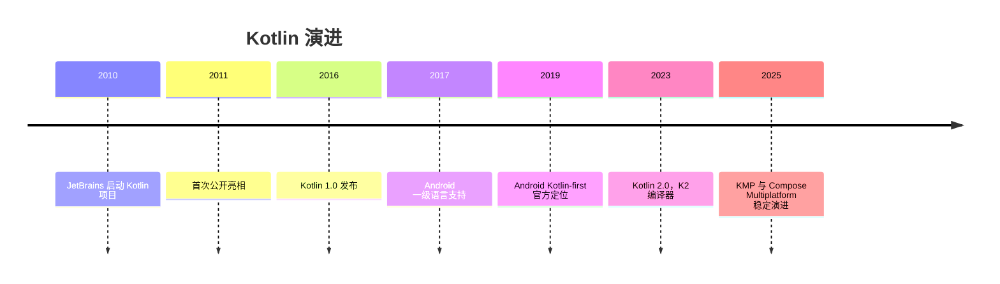
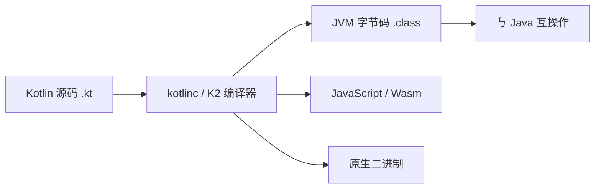

## 1. 学习目标（Bloom 分类）

记忆层面：能够说出 Kotlin 的核心语法要素：`val`/`var` 声明、基本类型体系（`Int`、`Long`、`Double`、`Boolean`、`Char`、`String`）、字符串模板（`$var` 与 `${expr}`）、包与导入、`if`/`when`/`for`/`while` 控制流、区间（`..`、`until`、`downTo`、`step`）、类型检查（`is`）与转换（`as`）。

理解层面：能够解释 Kotlin 的“空安全”设计（`?`、`!!`、`?:`、`?.`）如何把空指针异常从运行时提前到编译期；解释 `val` 的只读引用与不可变对象的区别；解释 `when` 作为表达式与语句的差异。

应用层面：能够在函数、类、集合处理中熟练运用基础语法，编写无 `NullPointerException` 风险的代码，并正确使用字符串模板避免拼接错误。

分析层面：能够分析 Kotlin 与 Java 在类型系统（可空类型、无原始类型）、控制流表达式化、字符串模板、区间语法上的设计差异，理解 Kotlin 的“务实的现代语言”定位。

评价层面：能够评价不同声明风格（`val` vs `var`、显式类型 vs 类型推断）对可读性与可维护性的影响，形成团队风格指南。

创造层面：能够用 Kotlin 的基础语法组合出领域小工具（数据处理、CLI 脚本、Android 组件），并遵循惯用法（idiomatic Kotlin）。

## 2. 历史动机与发展脉络

Kotlin 由 JetBrains 于 2010 年开始研发，2011 年公开，2016 年 2 月发布 1.0。设计动机是解决 Java 的长期痛点：冗长（样板代码）、空指针风险、类型推断不足、函数式支持薄弱。Kotlin 与 Java 100% 互操作，编译器（kotlinc）输出 JVM 字节码，因此可以在既有 Java 项目中渐进采用。

2017 年 Google 宣布 Kotlin 成为 Android 一级开发语言；2019 年 Android 官方推荐 Kotlin-first；2023 年 Kotlin 2.0 发布，引入 K2 编译器（基于 FIR 前端），编译速度与内存占用显著改善。Kotlin Multiplatform（KMP）支持 JVM、Android、iOS、WebAssembly 与原生目标，JetBrains 与 Google 在 Compose Multiplatform 上持续推进跨平台 UI 方案。

Kotlin 版本节奏：1.x 时代每半年左右发布小版本；2.0 起保持每年大版本演进（2.1、2.2 等），K2 编译器默认启用，`kotlinx` 生态（coroutines、serialization、datetime）同步发展。



## 3. 形式化定义

### 3.1 变量声明

`val 名称: 类型 = 值`：只读引用，初始化后不可重新赋值（但引用的对象内部状态可变）；

`var 名称: 类型 = 值`：可变引用，可重新赋值；

类型推断：`val count = 42` 推断为 `Int`；`val name = "Kotlin"` 推断为 `String`。

顶层声明：Kotlin 允许在文件顶层声明变量与函数，无需类包装。

### 3.2 基本类型

数值：`Byte`、`Short`、`Int`、`Long`（后缀 L）、`Float`（后缀 F）、`Double`；

布尔：`Boolean`（`true`/`false`）；

字符：`Char`（单引号）；

字符串：`String`（双引号），不可变；

无符号类型（实验性到稳定）：`UInt`、`ULong` 等；

Kotlin 类型都是对象，但数值类型在 JVM 上尽量装箱/拆箱优化（`Int` 映射 `int` 或 `Integer`）。

### 3.3 字符串模板

`"$variable"` 直接插入变量；`"${expression}"` 插入表达式；`$` 本身用 `\$` 转义。模板在编译期展开为字符串拼接或 `StringBuilder`，支持任意表达式（包括函数调用与属性访问）。

### 3.4 控制流

`if`：可作表达式，返回分支值；

`when`：替代 Java 的 switch，支持任意条件（常量、类型检查、区间、表达式、无参数分支），也可作表达式；

`for`：迭代任何提供迭代器的对象，常用 `for (x in 0..10)`；

`while`/`do-while`：与 Java 语义一致；

`break`/`continue` 与标签（label）配合支持跳出嵌套循环。

### 3.5 区间

`a..b`：闭区间（包含 b）；

`a until b`：半开区间（不含 b）；

`a downTo b`：递减区间；

`step n`：步长；

区间支持 `in` 运算符检查成员关系。

### 3.6 类型检查与转换

`is`：类型检查，智能转换（smart cast）在不可变上下文中自动生效；

`as`：强制转换；`as?`：安全转换，失败返回 null；

可空类型：`Type?`；安全调用 `?.`；Elvis `?:`；非空断言 `!!`。



## 4. 理论推导与原理解析

### 4.1 空安全类型系统

Kotlin 把可空性编码进类型系统：`String` 与 `String?` 是不同静态类型。编译器在调用链上强制处理空值：`?.` 短路返回 null，`?:` 提供默认值，`!!` 显式声明“我确定非空”（失败抛 `NullPointerException`）。推导：若函数参数类型为 `String`，任何调用点都不可能传入 null（编译期拒绝），从而消灭了一整类运行时异常。

智能转换的成立条件：目标变量在检查点后未被修改且不是开放属性（open member），编译器才允许自动转换类型。`var` 在并发场景可能被修改，因此智能转换受限。

### 4.2 val 与不可变性

`val` 约束的是“引用”，不是“对象”。`val list = mutableListOf<Int>()` 后可以 `list.add(1)`，因为对象本身可变。Kotlin 标准库刻意区分可变与只读集合接口（`MutableList` vs `List`），用类型系统表达可变性边界。

### 4.3 when 的表达式语义

`when` 作表达式时必须覆盖所有分支（或存在 else），因为表达式的类型是各分支的公共超类型。这保证穷尽性（exhaustiveness），避免 Java switch 遗漏分支的静默行为。

### 4.4 字符串模板的编译展开

字符串模板编译为 `StringBuilder.append` 链或 `String.format` 的等价物，多段拼接的性能优于手工 `+` 链（减少中间字符串对象）。`${}` 内的表达式在求值时若含可空值，字符串结果为 `"null"` 文本（与 Java 拼接一致）。

## 5. 代码示例（带详尽注释）

### 5.1 val 与 var

```kotlin
// 只读引用：初始化后不可重新赋值
val appName: String = "FANDEX"

// 可变引用：可以重新赋值
var retryCount: Int = 0
retryCount += 1

// 类型推断：编译器根据初始值推断类型
val version = "1.4.2"
val maxRetries = 3

// 顶层声明：无需类包装，可直接访问
val TOP_LEVEL_CONST = "常量"
```

讲解：优先使用 `val`，只有确实需要重新赋值时才用 `var`。这不仅是风格，更是把“可变性”最小化的工程原则。顶层声明简化了小工具代码，是 Kotlin 与 Java 的重要差异。

### 5.2 基本类型与显式转换

```kotlin
val anInt: Int = 100
val aLong: Long = 100L          // 后缀 L 表示 Long
val aFloat: Float = 1.5f        // 后缀 f 表示 Float
val aDouble: Double = 1.5       // 默认浮点字面量是 Double
val aBoolean: Boolean = true
val aChar: Char = 'A'

// 数值类型不隐式转换：必须显式调用 toXxx
val converted: Long = anInt.toLong()
val fromString: Int = "42".toInt()
```

讲解：Kotlin 禁止数值类型隐式拓宽（`Int` 不能直接赋给 `Long`），避免 Java 中 `int` 与 `long` 混用的隐蔽溢出。显式转换让意图清晰，代价是少量样板。

### 5.3 字符串模板

```kotlin
val user = "Alice"
val score = 95

// 简单变量插入
val greeting = "Hello, $user!"

// 表达式插入：需要运算或方法调用时使用花括号
val report = "成绩：${score} 分，等级：${if (score >= 90) "A" else "B"}"

// 美元符号转义
val price = "单价：\$10"
```

讲解：字符串模板是 Kotlin 最常用的特性之一。`${}` 内可以是任意表达式，甚至嵌套 `if`。转义 `\$` 避免与模板语法冲突。

### 5.4 if 与 when 表达式

```kotlin
// if 作为表达式：直接赋值
val max = if (a > b) a else b

// when 作为表达式：多分支匹配
val grade = when (score) {
    in 90..100 -> "优秀"
    in 80..89 -> "良好"
    in 60..79 -> "及格"
    else -> "不及格"
}

// when 无参数形式：替代 if-else 链
val result = when {
    score >= 90 -> "优秀"
    score >= 60 -> "通过"
    else -> "未通过"
}
```

讲解：`when` 的 `in` 分支使用区间匹配；作为表达式时必须穷尽（有 else）。无参数 `when` 适合多个互斥条件判断，可读性优于嵌套 if。

### 5.5 循环与区间

```kotlin
// 闭区间：0 到 5 包含 5
for (i in 0..5) {
    println(i)
}

// 半开区间：0 到 4
for (i in 0 until 5) {
    println(i)
}

// 递减 + 步长
for (i in 10 downTo 1 step 2) {
    println(i)
}

// 遍历集合
val names = listOf("Kotlin", "Java", "Go")
for (name in names) {
    println(name)
}

// 带索引遍历
for ((index, name) in names.withIndex()) {
    println("$index: $name")
}
```

讲解：区间与 `for` 的组合覆盖绝大多数迭代需求。`withIndex()` 解构出索引与元素，避免手动维护计数器。`downTo` 与 `step` 让倒序步进循环声明式化。

### 5.6 类型检查与安全转换

```kotlin
fun describe(value: Any): String {
    // is 检查 + 智能转换：分支内 value 自动变为 String
    if (value is String) {
        return "字符串，长度 ${value.length}"
    }
    // 智能转换对不可变局部变量有效
    if (value is Int) {
        return "整数 ${value + 1}"
    }
    return "未知类型"
}

// 安全转换：失败返回 null 而不是抛异常
val number: Int? = "123".toIntOrNull()

// as? 安全强转
val text: String? = value as? String
```

讲解：`is` 配合智能转换是 Kotlin 类型系统的招牌能力；`toIntOrNull` 与 `as?` 让“可能失败”的转换返回可空结果，由调用方处理，而不是抛异常。

### 5.7 空安全操作符

```kotlin
data class User(val name: String?, val email: String?)

fun format(user: User?): String {
    // 安全调用：user 为 null 时整链为 null
    val upperName = user?.name?.uppercase()

    // Elvis：为 null 时使用默认值
    val displayName = user?.name ?: "匿名用户"

    // 链式组合：安全调用 + Elvis 提供完整默认
    val email = user?.email ?: "未提供邮箱"

    // !! 非空断言：明确表示不可能为 null（滥用会重新引入 NPE）
    // val dangerous = user!!.name

    return "$displayName（$email）"
}

// 调用：传入 null 也不会崩溃
println(format(null))
println(format(User(null, "alice@example.com")))
```

讲解：`?.`、`?:` 组合是 Kotlin 空安全的标准模式。`!!` 是逃生舱，仅用于“与 Java 互操作且确定非空”的场景；业务代码中应尽量避免。

### 5.8 包与导入

```kotlin
package com.fandex.tools

// 导入单个声明
import kotlin.math.sqrt

// 通配导入
import java.time.*

// 别名：解决命名冲突
import java.util.Date as JavaDate
```

讲解：Kotlin 的包与导入机制与 Java 类似，但增加 `as` 别名解决冲突，支持顶层声明直接导入。目录结构与包名不必强一致（但建议一致以利维护）。

## 6. 对比分析

### 6.1 Kotlin 与 Java 基础语法对比

| 维度 | Kotlin | Java |
| --- | --- | --- |
| 变量 | val/var + 推断 | 类型前置，无推断（局部可 var） |
| 空安全 | 类型系统内置 | 注解可选，运行时检查 |
| 字符串模板 | 原生 | 无（需拼接或 format） |
| switch | when 表达式 | switch 语句（14+ 有表达式） |
| 区间 | .. until downTo step | 无内置 |
| 智能转换 | 是 | 无（Java 16 模式匹配部分实现） |

### 6.2 val 与 Java final

`val` 等价于 Java `final` 局部变量；但 Kotlin 的只读集合接口（`List`）是更深层的不可变约束，Java 的 `Collections.unmodifiableList` 是运行时包装。

### 6.3 可空类型与 Optional

Java 8 的 `Optional` 是包装类型，有装箱开销且不能用于字段；Kotlin 的可空性是类型系统特性，无运行时开销。在互操作边界（Java 调用 Kotlin），可空性通过 `@Nullable`/`@NotNull` 注解导出。

## 7. 常见陷阱与最佳实践

陷阱一：把 `val` 当作不可变对象。`val` 只约束引用；需要不可变数据时使用 `data class` + 只读集合。

陷阱二：滥用 `!!` 导致 NPE 回潮。最佳实践：用 `?:`、`?.`、`toIntOrNull` 等安全手段；`!!` 只在互操作边界使用。

陷阱三：数值隐式转换的直觉错误。`Int` 与 `Long` 运算必须先显式转换，否则编译失败（这是特性不是 bug）。

陷阱四：字符串模板中 `$` 未转义。需要输出美元符号时写 `\$`。

陷阱五：`when` 表达式缺少 else 分支导致编译错误。作为表达式时必须穷尽。

陷阱六：智能转换在 `var` 或并发修改下失效。改用局部 `val` 副本或显式转换。

陷阱七：把 Kotlin 源码放在错误目录或包名不匹配，IDE 能纠正但命令行构建失败。保持目录与包一致。

最佳实践：默认 `val`；空安全用 `?.`/`?:`；`when` 优先于 if-else 链；区间循环优先于索引循环；每个函数保持小且纯。

## 8. 工程实践

### 8.1 项目结构

```text
src/main/kotlin/
  com/fandex/app/
    Main.kt          # 入口：main 函数
    model/           # 数据类
    service/         # 业务逻辑
    util/            # 扩展函数与工具
src/test/kotlin/
  com/fandex/app/
    MainTest.kt      # 单元测试
```

讲解：Kotlin 项目结构与 Java 类似，但顶层函数减少了“工具类”的样板。测试目录镜像主目录，使用 kotlin.test 或 JUnit 5。

### 8.2 构建工具

```kotlin
// build.gradle.kts：Kotlin DSL
plugins {
    kotlin("jvm") version "2.1.20"
    application
}

repositories {
    mavenCentral()
}

dependencies {
    testImplementation(kotlin("test"))
}

application {
    mainClass.set("com.fandex.app.MainKt")
}
```

讲解：Gradle Kotlin DSL 是 Kotlin 项目的主流构建方式，构建脚本本身也是 Kotlin 代码，获得类型检查与 IDE 补全。`mainClass` 指向 `MainKt`（顶层 main 函数所在文件的 JVM 类名）。

### 8.3 与 Java 互操作

```kotlin
// 调用 Java 代码：直接使用
val list = java.util.ArrayList<String>()
list.add("Kotlin")

// Java 平台类型（String!）需要自行决定可空处理
val maybeNull: String? = javaMethodMayReturnNull()
```

讲解：Kotlin 可以无缝调用 Java API；Java 返回的类型是“平台类型”，编译器不强制可空检查，需要开发者根据上下文处理。

## 9. 案例研究：学生成绩统计工具

需求：读取成绩列表，计算平均分、最高分、等级分布，并以表格形式输出。用基础语法完整实现：

```kotlin
data class Student(val name: String, val score: Int)

fun main() {
    val students = listOf(
        Student("Alice", 92),
        Student("Bob", 78),
        Student("Carol", 85),
        Student("Dave", 59)
    )

    // 平均分：sum 与 count 组合
    val average = students.map { it.score }.average()
    println("平均分：%.1f".format(average))

    // 最高分与姓名
    val top = students.maxByOrNull { it.score }
    println("最高分：${top?.name}（${top?.score}）")

    // 等级分布：groupBy + 区间判断
    val byGrade = students.groupBy { student ->
        when (student.score) {
            in 90..100 -> "优秀"
            in 80..89 -> "良好"
            in 60..79 -> "及格"
            else -> "不及格"
        }
    }

    // 输出表格
    byGrade.forEach { (grade, list) ->
        println("$grade：${list.size} 人 - ${list.joinToString { it.name }}")
    }
}
```

讲解：该案例综合使用 `data class`、集合操作（`map`、`maxByOrNull`、`groupBy`）、`when` 表达式、字符串模板与 `?.` 空安全。输出：

平均分：78.5；最高分：Alice（92）；优秀：1 人 - Alice；良好：1 人 - Carol；及格：1 人 - Bob；不及格：1 人 - Dave。

## 10. 知识要点总结与深入讲解

Kotlin 基础语法的设计哲学可以概括为“表达力优先、安全内建”：val/var 表达可变性意图，空安全表达失败可能，when/区间/模板减少样板。每学一个特性，都应与 Java 对照理解“解决的是什么痛点”。

空安全的三个操作符是递进关系：`?.` 传播空、`?:` 提供默认、`!!` 断言非空。工程上 `!!` 越少越好，互操作边界之外几乎可以消除 NPE。

类型推断不是类型弱化：Kotlin 仍是强静态类型语言，推断发生在编译期。理解了这一点，就不会误以为 `val x = 1` 是动态类型。

## 11. 参考文献

Kotlin 官方文档, Basic syntax, 访问日期 2026-08-01, https://kotlinlang.org/docs/basic-syntax.html

Kotlin 官方文档, Null safety, 访问日期 2026-08-01, https://kotlinlang.org/docs/null-safety.html

Kotlin 官方文档, Control flow, 访问日期 2026-08-01, https://kotlinlang.org/docs/control-flow.html

JetBrains Blog, Kotlin 2.0 发布公告, 访问日期 2026-08-01, https://blog.jetbrains.com/kotlin/

Kotlin 官方文档, 与 Java 互操作, 访问日期 2026-08-01, https://kotlinlang.org/docs/java-interop.html

## 12. 延伸阅读

Kotlin 集合与函数式编程，见 014-kotlin 模块的集合与 lambda 文档；

Kotlin 协程与并发，见 014-kotlin 模块的协程文档；

JVM 字节码与内存模型，见 013-java 模块相关文档；

Android 开发中的 Kotlin 应用，见 018-harmonyos 或移动端相关模块；

尚硅谷 Bilibili 空间（https://space.bilibili.com/302417610 ）提供 Kotlin 与 Android 课程；黑马程序员 Bilibili 空间（https://space.bilibili.com/37974444 ）提供 Kotlin 入门课程。

{{APPENDIX}}
