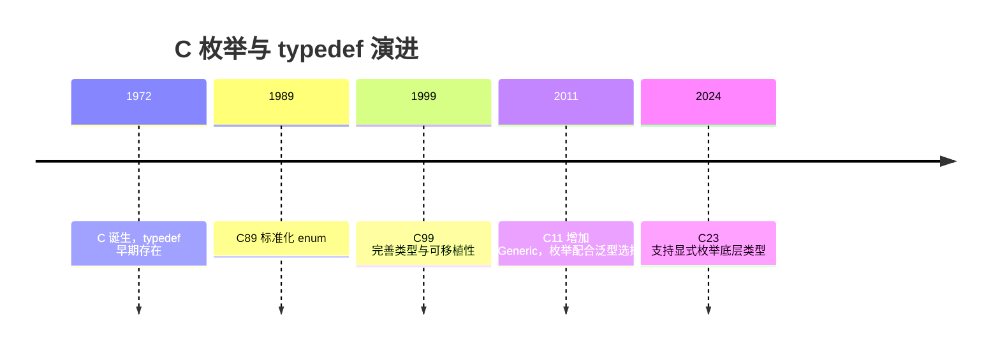
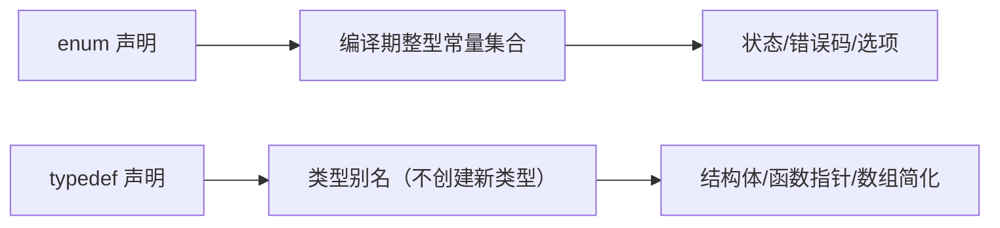

## 1. 学习目标（Bloom 分类）

记忆层面：能够说出 `enum` 的声明语法、枚举常量的默认取值规则（从 0 递增）与显式赋值规则；能够说出 `typedef` 的基本语法（`typedef 原类型 别名`）及其在结构体、联合体、枚举、函数指针、数组类型上的应用。

理解层面：能够解释枚举的底层存储（整数类型，C 标准保证能容纳所有枚举值），解释 `typedef` 不是创建新类型而是类型别名，理解枚举与 `#define` 常量的区别（作用域、类型安全、调试信息）。

应用层面：能够用枚举表达状态机状态、错误码、配置选项；用 `typedef` 简化复杂声明（结构体别名、函数指针类型、定长数组类型），写出可读性更好的头文件。

分析层面：能够分析枚举底层类型的实现差异（编译器可能选择 `int` 或更小类型）、`sizeof(enum)` 的不确定性；分析 `typedef` 与宏在类型检查上的差异。

评价层面：能够评估“枚举 vs 宏 vs 常量”在特定场景的取舍，评估函数指针 typedef 在回调设计中的价值。

创造层面：能够设计带显式值的错误码枚举、带字符串映射的状态机，并用 typedef 构建清晰的回调与表驱动架构。

## 2. 历史动机与发展脉络

C 语言早期没有布尔类型与命名常量机制，开发者用 `#define` 定义魔数，导致类型不安全、作用域泄漏、调试信息缺失。C89（ANSI C，1989）正式标准化 `enum`，提供编译期常量集合；`typedef` 则从 C 的早期版本就存在，用于为类型创建别名，是抽象类型（不透明指针、函数指针）的基石。

C99 允许枚举底层类型由实现选择；C23 标准新增显式底层类型语法（`enum E : int {...}`），并允许枚举项使用属性，进一步收紧行为。`typedef` 在 C23 中继续作为类型别名机制，与 `_Bool`、`_Static_assert` 等特性共同完善类型系统。



## 3. 形式化定义

### 3.1 枚举定义

```c
enum 标签名 {
    枚举常量1 [= 值1],
    枚举常量2 [= 值2],
    ...
};
```

未显式赋值时，第一个常量取 0，后续依次 +1；显式赋值后，后续常量在上一值基础上 +1。枚举常量是编译期整型常量，可参与常量表达式。

枚举变量的取值可以是任意整型值（不限于枚举常量列表），这是 C 的历史行为，也是常见误用来源。

### 3.2 typedef 定义

`typedef` 的语法是“存储类说明符 + 类型 + 别名”，例如：

```c
typedef unsigned long size_t_my;      // 无符号长整型别名
typedef struct Point Point;           // 结构体别名
typedef int (*Handler)(int);          // 函数指针类型别名
typedef int Vector4[4];               // 定长数组类型别名
```

`typedef` 声明不创建新类型，只引入同义词；因此 `typedef int A; typedef int B;` 后 `A` 与 `B` 完全兼容。

### 3.3 枚举与 typedef 组合

```c
typedef enum {
    STATE_IDLE = 0,
    STATE_RUNNING,
    STATE_STOPPED
} State;
```

讲解：这是嵌入式与系统编程中最常见的组合：`typedef enum {...} 类型名;` 同时定义枚举类型与别名，避免每次书写 `enum State`。



## 4. 理论推导与原理解析

### 4.1 枚举的底层类型推导

C 标准要求枚举的底层类型是“能表示所有枚举值”的整型（char、signed/unsigned 整数类型均可）。实现通常选择 `int` 或 `unsigned int`，但若所有值在 `char` 范围内，部分编译器会选更小类型。C23 的显式底层类型语法消除了这一不确定性：

```c
enum Color : unsigned char { RED, GREEN, BLUE }; // C23
```

因此 `sizeof(enum)` 在 C11 及之前不可移植，序列化枚举时不应假设大小。

### 4.2 typedef 的解析规则

typedef 声明遵循 C 的声明语法（declarator 规则）：`typedef int (*FP)(void);` 中 `(*FP)(void)` 是函数指针声明符，`FP` 被绑定为“指向返回 int、无参数函数的指针”类型。复杂声明可以用“从内向外读”的方法解析：`FP` 先解引用为指针，再调用，再取 int。掌握这一规则后，任何 typedef 都可以读懂。

### 4.3 枚举 vs 宏 vs const

`#define RED 0` 是文本替换，无类型、无作用域，可能在宏展开时产生意外；`const int RED = 0` 是运行期对象（非编译期常量，不能用于 case 标签或数组尺寸）；`enum { RED = 0 }` 是编译期常量、有作用域、能参与类型检查（有限）。C23 的 `constexpr` 提供第三种选择，但枚举在状态机与位标志场景仍最常用。

## 5. 代码示例（带详尽注释）

### 5.1 基础枚举

```c
#include <stdio.h>

// 默认取值：MON=0, TUE=1, ..., SUN=6
enum Weekday {
    MON, TUE, WED, THU, FRI, SAT, SUN
};

int main(void) {
    enum Weekday today = WED;
    // 枚举可以比较与算术（底层是整数）
    printf("today = %d\n", today);       // 2
    printf("tomorrow = %d\n", today + 1); // 3
    return 0;
}
```

讲解：默认从 0 递增是枚举的基础行为。输出 `today = 2`。枚举参与算术时退化为基础整型，这是 C 的宽松行为，使用时注意。

### 5.2 显式赋值

```c
#include <stdio.h>

// 显式赋值：错误码通常从 1 开始，0 表示成功
enum ErrorCode {
    ERR_NONE = 0,
    ERR_IO = 1,
    ERR_NET = 2,
    // 位标志可以按位或组合
    FLAG_A = 1 << 0,
    FLAG_B = 1 << 1,
    FLAG_C = 1 << 2
};

int main(void) {
    // 位标志组合
    int flags = FLAG_A | FLAG_C;
    if (flags & FLAG_A) {
        printf("FLAG_A 已设置\n");
    }
    printf("ERR_NET = %d\n", ERR_NET);
    return 0;
}
```

讲解：显式赋值让枚举胜任错误码与位标志。位移表达式（`1 << n`）保证位不重叠；组合结果可能不是枚举常量之一，C 允许这种赋值，但要显式转换为目标类型。

### 5.3 枚举在 switch 中使用

```c
#include <stdio.h>

typedef enum {
    STATE_IDLE,
    STATE_RUNNING,
    STATE_PAUSED,
    STATE_STOPPED
} State;

// 状态机的事件处理：switch 穷举状态
const char* state_name(State s) {
    switch (s) {
        case STATE_IDLE:    return "空闲";
        case STATE_RUNNING: return "运行";
        case STATE_PAUSED:  return "暂停";
        case STATE_STOPPED: return "停止";
        default:            return "未知"; // 防御未知值
    }
}

int main(void) {
    State s = STATE_RUNNING;
    printf("状态：%s\n", state_name(s));
    return 0;
}
```

讲解：枚举与 switch 是状态机的经典组合。`default` 分支防御“枚举变量被赋了列表外的整数值”的 C 特性，保证函数对任意输入都有输出。

### 5.4 typedef 基本用法

```c
#include <stdio.h>

// 基础类型别名：屏蔽平台差异
typedef unsigned char u8;
typedef unsigned short u16;
typedef unsigned int u32;

// 结构体别名：免写 struct 关键字
typedef struct {
    u32 x;
    u32 y;
} Point;

int main(void) {
    u8 byte = 200;          // 别名直接使用
    Point p = {10, 20};     // 无需 struct Point
    printf("byte=%u, p=(%u,%u)\n", byte, p.x, p.y);
    return 0;
}
```

讲解：`typedef struct {...} Point;` 同时完成结构体定义与别名。嵌入式开发常用 `u8/u16/u32` 等宽度别名保证跨平台一致。注意 `typedef` 不能用于在声明时初始化对象。

### 5.5 typedef 与函数指针

```c
#include <stdio.h>

// 回调函数类型：接收 int，返回 int
typedef int (*Callback)(int);

// 两个回调实现
static int double_it(int x) { return x * 2; }
static int triple_it(int x) { return x * 3; }

// 表驱动：回调数组（表格驱动架构）
static const Callback ops[] = { double_it, triple_it };

int main(void) {
    for (int i = 0; i < 2; i++) {
        printf("ops[%d](5) = %d\n", i, ops[i](5));
    }
    return 0;
}
```

讲解：函数指针 typedef 让回调类型可复用、可数组化。表驱动（用数据表代替 if-else 链）是 C 工程的重要架构模式，函数指针数组是其核心载体。

### 5.6 typedef 与定长数组

```c
#include <stdio.h>

// 定长数组类型别名：参数传递时保持“数组语义”
typedef int Vector4[4];

// 传数组指针，避免数组退化为指针
void fill(Vector4 *v) {
    for (int i = 0; i < 4; i++) {
        (*v)[i] = i * i;
    }
}

int main(void) {
    Vector4 arr;
    fill(&arr);
    for (int i = 0; i < 4; i++) {
        printf("arr[%d]=%d\n", i, arr[i]);
    }
    return 0;
}
```

讲解：`typedef int Vector4[4]` 后，`Vector4*` 是指向整个数组的指针，函数参数带上长度信息，防止数组退化为指针导致越界。

### 5.7 typedef 与联合体

```c
#include <stdio.h>
#include <string.h>

// 联合体别名：同一内存按不同类型解释
typedef union {
    unsigned int raw;
    unsigned char bytes[4];
} Word;

int main(void) {
    Word w;
    w.raw = 0x11223344u;
    // 字节序相关：小端机器上 bytes[0]=0x44
    printf("raw=%08x, byte0=%02x\n", w.raw, w.bytes[0]);
    return 0;
}
```

讲解：联合体别名用于协议解析、寄存器访问等场景。注意输出依赖主机字节序，跨平台协议解析应使用移位而非直接读字节。

### 5.8 枚举与字符串映射

```c
#include <stdio.h>

typedef enum {
    LOG_DEBUG,
    LOG_INFO,
    LOG_WARN,
    LOG_ERROR
} LogLevel;

// 枚举到字符串的静态映射表：索引即枚举值
static const char* const level_names[] = {
    "DEBUG", "INFO", "WARN", "ERROR"
};

// 防御性访问：越界返回未知
const char* level_name(LogLevel level) {
    if (level < LOG_DEBUG || level > LOG_ERROR) {
        return "UNKNOWN";
    }
    return level_names[level];
}

int main(void) {
    printf("%s\n", level_name(LOG_WARN));
    return 0;
}
```

讲解：映射表依赖“枚举值连续且从 0 开始”的前提，因此访问前做范围检查。这是枚举序列化与日志系统的常见模式。

## 6. 对比分析

### 6.1 枚举 vs 宏常量

| 维度 | enum | #define |
| --- | --- | --- |
| 类型 | 有枚举类型（弱） | 无类型 |
| 作用域 | 遵循代码块作用域 | 预处理器全局 |
| 调试 | 调试器可显示名称 | 宏不保留名称 |
| 编译期常量 | 是 | 是 |
| 与 switch/case | 配合良好 | 配合良好 |

### 6.2 typedef vs 宏别名

`#define HANDLER int (*)(int)` 也能缩写声明，但宏在语法层面替换，容易出现优先级错误且无类型检查；`typedef` 是语言级别名，解析正确、可读性好。现代 C 代码应使用 typedef。

### 6.3 枚举底层类型在不同标准下的行为

C89-C17 由实现选择底层类型；C23 允许显式指定。跨编译器序列化枚举时应显式转换为基础整型或使用 C23 语法。

## 7. 常见陷阱与最佳实践

陷阱一：枚举常量名全局冲突。同一作用域内枚举常量名不能重复。最佳实践：加前缀（如 `STATE_`、`ERR_`）。

陷阱二：假设枚举连续或从 0 开始。显式赋值或重排后映射表会错位。最佳实践：映射表与范围检查配合。

陷阱三：把枚举当强类型使用。C 的枚举是弱类型，可被赋任意整型。最佳实践：编译器开启 `-Wconversion`、`-Wenum-conversion` 等告警。

陷阱四：对枚举做 `sizeof` 假设。底层类型由实现决定。最佳实践：序列化时使用固定宽度整数。

陷阱五：`typedef struct S {...} S;` 中忘记 `struct S` 自引用时，结构体内必须用 `struct S*`，因为 typedef 名称在该点尚未定义。最佳实践：自引用结构使用标签名。

陷阱六：函数指针 typedef 阅读困难。最佳实践：从内向外读声明，或拆分为两步（先 `typedef` 返回类型函数）。

## 8. 工程实践

### 8.1 错误码头文件设计

```c
// errors.h：统一错误码
#ifndef ERRORS_H
#define ERRORS_H

typedef enum {
    ERR_OK = 0,
    ERR_INVALID_ARG = 1,
    ERR_NOT_FOUND = 2,
    ERR_TIMEOUT = 3,
    ERR_IO = 4,
    ERR_UNKNOWN = 255
} Error;

// 错误码转可读字符串
const char* error_string(Error err);

#endif
```

讲解：头文件用 include guard 防重复包含；错误码从 0 开始且显式赋值；`error_string` 声明让实现与使用分离。这是 C 库的经典接口设计。

### 8.2 状态机实现

```c
// 状态-事件表驱动状态机骨架
typedef enum { S_IDLE, S_BUSY, S_DONE } State;
typedef enum { E_START, E_FINISH } Event;

// 状态转移表：行是状态，列是事件，值是下一状态
static const State transition[3][2] = {
    /* S_IDLE */ { S_BUSY, S_IDLE },
    /* S_BUSY */ { S_BUSY, S_DONE },
    /* S_DONE */ { S_DONE, S_DONE }
};

State next_state(State s, Event e) {
    return transition[s][e];
}
```

讲解：表驱动状态机把转移逻辑从 switch 中抽离为数据，便于生成与验证。枚举值是数组下标，要求枚举连续，用静态断言（`_Static_assert`）保证。

## 9. 案例研究：带字符串映射的日志系统

需求：实现日志级别过滤与级别名输出，级别可扩展。

```c
#include <stdio.h>

// 日志级别：显式赋值保证稳定
typedef enum {
    LOG_LEVEL_DEBUG = 0,
    LOG_LEVEL_INFO = 1,
    LOG_LEVEL_WARN = 2,
    LOG_LEVEL_ERROR = 3
} LogLevel;

// 级别名表：与枚举一一对应
static const char* const kLevelNames[] = {
    "DEBUG", "INFO", "WARN", "ERROR"
};

// 当前过滤级别（全局配置）
static LogLevel g_min_level = LOG_LEVEL_INFO;

// 设置过滤级别，返回旧值
LogLevel set_min_level(LogLevel level) {
    LogLevel old = g_min_level;
    g_min_level = level;
    return old;
}

// 统一日志输出：低于过滤级别不打印
void log_message(LogLevel level, const char* msg) {
    if (level < g_min_level) {
        return;
    }
    // 范围检查后查表
    if (level < LOG_LEVEL_DEBUG || level > LOG_LEVEL_ERROR) {
        printf("[UNKNOWN] %s\n", msg);
        return;
    }
    printf("[%s] %s\n", kLevelNames[level], msg);
}

int main(void) {
    log_message(LOG_LEVEL_DEBUG, "调试信息"); // 被过滤
    log_message(LOG_LEVEL_WARN, "警告信息");  // 输出
    set_min_level(LOG_LEVEL_DEBUG);
    log_message(LOG_LEVEL_DEBUG, "调试信息"); // 现在输出
    return 0;
}
```

讲解：该案例综合枚举（级别）、typedef（别名）、映射表（字符串化）、防御检查（范围校验）与工程结构（过滤策略）。运行输出为 `[WARN] 警告信息` 与 `[DEBUG] 调试信息`。

## 10. 知识要点总结与深入讲解

枚举的本质是“一组有名字的编译期整型常量”，typedef 的本质是“类型的别名”。两者组合产生 C 中最常用的类型定义模式：`typedef enum {...} Name;`。

枚举的弱类型特性是双刃剑：灵活但易错。工程上通过命名前缀、范围检查、编译器告警与静态断言来约束它。

typedef 的阅读技巧是“从内向外”：`int (*Handler)(int)` 中 `Handler` 是指针，指向函数，函数返回 int。掌握声明解析后，函数指针、数组指针等复杂类型不再可怕。

## 11. 参考文献

cppreference, C 语言枚举声明（enum）, 访问日期 2026-08-01, https://zh.cppreference.com/w/c/language/enum

cppreference, C 语言 typedef 声明, 访问日期 2026-08-01, https://zh.cppreference.com/w/c/language/typedef

ISO/IEC 9899:2024（C23）标准中 enum 与 typedef 相关条款；

Microsoft Learn, C Enumeration Declarations, 访问日期 2026-08-01, https://learn.microsoft.com/en-us/cpp/c-language/c-enumeration-declarations

GCC 文档, Warning Options（-Wenum-conversion 等）, 访问日期 2026-08-01, https://gcc.gnu.org/onlinedocs/gcc/Warning-Options.html

## 12. 延伸阅读

结构体与联合体的完整讲解，见 025-c 模块的 struct/union 文档；

指针与函数指针的深入内容，见 025-c 模块的指针文档；

C23 新特性（constexpr、属性、显式枚举底层类型），见 025-c 模块的 C23 文档；

嵌入式系统中的位操作与寄存器映射，见 035-iot 模块相关文档；

黑马程序员 Bilibili 空间（https://space.bilibili.com/37974444 ）提供 C 语言课程；尚硅谷 Bilibili 空间（https://space.bilibili.com/302417610 ）提供 C 语言基础课程。

{{APPENDIX}}
